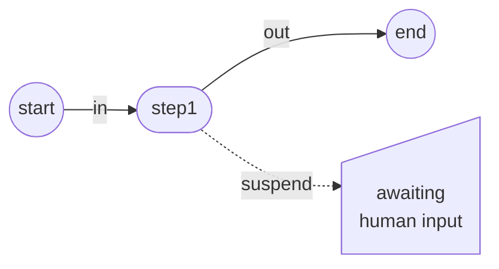
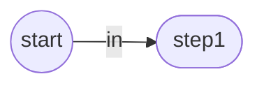

# Diagram styleguide

Diagrams in the docs are Mermaid, written in a `mermaid` code fence. They render
through `src/theme/Mermaid/`, which supplies the colors, fonts, and layout
engine. Never restate those in the diagram.

## Pick a shape

Walk this in order and stop at the first match:

1. Does the node begin or end a run? → circle, `(( start ))`
2. Does it wait on a person? → `id@{ shape: manual-input, label: "..." }`
3. Does it read or write stored data? → `id@{ shape: cyl, label: "..." }`
4. Does it branch on a condition? → diamond, `{approved?}`
5. Otherwise it is a unit of work → stadium, `([step1])`

Shape carries the meaning that survives a grayscale print and a colorblind
reader. Two nodes with different jobs never share a shape.

## Pick an edge

- Solid `-->`: the workflow moves on its own.
- Dotted `-.->`: something outside the workflow has to happen first, such as a
  person replying, an event arriving, or a timer firing.

Label edges with the API name that causes the transition (`suspend`, `resume`,
`out`), not a description of it. A reader matching the diagram to the code
beneath it should find the same word in both.

## Apply color

Three semantic classes exist. Use the class name, never a color:

| Class     | Means                                  |
| --------- | -------------------------------------- |
| `accent`  | the run completed successfully         |
| `pending` | blocked, waiting on something external |
| `danger`  | stopped, rejected, or failed           |

Nodes take a class through `class <node> <name>`. Edges take one through an id
prefixed with the class name:

Color only outcomes. The ordinary path from one step to the next stays neutral,
so the colored parts still mean something when a diagram grows.

## Keep the main path straight

Declare the main path first, in source order, before any branch. ELK lays out
the first chain it reads as the spine and hangs later edges off it. Declare a
branch early and the spine bends around it, which is the single most common way
these diagrams end up looking wrong.

Use `flowchart LR`. Switch to `TB` only when an eight-node diagram runs off the
page on a phone. Past eight nodes, split the diagram or drop to prose.

Never set `layout:` or `look:` in a diagram. The site sets ELK globally, and one
page opting out is how a docs site stops looking like one site.

## Write labels

- Lowercase, except where the API is capitalized.
- Break any label over 16 characters with ` `. Mermaid sizes a node to its
  label, so one long label makes a node that dwarfs the rest of the diagram.
- Eight nodes is the ceiling. Past that, split the diagram or drop to prose.

## Describe the diagram

Every diagram carries both, or a screen reader user gets nothing:

This replaces the alt text an image would have had.

## Never

- Hex colors, `style`, `classDef`, or `linkStyle`. They cannot follow the light
  and dark themes, so they break one of the two modes.
- `var(--token)` anywhere in a diagram. Mermaid's parser rejects the `(-` and
  the page fails to render.
- A diagram that repeats what the sentence above it already said.

## When not to use Mermaid

Mermaid places nodes automatically. If the position of things carries meaning
that automatic layout would destroy, or the subject is a screenshot, keep the
image. See `.claude/skills/docs-diagrams` for the full test.
