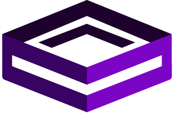
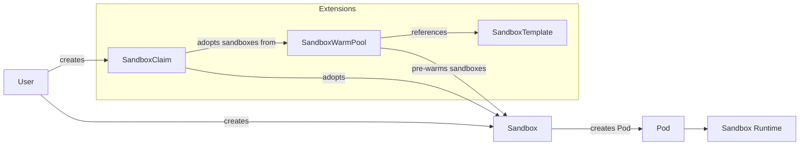

<div align="center">
  

  <h1>Agent Sandbox</h1>
</div>


<p>
  <a href="https://github.com/kubernetes-sigs/agent-sandbox/releases"></a>
  <a href="LICENSE"></a>
</p>

[Website](https://agent-sandbox.sigs.k8s.io) · [Docs](https://agent-sandbox.sigs.k8s.io/docs/) · [DeepWiki](https://deepwiki.com/kubernetes-sigs/agent-sandbox) · [Getting Started](https://agent-sandbox.sigs.k8s.io/docs/getting_started/) · [Examples](examples/) · [Roadmap](roadmap.md)

**agent-sandbox enables easy management of isolated, stateful, singleton workloads, ideal for use cases like AI agent runtimes.**

This project is developing a `Sandbox` Custom Resource Definition (CRD) and controller for Kubernetes, under the umbrella of [SIG Apps](https://github.com/kubernetes/community/tree/master/sig-apps). The goal is to provide a declarative, standardized API for managing workloads that require the characteristics of a long-running, stateful, singleton container with a stable identity, much like a lightweight, single-container VM experience built on Kubernetes primitives.

> [!NOTE]
> **Scope:** Agent Sandbox is a *sandbox orchestrator*. It delegates low-level container isolation to secure "Sandbox Runtimes" (like gVisor or Kata Containers) by managing Pods configured to use these runtimes (via `RuntimeClass`).

## Overview

### Core: Sandbox

The `Sandbox` CRD is the core of agent-sandbox. It provides a declarative API for managing a single, stateful pod with a stable identity and persistent storage. This is useful for workloads that don't fit well into the stateless, replicated model of Deployments or the numbered, stable model of StatefulSets.

Key features of the `Sandbox` CRD include:

*   **Stable Identity:** Each Sandbox has a stable hostname and network identity.
*   **Persistent Storage:** Sandboxes can be configured with persistent storage that survives restarts.
*   **Lifecycle Management:** The Sandbox controller manages the lifecycle of the pod, including creation, scheduled deletion, pausing and resuming.

### Extensions

The `extensions` module provides additional CRDs and controllers that build on the core `Sandbox` API to provide more advanced features.

*   `SandboxTemplate`: Provides a way to define reusable templates for creating Sandboxes, making it easier to manage large numbers of similar Sandboxes.
*   `SandboxClaim`: Allows users to create Sandboxes from a `SandboxWarmPool`, abstracting away the details of the underlying Sandbox configuration.
*   `SandboxWarmPool`: Manages a pool of pre-warmed Sandboxes that can be quickly allocated to users, reducing the time it takes to get a new Sandbox up and running.

## Architecture

agent-sandbox follows the Kubernetes controller pattern. Users create a Sandbox custom resource, and the controller manages the underlying runtime resources.

### Architecture Diagram



## Installation

### Standard Install (Core + Extensions)

Recommended for most users and GitOps engines (Argo CD, Config Sync, kustomize).
`sandbox-with-extensions.yaml` is a single, collision-free asset (the controller is
declared once with extensions enabled):

```sh
# Replace "vX.Y.Z" with a specific version tag (e.g., "v0.1.0") from
# https://github.com/kubernetes-sigs/agent-sandbox/releases
export VERSION="vX.Y.Z"

kubectl apply -f https://github.com/kubernetes-sigs/agent-sandbox/releases/download/${VERSION}/sandbox-with-extensions.yaml
```

You can also render it directly from source with `kubectl kustomize k8s/`.

### Selective Install

If you prefer to install components separately:

```sh
# Core only:
kubectl apply -f https://github.com/kubernetes-sigs/agent-sandbox/releases/download/${VERSION}/sandbox.yaml

# Extensions (opt-in):
kubectl apply -f https://github.com/kubernetes-sigs/agent-sandbox/releases/download/${VERSION}/extensions.yaml
```

### Go SDK

To interact with the agent-sandbox programmatically from Go, use the Go SDK:

```sh
go get sigs.k8s.io/agent-sandbox/clients/go/sandbox@latest
```

The Go SDK currently ships from the repository's root Go module, so repository release tags such as `v0.1.0` are also the Go SDK versions.
For detailed installation and usage instructions, please refer to the [Go SDK README](clients/go/README.md).

### Python SDK

To interact with the agent-sandbox programmatically, you can use the Python SDK. This client library provides a high-level interface for creating and managing sandboxes.

For detailed installation and usage instructions, please refer to the [Python SDK README](clients/python/agentic-sandbox-client/README.md).

### Verify Installation

To check whether agent-sandbox is already installed on your cluster:

```sh
# Check for agent-sandbox CRDs
kubectl get crd sandboxes.agents.x-k8s.io

# Check for the controller deployment
kubectl get deploy agent-sandbox-controller -n agent-sandbox-system
```

If the CRDs and controller deployment are present, agent-sandbox is installed.

### Uninstallation

Before uninstalling, check for any in-use resources to avoid unexpected data loss:

```sh
# Check for existing Sandbox resources across all namespaces
kubectl get sandboxes -A

# Extensions (only if installed):
kubectl get crd sandboxclaims.extensions.agents.x-k8s.io >/dev/null 2>&1 && kubectl get sandboxclaims -A
kubectl get crd sandboxwarmpools.extensions.agents.x-k8s.io >/dev/null 2>&1 && kubectl get sandboxwarmpools -A
kubectl get crd sandboxtemplates.extensions.agents.x-k8s.io >/dev/null 2>&1 && kubectl get sandboxtemplates -A
```

> **Warning**: Deleting the CRDs will **cascade-delete all custom resources** of those types across all namespaces.

Once you have confirmed no resources are in use (or you are prepared to lose them), uninstall by deleting the same manifest you used to install:

```sh
# Standard Install (Core + Extensions):
kubectl delete -f https://github.com/kubernetes-sigs/agent-sandbox/releases/download/${VERSION}/sandbox-with-extensions.yaml

# Or, if you used the Selective Install:
kubectl delete -f https://github.com/kubernetes-sigs/agent-sandbox/releases/download/${VERSION}/extensions.yaml
kubectl delete -f https://github.com/kubernetes-sigs/agent-sandbox/releases/download/${VERSION}/sandbox.yaml
```

For Helm-based installations, see the [Helm chart README](helm/README.md#uninstallation).

## Configuration

For advanced scale and concurrency tuning (e.g., API QPS and worker counts), please see the [Configuration Guide](docs/configuration.md).

## Getting Started

Once you have installed the controller, you can create a simple Sandbox by applying the following YAML to your cluster:

```yaml
apiVersion: agents.x-k8s.io/v1beta1
kind: Sandbox
metadata:
  name: my-sandbox
spec:
  podTemplate:
    spec:
      containers:
      - name: my-container
        image: <IMAGE>
```

This will create a new Sandbox named `my-sandbox` running the image you specify. You can then access the Sandbox using its stable hostname, `my-sandbox`.

For more complex examples, including how to use the extensions, please see the [examples/](examples/) directory.

## Motivation

Kubernetes excels at managing stateless, replicated applications (Deployments) and stable, numbered sets of stateful pods (StatefulSets). However, there's a growing need for an abstraction to handle use cases such as:

*   **Development Environments:** Isolated, persistent, network-accessible cloud environments for developers.
*   **AI Agent Runtimes:** Isolated environments for executing untrusted, LLM-generated code.
*   **Notebooks and Research Tools:** Persistent, single-container sessions for tools like Jupyter Notebooks.
*   **Stateful Single-Pod Services:** Hosting single-instance applications (e.g., build agents, small databases) needing a stable identity without StatefulSet overhead.

While these can be approximated by combining StatefulSets (size 1), Services, and PersistentVolumeClaims, this approach is cumbersome and lacks specialized lifecycle management like hibernation.

## Desired Sandbox Characteristics

We aim for the Sandbox to be vendor-neutral, supporting various runtimes. Key characteristics include:

*   **Strong Isolation:** Supporting different runtimes like gVisor or Kata Containers to provide enhanced security and isolation between the sandbox and the host, including both kernel and network isolation. This is crucial for running untrusted code or multi-tenant scenarios.
*   **Deep hibernation:** Saving state to persistent storage and potentially archiving the Sandbox object.
*   **Automatic resume:** Resuming a sandbox on network connection.
*   **Efficient persistence:** Elastic and rapidly provisioned storage.
*   **Memory sharing across sandboxes:** Exploring possibilities to share memory across Sandboxes on the same host, even if they are primarily non-homogeneous. This capability is a feature of the specific runtime, and users should select a runtime that aligns with their security and performance requirements.
*   **Rich identity & connectivity:** Exploring dual user/sandbox identities and efficient traffic routing without per-sandbox Services.
*   **Programmable:** Encouraging applications and agents to programmatically consume the Sandbox API.

## Roadmap

The current Roadmap can be found at [roadmap.md](roadmap.md).

## Security

For information on the security model, trust boundaries, and mitigations of Agent Sandbox, please refer to the [Threat Model](docs/security/threat_model.md).

## Community, Discussion, Contribution, and Support

This is a community-driven effort, and we welcome collaboration!

**Note on PR Velocity:** To maintain high velocity and keep our queues clean, this project uses stale PR management (30-day auto-stale and 15-day auto-close for inactive PRs) and allows maintainers to fast-track or take over approved community PRs. Please read our [Contributing Guidelines](CONTRIBUTING.md) for our full code review and PR policies.

### AI-Assisted Code Reviews (Experimental)

To help improve our review velocity, we are currently experimenting with AI-assisted code reviews using GitHub Copilot and CodeRabbit as our automated first-pass reviewers. Here is the workflow:

1. Copilot and CodeRabbit will automatically review open PRs (skipping draft PRs and PRs without a signed CLA).
1. After automated reviews are posted, the PR will be labeled `action-required: resolve-copilot-comments`.
   * **⚠️ Important Contribution Note (CLA Requirement):** If you receive a code suggestion from Copilot or CodeRabbit in your PR, please don't directly apply suggestions via the GitHub UI. It will set the AI bot as co-author and break the Kubernetes CLA requirements. For more information, read our [Contributing Guidelines](CONTRIBUTING.md). 
1. **Interacting with AI Reviewers:**
   * **GitHub Copilot:** If your organization or account has Copilot enabled, you can interact with Copilot directly in PR comment threads by tagging `@copilot` or clicking the Copilot sparkle icon to ask questions, explain code, or suggest fixes.
   * **CodeRabbit:** CodeRabbit provides high-level summaries and walkthroughs, and acts as an automated gatekeeper that approves the PR once all issues are resolved. You can interact with it by commenting `@coderabbitai` on your PR (e.g., `@coderabbitai review` to request an incremental re-review, or `@coderabbitai full review` to re-evaluate the entire PR from scratch).
1. After automated review comments are addressed or marked resolved, the PR will be labeled `ready-for-review`.
1. Maintainers will review `ready-for-review` PRs and provide final approval.

We actively welcome your feedback on the quality, relevance, and helpfulness of these automated reviews! As we iterate on this process, we also plan to evaluate and test different AI review tools to find the best fit for our project's workflow.

### Contact Us

Learn how to engage with the Kubernetes community on the [community page](http://kubernetes.io/community/).

You can reach the maintainers of this project at:

- [#agent-sandbox Slack channel](https://kubernetes.slack.com/messages/agent-sandbox)
  - If it's your first time joining the Kubernetes Slack, visit https://slack.k8s.io/ to get an invitation.
  - Log in to [Kubernetes Slack](https://kubernetes.slack.com/) first before joining the channel.
- [#sig-apps Slack channel](https://kubernetes.slack.com/messages/sig-apps) for general sig-apps discussions
- [SIG Apps Mailing List](https://groups.google.com/a/kubernetes.io/g/sig-apps)

Please feel free to open issues, suggest features, and contribute code!

### Code of conduct

Participation in the Kubernetes community is governed by the [Kubernetes Code of Conduct](code-of-conduct.md).

[owners]: https://git.k8s.io/community/contributors/guide/owners.md
[Creative Commons 4.0]: https://git.k8s.io/website/LICENSE
