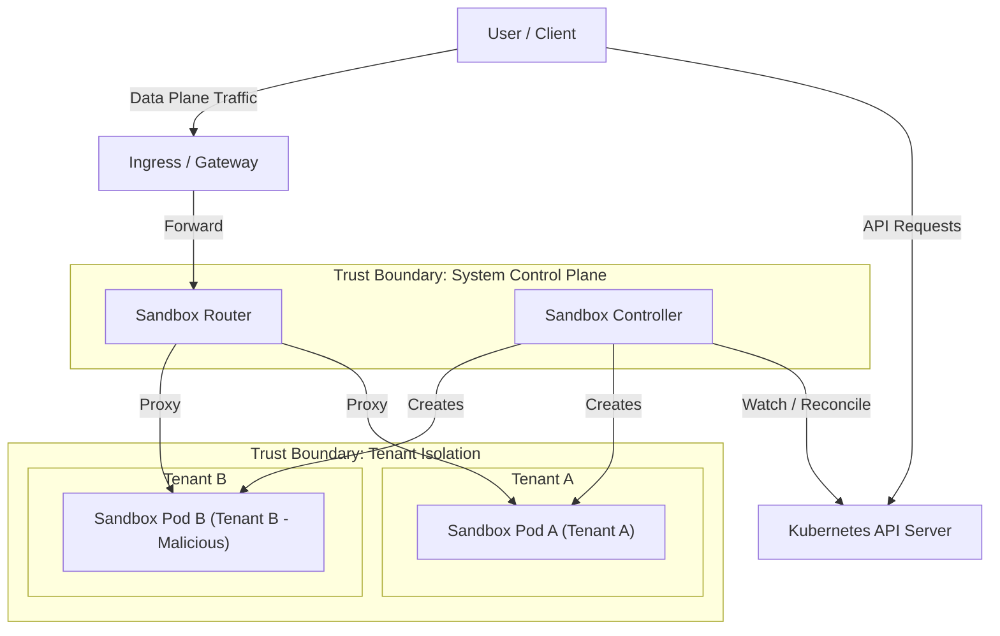

# Agent Sandbox Threat Model

This document outlines the threat model for the Agent Sandbox project. It identifies the trust boundaries, potential threats, and mitigating controls for the system components.

## System Architecture & Components

The Agent Sandbox architecture consists of:
- **Sandbox Controller (Core & Extensions):** Runs in the cluster (typically in a system namespace like `agent-sandbox-system`) with privileges to manage Pods, Services, PVCs, and Sandbox CRDs.
- **Sandbox Pods (Workloads):** Ephemeral Pods created by the controller to run user workloads (e.g., AI agents). These Pods often run untrusted, LLM-generated code.
- **Sandbox Router (Optional):** A reverse proxy that routes external traffic to the correct Sandbox Pod based on HTTP headers (e.g., `X-Sandbox-ID`).
- **Kubernetes API Server:** The control plane that orchestrates all resources.

## Trust Boundaries

1.  **User to Kubernetes API:** Users must be authenticated and authorized via Kubernetes RBAC to interact with Sandbox CRDs.
2.  **System Control Plane to Workloads:** The Sandbox Controller and Sandbox Router are trusted system components. Sandbox Pods (workloads) are untrusted.
3.  **Cross-Tenant Isolation:** Workloads belonging to different tenants (different Sandboxes) must be isolated from each other.
4.  **Workload to Host/Node:** Untrusted code running inside a Sandbox Pod must not be able to compromise the underlying node or host kernel.
5.  **Workload to Control Plane:** Sandbox Pods must not have access to the Kubernetes API server or other control plane components unless explicitly authorized.

## Threats and Mitigations

### 1. Attacks from Untrusted Workloads (Sandbox Pods)

Since Agent Sandboxes are often used to run untrusted, LLM-generated code, the most critical threat vector is a compromised Sandbox Pod attempting to escape isolation or attack other resources.

| Threat | Target | Mitigating Invariant | Suggested/Implemented Mitigations |
| :--- | :--- | :--- | :--- |
| **Container Escape:** Malicious code escapes the container to access the host node. | Host Node / Other Pods | Workloads must run in strongly isolated environments. | **Recommendation:** Use secure container runtimes (e.g., gVisor, Kata Containers) via `RuntimeClass` in the `PodTemplate`. Agent Sandbox itself does not implement isolation but supports configuring these runtimes.  **Enforcement:** Platform administrators can enforce this by defining templates in a `SandboxTemplate` (used by a `SandboxWarmPool`) that pre-configure the secure `runtimeClassName`. |
| **Cross-Tenant Network Attack:** A compromised Sandbox attacks another Sandbox over the network. | Other Sandbox Pods | Network traffic between Sandboxes must be blocked by default. | **Mitigation:** When using `SandboxTemplate`, the controller provides a "Managed NetworkPolicy" mode (default) that automatically generates a strict shared NetworkPolicy: ingress is restricted to the Sandbox Router, and egress is restricted to the public Internet (blocking internal RFC1918 networks and cloud metadata endpoints).  **Warning:** This default-deny posture blocks sidecar ports by default; administrators must explicitly allow them in the `SandboxTemplate` to avoid breaking health checks. |
| **Kubernetes API Abuse:** A compromised Sandbox uses its service account token to access the K8s API. | Kubernetes Control Plane | Sandbox Pods must not have access to the K8s API by default. | **Mitigation:** When provisioned via a `SandboxTemplate`, the controller automatically defaults `automountServiceAccountToken` to `false` when omitted. Explicitly setting it to `true` is an opt-in security exception. For bare `Sandbox` CRDs, administrators should use admission control (like `ValidatingAdmissionPolicy`) to enforce this. |
| **Denial of Service (Resource Exhaustion):** A Sandbox consumes excessive CPU/Memory/Storage, impacting the node. | Host Node / Other Pods | Workloads must be resource-constrained. | **Mitigation:** Define `resources.limits` and `resources.requests` in the `PodTemplate`. System administrators should enforce LimitsRanges in the target namespaces.  **Enforcement:** Default and maximum resource limits should be configured in the `SandboxTemplate` to prevent users from requesting excessive resources. |

### 2. Control Plane and Routing Threats

| Threat | Target | Mitigating Invariant | Suggested/Implemented Mitigations |
| :--- | :--- | :--- | :--- |
| **Traffic Hijacking via Label Spoofing:** A tenant spoofs system labels to hijack traffic destined for another Sandbox. | Sandbox Service / Router | Only the controller may set system-reserved labels. | **Mitigation:** The controller filters out system-reserved keys (e.g., `agents.x-k8s.io/*`) from user-supplied templates. (Detailed in [System Label and Annotation Protection](#detailed-control-system-label-and-annotation-protection) below). |
| **Unauthorized Sandbox Creation:** An unauthorized user creates Sandboxes to consume resources or run malicious code. | Cluster Resources | Only authorized users can create Sandbox resources. | **Mitigation:** Secure the Kubernetes API using RBAC. Restrict access to `Sandbox`, `SandboxClaim`, and `SandboxTemplate` CRDs. |
| **Router Proxy Abuse:** An attacker bypasses the Router to access Sandboxes directly, or uses the Router to proxy to unauthorized destinations. | Sandbox Pods / Internal Network | The Router must only proxy to authorized Sandboxes. | **Mitigation:** **Architecture:** Enforce routing of all tenant traffic through the Sandbox Router. The Router validates the `X-Sandbox-ID` and constructs the target destination using a strict format (`<id>.<namespace>.svc.<cluster-domain>`) where the cluster domain is configurable.  **SSRF Prevention:** The Router validates that `X-Sandbox-Pod-IP` is a valid IP literal and not in a local/restricted class (blocking access to metadata services like `169.254.169.254`). However, since the default authorizer is `AllowAll` (for Python client compatibility), this IP-class check is currently the *only* SSRF defense. It is **recommended** that operators configure a custom authorizer to restrict access to authorized IPs/namespaces. |
| **Router Denial of Service:** An attacker floods the Router with requests or WebSockets, exhausting its resources. | Sandbox Router | The Router must protect itself from resource exhaustion. | **Mitigation:** Rate limiting and connection limits must be enforced at the Ingress/Gateway/Envoy proxy tier. The Go router does not currently implement connection-level limits or timeouts for upgraded connections (like WebSockets); these are roadmap items. |

---

## Detailed Control: System Label and Annotation Protection

This section describes a privilege/isolation threat that arises from propagating user-controlled `PodTemplate` metadata onto the Pods that the Sandbox controller manages, and the controls that mitigate it.

### Background

A `Sandbox` lets a tenant supply a `spec.podTemplate`, including arbitrary `metadata.labels` and `metadata.annotations`. The core controller propagates that metadata to the backing Pod so tenants can organize and select their workloads.

The controller also relies on a set of **system-reserved** label and annotation keys to implement core behavior:

- `agents.x-k8s.io/sandbox-name-hash` — the selector label used by the per-Sandbox headless `Service`. Traffic for a Sandbox is routed to the Pod(s) carrying the matching value.
- `agents.x-k8s.io/propagated-labels`, `agents.x-k8s.io/propagated-annotations`, and `opentelemetry.io/trace-context` — controller-managed annotations.

Extension controllers (warm pool, claim) may set additional system-prefixed labels on the **Sandbox CR** (`metadata.labels`, `spec.podTemplate`, etc.). The core Sandbox reconciler does not propagate those to Pods; extension controllers own that lifecycle separately.

### Threat

**Spoofing / cross-tenant traffic hijack via reserved-key injection.**

If user-supplied template metadata is propagated verbatim, a tenant can set a system-reserved key to a value of their choosing. The highest-impact case is the Service selector label:

1. Tenant A creates `Sandbox A`; its Service selects Pods labeled `agents.x-k8s.io/sandbox-name-hash=<hash(A)>`.
2. Tenant B (malicious) creates `Sandbox B` with `spec.podTemplate.metadata.labels["agents.x-k8s.io/sandbox-name-hash"] = <hash(A)>`.
3. Tenant B's Pod now also matches Sandbox A's Service selector, so traffic intended for Sandbox A can be delivered to the attacker's Pod (a network-isolation bypass / traffic-hijack primitive).

Related abuses: forging system-prefixed labels or overwriting controller-managed annotations such as `agents.x-k8s.io/pod-name`.

### Mitigations

The core controller treats any label/annotation key under `agents.x-k8s.io/` or `extensions.agents.x-k8s.io/` (and the trace-context annotation) as **system-reserved** and never lets user-supplied `PodTemplate` metadata set them:

- **Create path (`reconcilePod`)** and **adoption path (`updatePodMetadata`)** filter out system-reserved keys from the user template before applying them.
- The Service selector label `agents.x-k8s.io/sandbox-name-hash` is assigned by the controller **after** merging user labels, so it cannot be overridden.
- On adoption/update, system-reserved keys that an older (vulnerable) controller recorded in the `propagated-labels` / `propagated-annotations` lists are scrubbed from the Pod — except the controller-owned name-hash label and the controller-managed annotations (`propagated-labels`, `propagated-annotations`). Combined with always (re)setting the name-hash label to the controller's value, this prevents a stale or spoofed Service-selector label from surviving adoption.
- System labels on `Sandbox.metadata.labels` are **not** copied to Pods by the core controller. Only non-system keys from `spec.podTemplate` are propagated.

### Out of Scope

- Extension controllers manage their own labels on Sandbox CRs and may patch Pod metadata through separate reconciliation paths. The core controller intentionally does not encode extension owner-reference or warm-pool tracking logic.
- The value of the name hash is still derived with FNV-1a. The label-protection controls above hold regardless of the hash algorithm; strengthening the hash (e.g. to a truncated SHA-256) is tracked separately.
- Network policy is the primary, defense-in-depth control for tenant isolation; this mitigation removes a control-plane bypass of the Service-based routing.
