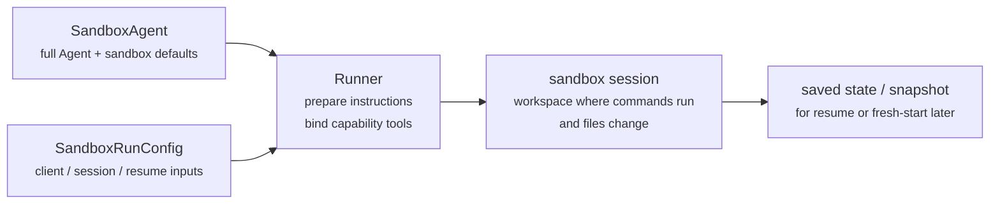
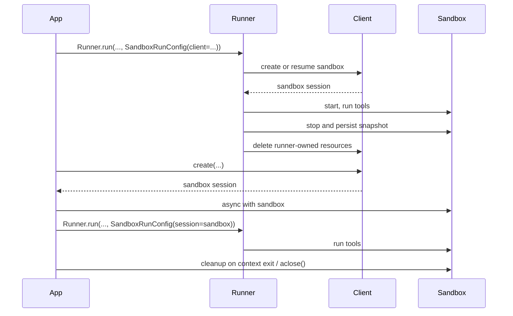

---
search:
  exclude: true
---
# 概念

!!! warning "ベータ機能"

    サンドボックスエージェントはベータ版です。一般提供までに API の詳細、デフォルト、サポートされる機能が変更される可能性があり、今後さらに高度な機能が追加される予定です。

最新のエージェントは、ファイルシステム上の実際のファイルを操作できる場合に最も効果的に機能します。**サンドボックスエージェント**は、専用ツールやシェルコマンドを使用して、大規模なドキュメントセットの検索や操作、ファイルの編集、成果物の生成、コマンドの実行を行えます。サンドボックスは、エージェントがユーザーに代わって作業するために利用できる永続的なワークスペースをモデルに提供します。Agents SDKのサンドボックスエージェントを使用すると、サンドボックス環境と組み合わせたエージェントを簡単に実行できます。また、適切なファイルをファイルシステムに配置し、サンドボックスをオーケストレーションして、大規模なタスクを簡単に開始、停止、再開できます。

エージェントが必要とするデータを中心にワークスペースを定義します。GitHub リポジトリ、ローカルのファイルやディレクトリ、合成されたタスクファイル、S3 や Azure Blob Storage などのリモートファイルシステム、およびその他の指定したサンドボックス入力から開始できます。

<div class="sandbox-harness-image" markdown="1">


</div>

`SandboxAgent` は引き続き `Agent` です。`instructions`、`prompt`、`tools`、`handoffs`、`mcp_servers`、`model_settings`、`output_type`、ガードレール、フックなど、通常のエージェントインターフェースを維持し、通常の `Runner` API を通じて実行されます。変わるのは実行境界です。

- `SandboxAgent` は、通常のエージェント設定に加え、`default_manifest`、`base_instructions`、`run_as` などのサンドボックス固有のデフォルト、およびファイルシステムツール、シェルアクセス、スキル、メモリ、コンパクションなどの機能を含む、エージェント自体を定義します。
- `Manifest` は、ファイル、リポジトリ、マウント、環境など、新しいサンドボックスワークスペースに必要な初期内容とレイアウトを宣言します。
- サンドボックスセッションは、コマンドが実行され、ファイルが変更される、稼働中の分離環境です。
- [`SandboxRunConfig`][agents.run_config.SandboxRunConfig] は、サンドボックスを直接注入する、シリアライズされたサンドボックスセッション状態から再接続する、サンドボックスクライアントを通じて新しいサンドボックスセッションを作成するなど、この実行がサンドボックスセッションを取得する方法を決定します。
- 保存されたサンドボックス状態とスナップショットを使用すると、後続の実行で以前の作業に再接続したり、保存済みの内容から新しいサンドボックスセッションを初期化したりできます。

`Manifest` は、新しいセッションのワークスペース契約であり、稼働中のすべてのサンドボックスに関する完全な信頼できる情報源ではありません。実行で有効になるワークスペースは、再利用されたサンドボックスセッション、シリアライズされたサンドボックスセッション状態、または実行時に選択されたスナップショットから取得される場合もあります。

このページ全体で「サンドボックスセッション」とは、サンドボックスクライアントによって管理される稼働中の実行環境を意味します。これは、[セッション](../sessions/index.md)で説明されている SDK の会話用 [`Session`][agents.memory.session.Session] インターフェースとは異なります。

外側のランタイムは引き続き、承認、トレーシング、ハンドオフ、および実行の再開に必要な状態の追跡を担います。サンドボックスセッションは、コマンド、ファイル変更、環境の分離を担います。この分担は、モデルの中核となる部分です。

### 各構成要素の関係

サンドボックス実行では、エージェント定義と実行ごとのサンドボックス設定を組み合わせます。Runner はエージェントを準備して稼働中のサンドボックスセッションにバインドし、後続の実行に備えて状態を保存できます。



サンドボックス固有のデフォルトは `SandboxAgent` に保持します。実行ごとのサンドボックスセッションの選択は `SandboxRunConfig` に保持します。

ライフサイクルは次の 3 つのフェーズで考えます。

1. `SandboxAgent`、`Manifest`、および各種機能を使用して、エージェントと新しいワークスペースの契約を定義します。
2. サンドボックスセッションを注入、再開、または作成する `SandboxRunConfig` を `Runner` に渡して、実行を開始します。
3. Runner が管理する `RunState`、明示的なサンドボックスの `session_state`、または保存済みのワークスペーススナップショットから、後で作業を継続します。

シェルアクセスが時折使用するツールの 1 つにすぎない場合は、[ツールガイド](../tools.md)のホスト型シェルから始めてください。ワークスペースの分離、サンドボックスクライアントの選択、またはサンドボックスセッションの再開動作が設計の一部である場合は、サンドボックスエージェントを使用してください。

## 適したユースケース

サンドボックスエージェントは、次のようなワークスペース中心のワークフローに適しています。

- コーディングとデバッグ。たとえば、GitHub リポジトリの Issue 報告に対する自動修正をオーケストレーションし、対象を絞ったテストを実行する場合
- ドキュメントの処理と編集。たとえば、ユーザーの財務書類から情報を抽出し、記入済みの税務フォームのドラフトを作成する場合
- ファイルに基づくレビューや分析。たとえば、回答前にオンボーディング資料、生成されたレポート、成果物のバンドルを確認する場合
- 分離されたマルチエージェントパターン。たとえば、各レビュアーやコーディング用サブエージェントに独自のワークスペースを割り当てる場合
- 複数ステップのワークスペースタスク。たとえば、ある実行でバグを修正して後から回帰テストを追加する場合や、スナップショットまたはサンドボックスセッション状態から再開する場合

ファイルへのアクセスや、状態を保持する変更可能なファイルシステムが不要な場合は、引き続き `Agent` を使用してください。シェルアクセスが時折必要になる機能の 1 つにすぎない場合は、ホスト型シェルを追加します。ワークスペース境界自体が機能の一部である場合は、サンドボックスエージェントを使用します。

## サンドボックスクライアントの選択

macOS または Linux でのローカル開発では、`UnixLocalSandboxClient` から始めてください。Windows では、`DockerSandboxClient` またはホスト型プロバイダーを使用します。サポートされているどのプラットフォームでも、コンテナ分離やイメージの同等性が必要な場合は `DockerSandboxClient` に移行し、プロバイダー管理の実行が必要な場合はホスト型プロバイダーに移行します。

ほとんどの場合、[`SandboxRunConfig`][agents.run_config.SandboxRunConfig] でサンドボックスクライアントとそのオプションを変更しても、`SandboxAgent` の定義は同じままです。ローカル、Docker、ホスト型、およびリモートマウントのオプションについては、[サンドボックスクライアント](clients.md)を参照してください。

## 中核となる構成要素

<div class="sandbox-nowrap-first-column-table" markdown="1">

| レイヤー | 主な SDK の構成要素 | 答える内容 |
| --- | --- | --- |
| エージェント定義 | `SandboxAgent`、`Manifest`、各種機能 | どのエージェントを実行し、どの新規セッション用ワークスペース契約から開始するか？ |
| サンドボックス実行 | `SandboxRunConfig`、サンドボックスクライアント、稼働中のサンドボックスセッション | この実行はどのように稼働中のサンドボックスセッションを取得し、作業はどこで実行されるか？ |
| 保存済みのサンドボックス状態 | `RunState` のサンドボックスペイロード、`session_state`、スナップショット | このワークフローは、以前のサンドボックス作業にどのように再接続するか、または保存済みの内容から新しいサンドボックスセッションをどのように初期化するか？ |

</div>

主な SDK の構成要素は、次のようにこれらのレイヤーに対応します。

<div class="sandbox-nowrap-first-column-table" markdown="1">

| 構成要素 | 担当する内容 | 確認すべき問い |
| --- | --- | --- |
| [`SandboxAgent`][agents.sandbox.sandbox_agent.SandboxAgent] | エージェント定義 | このエージェントは何を行い、どのデフォルト設定を引き継ぐべきか？ |
| [`Manifest`][agents.sandbox.manifest.Manifest] | 新規セッション用ワークスペースのファイルとフォルダー | 実行開始時に、どのファイルとフォルダーがファイルシステムに存在するべきか？ |
| [`Capability`][agents.sandbox.capabilities.capability.Capability] | サンドボックスネイティブの動作 | どのツール、instructions の断片、またはランタイム動作をこのエージェントに付加するべきか？ |
| [`SandboxRunConfig`][agents.run_config.SandboxRunConfig] | 実行ごとのサンドボックスクライアントとサンドボックスセッションの取得元 | この実行ではサンドボックスセッションを注入、再開、作成のどれで取得するべきか？ |
| [`RunState`][agents.run_state.RunState] | Runner が管理する保存済みのサンドボックス状態 | Runner が管理していた以前のワークフローを再開し、そのサンドボックス状態を自動的に引き継いでいるか？ |
| [`SandboxRunConfig.session_state`][agents.run_config.SandboxRunConfig.session_state] | 明示的にシリアライズされたサンドボックスセッション状態 | `RunState` の外部ですでにシリアライズしたサンドボックス状態から再開したいか？ |
| [`SandboxRunConfig.snapshot`][agents.run_config.SandboxRunConfig.snapshot] | 新しいサンドボックスセッション用に保存されたワークスペース内容 | 新しいサンドボックスセッションを保存済みのファイルや成果物から開始するべきか？ |

</div>

実用的な設計順序は次のとおりです。

1. `Manifest` で新規セッション用ワークスペース契約を定義します。
2. `SandboxAgent` でエージェントを定義します。
3. 組み込み機能またはカスタム機能を追加します。
4. `RunConfig(sandbox=SandboxRunConfig(...))` で、各実行がサンドボックスセッションを取得する方法を決定します。

## サンドボックス実行の準備

実行時に、Runner はその定義を具体的なサンドボックス対応の実行に変換します。

1. `SandboxRunConfig` からサンドボックスセッションを解決します。`session=...` を渡した場合、その稼働中のサンドボックスセッションを再利用します。それ以外の場合は、`client=...` を使用してセッションを作成または再開します。
2. 実行で有効になるワークスペース入力を決定します。実行でサンドボックスセッションを注入または再開する場合は、既存のサンドボックス状態が優先されます。それ以外の場合、Runner は一度限りのマニフェストオーバーライド、または `agent.default_manifest` から開始します。このため、すべての実行で最終的な稼働中のワークスペースが `Manifest` だけで決まるわけではありません。
3. 各機能が生成されたマニフェストを処理できるようにします。これにより、最終的なエージェントを準備する前に、機能によってファイル、マウント、その他のワークスペーススコープの動作を追加できます。
4. 最終的な instructions を固定順序で構築します。まず SDK のデフォルトのサンドボックスプロンプト、または明示的にオーバーライドした場合は `base_instructions`、次に `instructions`、続いて機能の instructions の断片、リモートマウントのポリシーテキスト、レンダリングされたファイルシステムツリーの順です。
5. 機能の tools を稼働中のサンドボックスセッションにバインドし、通常の `Runner` API を通じて準備済みのエージェントを実行します。

サンドボックス化によって、ターンの意味は変わりません。ターンは引き続きモデルの 1 ステップであり、単一のシェルコマンドやサンドボックスアクションではありません。サンドボックス側の操作とターンの間に、固定された 1 対 1 の対応はありません。一部の作業はサンドボックス実行レイヤー内に留まることがありますが、他のアクションでは、ツールの実行結果、承認、その他の状態など、別のモデルステップを必要とする情報が返されます。実用上は、サンドボックスでの作業後にエージェントランタイムが別のモデル応答を必要とする場合にのみ、次のターンが消費されます。

これらの準備ステップがあるため、`default_manifest`、`instructions`、`base_instructions`、`capabilities`、`run_as` は、`SandboxAgent` を設計するときに考慮すべき主なサンドボックス固有のオプションです。

## `SandboxAgent` のオプション

通常の `Agent` フィールドに加えて、次のサンドボックス固有のオプションがあります。

<div class="sandbox-nowrap-first-column-table" markdown="1">

| オプション | 最適な用途 |
| --- | --- |
| `default_manifest` | Runner が作成する新しいサンドボックスセッションのデフォルトワークスペース。 |
| `instructions` | SDK のサンドボックスプロンプトの後に追加される、役割、ワークフロー、成功基準。 |
| `base_instructions` | SDK のサンドボックスプロンプトを置き換える、高度なエスケープハッチ。 |
| `capabilities` | このエージェントとともに引き継ぐサンドボックスネイティブの tools と動作。 |
| `run_as` | シェルコマンド、ファイル読み取り、パッチなど、モデル向けサンドボックスツールで使用するユーザー ID。 |

</div>

サンドボックスクライアントの選択、サンドボックスセッションの再利用、マニフェストのオーバーライド、スナップショットの選択は、エージェントではなく [`SandboxRunConfig`][agents.run_config.SandboxRunConfig] に指定します。

### `default_manifest`

`default_manifest` は、Runner がこのエージェント用に新しいサンドボックスセッションを作成するときに使用するデフォルトの [`Manifest`][agents.sandbox.manifest.Manifest] です。エージェントが通常開始時に必要とするファイル、リポジトリ、補助資料、出力ディレクトリ、マウントに使用します。

これはデフォルトにすぎません。実行では `SandboxRunConfig(manifest=...)` を使用してオーバーライドでき、再利用または再開されたサンドボックスセッションでは既存のワークスペース状態が維持されます。

### `instructions` と `base_instructions`

異なるプロンプト間でも維持する必要がある短いルールには、`instructions` を使用します。`SandboxAgent` では、これらの instructions が SDK のサンドボックス基本プロンプトの後に追加されるため、組み込みのサンドボックスガイダンスを維持しながら、独自の役割、ワークフロー、成功基準を追加できます。

SDK のサンドボックス基本プロンプトを置き換えたい場合にのみ、`base_instructions` を使用してください。ほとんどのエージェントでは設定するべきではありません。

<div class="sandbox-nowrap-first-column-table" markdown="1">

| 配置先 | 用途 | 例 |
| --- | --- | --- |
| `instructions` | エージェントの安定した役割、ワークフロールール、成功基準。 | 「オンボーディング書類を確認してからハンドオフする。」「最終ファイルを `output/` に書き込む。」 |
| `base_instructions` | SDK のサンドボックス基本プロンプトの完全な置き換え。 | カスタムの低レベルサンドボックスラッパープロンプト。 |
| ユーザープロンプト | この実行における一度限りのリクエスト。 | 「このワークスペースを要約してください。」 |
| マニフェスト内のワークスペースファイル | より長いタスク仕様、リポジトリローカルの instructions、または範囲を限定した参考資料。 | `repo/task.md`、ドキュメントバンドル、サンプルパケット。 |

</div>

`instructions` の適切な使用例には、次のものがあります。

- [examples/sandbox/unix_local_pty.py](https://github.com/openai/openai-agents-python/blob/main/examples/sandbox/unix_local_pty.py) では、PTY 状態が重要な場合に、エージェントを 1 つの対話型プロセス内に維持します。
- [examples/sandbox/handoffs.py](https://github.com/openai/openai-agents-python/blob/main/examples/sandbox/handoffs.py) では、サンドボックスレビュアーが確認後にユーザーへ直接回答することを禁止します。
- [examples/sandbox/tax_prep.py](https://github.com/openai/openai-agents-python/blob/main/examples/sandbox/tax_prep.py) では、最終的に記入されたファイルが実際に `output/` に配置されることを必須とします。
- [examples/sandbox/docs/coding_task.py](https://github.com/openai/openai-agents-python/blob/main/examples/sandbox/docs/coding_task.py) では、正確な検証コマンドを固定し、`SandboxRunConfig.cwd` が未設定の場合にパッチパスがワークスペースルートからの相対パスになることを明確にします。

ユーザーの一度限りのタスクを `instructions` にコピーすること、マニフェストに含めるべき長い参考資料を埋め込むこと、組み込み機能がすでに注入するツールドキュメントを繰り返すこと、モデルが実行時に必要としないローカルインストールの注意事項を混在させることは避けてください。

`instructions` を省略しても、SDK はデフォルトのサンドボックスプロンプトを含めます。低レベルのラッパーにはそれで十分ですが、ユーザー向けのほとんどのエージェントでは、明示的な `instructions` も指定する必要があります。

### `capabilities`

機能は、サンドボックスネイティブの動作を `SandboxAgent` に付加します。実行開始前にワークスペースを構成し、サンドボックス固有の instructions を追加し、稼働中のサンドボックスセッションにバインドされる tools を公開し、そのエージェントのモデル動作や入力処理を調整できます。

組み込み機能には次のものがあります。

<div class="sandbox-nowrap-first-column-table" markdown="1">

| 機能 | 追加する場合 | 備考 |
| --- | --- | --- |
| `Shell` | エージェントにシェルアクセスが必要な場合。 | `exec_command` を追加し、サンドボックスクライアントが PTY 操作をサポートする場合は `write_stdin` も追加します。 |
| `Filesystem` | エージェントがファイルを編集するか、ローカル画像を確認する必要がある場合。 | `apply_patch` と `view_image` を追加します。相対パスはデフォルトでワークスペースルートを使用し、設定されている場合は `SandboxRunConfig.cwd` を使用します。 |
| `Skills` | サンドボックス内でスキルの検出とマテリアライズを行う場合。 | `.agents` または `.agents/skills` を手動でマウントするよりも、こちらを推奨します。`Skills` がスキルのインデックス作成とサンドボックスへのマテリアライズを行います。 |
| `Memory` | 後続の実行でメモリ成果物を読み取るか生成する必要がある場合。 | `Shell` が必要です。実行中にメモリ成果物を更新する場合は、`Filesystem` も必要です。 |
| `Compaction` | 長時間実行されるフローで、コンパクション項目の後にコンテキストを削減する必要がある場合。 | モデルのサンプリングと入力処理を調整します。 |

</div>

デフォルトでは、`SandboxAgent.capabilities` は `Capabilities.default()` を使用し、これには `Filesystem()`、`Shell()`、`Compaction()` が含まれます。`capabilities=[...]` を渡すと、そのリストがデフォルトを置き換えるため、引き続き使用したいデフォルト機能も含めてください。

`view_image` ツールは、ファイル名の拡張子ではなくファイル内容から、PNG、JPEG、GIF、WebP、BMP、TIFF のラスター画像を識別します。ラスター画像の拡張子を持つファイルでも、内容がサポートされていない場合は拒否されます。一方、サポートされるラスター画像の内容であれば、ファイル名に画像拡張子がなくても読み込めます。`.svg` および `.svgz` ファイルについては、ファイル内容からの SVG マークアップの認識に加え、ファイル名に基づく互換性も維持されます。

スキルについては、希望するマテリアライズ方法に応じて取得元を選択します。

- `Skills(lazy_from=LocalDirLazySkillSource(...))` は、モデルが最初にインデックスを検出し、必要なものだけを読み込めるため、大規模なローカルスキルディレクトリに適したデフォルトです。
- `LocalDirLazySkillSource(source=LocalDir(src=...))` は、SDK プロセスが実行されているファイルシステムから読み取ります。サンドボックスイメージやワークスペース内にのみ存在するパスではなく、元のホスト側スキルディレクトリを渡してください。
- `Skills(from_=LocalDir(src=...))` は、事前にステージングしたい小規模なローカルバンドルに適しています。
- `Skills(from_=GitRepo(repo=..., ref=...))` は、スキル自体をリポジトリから取得する場合に適しています。

`LocalDir.src` は SDK ホスト上のソースパスです。`skills_path` は、`load_skill` が呼び出されたときにスキルをステージングする、サンドボックスワークスペース内の相対的な宛先パスです。

スキルがすでに `.agents/skills/<name>/SKILL.md` のような場所に保存されている場合は、`LocalDir(...)` をそのソースルートに向けたうえで、引き続き `Skills(...)` を使用して公開します。サンドボックス内の異なるレイアウトに依存する既存のワークスペース契約がない限り、デフォルトの `skills_path=".agents"` を維持してください。

適合する場合は、組み込み機能を優先してください。組み込み機能では対応できないサンドボックス固有のツールまたは instructions のインターフェースが必要な場合にのみ、カスタム機能を作成します。

## 概念

### マニフェスト

[`Manifest`][agents.sandbox.manifest.Manifest] は、新しいサンドボックスセッションのワークスペースを記述します。ワークスペースの `root` の設定、ファイルとディレクトリの宣言、ローカルファイルのコピー、Git リポジトリのクローン、リモートストレージマウントの接続、環境変数の設定、ユーザーやグループの定義、およびワークスペース外にある特定の絶対パスへのアクセス許可を行えます。

マニフェストエントリのパスは、ワークスペースからの相対パスです。絶対パスにすることも、`..` を使用してワークスペース外へ移動することもできません。これにより、ローカル、Docker、ホスト型クライアント間でワークスペース契約の移植性が維持されます。

作業開始前にエージェントが必要とする素材には、マニフェストエントリを使用します。

<div class="sandbox-nowrap-first-column-table" markdown="1">

| マニフェストエントリ | 用途 |
| --- | --- |
| `File`、`Dir` | 小規模な合成入力、補助ファイル、出力ディレクトリ。 |
| `LocalFile`、`LocalDir` | サンドボックス内にマテリアライズするホストのファイルまたはディレクトリ。 |
| `GitRepo` | ワークスペース内に取得するリポジトリ。 |
| `S3Mount`、`GCSMount`、`R2Mount`、`AzureBlobMount`、`BoxMount`、`S3FilesMount` などのマウント | サンドボックス内に公開する外部ストレージ。 |

</div>

`Dir` は、合成された子要素から、または出力先として、サンドボックスワークスペース内にディレクトリを作成します。ホストファイルシステムからの読み取りは行いません。既存のホストディレクトリをサンドボックスワークスペースにコピーする場合は、`LocalDir` を使用します。

`LocalFile.src` と `LocalDir.src` は、デフォルトで SDK プロセスの作業ディレクトリを基準に解決されます。`extra_path_grants` で許可されていない限り、ソースはそのベースディレクトリの配下にある必要があります。これにより、ローカルソースのマテリアライズは、サンドボックスマニフェストの他の部分と同じホストパスの信頼境界内に維持されます。

マウントエントリは公開するストレージを記述し、マウント戦略はサンドボックスバックエンドがそのストレージを接続する方法を記述します。マウントオプションとプロバイダーのサポートについては、[サンドボックスクライアント](clients.md#mounts-and-remote-storage)を参照してください。

優れたマニフェスト設計では通常、ワークスペース契約を必要最小限に保ち、長いタスク手順を `repo/task.md` などのワークスペースファイルに配置し、instructions では `repo/task.md` や `output/report.md` などのワークスペース相対パスを使用します。エージェントが `Filesystem` 機能の `apply_patch` ツールでファイルを編集する場合、パッチパスはデフォルトではサンドボックスワークスペースのルートを使用し、設定されている場合は `SandboxRunConfig.cwd` を使用することに注意してください。シェルの `workdir` は使用しません。

エージェントがワークスペース外の具体的な絶対パスを必要とする場合、またはマニフェストが SDK プロセスの作業ディレクトリ外にある信頼済みローカルソースをコピーする必要がある場合にのみ、`extra_path_grants` を使用してください。たとえば、一時的なツール出力用の `/tmp`、読み取り専用ランタイム用の `/opt/toolchain`、サンドボックス内にマテリアライズする生成済みスキルディレクトリなどがあります。許可は、ローカルソースのマテリアライズと SDK のファイル API に適用されます。バックエンドがファイルシステムポリシーを適用できる場合は、シェル実行にも適用されます。

```python
from agents.sandbox import Manifest, SandboxPathGrant

manifest = Manifest(
    extra_path_grants=(
        SandboxPathGrant(path="/tmp"),
        SandboxPathGrant(path="/opt/toolchain", read_only=True),
    ),
)
```

Docker で別のホスト上の絶対パスを、コンテナ内の絶対 POSIX パス `path` にバインドマウントする場合は、`host_path` を設定します。`UnixLocalSandboxClient` は、両方のパスが同一であるパスのみの許可だけをサポートし、`host_path` を拒否します。サンドボックスが変更してはならないホストデータには `read_only=True` を使用し、コピーで十分な場合は `LocalFile` または `LocalDir` を使用します。

`extra_path_grants` を含むマニフェストは、信頼済み設定として扱ってください。アプリケーションが対象のホストパスをすでに承認していない限り、モデル出力やその他の信頼できないペイロードから許可を読み込まないでください。

スナップショットと `persist_workspace()` に含まれるのは、引き続きワークスペースルートのみです。追加で許可されたパスは実行時アクセスであり、永続的なワークスペース状態ではありません。

### 権限

`Permissions` は、マニフェストエントリのファイルシステム権限を制御します。これはサンドボックスがマテリアライズするファイルに関するものであり、モデルの権限、承認ポリシー、API 認証情報に関するものではありません。

デフォルトでは、マニフェストエントリは所有者が読み取り、書き込み、実行でき、グループとその他のユーザーが読み取り、実行できます。ステージングされたファイルを非公開、読み取り専用、または実行可能にする必要がある場合は、これをオーバーライドします。

```python
from agents.sandbox import FileMode, Permissions
from agents.sandbox.entries import File

private_notes = File(
    content=b"internal notes",
    permissions=Permissions(
        owner=FileMode.READ | FileMode.WRITE,
        group=FileMode.NONE,
        other=FileMode.NONE,
    ),
)
```

`Permissions` は、所有者、グループ、その他のユーザーそれぞれのビットと、エントリがディレクトリかどうかを保存します。直接構築するか、`Permissions.from_str(...)` でモード文字列から解析するか、`Permissions.from_mode(...)` で OS モードから導出できます。

ユーザーは、作業を実行できるサンドボックス ID です。その ID をサンドボックス内に存在させる場合は、マニフェストに `User` を追加します。シェルコマンド、ファイル読み取り、パッチなど、モデル向けサンドボックスツールをそのユーザーとして実行する場合は、`SandboxAgent.run_as` を設定します。`run_as` がマニフェストにまだ存在しないユーザーを指している場合、Runner が有効なマニフェストにそのユーザーを追加します。

```python
from agents import Runner
from agents.run import RunConfig
from agents.sandbox import FileMode, Manifest, Permissions, SandboxAgent, SandboxRunConfig, User
from agents.sandbox.entries import Dir, LocalDir
from agents.sandbox.sandboxes.unix_local import UnixLocalSandboxClient

analyst = User(name="analyst")

agent = SandboxAgent(
    name="Dataroom analyst",
    instructions="Review the files in `dataroom/` and write findings to `output/`.",
    default_manifest=Manifest(
        # Declare the sandbox user so manifest entries can grant access to it.
        users=[analyst],
        entries={
            "dataroom": LocalDir(
                src="./dataroom",
                # Let the analyst traverse and read the mounted dataroom, but not edit it.
                group=analyst,
                permissions=Permissions(
                    owner=FileMode.READ | FileMode.EXEC,
                    group=FileMode.READ | FileMode.EXEC,
                    other=FileMode.NONE,
                ),
            ),
            "output": Dir(
                # Give the analyst a writable scratch/output directory for artifacts.
                group=analyst,
                permissions=Permissions(
                    owner=FileMode.ALL,
                    group=FileMode.ALL,
                    other=FileMode.NONE,
                ),
            ),
        },
    ),
    # Run model-facing sandbox actions as this user, so those permissions apply.
    run_as=analyst,
)

result = await Runner.run(
    agent,
    "Summarize the contracts and call out renewal dates.",
    run_config=RunConfig(
        sandbox=SandboxRunConfig(client=UnixLocalSandboxClient()),
    ),
)
```

ファイルレベルの共有ルールも必要な場合は、ユーザーをマニフェストのグループおよびエントリの `group` メタデータと組み合わせます。`run_as` ユーザーは、サンドボックスネイティブのアクションを実行する主体を制御します。`Permissions` は、サンドボックスがワークスペースをマテリアライズした後、そのユーザーが読み取り、書き込み、実行できるファイルを制御します。

### SnapshotSpec

`SnapshotSpec` は、保存済みのワークスペース内容をどこから新しいサンドボックスセッションに復元し、どこへ永続化するかを指定します。これはサンドボックスワークスペースのスナップショットポリシーです。一方、`session_state` は、特定のサンドボックスバックエンドを再開するためのシリアライズされた接続状態です。

ローカルの永続スナップショットには `LocalSnapshotSpec` を使用し、アプリケーションがリモートスナップショットクライアントを提供する場合は `RemoteSnapshotSpec` を使用します。ローカルスナップショットを設定できない場合は、フォールバックとして何もしないスナップショットが使用されます。ワークスペーススナップショットを永続化したくない高度な呼び出し元は、これを明示的に使用することもできます。

```python
from pathlib import Path

from agents.run import RunConfig
from agents.sandbox import LocalSnapshotSpec, SandboxRunConfig
from agents.sandbox.sandboxes.unix_local import UnixLocalSandboxClient

run_config = RunConfig(
    sandbox=SandboxRunConfig(
        client=UnixLocalSandboxClient(),
        snapshot=LocalSnapshotSpec(base_path=Path("/tmp/my-sandbox-snapshots")),
    )
)
```

Runner が新しいサンドボックスセッションを作成すると、サンドボックスクライアントがそのセッション用のスナップショットインスタンスを構築します。開始時にスナップショットを復元できる場合、サンドボックスは実行を続ける前に保存済みのワークスペース内容を復元します。クリーンアップ時には、Runner が所有するサンドボックスセッションがワークスペースをアーカイブし、スナップショットを通じて再び永続化します。

`snapshot` を省略すると、ランタイムは可能な場合にデフォルトのローカルスナップショット保存先を使用しようとします。設定できない場合は、何もしないスナップショットにフォールバックします。マウントされたパスと一時パスは、永続的なワークスペース内容としてスナップショットにコピーされません。

### サンドボックスのライフサイクル

ライフサイクルには、**SDK 所有**と**開発者所有**の 2 つのモードがあります。

<div class="sandbox-lifecycle-diagram" markdown="1">



</div>

サンドボックスを 1 回の実行中だけ存続させる場合は、SDK 所有のライフサイクルを使用します。`client`、必要に応じて `manifest` と `snapshot`、さらに必要なクライアント `options` を渡します。Runner はサンドボックスを作成または再開して起動し、エージェントを実行し、スナップショットに基づくワークスペース状態を永続化し、サンドボックスセッションを終了して、Runner が所有するリソースをクライアントにクリーンアップさせます。

```python
result = await Runner.run(
    agent,
    "Inspect the workspace and summarize what changed.",
    run_config=RunConfig(
        sandbox=SandboxRunConfig(client=UnixLocalSandboxClient()),
    ),
)
```

サンドボックスを事前に作成する、稼働中の 1 つのサンドボックスを複数の実行で再利用する、実行後にファイルを確認する、自分で作成したサンドボックス上でストリーミングする、またはクリーンアップのタイミングを厳密に決定する場合は、開発者所有のライフサイクルを使用します。`session=...` を渡すと、Runner はその稼働中のサンドボックスを使用しますが、自動的には閉じません。

```python
sandbox = await client.create(manifest=agent.default_manifest)

async with sandbox:
    run_config = RunConfig(sandbox=SandboxRunConfig(session=sandbox))
    await Runner.run(agent, "Analyze the files.", run_config=run_config)
    await Runner.run(agent, "Write the final report.", run_config=run_config)
```

通常はコンテキストマネージャーを使用します。開始時にサンドボックスを起動し、終了時にセッションのクリーンアップライフサイクルを実行します。アプリケーションでコンテキストマネージャーを使用できない場合は、ライフサイクルメソッドを直接呼び出します。

```python
sandbox = await client.create(
    manifest=agent.default_manifest,
    snapshot=LocalSnapshotSpec(base_path=Path("/tmp/my-sandbox-snapshots")),
)
try:
    await sandbox.start()
    await Runner.run(
        agent,
        "Analyze the files.",
        run_config=RunConfig(sandbox=SandboxRunConfig(session=sandbox)),
    )
    # Persist a checkpoint of the live workspace before doing more work.
    # `aclose()` also calls `stop()`, so this is only needed for an explicit mid-lifecycle save.
    await sandbox.stop()
finally:
    await sandbox.aclose()
```

`stop()` は、スナップショットに基づくワークスペース内容を永続化するだけで、サンドボックスを終了しません。`aclose()` は完全なセッションクリーンアップ処理です。停止前フックを実行し、`stop()` を呼び出し、サンドボックスリソースを停止して、セッションスコープの依存関係を閉じます。

## `SandboxRunConfig` のオプション

[`SandboxRunConfig`][agents.run_config.SandboxRunConfig] は、サンドボックスセッションの取得元と、新しいセッションの初期化方法を決定する実行ごとのオプションを保持します。

### サンドボックスの取得元

次のオプションは、Runner がサンドボックスセッションを再利用、再開、作成のどれで取得するかを決定します。

<div class="sandbox-nowrap-first-column-table" markdown="1">

| オプション | 使用する場合 | 備考 |
| --- | --- | --- |
| `client` | Runner にサンドボックスセッションの作成、再開、クリーンアップを任せる場合。 | 稼働中のサンドボックス `session` を指定しない限り必須です。 |
| `session` | 稼働中のサンドボックスセッションをすでに自分で作成している場合。 | 呼び出し元がライフサイクルを所有し、Runner はその稼働中のサンドボックスセッションを再利用します。 |
| `session_state` | シリアライズされたサンドボックスセッション状態はあるものの、稼働中のサンドボックスセッションオブジェクトがない場合。 | `client` が必要です。Runner は明示的な状態から再開し、再開されたセッションのライフサイクルを所有します。 |

</div>

実際には、Runner は次の順序でサンドボックスセッションを解決します。

1. `run_config.sandbox.session` を注入した場合、その稼働中のサンドボックスセッションを直接再利用します。
2. それ以外で、`RunState` から実行を再開する場合は、保存されたサンドボックスセッション状態を再開します。
3. それ以外で、`run_config.sandbox.session_state` を渡した場合は、その明示的にシリアライズされたサンドボックスセッション状態から再開します。
4. それ以外の場合、Runner は新しいサンドボックスセッションを作成します。その新しいセッションでは、`run_config.sandbox.manifest` が指定されていればそれを使用し、指定されていなければ `agent.default_manifest` を使用します。

### 新規セッションの入力

次のオプションは、Runner が新しいサンドボックスセッションを作成するときにのみ関係します。

<div class="sandbox-nowrap-first-column-table" markdown="1">

| オプション | 使用する場合 | 備考 |
| --- | --- | --- |
| `manifest` | 新規セッション用ワークスペースを一度限りオーバーライドする場合。 | 省略すると `agent.default_manifest` にフォールバックします。 |
| `snapshot` | 新しいサンドボックスセッションをスナップショットから初期化する場合。 | 再開に似たフローやリモートスナップショットクライアントに便利です。 |
| `options` | サンドボックスクライアントが作成時オプションを必要とする場合。 | Docker イメージ、Modal アプリ名、E2B テンプレート、タイムアウトなど、クライアント固有の設定でよく使用します。 |

</div>

### モデル向け作業ディレクトリ

複数の実行で 1 つのサンドボックスセッションを共有しながら別々のサブディレクトリで作業する場合は、`cwd` に POSIX 形式のワークスペース相対ディレクトリを設定します。Runner が `cwd` を検証するとき、そのディレクトリが存在し、設定されたサンドボックスユーザーからアクセスできる必要があります。新しいセッションでは、Runner が最初にマニフェストをマテリアライズするため、この検証前にマニフェストでディレクトリを作成できます。

```python
from agents import Runner
from agents.run import RunConfig
from agents.sandbox import SandboxRunConfig

result = await Runner.run(
    agent,
    "Work only on task A.",
    run_config=RunConfig(
        sandbox=SandboxRunConfig(
            session=shared_sandbox,
            cwd="tasks/task-a",
        ),
    ),
)
```

組み込みの `exec_command`、`view_image`、`apply_patch` ツールで使用される相対パスは、`cwd` を基準に解決されます。`cwd` の値自体では、絶対パス、`..` などの親ディレクトリ要素、空の値は拒否されます。文字列値にはスラッシュを使用する必要があります。相対的な `PurePath` 値は POSIX 形式に正規化されますが、絶対的な `PurePath` 値は無効なままです。直接使用する `BaseSandboxSession` ファイル API は引き続きワークスペースルートからの相対パスを使用するため、`cwd` は `Manifest.root` やセッションの基礎となるワークスペース境界を変更しません。この設定が変更するのは相対パスの解決方法だけです。実行を `cwd` 内に制限したり、共有セッションのワークスペースポリシーで許可されている他のパスへのアクセスを防止したりするものではありません。

パスを扱うカスタム機能は、モデルが指定した相対パスを解決するときに、バインドされた [`SandboxWorkspaceScope`][agents.sandbox.workspace_paths.SandboxWorkspaceScope] を適用する必要があります。モデル向け作業ディレクトリを分離しながら 1 つのサンドボックスセッションを共有する 2 つの並行実行については、[examples/sandbox/shared_session_workdirs.py](https://github.com/openai/openai-agents-python/blob/main/examples/sandbox/shared_session_workdirs.py) を参照してください。

### マテリアライズの制御

`concurrency_limits` は、並列実行できるサンドボックスのマテリアライズ作業量を制御します。大規模なマニフェストやローカルディレクトリのコピーで、より厳密なリソース制御が必要な場合は、`SandboxConcurrencyLimits(manifest_entries=..., local_dir_files=...)` を使用します。いずれかの値を `None` に設定すると、その制限だけを無効にできます。

`archive_limits` は、アーカイブ展開時の SDK 側のリソースチェックを制御します。SDK のデフォルトしきい値を有効にするには `archive_limits=SandboxArchiveLimits()` を設定し、アーカイブに対してより厳密なリソース制御が必要な場合は `SandboxArchiveLimits(max_input_bytes=..., max_extracted_bytes=..., max_members=...)` などの明示的な値を渡します。SDK のアーカイブリソース制限を適用しないデフォルト動作を維持する場合は `archive_limits=None` のままにし、特定の制限だけを無効にする場合は個別のフィールドを `None` に設定します。

次の点にも注意してください。

- 新規セッション: `manifest=` と `snapshot=` は、Runner が新しいサンドボックスセッションを作成するときにのみ適用されます。
- 再開とスナップショットの違い: `session_state=` は以前にシリアライズされたサンドボックス状態に再接続します。一方、`snapshot=` は保存済みのワークスペース内容から新しいサンドボックスセッションを初期化します。
- クライアント固有のオプション: `options=` はサンドボックスクライアントに依存します。Docker と多くのホスト型クライアントでは必須です。
- 注入された稼働中のセッション: 実行中のサンドボックス `session` を渡すと、機能によるマニフェスト更新で互換性のあるマウント以外のエントリを追加できます。ただし、`manifest.root`、`manifest.environment`、`manifest.users`、`manifest.groups` の変更、既存エントリの削除、エントリ型の置き換え、マウントエントリの追加や変更はできません。
- Runner API: `SandboxAgent` の実行でも、通常の `Runner.run()`、`Runner.run_sync()`、`Runner.run_streamed()` API を使用します。

## 完全なコード例: コーディングタスク

このコーディング形式のコード例は、デフォルトの出発点として適しています。

```python
import asyncio
from pathlib import Path

from agents import ModelSettings, Runner
from agents.run import RunConfig
from agents.sandbox import Manifest, SandboxAgent, SandboxRunConfig
from agents.sandbox.capabilities import (
    Capabilities,
    LocalDirLazySkillSource,
    Skills,
)
from agents.sandbox.entries import LocalDir
from agents.sandbox.sandboxes.unix_local import UnixLocalSandboxClient

EXAMPLE_DIR = Path(__file__).resolve().parent
HOST_REPO_DIR = EXAMPLE_DIR / "repo"
HOST_SKILLS_DIR = EXAMPLE_DIR / "skills"
TARGET_TEST_CMD = "sh tests/test_credit_note.sh"


def build_agent(model: str) -> SandboxAgent[None]:
    return SandboxAgent(
        name="Sandbox engineer",
        model=model,
        instructions=(
            "Inspect the repo, make the smallest correct change, run the most relevant checks, "
            "and summarize the file changes and risks. "
            "Read `repo/task.md` before editing files. Stay grounded in the repository, preserve "
            "existing behavior, and mention the exact verification command you ran. "
            "Use the `$credit-note-fixer` skill before editing files. "
            "This example leaves `SandboxRunConfig.cwd` unset, so `apply_patch` paths stay "
            "relative to the sandbox workspace root and edits still target `repo/...`."
        ),
        # Put repos and task files in the manifest.
        default_manifest=Manifest(
            entries={
                "repo": LocalDir(src=HOST_REPO_DIR),
            }
        ),
        capabilities=Capabilities.default() + [
            Skills(
                lazy_from=LocalDirLazySkillSource(
                    # This is a host path read by the SDK process.
                    # Requested skills are copied into `skills_path` in the sandbox.
                    source=LocalDir(src=HOST_SKILLS_DIR),
                )
            ),
        ],
        model_settings=ModelSettings(tool_choice="required"),
    )


async def main(model: str, prompt: str) -> None:
    result = await Runner.run(
        build_agent(model),
        prompt,
        run_config=RunConfig(
            sandbox=SandboxRunConfig(client=UnixLocalSandboxClient()),
            workflow_name="Sandbox coding example",
        ),
    )
    print(result.final_output)


if __name__ == "__main__":
    asyncio.run(
        main(
            model="gpt-5.6-sol",
            prompt=(
                "Open `repo/task.md`, use the `$credit-note-fixer` skill, fix the bug, "
                f"run `{TARGET_TEST_CMD}`, and summarize the change."
            ),
        )
    )
```

[examples/sandbox/docs/coding_task.py](https://github.com/openai/openai-agents-python/blob/main/examples/sandbox/docs/coding_task.py) を参照してください。このコード例では、Unix ローカル実行間で決定論的に検証できるように、小規模なシェルベースのリポジトリを使用しています。実際のタスクリポジトリは、もちろん Python、JavaScript、その他の任意のものを使用できます。

## 一般的なパターン

上記の完全なコード例から始めてください。多くの場合、サンドボックスクライアント、サンドボックスセッションの取得元、またはワークスペースの取得元だけを変更し、同じ `SandboxAgent` をそのまま維持できます。

### サンドボックスクライアントの切り替え

エージェント定義を同じままにし、実行設定だけを変更します。コンテナ分離やイメージの同等性が必要な場合は Docker を使用し、プロバイダー管理の実行が必要な場合はホスト型プロバイダーを使用します。コード例とプロバイダーオプションについては、[サンドボックスクライアント](clients.md)を参照してください。

### ワークスペースのオーバーライド

エージェント定義を同じままにし、新規セッションのマニフェストだけを入れ替えます。

```python
from agents.run import RunConfig
from agents.sandbox import Manifest, SandboxRunConfig
from agents.sandbox.entries import GitRepo
from agents.sandbox.sandboxes.unix_local import UnixLocalSandboxClient

run_config = RunConfig(
    sandbox=SandboxRunConfig(
        client=UnixLocalSandboxClient(),
        manifest=Manifest(
            entries={
                "repo": GitRepo(repo="openai/openai-agents-python", ref="main"),
            }
        ),
    ),
)
```

エージェントを再構築せず、同じエージェントの役割を異なるリポジトリ、パケット、タスクバンドルに対して実行する場合に使用します。上記の検証済みコーディングのコード例では、一度限りのオーバーライドではなく `default_manifest` を使用して同じパターンを示しています。

### サンドボックスセッションの注入

明示的なライフサイクル制御、実行後の確認、または出力のコピーが必要な場合は、稼働中のサンドボックスセッションを注入します。

```python
from agents import Runner
from agents.run import RunConfig
from agents.sandbox import SandboxRunConfig
from agents.sandbox.sandboxes.unix_local import UnixLocalSandboxClient

client = UnixLocalSandboxClient()
sandbox = await client.create(manifest=agent.default_manifest)

async with sandbox:
    result = await Runner.run(
        agent,
        prompt,
        run_config=RunConfig(
            sandbox=SandboxRunConfig(session=sandbox),
        ),
    )
```

実行後にワークスペースを確認する場合や、すでに起動済みのサンドボックスセッション上でストリーミングする場合に使用します。[examples/sandbox/docs/coding_task.py](https://github.com/openai/openai-agents-python/blob/main/examples/sandbox/docs/coding_task.py) と [examples/sandbox/docker/docker_runner.py](https://github.com/openai/openai-agents-python/blob/main/examples/sandbox/docker/docker_runner.py) を参照してください。

### セッション状態からの再開

`RunState` の外部ですでにサンドボックス状態をシリアライズしている場合は、その状態から Runner に再接続させます。

```python
from agents.run import RunConfig
from agents.sandbox import SandboxRunConfig

serialized = load_saved_payload()
restored_state = client.deserialize_session_state(serialized)

run_config = RunConfig(
    sandbox=SandboxRunConfig(
        client=client,
        session_state=restored_state,
    ),
)
```

サンドボックス状態を独自のストレージやジョブシステムに保存し、`Runner` から直接再開する場合に使用します。シリアライズとデシリアライズのフローについては、[examples/sandbox/extensions/blaxel_runner.py](https://github.com/openai/openai-agents-python/blob/main/examples/sandbox/extensions/blaxel_runner.py) を参照してください。

セッション状態のシリアライズでは、ネイティブの `host_path` 値が省略されます。ホストに基づく許可を再開するには、現在の信頼済みマニフェストを `SandboxRunConfig.manifest` または `agent.default_manifest` で指定してください。指定しない場合、サンドボックスの開始前に再開が失敗します。シリアライズされた入力やその他の信頼できない入力からホストパスを導出しないでください。

セッション状態と `RunState` のシリアライズでは、クラウドマウントの認証情報、認証情報を含む補助設定、コンテナ内での認証情報公開に関する確認も削除されます。マウント済みセッションの再開をサポートするバックエンドでは、状態に編集済みのマウント権限が含まれる場合、現在の信頼済みマニフェストを `SandboxRunConfig.manifest` または `agent.default_manifest` で指定してください。`"data"` という名前のマウントエントリで、マウントスコープの確認が必要な場合は、再開前に `trusted_manifest = trusted_manifest.with_in_container_mount_credential_exposure_acknowledged("data")` を使用してコピー済みマニフェストを保持してください。広範な権限には `trusted_manifest = trusted_manifest.with_in_container_mount_broad_credential_exposure_acknowledged("data")` を使用し、マウントが両方の権限クラスを使用する場合は両方のメソッドを呼び出します。確認が必要な正確なマウントパスをすべて渡してください。Agents SDKは、現在の信頼済みマニフェストが永続化された状態とまったく同じ、認証情報を除いたマウントトポロジーを持つ場合にのみ、認証情報を復元します。信頼済み設定が欠落または一致しない場合、サンドボックスの開始前に再開が失敗します。シリアライズされた状態だけで権限が付与されることはありません。`VercelSandboxClient` はマウント済みセッションを再開できないため、代わりに信頼済みマニフェストを使用して新しいサンドボックスを開始してください。

### スナップショットからの開始

保存済みのファイルや成果物から新しいサンドボックスを初期化します。

```python
from pathlib import Path

from agents.run import RunConfig
from agents.sandbox import LocalSnapshotSpec, SandboxRunConfig
from agents.sandbox.sandboxes.unix_local import UnixLocalSandboxClient

run_config = RunConfig(
    sandbox=SandboxRunConfig(
        client=UnixLocalSandboxClient(),
        snapshot=LocalSnapshotSpec(base_path=Path("/tmp/my-sandbox-snapshot")),
    ),
)
```

新しいサンドボックスセッションを作成する実行で、`agent.default_manifest` だけではなく、保存済みのワークスペース内容から開始する場合に使用します。ローカルスナップショットのフローについては [examples/sandbox/memory.py](https://github.com/openai/openai-agents-python/blob/main/examples/sandbox/memory.py)、リモートスナップショットクライアントについては [examples/sandbox/sandbox_agent_with_remote_snapshot.py](https://github.com/openai/openai-agents-python/blob/main/examples/sandbox/sandbox_agent_with_remote_snapshot.py) を参照してください。

### Git からのスキル読み込み

ローカルのスキル取得元を、リポジトリに基づく取得元へ置き換えます。

```python
from agents.sandbox.capabilities import Capabilities, Skills
from agents.sandbox.entries import GitRepo

capabilities = Capabilities.default() + [
    Skills(from_=GitRepo(repo="sdcoffey/tax-prep-skills", ref="main")),
]
```

スキルバンドルに独自のリリースサイクルがある場合や、複数のサンドボックス間で共有する場合に使用します。[examples/sandbox/tax_prep.py](https://github.com/openai/openai-agents-python/blob/main/examples/sandbox/tax_prep.py) を参照してください。

### tools としての公開

ツールエージェントには、独自のサンドボックス境界を割り当てることも、親の実行で稼働中のサンドボックスを再利用させることもできます。再利用は、高速な読み取り専用の探索エージェントに便利です。別のサンドボックスの作成、初期化、スナップショット作成にコストをかけることなく、親の実行が使用しているものとまったく同じワークスペースを確認できます。

```python
from agents import Runner
from agents.run import RunConfig
from agents.sandbox import FileMode, Manifest, Permissions, SandboxAgent, SandboxRunConfig, User
from agents.sandbox.entries import Dir, File
from agents.sandbox.sandboxes.unix_local import UnixLocalSandboxClient

coordinator = User(name="coordinator")
explorer = User(name="explorer")

manifest = Manifest(
    users=[coordinator, explorer],
    entries={
        "pricing_packet": Dir(
            group=coordinator,
            permissions=Permissions(
                owner=FileMode.ALL,
                group=FileMode.ALL,
                other=FileMode.READ | FileMode.EXEC,
                directory=True,
            ),
            children={
                "pricing.md": File(
                    content=b"Pricing packet contents...",
                    group=coordinator,
                    permissions=Permissions(
                        owner=FileMode.ALL,
                        group=FileMode.ALL,
                        other=FileMode.READ,
                    ),
                ),
            },
        ),
        "work": Dir(
            group=coordinator,
            permissions=Permissions(
                owner=FileMode.ALL,
                group=FileMode.ALL,
                other=FileMode.NONE,
                directory=True,
            ),
        ),
    },
)

pricing_explorer = SandboxAgent(
    name="Pricing Explorer",
    instructions="Read `pricing_packet/` and summarize commercial risk. Do not edit files.",
    run_as=explorer,
)

client = UnixLocalSandboxClient()
sandbox = await client.create(manifest=manifest)

async with sandbox:
    shared_run_config = RunConfig(
        sandbox=SandboxRunConfig(session=sandbox),
    )

    orchestrator = SandboxAgent(
        name="Revenue Operations Coordinator",
        instructions="Coordinate the review and write final notes to `work/`.",
        run_as=coordinator,
        tools=[
            pricing_explorer.as_tool(
                tool_name="review_pricing_packet",
                tool_description="Inspect the pricing packet and summarize commercial risk.",
                run_config=shared_run_config,
                max_turns=2,
            ),
        ],
    )

    result = await Runner.run(
        orchestrator,
        "Review the pricing packet, then write final notes to `work/summary.md`.",
        run_config=shared_run_config,
    )
```

ここでは、親エージェントは `coordinator` として実行され、探索用ツールエージェントは同じ稼働中のサンドボックスセッション内で `explorer` として実行されます。`pricing_packet/` エントリは `other` ユーザーが読み取れるため、探索エージェントはすばやく確認できますが、書き込み権限はありません。`work/` ディレクトリはコーディネーターのユーザーまたはグループだけが利用できるため、探索エージェントを読み取り専用に保ちながら、親は最終成果物を書き込めます。

ツールエージェントに実際の分離が必要な場合は、独自のサンドボックス `RunConfig` を割り当てます。

```python
from docker import from_env as docker_from_env

from agents.run import RunConfig
from agents.sandbox import SandboxAgent, SandboxRunConfig
from agents.sandbox.sandboxes.docker import DockerSandboxClient, DockerSandboxClientOptions

rollout_agent = SandboxAgent(
    name="Rollout Reviewer",
    instructions="Inspect the rollout packet and summarize implementation risk.",
)

rollout_agent.as_tool(
    tool_name="review_rollout_risk",
    tool_description="Inspect the rollout packet and summarize implementation risk.",
    run_config=RunConfig(
        sandbox=SandboxRunConfig(
            client=DockerSandboxClient(docker_from_env()),
            options=DockerSandboxClientOptions(image="python:3.14-slim"),
        ),
    ),
)
```

ツールエージェントが自由に変更を行う、信頼できないコマンドを実行する、または異なるバックエンドやイメージを使用する場合は、別のサンドボックスを使用します。[examples/sandbox/sandbox_agents_as_tools.py](https://github.com/openai/openai-agents-python/blob/main/examples/sandbox/sandbox_agents_as_tools.py) を参照してください。

### ローカルツールおよび MCPとの組み合わせ

同じエージェントで通常の tools も使用しながら、サンドボックスワークスペースを維持します。

```python
from agents.sandbox import SandboxAgent
from agents.sandbox.capabilities import Shell

agent = SandboxAgent(
    name="Workspace reviewer",
    instructions="Inspect the workspace and call host tools when needed.",
    tools=[get_discount_approval_path],
    mcp_servers=[server],
    capabilities=[Shell()],
)
```

ワークスペースの確認がエージェントの仕事の一部にすぎない場合に使用します。[examples/sandbox/sandbox_agent_with_tools.py](https://github.com/openai/openai-agents-python/blob/main/examples/sandbox/sandbox_agent_with_tools.py) を参照してください。

## メモリ

将来のサンドボックスエージェントの実行で以前の実行から学習する必要がある場合は、`Memory` 機能を使用します。メモリは SDK の会話用 `Session` メモリとは別のものです。学んだ内容をサンドボックスワークスペース内のファイルに抽出し、後続の実行でそのファイルを読み取れるようにします。

設定、読み取りと生成の動作、複数ターンの会話、レイアウトの分離については、[エージェントメモリ](memory.md)を参照してください。

## 構成パターン

単一エージェントのパターンを理解したら、次に検討すべき設計上の問題は、より大規模なシステムのどこにサンドボックス境界を配置するかです。

サンドボックスエージェントは、SDK の他の機能とも引き続き組み合わせられます。

- [ハンドオフ](../handoffs.md): サンドボックスを使用しない受付エージェントから、ドキュメントを多く扱う作業をサンドボックスレビュアーへハンドオフします。
- [Agents as tools](../tools.md#agents-as-tools): 複数のサンドボックスエージェントを tools として公開します。通常は、各 `Agent.as_tool(...)` 呼び出しで `run_config=RunConfig(sandbox=SandboxRunConfig(...))` を渡し、それぞれのツールに独自のサンドボックス境界を割り当てます。
- [MCP](../mcp.md) と通常の関数ツール: サンドボックス機能は、`mcp_servers` および通常の Python ツールと共存できます。
- [エージェントの実行](../running_agents.md): サンドボックス実行でも、通常の `Runner` API を使用します。

特に一般的なのは、次の 2 つのパターンです。

- ワークスペースの分離が必要なワークフロー部分だけを、サンドボックスを使用しないエージェントからサンドボックスエージェントへハンドオフする
- オーケストレーターが複数のサンドボックスエージェントを tools として公開し、通常は各 `Agent.as_tool(...)` 呼び出しで個別のサンドボックス `RunConfig` を使用して、それぞれのツールに独自の分離されたワークスペースを割り当てる

### ターンとサンドボックス実行

ハンドオフと Agents-as-toolsの呼び出しは、分けて説明すると理解しやすくなります。

ハンドオフでは、引き続き 1 つのトップレベル実行と 1 つのトップレベルターンループが存在します。アクティブなエージェントは変わりますが、実行がネストされることはありません。サンドボックスを使用しない受付エージェントがサンドボックスレビュアーへハンドオフすると、同じ実行内の次のモデル呼び出しがサンドボックスエージェント用に準備され、そのサンドボックスエージェントが次のターンを担当します。つまり、ハンドオフは、同じ実行の次のターンを担当するエージェントを変更します。[examples/sandbox/handoffs.py](https://github.com/openai/openai-agents-python/blob/main/examples/sandbox/handoffs.py) を参照してください。

`Agent.as_tool(...)` では関係が異なります。外側のオーケストレーターは、1 つの外側のターンを使ってツールを呼び出すことを決定し、そのツール呼び出しによってサンドボックスエージェントのネストされた実行が開始されます。ネストされた実行には、独自のターンループ、`max_turns`、承認、および通常は独自のサンドボックス `RunConfig` があります。ネストされた 1 ターンで完了する場合もあれば、複数のターンが必要な場合もあります。外側のオーケストレーターから見ると、そのすべての作業が 1 回のツール呼び出しの背後で行われるため、ネストされたターンによって外側の実行のターンカウンターが増えることはありません。[examples/sandbox/sandbox_agents_as_tools.py](https://github.com/openai/openai-agents-python/blob/main/examples/sandbox/sandbox_agents_as_tools.py) を参照してください。

承認の動作も同じ区別に従います。

- ハンドオフでは、サンドボックスエージェントが同じ実行のアクティブなエージェントになるため、承認は同じトップレベル実行に留まります
- `Agent.as_tool(...)` では、サンドボックスのツールエージェント内で発生した承認も外側の実行に提示されますが、保存されたネスト実行状態から提示され、外側の実行が再開されたときにネストされたサンドボックス実行が再開されます

## 関連資料

- [クイックスタート](../sandbox_agents.md): サンドボックスエージェントを 1 つ実行します。
- [サンドボックスクライアント](clients.md): ローカル、Docker、ホスト型、マウントのオプションを選択します。
- [エージェントメモリ](memory.md): 以前のサンドボックス実行から得た知見を保存して再利用します。
- [examples/sandbox/](https://github.com/openai/openai-agents-python/tree/main/examples/sandbox): 実行可能なローカル、コーディング、メモリ、ハンドオフ、エージェント構成のパターンです。