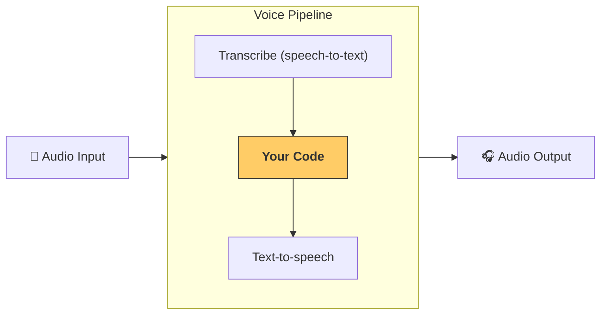

---
search:
  exclude: true
---
# 파이프라인 및 워크플로

[`VoicePipeline`][agents.voice.pipeline.VoicePipeline]은 에이전트 워크플로를 음성 앱으로 쉽게 전환할 수 있게 해주는 클래스입니다. 실행할 워크플로를 전달하면 파이프라인이 입력 오디오 전사, 오디오 종료 감지, 적절한 시점의 워크플로 호출, 워크플로 출력을 다시 오디오로 변환하는 작업을 처리합니다.



## 파이프라인 구성

파이프라인을 생성할 때 다음과 같은 항목을 설정할 수 있습니다.

1. [`workflow`][agents.voice.workflow.VoiceWorkflowBase]은 새 오디오가 전사될 때마다 실행되는 코드입니다.
2. 사용할 [`speech-to-text`][agents.voice.model.STTModel] 및 [`text-to-speech`][agents.voice.model.TTSModel] 모델
3. 다음과 같은 항목을 구성할 수 있는 [`config`][agents.voice.pipeline_config.VoicePipelineConfig]
    - 모델 이름을 모델에 매핑할 수 있는 모델 제공자
    - 트레이싱 비활성화 여부, 오디오 파일 업로드 여부, 워크플로 이름, 트레이스 ID 등을 포함한 트레이싱 설정
    - 프롬프트, 언어, 사용되는 데이터 유형과 같은 TTS 및 STT 모델 설정

## 파이프라인 실행

[`run()`][agents.voice.pipeline.VoicePipeline.run] 메서드를 통해 파이프라인을 실행할 수 있으며, 다음 두 가지 형식으로 오디오 입력을 전달할 수 있습니다.

1. [`AudioInput`][agents.voice.input.AudioInput]은 완전한 오디오 입력이 있고 해당 입력에 대한 결과만 생성하려는 경우에 사용합니다. 화자가 말하기를 마친 시점을 감지할 필요가 없는 경우에 유용합니다. 예를 들어 사전 녹음된 오디오가 있거나 사용자가 말하기를 마친 시점이 명확한 푸시투토크 앱에서 사용할 수 있습니다.
2. [`StreamedAudioInput`][agents.voice.input.StreamedAudioInput]은 사용자가 말하기를 마친 시점을 감지해야 할 수 있는 경우에 사용합니다. 오디오 청크가 감지되는 대로 전달할 수 있으며, 음성 파이프라인은 "활동 감지"라는 프로세스를 통해 적절한 시점에 에이전트 워크플로를 자동으로 실행합니다.

## 결과

음성 파이프라인 실행 결과는 [`StreamedAudioResult`][agents.voice.result.StreamedAudioResult]입니다. 이는 이벤트가 발생하는 대로 스트리밍할 수 있는 객체입니다. [`VoiceStreamEvent`][agents.voice.events.VoiceStreamEvent]에는 다음과 같은 몇 가지 유형이 있습니다.

1. 오디오 청크를 포함하는 [`VoiceStreamEventAudio`][agents.voice.events.VoiceStreamEventAudio]
2. 턴 시작이나 종료와 같은 수명 주기 이벤트를 알려주는 [`VoiceStreamEventLifecycle`][agents.voice.events.VoiceStreamEventLifecycle]
3. 오류 이벤트인 [`VoiceStreamEventError`][agents.voice.events.VoiceStreamEventError]

```python

result = await pipeline.run(input)

async for event in result.stream():
    if event.type == "voice_stream_event_audio":
        # play audio
        pass
    elif event.type == "voice_stream_event_lifecycle":
        # lifecycle
        pass
    elif event.type == "voice_stream_event_error":
        # error
        pass
```

## 모범 사례

### 인터럽션(중단 처리)

현재 Agents SDK는 [`StreamedAudioInput`][agents.voice.input.StreamedAudioInput]에 대한 내장 인터럽션(중단 처리) 기능을 제공하지 않습니다. 대신 감지된 각 턴마다 워크플로가 별도로 실행됩니다. 애플리케이션 내에서 인터럽션(중단 처리)을 처리하려면 [`VoiceStreamEventLifecycle`][agents.voice.events.VoiceStreamEventLifecycle] 이벤트를 수신할 수 있습니다. `turn_started`은 새 턴이 전사되어 처리가 시작됨을 나타냅니다. `turn_ended`은 해당 턴의 모든 오디오가 전송된 후 트리거됩니다. 이러한 이벤트를 사용하여 모델이 턴을 시작할 때 화자의 마이크를 음소거하고, 애플리케이션이 해당 턴과 관련된 모든 오디오 재생을 마친 후 음소거를 해제할 수 있습니다.