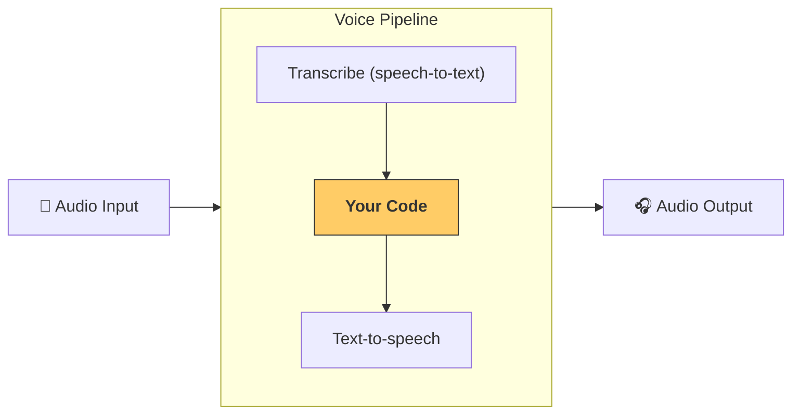

---
search:
  exclude: true
---
# 流水线与工作流

[`VoicePipeline`][agents.voice.pipeline.VoicePipeline] 是一个类，可让您轻松地将智能体工作流转变为语音应用。您传入要运行的工作流，流水线则负责转录输入音频、检测音频何时结束、在适当的时间调用工作流，以及将工作流输出转换回音频。



## 流水线配置

创建流水线时，您可以设置以下几项：

1. [`workflow`][agents.voice.workflow.VoiceWorkflowBase]，即每次转录新音频时运行的代码。
2. 所使用的 [`speech-to-text`][agents.voice.model.STTModel] 和 [`text-to-speech`][agents.voice.model.TTSModel] 模型。
3. [`config`][agents.voice.pipeline_config.VoicePipelineConfig]，可用于配置以下内容：
    - 模型提供商，可将模型名称映射到模型
    - 追踪，包括是否禁用追踪、是否上传音频文件、工作流名称、追踪 ID 等
    - TTS 和 STT 模型的设置，例如提示词、语言和所使用的数据类型。

## 流水线运行

您可以通过 [`run()`][agents.voice.pipeline.VoicePipeline.run] 方法运行流水线。该方法允许您传入以下两种形式的音频输入：

1. 当您已有完整的音频输入，只想为其生成结果时，请使用 [`AudioInput`][agents.voice.input.AudioInput]。它适用于无需检测说话者何时说完的情况，例如已有预录音频，或在按键通话应用中，可以明确知道用户何时说完。
2. 当您可能需要检测用户何时说完时，请使用 [`StreamedAudioInput`][agents.voice.input.StreamedAudioInput]。它允许您在检测到音频块时将其推送进来，语音流水线会通过名为“活动检测”的过程，在适当的时间自动运行智能体工作流。

## 结果

语音流水线的运行结果是 [`StreamedAudioResult`][agents.voice.result.StreamedAudioResult]。借助此对象，您可以在事件发生时以流式方式获取事件。它包含以下几种 [`VoiceStreamEvent`][agents.voice.events.VoiceStreamEvent]：

1. [`VoiceStreamEventAudio`][agents.voice.events.VoiceStreamEventAudio]，其中包含一个音频块。
2. [`VoiceStreamEventLifecycle`][agents.voice.events.VoiceStreamEventLifecycle]，用于通知您轮次开始或结束等生命周期事件。
3. [`VoiceStreamEventError`][agents.voice.events.VoiceStreamEventError]，表示错误事件。

```python

result = await pipeline.run(input)

async for event in result.stream():
    if event.type == "voice_stream_event_audio":
        # play audio
        pass
    elif event.type == "voice_stream_event_lifecycle":
        # lifecycle
        pass
    elif event.type == "voice_stream_event_error":
        # error
        pass
```

## 最佳实践

### 中断

Agents SDK 目前未针对 [`StreamedAudioInput`][agents.voice.input.StreamedAudioInput] 提供任何内置的中断处理机制。相反，检测到的每个轮次都会触发工作流的一次独立运行。如果您希望在应用程序内处理中断，可以监听 [`VoiceStreamEventLifecycle`][agents.voice.events.VoiceStreamEventLifecycle] 事件。`turn_started` 表示新轮次已转录完毕并开始处理。`turn_ended` 会在相应轮次的所有音频分发完毕后触发。您可以利用这些事件，在模型开始一个轮次时将说话者的麦克风静音，并在应用程序播放完与该轮次相关的所有音频后取消静音。