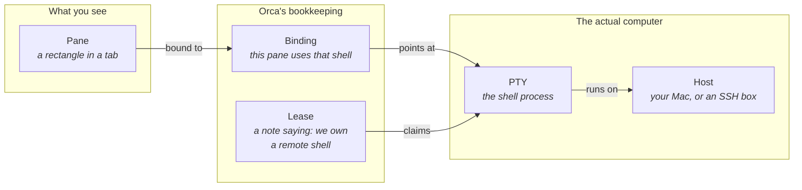
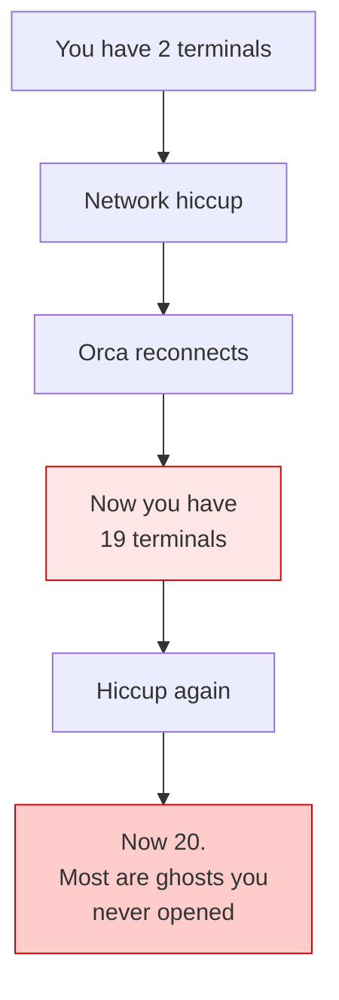
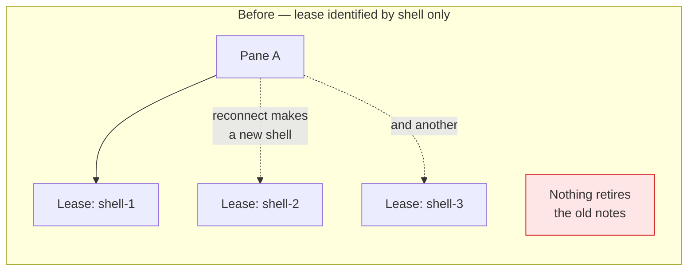
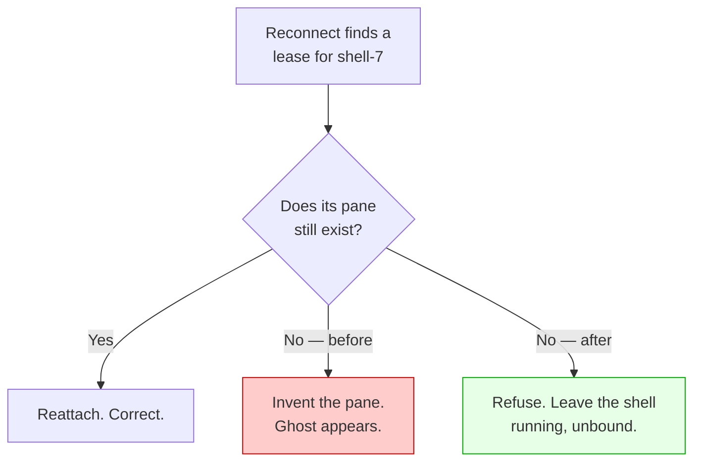
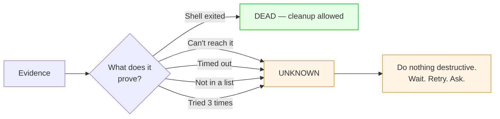
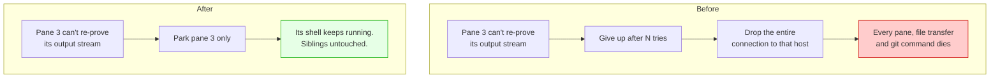
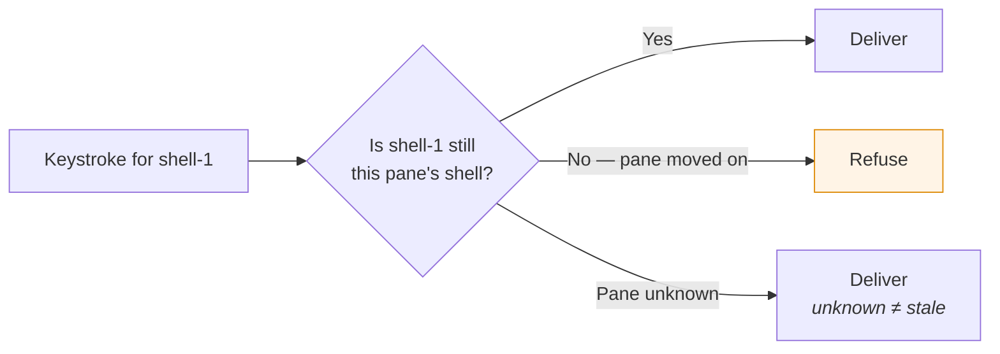
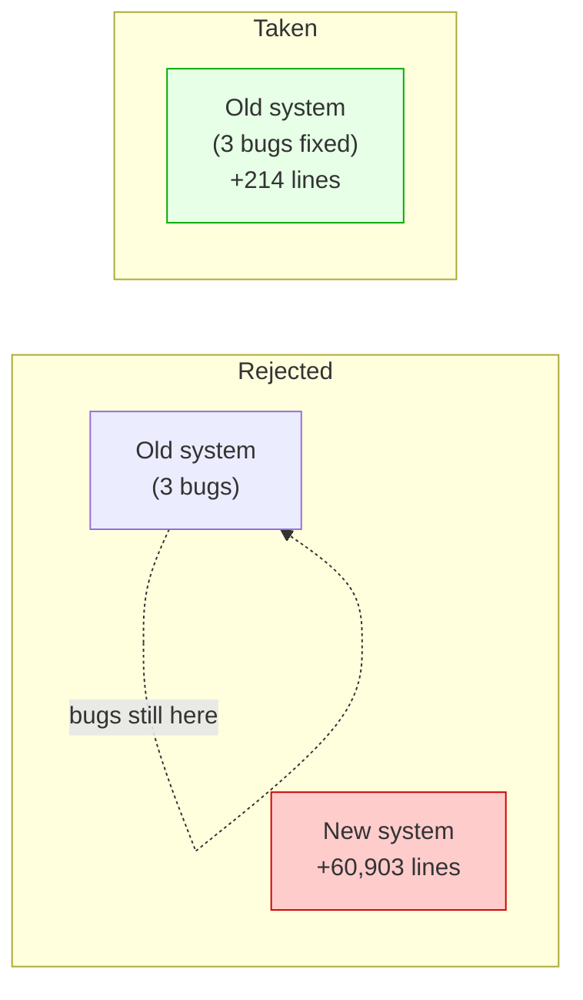

# Terminal session correctness — design overview

Plain-language explanation of what breaks, why, and what we changed. No prior
context needed.

---

## 1. The cast of characters

When you look at a terminal in Orca, five different things are lined up behind
that one rectangle on screen.

The pane is what you see. The **PTY** is the real shell process doing the work.
The **binding** is the note that connects them. On a remote machine there is also
a **lease** — a second note saying "we still own that remote shell."

**Everything that went wrong is one of those notes pointing at the wrong thing.**

---

## 2. The bug, in one picture

You are working on an SSH machine. Your network hiccups. Orca reconnects.

**What should happen:** your two terminals come back, same shells, same work.

**What actually happened:**

That is a real report: **2 → 19 → 20**. Meanwhile the remote machine fills up
with shells nobody is using, until it refuses to start any more.

A second, worse version: your AI coding agent gets **resumed twice**. Two copies
of `claude` writing into the same conversation file. One report had **five**.

---

## 3. Why it happened — three root causes

### Cause 1: the lease forgot which pane it belonged to

Each lease is a note saying "we own remote shell X." The note _had_ a field for
"which pane," but nobody checked it.

Every reconnect added a note and removed none. Next reconnect, Orca dutifully
restored **all** of them — one pane per stale note.

**Fix:** a lease is now identified by _which pane_ it belongs to, not just which
shell. One pane, one live lease. Older notes are retired.

> Retired means **marked expired, not killed**. The remote shell is deliberately
> left running — losing a note is not proof the shell died.

### Cause 2: reconnecting could _create_ panes

The function that says "pane A uses shell X" was also allowed to _invent_ pane A
if it didn't exist. That is correct when you open a new terminal. It is very
wrong when reconnecting.

**Fix:** reattach now says _"bind only, never create."_ Spawning a new terminal
still creates, exactly as before.

### Cause 3: a living shell was reported as dead

The remote side has two different bad-news messages:

| Real meaning                                                  | What it was reported as        |
| ------------------------------------------------------------- | ------------------------------ |
| "This shell is gone."                                         | `SESSION_EXPIRED` ✅ correct   |
| "Shell is fine, I just need to re-establish the output pipe." | `SESSION_EXPIRED` ❌ **wrong** |

Orca's reaction to "expired" is to start a fresh shell — and because it passes
the old session id along, the AI agent gets resumed a second time. **That is the
duplicate-agent bug.**

**Fix:** the second case gets its own message, and respawning now requires
_positive proof_ the shell is gone. Anything unrecognised means "unknown", and
unknown never justifies starting a replacement.

---

## 4. The one rule underneath all of it

**Unknown is not dead.** A disconnect, a timeout, an empty list, or three failed
retries tell you nothing about whether a process is alive. Every bug above is
some version of treating silence as a death certificate.

We also made the liveness check able to _say_ "unknown". It used to return only
yes/no — so a provider whose network was down had no way to express "I can't
see, don't ask me" and answered "no", meaning dead.

---

## 5. What we changed

Six changes, ~214 lines of production code total.

| #   | Change                                          | Stops                                           |
| --- | ----------------------------------------------- | ----------------------------------------------- |
| 1   | Reattach binds, never creates                   | Ghost panes                                     |
| 2   | Leases identified by pane                       | 2 → 19 → 20 growth                              |
| 3   | Heal already-corrupted lease data               | Existing installs stuck at 20                   |
| 4   | "Needs re-establishing" ≠ "expired"             | Duplicate agent resume                          |
| 5   | Liveness can answer "unknown"                   | Live shells declared dead                       |
| 6   | One PTY's failure can't drop the shared channel | One bad pane killing every session on that host |

### Change 6 in a picture

### And a guard on every keystroke

Orca queues your typing. If a pane switches to a different shell mid-flight,
queued keystrokes could land on the **new** shell.

We did this **without changing the wire format** — Orca already keeps two lookup
tables in lock-step, so if they disagree, that _is_ proof the id is stale. No new
data is sent per keystroke.

---

## 6. The approach we rejected

A previous attempt built a **new authority architecture beside the old one**:
+60,903 lines of production code. It fixed **none** of the three root causes —
they were still present, untouched, underneath.

A second proposal of mine was also rejected in review — it would have added a
_second_ identity system beside an existing one, which is the same mistake in
miniature. Three of its factual claims turned out to be false when checked
against the code.

**The lesson both times:** the machinery mostly existed already. The bug was that
it wasn't being _called_.

---

## 7. What is still open

| Thing                    | State                                                                            |
| ------------------------ | -------------------------------------------------------------------------------- |
| The three root causes    | Fixed                                                                            |
| Duplicate agent resume   | Root cause fixed; the codebase still carries 3 older patches for it              |
| Orphaned remote shells   | Left running on purpose. Not reachable from the UI yet — needs a recovery screen |
| The keystroke quarantine | Still needed. We proved deleting it re-opens a real `rm -rf` hazard              |

**On that last one:** there is a safety module that drops the tail of a half-typed
line after a recovery, because `echo hi; rm -rf x` can otherwise arrive as
`cho hi; rm -rf x` — the shell rejects `cho` and then happily runs `rm -rf x`. We
tried to delete it. We proved by experiment that we cannot, yet.
