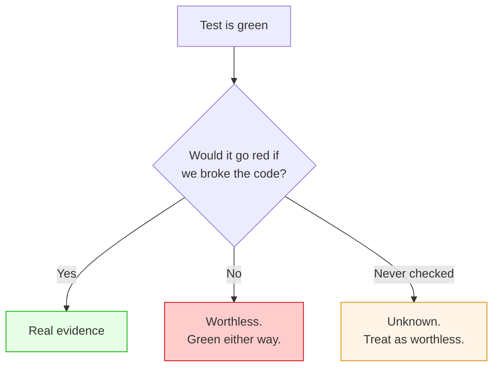
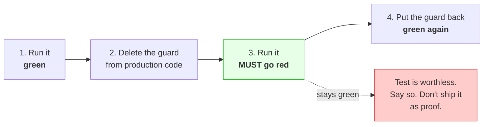
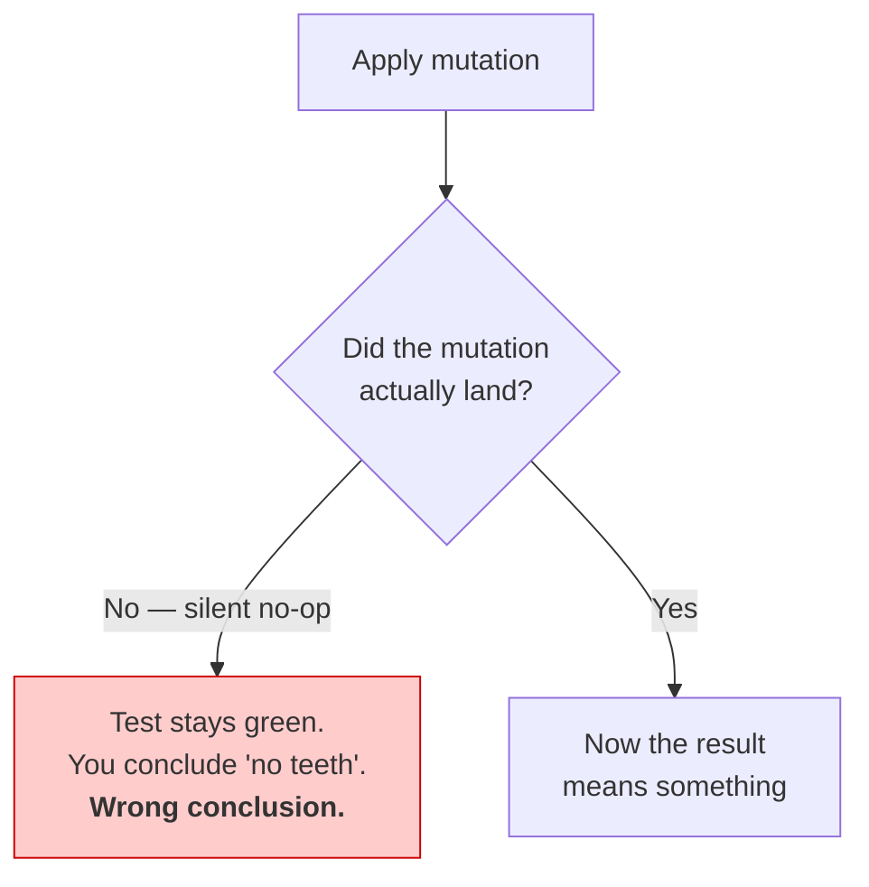
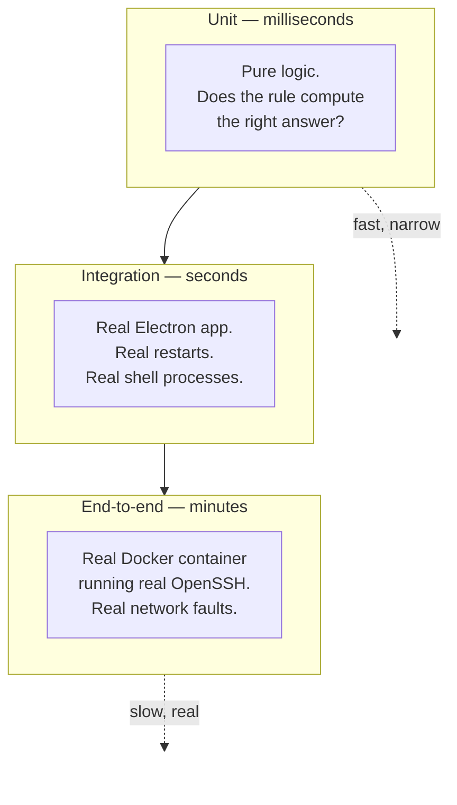
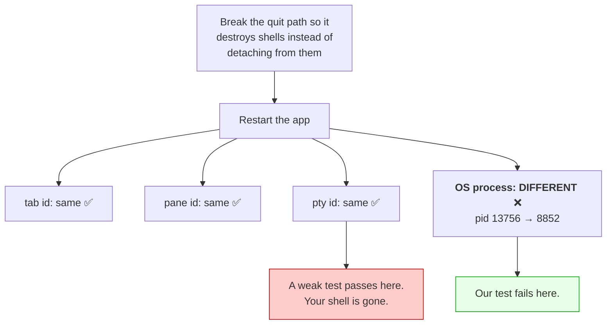
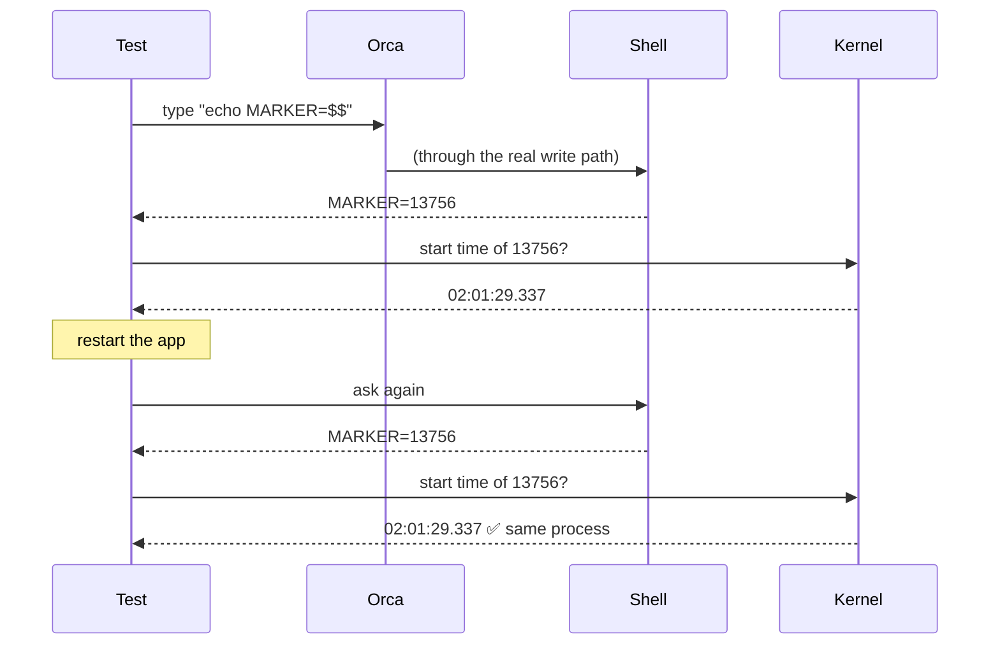
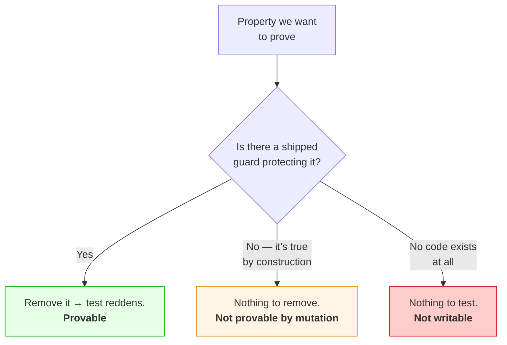
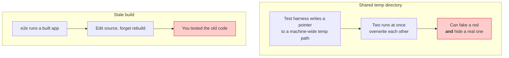
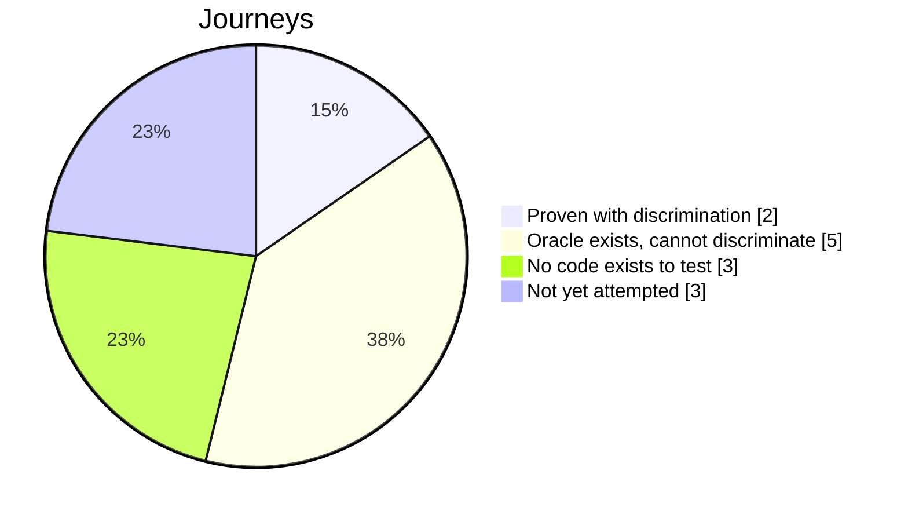

# Terminal session correctness — test design

How we decide a test is worth trusting, what we built, and what we could not
prove. Read [`design-overview.md`](./design-overview.md) first.

---

## 1. The problem with "the tests pass"

A green test proves nothing on its own. It might pass because the code is
correct, or because the test never looked.

This is not hypothetical. **It happened to us twice:**

- An end-to-end test was reported as proving the reconnect fix. It passed with
  the fix **and** with the fix removed. Retracted.
- A guard was added, every test stayed green, and the guard had **no production
  caller at all**. The capability existed; nothing used it. Tests passed the
  whole time because they called the capability directly.

---

## 2. The rule we adopted: the four-step proof

Nothing counts as evidence until it has been through this loop.

Three rules that make this honest rather than theatre:

**Delete a real guard, not the test.** The mutation goes in _production_ code. If
you tweak the test until it fails, you have proved nothing.

**Prefer one clause at a time.** If a test has three claims, a good mutation
reddens exactly one and leaves the other two green. That proves the claims
_independently_ rather than as a bundle.

**Watch it fail yourself.** A report saying "it went red" is not the same as
seeing it. Of the twelve oracles here, six were personally re-verified, and two
of those re-checks overturned the original claim.

### The trap that nearly fooled us twice

Twice a search-and-replace matched the wrong line and changed nothing. The test
stayed green and looked like a failed oracle. **Always verify the mutation landed
before believing the result.**

---

## 3. The three layers of test

The rule of thumb: **assert the strongest thing you can actually observe.**

---

## 4. Why "same id" is not good enough

The most valuable lesson from this work.

A restart test naturally asks: _is it the same terminal?_ The easy check is
whether the ids match. That check is **too weak**, and we can prove it.

So the test asks the shell to report its **own process id** through the real
input path, then reads that process's **kernel start time**. Same id _and_ same
start time means the same process really survived — a recycled pid cannot pass.

---

## 5. What is covered

### Journey 1 — a terminal survives restart · **PROVEN**

Two claims: the same pane, binding and **OS process** survive a reload and an app
restart; and a stale operation is refused.

| Platform           | Result | Mutation A (destructive quit) | Mutation B (remove stale-write guard) |
| ------------------ | ------ | --------------------------------- | ----------------------------------------- |
| macOS              | 2 pass | red                               | red                                       |
| Linux, native      | 2 pass | red                               | red                                       |
| Windows 11, native | 2 pass | **red — only claim 1**            | **red — only claim 2**                    |

The two mutations hit **different claims**, which is what proves them separately.

### Journey 2 — daemon and WSL · **PROVEN**

| Environment     | Result | Mutation A (liveness can't say "unknown") | Mutation B (widen owner fallback) |
| --------------- | ------ | --------------------------------------------- | ------------------------------------- |
| macOS           | 3 pass | red — claim 1 only                            | red — claim 3 only                    |
| Linux, native   | 3 pass | red — claim 1 only                            | red — claim 3 only                    |
| WSL2 on Windows | 3 pass | red — claim 1 only                            | —                                     |

> **A subtlety worth knowing.** These tests run in order, so when the first one
> fails the others report "did not run" — that is a _skip_, not a pass. To prove
> the mutation really only hit claim 1, we re-ran claims 2 and 3 **alone, with
> the mutation still applied**, and watched them stay green.

### Other oracles that bite

| Oracle                       | Mutation that reddens it                         |
| ---------------------------- | ------------------------------------------------ |
| Reconnect grafts no pane     | Remove "bind, never create"                      |
| Superseded-keystroke fence   | Remove the guard from the handlers               |
| Guard is actually wired up   | Remove the call sites, keep the function         |
| Workspace ids don't collide  | Restore the suffix-stripping comparison          |
| Wire compatibility           | Restore the wrong "expired" message              |
| `rm -rf` hazard stays closed | Disable the quarantine → `cho hi; rm -rf x` runs |

That last one is why we did **not** delete the quarantine module.

---

## 6. What we could not prove, and why

This is the honest half.

| Journey                   | Why not proven                                                                                                                                  |
| ------------------------- | ----------------------------------------------------------------------------------------------------------------------------------------------- |
| Two hosts don't interfere | True **by construction** — each host has its own channel, so there is no shared thing to break. Four attempts to redden it failed, correctly.   |
| Lazy host discovery       | One claim has no mutation that hits it alone; removing the real guard breaks setup before the claim is reached.                                 |
| `MaxSessions=1` reconnect | Two claims redden. A third survived **four** different guard removals — nothing shipped protects it.                                            |
| Mixed versions, live      | The new message **never crosses a version boundary** in production. Our in-process tests exercise a route the real app doesn't take. Withdrawn. |
| Performance               | 1 of 10 required dimensions measured. The keystroke guard costs ~14ns, but measured outside the real app.                                       |
| Three others              | The features they test **do not exist** in the code. No test can be written.                                                                    |

**"True by construction" is a good outcome, not a failure** — it means the
property holds because of how the code is shaped, not because a guard is
watching. It just can't be demonstrated by breaking something.

---

## 7. Environment traps that can fake a result

Real problems we hit, worth knowing before trusting any run.

So every run isolates its temp directory, and we check build timestamps against
source edits before believing a result.

Two more, found by running on machines we don't develop on:

- A test failed on **every** Linux run. Not a product bug: it read a value once,
  immediately after a reload, where its sibling helper polls for 15 seconds.
- A test could not run on **Windows at all** — it used `echo $$` and `ps`, which
  don't exist there. The Windows claim wasn't unproven, it was _unprovable_.

Both were bugs in tests we wrote, found only by running on the real platform.

---

## 8. Scoreboard

| Measure                         | Value       |
| ------------------------------- | ----------- |
| Journeys proven                 | **2 of 13** |
| Gates proven                    | **0 of 8**  |
| Oracles that bite               | 12          |
| …personally re-verified         | 6           |
| Claims retracted after checking | 2           |
| Production code added           | +214 lines  |

The retraction count is the number to look at. Two claims that looked green were
withdrawn after checking. That is the process working — and the reason to trust
the two journeys that survived it.
