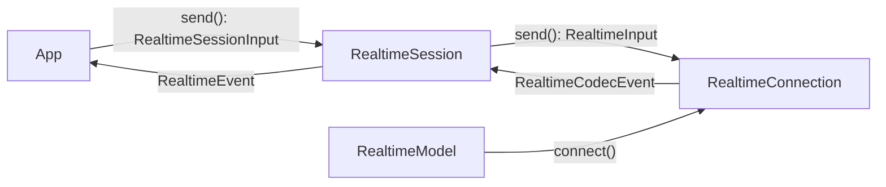

# `pydantic_ai.realtime`

Support for **realtime, bidirectional speech-to-speech models** (OpenAI Realtime, Azure OpenAI,
Gemini Live, xAI Grok Voice, and any other provider that streams audio in and out over a
persistent connection).

Unlike [`Model`][pydantic_ai.models.Model], which is request-response, a realtime model opens a
long-lived connection: you stream audio (or text/images) in, and consume audio, transcripts, and
tool calls as they arrive. The high-level entry point is
[`Agent.realtime()`][pydantic_ai.agent.Agent.realtime], followed by
[`AgentRealtime.session()`][pydantic_ai.agent.AgentRealtime.session], which wires the agent's tools and
instructions into a session and runs the tool loop for you. See the [Realtime guide](../realtime/overview.md)
for a walkthrough.

The flow of a session:

A [`RealtimeModel`][pydantic_ai.realtime.RealtimeModel] opens a
[`RealtimeConnection`][pydantic_ai.realtime.codec.RealtimeConnection] (the provider-specific transport).
A [`RealtimeSession`][pydantic_ai.realtime.RealtimeSession] wraps that connection: it translates the
low-level codec events into the shared message/part event vocabulary from
[`pydantic_ai.messages`][pydantic_ai.messages], builds ordinary
[`ModelMessage`][pydantic_ai.messages.ModelMessage] history, and executes tools automatically —
intercepting each [`ToolCall`][pydantic_ai.realtime.codec.ToolCall], running it, sending the
[`ToolResult`][pydantic_ai.realtime.codec.ToolResult] back, and emitting a
[`FunctionToolCallEvent`][pydantic_ai.messages.FunctionToolCallEvent] then a
[`FunctionToolResultEvent`][pydantic_ai.messages.FunctionToolResultEvent]. Every tool runs in the
background, so a slow one never blocks the session; whether the *model* keeps speaking meanwhile is
provider-specific (see [Concurrent tool execution](../realtime/tools.md#concurrent-tool-execution)).

## Overview

**Provider abstractions & session**

| Object | Role |
| --- | --- |
| [`RealtimeModel`][pydantic_ai.realtime.RealtimeModel] | Provider ABC; `connect()` opens a connection. |
| [`RealtimeModelSettings`][pydantic_ai.realtime.RealtimeModelSettings] | Settings shared by realtime providers. |
| [`TurnDetection`][pydantic_ai.realtime.TurnDetection] | Cross-provider automatic VAD sensitivity, padding, and silence configuration. |
| [`KnownRealtimeModelName`][pydantic_ai.realtime.KnownRealtimeModelName] / [`infer_realtime_model`][pydantic_ai.realtime.infer_realtime_model] | Provider-prefixed model IDs and inference. |
| [`RealtimeConnection`][pydantic_ai.realtime.codec.RealtimeConnection] | Provider ABC; `send()` content in, iterate events out. |
| [`RealtimeSession`][pydantic_ai.realtime.RealtimeSession] | Wraps a connection with automatic concurrent tool dispatch. |

**Browser / WebRTC** — for browser voice agents, the media flows browser ↔ provider directly while the
backend runs a control-plane sideband (OpenAI and Azure OpenAI; see [Connecting a frontend](../realtime/deployment.md#browser-webrtc-server-sideband)):

| Object | Role |
| --- | --- |
| [`RealtimeModel.answer_webrtc_offer`][pydantic_ai.realtime.RealtimeModel.answer_webrtc_offer] | Relay the browser's SDP offer; return the SDP answer and a [`WebRTCAnswer`][pydantic_ai.realtime.WebRTCAnswer] / [`WebRTCSession`][pydantic_ai.realtime.WebRTCSession]. |
| [`RealtimeModel.create_client_secret`][pydantic_ai.realtime.RealtimeModel.create_client_secret] | Mint an ephemeral [`RealtimeClientSecret`][pydantic_ai.realtime.RealtimeClientSecret] for a browser client. |
| [`AgentRealtime.session(provider_session=…)`][pydantic_ai.agent.AgentRealtime.session] | Attach the sideband session to a [`RealtimeProviderSession`][pydantic_ai.realtime.RealtimeProviderSession] (e.g. a [`WebRTCSession`][pydantic_ai.realtime.WebRTCSession]) and run the agent. |

**Inputs** — [`RealtimeSession.send`][pydantic_ai.realtime.RealtimeSession.send] accepts session content
only, in the shared message vocabulary ([`RealtimeSessionInput`][pydantic_ai.realtime.RealtimeSessionInput]):
plain `str`, image/audio [`BinaryContent`][pydantic_ai.messages.BinaryContent] (including
[`BinaryImage`][pydantic_ai.messages.BinaryImage] and
[`BinaryAudio`][pydantic_ai.messages.BinaryAudio]), or a sequence of
these. Turn-taking and interruption go through the dedicated
[`RealtimeSession`][pydantic_ai.realtime.RealtimeSession] methods (`commit_audio()`, `clear_audio()`,
`create_response()`, `interrupt()`), not `send()`.

**Consumption views** —
[`RealtimeSession.stream_audio()`][pydantic_ai.realtime.RealtimeSession.stream_audio] yields model
audio chunks ready for playback, while
[`RealtimeSession.stream_transcripts()`][pydantic_ai.realtime.RealtimeSession.stream_transcripts]
yields finalized speech from both speakers or live deltas with `delta=True`. These bounded views can
run concurrently with each other and with the session's raw event iterator.
[`RealtimeSession.close()`][pydantic_ai.realtime.RealtimeSession.close] ends the session and every
live view; [`RealtimeSession.closed`][pydantic_ai.realtime.RealtimeSession.closed] exposes its state.

The low-level [`RealtimeConnection.send`][pydantic_ai.realtime.codec.RealtimeConnection.send] accepts the
normalized [`RealtimeInput`][pydantic_ai.realtime.codec.RealtimeInput] — a `str` text turn, a raw-PCM
[`BinaryAudio`][pydantic_ai.messages.BinaryAudio] chunk, or a
[`BinaryImage`][pydantic_ai.messages.BinaryImage] frame — which additionally includes the
turn-control verbs ([`CommitAudio`][pydantic_ai.realtime.codec.CommitAudio],
[`ClearAudio`][pydantic_ai.realtime.codec.ClearAudio],
[`CreateResponse`][pydantic_ai.realtime.codec.CreateResponse],
[`CancelResponse`][pydantic_ai.realtime.codec.CancelResponse], and
[`TruncateOutput`][pydantic_ai.realtime.codec.TruncateOutput]) that those session methods emit, plus
[`ToolResult`][pydantic_ai.realtime.codec.ToolResult] — which the session sends itself as each tool
completes.

**Connection events** — [`RealtimeCodecEvent`][pydantic_ai.realtime.codec.RealtimeCodecEvent], the low-level codec
vocabulary yielded by a connection:
[`AudioDelta`][pydantic_ai.realtime.codec.AudioDelta],
[`OutputTranscript`][pydantic_ai.realtime.codec.OutputTranscript],
[`InputTranscript`][pydantic_ai.realtime.codec.InputTranscript],
[`ToolCall`][pydantic_ai.realtime.codec.ToolCall],
[`ToolCallCancelled`][pydantic_ai.realtime.codec.ToolCallCancelled],
[`ResponseDone`][pydantic_ai.realtime.codec.ResponseDone],
[`RealtimeInputSpeechStartEvent`][pydantic_ai.realtime.RealtimeInputSpeechStartEvent],
[`RealtimeInputSpeechEndEvent`][pydantic_ai.realtime.RealtimeInputSpeechEndEvent],
[`RealtimeResponseInterruptedEvent`][pydantic_ai.realtime.RealtimeResponseInterruptedEvent],
[`RealtimeSessionReconnectEvent`][pydantic_ai.realtime.RealtimeSessionReconnectEvent],
[`SessionUsage`][pydantic_ai.realtime.codec.SessionUsage],
and [`RealtimeSessionErrorEvent`][pydantic_ai.realtime.RealtimeSessionErrorEvent].

**Session events** — [`RealtimeEvent`][pydantic_ai.realtime.RealtimeEvent], yielded by a
session. The session translates codec events into the shared vocabulary from
[`pydantic_ai.messages`][pydantic_ai.messages]: content streams as
[`PartStartEvent`][pydantic_ai.messages.PartStartEvent] /
[`PartDeltaEvent`][pydantic_ai.messages.PartDeltaEvent] /
[`PartEndEvent`][pydantic_ai.messages.PartEndEvent] (carrying
[`SpeechPart`][pydantic_ai.messages.SpeechPart]s and
[`ToolCallPart`][pydantic_ai.messages.ToolCallPart]s), tool execution as
[`FunctionToolCallEvent`][pydantic_ai.messages.FunctionToolCallEvent] /
[`FunctionToolResultEvent`][pydantic_ai.messages.FunctionToolResultEvent], inline deferred handling as
[`DeferredToolRequestsEvent`][pydantic_ai.messages.DeferredToolRequestsEvent] /
[`DeferredToolResultsEvent`][pydantic_ai.messages.DeferredToolResultsEvent], and the rest as the
control-plane events above (`RealtimeInputSpeechStartEvent`, `RealtimeInputSpeechEndEvent`,
`RealtimeResponseInterruptedEvent`, `RealtimeSessionReconnectEvent`, and `RealtimeSessionErrorEvent`), plus
[`RealtimeTurnCompleteEvent`][pydantic_ai.realtime.RealtimeTurnCompleteEvent], which the
session synthesizes rather than reading off the wire. Usage updates are accumulated on the session and are not yielded.

The lower-level codec vocabulary is documented in
[`pydantic_ai.realtime.codec`](realtime/codec.md), and each provider in its own module:
[`pydantic_ai.realtime.openai`](realtime/openai.md), [`pydantic_ai.realtime.google`](realtime/google.md),
[`pydantic_ai.realtime.xai`](realtime/xai.md), and [`pydantic_ai.realtime.azure`](realtime/azure.md).

::: pydantic_ai.realtime
