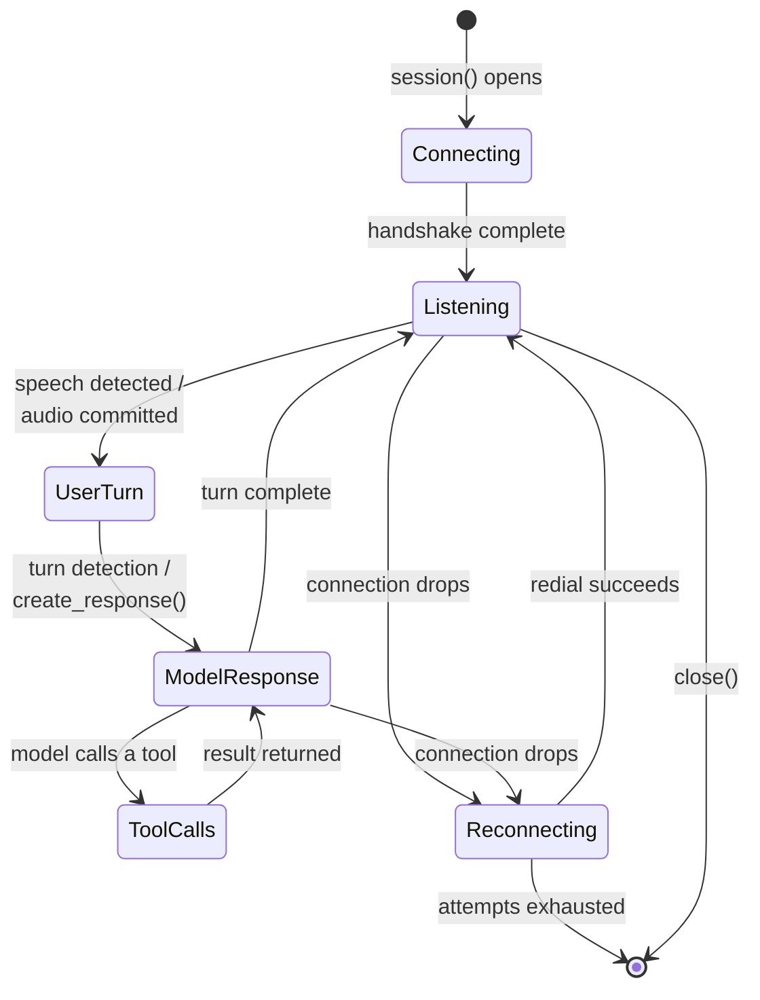

# Connection lifecycle

A realtime model uses one persistent provider connection. Your backend owns that session and the
media bridge to the user (see [Connecting a frontend](deployment.md)); a reconnect policy can
recover dropped connections and provider session limits without changing the application event
loop.

## The session lifecycle



Opening the session performs the provider handshake, after which the session listens for input.
[Turn detection](turns.md) (or manual [push-to-talk](turns.md#push-to-talk) control) moves a user
turn into a model response, which may loop through [tool calls](tools.md) before
[`RealtimeTurnCompleteEvent`][pydantic_ai.realtime.RealtimeTurnCompleteEvent] marks the
[turn boundary](events.md#the-turn-boundary) and the session listens again. A dropped connection
enters the reconnect loop below — emitting
[`RealtimeSessionReconnectEvent`][pydantic_ai.realtime.RealtimeSessionReconnectEvent] on recovery —
until [`close()`][pydantic_ai.realtime.RealtimeSession.close] (or leaving the `async with` block)
ends the session.

## Connection and handshake

The connection is opened when the `session()` context is entered, and the shared
`handshake_timeout` setting (default 30 seconds) bounds how long the session waits for each
realtime protocol handshake event on providers with an explicit handshake (OpenAI, Azure OpenAI,
and xAI). A handshake that times out raises
[`RealtimeError`][pydantic_ai.realtime.RealtimeError]; a rejected WebSocket upgrade raises
[`ModelHTTPError`][pydantic_ai.exceptions.ModelHTTPError] (see [Errors](#errors)).

## Reconnecting

Set the `reconnect` [shared setting](overview.md#shared-settings) to a
[`ReconnectPolicy`][pydantic_ai.realtime.ReconnectPolicy] to redial with exponential backoff,
reapply configuration, and emit
[`RealtimeSessionReconnectEvent`][pydantic_ai.realtime.RealtimeSessionReconnectEvent]. Like any
realtime model setting, it can be a default on the model or passed for one session:

```python
from pydantic_ai import Agent

agent = Agent()
realtime = agent.realtime(
    'openai:gpt-realtime',
    model_settings={'reconnect': {'max_attempts': 5}},
)
```

`max_attempts` bounds retries for one drop. `max_reconnects` bounds recoveries across the entire
session, preventing an endpoint that repeatedly accepts and closes connections from redialing
forever.

Without a policy, an unexpected provider close raises
[`RealtimeError`][pydantic_ai.realtime.RealtimeError] from the session iterator.

On a [WebRTC sideband](deployment.md#browser-webrtc-server-sideband) the same policy applies to an
unexpected drop, but a *clean* close is treated as the browser hanging up: the sideband is a control
channel, so a normal close ends iteration without a session error or reconnect attempt even when a
`reconnect` policy is set. The close frame alone can't distinguish a hangup from a
WebSocket-terminating proxy closing the sideband cleanly mid-call (a restart or graceful rotation),
which would end the agent side while the browser keeps talking to the provider — drain such
connections at the infrastructure layer rather than relying on the `reconnect` policy to cover them.

### State restoration

OpenAI and Azure OpenAI have no cross-connection server state, so Pydantic AI replays local message
history into the new session. Prior transcript turns survive; in-flight audio does not.

Gemini and xAI use native in-process session resumption, enabled automatically when a `reconnect`
policy is present (an explicit `google_enable_session_resumption=False` alongside a policy raises
[`UserError`][pydantic_ai.exceptions.UserError] instead of silently losing the conversation); see
the [Gemini resumption settings](gemini.md#session-resumption). Their handles live only in memory
and cannot be persisted for another process.

[`RealtimeSessionReconnectEvent.state_restored`][pydantic_ai.realtime.RealtimeSessionReconnectEvent.state_restored]
reports whether the reconnect carried the conversation through without cutting a turn off.

How a reply the drop caught in flight is handled depends on the mechanism. Under native resumption
(xAI) the recorded response simply stays open: output on the new connection continues it, the turn
completes with the response terminal as usual, and `state_restored` stays `True`. Gemini also reports
`True` but closes the cut reply as an interrupted response (keeping any partial transcript in history)
before the [`RealtimeSessionReconnectEvent`][pydantic_ai.realtime.RealtimeSessionReconnectEvent] and
stays quiet until the next input.

Local replay (OpenAI, Azure OpenAI) restores only the finalized turns, so a reply in flight when the
socket dropped cannot continue. The session settles it before emitting the event — the partial reply
becomes an interrupted response, running tool calls get cancelled returns, and the turn ends so queued
messages waiting for the boundary still flush — and `state_restored` is `False` to say the turn was
cut off. An answer that was solicited but had not started streaming is instead re-requested on the new
connection, and a drop with nothing in flight restores the whole call as-is; both lose no output, so
`state_restored` stays `True`.

## Provider session limits

Providers cap individual connection duration. A reconnect policy is also how an application survives
those limits. Exact limits and provider behavior can change, so provider pages are canonical:

- [OpenAI session behavior](openai.md#feature-support-and-limitations)
- [Azure OpenAI session behavior](azure.md#feature-support-and-limitations)
- [Gemini session resumption](gemini.md#session-resumption)
- [xAI native session resumption](xai.md#session-resumption)

Gemini sends `GoAway` shortly before its cap but Pydantic AI currently reconnects only after the
connection drops, so a long call can briefly drop mid-turn.

## Errors

Realtime sessions use the standard Pydantic AI exception hierarchy:

| Exception | Raised when |
| --- | --- |
| [`UserError`][pydantic_ai.exceptions.UserError] | The application requests an unsupported operation, passes incompatible settings, lacks credentials, or misuses the session. |
| [`ModelHTTPError`][pydantic_ai.exceptions.ModelHTTPError] | The provider rejects the WebSocket upgrade with an HTTP status. |
| [`RealtimeError`][pydantic_ai.realtime.RealtimeError] | The connection fails, times out, closes unexpectedly, returns an invalid frame, or exhausts reconnect attempts. |
| [`UsageLimitExceeded`][pydantic_ai.exceptions.UsageLimitExceeded] | A configured [usage limit](observability.md#usage-and-limits) is exceeded. |

[`RealtimeError`][pydantic_ai.realtime.RealtimeError] subclasses
[`ModelAPIError`][pydantic_ai.exceptions.ModelAPIError], so `except ModelAPIError` covers HTTP and
non-HTTP provider failures together.

Recoverable failures arrive as events: [`RealtimeSessionErrorEvent`][pydantic_ai.realtime.RealtimeSessionErrorEvent]
for provider operations and
[`RealtimeInputTranscriptionErrorEvent`][pydantic_ai.realtime.RealtimeInputTranscriptionErrorEvent] for one failed
user transcription. The session remains usable after either event.

Failures surface from the responsible call where possible; a failed `send_audio()` raises there.
Receive-loop and tool failures propagate from session iteration.

For symptom-first debugging, see [Troubleshooting](troubleshooting.md).
