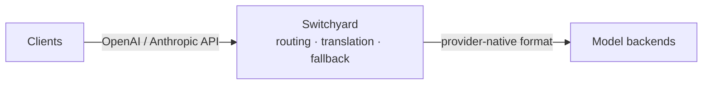

<p align="center">
  
</p>

# Switchyard

Switchyard is a Rust proxy and library for LLM traffic. It routes requests
across providers, translates between OpenAI and Anthropic APIs, records
operational metrics, and provides typed, composable routing algorithms.

**Why Switchyard?** Point a coding agent such as Claude Code or Codex at an
open-source model. Switchyard translates between the OpenAI Chat, Anthropic
Messages, and OpenAI Responses formats, so the agent keeps speaking its native
API while the request is served by vLLM, NVIDIA NIM, Ollama, or any
OpenAI-compatible endpoint. The same proxy can spread traffic across several
models for A/B benchmarking, apply signal-driven stage routing, or run a custom
algorithm you write yourself.

## Features

- **Protocol Translation**: convert between OpenAI Chat, Anthropic Messages, and OpenAI Responses formats
- **Multi-Backend Routing**: random routing, LLM-as-classifier routing, signal-driven stage-router, or your own algorithm
- **Operational Metrics**: Prometheus metrics cover requests, errors, latency, tokens, and routing overhead

## Maturity

Switchyard is pre-alpha software that is evolving rapidly. The API and algorithms are expected to change significantly before we reach v1.0.

> [!WARNING]
> Experimental software. Not for production use.

## Quick Start

Choose the launcher path to run Claude Code, Codex CLI, or OpenClaw through
Switchyard. Choose the server path to run Switchyard as a standalone proxy.
Choose the library path to embed routing in your own Rust application.

### Launcher Path

Install [`uv`](https://docs.astral.sh/uv/getting-started/installation/) if it is
not already available, then install the published Switchyard tool:

```bash
curl -LsSf https://astral.sh/uv/install.sh | sh
source "$HOME/.local/bin/env"
uv tool install --python 3.10 "nemo-switchyard[cli]"
```

The coding agent you launch must also be installed and on your `PATH`. This does
not install the standalone `switchyard-server` binary; use the Server Path for
that.

Set an OpenRouter key and launch against the packaged deployment:

```bash
export OPENROUTER_API_KEY="your-openrouter-key"  # pragma: allowlist secret
switchyard launch claude --model switchyard
switchyard launch codex --model switchyard
switchyard launch openclaw --model switchyard
```

To use your own native TOML deployment, pass its route ID and configuration:

```bash
switchyard launch claude --model my-route --config routes.toml
```

### Server Path

Use this path to install and run the standalone Rust proxy. Install
[Rust with Cargo](https://rust-lang.org/tools/install/), then install the
published binary:

```bash
cargo install --locked switchyard-server
switchyard-server --help
```

Cargo builds the release binary and installs it into `~/.cargo/bin` by default.

Create `routes.toml` using the
[Getting Started guide](docs/getting_started.md#server-path), then validate it
and start the server:

```bash
export OPENROUTER_API_KEY="your-openrouter-key"  # pragma: allowlist secret
switchyard-server --config routes.toml --dry-run
switchyard-server --config routes.toml --host 127.0.0.1 --port 4000
```

Verify the proxy in another terminal:

```bash
curl http://localhost:4000/health
```

For a complete configuration and a test request, follow
[Getting Started](docs/getting_started.md).

### Library Path

`switchyard-libsy` embeds the routing algorithms in your own Rust application.
It never calls a model itself: an algorithm decides which target to use and
hands every model call back to you, so it drops into an existing proxy, gateway,
or agent runtime without owning an HTTP stack. Pair it with
`switchyard-llm-client` when you want the calls made for you.

```toml
[dependencies]
switchyard-libsy = { git = "https://github.com/NVIDIA-NeMo/Switchyard.git" }
switchyard-protocol = { git = "https://github.com/NVIDIA-NeMo/Switchyard.git" }
```

See [Getting Started](docs/getting_started.md#library-path) for setup and the
algorithm list, or the [`switchyard-libsy`](crates/libsy/README.md) crate docs.

## Routing Strategies

| Strategy | Use it when | Route `type` |
|---|---|---|
| [LLM Classifier](docs/routing_algorithms/llm_classifier_routing.md) | Request content should decide whether a turn needs the weak or strong tier. | `llm_classifier` |
| [Stage Router](docs/routing_algorithms/stage_router_routing.md) | Signals already in the conversation, such as tool results and errors, should route most turns without an extra model call. | `stage_router` |
| [Escalation Router](docs/routing_algorithms/escalation_router_routing.md) | Every turn runs on the weak tier first, and a judge reads that answer to decide whether to send the same request to the strong tier. | `llm_classifier` with `mode = "escalation"` |
| [Random](docs/routing_algorithms/random_routing.md) | You need a fixed traffic split for A/B tests, baselines, or cost experiments. | `random` |

A `passthrough` route registers one target under one model ID with no routing
decision. See the [Routing Overview](docs/routing_algorithms/overview.md) for
the common route shape and self-hosted targets.

## Architecture



Clients keep their native OpenAI or Anthropic API format. Switchyard picks a
configured backend, forwards the request in that backend's own format, and
translates the response back into the shape the client expects. The server
accepts OpenAI Chat Completions, OpenAI Responses, and Anthropic Messages. Each
configured LLM client selects one upstream format.

## Documentation

- **[Getting Started](docs/getting_started.md)**: complete launcher and standalone server walkthroughs
- **[Core Concepts](docs/core_concepts.md)**: LLM clients, targets, routes, model IDs, and routing algorithms
- **[Routing Overview](docs/routing_algorithms/overview.md)**: choose and configure a routing algorithm
- **[`switchyard-server`](crates/switchyard-server/README.md)**: server configuration, routing algorithms, and metrics
- **[`switchyard-libsy`](crates/libsy/README.md)**: embed routing algorithms in a Rust application
- **[`switchyard-protocol`](crates/protocol/README.md)**: provider-neutral request, response, and streaming types
- **[`switchyard-translation`](crates/switchyard-translation/README.md)**: request, response, and stream translation

## Community

- **Issues**: [GitHub Issues](https://github.com/NVIDIA-NeMo/Switchyard/issues)
- **Code of Conduct**: [Code of Conduct](CODE_OF_CONDUCT.md)

## License

[Apache 2.0 License](LICENSE). Copyright NVIDIA Corporation.
