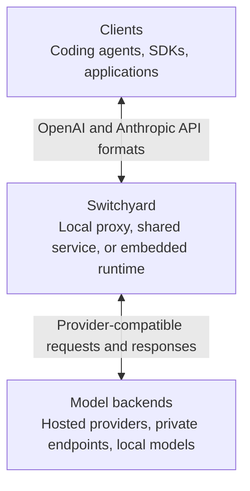
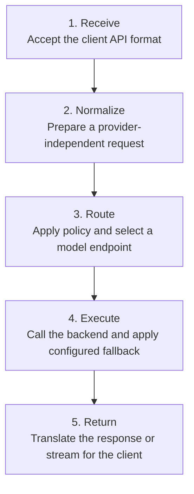

# Switchyard Architecture

Switchyard is an LLM traffic proxy that sits between clients and model
backends. It keeps the client-facing API stable while applying routing policy,
translating provider formats, and handling configured fallbacks.

## System Context

Clients connect using supported OpenAI or Anthropic API formats. Switchyard can
route a request to a backend with a different native format and still return the
response shape expected by the client.

## Request Lifecycle

Routing policy determines which model or endpoint receives a request. Depending
on the selected strategy, that decision can use fixed weights, a classifier,
request signals, or conversation affinity. See the
[Routing Overview](routing_algorithms/overview.md) for the available strategies.

## Backend Wire Format

Each LLM client in the deployment file sets `format`. It fixes the upstream
endpoint and wire format for every target that uses that client.

| `format` | Upstream endpoint |
|---|---|
| `openai_chat` | `/v1/chat/completions` |
| `openai_responses` | `/v1/responses` |
| `anthropic_messages` | `/v1/messages` |

`format` is required. Switchyard does not probe upstreams or select a format
automatically.

Switchyard decodes every inbound request into provider-neutral types before
routing, then encodes it for the selected target's format.
`switchyard-translation` converts requests, buffered responses, and streaming
events between these formats, so Claude Code, Codex, OpenClaw, and SDK clients
keep their native wire format regardless of the upstream a route selects.

## Related Documentation

- [Getting Started](getting_started.md): install Switchyard and run a first request
- [Routing Overview](routing_algorithms/overview.md): choose and configure a routing strategy
- [CLI Reference](cli_reference.md): configure and operate Switchyard from the command line
