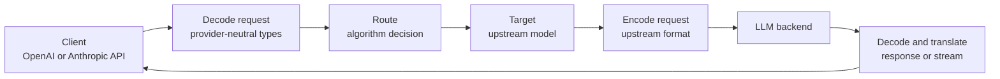

# Core Concepts

Switchyard routes LLM requests through provider-neutral Rust types and exposes
the result through OpenAI- and Anthropic-compatible APIs. For setup, see
[Getting Started](getting_started.md). For the complete request lifecycle, see
[Architecture](architecture.md).

## Runtime Surfaces

Switchyard exposes the same Rust routing core through two runtime surfaces:

- **`switchyard-server`** is the standalone HTTP proxy. It loads a native TOML
  deployment and exposes OpenAI Chat Completions, OpenAI Responses, and
  Anthropic Messages endpoints.
- **`switchyard-libsy`** is the embeddable Rust library. Applications construct
  targets and algorithms directly and can let libsy make calls or fulfill its
  requested model calls themselves.

The `switchyard launch` command is a launcher for coding agents. It hosts the
native Rust server through the packaged PyO3 binding and points the selected
agent at that server.

## Request Flow

The standalone server translates an inbound provider format into the shared
protocol types before routing. The selected target's LLM client translates the
request into its upstream format, makes the call, and translates the response
back to the client's format.

## LLM Clients, Targets, and Routes

A native TOML deployment has three layers:

| Layer | Defines |
|---|---|
| **LLM client** | Upstream base URL, wire format, credential environment variable, and retry policy. |
| **Target** | One upstream model ID and the LLM client used to call it. |
| **Route** | One client-visible model ID and the algorithm that selects or calls targets. |

These layers keep provider transport separate from routing policy. Several
targets can share one LLM client, and several routes can reuse the same target.
Secrets stay outside the TOML: `api_key_env` names the environment variable the
server reads at startup.

## Model IDs

The table keys in `llm_clients`, `targets`, and `routes` are local references
inside the TOML file. Their `id` fields have different external meanings:

- A target's `id` is the model ID sent to its upstream provider.
- A route's `id` is the model ID clients send to Switchyard.

The server lists route IDs on `GET /v1/models`. A request selects a route by
putting that ID in its `model` field. The native Rust server does not discover
or register additional provider models automatically. The same response also
carries a Codex-compatible `models` array so Codex can use the server as a direct
provider; each entry reflects the route's declared context window, tool support,
and reasoning.

## Routing Algorithms

An algorithm receives the normalized request, publishes a routing decision,
and serves the selected target. The standalone server supports these primary
route types:

| Route type | Behavior |
|---|---|
| `passthrough` | Sends every request to one target. |
| `random` | Selects among targets using optional relative weights. |
| `llm_classifier` | Uses a classifier target to choose between weak and strong targets. |
| `stage_router` | Uses tool-result and progress signals to choose an efficient or capable target. |

Strong, weak, capable, and efficient are roles within an algorithm, not fixed
properties of a model. The same upstream model can serve different roles in
different routes.

## Protocol Types and Translation

`switchyard-protocol` defines provider-neutral requests, responses, messages,
content blocks, tool calls, usage, and streaming events. Algorithms operate on
these types rather than provider SDK objects.

Each LLM client explicitly selects one upstream format:

- `openai_chat`
- `openai_responses`
- `anthropic_messages`

`switchyard-translation` converts requests, buffered responses, and streaming
events between those formats. This lets a client keep its native API while the
selected target uses a different upstream protocol.

## Where to Go Next

- [Getting Started](getting_started.md): install and run either execution path.
- [CLI Reference](cli_reference.md): launcher and standalone server arguments.
- [LLM Classifier Routing](routing_algorithms/llm_classifier_routing.md): configure classifier routing.
- [Architecture](architecture.md): follow a request through the server and Rust crates.
- [`switchyard-server`](../crates/switchyard-server/README.md): complete TOML schema, endpoints, and metrics.
- [`switchyard-libsy`](../crates/libsy/README.md): embed and extend routing algorithms in Rust.
- [Rust API reference](reference/rust_api.md): generated libsy and protocol documentation.
