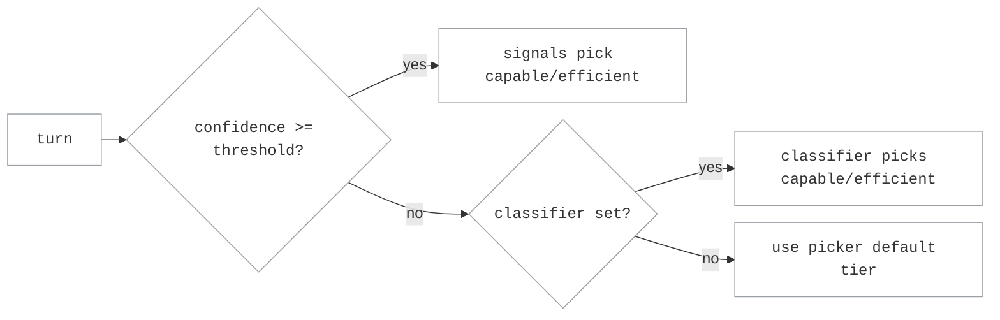

# Stage-Router Routing

Stage-router routing sends each request to either a **capable** model or a
cheaper **efficient** one, depending on where the agent is in its run. The goal
is to spend the capable model on the turns that need it (exploration, error
recovery, hard reasoning) and let the efficient model carry the routine,
mechanical work. Which tier a turn defaults to depends on the picker you choose
(`capable_first` or `efficient_first`); the signals then move individual turns
off that default. You configure it with a single knob, `confidence_threshold`,
plus an optional LLM classifier.

If the selected target exceeds its context window, the router tries the next
eligible target until one succeeds or all configured targets have been tried. See
[Context-Window Handling](../operations/context_window.md).

## How it works

A coding agent's run moves through stages: early on it explores the codebase and
recovers from errors, and later it settles into more mechanical implementation.
Those stages call for different amounts of model capability, which is what the
router keys on.

For each LLM call, stage-router estimates which stage the agent is in from the
**tool-result history** on the conversation, scoring two axes:

- **WRONG → capable**: `severity` (windowed error severity), `spinning` (deep
  churn with no reads or writes), and `exploring` (reading or planning without
  producing) push toward the capable tier.
- **PROGRESS → efficient**: `recent_production_intensity` (writes and edits
  landing over the recent window) pushes toward the efficient tier.

The axes are **corroborative**: the signed score is `tanh`-squashed to a
confidence in `[0, 1]`, so one full signal alone scores ~`0.46` and a second
corroborating signal is what pushes it decisively past a `0.5` threshold. A
critical-error severity is a hard override that escalates on its own. The router
then routes:

- the **capable** tier for uncertain, exploratory, or error-recovery turns, and
- the **efficient** tier for settled, mechanical turns.

`confidence_threshold` sets how sure that estimate must be before the router acts
on the signal alone. Below it, the turn stays on the picker's default tier (or,
if you added the optional classifier, goes to it first). A turn with no
tool-result history yet has no stage to estimate, so it takes the default tier.

The routing decision for one turn:



With `capable_first`, the default is capable, so a turn only reaches the cheaper
efficient model on a confident efficient signal (or an efficient verdict from
the classifier). Raising the threshold shrinks that path; lowering it widens it.

## Pickers

The picker name says which tier is the **default**: the tier used when the
signals are ambiguous and no classifier verdict is available.

- **`efficient_first`**: efficient is the default; escalate to capable only when
  the signals (or the classifier) clearly say so. Cost-first.
- **`capable_first`** *(experimental)*: capable is the default; drop to efficient
  only when the signals (or the classifier) clearly say so. Quality-first.

Both pickers read the same signals; only the default tier differs.

!!! warning "`capable_first` is experimental"

    Every published threshold and routing result comes from `efficient_first`
    runs. `capable_first` works and the server accepts it, but it has not been
    benchmarked, so there are no calibrated thresholds for it and no measured
    accuracy or cost figures to set expectations against. The server logs a
    warning at startup when a route selects it. Use `efficient_first` unless you
    are running your own calibration.

## Tuning `confidence_threshold`

The scorer rates each turn from `0` (signals are neutral) to `1` (signals point
hard at one tier). `confidence_threshold` is the bar that rating has to clear
before the router will switch off the picker's default tier. Clear it and the
router routes to the tier the signals indicate; fall short and the turn stays on
the default.

With the default `capable_first` picker, every turn starts on the capable tier
and only drops to the efficient tier when the signals say "efficient" and clear
the threshold. So the threshold sets how much evidence it takes to switch to the
cheaper tier:

- Raise it and only strong, decisive signals drop a turn to efficient, so the
  router stays on capable longer (more quality, more cost).
- Lower it and weaker signals are enough to drop to efficient, so more turns go
  cheap (more savings, more risk).

`efficient_first` is the mirror: turns start on efficient and need a signal that
clears the threshold to escalate to capable.

(If you add the optional classifier, sub-threshold turns go to it instead of
staying on the default tier.)

**Set `0.5` explicitly.** `confidence_threshold` is required by the TOML schema;
`0.5` is the recommended starting point and what the example below uses.

| `confidence_threshold` | Include `classifier:` block? | Typical use |
|---|---|---|
| `0.0` | no | Cost/latency-sensitive. Every signal-based verdict is accepted; no per-turn LLM call. Critical-error signals still escalate to capable. |
| `0.5` | no | Recommended starting point. The scorer is corroborative — one full wrong signal scores ~`0.46`, just under `0.5` — so a decisive escalation takes a strong signal plus corroboration, while a critical error overrides regardless. Derived from SWE-Bench Pro Python-75 calibration. |
| `0.7` - `0.9` | yes | Classifier-assisted. Low-confidence turns go to the LLM classifier before falling back to the default tier. |
| `1.0` | yes (required) | Classifier-driven. Tool signals only apply hard overrides; other turns reach the classifier. |

The signal-vs-classifier split is dataset-dependent. Measure it in
production: `/v1/stats` reports stage-router decisions by source and semantic
target, while response headers and structured decision logs explain individual selections.

### Calibrating the threshold from run data

The recommended `0.5` starting point was derived from SWE-Bench Pro Python-75
calibration. To tune for a different task set or model pair, follow this
minimum-data path.

**What you need**

| Run | Coverage | Purpose |
|---|---|---|
| Pure-capable | ~40–75 representative tasks | Baseline outcomes + signal features |
| Pure-efficient | ~20 tasks (sampled from capable results) | Counterfactual outcomes |

Neither run needs to cover the full task set. A few dozen capable tasks gives
enough outcome diversity; the efficient probe only needs to cover the interesting
quadrant candidates identified from those capable results.

**How to sample the efficient probe set**

Stratify the pure-capable results across four quadrant candidates before running efficient:

| Category | Criterion | Count | Value |
|---|---|---|---|
| Easy + clean | Capable passes, small diff, clear spec | ~5 | Establishes SAFE floor |
| Easy + tricky | Capable passes, subtle logic | ~5 | Catches LOSS false-positives |
| Hard + structural | Capable fails, large multi-file diff | ~5 | HARD noise baseline |
| Hard + localized | Capable fails, small targeted fix | ~5 | Best RESCUE signal |

Sample across repos and diff sizes. Don't over-represent one project.

**Building RESCUE / LOSS quadrants**

From the overlap tasks (those with both capable and efficient results):

- `RESCUE` = capable-fail ∩ efficient-pass → escalation is beneficial here
- `LOSS`   = capable-pass ∩ efficient-fail → do NOT escalate here
- `SAFE`   = both pass
- `HARD`   = both fail

Sweep a few candidate thresholds in representative benchmark runs. Choose the
lowest threshold that rescues the RESCUE quadrant without over-escalating the
LOSS quadrant. Because the scorer is corroborative, a `0.5` threshold takes
roughly 1.5 signals of agreement.

**Caveat on efficient outcomes in stage-router vs. pure-efficient**

In stage-router, the efficient model may inherit partial context from the capable arm
(conversation history up to the escalation point). Pure-efficient runs start
fresh, so RESCUE is a conservative lower bound. Efficient performs at least as
well in stage-router as it does alone.

## Route configuration

```toml
schema_version = 1

[llm_clients.openrouter]
format = "openai_chat"
base_url = "https://openrouter.ai/api/v1"
api_key_env = "OPENROUTER_API_KEY"

[targets.strong]
id = "openai/gpt-4o"
llm_client = "openrouter"

[targets.weak]
id = "openai/gpt-4o-mini"
llm_client = "openrouter"

[routes.stage]
id = "switchyard/stage"
type = "stage_router"
capable_target = "strong"
efficient_target = "weak"
picker = "efficient_first"
confidence_threshold = 0.5
recent_turn_window = 3          # optional, defaults to 3
```

Save as `routes.toml` and start the server:

```bash
switchyard-server --config routes.toml --port 4000
```

This is the recommended default: routing on tool signals alone, no classifier.

### Optional: handoff notes

Add a `[routes.stage.handoff_notes]` section to pass a contextual note to the
model the router switches to. The escalation note is sent to the capable tier on
a signal-driven escalation; the de-escalation note is sent back to the efficient
tier when a settled signal drops the turn there.

```toml
[routes.stage.handoff_notes]
escalation_note = "the previous model was stalling; pick up the diagnosis"
# deescalation_note = "..."          # optional
# only_on_wrong_signal_escalation = true  # default; set false to always send
```

### Optional: per-tier system prompts

```toml
[routes.stage]
# ...
capable_system_prompt = "diagnose before you edit"
efficient_system_prompt = "follow the settled plan"
```

### Optional: LLM classifier fallback

By default the router uses tool signals only. To break ties on low-confidence
turns with a model call, add a `[routes.stage.classifier]` block and set
`confidence_threshold` above `0.0`. The classifier is consulted only for turns
that fall below the threshold:

```toml
[routes.stage.classifier]
target = "strong"          # target the judge is called through (not a routing destination)
base_threshold = 0.5       # p_solve floor to route efficient; below this → capable
threshold_step = 0.1       # adds 0.1 for uncertain and 0.2 for unsupported verdicts
recent_turn_window = 3     # conversation span the judge sees
prompt = "Estimate whether the efficient target can complete this request."
```

`prompt` replaces the packaged capability-classifier prompt. The active schema
is sent separately through the structured-output request. The verdict schema
and routing thresholds remain unchanged.

Give the classifier its own LLM client or quota bucket where possible. Sharing
one provider bucket with the efficient tier adds a request per classified turn
and can cause sustained 429s at scale.

## Observability

Each response carries two routing headers:

| Header | Content |
|---|---|
| `x-model-router-selected-model` | The model ID the turn was routed to. |
| `x-model-router-rationale` | Human-readable routing reason (e.g. `stage_router selected weak (confidence 0.612)`). |

### Decision sources

The router records an internal `decision_source` for each turn to distinguish the
paths through its cascade:

| Source | When |
|---|---|
| `override` | A critical-error severity (or a context-compaction marker) forced the capable tier. |
| `tests_passed` | A settled run — a recent test pass with a recent write and no windowed error — landed the turn on the efficient tier. |
| `dimensions` | The corroborative scorer crossed `confidence_threshold` and picked the tier by the sign of the score. |
| `llm-classifier` | The signals were ambiguous and the classifier returned a verdict. |
| `fall_open` | The signals were ambiguous and the classifier failed or wasn't configured; the default tier was used. |

## When *not* to use stage-router

- **Single-model deployments.** Use a `passthrough` route instead.
- **Probabilistic A/B splits.** Use
  [Random Routing](random_routing.md) (`type = "random"`).
  The stage-router's signals are wasted on a fixed traffic ratio.
- **No tool-result history.** Stage-router needs meaningful tool-call traffic to
  populate the tool-result signal. For pure chat-completion workloads every
  ambiguous request lands on the picker's default tier.

## Related

- [Architecture](../architecture.md): the end-to-end request lifecycle and
  system boundaries.
