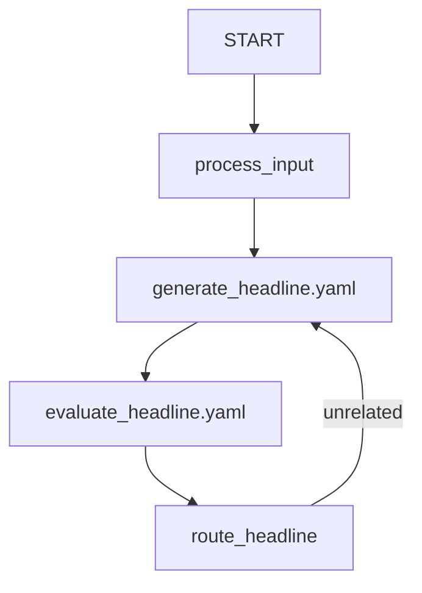

# Workflow Loop Config Sample

## Overview

This sample demonstrates how to define a workflow with a feedback loop using a
YAML configuration file. It mirrors the
`contributing/samples/workflows/loop` sample, but uses YAML to define the
workflow structure instead of Python.

> **Status**: not runnable yet. The YAML agent loader resolves `agent_class`
> against `google.adk.agents` and requires a `BaseAgent` subclass with a config
> type, and no config field binds `edges`. `Workflow` satisfies neither, so
> `root_agent.yaml` below describes the intended syntax rather than syntax the
> loader accepts today. The individual agent files
> (`generate_headline.yaml`, `evaluate_headline.yaml`) do load.

## Sample Inputs

- `Python programming`

- `Baking cookies`

## Graph

## How To

This sample uses some special syntax in `root_agent.yaml` to support dynamic resolution and graph construction:

### 1. Code References

Fields that hold a Python object (like `output_schema` in `evaluate_headline.yaml`) take a `name` entry holding the fully qualified name of that object, which the loader imports.

- The name is resolved against `sys.path`, which includes the directory holding the agent folders.
- Example: `name: loop_config.agent.Feedback` resolves to the `Feedback` Pydantic model in `agent.py` in this directory.

### 2. Function References in Edges

If a string in the edge list does not end with `.yaml` and is not `'START'`, it is treated as a function reference.

- If it starts with `.`, it resolves relative to the current agent directory's Python package path.
- Example: `.agent.process_input` resolves to the `process_input` function in `agent.py`.
- It automatically creates a `FunctionNode` with the function's name as the node name.

### 3. External Agent Files

Agents can be defined in their own YAML files and referenced by filename in the edges list.

- Example: `generate_headline.yaml` references the agent defined in that file.
- The mapper caches resolved nodes by their string value, so using the same filename in multiple edges correctly reuses the same agent instance, preserving the graph structure (e.g. for loops).
