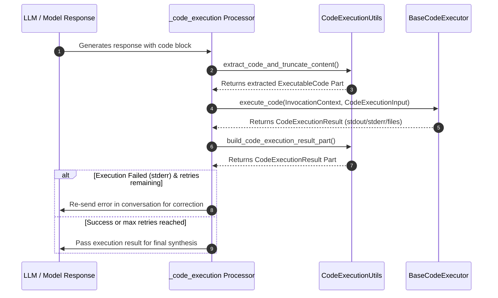

# BaseCodeExecutor

`BaseCodeExecutor` is the interface ADK uses to execute model-generated code blocks and incorporate execution results into the conversation. It supports model-delegated execution, isolated local processes, Docker containers, Kubernetes/GKE sandboxes, and managed Vertex AI / Agent Engine backends.

## Introduction

Language models excel at generating code to perform mathematical calculations, data transformations, and chart rendering, but they cannot execute code directly without an execution runtime. Running untrusted model-generated code on an application server introduces security and reliability risks, including resource exhaustion, privilege escalation, and credential exposure.

The code executor subsystem resolves this by abstracting code execution behind `BaseCodeExecutor`. An `LlmAgent` delegates code block extraction, execution isolation, and result formatting to the configured executor. Six implementations ship with ADK covering development, containerized isolation, Kubernetes orchestration, and Google Cloud managed environments.

## Get started

The code executor is configured on an `LlmAgent` through the `code_executor` parameter. The example below configures `UnsafeLocalCodeExecutor` to run Python code generated by the agent in a local subprocess:

```python
agent = LlmAgent(
    name="calculator_agent",
    instruction="When asked a math problem, write Python code to compute the exact result.",
    code_executor=UnsafeLocalCodeExecutor(timeout_seconds=30),
)
```

When the model produces a code block enclosed in Python delimiters, the agent intercepts the block, runs it through `execute_code`, and feeds the standard output or error back to the model before returning the final answer.

## How it works

The execution lifecycle coordinates between `LlmAgent`, the `_code_execution` flow processor, `CodeExecutionUtils`, and the executor:



1. **Extraction:** During post-processing of a model response, `CodeExecutionUtils.extract_code_and_truncate_content` scans the response text for delimiters configured in `code_block_delimiters` (e.g. ```` ```python ```` or ```` ```tool_code ````). The first detected code block is extracted into a `types.Part.from_executable_code`.
2. **Execution:** The flow wraps the code and any session-attached files into a `CodeExecutionInput` and invokes `code_executor.execute_code(invocation_context, code_execution_input)`.
3. **Result Formatting:** `CodeExecutionResult` captures `stdout`, `stderr`, and generated `output_files`. `CodeExecutionUtils.build_code_execution_result_part` converts this into a `types.Part.from_code_execution_result` with status `OUTCOME_OK` or `OUTCOME_FAILED`.
4. **Retry Loop:** If execution produces `stderr`, the agent increments the invocation error count via `CodeExecutorContext`. If `error_retry_attempts` has not been exceeded, the error is appended to the conversation context and sent back to the model for correction.
5. **Multi-Turn Conversion:** On subsequent model calls, `CodeExecutionUtils.convert_code_execution_parts` converts prior executable code and result parts to text representations so standard chat models without native code-execution tool calling can parse previous turns.

## Configuration options

The base class defines the following configuration options:

| Option | Type | Default | Description |
| :--- | :--- | :--- | :--- |
| `optimize_data_file` | `bool` | `False` | Extract and process CSV data files from the model request and attach them to the executor. |
| `stateful` | `bool` | `False` | Whether state and variables persist across multiple code executions within a session. |
| `error_retry_attempts` | `int` | `2` | Number of consecutive execution error retries before giving up. |
| `code_block_delimiters` | `list[tuple[str, str]]` | `[('```tool_code\n', '\n```'), ('```python\n', '\n```')]` | Delimiter pairs used to locate code blocks in model output. |
| `execution_result_delimiters` | `tuple[str, str]` | `('```tool_output\n', '\n```')` | Delimiters used when formatting execution output for text-based model turns. |
| `timeout_seconds` | `int \| None` | `None` | Wall-clock execution timeout in seconds. |

`optimize_data_file` instructs the flow to inspect user prompt parts for `text/csv` payloads, parsing them and placing them into `CodeExecutionInput.input_files` so the executed code can load datasets without manual upload plumbing.

`stateful` declares whether variables, functions, and imports defined in one turn remain accessible in subsequent code executions. Stateless executors recreate fresh processes for every snippet.

`error_retry_attempts` limits the self-correction loop when generated code raises an exception or syntax error. Once exhausted, the agent stops re-prompting the model and surfaces the error.

`code_block_delimiters` and `execution_result_delimiters` control the syntactic markup for identifying code blocks in model output and presenting results back to models that do not support native executable code parts.

`timeout_seconds` sets a hard cutoff for code execution. Subclasses implement timeouts via supervisor processes, container alarms, or Kubernetes watch intervals.

## Choosing an implementation

All concrete code executor implementations are imported from `google.adk.code_executors`.

| Implementation | Environment / Use Case | Isolation Level |
| :--- | :--- | :--- |
| `BuiltInCodeExecutor` | Gemini native server-side execution. | Model provider sandbox |
| `UnsafeLocalCodeExecutor` | Local dev and unit tests. Runs via `multiprocessing.Process`. | None (runs on host machine) |
| `ContainerCodeExecutor` | Local or self-hosted Docker container with network disabled and dropped capabilities. | Container isolation |
| `GkeCodeExecutor` | Kubernetes cluster using gVisor-sandboxed Pods or Agent Sandbox client. | Kernel sandbox (gVisor) |
| `VertexAiCodeExecutor` | Google Cloud Vertex AI Code Interpreter Extension. | Managed cloud sandbox |
| `AgentEngineSandboxCodeExecutor` | Vertex AI Reasoning Engine / Agent Engine sandbox environments. | Managed cloud sandbox |

## Advanced applications

### Hardened container execution

For self-hosted production workloads, `ContainerCodeExecutor` provides isolated Docker execution with non-root security defaults:

```python
from google.adk.agents import LlmAgent
from google.adk.code_executors import ContainerCodeExecutor

agent = LlmAgent(
    name="data_analyst",
    instruction="Analyze data using Python scripts.",
    code_executor=ContainerCodeExecutor(
        image="python:3.11-slim",
        network_enabled=False,
        timeout_seconds=60,
    ),
)
```

### Kubernetes gVisor sandboxing

In Kubernetes environments, `GkeCodeExecutor` provisions ephemeral Jobs with gVisor (`runsc`) runtime isolation:

```python
from google.adk.agents import LlmAgent
from google.adk.code_executors import GkeCodeExecutor

agent = LlmAgent(
    name="k8s_code_agent",
    code_executor=GkeCodeExecutor(
        namespace="agent-sandboxes",
        image="python:3.11-slim",
        cpu_limit="1000m",
        mem_limit="1Gi",
        timeout_seconds=120,
    ),
)
```

## Limitations

*   **Sequential Execution of All Code Blocks:** ADK automatically extracts and executes every code block matching the configured delimiters in sequence. It does not support selective or conditional execution of individual code blocks within a single response turn.
*   **Host Security with `UnsafeLocalCodeExecutor`:** `UnsafeLocalCodeExecutor` executes code on the local host. It must never be used with untrusted user input in production.
*   **Statefulness Backend Constraints:** `UnsafeLocalCodeExecutor` and `ContainerCodeExecutor` do not support `stateful=True` or `optimize_data_file=True`. Setting either parameter raises `ValueError`.
*   **Optional Dependencies:** `VertexAiCodeExecutor`, `ContainerCodeExecutor`, `GkeCodeExecutor`, and `AgentEngineSandboxCodeExecutor` require extra packages installed via `pip install "google-adk[extensions]"`.

## Related samples

*   [Built-in Code Execution](../../../../contributing/samples/code_execution/code_execution/agent.py) — Data science agent using `BuiltInCodeExecutor`.
*   [GKE Sandbox Code Execution](../../../../contributing/samples/code_execution/code_execution/gke_sandbox_agent.py) — Secure Python execution in GKE with `GkeCodeExecutor`.
*   [Custom Code Execution](../../../../contributing/samples/code_execution/custom_code_execution/agent.py) — Stateful custom execution extending `VertexAiCodeExecutor`.
*   [Agent Engine Sandbox](../../../../contributing/samples/code_execution/agent_engine_code_execution/agent.py) — Managed code execution using `AgentEngineSandboxCodeExecutor`.
*   [Vertex AI Code Execution](../../../../contributing/samples/code_execution/vertex_code_execution/agent.py) — Using Vertex Code Interpreter with session state.
