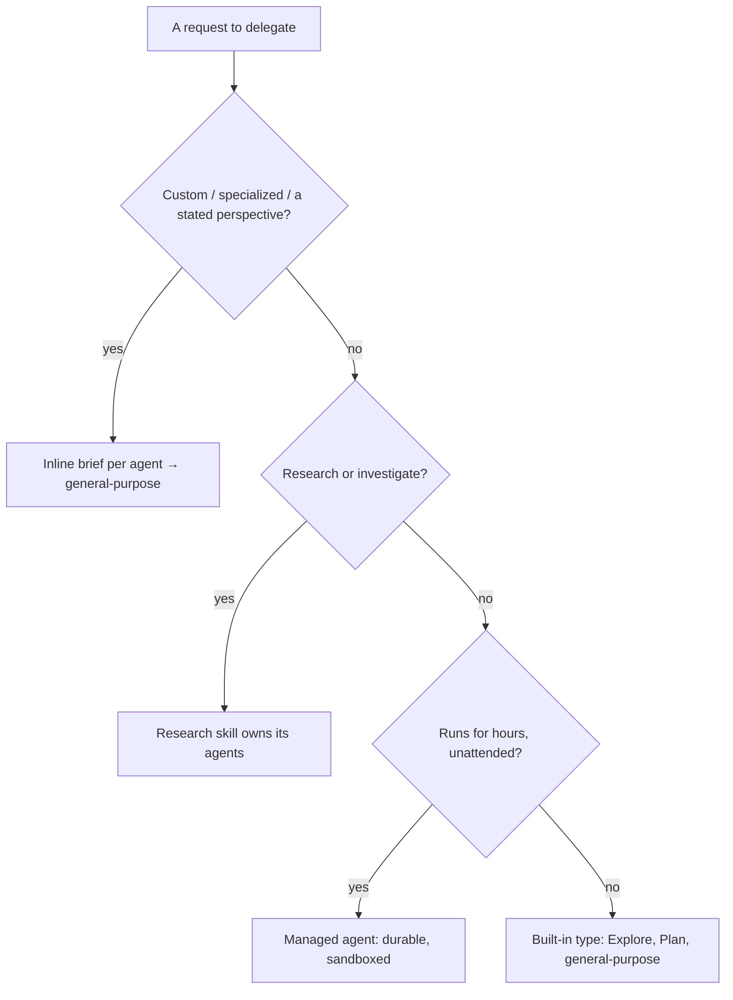

# LifeOS Agent System

> Agents are how the LifeOS parallelizes the hill-climb. One DA fronts the system (thesis: `../LifeOs/LifeOsThesis.md`), but closing a current→ideal-state gap often takes many hands — research fanned out, code written, work audited cross-vendor. The routing rules below exist so that fan-out stays deterministic and the right kind of worker handles each leg of the climb.

**Authoritative reference for agent routing in LifeOS. Three distinct systems exist—never confuse them.**

---

## 🚨 THREE AGENT SYSTEMS — CRITICAL DISTINCTION

LifeOS has three agent systems that serve different purposes. Confusing them causes routing failures.

| System | What It Is | When to Use | Has Unique Voice? |
|--------|-----------|-------------|-------------------|
| **Agent Tool Subagent Types** | Built-in types plus file-backed agents in `agents/` (Explore, Plan, general-purpose, Forge, Max, the researchers) | Internal workflow use ONLY | No |
| **Named Agents** | Persistent identities with backstories and voices (your own personas) | Recurring work, voice output, relationships | Yes |
| **Custom Agents** | Agents composed as inline briefs (role/perspective/voice written into the prompt), launched with `general-purpose` | When user says "custom agents" | Yes (described in the brief) |

---

## 🚫 FORBIDDEN PATTERNS

> **Note:** `Architect`, `Designer`, and `Engineer` were retired as agent types, and so was the old `Agents` composition skill (`ComposeAgent`/`Traits.yaml`). Don't reach for a bare static built-in `subagent_type` when the user asks for custom agents — write a distinct inline brief per agent and launch with `general-purpose`.

**When user says "custom agents":**

```typescript
// ❌ WRONG - a bare static built-in subagent_type is NOT a custom agent
Agent({ subagent_type: "<static built-in type>", prompt: "..." })

// ✅ RIGHT - one distinct inline brief per agent, launched with general-purpose
//   (role, perspective, and voice written straight into the prompt)
Agent({ subagent_type: "general-purpose", prompt: "You are a <role> arguing from a <perspective> angle. …" })

// ❌ WRONG - "specialized agents to brainstorm", you reach for bare static types
Agent({ subagent_type: "<static built-in type>", prompt: "Brainstorm UI ideas..." })

// ✅ RIGHT - a topic-specific brief per perspective (as Council/RedTeam/Ideate do)
Agent({ subagent_type: "general-purpose", prompt: "You are a skeptical UX critic. Brainstorm UI ideas, then attack your own. …" })
```

---

## Routing Rules

### The Word "Custom" Is the Trigger

| User Says | Action | Implementation |
|-----------|--------|----------------|
| "**custom agents**", "spin up **custom** agents" | Inline brief per agent | Write each brief, launch with `Agent({ subagent_type: "general-purpose", prompt: "<brief>" })` |
| "agents", "**specialized agents**", "launch agents", "parallel agents" | Inline briefs, one per perspective | `Agent({ subagent_type: "general-purpose", prompt: "<brief>" })` — batch in one message |
| "research X", "investigate Y" | Research skill | `Skill("Research")` → appropriate researcher agents |
| "use Remy", "get Ava to" | Named agent | Use appropriate researcher subagent_type |
| (Code implementation, standard) | `general-purpose` + senior-engineer/TDD brief | `Agent({ subagent_type: "general-purpose", prompt: "Senior engineer, TDD. …" })` |
| (Production-grade code, a "no shortcuts" directive, OR named "Forge") | Forge (cross-vendor, OpenAI lineage via `codex exec`) | `Agent({ subagent_type: "Forge" })` |
| (Cross-vendor audit, OPTIONAL — Algorithm's discretion) | Forge in audit mode (read-only, OpenAI lineage) | `Agent({ subagent_type: "Forge", prompt: "MODE: audit\n…" })` |
| (Heavy analysis on a hard problem, OR scrutiny on super-sensitive work: public releases, security boundaries, irreversible actions, OR named "Max") | Max (Anthropic top rung via the `fable` alias, read-only) | `Agent({ subagent_type: "Max" })` |
| (Architecture/design) | `general-purpose` + system-design brief | `Agent({ subagent_type: "general-purpose", prompt: "System design / distributed systems. …" })` |
| (Claude Code hooks, settings, commands, MCP, agents, API) | Claude Code Guide | `Agent({ subagent_type: "claude-code-guide" })` — verify latest features before implementing |

### Custom Agent Creation Flow

When the user requests custom agents, compose each one as an **inline brief** — role, stance, and voice written straight into the prompt — and launch with `general-purpose`. There is no composition tool; Council, RedTeam, and Ideate all build members this way (topic-specific briefs, never bare built-in types).

1. **Write a distinct brief per agent** — role, perspective, and the specific angle it argues from, directly in the prompt text
2. **Launch each** with `Agent({ subagent_type: "general-purpose", prompt: "<brief>" })`, batched in one message for parallelism
3. **Voice results** in the brief's described voice if voice output is wanted

```ts
// Example: 3 custom research agents, each a different inline brief
Agent({ subagent_type: "general-purpose", prompt: "You are an enthusiastic, exploratory researcher. …" })
Agent({ subagent_type: "general-purpose", prompt: "You are a skeptical, systematic researcher. …" })
Agent({ subagent_type: "general-purpose", prompt: "You are an analytical, synthesizing researcher. …" })
```

---

## ⚠️ Agent Tool Subagent Types — INTERNAL WORKFLOW USE ONLY

**These are NOT for user-requested custom/specialized agents.** When the user asks for specialized agents, custom agents, or agents with unique perspectives, write an inline brief and launch with `general-purpose` (as Council/RedTeam/Ideate do). See Routing Rules above.

These are the types available to the **Agent** tool — built-ins plus the file-backed agents in `~/.claude/agents/`. The dispatch tool is `Agent(...)`; the older `Task(...)` call is retired and blocked by the `/ic` `retired-tokens` gate.

| Subagent Type | Purpose | When Used |
|---------------|---------|-----------|
| `general-purpose` | Custom agents via inline brief; code/design/architecture work with a role brief in the prompt | Parallel work with task-specific prompts (the `Architect`/`Designer`/`Engineer` types were retired — use this with a brief) |
| `Explore` | Codebase exploration | Finding files, understanding structure |
| `Plan` | Implementation planning | Plan mode |
| `Forge` | Cross-vendor coder + auditor (OpenAI lineage via `codex exec`; model resolved from `CROSS_VENDOR` in models.ts) — `MODE: build` writes production code, `MODE: audit` is the read-only cross-vendor VERIFY pass (folded in the former Cato agent) | Production-grade code; optional cross-vendor audit on high-impact work (Algorithm's discretion — effort tiers were retired 2026-07-11) |
| `Max` | Anthropic-family deep-analysis agent (top rung via the `fable` alias; Edit/Write denied at the permission layer). Shares one personality with Forge — inlined byte-identically in both agent files, held there by the `/ic` `agent-shared-blocks` gate, so the two characters cannot drift | Genuinely hard analysis, and the added scrutiny pass on super-sensitive work (public LifeOS releases, security boundaries, irreversible actions). On public-or-permanent work, run alongside Forge: Max brings depth, Forge brings a different vendor's distribution |
| `claude-code-guide` | Claude Code knowledge (hooks, settings, slash commands, MCP, agent types, keybindings, IDE, Agent SDK, Claude API) | Any task involving Claude Code internals — freshness check before implementing |
| `ClaudeResearcher` | Ava Sterling — academic/scholarly research via Claude WebSearch; query decomposition, strategic framing | Research skill workflows |
| `GeminiResearcher` | Alex Rivera — multi-perspective research via `GeminiSearch.ts` (REST + Search grounding; the `gemini` CLI cannot auth non-interactively here); 3–10 angles, stress-tested conclusions. Research lane only (trusted-vendor rule keeps reasoning/audit on Anthropic + OpenAI) | Research skill workflows |
| `PerplexityResearcher` | Ava Chen — investigative research via `LIFEOS/TOOLS/PerplexitySearch.ts`; source credibility, evidence trail | Research skill workflows |
| `CodexResearcher` | Remy — technical/code research via `codex exec`, read-only sandbox + `tools.web_search=true` (model from `CROSS_VENDOR` in models.ts) | Routed by the technical signal in Research/SourceRoutingProtocol.md, or named |

**The built-in types above do NOT have unique voices. The file-backed agents (`agents/*.md`) do** — persona + voice settings live in their frontmatter.

---

## Named Agents (Persistent Identities)

Named agents have rich backstories, personality traits, and mapped voices. They provide relationship continuity across sessions. **Compose your own named-agent roster** — the examples below are illustrative; every LifeOS user defines their own personas.

| Agent (example) | Role | Voice | Use For |
|-----------------|------|-------|---------|
| Architecture Lead | Architecture lead | Premium voice preset | Long-term architecture decisions |
| Senior Engineer | Senior engineer | Premium voice preset | Strategic technical leadership |
| Security Specialist | Offensive security | Enhanced voice preset | Red-team review, vulnerability hunting |
| Primary Researcher | Strategic research lead | Premium voice preset | Deep research + synthesis |
| Secondary Researcher | Multi-perspective research | Alternate voice preset | Comparative analysis |

**Full backstories and voice settings:** Individual `agents/*.md` files (persona frontmatter + body) — define your own.

---

## Custom Agents (Inline Briefs)

Custom agents are composed on the fly by writing an **inline brief** into the prompt — no tool, no registry. The trait vocabulary below is a menu to draw from when writing a brief: state the expertise, personality, and approach in prose, then launch with `general-purpose`.

### Trait Vocabulary

**Expertise** (domain knowledge):
`security`, `legal`, `finance`, `medical`, `technical`, `research`, `creative`, `business`, `data`, `communications`

**Personality** (behavior style):
`skeptical`, `enthusiastic`, `cautious`, `bold`, `analytical`, `creative`, `empathetic`, `contrarian`, `pragmatic`, `meticulous`

**Approach** (work style):
`thorough`, `rapid`, `systematic`, `exploratory`, `comparative`, `synthesizing`, `adversarial`, `consultative`

**Traits and voice** are described in prose inside each agent's brief — there is no separate trait registry or voice-mapping table.

---

## Model Selection

**The default is inheritance — omit `model` and the dispatch runs the session model.** The old rule ("always specify a model on every dispatch") was RETIRED 2026-07-26: naming a model is the thing that goes stale, and inheritance already produces the intended carrier. Set `model` only when the work genuinely belongs on a different rung than the session.

When you do set it, pass a **tier ALIAS**, never a pinned ID — the harness resolves an alias to the latest model in that tier, which is the system's auto-update mechanism. The rung→tier binding lives in `LIFEOS/TOOLS/models.ts` (`EFFORT_MODEL`); the role-based rubric for *which* rung a class of work earns lives in one place, `OPERATIONAL_RULES § Model selection`. Never restate either here.

```typescript
// Default — inherits the session model. This is correct almost always.
Agent({ subagent_type: "general-purpose", prompt: agentPrompt })

// Deliberate downshift for long mechanical execution (alias, not a pinned ID)
Agent({ subagent_type: "general-purpose", prompt: agentPrompt, model: "haiku" })
```

An agent file may also pin its own rung in frontmatter (`model: fable` in `Max.md`), which the dispatch inherits unless overridden. `hooks/AgentInvocation.hook.ts` observes and logs the resolved model for every dispatch; the status line lights the rung that actually ran.

---

## Spotcheck Pattern

After a parallel fan-out, a cheap consistency pass across the outputs catches the contradictions no single agent can see. Elect it by judgment — it is one item on the capability menu, not a mandate — and note that a spotcheck is **not** an independent second look under Algorithm claim 11: it checks agreement between outputs, not whether they are right.

```typescript
Agent({
  prompt: "Verify consistency across all agent outputs: [results]. Name every contradiction; do not resolve them silently.",
  subagent_type: "general-purpose",
  model: "haiku"   // deliberate downshift — mechanical comparison work
})
```

---

## Knowledge Archive Access

Agents can query the **Knowledge Archive** (`~/.claude/LIFEOS/MEMORY/KNOWLEDGE/`) for accumulated knowledge organized by 4 entity types: People (human beings), Companies (organizations), Ideas (insights/theses/analyses), Research (longer-form research notes). Topic is a tag, not a domain. Managed by Algorithm LEARN phase (direct writes), `LIFEOS/TOOLS/KnowledgeHarvester.ts` (validation/maintenance), and the `/knowledge` skill. Particularly useful for research agents and custom agents composed with specialized traits.

---

## Managed Agents (Cloud API)

Anthropic's hosted agent service for long-horizon, unattended work. **Separate from Claude Code** — runs on Anthropic's cloud infrastructure with durable sessions and sandboxed execution.

**Status:** Beta. All API accounts have access. Beta header: `anthropic-beta: managed-agents-2026-04-01` (SDK handles automatically).
**Pricing:** Standard token costs + $0.08/active session-hour (pro-rated).
**Docs:** https://www.anthropic.com/engineering/managed-agents

### Architecture

Three decoupled components:
- **Brain** (Claude + harness) — stateless inference, restarts without data loss
- **Hands** (execution environments) — sandboxed containers, provisioned on-demand
- **Session** (durable event log) — append-only, survives crashes, resumes via `wake(sessionId)`

### API Surface

| Endpoint | Purpose |
|----------|---------|
| `POST /v1/agents` | Create reusable agent blueprint (model, system, tools) |
| `POST /v1/environments` | Create container config (packages, networking, secrets) |
| `POST /v1/sessions` | Start a running instance from agent + environment |
| `POST /v1/sessions/{id}/events` | Send messages/tool results |
| `GET /v1/sessions/{id}/stream` | SSE event stream |

### When to Use

- Task runs for **hours unattended** (overnight security scans, content processing)
- Needs to **survive disconnects** (durable event log, not session-scoped)
- Requires **sandboxed execution** (untrusted code, credential isolation via vaults)
- Triggered by **CI/external event** (webhook-initiated, not interactive)

### When NOT to Use

- Interactive work (use Agent Teams or Custom Agents)
- Tasks under 30 minutes (coordination overhead exceeds benefit)
- Tasks needing LifeOS context (managed agents don't load CLAUDE.md or LifeOS skills)

### Example (TypeScript)

```typescript
import Anthropic from "@anthropic-ai/sdk";
const client = new Anthropic();

const agent = await client.beta.agents.create({
  name: "Security Scanner",
  model: "claude-sonnet-5",   // pinned IDs rot — check LIFEOS/TOOLS/models.ts for current
  system: "You are a security auditor...",
  tools: [{ type: "agent_toolset_20260401" }],
});

const env = await client.beta.environments.create({
  name: "scanner-env",
  config: { type: "cloud", networking: { type: "unrestricted" } },
});

const session = await client.beta.sessions.create({
  agent: agent.id,
  environment_id: env.id,
});

// Stream results
const stream = await client.beta.sessions.events.stream(session.id);
await client.beta.sessions.events.send(session.id, {
  events: [{ type: "user.message", content: [{ type: "text", text: "Audit the auth module" }] }],
});
```

---

## Agent System Preference Order

When the Algorithm needs to delegate work, use this priority:

| Priority | System | Trigger | Key Trait |
|----------|--------|---------|-----------|
| **1. DEFAULT** | Agent Teams | Any parallel work, task dependencies, coordination needed | Persistent, peer messaging, shared task list |
| **2. EXPLICIT** | Custom Agents | {{PRINCIPAL_NAME}} says "custom agents" | Unique personalities, voices, one-shot |
| **3. UNATTENDED** | Managed Agents | Overnight, CI, survives disconnects | Durable, sandboxed, cloud |
| **4. INTERNAL** | Built-in types | Algorithm routing, specific subagent type needed | Explore, Plan, general-purpose, etc. |

---

## Agent Watchdog (Background Agent Monitoring)

Background agents can hang or go silent with no visibility. The Pulse agent-guard hook automatically injects a Monitor watchdog reminder when `run_in_background: true` agents are spawned. The watchdog (`Tools/AgentWatchdog.ts`) monitors `tool-activity.jsonl` for silence — if no tool calls for 90 seconds while agents are active, it alerts via the Monitor tool's stdout notification mechanism. One persistent watchdog covers all background agents per session.

---

## Examples

### One request, routed three ways

A developer building a recipe app fires off three requests in a row. Each lands in a different agent system — and telling them apart is the whole skill.

- **"Spin up three custom agents to critique my signup screen."** The word *custom* is the trigger. This is three inline briefs — role, stance, and voice written straight into each prompt — launched with `general-purpose`, batched in one message. Reaching for a bare built-in `subagent_type` here is the classic miss: a built-in type is not a custom agent.
- **"Go find where the checkout total is calculated."** No persona, no perspective — just a codebase search. That routes to the built-in `Explore` type, internal-workflow machinery with no voice and no backstory. Composing a custom brief for this would be ceremony the task never asked for.
- **"Research the best way to store currency amounts."** The verb *research* routes to the Research skill, which owns its own researcher agents. The developer never hand-spawns anything.

Same developer, same minute, three systems — because the shape of the request, not a default, decides.

### When a custom agent is the wrong call

The tell is whether the work needs a *point of view*. A skeptical critic, a bold contrarian, a cautious reviewer — those are inline briefs, because the perspective is the product. Finding a file, planning an implementation, or running an overnight job needs a capability, not a personality, so it routes to a built-in type or a managed agent instead. "Give me agents" alone is ambiguous; the angle each one argues from is what makes them custom.

### The routing decision as a picture



The diagram is the routing table collapsed to the one question that matters at each fork: does the work need a voice, does it need the web, does it need to survive a disconnect? Answer those in order and every request lands in exactly one system — which is what keeps fan-out deterministic instead of a guess.

---

## References

- **Master Architecture:** `~/.claude/LIFEOS/DOCUMENTATION/LifeosSystemArchitecture.md` — authoritative system-of-systems reference
- **Agent Personalities:** Individual `agents/*.md` files — Named agent backstories and voice settings
- **Managed Agents:** https://www.anthropic.com/engineering/managed-agents — Anthropic cloud agent API

---

*Last updated: 2026-07-07*
