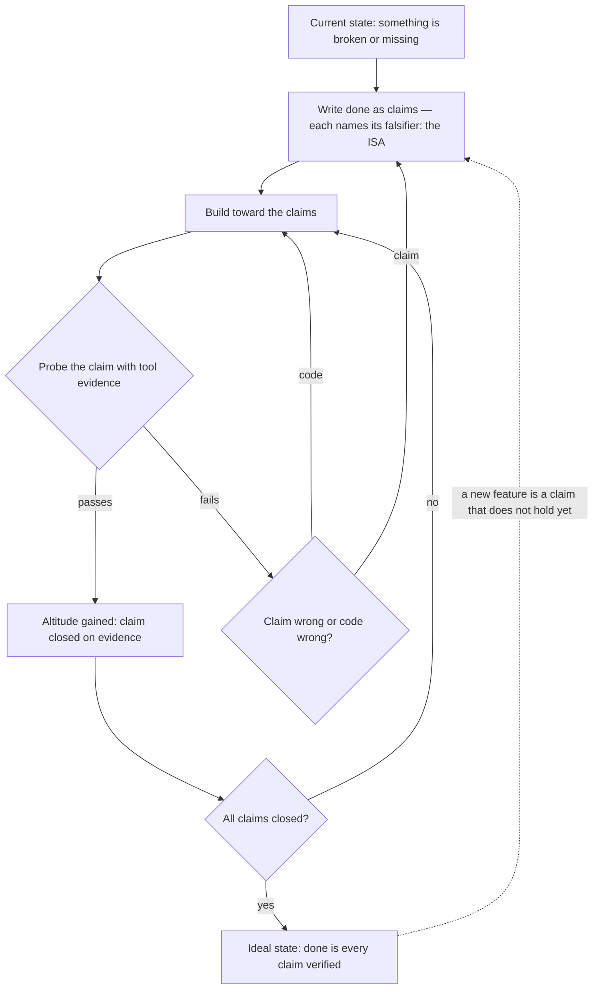

# The Algorithm — the LifeOS Thinking System

> **The Algorithm is how LifeOS thinks.** It is the unified loop that takes anything — a question, a bug, a product, a life goal — from its current state toward its ideal state, by writing done down as testable claims and refining until every claim survives every test it can be subjected to. The claims live in the **ISA** (`ISA/ISASystem.md`); the Algorithm is the system that creates, sharpens, pursues, and verifies them. The ISA is the noun; the Algorithm is the verb.

**The Algorithm names two things: the system and the file.** The system is the whole thinking apparatus — the system prompt, the dynamic context loaded through CLAUDE.md, the Algorithm doctrine file, the ISA, the enforcement hooks, and the Pulse instruments working as one. The file is the done-claims doctrine at `LIFEOS/ALGORITHM/LATEST` → `v{LATEST}.md`. When context makes it ambiguous, say "the Algorithm system" vs "the Algorithm file"; unqualified, "the Algorithm" means the whole.

---

# Part I — Philosophy

## Why a thinking system at all

A frontier model is already an extraordinary executor. What it lacks, out of the box, is everything *around* a single response: durable knowledge of what you ultimately want, a written definition of done, mechanical consequences for claiming completion without proof, and a place where what the work taught survives the session. Left alone, even a superb model produces confident motion in whatever direction the prompt happened to gesture.

The Algorithm is the harness that supplies those missing pieces — and deliberately nothing more. It is the operational half of intent engineering (`LifeOs/LifeOsThesis.md`): TELOS holds what the principal ultimately wants; the ISA holds what done means for this task; the Algorithm is the loop that connects them to actual execution and then verifies the output against the stated intent. Intent is not fully conveyed until the result is checked against it.

## The one loop

Everything is one loop: move a thing from its current state to its ideal state **by climbing a hill we define as we climb it**. Runs are conjecture and refutation against the ISA.

The ISA is the hill and the instrument at once. It articulates the ideal state as claims; each claim names the tool probe that would falsify it, so the spec IS the test suite and **evidence is altitude** — without tool evidence there is no up or down, only motion. A probe passing is height gained. A probe failing forces the productive question: *is the code wrong, or is the claim wrong?* Either answer improves something — the build, or the articulation.

The loop is fractal. A one-line answer and a week-long build are the same loop at different depths; TELOS is the same loop at life scale. There are no modes, no tiers, no separate "simple path" — depth is a property of the work, not a switch on the system.

Enhancement never stops. Every capability in the system — context gathering, thinking skills, research, agents, audits, the nudge layer, the principal's corrections — exists to enhance the ISA: sharpen its claims, surface its unknowns, fold in what the work teaches, until it is the hard-to-vary shape of what done actually means. During the build (nudges), at the close (gates), and after completion — a reopened ISA continues the same climb in a later run; roughly a quarter of real runs iterate.

## The target: euphoric surprise

The whole point of a run is **euphoric surprise**: the principal got exactly the output he wanted, in the right amount of time, for the right amount of spend. Not "technically what was asked." Not "impressive but three days late." The target has three axes — right output, right time, right cost — and missing any one misses it.

This matters because it makes quality a *bounded* objective. A system aimed only at output quality gold-plates; a system aimed only at speed ships slop. Euphoric surprise forces the trade-off to be made consciously on every run, and the completion contract checks it explicitly: the spend matched the task, and breaks in either direction were surfaced, never silent.

## Dynamic range: spend is discovered, never predicted

The Algorithm's most distinctive design decision: **there is no classifier, no effort tier, no complexity rubric anywhere in the system.** Trivial work finishes in seconds on almost nothing; frontier work pulls in parallel agents, cross-vendor audits, stronger models, hours or days. What decides is not a prediction made before the work starts, but the work itself — difficulty is *discovered* from the claims and their evidence gates as the climb proceeds.

The mechanism is elegant: **the claims keep spend honest on their own.** You cannot close what you did not verify, so hard work — work with many claims, deep verification modalities, wide blast radius — pulls the right resources in automatically. Easy work, with two claims and an instant probe, cannot justify ceremony and gets none.

Two things outrank the model's judgment: the principal's explicit steering in plain language ("go heavy", "quick pass", a stated budget), and blast-radius safety rules, which never relax regardless of how small the task feels.

This was not the original design. Earlier versions predicted effort (E1–E5 tiers), routed models by rubric, and mandated per-tier procedure. All of it was retired in mid-2026 — see Lineage below — because prediction-before-work systematically failed in both directions, and because every rubric was scaffolding a more capable model didn't need.

## The governing principle: around the loop, never inside it

The Algorithm adds four kinds of thing to native model execution. It never scripts cognition — no thinking floors, no selection rituals, no mandated reasoning steps, no self-assigned scores. The admission test for any new piece of the system: **is it context, an artifact, a tooth, or an instrument?** If it's a step, a floor, a ritual, or a self-score, it doesn't ship.

| Layer | What it adds | Components |
|---|---|---|
| **Context** | What the model can't know | Identity/TELOS/projects @-imports, learning injection, memory hot-layer, event nudges |
| **Artifacts** | What the model won't externalize | The ISA (`ISA/ISASystem.md` + `ISA/ISAFormat.md`), Decisions/Learning trails, KNOWLEDGE, reflection records |
| **Teeth** | What the model won't hold itself to | The done-claims (`ALGORITHM/LATEST`), the format/verification/ISA-close/ISA-structure/writing gates (`hooks/StopGates.hook.ts` — ISACloseGate blocks a major-work completion claim on a stale ISA, ISAGate blocks a structurally invalid `phase: complete`; both added 2026-07-24), cross-vendor audit, keep-class doctrine (`RULES/Philosophy.md` § Ideal-State Prompting) |
| **Instruments** | What makes the work observable | Pulse (phase telemetry, work registry, live events), voice announcements, observability JSONL streams |

The reasoning behind the ban on scripted cognition is the same Bitter Pill logic that governs all LifeOS prompting: **procedure encoded for a capable model caps it below its ability and rots as models improve.** State WHAT done looks like as testable outcomes, name the constraints, hand over good tools — then trust the model to find HOW. The Algorithm file is therefore an *outcome contract*, not a procedure: it states what must be true when a run is complete, and explicitly leaves how to get there, and how much to spend getting there, to the model's judgment. Four keep-classes of procedural content survive this test and are never cut: safety gates, verified gotchas, exact tool contracts, and output-format contracts.

## Teeth: declarative rules decay, enforcement doesn't

The Algorithm's empirical law, learned from auditing its own history: **declarative rules without mechanical enforcement decay.** Rules that lived only as prose were measured at 11–22% real compliance while self-scored audits reported near-perfect constants — the system was grading its own homework and lying to itself politely.

The response is structural, and every claim in the Algorithm file is annotated with its enforcement class:

- **HOOK** — a deterministic gate blocks mechanically. A done-claim without tool evidence in the transcript is refused at the Stop boundary, not frowned at.
- **CHECK** — a gate the run itself executes and records (completeness scoring, class-sweep enumeration, ask-fidelity logging).
- **SELF** — honest self-attestation, explicitly labeled as such and watched for decay by the recurring audit.

Corollaries: a gate that never fires — or always passes — is presumed theater until data says otherwise. Duplicated inventories are forbidden, because a second copy of any list provably rots. And the system is **audited, not trusted**: a recurring AlgorithmAudit measures token cost of always-loaded surfaces, gate fire/catch rates, dead-letter detection, and doctrine↔implementation drift against a corpus of over a thousand recorded runs.

## Verification doctrine: the modality must match the claim

The deepest single idea in the Algorithm's verification stance: **evidence has a modality, and the probe must exercise the same path the user does.** A file claim closes on a read; a deploy claim on a live probe; a web/UI claim only on a real browser hitting the actual URL; an appearance claim only on viewed, non-degenerate pixels; a motion claim on a frame scrub. "curl returned 200" does not verify a page a human loads in a browser — it can literally fetch a different page.

Two hard-won extensions, each carrying an incident scar:

- **Evidence must cover what the claim spans.** When a claim quantifies over a container — a site, a corpus, a fleet — the container passing is not evidence for its members. The probe set touches every member *type* the user actually consumes, and a deterministic gate sweeps the rest. (The incident: "site is live" closed on a verified homepage while all 21 content pages shipped broken.)
- **Evidence must arrive when the failure can exist.** For cache-mediated surfaces — DNS, certs, CDNs — a probe at T+0 rides warm caches and proves nothing about steady state. Such claims close only on authoritative-source evidence plus a delayed re-probe, or hold an explicit deferred-verify state with a named watcher. (The incident: every post-deletion DNS probe passed on a warm resolver; the domain went dark for the world within the hour.)

And the summary prohibition that carries the whole stance: **"should work" is forbidden vocabulary.** A claim is closed on evidence or it is open.

## Failure is data: the learning half of the loop

A run that only produced its output wasted half of what it generated. The Algorithm treats every run as an experiment on three subjects at once — the thing being built, the articulation of what was wanted, and the system itself:

- **The ISA at close is not the ISA at open.** Discoveries fold in as they arrive: claims added, split, tightened, killed. A run whose transcript shows discoveries but whose ISA shows zero deltas after scaffold has failed this claim.
- **Learnings route to where they structurally live.** A reusable fact lands in KNOWLEDGE; a preference in the operational rules; a non-obvious failure in the skill that owns the domain; a deterministic behavior in a hook. Fixing the system, not writing a memo — the self-healing doctrine.
- **The trail is queryable.** Reflections append to a structured corpus (operational fields only — no self-scores, per the decay law), and that corpus is what the recurring audit and the improvement passes mine. The system's own history is its test data.

---

# Part II — The System

## Component map

| Component | Role in the Algorithm system | Canonical doc |
|---|---|---|
| System prompt | Constitution: output contract, security, verification doctrine | `LIFEOS/LIFEOS_SYSTEM_PROMPT.md` |
| Dynamic context | CLAUDE.md routing table, @-imports, hook-injected session context | `DOCUMENTATION/Config/ConfigSystem.md` |
| The Algorithm file | The done-claims — what a completed run must satisfy | `ALGORITHM/LATEST` → `v{LATEST}.md` |
| ISA | The artifact: done as falsifiable claims | `DOCUMENTATION/ISA/ISASystem.md` + `ISAFormat.md` |
| Hooks | Mechanical enforcement — the teeth that don't decay | `DOCUMENTATION/Hooks/HookSystem.md` |
| Pulse | The instruments | `DOCUMENTATION/Pulse/PulseSystem.md` |
| Memory/Learning | The loop's persistence: reflections, signals, curation | `DOCUMENTATION/Memory/MemorySystem.md` |

## What a completed run must satisfy

The Algorithm file states the full contract — sixteen claims, each annotated with its enforcement tooth. In compressed form, a run is complete when:

1. **Intent survived.** The principal's stated goal is verbatim in the ISA and every claim traces to it or a named derivation; the literal's *intent*, never its surface form, was the optimization target.
2. **Done existed in writing before building** — an ISA at the correct home, claims each naming their falsifier, at least one anti-claim, antecedents when the goal is experiential.
3. **Reality was checked first.** External prerequisites probed before execution; material ambiguity resolved with targeted questions or a flagged default; reported bugs reproduced before their suspect code was read.
4. **Nothing closed without evidence** of the right modality, covering what the claim spans, arriving when the failure can exist. Class defects swept across every sibling. Deferred verification is an explicit tracked state, never a silent pass.
5. **Fidelity to the ask held.** Every explicit ask met, skipped with a stated reason, or surfaced; no claim passed by softening its wording mid-run.
6. **Validation was intrinsic** — the builder never rubber-stamped its own build; independent second looks (cross-vendor audit, fresh-context skeptic, eval suites) are elected by judgment scaled to blast radius, and electing zero on high-stakes work is a logged choice, never a silent one.
7. **The run left its trail** — decisions including dead ends, learnings routed as diffs, evidence collapsed to provenance stubs; the changelog is git.
8. **The state was observable throughout** — ISA frontmatter current, mirrored live to the dashboard without ceremony.
9. **The ISA evolved** — the close-state artifact reflects everything the run discovered.
10. **The spend matched the task** — and when the run replaced or deleted anything serving live traffic, previous functionality was proven restored against a baseline captured *before* the change, with the provider's authority API — not a warm cache — as the source of truth.

That compression is for orientation; the doctrine file is the contract. Read it: `LIFEOS/ALGORITHM/LATEST` → `v{LATEST}.md`.

## The event layer: nudges, not procedure

Standing prose about what to do "whenever X" decays like all declarative rules, so the live layer asks its questions **at the moment they're answerable** instead. One deterministic runner (`hooks/AlgorithmNudge.hook.ts`) fires bounded nudges on events — zero inference, matched against prebuilt indexes:

| When | Ask |
|---|---|
| A prompt matches a skill's trigger conditions | That capability exists — invoke the skill, don't handroll. |
| Work reveals itself as execution-shaped | Mechanical execution classes run on delegate models; the frontier model keeps the judgment legs. |
| The principal directs depth in plain language | His call outranks your judgment — likely a run, not a chat turn. |
| Deep into a session, no ISA registered | Still trivial, or does done need writing down? |
| A probe or test fails | Claim wrong or code wrong? If the claim, update the ISA. |
| The principal messages mid-run | Does this revise the goal, kill a claim, or add one? |
| Research or an agent returns | Anything here the ISA doesn't know yet? |
| A claim closes | Did closing it reveal a neighbor or a class? |
| A quality/behavioral claim resists a single probe | Multi-sample class — is an eval suite the falsifier? |
| Long stretch with no ISA edits | Is the ISA still the true shape of done? |
| Deep into a run, claims still open | Spend check: escalate, descope, or surface? |
| A destructive infra op ran | What did that resource own per the provider's authority API? Prove the flow it served still runs at baseline. |

Rows are bounded by construction: a nudge may only ask a question about an outcome already stated in the Algorithm file. A row that maps phrases to mandated procedure, or whose pass condition is "a tool was invoked," is banned — that would be scripting cognition through the back door.

## Spend

Spend scales to the task — intelligence, verification depth, parallelism, time, and money follow the difficulty and blast radius the work reveals. Every capability is on one menu, elected the same way: skills, agents, thinking tools, stronger models, native harness features, evals — each chosen by judgment against the task, never mandated, never predicted from a label. The default that closes almost every claim is the instant direct probe.

A small set of spend facts are tool-contracts rather than judgment calls: inline-reachable answers spend zero agents; mechanical execution classes dispatch to delegate models while the frontier model keeps judgment work; work units are sized to the model's smart zone (~100k tokens), with the ISA as the durable state that lets execution slices each earn a clean context; and model-carrier facts live in exactly one probed registry (`LIFEOS/TOOLS/models.ts`), never restated as prose that can rot. Current details: the Algorithm file § Spend.

## Telemetry, records, resume

- **Observability is the ISA itself.** `phase:` is a minimal lifecycle value — set at start, at complete, and in between only when it genuinely changes; the ISASync hook mirrors every ISA write to the work registry that feeds Pulse. That write IS the telemetry; there is no separate ceremony.
- **Reflection** — any run that did real work appends a structured record (operational fields only, no self-scores) to the reflections corpus, joinable against the principal's ratings.
- **Resume** — an ISA body edit on a completed task rewinds it to learning and increments the iteration. After context compaction: read the ISA, continue, never redo passed gates. Registry: `MEMORY/STATE/work.json`.
- **Close** — a run ends in the single LifeOS output format (system prompt § Output Format): the answer leads, carries which claims closed on what evidence and what's open.

## Health doctrine

The Algorithm system is audited, not trusted. The recurring **AlgorithmAudit** (in the release/management skill) measures: token cost of always-loaded surfaces, gate fire/catch rates, dead-letter detection, capability reach, budget adherence, and doctrine↔implementation drift. Its baselines are the reflection corpus (1,100+ runs), the execution log, and the observability streams. Run it when efficiency is in question and after any core-surface change.

## Lineage

The Algorithm earned its current shape by repeatedly cutting its own scaffolding:

- **v1–v6** accreted procedure per incident — phases, tiers, selection rituals, self-scored audits — the natural drift of any rule system that patches each failure with a new rule.
- **The 2026-07-10 audit** split kernel from shell with usage data: the verification spine and format contracts earned their place; choreography and self-scores did not (measured compliance for prose-only rules ran 11–22%; self-scores ran near-constant).
- **v7.0.0** restructured the file as an outcome contract. **v8.0.0** (2026-07-11) completed the move: a one-page claim set plus the live event layer. The same day, the modes (MINIMAL/NATIVE/ALGORITHM), the effort tiers (E1–E5), and the model-routing rubric were all retired — spend became discovered, not predicted.
- **v8.x** has since hardened the evidence doctrine with incident-derived claims (container coverage, temporal fidelity, restore-parity baselines) — each new tooth traceable to a real failure, each stated as an outcome, never as procedure.

The system was briefly named **Ascent** (2026-07-10) and renamed **the Algorithm** on 2026-07-11 — one name for the whole thinking apparatus and its doctrine file. Version-by-version history: `LIFEOS/ALGORITHM/changelog.md`.

## Deferred Refactors

A registry of known-good refactors **intentionally deferred** because they're premature today but become correct at a named trigger — documented so the deferral is discoverable, not folklore.

### `Clarify` generic primitive — extract when N=2

**Status:** Deferred. Re-open trigger: a second concrete artifact-owner needs interview-shaped clarification.

**Current state (N=1):** the ISA Interview workflow walks an ISA's thin sections, asks one question at a time, writes answers back. Telos has a parallel-shape workflow performing single-section TELOS edits.

**Why not extract today:** at N=1.5, DRY-ing into a shared `Clarify(artifact, schema, thin_section_detector, question_generator)` primitive would force a speculative API shape — the mechanic differs in cadence, audience, and detector logic.

**Re-open trigger:** the day `Telos.Update` gains an auto-trigger on stale-section detection, OR a third artifact-owner (threat model, content brief, design spec) needs the same shape. "It would be cleaner" alone does not qualify.

## Examples

### One bug, one trip around the loop

A reader reports: **"the newsletter signup button does nothing on mobile."** Watch the Algorithm run its loop on it — the point is that every step is the same conjecture-and-refutation motion, and nothing closes without evidence.

1. **Reproduce before reading code.** Open the page at a phone viewport in a real browser and tap the button. It genuinely does nothing. (Skipping this step — jumping straight to the code — is how you "fix" a bug that was really a caching issue and ship nothing.)

2. **Write done as a claim.** *Tapping "Sign up" on a phone viewport submits the email and shows the confirmation state.* The falsifier is built in: tap, and either confirmation appears or the claim is false.

3. **Probe, and read the failure.** The tap does nothing — the claim is false. Now the loop's defining question: *is the claim wrong, or the code?* Here the claim is right (that's what the button should do), so the code is wrong. A DOM read shows an invisible cookie-banner overlay sitting on top of the button, eating the tap.

4. **Fix, then close on evidence of the right modality.** Give the overlay the correct stacking so the button is reachable. The claim closes only on a real phone-viewport tap that produces the confirmation — not on "the CSS looks right."

5. **Sweep the class.** One overlay ate one button; did it eat others? A single check of every control beneath that overlay — the claim isn't done until its siblings are enumerated and each is clear.

6. **Fold in what it taught.** The overlay-stacking trap becomes a note, so the next run recognizes the pattern instead of rediscovering it.

Six steps, one motion: state done as a falsifiable claim, attack it, let the failure tell you whether the map or the territory was wrong, and never mark it closed without the right evidence.

### The loop as a picture

The diagram is the whole system in one frame: the ISA defines the hill, evidence is the only way up it, a failed probe routes to *either* the build or the articulation, and "done" is a mechanical property — every claim closed — not an opinion. The dashed edge is why the loop never really ends for anything with a lasting identity.

### Spend, discovered not predicted

The same loop runs at wildly different depths, and nothing decides the depth in advance:

- **A one-line answer** ("what's the capital of France?") is the loop collapsed to a single instant probe — no ISA ceremony, no agents. The claim is trivial and closes on recall.
- **A typo fix** writes a one-line Goal, closes one claim on a re-read, and is done in seconds.
- **A payment-flow migration** pulls in parallel agents, a cross-vendor audit, and a captured before/after baseline — because the claims (money still moves, at the old rate, with no dropped transactions) *demand* that evidence, and you cannot close what you did not verify.

Difficulty is read off the claims and their evidence gates, not guessed from a label. The migration earns its spend by having claims that can only be closed expensively; the typo cannot justify ceremony and gets none.

---

## Cross-References

- **The Algorithm file (the contract):** `LIFEOS/ALGORITHM/LATEST` → `v{LATEST}.md` · changelog: `LIFEOS/ALGORITHM/changelog.md`
- **The ISA (the artifact):** `LIFEOS/DOCUMENTATION/ISA/ISASystem.md` · format: `ISA/ISAFormat.md` · hierarchy: `ISA/ISAHierarchy.md`
- **ISA skill:** `~/.claude/skills/ISA/SKILL.md`
- **LifeOS thesis (the loop at OS scale):** `LIFEOS/DOCUMENTATION/LifeOs/LifeOsThesis.md`
- **Ideal-state prompting doctrine:** `LIFEOS/RULES/Philosophy.md` § Ideal-State Prompting
- **Hooks (the teeth):** `LIFEOS/DOCUMENTATION/Hooks/HookSystem.md`
- **Pulse (the instruments):** `LIFEOS/DOCUMENTATION/Pulse/PulseSystem.md`
- **Master architecture:** `LIFEOS/DOCUMENTATION/LifeosSystemArchitecture.md`
- **Historical:** modes (`LIFEOS/ALGORITHM/archive/modes/README.md`, retired) · router (`DOCUMENTATION/Router/RouterSystem.md`, retired)
