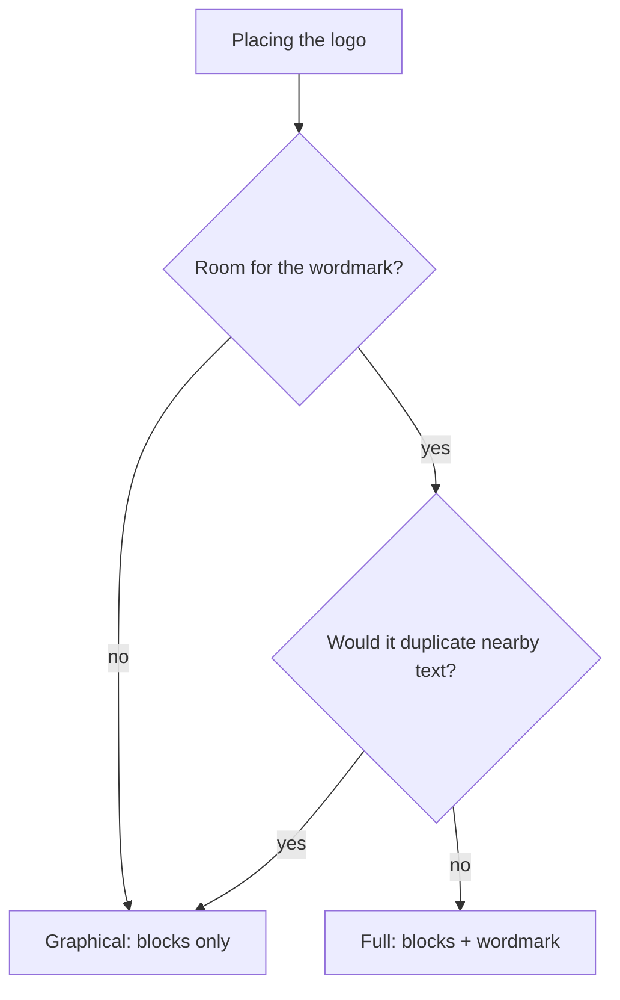

# LifeOS Brand Assets

Canonical logo naming for the whole LifeOS project. Use these names everywhere — docs, repos, site, release, design files.

## The two logos

| Name | What it is | File | Use it for |
|------|-----------|------|------------|
| **LifeOS Logo Full** | The block-glyph **plus** the `LifeOS` wordmark | `lifeos-logo-full.png` | The primary logo. Anywhere text fits: site nav (top-left), GitHub repo README header, release README, docs headers, slides. |
| **LifeOS Logo Graphical** | The block-glyph **only** — the ascending staircase of blocks, no text | `lifeos-logo-graphical.png` | Icon / mark contexts: square placements, hero centerpiece, favicons, app icon, avatars, watermarks. |

**Full = blocks + text. Graphical = blocks only.** That is the whole rule.

## Colors

Blues: light-blue wordmark/blocks (`Life`), bright-blue accent (`OS` and lead blocks), dark-navy accent blocks. Transparent background.

## Rules

- **Full is the default.** Reach for Graphical only when there's no room for the wordmark or the wordmark would duplicate nearby text.
- **Never AI-generate these.** They're deterministic block/tile marks — author/edit as precise SVG with the exact brand colors; PNG exports are for placement only (per the brand-asset authoring rule).
- Keep the filenames `lifeos-logo-full.*` and `lifeos-logo-graphical.*` stable across every repo so references don't drift.

## Where they live

- Site: `ourlifeos.ai` → `public/lifeos-logo-full.png` (nav), `public/lifeos-logo-graphical.png` (hero center).
- Public repo + release: `RELEASE_TEMPLATES/lifeos-logo-full.png` → ships as the README header.

---

## Examples

### Picking a logo for four placements

The rule is one question — *is there room for the wordmark, and would it duplicate text that's already there?* — applied to whatever you're placing.

- **Site nav, top-left.** Plenty of room, no other "LifeOS" text beside it → **Full** (blocks + wordmark). This is the default, and most placements are this.
- **Favicon / browser tab.** A 16-pixel square can't hold a wordmark → **Graphical** (blocks only).
- **A hero section whose headline already says "LifeOS" in big type.** There's room, but the wordmark would just repeat the headline → **Graphical**, so the mark and the text aren't saying the same word twice.
- **Release README header.** Room, no adjacent wordmark → **Full**.

### The case that trips people up

Tight space is the obvious reason to reach for Graphical. The subtler one is duplication: even with plenty of room, if a wordmark sits next to text that already reads "LifeOS," Full makes the page stutter, and Graphical is the right call. When neither condition holds, Full wins by default — you never pick Graphical just because it looks cleaner in isolation.

### The choice as a picture

Two questions, one default: Full unless space or duplication rules it out. That is the entire logo-selection policy in a single fork.
