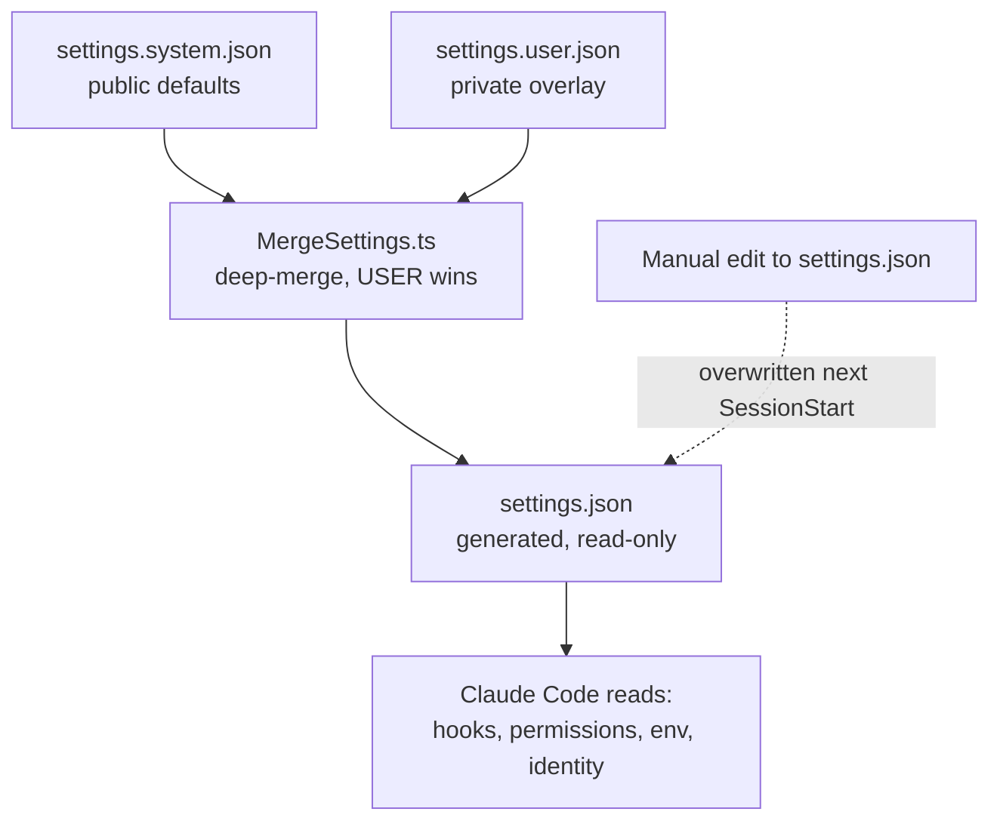

# LifeOS Configuration

> The system/user split is the LifeOS boundary made physical (`LifeOs/LifeOsThesis.md`): the OS (system tree) is the same for everyone and ships publicly; the *life* (USER tree — identity, TELOS, current state) is yours alone. The merge machinery below is what lets one framework run any life without leaking any of them.

LifeOS configuration follows the **system/user separation** contract (`LIFEOS/DOCUMENTATION/SystemUserBoundary.md`). System config ships in the public LifeOS repo; user config lives in the user's own private USER-data repo and mounts into the live tree via symlink. The two halves are merged at runtime — never at release time, never by hand.

## The split, end-to-end

```
~/.claude/                                       # SYSTEM tree (public LifeOS)
├── settings.json                                # Generated at SessionStart by MergeSettings.ts
├── settings.system.json                         # SYSTEM defaults (public-safe, ships in LifeOS)
├── CLAUDE.md                                    # SYSTEM routing table (public-safe)
├── LIFEOS/LIFEOS_SYSTEM_PROMPT.md                     # SYSTEM constitutional rules (public-safe)
├── LIFEOS/TOOLS/LifeosConfig.ts                       # SYSTEM typed loader (INTERFACE)
├── LIFEOS/TOOLS/MergeSettings.ts                   # SYSTEM merge driver (INTERFACE)
└── LIFEOS/USER → ~/.config/LIFEOS/USER                # Symlink to USER tree

~/.config/LIFEOS/USER/                              # USER tree (private USER-data repo, symlinked)
├── CONFIG/
│   ├── settings.user.json                       # USER settings overlay
│   ├── OPERATIONAL_RULES.md                     # USER operational rules (@-imported)
│   └── LIFEOS_CONFIG.toml                          # USER typed-config implementation
├── PRINCIPAL/PRINCIPAL_IDENTITY.md              # USER identity (@-imported)
├── DIGITAL_ASSISTANT/DA_IDENTITY.md             # USER DA identity (@-imported)
├── TELOS/                                       # USER goals + auto-generated PRINCIPAL_TELOS.md
├── PROJECTS.md                                  # USER project registry (@-imported)
└── INTEGRATIONS/*.yaml                          # USER per-integration configs (homebridge, unifi, etc.)
```

## Core files

| File | Tree | Purpose |
|------|------|---------|
| `settings.json` | SYSTEM (generated) | Merged at SessionStart by `MergeSettings.ts` from `settings.system.json` + `settings.user.json`. Read-only at runtime — manual edits get overwritten next session. |
| `settings.system.json` | SYSTEM | Defaults: permissions, env, daidentity defaults, notifications, tips. (Hooks live here in the live/dev tree, but the SHIPPED `install/settings.system.json` omits the `hooks` block — hooks ride separately in `install/hooks/hooks.json`, applied by InstallHooks at setup. `delete base.hooks` in `EmitSkill.ts` strips it at emit.) Ships in public LifeOS. |
| `LIFEOS/USER/CONFIG/settings.user.json` | USER | Per-principal overlay: identity values, voice IDs, principal name + timezone, custom `spinnerVerbs` + `spinnerTipsOverride`, env overrides. Deep-merged into system defaults; USER always wins. |
| `CLAUDE.md` | SYSTEM (with USER `@`-imports) | Routing table + top-level `@`-imports of USER identity files. Public release template at the release skill's `RELEASE_TEMPLATES/CLAUDE.public.md`. |
| `LIFEOS/LIFEOS_SYSTEM_PROMPT.md` | SYSTEM | Constitutional rules (system prompt layer, loaded via `--append-system-prompt-file`). |
| `LIFEOS/USER/CONFIG/OPERATIONAL_RULES.md` | USER | Per-principal operational rules: repo conventions, env paths, vendor-specific doctrine (Cloudflare token, deploy semantics). `@`-imported directly from `CLAUDE.md` — CC does not follow transitive `@`-imports. |
| `LIFEOS/USER/CONFIG/LIFEOS_CONFIG.toml` | USER | Typed user config (identity name/pronunciation/timezone, integration credentials, paths). Read via `LifeosConfig.load()`. |
| `LIFEOS/TOOLS/LifeosConfig.ts` | SYSTEM (INTERFACE) | Typed loader. Returns a strongly-typed object; the schema is the SYSTEM↔USER contract. |
| `LIFEOS/TOOLS/MergeSettings.ts` | SYSTEM | Deep-merge driver that produces `settings.json` from `settings.system.json` + `settings.user.json` at SessionStart. |
| `LIFEOS/USER/INTEGRATIONS/{homebridge,unifi,airgradient}.yaml` | USER | Per-integration credentials/endpoints for private `_*` skills. |
| `LIFEOS/USER/WORK/config.yaml` | USER (optional) | `WORK.REPO` for the Work System. |

## How it works at runtime

1. **SessionStart** — `MergeSettings.ts` reads `settings.system.json` + `LIFEOS/USER/CONFIG/settings.user.json`, deep-merges (USER wins on conflict), writes `settings.json`. This file is what Claude Code reads for hooks, permissions, env, identity.

   **Merge semantics for arrays (public issue #1575, @dactylmedia):** a plain array in the user overlay REPLACES the system array wholesale — it does not extend it. Additive intent requires the annotation form: `{"__merge": "append", "values": [...]}`. A user hand-porting deny rules or hooks with a plain array clobbers the system's list; a user expecting append gets replace. The annotation is consumed at merge time and never appears in the output.

   **Overlay location is load-bearing:** the user overlay is read ONLY from `LIFEOS/USER/CONFIG/settings.user.json`. A `settings.user.json` placed at the config root is never read — MergeSettings warns loudly when it sees one there.

   **Permission-rule shape — file rules are `Edit(path)`, never `Write(path)`.** The harness resolves file permissions against `Edit(...)` alone, and `Edit` covers every file-editing tool. `Write(/etc/**)` next to `Edit(/etc/**)` guards nothing and the CLI complains about it at startup. Verified by live probe, not by counting: with only `Edit(~/.claude/projects/**/memory/**)` present and no Write twin, the Write tool was DENIED there; with no Write allow rule present, Write to `~/.claude/` was ALLOWED (commit `b68b1a5c4`). **This has been "fixed" the wrong way three times** — 2026-07-16, 07-25, 07-27 — every time from an audit that read a settings file, saw an `Edit` rule with no `Write` twin, and filed it as an unguarded path. A config-shape count is not a behavior probe. Two teeth now hold the line: `MergeSettings.prunePermissionRules` strips `Write(...)`/`MultiEdit(...)` path rules out of the generated `settings.json` from whichever source layer they land in, and `/ic` check 15 `permission-rule-shape` BLOCKS on any that remain in a source layer. Bare `Write` with no specifier is a tool-level rule and is honored — it is untouched.
2. **Identity** — DA and principal values live in `settings.json` under `daidentity` and `principal` keys (provenance: USER overlay). Hooks read these via `hooks/lib/identity.ts` (`getIdentity()`, `getPrincipal()`, `getDAName()`, `getVoiceId()`).
3. **Skills** — private `_*` skills that need credentials/integration data read `LIFEOS_CONFIG.toml` via `LifeosConfig.load()` (e.g. a home-automation skill reads its Homebridge token; the network skill reads UniFi creds).
4. **CLAUDE.md `@`-imports** — at session start, CC loads files referenced by top-level `@`-imports in `CLAUDE.md` (ARCHITECTURE_SUMMARY, PRINCIPAL_TELOS, PRINCIPAL_IDENTITY, DA_IDENTITY, PROJECTS, OPERATIONAL_RULES). CC does NOT follow transitive `@`-imports from inside imported files, so identity files must be listed in `CLAUDE.md` directly.

## Editing

- **Identity / voice / principal name / per-machine integrations** → edit `LIFEOS/USER/CONFIG/settings.user.json` (USER overlay) or `LIFEOS_CONFIG.toml`. Takes effect next SessionStart.
- **Hooks / permissions / system defaults** → edit `settings.system.json`. Takes effect next SessionStart.
- **Routing / `@`-imports / subsystem pointers** → edit `CLAUDE.md`. Takes effect next session.
- **Constitutional rules** → edit `LIFEOS/LIFEOS_SYSTEM_PROMPT.md`. Takes effect next session.
- **NEVER edit `settings.json` directly** — it's generated. Edits get overwritten on next SessionStart.

## Write-time enforcement

`hooks/SystemFileGuard.hook.ts` (PreToolUse, Phase E) blocks USER content from landing in SYSTEM files at write time. Fail-safe-open on hook errors. Primary defense against drift; catches violations the moment they would land, not at release time. Tests: 19/19 pass.

## Two-repo sync

The two trees are physically separate git repos:
- `~/.claude/` → `<your-username>/.claude` (PRIVATE GitHub)
- `~/.config/LIFEOS/USER/` → `<your-username>/<your-user-data-repo>` (PRIVATE GitHub)

The two repos (`~/.claude` and the `~/.config/LIFEOS/USER` data repo) are committed, pushed, and version-tagged together by the release skill's UpdateKaiRepo workflow — there is **no** pre-push auto-sync git hook (a stale claim corrected 2026-07-04). A "push both repos" invocation wraps the two-repo push with four boundary gates:
1. USER-zone leak check on pending `~/.claude` changes
2. `DenyListCheck.ts` must return 0 real-leaks
3. Both remotes confirmed private via `gh api`
4. Post-push HEAD verification on both repos

**Pre-flight refuses to proceed if the public LifeOS repo appears in either remote** — the workflow is explicitly for the two PRIVATE repos only. Public LifeOS release goes through the separate shadow-release pipeline with the 14 ShadowRelease gates.

## Public releases

The Shadow Release system (the release skill's `ShadowRelease` tool) produces public staging at `~/.claude/LIFEOS/LIFEOS_RELEASES/{VERSION}/.claude/` via **containment** — clone the live tree, delete sensitive zones (USER, MEMORY, private underscore-prefixed skills), overlay fixed public templates from the release skill's `RELEASE_TEMPLATES/` (including `CLAUDE.public.md` + `settings.public.json`), run 19 gates (G1–G14 + G17 case-portability, G18 offensive-leak, G19 retired-capability leak; G1–G14: zone deletion, identity grep, CF ID grep, trufflehog, .env strays, private tokens, ref integrity, private-skill refs, username-path leak, staging boot, dashboard leak, template-only USER/MEMORY, hidden-file leakage, critical-artifact presence). Write `.shadow-state.json` report. `EmitSkill.ts` then reshapes this `.claude/` staging into the shippable `{VERSION}/LifeOS/` skill (and drops the staging clone) — the published distribution unit is that one self-contained skill, not the `.claude/` tree. Staging is isolated from `~/Projects/LIFEOS/`; public publish is a separate explicit step.

The release skill's workflows:
- **ReviewContainmentZones** — reconcile zone module against live tree (mandatory before any release build).
- **CreateShadowRelease** — fresh build at a version (Step 0 is zone review).
- **UpdateShadowRelease** (`/ur`) — full rebuild at current version.
- **CheckReleaseSecurity** — read-only 19-gate validation against existing staging.
- **CreateRelease** — public publish (Stage 2, requires all 19 gates green).

## Migration history

- **Phase B (2026-05-21)** — `settings.json` split into `settings.system.json` (public) + `settings.user.json` (USER). `MergeSettings.ts` merges at SessionStart.
- **Phase C (2026-05-22)** — `CLAUDE.md` becomes thin router with direct `@`-imports of USER identity files. `OPERATIONAL_RULES.md` created in `LIFEOS/USER/CONFIG/`. `CLAUDE.user.md` sidecar created and then deleted 2026-05-23 (merged back into `CLAUDE.md`) because CC doesn't follow transitive `@`-imports.
- **Phase E (2026-05-22)** — `SystemFileGuard.hook.ts` runtime write-time enforcement begins.
- **Phase F (2026-05-22)** — `LifeosConfig.ts` typed loader + `LIFEOS_CONFIG.toml` populated. Private skills migrated from hardcoded credentials to `LifeosConfig.load()`.
- **Phase G (2026-05-22→23)** — separate private GitHub repo created for USER data. `~/.claude/LIFEOS/USER` becomes symlink to `~/.config/LIFEOS/USER`. Two-repo sync is handled by the UpdateKaiRepo workflow (no pre-push git hook — stale claim corrected 2026-07-04). A two-repo-push workflow ("push both repos") ships in the private release skill with four boundary gates.
- **Phase H (deferred)** — PR-time `DenyListCheck` via GitHub Actions; community v5→v6 migration tool.

## Pre-v6.0 history

The pre-Phase-A model used `LIFEOS_CONFIG.yaml` as a credentials store and a single `settings.json` directly edited by hand. There was no system/user boundary enforced at write time; defenses were release-time only. That model is retired — the contemporary architecture is the split + symlink + `LifeosConfig.ts` described above. The release tooling preserves a `settings.public.json` template for the public release path but the live system reads only from the split files.

## Examples

### One framework, two different machines

The whole split at its smallest: **two people install the same public LifeOS, and their running config comes out different.**

The system half is identical for both — same `settings.system.json`, same defaults, shipped in the public repo. What differs is the USER overlay each person keeps in their own private repo. At SessionStart, `MergeSettings.ts` deep-merges the two, and USER wins on any conflict:

- The shipped default sets a neutral notification voice.
- One person's `settings.user.json` names their own voice ID.
- After the merge, their `settings.json` carries *their* voice; the other person's carries the default.

Neither edited the system file. The framework stayed the same for everyone; the life on top of it stayed private to each.

### Which file do I edit?

The reinforcing rule is knowing where a change belongs — because `settings.json` is generated and editing it is wasted work:

- **Change your voice or principal name?** → the USER overlay (`settings.user.json`). It survives, and it wins the merge.
- **Change a system default or a hook?** → `settings.system.json`. It ships to everyone.
- **Change `settings.json` directly?** → don't. It's regenerated next SessionStart and your edit is gone.

The test is simple: is this *the framework* or *your life*? Framework goes in the system tree; your life goes in the USER overlay. The merge keeps them apart forever.

### The merge, at SessionStart



The diagram is the boundary made mechanical: two inputs, one deterministic merge, one generated output the runtime actually reads. The dashed edge is why hand-editing the output never sticks — the next session rebuilds it from the two sources.

---

## Cross-references

- System/user boundary contract: `LIFEOS/DOCUMENTATION/SystemUserBoundary.md`
- Master architecture: `LIFEOS/DOCUMENTATION/LifeosSystemArchitecture.md`
- Release skill workflows (private): UpdateKaiRepo, CreateShadowRelease, CreateRelease
- Hook system: `LIFEOS/DOCUMENTATION/Hooks/HookSystem.md` (SystemFileGuard, MergeSettings invocation)
