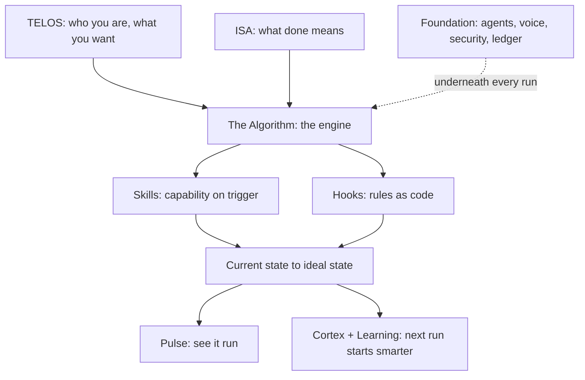

# LifeOS Core Components

LifeOS is the AI harness that moves you from where you are now to where you want to be — an intent engineering platform. Every task — shipping code, writing an essay, making a decision — is the same move, from **current state to ideal state**, pursued through verifiable iteration, with your ultimate intent conveyed into every run.

That one loop is built from a set of components. They fall into two tiers. The **unique features** are the parts that make LifeOS what it is — you won't find this combination anywhere else. The **supporting components** are the subsystems that make the unique ones work.

This doc is the canonical map. Each component links to its full reference.

---

## The Unique Features

The twelve things that make LifeOS LifeOS.

### 1. Current State → Ideal State

The whole philosophy in one line: name where you are, name where you want to be, then close the gap with steps you can check. Ideal state is written down as testable criteria, so "done" can't drift — you either meet the criteria or you don't. Everything else in the system serves this move.

→ `LifeOs/LifeOsThesis.md`

### 2. Intent Engineering

The platform's defining job: capture what you ultimately want — TELOS for your life, ISAs per task — and convey that intent to your AI on every run, then verify the output against it. Direction, not execution, is AI's bottleneck; this component is the fix. And it's still prompting: the WHAT layer of it, productized.

→ `LifeOs/LifeOsThesis.md`

### 3. General Hill Climbing

The loop under everything. Your ideal state is the top of the hill, broken into testable criteria that tell up from down. On every task the system picks the next move that reduces the gap, checks it against those criteria, and keeps what moves uphill. It's general because the same climb works for any goal — code, writing, health, a hard decision — not just one kind of work. No check means no gradient, so verification is what makes the climb real.

→ `LifeOs/LifeOsThesis.md`

### 4. Euphoric Surprise

The metric the whole climb aims at: a response so good you say it out loud, "OMG, this is brilliant," rated a 9 or 10. Naming Euphoric Surprise as the target keeps the bar higher than merely good enough, and it holds across everything you do, code, writing, a decision, a design, because every task climbs toward an ideal state, and this is what reaching it feels like.

→ `LifeOs/LifeOsThesis.md`

### 5. TELOS

Where you write down who you are and what you're trying to do: your mission, goals, problems, strategies, beliefs, and challenges. You don't start from a blank file — LifeOS interviews you to draw it out, asking what you're building, who matters to you, and where you want to go, then writes it down for you. From then on every recommendation is framed against it, so the system works toward your actual life, not a generic answer.

→ `LifeOs/LifeOsThesis.md`

### 6. The Algorithm

The centerpiece. The unified thinking system that takes a vague request, turns it into a hard-to-vary spec (the ISA), and climbs toward it with verified iteration, closing each claim only on real evidence. It scales its own effort to the work — a fast lane for simple asks, full depth for hard ones — discovered from the task rather than a fixed set of phases. This is where current-state-to-ideal-state actually happens.

→ `Algorithm/AlgorithmSystem.md`

### 7. ISA System

The Ideal State Artifact — one document that captures what "done" looks like as verifiable criteria. It works like a product spec, but general, for any task from code to art to strategy. It breaks the ideal state into discrete Ideal State Criteria (ISCs) that double as the test harness, so every Algorithm run reads, extends, and checks against one living document.

→ `ISA/ISASystem.md`

### 8. The Skill System

Self-activating, composable units of domain expertise. A skill is deterministic code wrapped in a natural-language trigger, so the right capability fires the moment you describe the task — no menu, no command to remember. There are over a hundred of them, and they compose.

→ `Skills/SkillSystem.md`

### 9. The Hook System

Deterministic lifecycle interception. Hooks run at fixed points across a session — before a tool call, after output, at session start and stop — and enforce the rules a model can't be trusted to remember every time. This is how the system stays honest: the guardrails are code, not good intentions.

→ `Hooks/HookSystem.md`

### 10. Pulse

The Life Dashboard — the live surface onto the whole system. Pulse shows your current-to-ideal progress, what the system is working on right now, your memory and freshness state, and the health of every subsystem. It's how you *see* LifeOS run.

→ `Pulse/PulseSystem.md`

### 11. Custom Spinner Verbs

The small touch that makes the system feel alive. While LifeOS works, the statusline shows a custom animated working-verb — your own vocabulary, colors, and animation — alongside rotating tips about the system. A distinctive, personal detail most tools never bother with.

→ `Spinner/SpinnerSystem.md`

### 12. Custom Tooltips

Context where you need it. The dashboard's tooltips and freshness indicators explain what each number, chart, and badge means the moment you hover — so the surface teaches itself instead of sending you to a manual.

→ `Pulse/Tooltips.md`

---

## Supporting Components

The subsystems the unique features are built on.

### Cortex

The memory system — everything LifeOS knows, as a product of its own. Named for where the brain stores long-term memory: hooks and an autonomic reviewer consolidate what each session taught, and the tiered store keeps it — hot-layer facts, a typed knowledge graph, learnings, and work history — so every session starts smarter than the last.

→ `Memory/MemorySystem.md`

### Synapse

The input router. Anything that crosses your attention — a link, a video, a PDF, a spoken thought — enters through one capture contract, is preserved instantly in the amber ledger (the write-ahead journal), graded against what you're actually trying to do, and routed where it belongs. Nothing interesting gets away, and you can find it years later.

→ `Synapse/SynapseSystem.md`

### Atlas

The current state of everything you own. Domains, servers, apps, accounts, keys, and devices held as one graph rather than a list, so you can ask what you have, what depends on what, and what a single compromise would reach.

→ `Atlas/AtlasSystem.md`

### Agents

Parallel delegation. Hard work fans out to specialized agents — researchers, builders, adversarial reviewers — that run concurrently and report back, so the system thinks in parallel instead of one step at a time.

→ `Agents/AgentSystem.md`

### Voice

Spoken notifications. The system talks to you — phase transitions, completions, alerts — in a voice you choose, so you can stay in flow without watching the terminal.

→ `Notifications/NotificationSystem.md`

### Learning

Every run reflects on itself. What worked, what didn't, and what a smarter version would have done gets captured and fed back into how the system behaves next time.

→ `Memory/MemorySystem.md`

### Security

Privacy and safety are enforced, not assumed. Deterministic gates keep private data private, treat outside content as read-only, and block anything unsafe before it runs.

→ `Security/README.md`

### Ledger

The change-tracking system. Every change gets the right version and leaves a queryable record — system edits classified and bumped (Major.Feature.Patch across the OS and every component), an append-only update registry, integrity-gated shipping, drift nagging, and a deploy event for everything that ships anywhere. One place answers "what changed, when, at what version, verified how."

→ `Ledger/LedgerSystem.md`

---

## How they fit together

Current-state-to-ideal-state is the **why**, intent engineering is the **job**, and Euphoric Surprise is the **bar** it aims for. The Algorithm is the **engine** that runs it. Skills and hooks are the **machinery** that make each run capable and safe. Pulse, spinner verbs, and tooltips are how you **see and feel** it. Cortex, agents, voice, learning, security, and the ledger are the **foundation** underneath. Together they're the whole of what makes LifeOS work.

---

## Examples

### One task, through the components

The map is easier to hold once you watch a single task cross it. Take **turning a rough idea into a published blog post.**

- **TELOS** frames it — the system already knows this person is trying to build an audience, so the post isn't judged in a vacuum.
- **The ISA** writes down what "done" means as checkable criteria: the draft makes its argument, it's in the writer's voice, it has a header image, links resolve.
- **The Algorithm** runs the climb — draft, check against the criteria, keep what moves uphill — spending little on the easy parts and more on the argument.
- **A skill** fires the moment the task is described — a blogging skill, triggered by the words, not chosen from a menu.
- **A hook** enforces what can't be left to memory — the writing passes an AI-tell audit before the writer ever sees it.
- **Pulse** shows the run happening, and **Cortex** keeps what the run learned, so the next post starts smarter.

Six components, one move from current state (a rough idea) to ideal state (a published post that meets its criteria). None of them is optional ceremony; each does a distinct job in the same climb.

### Spend matches the task

The reinforcing point is that the map isn't a checklist every task must complete:

- **"What's 12% of 340?"** touches almost nothing — the Algorithm answers it in one step. No ISA, no skill, no agents. Lighting up the whole map here would be waste.
- **"Migrate the whole site to a new framework"** lights up most of it — an ISA with many criteria, parallel agents, security gates, memory of every decision.

Same components, wildly different depth, because effort is read off the task, not fixed in advance. The map shows what's *available*; the work decides what's *used*.

### The tiers, working together

The diagram sorts the two tiers by role: TELOS and the ISA aim the engine, skills and hooks make each run capable and safe, Pulse and Cortex are how you see it and how it compounds, and the supporting components sit underneath the whole climb.
