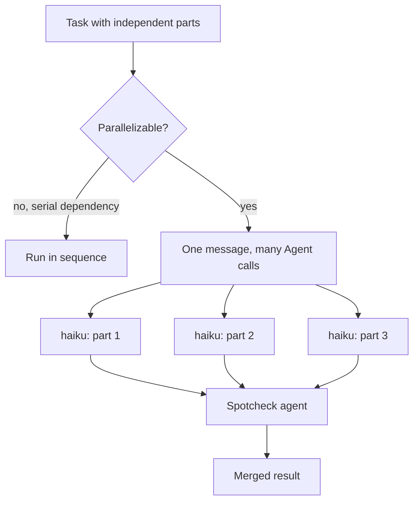

> **RETIRED 2026-07-21 (BPE capability-surfacing cleanup).** The Delegation skill and this
> reference are gone: they hand-maintained a manual of harness capabilities (`Task()`,
> `TeamCreate`/`team_name`, `max_turns`, effort tiers) that rotted against the live tool
> surface. Capability existence is surfaced natively — tool schemas ride in context every
> turn, skills list their USE WHEN, agent types their descriptions, ToolSearch loads the
> rest. What LifeOS keeps is only what the harness can't know: election rules and spend
> facts (Algorithm §Spend), the fork-reviewer clause (claim 11), dispatch/model rules
> (OPERATIONAL_RULES § Model selection). The `retired-tokens` /ic check blocks this rot
> class from returning. This document is kept as history only — nothing below is operative.

# Delegation & Parallelization Reference

> Delegation exists so the LifeOS hill-climb (`LifeOs/LifeOsThesis.md`) doesn't serialize: independent gap-closing work runs in parallel, matched to the cheapest model that can do it.

**Quick reference in SKILL.md** → For full details, see this file

---

## 🤝 Delegation & Parallelization (Always Active)

**WHENEVER A TASK CAN BE PARALLELIZED, USE MULTIPLE AGENTS!**

### Model Selection for Agents (CRITICAL FOR SPEED)

**The Agent tool has a `model` parameter - USE IT.**

**Resuming agents:** To continue a previously spawned agent, use `SendMessage({to: agentId})`. This auto-resumes stopped background agents. Do NOT use `Agent(resume=...)` — the `resume` parameter no longer exists.

Agents that omit `model` inherit the session model (harness behavior — the AgentInvocation model injector was removed v1.3.0, 2026-07-11 baseline; the hook now only logs each dispatch's resolved model to subagent-events.jsonl). Model choice is per-dispatch judgment: pass `model` explicitly when a different rung fits the work — Sonnet/Haiku for utility or mechanical fan-outs, the strongest available for intelligence-hungry dispatches (note `model: fable` on Agent executed Opus at last probe, 2026-07-07 — genuine Fable off the main loop is the `Inference.ts --level max` subprocess). Each inference with 30K+ context takes 5-15 seconds on a frontier model; a simple 10-tool-call task = 1-2+ minutes of pure thinking time.

**Model Selection Matrix:**

| Task Type | Model | Why |
|-----------|-------|-----|
| Deep reasoning, complex architecture, strategic decisions | `opus` | Maximum intelligence needed |
| Standard implementation, moderate complexity, most coding | `sonnet` | Good balance of speed + capability |
| Simple lookups, file reads, quick checks, parallel grunt work | `haiku` | 10-20x faster, sufficient intelligence |

**Examples:**

```typescript
// WRONG - defaults to Opus, takes minutes
Agent({ prompt: "Check if blue bar exists on website", subagent_type: "general-purpose" })

// RIGHT - Haiku for simple visual check
Agent({ prompt: "Check if blue bar exists on website", subagent_type: "general-purpose", model: "haiku" })

// RIGHT - Sonnet for standard coding task
Agent({ prompt: "Senior engineer, TDD. Implement the login form validation", subagent_type: "general-purpose", model: "sonnet" })

// RIGHT - Opus for complex architectural planning
Agent({ prompt: "System design / distributed systems. Design the distributed caching strategy", subagent_type: "general-purpose", model: "opus" })
```

**Rule of Thumb:**
- If it's grunt work or verification → `haiku`
- If it's implementation or research → `sonnet`
- If it requires deep strategic thinking → `opus` (or let it default)

**Parallel tasks especially benefit from haiku** - launching 5 haiku agents is faster AND cheaper than 1 Opus agent doing sequential work.

### Agent Types

**Default for parallel work: custom agents as inline briefs on `general-purpose`.** (The old `Agents` composition skill — ComposeAgent/Traits.yaml — was retired; see `AgentSystem.md` § Forbidden Patterns. Public issue #1504, @tzioup, caught the stale routing here.)

Compose task-specific agents by writing the role/perspective/voice directly into each prompt:
- Use a SINGLE message with MULTIPLE Agent tool calls
- Each agent gets FULL CONTEXT and a DETAILED role brief written into its prompt, launched with `subagent_type: "general-purpose"`
- ~~Launch as many as needed (no artificial limit)~~ — corrected 2026-07-23 (public PR #1569, @elhoim): since Claude Code 2.1.217, concurrently-running subagents are capped (default 20, override `CLAUDE_CODE_MAX_CONCURRENT_SUBAGENTS`) and subagents no longer spawn nested subagents by default (override `CLAUDE_CODE_MAX_SUBAGENT_SPAWN_DEPTH`)
- **ALWAYS launch a spotcheck agent after parallel work completes**

**Agent routing by task type:**
- **Research tasks** → Use the Research skill (has dedicated researcher agents)
- **Code implementation** → Use `general-purpose` with a senior-engineer/TDD brief in the prompt
- **Architecture/design** → Use `general-purpose` with a system-design / distributed-systems brief in the prompt
- **Everything else** → Write a distinct inline brief per agent → `subagent_type: "general-purpose"`

### 🚨 AGENT ROUTING (Always Active)

**Three Agent Systems — preference order:**

| Priority | User Says | System | Tool | What Happens |
|----------|-----------|--------|------|-------------|
| **1. DEFAULT** | "parallel work", "agents", "team", "swarm", or Algorithm selects delegation | **Agent Teams** | `TeamCreate` → `Agent` with `team_name` → `TaskCreate` → `SendMessage` | Persistent teammates, shared task list, peer messaging, task dependencies |
| **2. EXPLICIT** | "**custom agents**", "spin up **custom** agents" | **Custom Agents** (inline briefs) | `Agent(subagent_type="general-purpose", prompt=<distinct role brief per agent>)` | Unique personalities, voices, one-shot parallel work |
| **3. UNATTENDED** | "run overnight", "long-running", "CI trigger", or task exceeds session lifetime | **Managed Agents** (Anthropic cloud API) | `Skill("claude-api")` to build workflows | Durable sessions, sandboxed containers, vault credentials, $0.08/session-hour |

**These are three distinct systems:**
- **Agent Teams** = persistent local teammates with shared task lists, messaging, and multi-turn coordination via `TeamCreate`. DEFAULT for all parallel work.
- **Custom Agents** = one-shot parallel workers with unique identities written as inline briefs. ONLY when {{PRINCIPAL_NAME}} explicitly says "custom agents".
- **Managed Agents** = cloud-hosted agents with durable sessions that survive disconnects. For unattended/overnight work only.

**Additional routing by task type:**

| User Says | What to Use | Why |
|-------------|-------------|-----|
| "research X", "investigate Y" | **Research skill** | Dedicated researcher agents |
| Code implementation tasks | **`general-purpose`** + senior-engineer/TDD brief | Job-specific brief replaces the retired Engineer type |
| Architecture/design tasks | **`general-purpose`** + system-design brief | Job-specific brief replaces the retired Architect type |

**For Agent Teams (default):**
1. `TeamCreate` with descriptive team name
2. `TaskCreate` for each work item (with dependencies if needed)
3. Spawn teammates via `Agent` with `team_name` and `name` parameters
4. Teammates self-claim tasks, message each other, go idle between rounds

**For Custom Agents (only when explicitly requested):**
1. Write a distinct inline brief for EACH agent — role, perspective, voice, expertise in the prompt itself
2. Launch each brief as `subagent_type: "general-purpose"`
3. Each agent gets a personality-matched ElevenLabs voice (described in the brief)

**For research specifically:** Use the Research skill, which has dedicated researcher agents (ClaudeResearcher, GeminiResearcher, etc.)

**Reference:** agent routing (`LIFEOS/DOCUMENTATION/Agents/AgentSystem.md`) | Managed Agents: https://www.anthropic.com/engineering/managed-agents

**Full Context Requirements:**
When delegating, ALWAYS include:
1. WHY this task matters (business context)
2. WHAT the current state is (existing implementation)
3. EXACTLY what to do (precise actions, file paths, patterns)
4. SUCCESS CRITERIA (what output should look like)
5. TIMING SCOPE (fast|standard|deep) — controls agent output verbosity

### Timing Scope in Agent Prompts

Every agent prompt MUST include a `## Scope` section that matches the validated timing tier from the Algorithm's THINK phase. This prevents agents from over-producing on simple tasks or under-delivering on complex ones.

**Timing + Model Selection:**

| Timing | Model | Agent Output | Example |
|--------|-------|-------------|---------|
| **fast** | `haiku` | <500 words, direct answer | "Check if server is running" |
| **standard** | `sonnet` | <1500 words, focused work | "Implement login validation" |
| **deep** | `opus` | No limit, thorough analysis | "Comprehensive security audit" |

**Examples:**

```typescript
// FAST — simple check, haiku model, minimal output
Agent({
  prompt: `Check if the auth middleware exports are correct.
## Scope
Timing: FAST — direct answer only.
- Under 500 words
- Answer the question, report the result, done`,
  subagent_type: "Explore",
  model: "haiku"
})

// STANDARD — typical implementation work
Agent({
  prompt: `Senior engineer, TDD. Implement input validation for the login form.
## Scope
Timing: STANDARD — focused implementation.
- Under 1500 words
- Stay on task, deliver the work, verify it works`,
  subagent_type: "general-purpose",
  model: "sonnet"
})

// DEEP — comprehensive analysis
Agent({
  prompt: `Offensive-security operator mindset: map the attack surface, find the seam, prove it, document it. Authorized testing only.
Perform a thorough security review of all auth flows.
## Scope
Timing: DEEP — comprehensive analysis.
- No word limit
- Explore alternatives, consider edge cases
- Thorough verification and documentation`,
  subagent_type: "general-purpose",
  model: "opus"
})
```

---

## Async Primitives — When to Use What

Three primitives for non-blocking work. Pick the right one:

| Primitive | Tool | Token Cost | Notification | Use When |
|-----------|------|-----------|--------------|----------|
| **One-shot wait** | `Bash(run_in_background)` | Zero until done | On exit (success/fail) | Build, deploy, test suite, any command you just need to finish |
| **Event stream** | `Monitor` | Zero between events | Per stdout line | Log tailing, CI status polling, file watching, deploy streaming |
| **AI work** | `Agent(run_in_background)` | Full agent cost | On completion | Research, implementation, analysis — work requiring reasoning |

**Decision flow:**
1. Does it need AI reasoning? → `Agent(run_in_background)`
2. Do you need events as they happen? → `Monitor`
3. Just need to know when it's done? → `Bash(run_in_background)`

**Monitor vs Pulse:** Monitor is an in-session watcher — lives and dies with the conversation. Pulse is the out-of-process daemon that runs 24/7. Use Monitor for session-scoped watching (deploy logs, CI). Use Pulse for persistent monitoring (iMessage, Siri, cron checks).

**Monitor guidelines:**
- Always use `grep --line-buffered` in pipes — without it, pipe buffering delays events by minutes
- Poll intervals: 30s+ for remote APIs (rate limits), 0.5-1s for local checks
- Handle transient failures in poll loops (`curl ... || true`)
- Only stdout triggers notifications — stderr goes to output file (readable via Read)
- Set `persistent: true` for session-length watches (PR monitoring, log tails)
- Use `TaskStop` to cancel a monitor early
- Selective filters only — never pipe raw logs. Monitors producing too many events get auto-stopped.

---

## Knowledge Archive Access

Delegated agents can query the **Knowledge Archive** (`~/.claude/LIFEOS/MEMORY/KNOWLEDGE/`) for accumulated knowledge organized by 4 entity types: People (human beings), Companies (organizations), Ideas (insights/theses/analyses), Research (longer-form research notes). Topic is a tag, not a domain. Managed by Algorithm LEARN phase (direct writes), `LIFEOS/TOOLS/KnowledgeHarvester.ts` (validation/maintenance), and the `/knowledge` skill. Include archive query instructions in agent prompts when the task benefits from prior research or domain context.

---

## Examples

### One task, four workers, one message

Delegation at its smallest: **a task that splits cleanly into independent parts, run all at once instead of one after another.**

Say a small site has four sections and you need to know which ones have a broken link. The parts don't depend on each other — checking section two tells you nothing about section three. So you fan out: four agents in a *single* message, each handed one section, each on `haiku` because the work is mechanical lookup, not reasoning. They run at the same time and report back. Then one spotcheck agent confirms the four results line up.

Four `haiku` agents finishing together is faster *and* cheaper than one `opus` agent walking the sections in sequence. The model is matched to the work (grunt work → `haiku`), and the parallelism is matched to the structure (independent parts → fan out).

### When not to fan out

The reinforcing case is knowing when parallel is the wrong move — because forcing it either breaks the work or wastes agents:

- **Serial dependency** — "write the migration, *then* test it against the result." The test needs the migration's output. Parallelizing would have the tester grading a thing that doesn't exist yet. Run it in sequence.
- **A single trivial lookup** — "is the dev server up?" One `Bash` check answers it. Spinning up an agent, let alone several, is pure overhead.
- **Shared, evolving state** — when workers must see each other's progress mid-flight, that's an **Agent Team** (shared task list, messaging), not a set of one-shot fan-out agents.

The test: are the parts truly independent? Independent → fan out. Dependent → sequence, or a team that can coordinate.

### Fan-out, then gather



The diagram is the pattern in one frame: split only what's genuinely independent, launch the workers together in a single message, match each to the cheapest model that can do it, and always close with a spotcheck before trusting the merge.

---

**See Also:**
- `~/.claude/LIFEOS/DOCUMENTATION/LifeosSystemArchitecture.md` — Master architecture reference (system-of-systems)
- SKILL.md > Delegation (Quick Reference) - Condensed trigger table
- Workflows/Delegation.md - Operational delegation procedures
- Workflows/BackgroundDelegation.md - Background agent patterns
- LIFEOS/DOCUMENTATION/Agents/AgentSystem.md - Agent routing and composition
