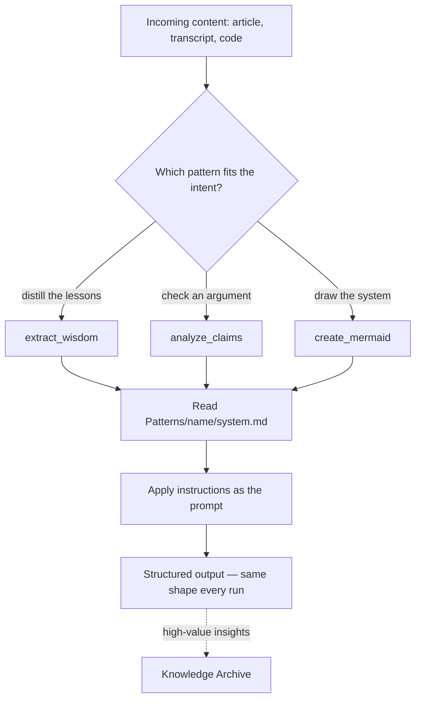

# Fabric Pattern System Reference

> Fabric patterns are reusable moves in the LifeOS hill-climb (`LifeOs/LifeOsThesis.md`) — packaged transformations the DA applies to incoming content.

**Primary Skill:** `~/.claude/skills/Fabric/SKILL.md`

This document provides a quick reference. For full functionality, invoke the Fabric skill.

---

## Quick Reference

**Patterns Location:** `~/.claude/skills/Fabric/Patterns/` (240+ patterns)

### Invoke Fabric Skill

| User Says | Action |
|-----------|--------|
| "use fabric to [X]" | Execute pattern matching intent |
| "run fabric pattern [name]" | Execute specific pattern |
| "update fabric patterns" | Sync patterns from upstream |
| "extract wisdom from [content]" | Run extract_wisdom pattern |
| "summarize with fabric" | Run summarize pattern |

### Native Pattern Execution

LifeOS executes patterns natively (no CLI spawning):
1. Reads `Patterns/{pattern_name}/system.md`
2. Applies pattern instructions directly as prompt
3. Returns structured output
4. Extracted insights may be captured in the Knowledge Archive (`MEMORY/KNOWLEDGE/`) by the Algorithm LEARN phase or KnowledgeHarvester as People, Companies, Ideas, or Research

**Example:**
```
User: "Use fabric to extract wisdom from this article"
-> Fabric skill invoked
-> ExecutePattern workflow selected
-> Reads Patterns/extract_wisdom/system.md
-> Applies pattern to content
-> Returns IDEAS, INSIGHTS, QUOTES, etc.
```

### When to Use Fabric CLI Directly

Only use `fabric` command for:
- **`-y URL`** - YouTube transcript extraction
- **`-U`** - Update patterns (or use skill workflow)

---

## Pattern Categories

| Category | Count | Key Patterns |
|----------|-------|--------------|
| **Extraction** | 30+ | extract_wisdom, extract_insights, extract_main_idea |
| **Summarization** | 20+ | summarize, create_5_sentence_summary |
| **Analysis** | 35+ | analyze_claims, analyze_code, analyze_threat_report |
| **Creation** | 50+ | create_threat_model, create_prd, create_mermaid_visualization |
| **Improvement** | 10+ | improve_writing, improve_prompt, review_code |
| **Security** | 15 | create_stride_threat_model, create_sigma_rules |
| **Rating** | 8 | rate_content, judge_output |

---

## Updating Patterns

**Via Skill (Recommended):**
```
User: "Update fabric patterns"
-> Fabric skill > UpdatePatterns workflow
-> Runs fabric -U
-> Syncs to ~/.claude/skills/Fabric/Patterns/
```

**Manual:**
```bash
fabric -U && rsync -av ~/.config/fabric/patterns/ ~/.claude/skills/Fabric/Patterns/
```

---

## Examples

### One pattern, one transformation

The whole idea at its smallest: **a developer just watched a 90-minute conference talk and has the transcript, but doesn't want to re-read it.** They run one pattern instead of writing a prompt from scratch.

- **Ask:** "use fabric to extract wisdom from this transcript."
- **What happens:** the skill reads `Patterns/extract_wisdom/system.md`, applies those instructions to the transcript, and returns structured output — IDEAS, INSIGHTS, QUOTES, RECOMMENDATIONS.
- **Why it matters:** the transformation is *packaged and repeatable*. The next transcript, and the one after that, run through the identical move and come back in the identical shape. The developer never re-invents "how do I pull lessons out of a talk" — that thinking is captured once, in the pattern.

That is the entire point of a pattern: a reusable move you apply to content, not a prompt you rewrite each time.

### The same input, different patterns

Because a pattern is just a packaged transformation, the same piece of content can go through several:

- Feed a written argument to `analyze_claims` and get each claim rated for evidence.
- Feed a system description to `create_mermaid` and get a diagram back.
- Feed a rough draft to `improve_writing` and get a cleaner version.

Same content, different move, different structured result — and each result comes out the same way every time you run it.

### When a pattern fits (and when it doesn't)

- **Good fit:** a transformation you want to run *the same way, repeatedly*, across different content — distilling talks, checking arguments, drafting threat models. The repetition is what a pattern is for.
- **Not a fit:** a one-off question with no reusable shape ("what's the third heading in this file?"). Wrapping that in a pattern is overhead — just answer it directly.

The test: if you'd want the *next* piece of content handled the same way, it's a pattern. If the move dies with this one input, it isn't.



The diagram shows why patterns compose: the *content* is the variable, the *pattern* is the fixed transformation, and the output shape is a property of the pattern, not the input. Swap the pattern and you get a different move over the same material; keep the pattern and every input comes back in one predictable form — which is what makes the results worth capturing into the Knowledge Archive.

---

## See Also

- **Full Skill:** `~/.claude/skills/Fabric/SKILL.md`
- **Pattern Execution:** `~/.claude/skills/Fabric/Workflows/ExecutePattern.md`
- **Pattern Updates:** `~/.claude/skills/Fabric/Workflows/UpdatePatterns.md`
- **All Patterns:** `~/.claude/skills/Fabric/Patterns/`
- **Architecture:** `~/.claude/LIFEOS/DOCUMENTATION/LifeosSystemArchitecture.md` — Master LifeOS architecture reference
