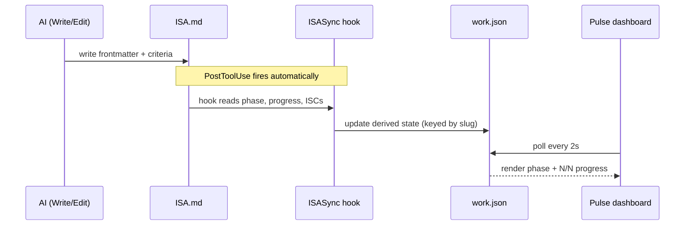

# LifeOS ISA Format Specification v2.18.0 (Algorithm v8.12.0)

> **v2.18.0 — the language section + two close-time conventions.** Body grows to **sixteen** sections: **`## Language`** (position 4, conditional, project ISAs) is the project's ubiquitous language — each term, what it excludes (`Avoid:`), the relationships between terms, and any ambiguity resolved. Glossary only; it never holds implementation detail, claims, or scratch notes. **Entry rule (ours, not the source's): a term enters only after it has actually caused a confusion** — a wrong name shipped, two things called one thing, a term meaning different things to the principal and the model. That makes every entry a verified gotcha rather than a speculative dictionary, and it is what keeps the section bounded; the source builds his proactively during interview, which is the version we did not take. Domain-general by construction (a story bible's canon terms, a brand's naming rules, an album's section names, a project's domain nouns are all the same artifact). Two conventions land with **no new structure**: **pre-build probe run** — before building, run the deterministic probes for claims that could plausibly already hold; a probe that passes before the work exists means either the claim was already true (delete it) or the probe cannot fail (fix it), and both are cheap to learn early. It is scoped to deterministic probe types and is never applied to `manual`/experiential ISCs, where a falsifying observation is ceremony (principal's call, 2026-07-27: falsifiability is already the bar for *being* a claim, so demanding a demonstration of it on every ISC is too strict). **Unclaimed-work check** — at close, the diff is read against the claim set for additions no claim asked for; an ISA can only check the claims it has, so scope creep is structurally invisible to it. Advisory in `ISAGate`, never blocking, because a mandatory anti-claim manufactures its own count. Adapted from Matt Pocock's `domain-modeling`/`CONTEXT.md`, the red-before-green rule in his `tdd`, and the two-axis non-reranking `code-review` (github.com/mattpocock/skills, MIT), generalized past software. The deep-module vocabulary and the wayfinder ticket-type enum from the same suite remain BPE-cut per `MEMORY/WORK/20260716-pocock-suite-reanalysis/` and are not revisited here.

> **v2.17.0 (2026-07-26) — probe severity.** `## Test Strategy` gains an optional seventh column, **`severity`** (`critical` or blank/`normal`), after `anchors_to`. A failing `critical` probe means the app is DOWN in both Bunker planes even when every other probe passes — for claims asserting the app does its JOB, not merely that it answers. Cause: Surface served HTTP 200 for 24h over a dead content pipeline while every probe stayed green. Slot 6 is read as severity only when it is a single bare word, so rows whose unescaped shell pipe shifted `anchors_to` rightward keep parsing, and a single-word value that is not a valid severity is dropped loudly rather than silently downgraded. (Documented retroactively at v2.18.0 — the change shipped into the section table and `Bunker/src/isa.ts` without its own changelog block.)

> **v2.16.0 — feature blocks: features become first-class, each with its own ideal-state.** Still ONE ISA — this is an organizing layer inside it, not a tree of files. When the work has distinct features, `## Features` stops being a pointer table and becomes the home of the claims: each feature is a `### F<n> · <name>` block with a one-line **`Why:`** (its ideal-state purpose — why this feature exists, what done means for it) and its ISCs nested directly underneath. The old `name | satisfies: [ISC-N] | depends_on | parallelizable` **pointer table is deleted** — a feature now *contains* its claims instead of pointing at them. **`F0 · Cross-cutting`** is the reserved block for claims that span features (security, deploy, data-integrity invariants). An ISA uses EITHER a flat `## Claims` section (trivial/small work with no distinct features) OR `## Features` blocks — never both. **ISC IDs stay global and stable** (`ISC-N`), so `## Test Strategy` still keys by ISC and Bunker is unaffected. Three cheap wins fall out of the structure: you can see *why* each feature exists, you can query what features a product has (parse the `### F<n>` headings + `Why:` lines), and doc-generation is feature-organized for free (`ISARender.ts`). **BPE guard:** no new completeness gate, no new tool, no feature-vision-vs-ideal-state taxonomy — one `Why:` line per feature, and it must say what the name and claims don't (a restating why is noise, cut it). The `Why:` earns its place as real, non-derivable intent; the machinery to *enforce* it does not. Parser: `hooks/lib/isa-utils.ts` (`## Features` added to the criteria-heading regex); renderer groups ISCs under feature headings.

> **v2.15.0 (Algorithm v8.7.3) — the retirements land in the file shape.** Three system-level retirements now reflect in the format: (1) **Effort tiers are gone** (retired 2026-07-11) — `effort:` / `effort_source:` are no longer written; the Tier Completeness Gate is replaced by the **substance-scaled Completeness Gate** (trivial work = Goal + Claims minimum; substantial work = the full structural set; project ISAs always full). (2) **The 8-station phase enum is gone** (retired 2026-07-14) — `phase:` is a **minimal lifecycle value**: an active value at run start (`scoping` / `climbing`; `starting` before scaffold settles), `learn` on reopen, `complete` at close, updated in between only when it genuinely changes. Legacy station names (`observe`…`verify`) still parse everywhere. (3) **The mode system is gone** (retired 2026-07-11) — `mode:` and the optimize/ideate frontmatter blocks are legacy, tolerated on old ISAs, never written on new ones. Additionally the **Claims vocabulary** is canonical (Algorithm v8): the criteria section may be headed `## Claims` (current convention) or `## Criteria` / `## ISC Criteria` (legacy, still parsed); claim IDs may be `ISC-N` or short-form (`C1`, `A3`, `EQ-12` — `A`-prefixed short IDs are anti-claims); the separator may be `:` or an em-dash; anti-claims may live inline (`Anti:` prefix) or in a dedicated `## Anti-claims` section; the per-run provenance log may be headed `## Verification` or `## Log`. Frontmatter is **minimal**: `phase` + `progress` are the load-bearing pair; `slug` derives from the directory and `task` from the H1 when omitted. Parser: `hooks/lib/isa-utils.ts` (2026-07-22 claims-vocabulary fix); renderer: `LIFEOS/TOOLS/ISARender.ts`.

> **v2.14.0 (Algorithm v8.5.0) — the fog section + two probe conventions.** The body grows to **fifteen** sections: `## Not yet specified` (after Criteria) is the conditional home for **fog** — in-scope questions too dim to be claims yet. The test (fog vs claim): *can you state the question precisely now — not answer it, state it?* Sharp enough to name its falsifier → an ISC (even if blocked); statable but not yet probe-able → a fog entry; beyond the vision → Out of Scope. Fog **graduates**: when work sharpens an entry, it becomes an ISC (or a Decisions row killing it) and leaves the section. Corollary: **the Coverage Gate is assessed at close, not at scaffold** — genuinely foggy work scaffolds only the claims it can state precisely and holds the rest as fog; forcing speculative ISCs at OBSERVE to satisfy coverage is the failure the section exists to prevent. Domain-general by construction (a research question, an album's unresolved track order, an unpicked venue are all fog). Two probe conventions also land in Test Strategy doctrine: the **seam rule** (probe placement) and **prototype-as-probe** (design questions). Adapted from Matt Pocock's wayfinder fog-of-war doctrine (github.com/mattpocock/skills, MIT), generalized past software; adopted after adversarial verification in `MEMORY/WORK/20260716-pocock-suite-reanalysis/`.

> **v2.13.0 (Algorithm v6.25.0) — ISA scale + a real deletion.** The body grows from twelve sections to **fourteen**: `## Dependencies` (after Constraints) declares cross-ISA needs machine-readably; `## Bridge Criteria` (after Criteria) holds cross-ISA integration ISCs verified at VERIFY across the seam. New optional frontmatter `parent:` / `children:` links ISAs into a tree with **constraint inheritance** (a child cannot violate an ancestor Constraint). **The hard numeric ISC count floors (≥16/≥32/≥128/≥256) are DELETED** and replaced by the **Coverage Gate** — every subsystem named in Vision/Goal has a container ISC decomposed via the Splitting Test to single-probe leaves; coverage is the gate, count never is. Full doctrine in Algorithm v6.25.0 § *ISA Hierarchy & Cross-ISA Integration* and § *ISC Quality System*. The harness executor (`isa run`, reads `## Test Strategy`) is the paired build, tracked separately.

> **LifeOS moves people from current state to ideal state** by writing down what done looks like as testable claims, then refining the writing until every claim survives every test it can be subjected to. The ISA is that written record — the LifeOS loop (`LIFEOS/DOCUMENTATION/LifeOs/LifeOsThesis.md`) at single-artifact scale.

> **The ISA — Ideal State Artifact — is the universal primitive with five identities: ideal state articulation, test harness, build verification, done condition, and system of record. Its ISCs are the testable claims that decompose it. The artifact is universal: same primitive whether the unit is software, science, philosophy, art, life, an application, a CLI tool, a library, infrastructure — anything whose ideal state we're articulating.**

> **See also:** `LIFEOS/DOCUMENTATION/ISA/ISASystem.md` for the system-architecture doc (five identities, three guardrails, six workflows, two homes, subsystem relationships). This file is the file-shape contract; that file is the conceptual frame. They are siblings, not duplicates.

The ISA is the single source of truth for the thing being articulated.
The AI writes all ISA content directly using Write/Edit tools and the ISA skill workflows. Hooks only read ISAs to sync state.

**v2.7 (Algorithm v6.2.0+, still current at v6.3.0):** the body grew from six sections to **twelve in fixed order**: Problem, Vision, Out of Scope, Principles, Constraints, Goal, Criteria, Test Strategy, Features, Decisions, Changelog, Verification. Three-guardrail taxonomy locks the conceptual surface (Principles bind thinking, Constraints bind solution space, Out of Scope binds vision, Anti-criteria bind test surface). Tier Completeness Gate is HARD at every tier (E1 = Goal+Criteria; E5 = all twelve + active Interview). New ID-stability rule prevents ISC renumbering on edit. New `## Changelog` section uses Deutsch conjecture/refutation/learning format. Empty sections never appear. The ISA Skill at `~/.claude/skills/ISA/` owns the canonical template and six workflows; Algorithm at OBSERVE invokes `Skill("ISA", "scaffold from prompt at tier T")` at E2+. Full skeleton, tier gate table, three-guardrail table, and ID-stability rule live in the skill's SKILL.md and `Examples/canonical-isa.md`. The Append workflow gates the Changelog format and refuses partial entries (all four pieces — `conjectured`, `refuted by`, `learned`, `criterion now` — are required).

**v2.6 (Algorithm v6.0.0+):** Two ISA homes are now canonical:
- **Project ISAs** at `<project>/ISA.md` — for any thing with persistent identity (applications, CLI tools, libraries, content pipelines, infrastructure, the Algorithm itself). Lives in the project's repo as system of record. Tasks operating on the project read/modify/extend this single file.
- **Task ISAs** at `MEMORY/WORK/{slug}/ISA.md` — for ad-hoc work that doesn't belong to a persistent thing. One-shot tasks, system-design sessions, ephemeral investigations.

The format is identical for both; the lifecycle differs. Project ISAs grow continuously across many tasks; task ISAs are created at OBSERVE and archived at `phase: complete`. v6.0.x mechanics for `<project>/ISA.md` parser support, OBSERVE/PLAN inheritance resolver, Pulse rendering, and project-ISA seeding migration are forthcoming patches.

## What an ISA Is

**The ISA is one primitive with five identities** (Algorithm v6.0.0+):

1. **Ideal state articulation** — the written hard-to-vary explanation of "done" (Deutsch sense)
2. **Test harness** — ISCs ARE the tests, with named probes; for complex projects the ISCs cover application logic, performance, security, RBAC, build, deploy
3. **Build verification** — passing the ISCs verifies what was built
4. **Done condition** — task complete when all ISCs pass
5. **System of record** — for the thing being articulated (the application, the library, the algorithm itself, etc.)

LifeOS moves people from current state to ideal state by writing down what done looks like as testable claims, then refining the writing until every claim survives every test it can be subjected to. The ISA is that written record. The same primitive applies in any domain — code, science, art, philosophy, life decisions, business strategy, applications, CLI tools, libraries, infrastructure.

**Don't invent parallel artifacts.** No `acceptance.yaml`, no `acceptance.ts`, no separate test specs. The ISA covers this surface. For complex apps with rich application logic, the ISA naturally has many more ISCs because the ideal state of a complex app includes API behavior, performance budgets, security model, RBAC/visibility, auth flow, and data integrity invariants alongside task-specific deliverables. They aren't "in addition to" the ISA — they ARE the ISA.

Each ISC is a testable claim — one part of the explanation that can be tried against reality and either pass or fail. Hard-to-variability and testability are the same property: an ISC is hard-to-vary **if and only if** you can name a test that would falsify it. If you can't say what failure looks like, the ISC isn't hard-to-vary; it can be satisfied with anything. The whole ISA is hard-to-vary when removing or weakening any part changes what "done" actually means.

**The ISA is a living explanation.** It tightens through pursuit. The Goal sharpens, claims split or merge, decompositions clarify — driven by your feedback, by tool outputs, by signal returning from research, by claims failing verification. The ISA at scaffold captures the best initial articulation; by close it has been refined by everything the work surfaced. Hard-to-variability is the **outcome** of the algorithmic process, not its precondition. "Done" includes "the explanation became hard-to-vary enough that we know we hit it" — not just checkbox completion.

**Worked example.** Same goal, two ISC framings:

```
Goal: ship the H3 onboarding email with paid-tier confirmation.

Fluff:        - [ ] ISC-N: Email is delivered to the user.
              (Trivially passable — almost any send path satisfies it. You can't
              name a test that would distinguish "delivered" from "delivered to spam.")

Load-bearing: - [ ] ISC-N: Email arrives in primary inbox (not Promotions/Spam) within 60s.
              (Names a specific test that would fail; removing it lets a "delivered
              to spam" outcome pass; goal mutates from "user sees the confirmation"
              to "Postmark logged a send.")
```

The fluff version can be satisfied with anything because no test would catch its variation. The load-bearing version names a falsifiable claim. That's the operational core of the doctrine — the Hard-to-Vary ISC Quality Gate (Algorithm) and the granularity rule (one binary tool probe per ISC) are the same rule viewed from epistemic and operational angles.

## Filename and Location

**Two canonical homes (v2.6 / Algorithm v6.0.0+):**

- **Project ISAs:** an `ISA.md` at the project root — for things with persistent identity. The project's repo is the system of record. Tasks targeting the project read/modify/extend this single file. Iteration on the project IS iteration on this file. Examples: human3, Surface, and the Algorithm repo each carry a project-root ISA.
- **Task ISAs:** `MEMORY/WORK/{slug}/ISA.md` — for ad-hoc, one-shot work that doesn't belong to a persistent thing. System-design sessions, ephemeral investigations, exploratory tasks.

**v6.0.x mechanics (SHIPPED):** `ISASync.hook.ts`, `CheckpointPerISC.hook.ts`, and `hooks/lib/isa-utils.ts` discover `<project>/ISA.md` alongside `MEMORY/WORK/` paths; Pulse renders both homes; for deployed applications the project ISA is also the Bunker health contract (`bunker test` re-runs its probes).

**Backwards-compat (HISTORICAL — fully removed):** Through Algorithm v4.1.x hooks read `ISA.md` first and fell back to legacy `PRD.md` when present. The `PRD.md` fallback was removed at Algorithm v4.2.0. Algorithm is now at v6.3.0; any remaining `PRD.md` files in `MEMORY/WORK/` are inert legacy artifacts and are not read by any hook or skill.

## Frontmatter (YAML)

**Minimal by design (v2.15.0).** Two load-bearing fields, the rest recommended or conditional:

```yaml
---
phase: climbing                           # REQUIRED — minimal lifecycle value (see Field Rules)
progress: 3/8                             # REQUIRED — closed claims / total claims
task: "8 word task description"           # recommended — falls back to the H1 title when omitted
slug: YYYYMMDD-HHMMSS_kebab-task          # recommended — falls back to the directory name when omitted
started: 2026-07-23T02:00:00Z             # recommended (ISO 8601)
updated: 2026-07-23T02:00:00Z             # recommended (ISO 8601)
---
```

**Retired fields (2026-07-11 tiers/modes retirement — never written on new ISAs, tolerated on legacy ones):** `effort:`, `effort_source:` (effort tiers are gone; spend is discovered from the work, Algorithm §Spend), `mode:` plus the entire optimize/ideate `algorithm_config` block (the mode system is gone; the blocks below are preserved for parsing legacy ISAs only), `response_mode:` / `algorithm_mode:` (retired 2026-07-11 with `TheRouter.hook.ts`).

Optional field (added on rework/continuation):

```yaml
iteration: 2                              # Incremented when revisiting a completed task
resumed_at: 2026-07-23T02:00:00Z          # hook-written on reopen
resumed_from_phase: complete              # hook-written on reopen
frozen: true                              # opt-out: body edits do NOT rewind a completed ISA
```

Optional fields (NEW v2.13.0 / Algorithm v6.25.0 — ISA hierarchy):

```yaml
parent: 20260706-tolkien-world            # slug of the parent ISA (omit for a root/standalone ISA)
children:                                 # slugs of child ISAs this one rolls up (omit for a leaf)
  - 20260706-combat-system
  - 20260706-magic-system
```

**Semantics:** `parent`/`children` link ISAs into a tree. A child **inherits every ancestor `## Constraints`** — an inherited Constraint cannot be violated by a child ISC; overriding one is a parent-level renegotiation logged in the parent's `## Decisions`, never a silent child override. A parent's `progress:` may roll up its children (`3/5 children closed`). Both fields are omitted for a standalone single-ISA task (the common case). A change to any linked ISA triggers the Algorithm's blast-radius pass (v6.25.0) which lists downstream ISCs to re-verify; **conflict detection is automated, resolution stays human.**

Optional fields (NEW v2.8 / Algorithm v6.4.0+ — Principal-Stated Goal):

```yaml
principal_stated_goal: "verbatim user quote, byte-for-byte"   # NEVER paraphrased
principal_stated_goal_source: prompt                          # prompt | conversation | explicit-revision
principal_stated_goal_signal: 2                               # 1-4 — which detection signal fired
principal_stated_goal_locked: 2026-05-12T17:23:56Z            # ISO-8601 timestamp of capture
```

**Required-when:** OBSERVE goal-detection fired AND minimum-content rule passed (≥ 6 tokens AND propositional content present). Otherwise omitted entirely.

**Lifecycle:** the four fields are immutable across phases unless the user explicitly revises the literal. Revision is recorded as a `## Decisions` row with `refined: principal_stated_goal: was "<old>" now "<new>"`; frontmatter updates only on that explicit revision, and `principal_stated_goal_source` flips to `explicit-revision`.

**Detection signals (the four in v6.4.0):**

| # | Signal | Pattern |
|---|--------|---------|
| 1 | Named metric + threshold | quantitative target ("p95 < 200ms", "70k subscribers") |
| 2 | Explicit outcome assertion | "I want X" / "achieve X" / "do this" |
| 3 | Completion condition | "until X" / "such that X" |
| 4 | Structural/design directive | explicit verb-object on the system ("absorb", "replace", "unify") |

**Fail-closed:** if the candidate literal is < 6 tokens OR contains no propositional content ("make it good"), `principal_stated_goal: null` and the candidate is logged to Decisions.

**Multi-literal:** if a prompt contains multiple candidate literals, the first detected wins as `principal_stated_goal:`; the others demote to derived Constraints.

Optional fields (NEW v2.9 / Algorithm v6.5.0+ — Density × Tier Gate at OBSERVE):

```yaml
density_score: 0.42                    # 0..1 — Stage-2 density computed at Scaffold preflight
interview_invoked: true                # whether Stage-2 fired the interview
divergence_risk: medium                # low | medium | high — how much speculation made it into the ISA
density_gate_acknowledged: true        # always true on E3+ ISAs after Stage 2 runs (audit trail marker)
context_checks_fired: [observe-density, observe-sufficiency, plan-refresh]   # NEW v2.10 / Algorithm v6.7.0+ — list of Context Sufficiency checks that ran
context_sufficient: true               # NEW v2.10 / Algorithm v6.7.0+ — final boolean after all OBSERVE-phase checks; null if no check ran
frame_drift: none                      # NEW v2.11 / Algorithm v6.8.0+ — none | detected | skipped_no_goal_literal | null — VERIFY-entry three-boolean test result
frame_drift_summary: ""                # NEW v2.11 / Algorithm v6.8.0+ — ≤140 chars; set only when frame_drift: detected
```

**Required-when:** the four v6.5.0 fields populate together when `INTERVIEW_ELIGIBLE: true` (v6.7.0 extends eligibility to all ALGORITHM tiers). The two v6.7.0 fields populate when ANY Context Sufficiency check ran (Density Gate at any tier, Sufficiency Check at OBSERVE, or PLAN-entry Refresh). The two v6.8.0 fields populate when Frame-Drift Check ran at VERIFY — i.e., when ISA has non-null `principal_stated_goal`. If `principal_stated_goal: null` (or absent), `frame_drift: skipped_no_goal_literal`. Otherwise all six are omitted entirely (Bitter Pill discipline).

**Lifecycle:**
- `density_score`: immutable once set at OBSERVE — represents the prompt-state at scaffold time.
- `interview_invoked`: immutable.
- `divergence_risk`: may be updated mid-task (e.g., VERIFY surfaces additional drift); track changes in `## Decisions`.
- `density_gate_acknowledged`: presence-of-key IS the v6.5.0+ version marker; the value is always `true` once set.
- `frame_drift`: written at VERIFY entry; immutable thereafter. Revision requires explicit Decisions row.
- `frame_drift_summary`: immutable once set (only when `frame_drift: detected`).

**Semantics of `divergence_risk`:**

| Value | Meaning |
|-------|---------|
| `low` | gate didn't fire (score ≥ 0.5) OR all 3 questions answered |
| `medium` | gate fired, some questions answered then `proceed` |
| `high` | gate fired, immediate `proceed` override OR interview aborted mid-stream |

**Backwards-compat guard:** v6.4.0 and earlier ISAs lack these keys entirely. `CheckCompleteness` fires the v6.5.0 checks only when `density_score` key is explicitly present in frontmatter — mirroring the v6.4.0 `principal_stated_goal` guard pattern. `CheckCompleteness` fires the v6.7.0 checks only when `context_sufficient` key is present. `CheckCompleteness` fires the v6.8.0 Frame-Drift checks only when `frame_drift` key is present. Pulse `parseFrontmatter` (in `LIFEOS/PULSE/modules/wiki.ts` and `user-index.ts`) is tolerant of unknown keys, so older ISAs continue rendering unchanged across all version boundaries.

Optional fields (NEW v2.10 / 2026-05-13 — Response Mode + Journey Surface):

> **`response_mode` / `algorithm_mode` RETIRED 2026-07-11.** Mode classification (minimal/native/algorithm) was abolished system-wide and `TheRouter.hook.ts` — its setter — was deleted; nothing writes these keys on new sessions. Existing ISAs keep them (tolerant parsing). The Journey Surface fields (`current_state`/`ideal_state`/`capabilities_invoked`) are unaffected.

```yaml
response_mode: algorithm        # minimal | native | algorithm — Layer 1, formerly set by TheRouter.hook.ts (retired 2026-07-11)
algorithm_mode: iterate         # iterate | optimize | ideate | loop — Layer 2, retired 2026-07-11 with the mode system

current_state: "Code has 47 type errors blocking deploy"   # The "before" — one-line summary of reality now
ideal_state: "Zero type errors, deploy passes CI"          # The "after" — one-line summary of done; aligned with Goal

capabilities_invoked:           # Array of capabilities actually invoked via tool call
  - ISA                         # (closed enumeration, see LIFEOS/ALGORITHM/capabilities.md)
  - SystemsThinking
  - FirstPrinciples
  - Forge                       # delegate agents also recorded here (build or audit mode)
```

**Required-when:**
- `response_mode`, `algorithm_mode`: **never written.** Both retired 2026-07-11 with the mode system (see the notice above). Legacy ISAs carry them and parse fine; nothing populates them on a new one. The historical rule was "`response_mode` on every captured session, `algorithm_mode` when it read `algorithm`" — recorded here so old rows stay readable, not as a requirement.
- `current_state` / `ideal_state`: optional one-line summaries for the Pulse Journey Strip. Populated when the Algorithm can produce a clean one-liner during OBSERVE (most multi-file work qualifies). If both are absent, the Journey Strip falls back to ISC progress count.
- `capabilities_invoked`: populated incrementally as the Algorithm fires each capability via tool call. Appended-only — no removal on revert. Mirrors the `🏹 CAPABILITIES SELECTED` block in Algorithm phase output, but records actual invocations not intended ones.

**Lifecycle:**
- `response_mode`: immutable once set at session start. Formerly set by `TheRouter.hook.ts` via additionalContext propagation (retired 2026-07-11 — no longer written on new sessions).
- `algorithm_mode` (retired 2026-07-11): changed only when the Algorithm explicitly switched mode (rare; e.g., user mid-task says "actually let's ideate this").
- `current_state`: immutable once written. The "before" snapshot doesn't change as work progresses.
- `ideal_state`: should align with `principal_stated_goal:` when set; can be refined as the ISA tightens (matches the "living explanation" pattern).
- `capabilities_invoked`: append-only. Ordered by first-invocation timestamp implicit in the array.

**Pulse surfacing** (updated 2026-07-14 — see `LIFEOS/DOCUMENTATION/Pulse/PulseMetadata.md`):
- The planned `ResponseModeBadge`/`AlgorithmModeBadge` were CANCELLED — the mode system retired 2026-07-11 before they were built.
- What ships today: the Agents → Work board renders each tracked ISA as a Climb (claims closed over time), a derived lifecycle pill, and a rework ×N badge from `iteration:`.
- `current_state` / `ideal_state` → `JourneyStrip` and `capabilities_invoked` → `CapabilitiesStrip` remain backlog ideas, unbuilt.

**Backwards-compat guard:** ISAs created before 2026-05-13 lack these keys entirely, and `response_mode`/`algorithm_mode` were themselves retired 2026-07-11. Pulse `parseFrontmatter` is tolerant of unknown/missing keys — older ISAs render unchanged, the new badges/strips simply don't appear for them. The presence of `response_mode` is the v2.10+ version marker.

**LEGACY — optimize/ideate mode blocks (mode system retired 2026-07-11).** The three blocks below are never written on new ISAs; they are preserved so legacy ISAs parse. Historical doctrine: `LIFEOS/ALGORITHM/archive/modes/README.md`.

Optional fields (optimize mode — shared):

```yaml
eval_mode: metric                          # metric|eval — which evaluation strategy
target_type: code                          # skill|prompt|agent|code|function — auto-detected
target_path: "train.py"                    # What we're optimizing (file or directory)
baseline: 0.9979                          # Current best score (updated on improvement)
experiment_count: 0                       # Total experiments run
max_experiments: null                     # Optional: stop after N experiments
time_budget: 300                          # Seconds per experiment (0 = unlimited)
sandbox_path: ""                          # Auto-populated: where sandbox copy lives
```

Optional fields (optimize mode — metric mode):

```yaml
metric_name: "val_bpb"                    # Human-readable metric name
metric_command: "uv run train.py"         # Shell command that produces the metric
metric_direction: lower                   # lower|higher — which direction is "better"
metric_extract: "grep '^val_bpb:' run.log | cut -d' ' -f2"  # Extract metric from output
mutable_files: ["train.py"]              # Files the agent may modify
metric_target: null                       # Optional: stop when metric reaches this value
```

Optional fields (optimize mode — eval mode):

```yaml
eval_criteria:                             # Binary yes/no eval questions (3-6)
  - "Does the output contain specific facts with sources?"
  - "Is the output structured with clear sections?"
  - "Does the output avoid generic filler content?"
test_inputs:                               # Representative inputs to test against (3-5)
  - "research AI trends"
  - "quick research on quantum computing"
  - "deep investigation of supply chain attacks"
runs_per_experiment: 3                    # How many times to run per experiment
```

Optional fields (tunable parameters — ideate, optimize, loop modes):

```yaml
algorithm_config:
  preset: explore                          # Named preset (optional)
  focus: 0.25                              # Composite focus 0.0-1.0 (optional, ideate only)
  params:                                  # Resolved individual parameter values
    problemConnection: 0.28                # Ideation: problem connection strictness
    selectionPressure: 0.30                # Ideation: cull aggressiveness
    domainDiversity: 0.74                  # Ideation: source domain diversity
    phaseBalance: 0.33                     # Ideation: generative vs analytical phase balance
    ideaVolume: 31                         # Ideation: ideas per cycle
    mutationRate: 0.63                     # Ideation: evolution mutation intensity
    generativeTemperature: 0.74            # Ideation: DREAM/DAYDREAM wildness
    maxCycles: 4                           # Ideation: evolutionary cycles
    stepSize: 0.3                          # Optimize: mutation boldness
    regressionTolerance: 0.1               # Optimize: accept temporary regression
    earlyStopPatience: 3                   # Optimize: no-improvement patience
    maxIterations: 10                      # Optimize/Loop: hard iteration cap
    contextCarryover: 0.43                 # Cross-mode: history carried between cycles
    parallelAgents: 1                      # Cross-mode: agents per workstream
  locked_params: [parallelAgents]          # Params meta-learner cannot adjust
  user_overrides: []                       # Params user explicitly set (auto-locked)
  meta_learner_adjustments:                # History of meta-learner changes (ideate)
    - cycle: 2
      parameter: selectionPressure
      from: 0.30
      to: 0.45
      rationale: "Ideas converging too slowly"
```

### Field Rules

- `phase`: **A minimal lifecycle bracket, not a station walk** (8-station enum retired 2026-07-14). Write an active value at run start — `marking` while articulation is underway (`scoping` is an accepted synonym; `starting` may appear before scaffold settles), `climbing` during the build — `learn` on reopen (hook-written), `complete` at close. Update it in between only when it genuinely changes. Legacy station names (`observe`/`think`/`plan`/`build`/`execute`/`verify`) parse everywhere but are never written on new ISAs. **Nothing switches on this literal.** It resolves through `PHASE_TO_ASCENT` in `LIFEOS/TOOLS/ascent.ts`, the one table that names and colours every run state across the Kitty tab, the status line, the Pulse board and the HTML mirror; the in-flight detail (Anchoring) is derived from the live tool stream, never declared. Model: `LIFEOS/DOCUMENTATION/Algorithm/AscentStates.md`.
- `progress`: Format `M/N` where M = closed claims, N = total claims. Updated immediately when a claim closes (don't batch at the end).
- `task`: Imperative mood, max 60 chars. Describes the deliverable, not the process. When omitted, consumers fall back to the H1 title.
- `slug`: Format `YYYYMMDD-HHMMSS_kebab-description` (or `YYYYMMDD-kebab`). When omitted, derived from the directory name (2026-07-22 ISASync fix).
- `started`: Set once at creation. Never modified.
- `updated`: Set on every Edit/Write. Use current ISO 8601 timestamp.
- `iteration`: Omitted on first run. Set to `2` on first continuation, incremented thereafter (hook-owned on reopen).
- ~~`effort` / `effort_source` / `mode` / `algorithm_config`~~: **retired** — see the Retired-fields note above.

## Body Sections

**Sixteen sections in fixed order** (grown from twelve at v2.7 → fourteen at v2.13 → fifteen at v2.14 → sixteen at v2.18). Each appears only when populated — never create empty placeholder sections (Bitter Pill discipline preserved). The substance-scaled Completeness Gate (below) determines which sections are required for a given piece of work. **Section-name note (v2.15.0 / Algorithm v8):** the criteria section may be headed `## Claims` (current convention) or `## Criteria` / `## ISC Criteria` (legacy — both parse); anti-claims may live inline via the `Anti:` prefix or in a dedicated `## Anti-claims` section; the provenance section may be headed `## Verification` or `## Log`. "Written At" uses lifecycle vocabulary — scoping (articulation), climbing (build + verification), learning (close).

| # | Section | Purpose | Written At |
|---|---------|---------|------------|
| 1 | `## Problem` | What is broken or missing right now | scoping |
| 2 | `## Vision` | Experiential intent — what euphoric surprise looks like | scoping |
| 3 | `## Out of Scope` | Anti-vision — what is *not* included, declared in prose | scoping |
| 4 | `## Language` | **NEW v2.18.0** — the project's ubiquitous language. One block per term: what it means, `Avoid:` the names it displaces, and any relationship to other terms. Glossary only — never implementation detail, claims, or scratch. **A term enters only after it has actually caused a confusion**, so the section is a record of resolved collisions rather than a speculative dictionary. Project ISAs; omit on task ISAs and on any project whose vocabulary has never bitten. | scoping → any point |
| 5 | `## Principles` | Substrate-independent truths the work must respect | scoping |
| 6 | `## Constraints` | Immovable architectural mandates (plus every Constraint inherited from `parent:`) | scoping |
| 7 | `## Dependencies` | **NEW v2.13.0 (v6.25.0)** — cross-ISA needs, one machine-readable line each: `requires: <slug> — <what/contract>`. Scoping loads these ISAs into context before scaffolding claims. Omit when the ISA has no cross-ISA needs. | scoping |
| 8 | `## Goal` | Hard-to-vary spine — 1–3 sentences naming verifiable done | scoping |
| 9 | `## Claims` | **Feature-less mode** — the flat home for atomic claims/ISCs (one binary tool probe each) when the work has no distinct features (trivial/small ISAs, most task ISAs). Includes derived `Anti:` / `Antecedent:`. Heading `## Claims` is current (v8); `## Criteria` / `## ISC Criteria` legacy, still parse. When the work HAS distinct features, omit this section and put the claims in `## Features` blocks instead (§13) | scoping → climbing |
| 10 | `## Not yet specified` | **NEW v2.14.0 (v8.5.0)** — fog: in-scope questions too dim to be claims. One line each: `- fog: <the question as precisely as it can currently be stated> — <what must resolve before it sharpens>`. Graduates to an ISC (or dies via Decisions) as work sharpens it; never checked, never counted by coverage. Omit when the work has no fog (most tasks). | scoping → any point |
| 11 | `## Bridge Criteria` | **NEW v2.13.0 (v6.25.0)** — cross-ISA integration ISCs: `- [ ] ISC-N: Bridge: <what must hold across the seam>`, with `anchors_to: cross: <slug>` in Test Strategy. Verified as a distinct pass after leaf claims. Omit when the ISA integrates with no siblings. | scoping → climbing |
| 12 | `## Test Strategy` | Per-ISC verification — the harness contract Bunker's parser reads. **Column order (parser truth, `Bunker/src/isa.ts`): `isc \| type \| check \| threshold \| tool \| anchors_to \| severity`** (`anchors_to` and `severity` both optional, in that order). `anchors_to` traces to `literal`, `derived: <sub-claim>`, or **`cross: <slug>`** (v2.13.0, bridge ISCs). ⚠️ This order is the contract — the parser reads `cells[1]=type … cells[5]=anchors_to`, `cells[6]=severity`; a table in any other order mis-probes or drops. **`severity`** (v2.17.0, 2026-07-26) is `critical` or blank/`normal`: a failing `critical` probe means the app is DOWN in both Bunker planes even when everything else passes — for probes asserting the app does its JOB, not just that it answers (Surface served 200 for 24h over a dead content pipeline while every probe stayed green). Slot 6 is read as severity only when it is a single bare word, so rows whose unescaped shell pipe shifted `anchors_to` rightward keep parsing; a single-word value that is not a valid severity is dropped loudly rather than silently downgraded. **Backticks around a `tool` command are stripped as markdown formatting** — before that, a backticked command silently failed to compile into a cloud check and fell back to local-only. Keep this line byte-synced to `isa.ts`. | scoping |
| 13 | `## Features` | **Feature mode (v2.16.0)** — when the work has distinct features, this section holds the claims. Each feature is a `### F<n> · <name>` block: a one-line **`Why:`** (its ideal-state purpose) then its ISCs nested underneath. `F0 · Cross-cutting` holds spanning claims (security, deploy, data-integrity). The old `name \| satisfies` **pointer table is deleted** — a feature contains its claims. ISC IDs stay global + stable so `## Test Strategy` resolves. Use this OR flat `## Claims` (§9), never both. A feature may still deliver a **decision** rather than a build increment | scoping → climbing |
| 14 | `## Decisions` | Timestamped log including dead ends; `refined:` prefix | any phase |
| 15 | `## Learning` | Conjecture / refuted-by / learned / criterion-now entries — the Deutsch error-correction trail, written only when understanding changed. **Not a changelog** (see convention below) | learning |
| 16 | `## Verification` | One-line provenance stub per claim (leaf + bridge) — collapsed on close, never a retained evidence paragraph. May be headed `## Log` (v8 practice — same content contract) | climbing → close |

(`## Dependencies` and `## Bridge Criteria` appear only when the ISA participates in a hierarchy — a single-ISA task omits both, exactly like any other empty section. Legacy optimize-mode ISAs may carry an `## Experiments` section between Test Strategy and Features; it is never written on new ISAs.)

### Feature blocks (v2.16.0) — the exact shape

When the work has distinct features, `## Features` holds the claims as blocks. Each block is a `### F<n> · <name>` heading, a one-line `Why:`, then the ISCs:

```markdown
## Features

### F0 · Cross-cutting
Why: invariants that hold across every feature — security, deploy, data integrity.

- [x] ISC-1: Every response carries HSTS + X-Content-Type-Options.
- [x] ISC-2: All D1 access is parameterized — no SQL string interpolation of values.

### F1 · Billing
Why: a visitor becomes a paying subscriber and can self-serve cancel, without support.

- [x] ISC-3: Checkout creates a Stripe session with server-side pricing.
- [x] ISC-4: 16-day trial charges exactly once on day 16.
- [ ] ISC-5: Anti: the webhook is idempotent on event.id.
```

Rules (all four are structure, none is a new gate):

- **`F0` is reserved** for cross-cutting claims; feature blocks are `F1`, `F2`, … in build/read order. Feature numbers are display order, not identity — reordering blocks is free.
- **ISC IDs stay global and stable across the whole ISA** (`ISC-N`), never per-feature. This is what keeps `## Test Strategy` (ISC-keyed) and Bunker working, and preserves ID-stability for Reconcile. Moving an ISC between features never renumbers it.
- **The `Why:` line is the feature's ideal-state in one sentence** — why it exists / what done means for it. It must state what the name and the claims don't; a `Why:` that restates the name is noise (cut it). This is the whole informational payload of the layer.
- **Either flat `## Claims` or `## Features` blocks, never both.** Trivial/small work stays flat; work with distinct features uses blocks. `## Anti-claims`, `## Bridge Criteria`, `## Not yet specified` remain their own H2 sections in both modes.

The three affordances this unlocks are free consequences of the shape, requiring no new tooling: **query** (`rg '^### F' <isa>` lists every feature + its Why), **doc-gen** (`ISARender.ts` renders the blocks feature-organized), and **intent** (each feature carries why it was added).

### The changelog is git; evidence collapses on close (convention, Algorithm v8.7.1 claim 12)

**The ISA carries NO in-document changelog section.** `git log -- <isa-path>` is the authoritative change record and commit messages are its entries, so the design doc never rots into a growing log. What the ISA keeps is the **living surface**: `## Decisions` (including dead ends) and the conjecture/refuted-by/learned/criterion-now learning trail (`## Learning` — the section formerly mislabeled `## Changelog`; renamed here to remove the changelog identity, position and four-piece C/R/L format unchanged). The learning trail is written only when understanding actually changed — it is durable understanding, not a per-change record.

**Evidence collapses on close.** The moment a claim goes `[x]`, its `## Verification` entry is reduced to a **one-line provenance stub** — a commit hash, test name, or probe ref — never a retained paragraph. The proof lives in git and CI; the ISA points at it. A `## Verification` section that accumulates evidence paragraphs is the failure this convention prevents.

### Completeness Gate (substance-scaled — replaces the Tier Completeness Gate, v2.15.0)

Effort tiers were retired 2026-07-11; the gate now scales with the **substance of the work**, discovered from the work itself (Algorithm §Spend), not predicted from a label:

| Substance | Required Sections |
|-----------|-------------------|
| **Trivial** (mechanical, single-probe, minutes) | Goal, Claims — a minimal direct-written ISA; shape check logged inline |
| **Substantial** (multi-claim build, real blast radius) | Problem, Vision, Out of Scope, Constraints, Goal, Claims, Test Strategy, Features* |
| **Deepest** (frontier multi-component work) | All sixteen* + Interview workflow run before building |

\* `## Dependencies` and `## Bridge Criteria` are **conditional-required**: mandatory when the ISA has any `parent:`/`children:`/cross-ISA relationship, omitted (like any empty section) for a standalone single-ISA task. `## Not yet specified` appears only when the work genuinely has fog. `## Language` appears only when a term has actually been confused — it is never required by substance, and an empty or speculative glossary is worse than none. A hierarchical ISA that omits Dependencies/Bridge fails the gate; a standalone one that omits them passes.

Project ISA override: any `<project>/ISA.md` requires full substantial-grade structure regardless of how small the current task is. (Historical: the E1–E5 tier table this replaces lives in git history and pre-v2.15 ISAs.)

**Mechanical structural gate (v2.16.0+, 2026-07-24).** The un-gameable structural subset is enforced deterministically at the close transition by `LIFEOS/TOOLS/ISAGate.ts` (wired via `hooks/ISAGate.hook.ts` in StopGates): writing `phase: complete` **hard-blocks** on (1) `progress:` that is not a mechanical `M/N` count, (2) unresolved lines in `## Not yet specified` (fog must be empty at close), and (3) a `## Test Strategy` row missing `anchors_to` when `principal_stated_goal` is set. Count-gameable checks (≥1 anti-claim, per-claim probe coverage, bundled-claim and event-claim heuristics) are **advisory only** — `ISAGate` surfaces them but never blocks, because a count-block manufactures the count (the Goodhart line the 2026-07-24 Forge audit drew). The gate is scoped to ISAs edited in the current turn, so legacy closed ISAs are never retroactively gated. The richer semantic set stays the model-run `Skill("ISA", "check completeness")` workflow. Run `bun LIFEOS/TOOLS/ISAGate.ts <isa>` to see hard + advisory findings for any ISA.

### Three-Guardrail Taxonomy (NEW v2.7)

Distinguished by *who they bind*: Principles bind the **thinking** (substrate-independent); Constraints bind the **solution space** (immovable); Out of Scope binds the **vision** (declarative anti-vision); Anti-criteria bind the **test surface** (granular `Anti:` ISCs derived from the first three).

### ID-Stability Rule (NEW v2.7)

ISC IDs never re-number on edit. Splits become `ISC-N.M` (parent preserved); drops become tombstones (`- [ ] ISC-N: [DROPPED — see Decisions]`). Reconcile depends on this; renumbering breaks ephemeral feature reconciliation silently.

### ISC Type Vocabulary (v2.12 / Algorithm v6.10.0 candidate)

The `type` column of `## Test Strategy` accepts a closed vocabulary of probe types. Each type names a specific verification mechanism with known schema and tool form.

| Type | Schema columns | Probe form | When to use |
|------|---------------|------------|-------------|
| `bun-test` | `check \| threshold \| tool` | `bun test <file>:<-t pattern>` exits 0 | Example-based correctness — fixed-input deterministic code |
| `bun-property` | `property \| generator \| runs \| tool` | `fc.assert(fc.property(gen, pred), { numRuns })` | Universal-quantified correctness — pure functions, parsers, serializers, math, data transforms |
| `bash` | `check \| threshold \| tool` | shell command exits 0 / output matches | grep, diff, jq probes |
| `curl` | `check \| threshold \| tool` | HTTP probe: `curl -i` status/headers/body match | Reachability + contract probes. A bash-family probe kept DISTINCT from `bash` because the Bunker runner classifies cloud-portability by it (`src/synccloud.ts` local-vs-cloud jurisdiction split) — a curl probe can run from the cloud monitor, a general bash probe cannot. Reconciled with Bunker 2026-07-22 (`bunker/src/isa.ts` PROBE_TYPES). |
| `manual` | `check \| tool` | principal-recognizes-on-encounter | Experiential ISCs — design, voice, "feels right" |
| `screenshot` | `check \| tool` | Interceptor-captured image | UI rendering verification |
| `eval` | `check \| threshold \| tool` | `EvalRunner` suite pass^k ≥ threshold | Behavioral/quality/regression properties one direct probe can't close — voice/disposition survival, skill routing, no-fabrication. The multi-sample class only; elected by judgment like any menu capability, never the default (default = a direct probe). Tool: `bun skills/Evals/Tools/EvalRunner.ts -s <suite>` |

**`bun-property` row shape:**

```
| isc      | anchors_to | type          | property                                | generator                              | runs | tool |
| ISC-N    | literal    | bun-property  | round-trip: parse(serialize(x)) ≡ x     | fc.record({...isa frontmatter schema}) | 1000 | bun test test/hooks/lib/isa-utils.property.test.ts -t "round-trips" |
```

- `property` — prose statement of the universal claim.
- `generator` — fast-check generator with constraints (`fc.integer({min, max})`, `fc.record({...})`, etc.) bounded to the function's actual input domain.
- `runs` — `numRuns` budget. Default 1000. 10000 for invariant-critical ISCs. 100 for slow generators.
- `tool` — `bun test <file>:<-t pattern>` form, as with `bun-test`.

**On substantial work**, every pure-function ISC SHOULD have at least one `bun-property` row in `## Test Strategy`. **On core-surface or security surface** (hooks, the ISA/Bunker probe primitive, auth/secret/identity code, release gates), a pure-function ISC MUST name a probe stronger than a single example test — a `bun-property` row or a mutation check — because an example test on a security boundary proves one input, not the class (fast-check is installed and sanctioned; TestingDoctrine rule #11). When property form doesn't apply (impure function, infinite-state machine, externally-driven dependency), record the reason in `## Decisions`. See `skills/Hardening/Workflows/PropertyTest.md` for candidate detection logic and the ten property categories.

**Anti-claims default to universal form on substantial work.** An Anti-ISC that says "API_KEY isn't in env" should be re-expressed as `∀ env-var-name. env-var-name !~ /API_KEY|AUTH_TOKEN/i in spawned env` — a property covering the failure-mode pattern, not the single instance. Example-shaped Anti-ISCs remain acceptable when the input domain is finite and small (named enums, fixed input sets), or when a `## Decisions` row records why universal form doesn't apply.

### Blast-radius probe strictness (convention, not new structure)

Match probe strictness to what the ISC touches, not to a uniform default. When an ISC touches **high-blast** surface — `.env`/secrets, auth, principal data, money movement, a push to a *public* remote, or a prod deploy — its `## Test Strategy` row must name a deterministic probe (`bash`/`bun-test`/`screenshot`, never `manual`) and the change satisfying it should land in a small, line-readable diff. **Low-blast** ISCs — static content, internal plumbing, anything reaching no network, DB, or principal data — can be verified empirically (test, output match, screenshot) without a line-by-line read, and tolerate large diffs.

This adds no field and no section. It's a probe-selection convention layered on the granularity rule and Test Strategy: high-blast surface is the same surface the release containment gates, `SystemFileGuard`, and `settings.json` `permissions.deny` already protect — the convention just makes ISCs over that surface name their stricter probe explicitly, and frees trivial changes from ceremony they don't need.

### Probe placement — the seam rule (convention, v2.14.0)

Probes attach at the boundary where the thing meets its consumer, at the **highest boundary that exercises the claim** — and that boundary is agreed (written into Test Strategy) before building, never chosen after the fact to fit what got built. Verify behavior through the boundary, never internals: an essay is probed by what a reader encounters, a service by its public interface, a deploy by the live URL, an album by the listening experience, a CLI by its invocation. Prefer existing boundaries over inventing new ones — the fewer distinct probe boundaries an ISA carries, the more each one proves. This is the placement half of the modality-fidelity rule (the probe exercises the same path the consumer does); a probe that reaches past the consumer boundary into internals verifies structure, not the claim. *(General form of the pre-agreed-seams discipline in Pocock's tdd skill, MIT; adopted 2026-07-16.)*

### Prototype-as-probe (convention, v2.14.0)

When an ISC hinges on an unresolved **design question** — how should this behave, what should this look like, does this model of the problem hold — the cheapest honest probe is a **throwaway concrete artifact to react to**: a sketch, an outline, a rough take, a stub, runnable code. Rules: the artifact is marked disposable and kept out of the main line (a scratch dir, a throwaway branch); only the *decision* it settles folds back — into the ISC it sharpens, a Decisions row, and (when a fragment encodes the decision more precisely than prose) that fragment inlined and attributed. The prototype answers the question and dies; the decision persists. *(Generalized from Pocock's prototype skill, MIT; adopted 2026-07-16.)*

### Render-states enumeration for async UI (convention, not new structure)

When an ISC covers a surface that fills asynchronously — a panel, list, or view fed by a fetch, query, or job — "renders correctly" is not one state but four: **loading, error, empty, populated**. The ISC enumerates them (or splits to one leaf per state), and the probe names which state it captured. A check that only exercises the populated, fresh-load state leaves the other three unverified — which is how a broken loading skeleton, an unhandled fetch error, or a fixture rendering in place of a real empty set ships as "done."

This adds no field and no section — it is the Splitting Test's "enumerate what 'all' means" applied to the one enumeration models skip by default. It fires only for async UI surfaces; a static ISC stays one probe. *(Dated pattern: happy-path-only VERIFY was the most recurrent low-sentiment reflection through mid-2026; the earlier "'should work' is banned" lexical rule did not close it, so the fix is structural — the ISC schema names the states.)*

### `## Language` — the shape (v2.18.0)

One block per term. The `Avoid:` line is load-bearing: it names what the term *displaces*, which is what actually stops drift.

```markdown
## Language

**Cut**: staging a release candidate locally. Produces an RC; publishes nothing.
_Avoid_: ship, release, publish — all three imply the public repo, which only `CreateRelease` touches.

**Skill**: a packaged capability with a SKILL.md the model invokes.
_Avoid_: agent (an agent is a spawned executor), command (a command is a thin invoker over a skill).
```

Three rules keep it from rotting into a second spec:

- **Entry on confusion, never on speculation.** A term earns a block after a real collision — a wrong name shipped, one word covering two things, the principal and the model meaning different things by it. A glossary written proactively is a maintenance surface that predicts which words will bite, and it predicts badly.
- **Glossary only.** No implementation detail, no claims, no scratch. The moment a block explains *how* something works it has become a duplicate of `## Goal` or `## Claims` and must be cut back to naming.
- **Project ISAs.** A task ISA inherits its project's language by reference; it never restates it. Standalone task ISAs almost never need the section.

Domain-general by construction: a story bible's canon terms, a brand's naming rules, an album's section names, and a codebase's domain nouns are the same artifact under different subject matter. *(Adapted from Matt Pocock's `domain-modeling` / `CONTEXT.md`, MIT; the entry-on-confusion rule is ours — his is built proactively during interview.)*

### Pre-build probe run (convention, v2.18.0)

**Before building, run the deterministic probes for any claim that could plausibly already hold.** A probe that passes before the work exists means one of two things, and both are worth learning in five seconds rather than at close:

- The claim was **already true** — delete it, or sharpen it until it isn't.
- The probe **cannot fail** — it is tautological, asserts something structural rather than the claim, or reaches past the seam. Fix the probe before it certifies anything.

This is the operational form of the doctrine the format already states: an ISC is hard-to-vary if and only if you can name a test that would falsify it. Naming the falsifier is cheap; the pre-build run is the cheapest way to find out the falsifier was never real.

**Scope — deterministic probe types only** (`bash`, `curl`, `bun-test`, `bun-property`, `screenshot`). It is **never** applied to `manual`/experiential ISCs. Demanding a falsifying observation of an ISC about how something feels is ceremony, and plenty of valuable claims are not falsifiable in that sense at all — those belong in `## Vision`, `## Principles`, or `## Not yet specified`, none of which are claims and none of which this convention touches (principal's call, 2026-07-27). It is a habit, not a gate: no field, no column, no block on close. *(Generalized from the red-before-green rule in Pocock's `tdd` and the Phase-1 gate in his `diagnosing-bugs`, MIT.)*

### Unclaimed-work check (convention, v2.18.0)

**At close, read the diff against the claim set and name anything that shipped which no claim asked for.** An ISA verifies the claims it holds, so work that no claim covers is structurally invisible to it — every probe can pass while the artifact carries additions nobody articulated. This is the one failure mode claim-by-claim verification cannot see by construction.

Findings go to `## Decisions` as either a retroactive claim (it was wanted, articulate it) or a removal (it wasn't). **Advisory in `ISAGate`, never blocking**, and deliberately *not* a standing `Anti:` line — a mandatory anti-claim on every ISA manufactures its own count, which is the Goodhart line the 2026-07-24 audit already drew for the count-gameable gates. Domain-general: a track on the album nobody asked for, a section in the essay the thesis didn't need, a feature in the app no claim covers. *(Kernel taken from the Spec axis of Pocock's two-axis `code-review` and its no-cross-axis-reranking rule, MIT.)*

### Section format spec

The detailed schema for each new v2.7 section (Problem / Vision / Out of Scope / Principles / Constraints / Test Strategy / Features / Learning — the C/R/L trail, formerly named Changelog) lives in the ISA skill's `Examples/canonical-isa.md` showpiece and `SKILL.md` reference. The skill is the system of record for the format itself; this spec file points to it. (v6.2.x: the per-section schema may be pulled into this file directly when there's a need for a hook-readable single source of truth.)

### Original section specs (v2.6 and earlier — preserved below)

### ## Goal

Written during OBSERVE. **The hard-to-vary spine of the explanation — 1 to 3 sentences max.** States what "done" looks like in coherent prose. Required when the ideal state isn't trivially captured by the frontmatter `task` field — large or experiential work, multi-deliverable tasks, ambiguous targets. Optional for tiny mechanical tasks (`task: rename function foo to bar` already encodes the goal hard-to-variably).

The Goal is the tightest verbal form of the ISA. The rest of the document elaborates and tests it; the ISC set is its decomposition into testable claims; verification confirms the explanation held up. If you can edit the Goal without changing the ISC set, the Goal isn't load-bearing. If the Goal stays and the ISCs drift away from it, the decomposition is wrong.

The Goal is a **living statement** — sharpen it as the work surfaces signal. Log structural Goal changes in `## Decisions` with a `refined:` prefix.

```markdown
## Goal

Recommend a redesigned LifeOS ISA format that closes the diagnosed articulation, probe, and hill-climb gaps while honoring Bitter Pill — no field scaffolding the model doesn't need. The recommendation must be small enough to ship as a minor doctrine bump without re-introducing v4.1-era ceremony, and grounded in the unification: hard-to-vary explanations as the operational quality standard for articulating ideal state in any domain. If approved, ISAFormat goes to v2.5 and Algorithm doctrine bumps to v5.6.0 to recognize the ISA as a living explanation.
```

### ## Context

Written during OBSERVE. Captures:
- What was explicitly requested and not requested
- Why this task matters
- Key constraints and dependencies
- Risks and riskiest assumptions (merged here, no separate Risks section)

For Advanced+ effort, a `### Plan` subsection may be added with technical approach details.

### ## Criteria

ISC (Ideal State Criteria) checkboxes. Written during OBSERVE, checked during EXECUTE/VERIFY.

```markdown
- [ ] ISC-1: Criterion text (8-12 words, binary testable, state not action)
- [ ] ISC-2: Another criterion
- [ ] ISC-3: Anti: What must NOT happen
```

**Rules:**
- Each criterion: 8-12 words, describes an end state (not an action)
- Binary testable: either true or false, no judgment required
- **Atomic**: one verifiable thing per criterion — no compound statements
- Anti-criteria use the `Anti:` prose prefix in the description; **all ISCs number sequentially** in one pool
- ID format: `ISC-N` for every ISC — the `Anti:` / `Antecedent:` prefix carries the doctrinal kind
- Check (`- [x]`) immediately when satisfied — don't batch at VERIFY
- Update frontmatter `progress` on every check change

**Atomicity — the Splitting Test (apply to every criterion):**
- Contains "and"/"with"/"including" joining two verifiable things? → split
- Can part A pass while part B fails independently? → split
- Contains "all"/"every"/"complete"? → enumerate what that means
- Crosses domain boundaries (UI/API/data/logic)? → one per boundary
- Verifies a change to a shared symbol / derived artifact? → enumerate its consumers, one probe each — one stale consumer means the whole class is suspect, not just the site that surfaced the bug

**Format (Algorithm v5.5.0+):** `- [ ] ISC-N: criterion text` — no bracketed category letter, no `-A-` namespace. **All ISCs number sequentially in one pool.** The criterion phrasing reveals its shape; a competent reader infers the rest. The `Anti:` / `Antecedent:` prose prefixes are the only doctrinal surface signals.

**Two doctrinal kinds preserved as prose prefix conventions:**

| Kind | Surface form | Rule |
|------|--------------|------|
| Anti-criterion | `- [ ] ISC-N: Anti: what must NOT happen` | ≥1 required (a goal with zero failure modes worth naming is under-specified) |
| Antecedent | `- [ ] ISC-N: Antecedent: precondition that produces the target experience` | ≥1 required when the goal is experiential |

**Pre-v5.3.0 ISAs** that use bracketed category tags (`[F]`/`[S]`/`[B]`/`[N]`/`[E]`/`[A]`) still parse correctly via backward-compat in `hooks/lib/isa-utils.ts` — the captured `category` field is retained on `CriterionEntry` for them. New ISAs simply omit the bracket. **v5.3.0–v5.4.0 ISAs** that use `ISC-A-N` numbering for anti-criteria also still parse correctly (the legacy `id.includes('-A-')` check is retained as a backward-compat fallback alongside the new `Anti:` prefix detector).

**Granularity rule:** Split until each criterion is one binary tool probe. A criterion is granular enough when a single tool call (`Read`, `Grep`, `Bash`, `curl`, screenshot, `SELECT`, principal-recognizes-on-encounter for experiential ISCs, etc.) returns yes/no on whether it's met. If you cannot name the probe, the criterion is not yet atomic — split it. The model picks the right grain inside the tier time budget.

This rule **is** the operational form of hard-to-variability. An ISC that has a single binary probe is hard-to-vary, because the probe would catch any weakening. An ISC with no nameable probe is not hard-to-vary, because it can be satisfied with anything. Testability and hard-to-variability are the same property described from operational and epistemic angles.

**Nested ISCs are allowed when they help organize a complex ISA.** Use markdown nested checkboxes; ID format `ISC-N.M.K` for hierarchical IDs (parent `ISC-1` has children `ISC-1.1`, `ISC-1.2`; child `ISC-1.1` has grandchildren `ISC-1.1.1`, `ISC-1.1.2`). The granularity rule applies at the **leaf** level — leaves are atomic testable claims; parents are aggregations that pass when all descendant leaves pass. Don't nest for the sake of nesting; flat is fine when the ISA is small. The point is organization, not decomposition for its own sake.

**Coverage Gate — replaces the count floors (Algorithm v6.25.0).** The hard numeric ISC floors (E2 ≥16, E3 ≥32, E4 ≥128, E5 ≥256) are **DELETED**. They were a count anchor, and a count rewards splitting theater — atomizing to hit a number rather than to reach a probe. The gate now is **coverage**: every subsystem named in Vision/Goal has a container ISC, and every container decomposes via the Splitting Test until each leaf is a single binary tool probe. A 24-leaf ISA passes if it covers the surface; a 300-leaf ISA fails if a named subsystem has none. Never split to hit a number; split until each leaf is one probe, then stop. Coverage is checkable by the harness; a count never was.

**Coverage is assessed at close, not at scaffold (v2.14.0).** A subsystem whose shape is genuinely unknown at scaffold is not covered by inventing speculative ISCs for it — it is held as fog in `## Not yet specified` and graduates into claims as pursuit sharpens it. At `phase: complete` the gate is strict: every named subsystem has real coverage AND the fog section is empty (each entry graduated or killed via Decisions). Writing claims you cannot yet state precisely, to satisfy coverage early, is the failure mode this ordering prevents.

**Doctrinal minimums (preserved across versions):** anti-criteria ≥1 (a goal with zero failure modes worth naming is under-specified). Antecedent ≥1 when the goal is experiential (the doctrinal hook for aesthetic/resonant work). v5.3.0 expressed both as prose prefixes (`Anti:` / `Antecedent:`) rather than bracket letters; v5.5.0 dropped the residual `ISC-A-N` numbering so anti-criteria number sequentially in the same pool as every other ISC. The gate rules themselves are unchanged.

**Version notes:**
- **v4.1.0 and earlier** specified per-tier ISC count floors (Standard: 8, Extended: 16, Advanced: 24, Deep: 40, Comprehensive: 64) plus category percentages and capability-count splits.
- **v5.0.0** removed all of that as a BPE-compaction move.
- **v5.2.0** reintroduced the count floors at E2+ only (16/32/128/256) — much higher than v4.1.0 — but kept all the other prescriptions cut (no category percentages, no capability-mix splits).
- **v5.3.0** dropped the bracketed category tags entirely (`[F]`/`[S]`/`[B]`/`[N]`/`[E]`/`[A]`); the two doctrinal gates (anti-criteria ≥1, antecedent ≥1 when experiential) survive via prose prefixes.
- **v5.5.0** dropped the residual `ISC-A-N` numbering for anti-criteria. All ISCs number sequentially as `ISC-N` in one pool; the `Anti:` prose prefix carries the doctrinal kind alone. Parsers retain `id.includes('-A-')` as a backward-compat fallback so v5.3.0–v5.4.0 ISAs still classify correctly.
- **v5.5.0+ Spec v2.5:** added `## Goal` section as the hard-to-vary prose spine (1–3 sentences, required when ideal state isn't trivially captured by `task` frontmatter); explicit living-document doctrine (ISA tightens through pursuit; refinements logged in `## Decisions` with `refined:` prefix); nested ISCs allowed natively for organizing complex ISAs (granularity rule applies at leaves); re-anchored the granularity rule as the operational form of hard-to-variability (testability ≡ hard-to-variability). Tier floors count atomic testable claims (leaves when nested). All v2.4 ISAs continue to parse — the four additions are additive. New ISAs from v2.5 onward should include `## Goal` when non-trivial.
- **Algorithm v6.0.0 / Spec v2.6:** Two ISA homes are canonical — Project ISAs at `<project>/ISA.md` for things with persistent identity, Task ISAs at `MEMORY/WORK/{slug}/ISA.md` for ad-hoc work.
- **Algorithm v6.1.0:** Thinking-capability floor becomes HARD at every tier; tier ISC count floor becomes HARD on count at E4/E5; cannot be relaxed via "show your math".
- **Algorithm v6.2.0 / Spec v2.7 (current shape):** body grew to **twelve sections in fixed order** — Problem, Vision, Out of Scope, Principles, Constraints, Goal, Criteria, Test Strategy, Features, Decisions, Changelog, Verification. Three-guardrail taxonomy locked. ID-stability rule (no re-numbering on edit). The **ISA Skill** at `~/.claude/skills/ISA/` owns canonical workflows (Scaffold, Interview, CheckCompleteness, Reconcile, Seed, Append). `## Changelog` uses Deutsch conjecture/refutation/learning format; partial entries refused.
- **Algorithm v6.3.0 (current):** thinking-capability vocabulary becomes a **closed enumeration** (verbatim list of 19 names). Phantom thinking-capability names are CRITICAL FAILURE. **Capability-Name Audit Gate** fires at OBSERVE→THINK boundary. The ISA file shape itself is unchanged from v2.7 — v6.3.0 is a doctrine-layer evolution, not a format-layer one.

### ## Experiments (optimize mode only)

Experiment results table. Written during EXECUTE in optimize mode. Shows the most recent 10 experiments plus a summary line.

```markdown
| # | Hypothesis | Metric | Delta | Status | Duration |
|---|-----------|--------|-------|--------|----------|
| 1 | Reduce embedding dim 512→256 | 1.392 | -0.031 | kept | 45s |
| 2 | Add layer normalization | 1.401 | +0.009 | reverted | 62s |
| 3 | Switch to GELU activation | 1.378 | -0.014 | kept | 38s |

**Summary:** 23 experiments, 8 kept (35% hit rate). Baseline: 1.423 → Current: 1.312 (-7.8%)
```

A complete `results.tsv` is also maintained in the ISA directory for machine-parseable history.

### Guard Rail Semantics (optimize mode)

In optimize mode, ISC criteria serve as **guard rails** — assertions that must remain true across ALL experiments, not convergence goals to check off:

```markdown
- [x] ISC-1: Test suite passes after every kept change
- [x] ISC-2: No type errors in mutable files
- [x] ISC-3: Anti: No hardcoded values replacing computed values
```

Guard rails are checked every experiment cycle. A violation triggers automatic revert regardless of metric improvement. They start checked and must REMAIN checked. The `progress` field in optimize mode represents `kept_experiments/total_experiments`, not ISC completion.

### ## Decisions

Timestamped decision log. Written during any phase when non-obvious choices are made.
Include dead ends — failed approaches prevent future sessions from re-exploring them.

**Use the `refined:` prefix when a decision changes the Goal or restructures the ISC set** (split, merge, drop, add). Refinements are the trace of the ISA tightening — they're how the living-document property shows up in the artifact. The git history of the ISA file gives the full diff; `refined:` entries name the *why*.

```markdown
- 2026-02-24 02:00: Chose X over Y because Z
- 2026-02-24 02:15: Rejected approach A due to performance concern
- 2026-02-24 02:30: ❌ DEAD END: Tried B — failed because C (don't retry)
- 2026-02-24 03:00: refined: Goal sharpened — added "without breaking external API" after research surfaced consumer count
- 2026-02-24 03:15: refined: ISC-7 split into ISC-7.1 / ISC-7.2 — Verify probe revealed two distinct failure modes
```

**The `[arch]` tag (architecture-decision harvest).** Prefix a decision with `[arch]` when it belongs in the system-wide architecture log. `LIFEOS/TOOLS/ArchDecisionHarvest.ts` pulls every `[arch]`-tagged decision from `phase: complete` ISAs into `LifeosSystemArchitecture.md` § Architecture Decisions, so a structural choice made inside one task reaches the master doc without anyone copying it by hand. This is the single source of truth for the convention — the doc's log is the consumer, this is the producer.

> **Test — tag `[arch]` iff the decision establishes or changes a structure, contract, or convention that work in *other* tasks must conform to.** Process/sizing/product calls local to this task (which tier, which library for this feature, solo vs delegated) are NOT `[arch]`. A new file-format, a state-management pattern, a naming convention, a pipeline taxonomy, a cross-task protocol IS. Example: `- 2026-06-14 12:00: [arch] JSONL for streaming state — append-only, crash-safe, tailable; replaces single-file JSON snapshot.`

### ## Verification

One-line provenance stub for each criterion. Written during VERIFY phase.

**Evidence collapses on close (Algorithm v8.7.1 claim 12).** When a claim goes `[x]`, its entry here is reduced to a single-line pointer at the proof — a commit hash, test name, or probe ref — never a retained paragraph. The proof lives in git and CI; the ISA only points at it. Keep each line to one probe reference:

```markdown
- ISC-1: screenshot pass — MEMORY/WORK/{slug}/proof/layout.png
- ISC-2: `bun test` 14/14 green — commit a1b2c3d
- ISC-3: no-PII probe green — `rg` sweep, commit a1b2c3d
```

## File Location

```
~/.claude/LIFEOS/MEMORY/WORK/{slug}/ISA.md
```

Directory created with `mkdir -p MEMORY/WORK/{slug}/` at scaffold. Legacy `PRD.md` files in this path are inert — the fallback was removed at Algorithm v4.2.0.

## Continuation / Rework

When a follow-up prompt continues the same task:

1. AI detects recent ISA matching the task context (or the body edit lands on a `phase: complete` ISA)
2. The reopen is **hook-owned**: a body edit on a completed ISA rewinds `phase:` to `learn`, increments `iteration`, and stamps `resumed_at` / `resumed_from_phase` (bypass with `frozen: true`)
3. The run continues against the same artifact — resume reads the ISA, never the conversation
4. work.json mirrors the reopened state (per-transition phaseHistory was removed 2026-07-14; run-progress history lives in `work-events.jsonl`)

When it's a genuinely new task: create a new ISA with a new slug.

## Sync Pipeline

ISA is read-only from hooks' perspective:

1. **AI writes ISA** via Write/Edit tools
2. **ISASync hook** fires on PostToolUse, reads frontmatter + criteria
3. **work.json** updated with session state (keyed by slug)
4. **Pulse** reads work.json directly from disk via `/api/algorithm`
5. **Dashboard** polls `/api/algorithm` every 2 seconds

The AI is the sole writer. Hooks only read. work.json is derived state.

## Design Rationale

This format is informed by research across Kiro (AWS), spec-kit (GitHub), OpenSpec, BMAD,
Google Design Docs, Amazon 6-pagers, Shape Up pitches, and 48 production LifeOS ISAs.

Key design choices:
- **8 fields, not 15**: Only fields consumed by the sync pipeline. Dead fields waste tokens.
- **12 sections in fixed order (v2.7)**: Problem, Vision, Out of Scope, Principles, Constraints, Goal, Criteria, Test Strategy, Features, Decisions, Changelog, Verification. Each section has a defined purpose; empty sections never appear (Bitter Pill discipline). The earlier 6-section design (v2.5) was extended in v2.7 to surface anti-vision (Out of Scope), thinking guardrails (Principles), solution-space mandates (Constraints), test approach (Test Strategy), work breakdown (Features), and structural learning (Changelog using conjecture/refutation/learning format).
- **Checkboxes over EARS/BDD**: Simpler to parse, write, and verify. ISC pattern proven over 48+ ISAs.
- **YAML frontmatter over JSON**: Universal standard (Jekyll, Hugo, Astro, Kiro, spec-kit all use it).
- **Convention-based sections**: Sections appear when needed, not as empty boilerplate.
- **Reference file pattern**: This spec lives at `~/.claude/LIFEOS/DOCUMENTATION/ISA/ISAFormat.md`, not inline in CLAUDE.md. Saves ~2,500 tokens/response.
- **Universal primitive (v2.5)**: The same artifact structure serves software, science, art, philosophy, life decisions, business strategy. Hard-to-variability is the universal quality standard for the writing; testability is its operational form; the scientific method is verification; refinement through pursuit is the living document.
- **Bitter Pill discipline (v2.5)**: No structural fields a smarter model would render unnecessary. Probe fields, separate Ideal State / Current State sections, separate Variation Audit section, and tier-gated additions were all proposed and rejected during v2.5 design — clear ISC text + recurring ILA at phase boundaries do the same work without scaffolding.

## Naming History

The artifact was called "PRD" (Product Requirements Document) through Algorithm v4.0.1. Renamed to **ISA — Ideal State Artifact** in v4.1.0. Three justifications: voice-flow (ISA pronounces as a single word), ISC pairing (ISA holds the ISC), and hard-to-variability (artifact implies a tangible verifiable output, mirrors the doctrine's elevation of the artifact as the unit of hard-to-variability). The rename is vocabulary-only — all v4.0 doctrine semantics preserved verbatim.

---

## Examples

### A well-formed ISA in miniature

This spec is a file-shape contract, so the clearest example is a small file that satisfies it. The task: **add a `--json` output flag to a small CLI tool.** Here is the whole ISA, closed:

```markdown
---
task: "add --json output flag to the CLI"
slug: 20260723-140000_cli-json-flag
phase: complete
progress: 3/3
started: 2026-07-23T14:00:00Z
updated: 2026-07-23T14:40:00Z
---

## Goal
The CLI accepts a `--json` flag that prints one valid JSON object carrying the
same data it prints as text, and the default text output is unchanged.

## Claims
- [x] C1: `--json` prints output that parses as a single JSON object.
- [x] C2: The JSON carries the same fields the text output shows.
- [x] C3: Anti: running without `--json` produces byte-identical text to before.

## Test Strategy
| claim | type     | check                                        | threshold | tool | anchors_to |
| C1    | bash     | `cli --json \| jq .` exits 0                 | exit 0    | bash | literal |
| C2    | bun-test | fields(json) == fields(text)                 | equal     | bun test test/cli.test.ts -t "json parity" | literal |
| C3    | bash     | `cli` output diff vs saved baseline is empty | empty     | bash | derived: text-parity |
```

Everything the spec requires is visible and nothing it forbids is present:

- **The frontmatter is minimal** — no dead fields, no invented ones, no retired tier/mode keys. `progress: 3/3` is a mechanical count of closed claims, not an opinion.
- **Claims number sequentially in one pool.** The anti-claim is `C3`, not a separate namespace — the `Anti:` prose prefix carries its kind. At least one anti-claim is present, as the doctrine requires.
- **Every claim names one binary probe** in `## Test Strategy`, and `anchors_to` traces each to the literal goal or a named derivation.
- **Empty sections simply don't appear.** No `## Vision`, `## Constraints`, or `## Features` placeholders — a trivial task populates Goal, Claims, and Test Strategy, and the substance-scaled completeness gate is satisfied without boilerplate.

### The ID-stability rule, shown in action

A format rule earns its keep the moment the ISA changes. Suppose, mid-build, `ISC-2` turns out to hide two failure modes — the JSON parses but one field is silently missing. The fix is **not** to renumber:

```markdown
- [x] ISC-2: [container] JSON matches the text output.
  - [x] ISC-2.1: The JSON carries every field the text output shows.
  - [x] ISC-2.2: No field holds null where the text output has a value.
```

`ISC-2` is preserved as the parent; the split becomes `ISC-2.1` / `ISC-2.2`. Any reference to `ISC-2` already sitting in `## Decisions` or `## Verification` stays valid. And if a claim is *dropped* rather than split, it leaves a tombstone (`- [ ] ISC-N: [DROPPED — see Decisions]`) instead of vanishing. IDs are append-only history — never reshuffled — which is exactly what lets the Reconcile workflow merge ephemeral feature files back by ID without silently losing work.

### Who writes the file, and who only reads it

The format has one hard ownership rule: **the AI is the sole writer; hooks only read.** That contract is what keeps the ISA a single source of truth instead of a file two systems fight over.



The AI edits the file; the `ISASync` hook reads what changed and mirrors `phase` and `progress` into `work.json`; Pulse polls that derived state. Nothing but the AI ever writes ISA content — so `progress: 3/3` reaching the dashboard is a faithful read of the file, never a second copy that can drift from it.

---
