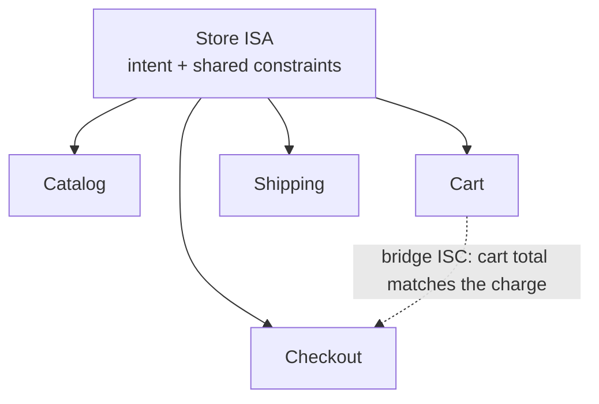

# ISA Hierarchy & Cross-ISA Integration

> On-demand reference. Single-ISA work is the leaf case and covers virtually all real tasks — 0 of 472 ISAs in the archive use `parent:`/`children:`/Bridge Criteria as of 2026-07-07. The hierarchy machinery below exists for genuinely large builds (a Tolkien-scale world, an enterprise product) and is loaded from here, not from the every-turn Algorithm doctrine. The Algorithm keeps a one-paragraph stub pointing here.

Anything too big for one file — a Tolkien-scale world, an enterprise app, a 500-dev product — is a **tree of ISAs**, not one monolith with 35,000 criteria. The mechanism:

**Linking.** An ISA declares its place in the tree via frontmatter `parent: <slug>` and `children: [<slug>, …]`. The parent holds product intent (a small Goal + a few container ISCs); each child owns one subsystem's closure. Children may have children. Text is cheap and git is easy, so branching/diverging ISAs (Team A's vision vs Team B's) is tracked the same way — divergence is explicit and auditable, never silent drift.

**Constraint inheritance (HARD).** A child ISA's `## Constraints` implicitly include every ancestor Constraint. A child ISC may not violate an inherited Constraint; if it must, that's a parent-level renegotiation logged in the parent's `## Decisions`, not a quiet child override. This is what keeps a 118-subsystem world "speaking the same language."

**Dependencies (`## Dependencies`).** Each ISA states what it needs from siblings/ancestors as machine-readable lines — `requires: auth-isa — valid session-token contract`, `requires: physics-isa — damage constants`. Scoping, when the ISA has any `## Dependencies`, loads those declared dependency ISAs into context before scaffolding claims, so the work is written against the real contracts, not guesses. (In practice the 13 ISAs that use `## Dependencies` name files/tools/CLIs rather than sibling ISA slugs — the same need the prerequisite probe in Algorithm claim 5 already covers.)

**Bridge criteria (`## Bridge Criteria`).** A leaf ISC verifies a subsystem in isolation. A **bridge ISC** verifies the *seam* between two ISAs and lives in the parent (or the more-central of the two): `- [ ] ISC-N: Bridge: Psionic willpower cost never exceeds the Magic resource budget`, with `anchors_to: cross: magic-isa` in Test Strategy. Verification runs bridge criteria as a distinct pass after leaf claims — integration is a first-class test surface, not an afterthought. Adding psionics to a system that already has magic can't "work sometimes and break on contact"; the bridge ISC is the probe that forbids it.

**Blast-radius (detection, not auto-resolution).** When an ISA with a `parent:`/`children:`/`cross:` relationship changes, a blast-radius pass walks the dependency graph and lists every downstream ISC that now needs re-verification (`changing willpower cost touches magic-isa: 7 ISCs, race-isa: 3, history-isa: 2`). It shows the blast radius before BUILD so the change is a decision, not a surprise. **The system detects and surfaces conflicts; it does not resolve cross-ISA governance conflicts automatically** — which team's conflicting criterion wins is a human call, made visible here instead of buried in ambiguity.

**When to split into a tree (judgment, not a count).** One ISA until a single file stops being legible — usually when Vision/Goal names subsystems that each carry their own Vision, Constraints, and independent test surface. A website is one ISA; an RPG world is a master ISA plus a fleet of subsystem ISAs, each possibly nested. The Interview (deepest-grade work) surfaces the intended depth; don't pre-split a medium app that fits in one file.

## Examples

### One build, split into a tree

Take an online store too big to specify in one file. You don't write one ISA with 300 criteria — you write a **parent** that holds the store's intent (a small Goal, a few container ISCs) and give each subsystem its own **child** ISA: catalog, cart, checkout, shipping. Each child owns its own closure and can be verified on its own.

Two rules keep the tree honest:

- **Constraints flow down.** The parent says *every price is in one currency, to the cent*. The checkout child never re-decides that — it inherits it. If checkout genuinely needs an exception, that's a change logged in the parent's Decisions, not a quiet override in the leaf.
- **The seam gets its own test.** "Cart works" and "checkout works" can both pass while the handoff between them is broken. So the parent holds a **bridge criterion** — *the total shown on the cart equals the amount charged at checkout* — verified as its own pass, after the leaves. Integration is a claim, not a hope.

When someone later changes the tax rule, a **blast-radius** pass names every downstream criterion that now needs re-checking — cart: 2, checkout: 3, receipts: 1 — before any code is touched. The change becomes a decision you can see, not a surprise you find in production.

### When to split, and when not to

Most things are one file. A personal blog is a single ISA — it has one vision and one test surface, and splitting it would be ceremony. You reach for a tree only when a single file stops being legible: when the Goal names subsystems that each carry their own vision, their own constraints, and a test surface that stands alone. The store earns a tree; the blog doesn't.

Children inherit the parent's constraints along the solid edges; the dashed edge is the bridge criterion that tests the seam between two of them — the join no single child can verify alone. A tree, not a monolith, and only when the work is genuinely that big.

---
