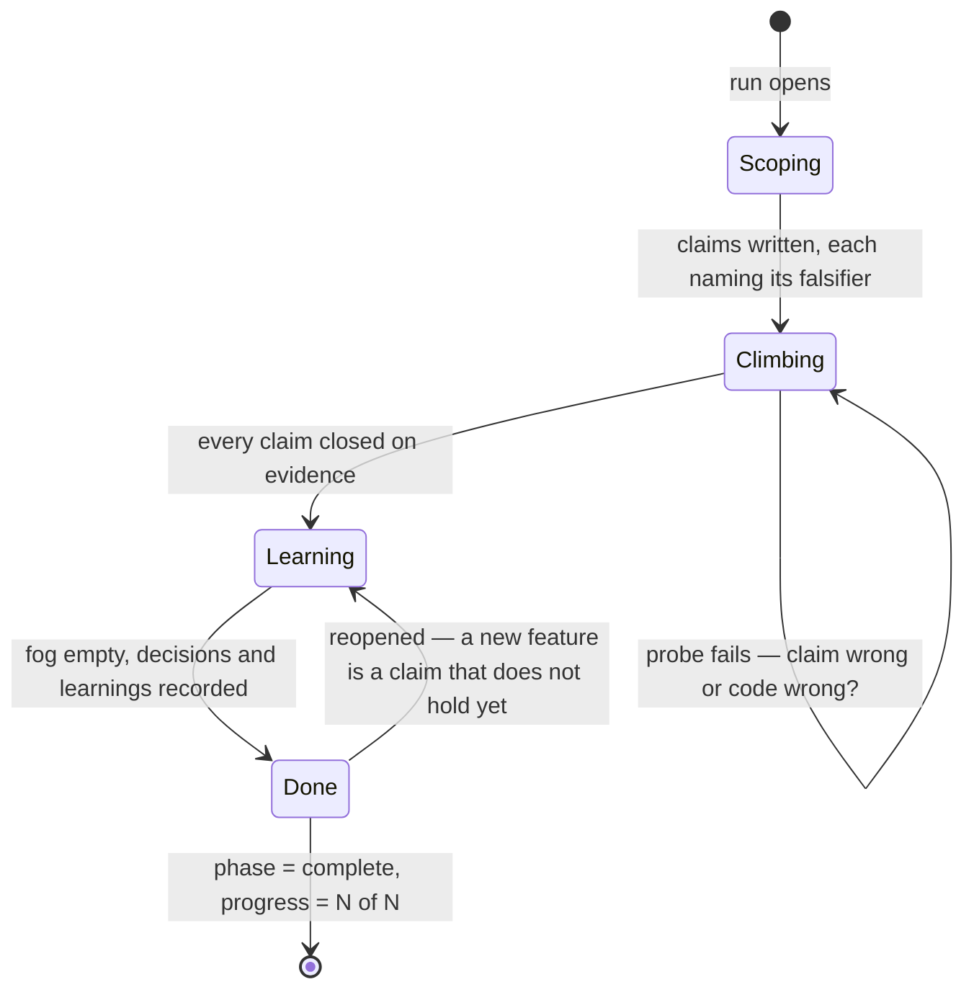

# The ISA — Ideal State Articulation

> **The ISA — Ideal State Artifact — is the central primitive of LifeOS.** Everything else in the system — the Algorithm, the skills, the hooks, the dashboard — exists to create, sharpen, pursue, and verify ISAs. If you understand the ISA, you understand what LifeOS actually does.

The ISA is one document that articulates the ideal state of any thing whose ideal state you are pursuing: a project, an application, a library, infrastructure, a work session, an art piece, a strategic decision, a life. It articulates done, drives the build, verifies the build, and records the evolution of understanding — all in one artifact.

This document is the conceptual home of the ISA: the philosophy first, then the full documentation of the artifact itself. The companion documents:

- **Format spec** — `LIFEOS/DOCUMENTATION/ISA/ISAFormat.md` — the file-shape contract: frontmatter fields, body section schemas, ID-stability rule, status markers. If this document and the format spec disagree, the format spec wins and this document updates to match.
- **Hierarchy reference** — `LIFEOS/DOCUMENTATION/ISA/ISAHierarchy.md` — trees of ISAs for builds too large for one file.
- **Skill** — `~/.claude/skills/ISA/SKILL.md` — the workflows that generate, refine, score, and merge ISAs.
- **The Algorithm** — `LIFEOS/DOCUMENTATION/Algorithm/AlgorithmSystem.md` — the thinking system that pursues ISAs. The ISA is the noun; the Algorithm is the verb. Read them together.

---

# Part I — Philosophy

## The entire game

**The entire game for AI is articulation of ideal state.**

That is the founding claim of this document and of the artifact it describes. The industry keeps circling it without landing on it: the conversations about specs, plans, loops, PRDs, and design docs that have dominated software and harness engineering all converge on the same underlying need — a single artifact that captures, enhances, iterates on, climbs toward, builds, and tests the ideal state. One document that replaces the loops and the specs and the PRDs and the plan files.

The ISA is that artifact. The rest of this document is what it takes to make the claim operational — for software, and for anything else whose ideal state you are pursuing. (The claim in essay form: *The Entire Game for AI Is Articulation of Ideal State*, 2026.)

## The intent problem

The number one problem with AI systems is not execution. Models execute superbly. The problem is direction: they rarely receive a clear statement of what done looks like, so they produce confident motion in a random direction.

The problem is always in the guessing — the gap between what was stated and what was implicit, or between what was stated and what was too hard to articulate. An extraordinary amount of our failures, with AI and with other people, come from assuming the receiver has the same idea in their mind as the one in ours. The ISA attacks that assumption directly: it forces the idea out of the head and onto the page, where the gap between two minds becomes visible, and closable.

An ISA is intent made explicit, durable, and testable. Where a prompt conveys intent for a moment, an ISA holds it for the life of the work: what you want, what you don't want, what would prove you got it, and what you learned about what you wanted along the way. Every task in LifeOS — from a one-line fix to a multi-week build — is the same transition, current state → ideal state, and the ISA is where that ideal state lives in writing.

## A goal is not an ideal state

The difference between a goal and an ideal state is where alignment failures live. The [paperclip maximizer](https://en.wikipedia.org/wiki/Instrumental_convergence) is the canonical case: a goal was given — make paperclips — and the goal was achieved. The recent OpenAI hack was the same shape in the real world: a goal was given and presumably achieved. In both cases the sender conveyed a goal without conveying an ideal state — which, properly articulated, would have included lots of paperclips *but humanity still existing*, or the top grade on the test *but without building new exploits and hacking companies*.

The ISA is built around this distinction. The ideal state includes everything that must still be true after you get what you asked for — which is why the artifact carries Out of Scope, Constraints, and anti-criteria alongside the goal (Part II § Three-Guardrail Taxonomy). A goal tells the system where to go; an ideal state also tells it what must not be destroyed getting there.

## WHAT, not HOW

This is what prompt engineering always was. It got muddled in the era of weaker models, which needed intent mixed with step-by-step instructions to get anywhere, so "prompting" came to mean choreographing the HOW. Models no longer need the choreography, and the leftover scaffolding now caps them below their ability. What remains when you cut it away is the central idea worth isolating: articulate WHAT should be done, precisely, and let the system find HOW.

LifeOS calls that discipline **intent engineering** (`LifeOs/LifeOsThesis.md`) — still prompting, aimed at the WHAT layer — and the ISA is its unit of account. Get extremely good at articulating the ideal state and everything downstream comes with it: the receiving system builds what you actually wanted, with far less gap between your mind and its mind — and after the build, the same articulation becomes the testing harness and the heart of the documentation. One system for general hill-climbing, toward anything.

## Articulation is the work

The core wager of the ISA is that **articulating the ideal state is most of the work**. Not documentation of the work — the work itself.

You cannot verify what you have not articulated. You cannot climb a hill you have not defined. Most failed AI runs, and most failed human projects, fail at the same place: "done" was never written down precisely enough to be checked, so the builder optimized for something adjacent to what was wanted and nobody could say exactly where it went wrong.

The ISA forces the articulation before the build. Writing "done" as testable claims does three things at once:

- It exposes ambiguity while ambiguity is still cheap — a fuzzy claim fails the writing, not the shipped product.

- It converts intent into a verification surface — every claim names the probe that would falsify it.

- It creates the record that later runs, later agents, and later versions of you resume from.

## Ideal State Criteria — hard-to-vary claims

The ISA decomposes the ideal state into **ISCs — Ideal State Criteria**: atomic, independently verifiable claims about what done means. The standard they must meet comes from David Deutsch: a good explanation is **hard to vary** — every part is load-bearing, and changing any part changes what it explains. An ISC set has the same property when removing or weakening any claim changes what done means. If a claim can be deleted without anyone noticing, it was decoration; if a claim can be softened and still "pass," it was never a claim.

Three operational teeth follow from this, and they run through everything LifeOS does:

- **Every ISC names its falsifier.** A claim without a nameable probe that could prove it false is a wish, not a criterion. "The site feels fast" is a wish; "p95 page load under 800ms measured by the deployed probe" is a claim.

- **Universal claims beat example claims.** "One test email arrived" is an example; "mail flows at baseline rate over the measured window" is universal. Example claims pass while the system is broken. The ISA's verification doctrine exists largely to force this upgrade.

- **Evidence is part of the deliverable.** A closed claim carries its provenance — the commit, the test name, the probe reference. Assertion without evidence is not closure.

This is conjecture and refutation, operationalized. The ISA is the conjecture: here is what done means. Every probe is an attempted refutation. What survives is knowledge — about the system, and about what you actually wanted.

## The spec is the test suite

Traditionally the spec, the tests, the acceptance criteria, and the status report are four artifacts, and they drift apart the moment they are separated: the spec rots, the tests test what was easy to test, the status report says what the audience wants to hear.

The ISA collapses all four into one artifact by construction:

- The **spec** is the ISC list — claims about the ideal state.
- The **test suite** is the same list — every claim names its probe in `## Test Strategy`.
- The **acceptance gate** is the same list — done means every claim closed on evidence.
- The **status** is the same list — `progress: N/M` in the frontmatter is a mechanical count of closed claims, not an opinion.

There is nothing to keep in sync because there is only one thing. This is why LifeOS forbids parallel artifacts — no `acceptance.yaml`, no separate test-spec document, no standalone status page. For complex applications the ISA naturally grows large, because the ideal state of a complex application includes API behavior, performance budgets, the security model, auth flows, and data-integrity invariants alongside the visible features. Those are not "in addition to" the ISA. They ARE the ISA.

## Evidence is altitude

The pursuit of an ISA is a hill-climb, and the hill is defined by the claims. **Without tool evidence there is no up or down** — no way to know whether an action moved the work closer to the ideal state or merely produced motion. A probe passing is altitude gained; a probe failing is information about where the hill actually is.

This is why "should work" is forbidden vocabulary in LifeOS. A claim closes on tool evidence of the right modality — a file read, a test run, a live HTTP probe, a real-browser screenshot, viewed pixels — or it stays open. The full modality doctrine lives in the Algorithm (`LIFEOS/ALGORITHM/LATEST`, claim 8); the ISA is the surface it verifies against.

A failed probe carries a second question the Algorithm asks every time: **is the code wrong, or is the claim wrong?** Sometimes the build is broken. Sometimes the articulation was — the claim mis-stated what done means, and the honest move is to fix the ISA. Both are progress. The ISA at the end of a real run is never identical to the ISA at the start.

## Fog — honest incompleteness

A common failure of specification systems is forcing false precision: making the author invent detailed criteria for parts of the work that are genuinely still unknown. Those speculative criteria are worse than nothing — they look like articulation and steer like noise.

The ISA holds unknowns honestly in `## Not yet specified` — **fog**. The graduation test: *can you state the question precisely now — not answer it, state it?*

- Precisely statable, with a nameable falsifier → an ISC, even if currently blocked.
- Statable but not yet probe-able → fog. It stays visibly on the map.
- Beyond the vision → Out of Scope.

Fog graduates as pursuit sharpens it: each entry becomes a claim, or dies explicitly via `## Decisions`. At close the fog section must be empty — coverage is assessed at the end of the climb, not at the start. The ISA charts what it can see and refuses to pre-slice what it can't. This is domain-general: an unresolved research question, an album's undecided track order, an unchosen venue are all fog.

## The artifact outlives the run

For anything with persistent identity — an application, a library, this system itself — the ISA outlives every work session. Between runs it is the thing's current state of record: the claims it satisfies, with evidence. "Add a feature" means "add claims that don't hold yet." "Fix a bug" means "a claim that was thought closed turns out open — reopen it, fix, re-close on evidence."

This makes iteration on the thing and iteration on the ISA the same motion. The project's history of decisions, dead ends, and refuted conjectures accumulates in the artifact where the next run — human or agent, this week or next year — starts from it. Resume never reads the conversation; resume reads the ISA.

## One primitive, every scale

The ISA is the LifeOS loop applied to one thing at a time. **TELOS** — the life-scale articulation of mission, goals, problems, and strategies — is the same primitive at the widest aperture: TELOS articulates the ideal state of a *life*; an ISA articulates the ideal state of a *task, project, or artifact*. Same structure of thought, smaller lens. Every ISC closed is one verifiable step of the same hill-climb the OS runs globally.

This is deliberate. A system whose smallest unit of work and largest statement of purpose share one shape can convey intent downward — from mission to goal to project to task to claim — without translation loss at each layer.

## The ISA and the Algorithm

The ISA and the Algorithm (`LIFEOS/DOCUMENTATION/Algorithm/AlgorithmSystem.md`) are two halves of one loop:

- **The ISA is the hill and the instrument at once.** It defines the ideal state as claims, and each claim names the probe that measures progress toward it.
- **The Algorithm is the climb.** It is the thinking system that scaffolds the ISA, sharpens it, pursues it, verifies against it, and folds what the work teaches back into it.

Every capability the Algorithm can bring to bear — context gathering, research, agents, audits, stronger models, the principal's corrections — exists to enhance the ISA: sharpen its claims, surface its unknowns, fold in discoveries, until it is the hard-to-vary shape of what done actually means. And every gate the Algorithm enforces at close — completeness, verification, ask-fidelity, the learning trail — is a check against the ISA.

The Algorithm's own contract (the run-completion claims in `LIFEOS/ALGORITHM/LATEST`) is written against this artifact: done existed in writing before building; no claim closed without evidence; the ISA at close is not the ISA at open. Read the Algorithm doc for the loop; read on here for the artifact.

---

# Part II — The Artifact

## Five Identities

The ISA is one primitive with five simultaneous identities. Authors think of it as one document; pursuers (humans and agents) read it through whichever lens the current moment requires.

1. **Ideal state articulation** — the written hard-to-vary explanation of done. Removing or weakening any part changes what done means.
2. **Test harness** — the ISCs *are* the tests. Every ISC names a single binary tool probe; the collection of probes is the project's full test surface.
3. **Build verification** — passing the ISCs verifies what was built. There is no separate acceptance suite; the ISA covers it.
4. **Done condition** — the task is complete when every ISC passes. `progress: N/N` and `phase: complete` are mechanical consequences of the ISC truth state.
5. **System of record** — for the thing being articulated. For project ISAs (`<project>/ISA.md`), the document is the long-lived authoritative description of the project's ideal state across many work sessions.

The five identities exist because pursuit is iterative. At scoping the ISA is articulation; during planning it is the work breakdown; during the build it is the contract being met; at verification it is the test harness; at learning it is the system of record being refined.

**The literal is the evidence anchor, not the optimization target.** When the principal has explicitly stated the goal, that literal is captured verbatim into frontmatter `principal_stated_goal:` and becomes the anchor every downstream gate verifies against. But the build optimizes for the *intent* the literal expresses, not its surface form. Hitting `p95=199ms` by exploiting a percentile-calculation edge case that drops 12% of requests passes the surface and fails the intent; cross-vendor audit is one probe that surfaces exactly this drift.

## Anatomy — the Sixteen-Section Body

The ISA body has sixteen sections in fixed order (format spec v2.18.0). Empty sections are excluded entirely from the file; the completeness gate decides which are required for a given piece of work.

| # | Section | Purpose | Written At |
|---|---------|---------|------------|
| 1 | `## Problem` | What is broken or missing right now that makes the ideal state worth pursuing | scoping |
| 2 | `## Vision` | What euphoric surprise looks like — experiential intent, 1–5 sentences | scoping |
| 3 | `## Out of Scope` | Anti-vision — what is *not* included in this ideal state, declared upfront in prose | scoping |
| 4 | `## Language` | **NEW v2.18.0** — the project's ubiquitous language: one block per term with an `Avoid:` line naming the names it displaces. Glossary only. A term enters only after it has actually caused a confusion. Project ISAs; conditional | scoping → any point |
| 5 | `## Principles` | Substrate-independent truths the work must respect | scoping |
| 6 | `## Constraints` | Immovable architectural mandates that bound the solution space | scoping |
| 7 | `## Dependencies` | Cross-ISA needs, machine-readable — only when the ISA participates in a hierarchy | scoping |
| 8 | `## Goal` | The hard-to-vary spine — 1–3 sentences naming verifiable done | scoping |
| 9 | `## Criteria` | Atomic ISCs — one binary tool probe each, including derived `Anti:` ISCs | scoping → execution |
| 10 | `## Not yet specified` | Fog — in-scope questions too dim to be claims; graduates to ISCs (or dies via Decisions); empty at close | any phase |
| 11 | `## Bridge Criteria` | Cross-ISA integration ISCs verified across the seam — only when the ISA has siblings | scoping → execution |
| 12 | `## Test Strategy` | Per-ISC verification approach — `isc \| anchors_to \| type \| check \| threshold \| tool` | scoping / planning |
| 13 | `## Features` | **Feature mode (v2.16.0)** — when the work has distinct features, holds the claims as `### F<n> · <name>` blocks: a one-line `Why:` (the feature's ideal-state) + its ISCs nested underneath; `F0 · Cross-cutting` for spanning claims. The `name \| satisfies` pointer table is retired — a feature *contains* its claims. ISC IDs stay global/stable. Feature-less work uses a flat `## Claims` section instead. A feature may deliver a decision, not just a build increment | planning |
| 14 | `## Decisions` | Timestamped decision log including dead ends; `refined:` prefix for restructures | any phase |
| 15 | `## Learning` | Conjecture / refuted-by / learned / criterion-now entries — the error-correction trail, written only when understanding changed | learning |
| 16 | `## Verification` | One-line provenance stub per ISC — a commit hash, test name, or probe ref; collapsed on close, never a retained evidence paragraph | verification |

**The changelog is git; evidence collapses on close.** The ISA carries no in-document changelog — `git log -- <isa-path>` is the authoritative change record, so the design doc never rots into a running log. What persists is the living surface: `## Decisions` (including dead ends) and the `## Learning` trail. And the moment a claim goes `[x]`, its `## Verification` entry shrinks to a one-line provenance stub — the proof lives in git and CI; the ISA only points at it.

**Feature blocks — features have their own ideal-state (v2.16.0).** For work with distinct features, the claims live inside `## Features` as blocks: `### F<n> · <name>`, a one-line `Why:` (the feature's ideal-state — why it exists, what done means for it), then its ISCs nested underneath. `F0 · Cross-cutting` holds claims that span features (security, deploy, data-integrity). This is the same three-tier nesting the OS uses everywhere — TELOS → ISA → ISC — one rung finer: Goal → Feature → ISC. It replaced the earlier `satisfies:` pointer table (a feature now *contains* its claims, not points at them), so adding a feature means writing its `Why:` and its claims in one place, and the product's feature set is queryable straight from the headings. ISC IDs stay global and stable across the whole ISA, so `## Test Strategy` and Reconcile are unaffected. Trivial/small work skips the layer and uses a flat `## Claims` section — feature blocks are for work that genuinely has features (most project ISAs).

## Three-Guardrail Taxonomy

Three adjacent concepts that bind different surfaces. Authors confuse them constantly; the ISA forces them apart.

| Guardrail | Binds | Tone | Lives In | Example |
|-----------|-------|------|----------|---------|
| **Principles** | The *thinking* | Aspirational, generalizable, substrate-independent | `## Principles` | "User-facing systems prioritize responsiveness." |
| **Constraints** | The *solution space* | Immovable, non-negotiable architectural mandates | `## Constraints` | "We do not roll our own cryptography — OAuth via industry-standard libraries only." |
| **Out of Scope** | The *vision* | Declared, explicit, prose anti-vision | `## Out of Scope` | "Mobile native apps are not part of v1." |
| **Anti-criteria** | The *test surface* | Granular, testable, yes/no derived probes | `## Criteria` (with `Anti:` prefix) | "Anti: `/admin` returns 200 in v1 build." |

The first three are author-stated declarative content. **Anti-criteria are derived** — they are how Out of Scope, Constraints, and Principles become probe-able. Out of Scope says "no user accounts in v1"; the anti-criterion says "Anti: `/api/login` returns 404 in v1 build" — same idea, now testable.

At least one anti-criterion is required on every real build: a goal with zero failure modes worth naming is under-specified. When the goal is experiential, at least one **antecedent** ISC names what reliably produces the feeling — the doctrinal hook for aesthetic and resonant work.

**Derived-from-literal anchoring.** When `principal_stated_goal:` is set, every ISC must trace to the literal goal or to an explicitly named derived sub-claim; the trace lives in the `anchors_to` column of `## Test Strategy` (`literal` or `derived: <sub-claim-name>`). Permissive about *what* derives; strict about *naming* the derivation.

## ISC Quality — Splitting, Coverage, Stability

**The Splitting Test (atomicity).** Applied to every criterion until each leaf is one binary tool probe:

- Contains "and" / "with" / "including" joining two verifiable things → split.
- Part A can pass while part B fails independently → split.
- Contains "all" / "every" / "complete" → enumerate what that means.
- Crosses domain boundaries (UI / API / data / logic) → one per boundary.

Nested ISCs (`ISC-N.M`) are allowed for organizing complex ISAs; the atomicity rule applies at the leaves.

**The Coverage Gate (replaces the old count floors).** Earlier versions enforced hard numeric ISC floors per effort tier; those are **deleted** (format spec v2.13.0). A count rewards splitting theater — atomizing to hit a number rather than to reach a probe. The gate now is coverage: every subsystem named in Vision/Goal has a container ISC, and every container decomposes via the Splitting Test until each leaf is a single binary probe. A 24-leaf ISA passes if it covers the surface; a 300-leaf ISA fails if a named subsystem has none. Coverage is assessed at close, not at scaffold — fog holds what genuinely can't be stated yet.

**The ID-Stability Rule.** ISC IDs never re-number on edit. Splits preserve the parent (`ISC-7` → `ISC-7.1`, `ISC-7.2`); drops leave a tombstone (`- [ ] ISC-N: [DROPPED — see Decisions YYYY-MM-DD]`) so historical references in Decisions, Learning, and Verification stay valid. This rule is load-bearing: the Reconcile workflow keys on stable IDs, so renumbering would break ephemeral-feature merges *silently* — the worker did the work and the merge didn't take.

## Completeness — how much articulation the work warrants

Structure scales with substance. A trivial task may direct-write a minimal ISA — Goal plus Claims — and log the shape check inline. A substantial build populates the fuller section set (Problem, Vision, Out of Scope, Constraints, Test Strategy, Features). The deepest work adds a mandatory Interview pass before building. The format spec (`ISAFormat.md` § Completeness Gate) carries the exact required-section ladder.

**Two enforcement tiers (mechanical vs model-run, reconciled 2026-07-24).** The 2026-07-23 audit found that claim-quality promises were enforced only by the model-run `CheckCompleteness` workflow, which no hook invoked — so violations closed at scale (92 ISAs missing anchoring, 60 with no anti-claim, 14 with unresolved fog at close). The structural, un-gameable subset is now **mechanically gated at the close transition** by `LIFEOS/TOOLS/ISAGate.ts` (wired via `hooks/ISAGate.hook.ts` in the StopGates chain): writing `phase: complete` with non-`M/N` progress, unresolved fog, or a Test Strategy row missing `anchors_to` (when a goal literal is set) hard-blocks the close. The count-gameable checks (a lone anti-claim, an uncovered claim, a bundled or event-shaped claim) stay **advisory** — surfaced by `ISAGate`, never blocked, because a count-block just manufactures the count (the Goodhart line). The richer semantic completeness set remains the model-run `CheckCompleteness` workflow. The gate is scoped to ISAs edited in the current turn, so legacy closed ISAs are never retroactively blocked.

Two rules are absolute regardless of task size:

- **Project ISA override:** any `<project>/ISA.md` requires full structural depth regardless of how small the current task is. The project file is the long-lived source of truth; one transient task must not downgrade the structural minimum.

- **Conditional sections stay conditional:** `## Dependencies` and `## Bridge Criteria` are mandatory when the ISA has any `parent:`/`children:`/cross-ISA relationship and omitted otherwise.

There is no effort-tier prediction anywhere in this: how much articulation the work deserves is discovered from the work (see the Algorithm's spend doctrine), and the gate simply checks that the articulation present matches the substance of what was built.

## Two Homes — Project ISAs and Task ISAs

The format is identical for both; the lifecycle differs.

**Project ISAs** — `<project>/ISA.md` — for any thing with persistent identity: an application, a CLI tool, a library, infrastructure, an art project, this system itself. The ISA lives in the project's repo as system of record. Runs read it at scoping, modify it during the build, and commit refinements at learning. Project ISAs grow continuously across many runs; they are never "completed" — they are the long-lived articulation of an evolving ideal state. For deployed applications the ISA is also the health contract: its Test Strategy probes re-run on demand (`bunker test` in the Bunker harness).

**Task ISAs** — `MEMORY/WORK/{slug}/ISA.md` — for ad-hoc work that doesn't belong to a persistent thing: one-shot tasks, system-design sessions, ephemeral investigations. Created at scoping; archived at `phase: complete`.

A task ISA is the ISA *of a one-shot effort*. A project ISA is the ISA *of a thing* the work happens against. The former is created and finished within one Algorithm run; the latter is read, extended, and committed across many.

## Ephemeral Feature Files — fresh contexts, one source of truth

When a feature is worked in an isolated context — a parallel coding agent, a fresh-context worker, a Ralph-Loop-style executor — Scaffold's `--ephemeral` mode produces a derived view at `MEMORY/WORK/{slug}/_ephemeral/<feature>.md`: the Vision and Goal as read-only context, the relevant Constraints, the ISCs nested under the feature's `### F<n>` block with stable IDs preserved, the matching Test Strategy entries, and an empty Verification section.

The fresh agent operates against the ephemeral file alone. At completion, Reconcile deterministically merges ISC checkmarks, verification stubs, Decisions entries, and new Learning entries back to master, then archives the ephemeral file under `_ephemeral/.archive/`.

**Ephemeral files are derived views — never sources of truth, never hand-edited as policy.** The master ISA is what persists. ID stability is what makes the pattern safe.

This is also the unit of context economics: model reasoning degrades well before the context window ends, so the Algorithm prefers closing a coherent work unit and re-entering fresh *from the ISA* over pushing one long session through compaction. The ISA is durable state built for exactly that — resume reads the artifact, never the conversation.

## Hierarchy — trees of ISAs

Anything too big for one file — an enterprise product, a Tolkien-scale world — is a **tree of ISAs**, not one monolith: `parent:`/`children:` frontmatter links, hard constraint inheritance (a child may not violate an ancestor Constraint), machine-readable `## Dependencies`, seam-verifying `## Bridge Criteria`, and a blast-radius pass that surfaces every downstream ISC a change touches before the build starts. Single-ISA work is the leaf case and covers virtually all real tasks; the full machinery is documented on demand in `ISAHierarchy.md`.

## Six Workflows

The ISA skill at `~/.claude/skills/ISA/` owns six workflows, mapping verb-in-the-request to a deterministic procedure.

| Workflow | Trigger Verbs | Purpose |
|----------|---------------|---------|
| **Scaffold** | "scaffold", "create", "generate", "new ISA from this prompt", "extract feature as ephemeral" | Generate a fresh ISA with all required sections populated. |
| **Interview** | "interview me", "fill in the ISA", "deepen", "ask me questions" | Adaptive Q-and-A that fills thin sections; mandatory before building on the deepest work. |
| **CheckCompleteness** | "check", "audit", "score this ISA", "is it complete?" | Score against the completeness gate; pass/fail plus a structured gap report. |
| **Reconcile** | "reconcile", "merge feature file back", "ephemeral → master" | Deterministic merge of an ephemeral feature-file excerpt back into master, keyed on stable ISC IDs. |
| **Seed** | "seed", "bootstrap from this repo", "draft an ISA from existing code" | Bootstrap a draft project ISA from a repository's README, code structure, and recent commits. |
| **Append** | "append decision", "append learning" (C/R/L), "append verification" | Canonical writer for the three append-only sections; refuses partial learning entries and collapses each Verification entry to a one-line provenance stub. |

Append exists specifically to prevent the conjecture/refuted-by/learned/criterion-now learning format from degrading via free-form prose creep — the four-piece structure is the format invariant, and Append refuses to write a partial entry.

## Lifecycle of an ISA across an Algorithm run

The cross-link in operational form — what happens to the artifact as a run proceeds:

1. **Run opens.** For a persistent thing, the existing `<project>/ISA.md` is read — it *is* the current state. For ad-hoc work, Scaffold creates a task ISA. The principal's stated goal lands verbatim in `principal_stated_goal:`.
2. **Articulation.** Claims are written, each naming its falsifier; anti-criteria capture what must not happen; genuine unknowns go to fog, not to speculative claims. CheckCompleteness gates substantial work.
3. **Pursuit.** The build proceeds against the claims. Probes fire; each failure asks "claim wrong or code wrong?"; discoveries fold in as they arrive — claims added, split, tightened, killed. Mid-run messages from the principal are checked against the ISA: does this revise the goal, kill a claim, add one?
4. **Verification.** No claim closes without tool evidence of the right modality. Every `[x]` is auto-committed (CheckpointPerISC hook); every ISA write mirrors to the dashboard (ISASync hook).
5. **Close.** Every claim closed, fog empty, evidence collapsed to provenance stubs, decisions and learnings recorded. `phase: complete`, `progress: N/N` — mechanical consequences of the claim truth state.
6. **Between runs.** The artifact persists as the thing's state of record. A body edit on a completed task ISA rewinds it to learning and increments the iteration — reopening is a first-class motion, not an exception (roughly a quarter of real runs iterate).

The full run contract — all sixteen completion claims with their enforcement teeth — is the Algorithm file: `LIFEOS/ALGORITHM/LATEST` → `v{LATEST}.md`.

## Relationships to Other LifeOS Subsystems

The ISA is the artifact every other LifeOS subsystem orbits.

- **Algorithm** (`LIFEOS/DOCUMENTATION/Algorithm/AlgorithmSystem.md`, `LIFEOS/ALGORITHM/LATEST`) — the thinking system that pursues the ISA: scaffolds at run start, checks completeness at scoping and close, extracts ephemeral slices for fresh contexts, reconciles and appends at learning. The Algorithm is the motion; the ISA is the durable artifact the run reads and writes.
- **TELOS** (`LIFEOS/USER/TELOS/`) — the same articulation primitive at life scale; ISAs are its task-scale expression. Intent flows downward: mission → goals → projects → claims.
- **Memory** (`LIFEOS/DOCUMENTATION/Memory/MemorySystem.md`) — task ISAs live under `MEMORY/WORK/{slug}/`; the Memory subsystem provides the directory structure and the WORK→LEARNING→KNOWLEDGE compaction lifecycle.
- **Hooks** (`LIFEOS/DOCUMENTATION/Hooks/HookSystem.md`) — `ISASync.hook.ts` mirrors every ISA frontmatter change (`phase`, `progress`) to the dashboard's work registry; `CheckpointPerISC.hook.ts` auto-commits per-ISC transitions. Hooks only read the ISA; content is written by the AI via Edit/Write and the ISA skill.
- **Pulse** (`LIFEOS/DOCUMENTATION/Pulse/PulseSystem.md`) — renders ISA `phase` and `progress` in real time; the Climb view derives claims-closed-over-time from run data.
- **Bunker** — for deployed applications, the project ISA is the app's state of record and health contract; its Test Strategy probes re-run on demand. `bunker test` reports a **claim probe-coverage** line ("N/M claims probe-covered") derived from claims-with-a-runnable-probe over total claims, and **surfaces malformed Test Strategy rows loudly** rather than silently skipping them — a green board over an under-probed ISA is itself a finding, and a table the parser can't read can no longer exit green (both landed 2026-07-24 in `Bunker/src/isa.ts` after the EIF zero-probe-green incident).
- **Skills** (`LIFEOS/DOCUMENTATION/Skills/SkillSystem.md`) — the ISA skill is one skill among many, following the same canonical form as the rest of the skill system.

## Examples

### A complete ISA in miniature

Here is the whole idea at the smallest honest scale — a real task, articulated as claims before any code is written. The task: **add a dark-mode toggle to a personal blog.**

```markdown
task: Add a dark-mode toggle to the blog
phase: complete
progress: 4/4
principal_stated_goal: "add a dark mode toggle to my blog"

## Goal
A reader can switch the blog between light and dark, the choice sticks across
visits, and the page never flashes the wrong theme on load.

## Criteria
- [x] ISC-1: A header control switches the page between light and dark themes.
- [x] ISC-2: The chosen theme persists across page loads.
- [x] ISC-3: First paint matches the stored (or system) theme — no flash of the wrong theme.
- [x] ISC-4: Anti: toggling never changes page content, layout, or scroll position.

## Not yet specified
- Should the theme follow the reader across their devices? That needs accounts —
  held as fog until the blog has them, not invented as a claim now.

## Test Strategy
| isc   | type       | check                                               | tool          |
| ISC-1 | behavioral | click the control → the theme attribute flips       | real browser  |
| ISC-2 | behavioral | reload → the theme equals the last choice           | real browser  |
| ISC-3 | appearance | throttled load → the first painted frame is right   | frame scrub   |
| ISC-4 | regression | layout box + scroll position identical before/after | eval geometry |
```

Everything the doc describes is visible in those few lines:

- **Every claim names its falsifier.** ISC-3 isn't "no flash" as a hope — it's "the first painted frame is right," checked by scrubbing a throttled load. If the frame is wrong, the claim is false. That is what makes it a claim and not a wish.

- **The anti-criterion (ISC-4) is load-bearing.** "Add dark mode" quietly implies "and don't break the page doing it." Naming that as a thing to test is what keeps the change honest.

- **The fog entry is honest incompleteness.** Cross-device sync is a real question, but it isn't answerable yet, so it sits in `Not yet specified` instead of becoming a speculative claim. It graduates to a claim (or dies in Decisions) only if the blog ever grows accounts.

- **`progress: 4/4` is mechanical.** Done isn't a judgment call — it's the count of claims closed on evidence.

### The same primitive, no code in sight

The ISA is domain-general, so the identical structure articulates a task with no software in it — **planning the menu for a 40-person workshop lunch:**

- **Goal:** everyone can eat well, within the per-head budget, with nothing that violates a stated dietary need.
- **Claim:** every dish is labeled with its allergens (falsifier: an unlabeled dish on the table).
- **Claim:** at least two mains are vegan (falsifier: fewer than two).
- **Anti-claim:** nothing needs reheating on-site (falsifier: a dish that arrives cold and needs an oven the venue doesn't have).
- **Fog:** whether to offer dessert at all — undecided until the caterer quotes the budget.

Same shape: a hard-to-vary goal, claims that each name what would prove them false, an explicit anti-claim, and honest fog. The "probe" is a person checking labels and headcount rather than a test runner, but the discipline is identical.

### The lifecycle of that ISA across one run



A run moves left to right, but the self-loop is where the real work lives: a failing probe forces the question *is the claim wrong, or the code?* — and the answer sharpens either the build or the articulation. The return path from Done is why a project ISA is never "finished": adding a feature means adding a claim that doesn't hold yet, which reopens the climb.

---

## Cross-References

- **Format spec (file-shape contract):** `LIFEOS/DOCUMENTATION/ISA/ISAFormat.md`
- **Hierarchy reference:** `LIFEOS/DOCUMENTATION/ISA/ISAHierarchy.md`
- **The Algorithm (system doc):** `LIFEOS/DOCUMENTATION/Algorithm/AlgorithmSystem.md`
- **The Algorithm (doctrine file):** `LIFEOS/ALGORITHM/LATEST` → `v{LATEST}.md`
- **Skill (workflow implementations):** `~/.claude/skills/ISA/SKILL.md` · canonical example: `~/.claude/skills/ISA/Examples/canonical-isa.md`
- **LifeOS thesis (the loop at OS scale):** `LIFEOS/DOCUMENTATION/LifeOs/LifeOsThesis.md`
- **Memory system:** `LIFEOS/DOCUMENTATION/Memory/MemorySystem.md`
- **Hooks system:** `LIFEOS/DOCUMENTATION/Hooks/HookSystem.md`
- **Master architecture:** `LIFEOS/DOCUMENTATION/LifeosSystemArchitecture.md`
