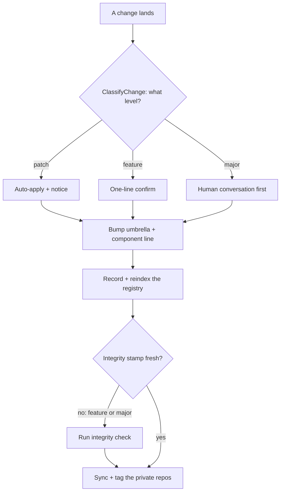

# Ledger — the LifeOS Change-Tracking System

> **Private component — the tooling described here is NOT in the public release payload.** Ledger's tools and workflows live in the underscore-prefixed release-management skill, which is rsync-excluded from public releases. The concepts below describe how the principal's own install tracks change; a fresh public install ships the documentation but not the `_`-prefixed tooling, so the commands named here will not resolve there.

> **Ledger is the subsystem that knows what changed, when, at what version, verified how — for everything.** It classifies every change as Major, Feature, or Patch, bumps the OS umbrella and every touched component line, records the change in an append-only update registry, gates shipping on integrity, nags on drift, records every estate deploy, and surfaces the whole picture in Pulse. It is the versioning and change-record authority for the entire LifeOS estate.

**History:** named Ledger 2026-07-06 (1.0.0), demoted to an unnamed convention 2026-07-12, revived 2026-07-19 at 2.0.0. The demotion was right for the July-6 scope (a convention plus tools didn't earn a name); the revival is right for this one — versioning, registry, integrity, drift, doc freshness, and estate-wide deploy tracking are one subsystem you route to and reason about. The name is back because the scope grew into it.

The one-line test for what belongs to Ledger: **does it decide, record, or propagate a version — or record and gate a change?** If yes, it's Ledger.

**Design boundary (constitutive, not aspirational):** Ledger is the *record and the read surface*, never an orchestration layer. It adds no daemon and no required gate on unrelated flows. Deterministic per-domain tools do the work; hooks give them teeth; everything writes to one registry; Pulse reads it.

---

## The scheme — always three levels, Major.Feature.Patch

Every live version identifier in LifeOS is exactly three levels: **`Major.Feature.Patch`**. No two-level, no four. This binds the whole version surface — the OS version (`LIFEOS/VERSION`), the Algorithm (`LIFEOS/ALGORITHM/LATEST`), the system prompt, the ISA Format spec, Memory, every skill's `version:`, every hook's `@version`, every living doc's frontmatter `version:`, and any new component line. **This section is the standing rule's system home**, and Ledger is also what enforces it. It does not live in `OPERATIONAL_RULES.md`: that is a per-principal USER file, `@`-imported per install and shipped as a four-section stub with no Versioning section, so a system-wide rule placed there would not survive into any install. A principal may restate it there for their own tree; the source of truth is here. *(public PR #1672, @anikinsasha — who found the pointer dangling from two docs; a third, this one, turned up in the same sweep.)*

| Level | Meaning | Gate |
|-------|---------|------|
| **Major** | Breaking or structural change — a format-schema change, a removed contract, a restructured subsystem | Human conversation required before the bump |
| **Feature** | Additive capability — a new section, workflow, subsystem | One-line confirm at ship time |
| **Patch** | Fix, doc, or no-behavior-change edit | Auto-applies with a visible notice |

The middle number is **Feature**, not "minor." `ClassifyChange.ts` emits `patch | feature | major`; Ledger names the scheme around it.

**Scope:** the rule governs every *live* marker and all *new* bumps. Dated changelog entries recording a past state stay as recorded — back-filling history is revisionism, not versioning.

---

## Umbrella + component model

Two granularities of the same fact:

- **The OS umbrella** — `LIFEOS/VERSION`. The single rolled-up number for the whole system; every substantive change rolls into it.
- **Component lines** — independently versioned subsystems that move at their own pace and roll up: the **Algorithm** (`LATEST` → `v{X.Y.Z}.md` + hand-authored `changelog.md`), the **system prompt** (frontmatter `version:`), the **ISA Format** spec, **Memory**, each **skill** (`version:`), each **hook** (`@version`), and — since 2026-07-12 — **every living doc** (frontmatter `version:`, scope authority `DocVersionScope`, seeded from real git lineage by `SeedDocVersions.ts`, bumped deterministically by `BumpDocVersions.ts`).

A single skill edit bumps both the skill's line and the umbrella: component and umbrella are different granularities of one fact.

**Estate extension (2.0.0):** deployed projects (sites, apps, Arbol workers) join the version surface through the per-project convention below — each carries its own `VERSION` (or `package.json` version), recorded at every deploy.

---

## The components (the tools)

> **Note:** `_`-prefixed skill paths referenced below (e.g. `skills/_LIFEOS/`, `skills/_CLOUDFLARE/`) are **private skills, absent from the public release** — those paths do not exist on a public install. The Ledger's concepts and registry format are public; the tooling that drives them ships only in the private tree.

| Tool | Role |
|------|------|
| `skills/_LIFEOS/Tools/ClassifyChange.ts` | **Classify.** Diff since last tag → `patch \| feature \| major`; major always human-gated. |
| `skills/_LIFEOS/Tools/UpdateLifeosVersion.ts` | **Bump the umbrella** (`LIFEOS/VERSION`). |
| `skills/_LIFEOS/Tools/Bump{Algorithm,SystemPrompt,Hook,Skill,Doc}Versions.ts` | **Roll the touched component lines.** All run automatically inside `UpdateKaiRepo --bump`. The Algorithm bumper detects + syncs (never mints doctrine); the system-prompt bumper defaults patch (`--sp-level` elevates). |
| `LIFEOS/TOOLS/CreateUpdate.ts` | **Record.** Appends the change to the update registry (4–8-word real title enforced). |
| `skills/_LIFEOS/Tools/UpdateIndex.ts` | **Index.** Regenerates `index.json` + `CHANGELOG.md` from the registry files. |
| `skills/_LIFEOS/Tools/UpdateKaiRepo.ts` | **Sync + tag.** Verified two-repo private sync; `--bump` runs all bumpers and refuses feature/major without a fresh integrity stamp (`--skip-integrity` logged override). |
| `LIFEOS/TOOLS/LedgerDeployEvent.ts` | **Estate record.** Appends a deploy event (project, target, domain, git SHA, project version, ok/fail) to `deploys.jsonl` on every gated deploy. |
| `hooks/VersionDrift.hook.ts` | **Drift tooth.** UserPromptSubmit nag (`⏫ VERSION-DRIFT`) at ≥10 changed core files since last `v*` tag, or any drift on a tag older than 48h. |

Workflows that orchestrate them: `skills/_LIFEOS/Workflows/VersionBump.md` (`/vb` — the coordinator), `DocumentSession.md`, `DocumentationUpdate.md` (`/ud`), `IntegrityCheck.md` (`/ic`). The `rc` shortcut cuts a release candidate (integrity check → docs update → bump → cut).

---

## The records (what Ledger writes)

All under `LIFEOS/MEMORY/SYSTEMUPDATES/` (private, in the user-data repo via the MEMORY symlink):

- **`YYYY/MM/*.md`** — one file per system change, typed (`significance`, `change_type`, `purpose`, `expected_improvement`, `files_affected`), written by `CreateUpdate.ts`.
- **`CHANGELOG.md` + `index.json` + `INDEX.md`** — regenerated views over the files (`UpdateIndex.ts regenerate`; `validate` checks index↔files coherence).
- **`deploys.jsonl`** — append-only estate deploy events (2.0.0).

Component-local records stay component-local by design: the Algorithm's `changelog.md` (doctrine history + migration/rollback recipes) and each project's own git history are feeds, not duplicates.

---

## The flow

```
system change lands
  → ClassifyChange.ts                 # diff → {patch | feature | major}
  → (major? → human conversation first)
  → /ud Phase A                       # docs current (always)
  → /ic IntegrityCheck                # feature/major — writes the integrity stamp
  → UpdateLifeosVersion.ts            # bump the umbrella
  → Bump*Versions.ts                  # component lines (auto inside --bump)
  → CreateUpdate.ts + UpdateIndex.ts  # record + reindex
  → UpdateKaiRepo.ts --bump           # sync + tag (REFUSES feature/major without fresh integrity stamp)

estate deploy lands (any site/app/worker via the gated deploy path)
  → LedgerDeployEvent.ts record       # project, target, domain, SHA, version, ok
```

You don't have to remember any of it: `VersionDrift.hook.ts` nags when core drift accumulates unbumped, and `/vb` sequences docs + integrity by tier — the "in concert" wiring is code, not prose.

---

## Per-project versioning (the estate convention, 2.0.0)

Every deployed project (site, app, Arbol worker) SHOULD carry a version: a repo-root `VERSION` file (one line, `Major.Feature.Patch`) or a `package.json` `version`. `LedgerDeployEvent.ts` resolves it in that order at deploy time and records it with the git SHA.

- **Absence never blocks.** The SHA is always recorded; `version: null` is a nudge, not a gate. Seeding is incremental — add `VERSION` the next time each project ships.
- Bump levels follow the same Major.Feature.Patch semantics; the project owner (usually a `/vb`-style judgment at ship time) picks the level.
- Project ISAs remain the state-of-record for *what the project is*; Ledger records *what shipped when*.

---

## The read surface

- **Pulse Ledger page** — recent registry entries, estate deploy events, current versions (umbrella + component lines), drift status, last integrity stamp. One place to answer "what changed across everything this week."
- **`CHANGELOG.md`** — the generated flat history (735+ entries since 2025).
- **`UpdateSearch.ts`** — query the registry from the CLI.

---

## Operation vocabulary (never conflate these three)

Ledger governs the private-version side. Two later stages are release stages, deliberately separate and increasingly sensitive:

1. **UpdateKaiRepo** — private-repo sync + version-tag to the two private remotes. Everyday sensitivity. Ledger's terminal step.
2. **CreateShadowRelease** — "cut": stage + gates, no push. Moderate sensitivity.
3. **CreateRelease** — "publish" to the public repo. Extremely sensitive, explicit go-ahead only.

**"Cut" never means "publish." Private-sync ≠ cut ≠ publish.**

---

## What Ledger is NOT

- **Not the release/publish system.** It stamps, records, and syncs private; publishing is `CreateRelease`, a separate deliberate act.
- **Not an orchestrator or scheduler.** No daemon, no new required gates on unrelated flows; it records the changes that happen and gates only its own ship step.
- **Not a monitoring system.** Arbol Security (hourly scans) and Pulse status cards are *feeds* Ledger's read surface can join against, not parts of Ledger.

---

## Examples

### One change through the Ledger

A developer adds a new workflow to an existing skill. Watch the change earn its version.

1. **Classify.** `ClassifyChange.ts` diffs the tree since the last tag and calls it a **feature** — new capability, nothing broken. (A doc typo would come back `patch`; a removed contract would come back `major` and stop for a human conversation before any number moves.)
2. **Bump two numbers.** The skill's own `version:` line rolls, and so does the OS umbrella in `LIFEOS/VERSION`. They're not duplicates — they're the same fact at two zoom levels, the subsystem and the whole estate.
3. **Record.** `CreateUpdate.ts` writes one registry file with a real four-to-eight-word title; `UpdateIndex.ts` regenerates the flat changelog from the registry so the history stays derived, never hand-edited.
4. **Sync and tag — but only if clean.** The private sync-and-tag step refuses to tag a feature without a fresh integrity stamp, so the integrity check runs first. Then the private repos sync and the version tag lands.

The point is that no step is optional and none is remembered by hand: classify decides the level, the level decides the gate, and the gate decides what has to be true before a tag exists.

### Levels earn different gates, and drift gets caught

The three levels are not cosmetic — each buys a different amount of ceremony:

- **A patch** (a fixed link, a doc edit) auto-applies with a visible notice. No conversation.
- **A feature** (the new workflow above) takes a one-line confirm at ship time.
- **A major** (a changed format schema, a removed contract) stops cold and requires a human conversation *before* the bump.

And if a change never gets bumped at all, it isn't lost: once core files pile up unversioned since the last tag, `VersionDrift.hook.ts` nags on the next prompt — the reminder is wired into the harness, not left to discipline.



Classification is the fork the whole system turns on: it routes the change to its gate, and nothing reaches a tag until the record is written and — for anything above a patch — integrity is fresh.

---

## Cross-references

- Standing rule — this doc, § The scheme (a principal's `LIFEOS/USER/CONFIG/OPERATIONAL_RULES.md` may restate it, but that file ships as a stub and is not the source)
- Master architecture — `LIFEOS/DOCUMENTATION/LifeosSystemArchitecture.md` § Ledger
- Version-bump coordinator — `skills/_LIFEOS/Workflows/VersionBump.md` (`/vb`)
- Deploy gate — `skills/_CLOUDFLARE/Workflows/Deploy.md` (records the estate event)
- Registry — `LIFEOS/MEMORY/SYSTEMUPDATES/`
- Algorithm component changelog — `LIFEOS/ALGORITHM/changelog.md`
