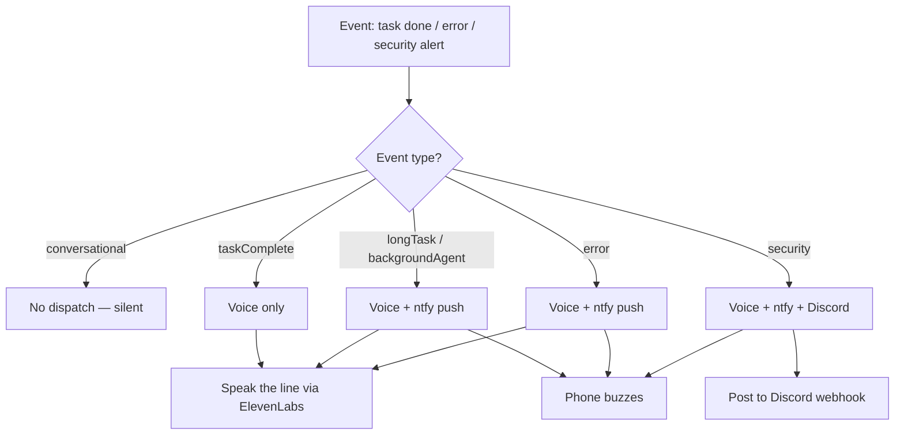

# The Notification System

> Voice is the Life OS speaking. Notifications close the loop's feedback edge: when the system advances the hill-climb (`LIFEOS/DOCUMENTATION/LifeOs/LifeOsThesis.md`), the principal hears it without having to look.

**Voice notifications for LifeOS workflows and task execution.**

> **Infrastructure:** The voice notification endpoint (`http://localhost:31337/notify`) is served by the unified Pulse daemon (`~/.claude/LIFEOS/PULSE/`). Voice is implemented at `~/.claude/LIFEOS/PULSE/VoiceServer/voice.ts` and routed through Pulse -- there is no separate VoiceServer process. One daemon, one port, one launchd plist (`com.lifeos.pulse`).

> **Pronunciation normalization:** Before any text reaches ElevenLabs it passes through two transforms — `applyPronunciations()` (literal term map from `LIFEOS/USER/PRINCIPAL/PRONUNCIATIONS.json`) wrapped around `disambiguateHomographs()` (`LIFEOS/PULSE/lib/homographs.ts`). The homograph stage exists because ElevenLabs guesses a reading from context and gets some words wrong; the worst offender is "live", where the broadcast/adjective sense (/laɪv/ — "the site is live", "live-verified") otherwise reads as the verb (/lɪv/ — "where you live"). It respells **only** context-matched broadcast occurrences to `lyve`, never a flat substitution, so verb uses ("live freely") stay correct. Adding a new spoken phrasing that reads wrong means adding a context regex, not a global replace. Applied by the VoiceServer (`voice.ts`) so every spoken notification reads identically.

This system provides:
- Voice feedback when workflows start
- Consistent user experience across all skills

---

## Task Start Announcements

**When STARTING a task, do BOTH:**

1. **Send voice notification**:
   ```bash
   curl -s -X POST http://localhost:31337/notify \
     -H "Content-Type: application/json" \
     -d '{"message": "[Doing what {PRINCIPAL.NAME} asked]"}' \
     > /dev/null 2>&1 &
   ```

2. **Output text notification**:
   ```
   [Doing what {PRINCIPAL.NAME} asked]...
   ```

**Skip curl for conversational responses** (greetings, acknowledgments, simple Q&A). The 🎯 COMPLETED line already drives voice output—adding curl creates redundant voice messages.

---

## Context-Aware Announcements

**Match your announcement to what {PRINCIPAL.NAME} asked.** Start with the appropriate gerund:

| {PRINCIPAL.NAME}'s Request | Announcement Style |
|------------------|-------------------|
| Question ("Where is...", "What does...") | "Checking...", "Looking up...", "Finding..." |
| Command ("Fix this", "Create that") | "Fixing...", "Creating...", "Updating..." |
| Investigation ("Why isn't...", "Debug this") | "Investigating...", "Debugging...", "Analyzing..." |
| Research ("Find out about...", "Look into...") | "Researching...", "Exploring...", "Looking into..." |

**Examples:**
- "Where's the config file?" → "Checking the project for config files..."
- "Fix this bug" → "Fixing the null pointer in auth handler..."
- "Why isn't the API responding?" → "Investigating the API connection..."
- "Create a new component" → "Creating the new component..."

---

## Workflow Invocation Notifications

**For skills with `Workflows/` directories, use "Executing..." format:**

```
Executing the **WorkflowName** workflow within the **SkillName** skill...
```

**Examples:**
- "Executing the **GIT** workflow within the **CORE** skill..."
- "Executing the **Publish** workflow within the **Blogging** skill..."

**NEVER announce fake workflows:**
- "Executing the file organization workflow..." - NO SUCH WORKFLOW EXISTS
- If it's not listed in a skill's Workflow Routing, DON'T use "Executing" format
- For non-workflow tasks, use context-appropriate gerund

### The curl Pattern (Workflow-Based Skills Only)

When executing an actual workflow file from a `Workflows/` directory:

```bash
curl -s -X POST http://localhost:31337/notify \
  -H "Content-Type: application/json" \
  -d '{"message": "Running the WORKFLOWNAME workflow in the SKILLNAME skill to ACTION", "voice_id": "{DA_IDENTITY.VOICEID}", "title": "{DA_IDENTITY.NAME}"}' \
  > /dev/null 2>&1 &
```

**Parameters:**
- `message` - The spoken text (workflow and skill name)
- `voice_id` - ElevenLabs voice ID (default: {DA_IDENTITY.NAME}'s voice)
- `title` - Display name for the notification
- `phase` (optional, 2026-04-16+) - Uppercase Algorithm phase (`OBSERVE`, `THINK`, `PLAN`, `BUILD`, `EXECUTE`, `VERIFY`, `LEARN`, `COMPLETE`). When present, triggers dual-source phase tracking — the endpoint (a) appends a `phaseHistory` entry with `source: "voice"`, (b) updates top-level `session.phase` (lowercase), and (c) calls `setPhaseTab(phase, sessionUUID)` to update the terminal tab icon/color. All three fire together so the UI never goes stale between ISA edits.
- `slug` (optional, 2026-04-16+) - The ISA session slug. Used to route the phase write to the correct session. When absent, falls back to most-recently-updated non-complete session within 2-hour window.

**Dual-source phase tracking:** `/notify` is the first-fires/always-fires signal for Algorithm phase transitions. ISASync hook is the rich-but-sometimes-skipped signal from ISA frontmatter edits. Both feed `phaseHistory` via `hooks/lib/isa-utils.ts::appendPhase()` — same phase + different source = upgrade to `source: "merged"`. **Both also write top-level `session.phase` and call `setPhaseTab()`** (voice did this starting 2026-04-18; ISASync already did). See `LIFEOS/MEMORY/KNOWLEDGE/Ideas/dual-source-event-tracking-pattern.md` and `feedback_voice_must_update_top_level_phase.md`.

---

## Voice Notifications During Work

**Workflow voice announcements are inline curls** — skills and workflows POST `curl -s -X POST http://localhost:31337/notify` at their own notable moments (skill invocation, long-run milestones). The per-phase announcement table keyed to effort tiers was retired with the modes/tiers system on 2026-07-11; how much a run narrates is discovered from the work, not read off a tier.

**Task completion voice** is handled by `VoiceCompletion.hook.ts` → `handlers/VoiceNotification.ts`, which extracts the `🗣️` line from the response and POSTs to the Pulse `/notify` endpoint at `http://localhost:31337`.

---

## Voice IDs

| Agent | Voice ID | Notes |
|-------|----------|-------|
| **{DA_IDENTITY.NAME}** (default) | `{DA_IDENTITY.VOICEID}` | Use for most workflows |

**The DA is the only speaker.** Subagents never emit voice — the DA narrates every completion, so there is no per-subagent voice routing to configure. The `voiceId:`/`voice:` frontmatter in `agents/*.md` has **no consumer in code** (verified 2026-07-27: nothing under `hooks/`, `LIFEOS/TOOLS/`, or `LIFEOS/PULSE/` parses agent frontmatter for voice); it is persona flavor, not configuration, and two agents currently share one ID without consequence.

**Authoritative voice config:** `~/.claude/settings.json` → `daidentity.voices.main.voiceId`. The former "Priya (Artist)" row was removed 2026-07-27 — that agent does not exist.

---

## Copy-Paste Templates

### Template A: Skills WITH Workflows

For skills that have a `Workflows/` directory:

```markdown
## Voice Notification

**When executing a workflow, do BOTH:**

1. **Send voice notification**:
   ```bash
   curl -s -X POST http://localhost:31337/notify \
     -H "Content-Type: application/json" \
     -d '{"message": "Running the WORKFLOWNAME workflow in the SKILLNAME skill to ACTION"}' \
     > /dev/null 2>&1 &
   ```

2. **Output text notification**:
   ```
   Running the **WorkflowName** workflow in the **SkillName** skill to ACTION...
   ```
```

Replace `WORKFLOWNAME`, `SKILLNAME`, and `ACTION` with actual values when executing. ACTION should be under 6 words describing what the workflow does.

### Template B: Skills WITHOUT Workflows

For skills that handle requests directly (no `Workflows/` directory), **do NOT include a Voice Notification section**. These skills just describe what they're doing naturally in their responses.

If you need to indicate this explicitly:

```markdown
## Task Handling

This skill handles requests directly without workflows. When executing, simply describe what you're doing:
- "Let me [action]..."
- "I'll [action]..."
```

---

## Why Direct curl (Not Shell Script)

Direct curl is:
- **More reliable** - No script execution dependencies
- **Faster** - No shell script overhead
- **Visible** - The command is explicit in the skill file
- **Debuggable** - Easy to test in isolation

The backgrounded `&` and redirected output (`> /dev/null 2>&1`) ensure the curl doesn't block workflow execution.

---

## When to Skip Notifications

**Always skip notifications when:**
- **Conversational responses** - Greetings, acknowledgments, simple Q&A
- **Skill has no workflows** - The skill has no `Workflows/` directory
- **Direct skill handling** - SKILL.md handles request without invoking a workflow file
- **Quick utility operations** - Simple file reads, status checks
- **Sub-workflows** - When a workflow calls another workflow (avoid double notification)

**The rule:** Only notify when actually loading and following a `.md` file from a `Workflows/` directory, or when starting significant task work.

---

## External Notifications (Push, Discord)

**Beyond voice notifications, LifeOS supports external notification channels:**

### Available Channels

| Channel | Service | Purpose | Configuration |
|---------|---------|---------|---------------|
| **ntfy** | ntfy.sh | Mobile push notifications | `settings.json → notifications.ntfy` |
| **Discord** | Webhook | Team/server notifications | `settings.json → notifications.discord` |
| **Desktop** | macOS native | Local desktop alerts | Always available |

### Smart Routing

Notifications are automatically routed based on event type:

| Event | Default Channels | Trigger |
|-------|------------------|---------|
| `taskComplete` | Voice only | Normal task completion |
| `longTask` | Voice + ntfy | Task duration > 5 minutes |
| `backgroundAgent` | ntfy | Background agent completes |
| `error` | Voice + ntfy | Error in response |
| `security` | Voice + ntfy + Discord | Security alert |

### Configuration

Located in `~/.claude/settings.json`:

```json
{
  "notifications": {
    "ntfy": {
      "enabled": true,
      "topic": "pai-[random-topic]",
      "server": "ntfy.sh"
    },
    "discord": {
      "enabled": false,
      "webhook": "https://discord.com/api/webhooks/..."
    },
    "thresholds": {
      "longTaskMinutes": 5
    },
    "routing": {
      "taskComplete": [],
      "longTask": ["ntfy"],
      "backgroundAgent": ["ntfy"],
      "error": ["ntfy"],
      "security": ["ntfy", "discord"]
    }
  }
}
```

### ntfy.sh Setup

1. **Generate topic**: `echo "pai-$(openssl rand -hex 8)"` _(topic is effectively a shared secret — anyone who knows it can read your notifications, so keep it unpredictable)_
2. **Install app**: iOS App Store or Android Play Store → "ntfy"
3. **Subscribe**: Add your topic in the app
4. **Test**: `curl -d "Test" ntfy.sh/your-topic`

Topic name acts as password - use random string for security.

### Discord Setup

1. Create webhook in your Discord server
2. Add webhook URL to `settings.json`
3. Set `discord.enabled: true`

### SMS (Not Recommended)

**SMS is impractical for personal notifications.** US carriers require A2P 10DLC campaign registration since Dec 2024, which involves:
- Brand registration + verification (weeks)
- Campaign approval + monthly fees
- Carrier bureaucracy for each number

**Alternatives researched (Jan 2025):**

| Option | Status | Notes |
|--------|--------|-------|
| **ntfy.sh** | ✅ RECOMMENDED | Same result (phone alert), zero hassle |
| **Textbelt** | ❌ Blocked | Free tier disabled for US due to abuse |
| **AppleScript + Messages.app** | ⚠️ Requires permissions | Works if you grant automation access |
| **Twilio Toll-Free** | ⚠️ Simpler | 5-14 day verification (vs 3-5 weeks for 10DLC) |
| **Email-to-SMS** | ⚠️ Carrier-dependent | `number@vtext.com` (Verizon), `@txt.att.net` (AT&T) |

**Bottom line:** ntfy.sh already alerts your phone. SMS adds carrier bureaucracy for the same outcome.

### Implementation

The notification service is in `~/.claude/hooks/lib/notifications.ts`:

```typescript
import { notify, notifyTaskComplete, notifyBackgroundAgent, notifyError } from './lib/notifications';

// Smart routing based on task duration
await notifyTaskComplete("Task completed successfully");

// Explicit background agent notification
await notifyBackgroundAgent("Researcher", "Found 5 relevant articles");

// Error notification
await notifyError("Database connection failed");

// Direct channel access
await sendPush("Message", { title: "Title", priority: "high" });
await sendDiscord("Message", { title: "Title", color: 0x00ff00 });
```

---

## Event Log Channel (events.jsonl)


Events are emitted directly from each hook via `fs.appendFileSync` to `~/.claude/LIFEOS/MEMORY/OBSERVABILITY/*.jsonl` — synchronous, fire-and-forget, no shared transport library. This channel is additive — it does not replace any of the notification channels above, and hooks emit events alongside their existing state writes and notifications.

---

### Design Principles

1. **Fire and forget** - Notifications never block hook execution
2. **Fail gracefully** - Missing services don't cause errors
3. **Conservative defaults** - Avoid notification fatigue
4. **Duration-aware** - Only push for long-running tasks (>5 min)

---

## Examples

### One task finishing, two very different outcomes

A run wraps up. What the principal experiences depends entirely on what the run *was*:

- **A quick question** — "what's this env var for?" The assistant answers in a sentence. No `curl` fires; the `🗣️` line in the response is the only voice, spoken once. The phone stays quiet. Adding a start-of-task `curl` here would just double the voice for a two-second answer.
- **A twelve-minute background job** — a research agent the principal kicked off and walked away from. When it lands, the same "done" signal routes differently: it crossed the long-task threshold *and* it was a background agent, so it goes out on voice **and** ntfy — the phone buzzes even though nobody is at the desk.

Same "task done" moment; the routing table decides who hears about it and how.

### When to speak, when to stay silent

The system is tuned against notification fatigue, so most events resolve to nothing:

- **Speak:** a workflow starts significant work, a long task finishes, an error surfaces, a security alert fires.
- **Stay silent:** greetings, acknowledgments, simple Q&A, a workflow calling a sub-workflow (one notification, not two).

The rule is narrow on purpose — notify when real work begins or ends, not on every turn.

### How an event reaches a channel



Every notification is fire-and-forget — a channel being offline never blocks the run. The routing is conservative by default: the further right you travel on the diagram, the rarer and more urgent the event.

---
