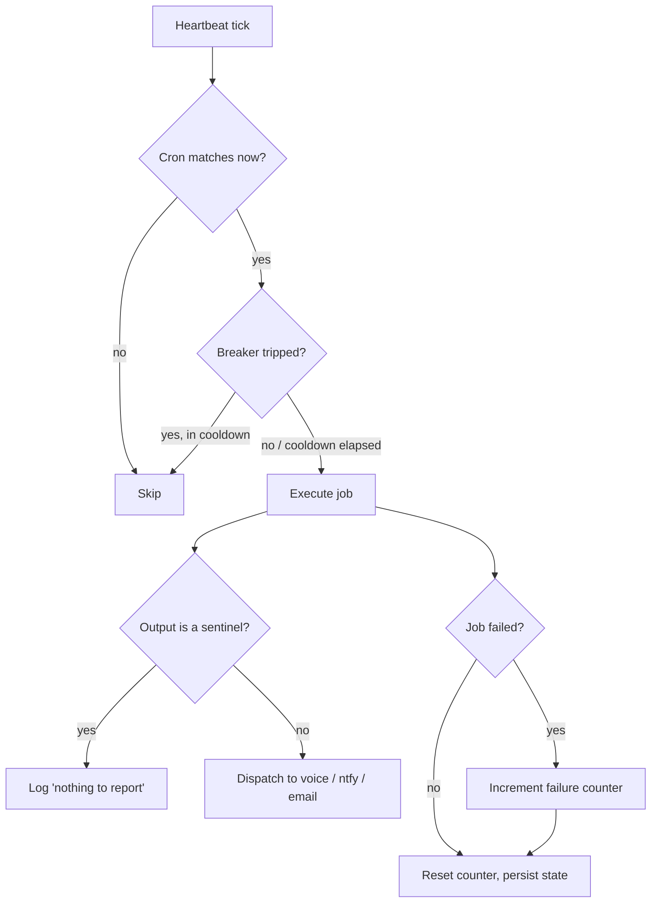

# Pulse — the Life Dashboard

**Pulse is the Life Dashboard.** It is the visible surface of the LifeOS Life Operating System — the place where you (and your DA) see and interact with everything the OS is doing. LifeOS is the OS; Pulse is how you watch it run.

Every Pulse module is a sub-surface of the Dashboard: real-time observability, voice notifications, chat surfaces (iMessage, Siri bridge), scheduled work, background worker state, DA heartbeat, and — as the dashboard grows — live views of current state vs ideal state, goal progress, workflows, and day-in-the-life preview. A LifeOS with no dashboard would still be a LifeOS; Pulse is what keeps it visible.

**Canonical thesis:** `LIFEOS/DOCUMENTATION/LifeOs/LifeOsThesis.md` — the source of truth for what LifeOS is, what the DA is, and why Pulse exists.

**Implementation:** The unified daemon of LifeOS — a single always-on process that handles cron jobs, voice notifications, hook validation, observability APIs + dashboard, iMessage chat, the Siri bridge, and GitHub work polling. Pulse is THE local runtime for all LifeOS services. At v2.0 it absorbed VoiceServer, TelegramBot, the iMessage bot, and the Observability server into crash-isolated modules running under one process, one port (31337), and one launchd plist (`com.lifeos.pulse`) — the Telegram module has since been removed (2026-07-15).

**Version:** 2.0 (2026-04-01)
**Location:** `~/.claude/LIFEOS/PULSE/`

---

## Subsystems

Each subsystem runs in its own crash-isolated loop within the single Pulse process. If one module crashes (e.g., iMessage loses its database handle), all other modules continue running uninterrupted.

**Core loops** (not in `modules/`):

| Subsystem | Description | Source |
|--------|-------------|--------|
| **Cron** | Scheduled jobs -- the original heartbeat loop | `pulse.ts` |
| **Voice** | ElevenLabs TTS notifications | `VoiceServer/voice.ts` |
| **Observability** | Data APIs + Observatory dashboard + security management APIs (absorbed from observability-server.ts) | `Observability/observability.ts` |
| **Worker** | GitHub Issues work polling for LifeOS Workers (optional) | `checks/github-work.ts` |
| **Assistant** 🔒 | Digital Assistant identity, heartbeat, scheduling, growth. **Private — the whole `LIFEOS/PULSE/Assistant/` tree is excluded from the public release** (`ShadowRelease.ts` staging exclude); the DA *concept* ships via `DOCUMENTATION/Pulse/DaSubsystem.md`, the implementation does not. | `Assistant/module.ts` |

**Modules** (`LIFEOS/PULSE/modules/` — 31 `.ts` files; every one ships in the public release):

| Module | Description | Source |
|--------|-------------|--------|
| **Algorithm** | The thinking-chain surface (2026-07-14). Serves `GET /api/algorithm-tab` (version, chain catalog, claims/teeth counts parsed live from the doctrine, version history, cached AI summary with content-hash staleness), `GET/POST /api/algorithm-tab/file` (whitelisted chain files — view all, in-place edit for the editable set with freshness-frontmatter bump + git commit in the file's real repo, mtime-conflict 409), `POST /api/algorithm-tab/doctrine` (the REAL versioned workflow: new frozen `v{next}.md` with H1 bumped, changelog entry prepended, `LATEST` updated, one commit — existing v-files immutable by construction), and `POST /api/algorithm-tab/summary/regenerate` (async — shells `Inference.ts --level high` over the chain, caches to `MEMORY/STATE/algorithm-tab-summary.json`; 202 + `generating` flag because Bun.serve's 10s idleTimeout kills long synchronous responses). Rendered by the `/algorithm` page (System nav): AI summary + loop visual + chain map, doctrine editor with version history, rules viewer/editor. File access is a fixed server-side whitelist keyed by id — client paths never accepted; git via arg-array spawn only. | `modules/algorithm-tab.ts` |
| **Assets** | Read-only unified inventory surface over the existing asset stores. Holds zero data — parses the source files on every request. | `modules/assets.ts` |
| **Atlas** | Read-only surface over the Atlas asset graph (current state of everything owned). Powers the `/atlas` tab. | `modules/atlas.ts` |
| **Books** | Read-only surface over `USER/BOOKS.md`. Parses the USER file per request. | `modules/books.ts` |
| **Bunker** | Feeds the `/bunker` tab. Shells out to the Bunker CLI (`LIFEOS/PULSE/Bunker`), which is the source of truth. | `modules/bunker.ts` |
| **Conduit** | Read-only dashboard over Conduit's daily records. Reads only from `USER/CONDUIT` — capture itself is the launchd job. | `modules/conduit.ts` |
| **Content** | Feeds the CONTENT tab (Conveyor board) from the content ledger at `MEMORY/STATE/content-pipeline/events.jsonl`. | `modules/content.ts` |
| **Doctor** | Read-only System Health surface (2026-07-12, #1461). Serves `GET /api/doctor` → `{ manifest, heartbeat, reconcile }` from the advisory caches written by `LIFEOS/TOOLS/Doctor.ts`; shells `Doctor.ts --reconcile` (30s cache). Holds zero truth of its own. Rendered by `SystemHealthPanel.tsx` on the **System → Hooks** page: capability states + fix commands, doctor heartbeat age (red past 7 days — a dead checker must be loud), and hook reconciliation. Diagnostic register, no scores. | `modules/doctor.ts` |
| **Evals** | Surfaces standing eval-suite status — reads `MEMORY/STATE/Evals-Results/<suite>/latest.json` (written by EvalRunner / ConfigEvalOnChange) and returns each suite's headline pass^k and mean score. | `modules/evals.ts` |
| **Example** | Copy-and-rename template for writing your own Pulse module. Ships as documentation-by-example, not a live surface. | `modules/example-module.ts` |
| **Hooks** | Skill-guard and agent-guard validation — the two Pulse HTTP hook routes (`/hooks/skill-guard`, `/hooks/agent-guard`). | `modules/hooks.ts` |
| **Hypotheses** | API for the proactive deriver review queue. Parses the hypothesis files the nightly `LearningPatternSynthesis.ts --hypothesize` run writes. | `modules/hypotheses.ts` |
| **iMessage** | SQLite polling bot with claude-agent-sdk sessions (absorbed from the iMessage bot, disabled by default). Owns the `IMESSAGE_DIRECTIVE` system-prompt override for the chat surface. | `modules/imessage.ts` |
| **Ledger** | Read-only surface over the change-tracking system (versions, update registry, deploy events). Composes from local files, each probe fail-soft. | `modules/ledger.ts` |
| **LocalIntelligence** | Read-only over the LocalIntelligence skill output — civic digest for the LOCAL tab. | `modules/local-intelligence.ts` |
| **Memory** | Exposes the autonomic-memory subsystem state — cadence, queue, and the live loop rendered into the dashboard. | `modules/memory.ts` |
| **MenuBar** | Single aggregated payload behind the rich Pulse menu bar. Serves one route. | `modules/menubar.ts` |
| **Projects** | Read-only surface over the project source files, grouped and served per request. Holds zero data. | `modules/projects.ts` |
| **Scheduled** | Unified view of every recurring job LifeOS runs, wherever it runs — reconciles what `Services.ts` knows with what is actually installed. | `modules/scheduled.ts` |
| **Siri** | Siri→DA voice turn endpoint. The iPhone leg is a stock Shortcuts shortcut. | `modules/siri.ts` |
| **Synapse** | Read-only surface over the Synapse input router (capture / grade / route). Composes live numbers from four independent fail-soft probes. | `modules/synapse.ts` |
| **Syslog** | UDP syslog listener for UniFi debug logs, bound to unprivileged port 5514. | `modules/syslog.ts` |
| **TabFreshness** | Universal per-tab data-source freshness for the dashboard — every tab declares where its data comes from and how stale it is. | `modules/tab-freshness.ts` |
| **Telos** | Read-only consumer of the TelosFreshness library — TELOS staleness surfacing. | `modules/telos.ts` |
| **ThreatModel** | Read-only surface over the private risk register (likelihood × impact, owners, review cadence). | `modules/threatmodel.ts` |
| **Upgrades** | API for the unified system-improvement queue — one queue, five sources, one lifecycle. | `modules/upgrades.ts` |
| **Usage** | Read-only surface over Anthropic subscription + token/cost usage. | `modules/usage.ts` |
| **UserIndex** | LifeOS `USER/` indexer — walks the tree, parses frontmatter + body of every `.md`, emits typed JSON; `fs.watch` live refresh. Powers `/life`, `/health`, `/finances` and the Daemon publish feed. | `modules/user-index.ts` |
| **Wiki** | Backend API for the Documentation, Knowledge, Skills, and Hooks browsers. | `modules/wiki.ts` |
| **Work** | Agent-visible Kanban over GitHub Issues, backed by the private repo at `WORK.REPO` in `USER/WORK/config.yaml`. | `modules/work.ts` |
| *(test)* | Neutral fixture for the Projects module — no principal-identifying tokens. | `modules/projects.test.ts` |

---

## Architecture

Pulse is a single Bun process managed by launchd on port 31337. On startup, it initializes all enabled subsystem modules (voice, hooks, observability, imessage, siri), starts the HTTP server, launches the menu bar app, then enters the cron heartbeat loop. It reads job definitions from `PULSE.toml`, evaluates cron schedules, executes due jobs (either shell scripts or Claude CLI invocations), and routes output through internal dispatch (voice is now an in-process function call, not a separate HTTP request). There is no queue, no AI triage layer, no channel abstraction -- just run jobs and route output.

```
launchd (com.lifeos.pulse)
    |
    v
pulse.ts  (heartbeat loop)
    |
    +-- loadConfig() <-- PULSE.toml
    |
    +-- readState()  <-- state/state.json
    |
    +-- for each enabled job:
    |       |
    |       +-- isDue(schedule, now, lastRun)?
    |       |       |
    |       |       no --> skip
    |       |       |
    |       |       yes
    |       |       v
    |       +-- circuit breaker (3 consecutive failures --> skip; 6h retry cooldown)
    |       |
    |       +-- execute:
    |       |       script --> spawnScript(command)
    |       |       claude --> spawnClaude(prompt, model)
    |       |
    |       +-- isSentinel(output)?
    |       |       yes --> log "nothing to report", no dispatch
    |       |       no  --> dispatch(output, target)
    |       |
    |       +-- writeState() (atomic, after each job)
    |
    +-- smart sleep (next due time, capped at 60s)
    |
    +-- loop
```

---

## How It Works

### The Heartbeat Loop

Pulse runs an infinite loop. Each tick:

1. **Iterate** over every enabled job in `PULSE.toml`.
2. **Evaluate** each job's cron schedule against the current time.
3. **Check** the circuit breaker (skip if 3+ consecutive failures, unless the 6h retry cooldown has elapsed).
4. **Execute** the job (script or claude).
5. **Inspect** the output for sentinel values.
6. **Dispatch** non-sentinel output to the configured channel.
7. **Persist** state to disk after each job (atomic write).
8. **Sleep** until the next job is due, capped at 60 seconds for SIGTERM responsiveness.

### Job Evaluation

A job runs when two conditions are met:

- **Cron match:** The 5-field cron expression matches the current minute, hour, day, month, and weekday.
- **Dedup guard:** The job has not already run in the current minute (prevents double-execution within the same cron window).

The cron parser supports standard syntax: `*`, ranges (`1-5`), steps (`*/5`), lists (`1,3,5`), and combinations (`0-30/10`).

### Smart Sleep

After processing all jobs, Pulse computes how many milliseconds until the next job is due by scanning the next 60 minutes of cron windows. It sleeps for that duration, capped at 60 seconds (so SIGTERM is handled promptly). Minimum sleep is 1 second to avoid busy-looping.

---

## PULSE.toml Format

All jobs are defined in a single TOML file. Each job is a `[[job]]` table array entry.

### Fields

| Field | Type | Required | Default | Description |
|-------|------|----------|---------|-------------|
| `name` | string | yes | -- | Unique job identifier |
| `schedule` | string | yes | -- | 5-field cron expression |
| `type` | `"script"` or `"claude"` | no | `"script"` | Execution method |
| `command` | string | for script | -- | Shell command to run (supports `${ENV_VAR}` expansion) |
| `prompt` | string | for claude | -- | Prompt text sent to Claude CLI |
| `model` | string | no | `"sonnet"` | Claude model for claude-type jobs |
| `output` | `"voice"` / `"ntfy"` / `"email"` / `"log"` | no | `"log"` | Dispatch target for non-sentinel output |
| `enabled` | boolean | no | `true` | Whether the job runs |

### Module Configuration Sections

In addition to `[[job]]` entries, `PULSE.toml` contains configuration sections for each subsystem module:

| Section | Purpose | Key Fields |
|---------|---------|------------|
| `[voice]` | ElevenLabs TTS | `enabled`, `voice_id`, `default_voice_enabled` |
| `[imessage]` | iMessage bot | `enabled` (default `false`), `poll_interval_ms` |
| `[observability]` | Observatory dashboard + data/security APIs | `enabled`, `dashboard_path` (symlink to Observability/out) |
| `[hooks]` | Hook validation | `enabled`, `skill_guard`, `agent_guard` |

### Example

```toml
[voice]
enabled = true
voice_id = "<YOUR_ELEVENLABS_VOICE_ID>"

[imessage]
enabled = false

[observability]
enabled = true

[hooks]
enabled = true

[[job]]
name = "calendar-reminder"
schedule = "*/10 * * * *"
type = "script"
command = "bun run checks/calendar.ts"
output = "voice"
enabled = true

[[job]]
name = "morning-brief"
schedule = "0 7 * * *"
type = "claude"
prompt = "Prepare a morning brief: today's calendar events..."
model = "sonnet"
output = "voice"
enabled = true
```

---

## Job Types

### Script Jobs (`type = "script"`)

Run a shell command via `bash -c`. The working directory is `~/.claude/Pulse/`. Environment variables from `~/.claude/.env` are available. The process has a 60-second timeout, enforced by `collectProc()` (public issue #1546): SIGTERM at expiry, SIGKILL 10s later, and a rejecting deadline 10s after that which drains stdout/stderr under `Promise.race` — a grandchild holding the pipe or a SIGTERM-immune child can no longer freeze the sequential cron loop.

Cost: $0. All computation is local or uses free APIs.

Script jobs are the default and should be preferred. Most checks follow a pattern: call an API, parse the response, output a notification string or a sentinel.

### Claude Jobs (`type = "claude"`)

Spawn `claude` headless via the `LIFEOS/TOOLS/Inference.ts` flag pattern (`--print --model X --tools '' --output-format text --setting-sources '' --system-prompt ''`) with `ANTHROPIC_API_KEY` and `ANTHROPIC_AUTH_TOKEN` deleted from the subprocess env so OAuth/keychain billing applies. The prompt is piped via stdin. Output format is plain text. The process has a 5-minute timeout with the same `collectProc()` deadline-race semantics as script jobs (public issue #1546). **NEVER use `claude --bare`** — the `--bare` flag forces `ANTHROPIC_API_KEY` auth and bypasses OAuth/keychain (per the constitutional rule in `LIFEOS_SYSTEM_PROMPT.md` "Operational Rules" — a real billing incident drove this rule).

Cost: Token-dependent. A Haiku job costs fractions of a cent. A Sonnet job processing a morning brief costs roughly $0.01-0.03.

Claude jobs are for tasks that require reasoning: urgency assessment, summarization, pattern detection. Use them sparingly -- most checks should be script jobs with optional AI triage as a second layer.

---

## Output Routing

When a job produces output, it is dispatched to one of four targets:

| Target | Destination | Max Length | Notes |
|--------|-------------|------------|-------|
| `voice` | Internal voice module (`http://localhost:31337/notify`) | 500 chars | Spoken aloud via ElevenLabs; same process, internal function call |
| `ntfy` | ntfy.sh push notification | 4096 chars | Requires `NTFY_TOPIC` in `.env` |
| `email` | Email notification | 4096 chars | Sent as email to the principal |
| `log` | stdout (already logged by main loop) | unlimited | Default; no external dispatch |

All dispatch calls have a 10-second timeout and fail gracefully -- a dispatch failure does not mark the job as failed.

---

## Sentinel Pattern

Checks often find nothing to report. Rather than dispatching empty or low-value notifications, check scripts output a **sentinel value** to suppress dispatch entirely.

Recognized sentinels:

| Sentinel | Typical Use |
|----------|-------------|
| `NO_ACTION` | GitHub: no new PRs or activity |
| `NO_URGENT` | Email: no urgent messages |
| `NO_EVENTS` | Calendar: no upcoming meetings |
| `HEARTBEAT_OK` | Generic: system is healthy, nothing to report (legacy sentinel, still recognized) |

An empty string also suppresses dispatch.

When the main loop detects a sentinel, it logs "nothing to report" and skips the dispatch call. The job is still recorded as successful in state.

Check scripts should always output a sentinel on their "nothing to report" path rather than exiting silently. This makes the protocol explicit and debuggable.

---

## Circuit Breaker

If a job fails 3 consecutive times, Pulse stops running it and logs a warning on each tick:

```
Skipping email-triage: 3 consecutive failures
```

A tripped breaker is not permanent (changed 2026-07-15 — it previously latched until manual state surgery): once 6 hours have passed since the job's last run, Pulse allows one retry (`Retrying <job> after failure cooldown`). Success resets the counter to 0; another failure re-latches for the next cooldown window.

To recover immediately instead of waiting for the cooldown:

1. Fix the underlying issue.
2. Either restart Pulse (`manage.sh restart`) or manually edit `state/state.json` to reset `consecutiveFailures` to 0.

The knobs are hardcoded in `pulse.ts`: `MAX_FAILURES = 3`, `FAILURE_RETRY_COOLDOWN_MS = 6h`. The `/healthz` degraded-reason list counts only ENABLED jobs — a disabled job's stale failure counter no longer pins health at degraded. The missing-script preflight resolves `~/` the same way the bash executor does, so `~/`-prefixed job commands are checked correctly.

---

## State Management

### state.json

Located at `~/.claude/Pulse/state/state.json`. Written atomically (write to `.tmp`, rename) after each job execution.

```json
{
  "version": 1,
  "startedAt": 1743451200000,
  "jobs": {
    "email-triage": {
      "lastRun": 1743451500000,
      "lastResult": "ok",
      "consecutiveFailures": 0
    },
    "healthcheck": {
      "lastRun": 1743451500000,
      "lastResult": "error",
      "consecutiveFailures": 2
    }
  }
}
```

Fields per job:

| Field | Description |
|-------|-------------|
| `lastRun` | Unix timestamp (ms) of last execution |
| `lastResult` | `"ok"` or `"error"` |
| `consecutiveFailures` | Counter; resets on success, increments on failure |

If `state.json` is missing or corrupt, Pulse starts with an empty state. All jobs will be considered overdue and run on the first tick.

### Auxiliary State Files

Individual check scripts may maintain their own state files in `state/`:

| File | Used By | Purpose |
|------|---------|---------|
| `email-seen.json` | `checks/email.ts` | Dedup list of seen email IDs (max 200) |
| `github-seen.json` | `checks/github.ts` | Dedup list of seen PR keys (max 500) |
| `pulse.pid` | `pulse.ts` | Current process ID |

---

## Process Lifecycle

### Service Integration (launchd / systemd)

Pulse ships a supervisor unit for both supported platforms. On macOS it is managed by launchd via `com.lifeos.pulse.plist`; on Linux by systemd via `com.lifeos.pulse.service` (installed as a user unit — `systemctl --user enable --now com.lifeos.pulse`). Both files live in `LIFEOS/PULSE/` and both ship in the public release.

| Property | launchd (`.plist`) | systemd (`.service`) | Effect |
|----------|--------------------|----------------------|--------|
| Start on login | `RunAtLoad = true` | `WantedBy=default.target` | Starts with the user session |
| Restart on crash | `KeepAlive = true` | `Restart=on-failure` | Auto-restarts the daemon |
| Restart throttle | `ThrottleInterval = 30` | `RestartSec=30` | Minimum 30 seconds between restart attempts |
| Working directory | `WorkingDirectory` | `WorkingDirectory=` | `~/.claude/LIFEOS/PULSE` |

The systemd unit is templated — `__BUN_PATH__` and `__HOME__` are substituted at install time.

Logs go to `LIFEOS/PULSE/logs/pulse-stdout.log` and `pulse-stderr.log` under both supervisors.

### Startup

1. launchd spawns `bun run pulse.ts`.
2. Pulse writes its PID to `state/pulse.pid`.
3. Loads `PULSE.toml` and `state/state.json`.
4. Initializes all enabled subsystem modules (voice, hooks, observability, imessage, siri).
5. Starts the HTTP server on port 31337.
6. Launches the menu bar app (`LifeOS Pulse.app`) automatically.
7. Logs enabled job/module count and names.
8. Enters the cron heartbeat loop.

### Shutdown

Pulse registers handlers for `SIGTERM` and `SIGINT`. On signal:

1. Sets `shuttingDown = true`.
2. The current tick completes (no new jobs start).
3. Final state is persisted to disk.
4. Process exits cleanly.

### Crash Recovery

If Pulse crashes, launchd restarts it within 30 seconds (ThrottleInterval). On restart, state is loaded from disk -- jobs that were overdue during the downtime will run on the first tick. No data is lost because state is written after each job, not at shutdown.

---

## Adding and Modifying Jobs

### Adding a New Script Job

1. Create the check script in `checks/`:

```typescript
#!/usr/bin/env bun
// checks/my-check.ts

async function main() {
  // Do your check
  const result = await someCheck()

  if (!result) {
    console.log("NO_ACTION")
    return
  }

  // Output a human-readable notification
  console.log("Something happened that needs attention")
}

main().catch((err) => {
  console.error(`my-check error: ${err}`)
  console.log("NO_ACTION")
})
```

2. Add the job to `PULSE.toml`:

```toml
[[job]]
name = "my-check"
schedule = "*/15 * * * *"
type = "script"
command = "bun run checks/my-check.ts"
output = "ntfy"
enabled = true
```

3. Restart Pulse: `~/.claude/Pulse/manage.sh restart`

### Modifying an Existing Job

Edit `PULSE.toml` and restart Pulse. The state for renamed jobs will not carry over -- the old job's state remains in `state.json` as dead weight (harmless) and the new job starts fresh.

### Disabling a Job

Set `enabled = false` in `PULSE.toml` and restart. The job's state is preserved in case it is re-enabled.

---

## Check Scripts

### email.ts -- Email Triage

**Schedule:** Every 5 minutes
**Output:** voice
**Cost:** $0 when no new emails; ~$0.001 per triage (Haiku)

Two-layer design:
1. **Layer 1 (free):** Fetches unread emails via the inbox skill's `Manage.ts` tool. Deduplicates against a seen list (`state/email-seen.json`, max 200 entries). If no new emails, outputs `NO_URGENT`.
2. **Layer 2 (cheap):** Sends new email subjects/senders to Haiku for urgency assessment. Only flags genuinely urgent items: security incidents, 24-hour deadlines, explicit ASAP requests, financial/medical alerts. Newsletters, meeting invites, and routine updates are not urgent.

### calendar.ts -- Calendar Reminders

**Schedule:** Every 10 minutes
**Output:** voice
**Cost:** $0

Fetches events from all Google Calendars within a 30-minute lookahead window via the Google Calendar API. Deduplicates by event ID across calendars. Formats up to 3 upcoming events as spoken notifications ("Team standup in 12 minutes. Design review in 25 minutes."). Outputs `NO_EVENTS` when the window is clear.

### github.ts -- GitHub PR Monitor

**Schedule:** Every 30 minutes
**Output:** ntfy
**Cost:** $0

Monitors open PRs across the repositories you configure. Deduplicates against a seen list (`state/github-seen.json`, max 500 entries). Reports new PRs with repo, number, title, and author. Outputs `NO_ACTION` when there is no new activity.

### health.ts -- Website Health Check

**Schedule:** Every 5 minutes
**Output:** ntfy
**Cost:** $0

Sends HTTP HEAD requests to the sites you configure with 10-second timeouts. Reports failures with status codes or error messages. Outputs `NO_ACTION` when all sites are healthy.

---

## Relationship to Claude Code /schedule

Claude Code has a built-in `/schedule` command that creates remote agents running on a cron schedule. These are **session-scoped triggers** -- they run as full Claude Code sessions in the cloud, have access to your codebase context, and are managed through Claude Code's interface.

Pulse is different:

| | Pulse | /schedule |
|---|---|---|
| **Runs** | Locally, always-on daemon | Remote, cloud-based |
| **Scope** | Lightweight checks, monitoring | Full Claude Code sessions |
| **Cost** | $0 for script jobs | Full session token cost |
| **Persistence** | Survives reboots (launchd) | Managed by Claude Code |
| **Use case** | Email, calendar, health checks | Complex recurring analysis |

There is no conflict. Pulse handles high-frequency, low-cost local monitoring. /schedule handles heavy, infrequent cloud work. They can coexist and even complement each other (e.g., Pulse detects an issue, /schedule runs deeper analysis).

---

## Relationship to Old Monitor

Pulse replaces LifeOS Monitor entirely. Monitor was a 3,283-line TypeScript system with:

- A channel-based pub/sub architecture
- An AI triage layer for routing decisions
- A queue system with priority scheduling
- Complex lifecycle management
- Multiple abstraction layers

It was built for a future that never arrived and had been dormant for months.

Pulse does the same useful work in ~1,050 lines across 9 files, with no abstractions beyond what the jobs require. The old Monitor directory should be considered archived.

Pulse also replaces the ScheduledTasks system, which used individual shell scripts and multiple launchd plists for each task. Pulse consolidates all scheduled work into a single daemon with a single plist and a single configuration file.

As of v2.0, Pulse also absorbed four previously standalone services into its module system: VoiceServer (ElevenLabs TTS, formerly port 8888), the Observability server (data APIs + Observatory dashboard), TelegramBot (grammY polling), and the iMessage bot (SQLite polling). Each runs as a crash-isolated module under the single Pulse process on port 31337. (The Telegram module has since been removed, 2026-07-15.)

---

## Cost Model

### Script Jobs: $0

Email, calendar, GitHub, and health checks use free APIs (Gmail, Google Calendar, GitHub REST, HTTP HEAD). The only cost is local compute (negligible).

The email check has an optional AI layer (Haiku urgency triage) that fires only when new emails arrive. Cost: ~$0.001 per invocation.

### Claude Jobs: Token Cost

| Job | Model | Schedule | Est. Cost/Run | Est. Cost/Day |
|-----|-------|----------|---------------|---------------|
| morning-brief | Sonnet | 1x daily (7 AM) | ~$0.02 | ~$0.02 |
| memory-consolidation | Sonnet | 1x daily (3 AM) | ~$0.03 | ~$0.03 |
| proactive-suggestions | Haiku | 3x daily (disabled) | ~$0.005 | ~$0.015 |

**Total estimated daily cost with current enabled jobs:** ~$0.05/day + negligible email triage costs.

With all jobs enabled including proactive-suggestions: ~$0.065/day.

---

## Troubleshooting

### Check Status

```bash
~/.claude/Pulse/manage.sh status
```

Shows PID, uptime, and per-job last run times with failure counts.

### View Logs

```bash
# Recent stdout (structured JSON)
tail -50 ~/.claude/Pulse/logs/pulse-stdout.log

# Recent errors
tail -50 ~/.claude/Pulse/logs/pulse-stderr.log

# Follow live
tail -f ~/.claude/Pulse/logs/pulse-stdout.log | bun -e "process.stdin.on('data', d => { try { const e = JSON.parse(d); console.log(e.ts, e.level, e.msg) } catch {} })"
```

### Common Issues

| Symptom | Cause | Fix |
|---------|-------|-----|
| "NOT RUNNING (no PID file)" | Pulse not started or crashed without recovery | `manage.sh install` |
| "DEAD (stale PID)" | Process died but launchd did not restart | `manage.sh restart` |
| Job stuck in circuit breaker | 3+ consecutive failures | Fix the check script; retries automatically after the 6h cooldown, or `manage.sh restart` to retry now |
| "ntfy dispatch skipped" | Missing env var | Set `NTFY_TOPIC` in `~/.claude/.env` |
| Voice notifications silent | Voice module not running or Pulse down | `manage.sh restart`; check `[voice] enabled = true` in PULSE.toml |
| Calendar returns NO_EVENTS always | Missing or expired refresh token | Set `GOOGLE_CALENDAR_REFRESH_TOKEN` in `~/.claude/.env` |
| State file corrupt | Interrupted write (unlikely, writes are atomic) | Delete `state/state.json` and restart |

### Manual Job Test

Run a check script directly to verify it works:

```bash
cd ~/.claude/Pulse
bun run checks/health.ts
bun run checks/calendar.ts
bun run checks/email.ts
bun run checks/github.ts
```

---

## File Inventory

```
~/.claude/Pulse/
├── pulse.ts                  # Main daemon -- startup, module init, heartbeat loop
├── PULSE.toml                # Job + module configuration
├── manage.sh                 # Process management -- start/stop/status/install
├── com.lifeos.pulse.plist    # launchd config (macOS) -- auto-start, keep-alive
├── com.lifeos.pulse.service  # systemd user unit (Linux) -- auto-start, restart-on-failure
├── lib/
│   ├── config.ts             # TOML loader, module config parsing
│   ├── cron.ts               # Cron expression parser and schedule evaluation
│   ├── dispatch.ts           # Output routing (voice, ntfy, email, log)
│   ├── state.ts              # Atomic state persistence
│   └── spawn.ts              # Script and Claude process spawning
├── modules/
│   ├── hooks.ts              # Skill-guard + agent-guard validation
│   ├── siri.ts               # Siri bridge chat surface
│   ├── wiki.ts               # Wiki/docs API — indexer, search, backlinks, graph
│   ├── user-index.ts         # LifeOS biography indexer (LIFEOS/USER tree)
│   ├── syslog.ts             # System log aggregation
│   └── imessage.ts           # SQLite polling bot + claude-agent-sdk sessions (disabled by default)
├── Assistant/
│   └── module.ts             # Digital Assistant identity, heartbeat, scheduling (private — DA-specific)
├── VoiceServer/
│   └── voice.ts              # ElevenLabs TTS notifications
├── Observability/
│   ├── observability.ts      # Data APIs + Observatory dashboard + security APIs
│   ├── src/                  # Next.js 15.5 dashboard source
│   └── out/                  # Static export served by Pulse
├── checks/
│   ├── email.ts              # Email triage -- Gmail API + Haiku urgency
│   ├── calendar.ts           # Calendar reminders -- Google Calendar API
│   ├── github.ts             # GitHub PR monitor -- REST API + dedup
│   ├── github-work.ts        # GitHub Issues work polling for LifeOS Workers (optional)
│   └── health.ts             # Website health -- HTTP HEAD checks
├── state/
│   ├── state.json            # Daemon state -- per-job lastRun, failures
│   ├── pulse.pid             # Current process ID
│   ├── email-seen.json       # Email dedup list
│   └── github-seen.json      # GitHub PR dedup list
└── logs/
    ├── pulse-stdout.log      # Structured JSON logs
    └── pulse-stderr.log      # Error output
```

---

## Menu Bar App

LifeOS Pulse includes a native macOS menu bar app that shows daemon status at a glance. The menu bar app is launched automatically by Pulse on startup -- no separate launchd plist needed.

**Location:** `~/.claude/LIFEOS/PULSE/MenuBar/`
**Installed to:** `~/Applications/LifeOS Pulse.app`
**Launched by:** Pulse process on startup (no separate launchd plist)

### What It Shows

- Status icon: green (running), yellow (stale tick >2min), red (jobs failing), gray (stopped)
- Uptime
- Each job: name, schedule (human readable), last run time, status
- Start/Stop/Restart controls (calls `manage.sh`)
- Quick access to logs and PULSE.toml

### How It Determines Status

Reads `state/state.json` directly every 5 seconds (no HTTP endpoint needed). Checks:
- File modification time for freshness
- `pulse.pid` process existence
- `consecutiveFailures` counts for job health

### Building and Installing

```bash
cd ~/.claude/LIFEOS/PULSE/MenuBar
bash install.sh    # Builds, deploys to ~/Applications, installs plist
```

To rebuild after changes:
```bash
bash build.sh      # Compiles PulseMenuBar.swift → LifeOS Pulse.app
```

---

## Hook Validation Server

Pulse includes an integrated HTTP hook validation server as the `hooks` module (`modules/hooks.ts`). Hook routes are served on the same port 31337 as all other Pulse HTTP endpoints.

### Routes

| Route | Method | Purpose |
|-------|--------|---------|
| `/hooks/skill-guard` | POST | Blocks false-positive skill invocations (e.g., `keybindings-help` triggered by position bias) |
| `/hooks/agent-guard` | POST | Foreground agents: warns "consider run_in_background: true". Background agents: injects watchdog Monitor reminder (`Tools/AgentWatchdog.ts`) to detect hung agents via tool-activity.jsonl silence. |
| `/health` | GET | Returns unified status: Pulse jobs + module health + hook stats |

### Behavior

- **Fail-open:** If Pulse is unreachable, Claude Code treats hooks as non-blocking success. This is acceptable for skill-guard (minor annoyance) and agent-guard (warning only). These Pulse HTTP routes are the ONLY implementation — the standalone `.hook.ts` files (`SkillGuard.hook.ts`, `AgentExecutionGuard.hook.ts`) were deleted.
- **Security hooks stay as command hooks:** `SecurityPipeline.hook.ts` uses `process.exit(2)` for hard-blocking. HTTP hooks would fail-open on connection failure, which is unacceptable for security operations.
- **Port:** 31337 (shared with all Pulse modules), bound to 127.0.0.1 only.

### Hook Configuration

The hooks are configured in `~/.claude/settings.json` as HTTP hooks pointing to `http://localhost:31337/hooks/*`.

---

## LifeOS Typography System

The official LifeOS font system uses Butterick fonts (practicaltyography.com). These fonts are used across all LifeOS UI surfaces — the Pulse Observatory dashboard, marketing sites, and blog.

### Font Roles

| Role | Font Family | CSS Name | Usage |
|------|------------|----------|-------|
| **Body sans** | Concourse T3 | `concourse-t3` | All body text, paragraphs, UI labels |
| **Display headings** | Advocate C14 | `advocate-c14` | Section headers, nav labels, page titles |
| **Narrow headings** | Advocate N34 | `advocate-n34` | h2 headings, subheadings |
| **Tab/branding** | Advocate C41 | `advocate-c41` | Logo text, branding elements |
| **Caps labels** | Heliotrope Caps | `heliotrope-caps` | Uppercase section labels, h3 |
| **Serif text** | Heliotrope T3 | `heliotrope-t3` | Serif body text |
| **Serif accent** | Valkyrie Text | `valkyrie-text` | h1 headings, identity cards, prose |
| **Monospace** | Triplicate A Code | `triplicate-a-code` | Code blocks, data values, cron expressions |
| **Serif body** | Equity Text | `equity-text` | Blockquotes, editorial content |
| **Caps sans** | Concourse C3 | `concourse-c3` | Small caps, category labels |

### Heading Hierarchy (CSS)

```css
body     { font-family: 'concourse-t3', sans-serif; }
h1       { font-family: 'valkyrie-text', Georgia, serif; }
h2       { font-family: 'advocate-n34', sans-serif; }
h3       { font-family: 'heliotrope-caps', sans-serif; }
h4-h6    { font-family: 'advocate-c14', sans-serif; }
code     { font-family: 'triplicate-a-code', monospace; }
```

### Font Files

Font files live in `Pulse/Observability/public/fonts/` and are loaded via `@font-face` in `globals.css`. Source files are from the principal's licensed Butterick font collection (any user must supply their own licensed fonts here).

**Never use Google Fonts (Orbitron, Share Tech Mono) or system monospace fonts (JetBrains Mono) in LifeOS UI.**

---

## Observability Module -- Observatory Dashboard & Security APIs

The observability module (`Observability/observability.ts`) serves the Observatory dashboard and exposes data + security management APIs on port 31337.

### Dashboard Serving

Pulse serves the Observatory dashboard from a symlink:

```
Pulse/dashboard/out  →  Observability/out
```

The `Observability/out` directory is produced by the Next.js static export (`bun run build` in `LIFEOS/Observability`). Pulse serves these files as static assets. All static files are served with aggressive no-cache headers:

```
Cache-Control: no-cache, no-store, must-revalidate
```

This ensures the browser always picks up new builds without stale content.

### Deployment Procedure

After building the Observatory dashboard, Pulse must be restarted to pick up new files:

```bash
cd ~/.claude/LIFEOS/Observability && bun run build
launchctl stop com.lifeos.pulse && launchctl start com.lifeos.pulse
```

**Do NOT use `kill -9` to restart Pulse.** Because launchd has `KeepAlive = true`, a killed process respawns immediately with potentially stale code. The `launchctl stop/start` sequence ensures a clean shutdown, state persistence, and fresh module initialization.

### Data APIs

The observability module serves all dashboard data. Full API reference with all ~40 endpoints is in `LIFEOS/DOCUMENTATION/Observability/ObservabilitySystem.md` under "API Reference." Key categories:

| Category | Endpoints | Purpose |
|----------|-----------|---------|
| Core Observability | `/api/observability/*`, `/api/events/recent` | Session state, events, voice logs, tool failures |
| Algorithm & Sessions | `/api/algorithm`, `/api/algorithm/stream` (SSE), `/api/agents` | Work sessions, subagents, learning signals. `/api/novelty` + `/api/ladder` handlers retained UI-less — surfaces archived as future work 2026-07-08 (`MEMORY/WORK/20260708-hypotheses-novelty-ladder-integration/DESIGN.md`) |
| Life Dashboard | `/api/life/home`, `/api/life/health`, `/api/life/finances`, `/api/life/business`, `/api/life/work`, `/api/life/goals` | Narrative + domain data powering the `/life` biography dashboard |
| LifeOS Index | `/api/user-index[?filter=stats\|publish\|stale\|gaps]` | Typed JSON of USER/ tree produced by `modules/user-index.ts` — spec: `LIFEOS/DOCUMENTATION/LifeOs/LifeOsSchema.md` |
| Security | `/api/security`, `/api/security/patterns`, `/api/security/rules`, `/api/security/hooks-detail` | PATTERNS.yaml + SECURITY_RULES.md CRUD |
| Knowledge | `/api/knowledge`, `/api/knowledge/:domain/:slug` | Knowledge archive read/write |
| Wiki | `/api/wiki`, `/api/wiki/search`, `/api/wiki/graph` | System docs, full-text search, knowledge graph (wikilink-based; CLI `KnowledgeGraph.ts` provides richer graph with tags + related fields) |
| DA | `/assistant/*` | Identity, tasks, diary, opinions, personality |
| Voice | `/notify`, `/voice` | ElevenLabs TTS notifications |
| Hook Validation | `/hooks/skill-guard`, `/hooks/agent-guard` | PreToolUse HTTP hooks for Skill/Agent validation |
| Synapse | `/api/synapse` | Input routing composite: amber-ledger worker stats, KNOWLEDGE save counts, X-bookmark counts (KV + local), per-path sheet sends — served by `modules/synapse.ts`, 60s cache |
| Ledger | `/api/ledger` | Change-tracking read surface: current versions (umbrella + Algorithm + system prompt), SYSTEMUPDATES registry rollups + latest entries, estate deploy events (`deploys.jsonl`), integrity stamp, version drift — served by `modules/ledger.ts`, 60s cache, all probes fail-soft. Page `/ledger` (systemNav, 2026-07-19). Canonical doc: `LIFEOS/DOCUMENTATION/Ledger/LedgerSystem.md` |
| Gear | `/api/assets` | Inventory surface over `USER/GEAR.md` (structured `gear.sections`: categories → subgroups → items, prose notes, TODO stubs) + named topology-snapshot devices — served by `modules/assets.ts`, parsed per request, zero data in code. Page `/gear` (tier1 GEAR tab, 2026-07-16; `/assets` redirects) |
| Algorithm | `/api/algorithm-tab[/file\|/doctrine\|/summary/regenerate]` | Thinking-chain surface: doctrine (versioned edits), rules files (view/edit + commit), live claims/teeth counts, AI workflow summary — served by `modules/algorithm-tab.ts`. Distinct from `/api/algorithm` (observability work sessions). |

### Adding a Dashboard Page (Tab) — the convention

Every Pulse page is two halves: a **data module** in the Bun server and a **static page** in the Next.js export. The pattern (2026-07-09, `/synapse` is the reference implementation):

1. **Data module** — `PULSE/modules/<name>.ts` exporting `start()`, `handleRequest(req, pathname): Promise<Response|null>`, `health()`. The module owns ALL data access: file reads, worker fetches, cloud API calls. Secrets (bearer tokens, CF tokens) live only here — never in the page. Fail-soft per probe (independent try/catch, `errors` map in the payload), cache hot responses (~60s). SYSTEM-tree rule: no principal-identifying hostnames/IDs in the module — resolve instance values at runtime from USER-zone configs (`SystemFileGuard` enforces this at write time).
2. **Wire into `pulse.ts`** — module variable + `loadModules()` import/start + a route block `if (xModule && pathname.startsWith("/api/x"))` BEFORE the observability `/api/*` catch-all (mirror the books/synapse blocks).
3. **Page** — `Observability/src/app/<name>/page.tsx`, a `"use client"` component that fetches `/api/<name>` and holds ZERO data. House style (unified design system, 2026-07-11): build the page from the chrome kit in `src/components/ui/chrome.tsx` — `<PageShell>` + `<PageHeader>` (serif title + subtitle), `Panel`/`PanelHeader` for cards, `StatTile` for numbers, `TabBar`/`Pill` for switchers and chips. Colors come ONLY from the global tokens in `globals.css` (`--ground/--surface-1..3/--line-1..3/--ink-1..3/--accent-blue/--ok/--warn/--err` + the six dimension vars; Tailwind utilities `bg-surface-2`, `border-line-2`, `text-ink-2`, `text-dim-health`, …). No page defines its own palette; no slate/zinc/hex chrome. Token opacity modifiers (`bg-surface-2/50`) don't work — use solid classes or rgba().
4. **Nav** — add to `src/lib/palette/nav-manifest.ts` (single source of truth for AppHeader AND the ⌘K palette): `tier1Nav` for Life sections, `systemNav` for machine pages (contextual second row, shows only inside System), `metaNav` for always-pinned meta tabs (currently AGENTS, pinned in the header's right cluster on every page; SYSTEM pinned tab lands on `systemHome` = `/assistant`). Rows `flex-wrap` — items roll to additional lines when they overflow; never clip behind hidden scroll.
5. **Freshness** — register the tab's data sources in `modules/tab-freshness.ts` REGISTRY so the freshness pill resolves.
6. **Deploy** — `bun run build` in Observability, then restart Pulse (Deployment Procedure above) to load the new module.

Note: static catalogs baked into a page or module (e.g. Synapse's 11-input list mirroring `SynapseSystem.md` §Inputs) are manually synced — when the source doc gains an entry, the page needs the matching edit.

### Realtime Phase Tracking (2026-05-24; push trigger 2026-06-10)

`/api/algorithm/stream` is the SSE channel that drives instant updates in the Agents → Work tab (the 2026-07-14 redesign: tracked runs render as Climbs — claims closed over time from `work-events.jsonl` — with lifecycle derived from run data; the mode tabs Iterate/Optimize/Loop/Native are gone).

- **Mechanism (2026-06-10):** push-first — `fs.watch` on the STATE *directory* (filename-filtered to `work.json` / `work-events.jsonl`; dir-level because rename-replacement orphans file watchers) triggers the broadcast the moment a registry write lands. The original shared 100ms mtime poll is retained as a fallback for FSEvents coalescing/drops. On trigger → broadcast `event: algorithm` + `data: <full /api/algorithm payload>` to every connected `EventSource`. Initial snapshot delivered synchronously on connect. Payload shape unchanged from the 2026-05-24 design.
- **State source (2026-06-10):** `work.json` is now a DERIVED snapshot folded from the append-only event log `MEMORY/STATE/work-events.jsonl` (see `hooks/lib/work-events.ts`); writers append field-level diff events through `isa-utils.writeRegistry` and fold under a lock. Hand-edits to work.json are erased by the next fold.
- **Subscriber model:** independent try/catch per writer; slow consumers don't block the rest. Disconnect removes the subscriber and stops the poller when zero remain.
- **Keepalive:** `: keepalive\n\n` comment every 25s per subscriber so corporate proxies / macOS loopback don't drop idle connections.
- **Disable:** `LIFEOS_NO_SSE=1` env var → 503 on the endpoint, dashboard falls back to legacy 2s polling identically to pre-change behavior.
- **Dashboard contract:** `useAlgorithmState` hook tries SSE on mount; on three consecutive `onerror` events drops the EventSource and reverts polling to 2s. While SSE is connected, polling drops to 30s (safety net).
- **Atomic emitter:** `ISASync.hook.ts` writes the current session's phase into `work.json` when the ISA frontmatter `phase:` field changes. (The `AlgoPhase.ts` phase CLI was retired 2026-07-14 in the agents-dashboard deep strip; until 2026-07-11 a `TheRouter.hook.ts` pre-emit via `markAlgorithmStarting` closed the wrong-phase window at session start — both are gone, so the first `ISASync` write sets the phase.)

Full architectural reasoning in `MEMORY/WORK/20260524-072107_pulse-agents-realtime-phase-tracking/ISA.md`.

---

## DA Module -- Digital Assistant Subsystem

The DA module formalizes how Pulse instantiates, manages, and evolves a Digital Assistant. It replaces manual DA_IDENTITY.md editing with a structured schema, adds proactive heartbeat evaluation, natural-language scheduled tasks, and identity growth over time.

### Architecture

The DA module adds four capabilities to Pulse:

1. **Identity Registry** -- Structured YAML identity per DA with personality traits, voice config, writing style, autonomy rules
2. **Heartbeat** -- Proactive "should I do something?" evaluation every 30 minutes (2-layer: free context + cheap Haiku eval, ~$0.05/day)
3. **Scheduled Tasks** -- JSONL-based task store with natural language creation, persistent across restarts
4. **Growth Engine** -- Daily diary, weekly opinion formation, bounded identity evolution

### Configuration

```toml
[da]
enabled = true
primary = "your-da"
heartbeat_schedule = "*/30 * * * *"
heartbeat_model = "haiku"
heartbeat_cost_ceiling = 0.01
diary_schedule = "0 23 * * *"
growth_schedule = "0 4 * * 0"
```

### File Structure

```
LIFEOS/USER/DA/
  _registry.yaml                # Which DAs exist, which is primary
  _presets.yaml                 # Personality presets for interview
  your-da/
    DA_IDENTITY.md              # Single identity file: YAML frontmatter (schema) + markdown body (prose)
    growth.jsonl                # Append-only growth events
    opinions.yaml               # Confidence-weighted beliefs
    diary.jsonl                 # Daily interaction summaries
  worker-da/
    DA_IDENTITY.md
    growth.jsonl
    opinions.yaml
    diary.jsonl
```

### Identity Schema

The DA_IDENTITY.md frontmatter schema covers: core identity (name, role, color), voice config, 12 personality traits (0-100), writing style, relationship context, autonomy rules (can_initiate vs must_ask), companion, and growth anchors. The markdown body below the frontmatter holds the human-readable narrative — personality, writing style, relationship dynamics, backstory.

### Heartbeat

Two-layer architecture:
- **Layer 1 ($0):** Deterministic context gathering -- calendar, email, active work, pending tasks, recent ratings
- **Layer 2 (~$0.001):** Single Haiku evaluation -- should I notify, remind, create a task, or stay silent?

Most evaluations return NO_ACTION. Cost: ~$0.05/day ($1.50/month).

### Scheduled Tasks

Tasks are stored in `Pulse/Assistant/state/scheduled-tasks.jsonl`. Types:
- **once** -- fires at a specific time, then completes
- **recurring** -- fires on cron schedule until cancelled or expired

Actions: notify (voice), prompt (LLM call), script (shell command).

Natural language routing:
- "remind me at 9am" --> Pulse local task (free)
- "every Monday research security news" --> CC trigger (cloud)

### Growth System

Three mechanisms:
1. **Diary** (daily 11PM) -- Summarizes sessions, topics, mood, notable moments
2. **Opinions** (weekly Sunday 4AM) -- Forms confidence-weighted beliefs about the principal
3. **Identity drift** (monthly) -- Personality traits evolve within bounded ranges (max 5 points/month)

### DA Interview

New LifeOS installations create DA identity via guided CLI interview:
```bash
bun LIFEOS/TOOLS/DAInterview.ts                    # Quick (under 2 min)
bun LIFEOS/TOOLS/DAInterview.ts --depth standard   # + personality refinement
bun LIFEOS/TOOLS/DAInterview.ts --depth deep       # + companion, beliefs
```

### Multi-DA Support

Registry tracks primary + worker DAs. Primary owns interactive channels (terminal, iMessage, voice). Workers run background tasks only. Each DA has independent identity, growth, and opinions.

### HTTP API

| Route | Method | Description |
|-------|--------|-------------|
| `/assistant/health` | GET | Assistant subsystem health |
| `/assistant/identity` | GET | Current identity summary |
| `/assistant/tasks` | GET | Unified task view (DA + Pulse cron + CC triggers) |
| `/assistant/tasks` | POST | Create DA scheduled task |
| `/assistant/tasks/:id` | DELETE | Cancel DA task |
| `/assistant/diary` | GET | Recent diary entries |
| `/assistant/opinions` | GET | Current opinions |

### Tools

| Tool | Usage | Purpose |
|------|-------|---------|
| `DAInterview.ts` | `bun LIFEOS/TOOLS/DAInterview.ts` | Create/update DA identity |
| `DASchedule.ts` | `bun LIFEOS/TOOLS/DASchedule.ts list` | Manage scheduled tasks |
| `DAGrowth.ts` | `bun LIFEOS/TOOLS/DAGrowth.ts summary` | View growth data |

### Competitive Context

This subsystem provides all features of OpenClaw's SOUL.md identity system plus: structured schema (vs flat markdown), guided interview (vs manual editing), proactive heartbeat (matched), scheduled tasks (matched), opinion formation (novel), bounded identity growth (novel), and multi-DA support (novel). At 30-50x lower cost than OpenClaw's GPT-4 heartbeat.

---

## Examples

### One tick of the loop

Pulse never sleeps for long. Follow the calendar job through a single tick:

1. **Is it due?** The job's cron is `*/10 * * * *`; if the current minute isn't a multiple of ten, it's skipped and Pulse moves on.
2. **Is the breaker open?** If this job has failed three times running and the 6-hour cooldown hasn't elapsed, it's skipped too.
3. **Run it.** The check queries the calendar for the next 30 minutes.
4. **Sentinel or signal?** An empty window prints `NO_EVENTS` — a sentinel — so Pulse logs "nothing to report" and dispatches nothing. A meeting 12 minutes out prints real text.
5. **Dispatch.** The text routes to `voice`, and the principal hears "Standup in 12 minutes."

Most ticks of most jobs end at step 4. The sentinel pattern is what keeps an always-on daemon from becoming an always-talking one.

### A failing job backs off on its own

Say a health check's target starts timing out. First failure, second, third — on the third the circuit breaker trips, and Pulse logs `Skipping health-check: 3 consecutive failures` on each tick instead of hammering a dead endpoint. It isn't stuck forever: six hours later Pulse allows one retry. If the site is back, the counter resets to zero; if not, it re-latches for the next window. Fix-and-restart short-circuits the wait.

### One tick, decided



The loop's whole job is to decide, cheaply and often, whether there's anything worth saying — and to go quiet when there isn't.

---

## Related Documentation

- **Notification System:** `Notifications/NotificationSystem.md` -- voice, push, Discord channels that Pulse dispatches to
- **Cortex (memory system):** `Memory/MemorySystem.md` -- memory consolidation job runs via Pulse
- **Hook System:** `Hooks/HookSystem.md` -- hooks are event-driven; Pulse is time-driven
