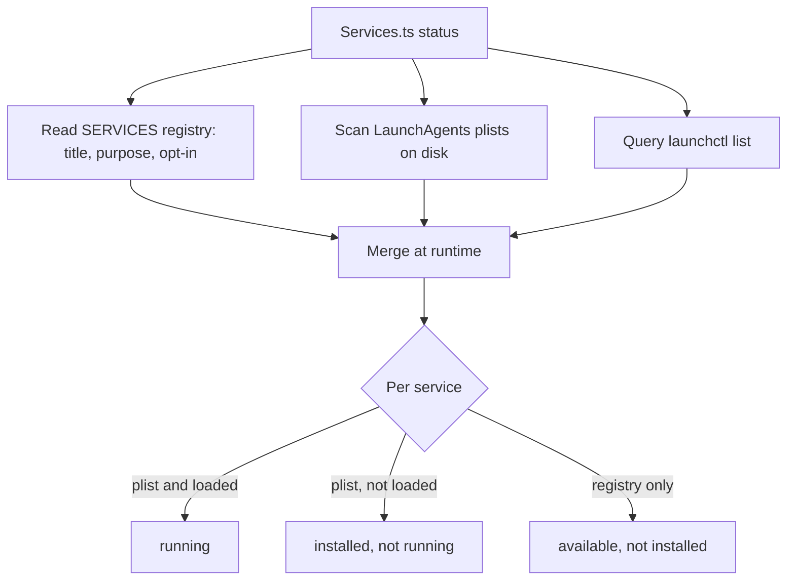

# LifeOS Background Services

> **Every recurring Mac service LifeOS runs, in one place — what it is, how often it fires, and how to install it. One tool controls them all: `LIFEOS/TOOLS/Services.ts`.** Before this doc, the install story was scattered across a dozen `Install*.ts` scripts, Pulse `manage.sh` files, and hand-installed launchd jobs, with nothing that listed what was actually running. This is the fix.

## The one-shot

```bash
bun ~/.claude/LIFEOS/TOOLS/Services.ts status              # what's running vs installed vs available
bun ~/.claude/LIFEOS/TOOLS/Services.ts install --all --yes # stand up every service (macOS)
bun ~/.claude/LIFEOS/TOOLS/Services.ts install --only worksweep,amberroute --yes
bun ~/.claude/LIFEOS/TOOLS/Services.ts uninstall --only amberroute
bun ~/.claude/LIFEOS/TOOLS/Services.ts doc                 # regenerate the table below
```

`status` and `doc` are **read-only** (safe anytime). `install`/`uninstall` call `launchctl` — a privileged step, so the human (or the installing AI, with permission) runs them; `install` without `--yes` is a dry preview. Core services install by default; opt-in ones need `--all` or `--only`.

## How it works

`Services.ts` is a single registry (`SERVICES`) of human-meaningful metadata — title, purpose, category, opt-in, install command — merged at runtime with the **actual plists on disk**. Cadence and run-state are parsed live from `~/Library/LaunchAgents/*.plist` and `launchctl list`, so `status` reports reality, never a stale hand-maintained guess. Adding a service = one row in `SERVICES` pointing at its existing installer; the tool orchestrates, it does not re-implement each installer.

## Categories

- **pulse** — the Life Dashboard and its rendering jobs (core, default-on).
- **capture** — services that pull signal into LifeOS (Conduit sensory capture, the Synapse router, the bookmark watchdog).
- **sync** — keep derived artifacts and external data current (derived-file sync, health).
- **sweep** — periodic scans that create work/ideas (work sweep, commitments, blog discovery).
- **maintenance** — housekeeping (synthesis, codex update, usage aggregation, backups).

## The services (generated from live plists)

<!-- generated by `bun LIFEOS/TOOLS/Services.ts doc` — do not hand-edit; update SERVICES in Services.ts -->

| Service | Category | Cadence | Opt-in | Purpose | Install |
|---------|----------|---------|--------|---------|---------|
| **Pulse (dashboard server)** `com.lifeos.pulse` | pulse | at load | core | The Life Dashboard HTTP server on :31337 — Pulse, the visible surface onto LifeOS. | `bash ~/.claude/LIFEOS/PULSE/manage.sh install` |
| **Pulse menu-bar app** `com.lifeos.pulse-menubar` | pulse | at load | core | macOS menu-bar app for Pulse — quick status + open the dashboard. | `bash ~/.claude/LIFEOS/PULSE/MenuBar/install.sh` |
| **Pulse deriver** `com.lifeos.deriver` | pulse | daily/scheduled | core | Regenerates Pulse's derived Data-Plane pages on a cadence. | `bash ~/.claude/LIFEOS/PULSE/manage-deriver.sh install` |
| **Hermes sidecar (gateway)** `ai.hermes.gateway` | sidecar | at load | yes | The second front door — Hermes gateway mounting this LifeOS install, serving its message channels. Health probe: `bun LIFEOS/HERMES/Health.ts`. | `bun ~/.claude/LIFEOS/HERMES/Mount.ts` |
| **Conduit (sensory capture)** `com.lifeos.conduit` | capture | every 2m | core | Local current-state capture — feeds memory + TELOS current state. | `bun ~/.claude/LIFEOS/PULSE/Conduit/InstallConduit.ts` |
| **Conduit insight builder** `com.lifeos.conduit.insight` | capture | every 1h | core | Builds insights from Conduit's captured signal. | `bun ~/.claude/LIFEOS/PULSE/Conduit/InstallConduitInsight.ts` |
| **Synthesis** `com.lifeos.synthesis` | maintenance | daily/scheduled | yes | Periodic synthesis pass over recent state/memory (weekly-style rollup). | installed with the Pulse/Conduit stack — see PULSE/ |
| **Conveyor inbox watcher** `com.lifeos.conveyor-watcher` | capture | at load | yes | Watches ~/Recordings/Inbox and registers dropped recordings in the content-pipeline ledger (Conveyor P1). | `bun ~/.claude/LIFEOS/TOOLS/InstallConveyorWatcher.ts` |
| **Conveyor stage engine** `com.lifeos.conveyor-runner` | capture | at load | yes | Advances claimable INBOX items to PREP via transcription, lease-guarded, one item per tick (Conveyor P2 stage 1). | `bun ~/.claude/LIFEOS/TOOLS/InstallConveyorRunner.ts` |
| **Work sweep** `com.lifeos.worksweep` | sweep | every 1h | yes | Hourly UL work capture — untracked sessions, stale items, project checks, TELOS-goal derivation. | `bun ~/.claude/LIFEOS/TOOLS/InstallWorkSweep.ts` |
| **Atlas asset-graph sync** `com.lifeos.atlas` | sync | every 15m | yes | Reconciles the Atlas asset graph — 15-min tick (hourly full sync) + event-hint targeted syncs via WatchPaths. | `manual plist — ~/Library/LaunchAgents/com.lifeos.atlas.plist (see LIFEOS/DOCUMENTATION/Atlas/AtlasSystem.md)` |
| **Derived-file sync** `com.lifeos.derivedsync` | sync | on file-change | yes | Watches 31 USER source files; regenerates PRINCIPAL_TELOS, LIFEOS_STATE, Data-Plane on hand-edits. | `bun ~/.claude/LIFEOS/TOOLS/InstallDerivedSync.ts` |
| **Health sync** `com.lifeos.healthsync` | sync | every 1h | yes | Syncs health data into CURRENT_STATE. | `bun ~/.claude/LIFEOS/TOOLS/InstallHealthSync.ts` |
| **Codex update** `com.lifeos.codexupdate` | maintenance | daily/scheduled | yes | Keeps the Codex mirror / update state current. | `bun ~/.claude/LIFEOS/TOOLS/InstallCodexUpdate.ts` |
| **Inbox sweep** `com.lifeos.inboxsweep` *(NOT in the public release payload)* | sweep | every 5m | yes | Every 5 min: deterministic Gmail triage — archives marketing/notification (podcast pitches, cold outreach); keep-classes hard-guarded. The scheduled executable and its plist template live in a private mail skill, so this service exists only on an install that has one. The installer tool itself ships and is inert without it. | `bun ~/.claude/LIFEOS/TOOLS/InstallInboxSweep.ts` |
| **Commitment sweep** `com.lifeos.commitmentsweep` | sweep | daily/scheduled | yes | Sweeps commitments/reminders on a cadence. | `bun ~/.claude/LIFEOS/TOOLS/InstallCommitmentSweep.ts` |
| **Blog discovery** `com.lifeos.blogdiscovery` | sweep | daily/scheduled | yes | Discovers blog-worthy signal on a cadence. | `bun ~/.claude/LIFEOS/TOOLS/InstallBlogDiscovery.ts` |
| **Usage aggregator** `com.lifeos.usage-aggregator` | maintenance | daily/scheduled | yes | Aggregates usage/cost telemetry for Pulse. | `bun ~/.claude/LIFEOS/TOOLS/InstallUsageAggregator.ts` |
| **Bookmark pipeline watchdog** `com.lifeos.bookmark-watchdog` | capture | every 4h | yes | Watches the X bookmark → summarize/idea pipeline for stalls. | ARBOL/BookmarkPipelineWatchdog.ts — see Arbol |
| **Backups** `com.lifeos.backups` | maintenance | daily/scheduled | yes | Daily 03:00 PT repo backup (Git LFS). | Backups project — installed from its own repo (backup.sh) |
| **Bunker app monitor** `com.lifeos.bunkermonitor` | sweep | every 5m | yes | Every 5 min: re-runs every Bunker app's ISA Test Strategy probes; emails on green→red / red→green transitions. | `bun ~/.claude/LIFEOS/TOOLS/InstallBunkerMonitor.ts` |
| **Synapse router** `com.lifeos.amberroute` | capture | every 30m | yes | Every 30 min: TELOS-grade unrouted Synapse captures → KNOWLEDGE notes / UL issues. | `bun ~/.claude/LIFEOS/USER/CUSTOMIZATIONS/ARBOL/Workers/_A_AMBER_LEDGER/Tools/InstallAmberRoute.ts` |

## Fresh install

The LifeOS install skill (`skills/LifeOS/`, `DeployComponents.ts`) stands up the core set during Setup. `Services.ts install --all` is the complete-coverage path: point a fresh macOS install at it and every service comes up, opt-ins included. macOS-only — `launchd` services skip cleanly on Linux/Windows. **Integration status:** `DeployComponents.ts` currently covers ~9 components; wiring it to read `Services.ts`'s registry so a single Setup step covers all 16 is the tracked follow-up.

## Examples

### One command, the whole fleet

An operator wants to know what is actually running. `Services.ts status` merges the registry of known services with the plists on disk and `launchctl` run-state, then prints reality in three buckets:

- **running** — installed and firing on its cadence (Pulse, Conduit).
- **installed, not running** — a plist exists but launchd shows it stopped.
- **available, not installed** — a service LifeOS knows about but this machine has not stood up yet (an opt-in like `blogdiscovery`).

They spot the hourly work sweep sitting in "available." One command stands it up:

```bash
bun ~/.claude/LIFEOS/TOOLS/Services.ts install --only worksweep --yes
```

Because the next `status` reads the live plist again — not a hand-kept note — it shows the sweep running with its real cadence. There is no place for the list to drift from the truth.

### When a preview is the point

`install` and `uninstall` touch `launchctl`, so they are the privileged half of the tool. Running `install --all` *without* `--yes` installs nothing — it prints a dry preview of what would happen, which is the safe way to see the full opt-in set before committing. On a fresh Mac, `install --all --yes` is the opposite move: bring up every service, core and opt-in, in one pass. On Linux or Windows the launchd jobs skip cleanly rather than erroring.

### How status stays honest



The registry supplies the human-meaningful metadata; the plists and `launchctl` supply the ground truth. Because the state comes from the live system every time, the table cannot rot the way a hand-maintained service list would — the failure mode that made this tool necessary in the first place.

---

## Cross-references

- Control tool: `LIFEOS/TOOLS/Services.ts`
- Install skill: `skills/LifeOS/` (`skills/LifeOS/Tools/DeployComponents.ts`, `skills/LifeOS/INSTALL.md`, `skills/LifeOS/Workflows/Setup.md`)
- Pulse: `LIFEOS/DOCUMENTATION/Pulse/PulseSystem.md`; Conduit: `LIFEOS/DOCUMENTATION/Conduit/ConduitSystem.md`
- Synapse (input routing & capture): `LIFEOS/DOCUMENTATION/Synapse/SynapseSystem.md`
