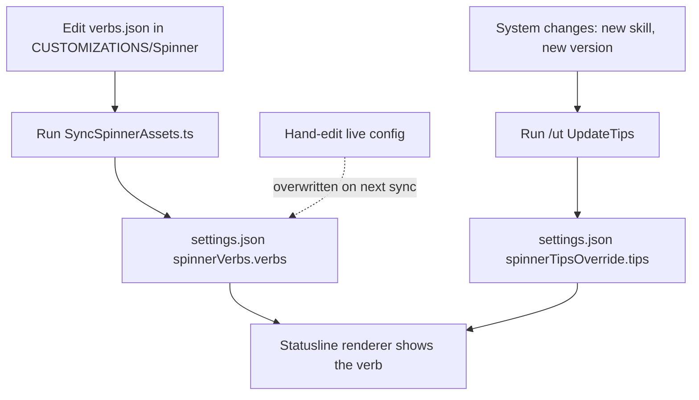

# Custom Spinner Verbs

While LifeOS works, the statusline doesn't just show a generic spinner — it shows a custom animated **working-verb** with your own vocabulary, icon, color, and animation. It's a small thing that makes the system feel like yours instead of a stock tool. Alongside the verb, a rotating set of **tips** surfaces short, current facts about the system while you wait.

Verbs and tips are two distinct features that share the statusline:

- **Spinner verbs** — the animated working word ("Composing", "Forging", "Climbing") plus its icon, color, and animation.
- **Spinner tips** — the informational strings that rotate during longer work, kept in sync with the system's real state.

## Spinner verbs

The verb vocabulary and its styling are defined once as customization assets and pushed to the live config.

- **Source of truth:** `LIFEOS/USER/CUSTOMIZATIONS/Spinner/` — `verbs.json` (the working words), `icons.json`, `colors.json`, `anims.json`, plus a `README.md`.
- **Live config:** `settings.json` → `spinnerVerbs.verbs`.
- **Sync tool:** `LIFEOS/TOOLS/SyncSpinnerAssets.ts` pushes verbs/icons/colors/anims from the customization dir out to the live config and to downstream projects.
- **Statusline renderer:** `LIFEOS/LIFEOS_StatusLine.sh`.

To change the vocabulary, edit the customization JSON and re-run the sync tool — never hand-edit the live config, so the source stays canonical.

## Spinner tips

The tips are short informational strings shown during longer operations. They're kept accurate against the current system — skill counts, hook counts, version strings — by a dedicated maintenance workflow.

- **Live config:** `settings.json` → `spinnerTipsOverride.tips`.
- **Maintenance:** the `/ut` (UpdateTips) workflow in the release/maintenance skill audits and refreshes the tips against the current skill/hook/agent counts and versions. Run `/ut` after a system change so the tips never go stale.

## Examples

### Adding a working-verb the right way

Someone wants the statusline to say "Foraging" while long jobs run. The verb vocabulary is a customization asset, so the edit goes to the source, never the live config:

1. Add `"Foraging"` (with its icon, color, and animation entries) to the JSON under `LIFEOS/USER/CUSTOMIZATIONS/Spinner/`.
2. Run `SyncSpinnerAssets.ts`, which pushes verbs/icons/colors/anims out to `settings.json` → `spinnerVerbs.verbs` and to downstream projects.
3. The statusline renderer picks it up on the next spin.

Editing `settings.json` directly would work for one session and then get overwritten. The customization dir is the source of truth, and the sync tool is the only sanctioned way to move a change into the live config.

### When the tips go stale

Verbs are cosmetic; tips make a factual claim — skill counts, hook counts, version strings — so they rot when the system changes underneath them. After adding a skill or cutting a release, the fix is not to hand-edit `spinnerTipsOverride.tips`; it is to run the `/ut` (UpdateTips) workflow, which re-audits every tip against the current counts and versions and rewrites the stale ones. Same principle as the verbs: change the system, then run the tool that reconciles the surface to it.

Both halves of the statusline follow one rule: the source of truth is upstream of the live config, and a tool — never a hand edit — reconciles them. The dashed path is the anti-pattern the whole design exists to prevent.

---

## Related

- The statusline these render in is part of the overall system surface.
- Pulse — the Life Dashboard: `LIFEOS/DOCUMENTATION/Pulse/PulseSystem.md`
- LifeOS maintenance (the `/ut` workflow lives here): the release/maintenance skill.
