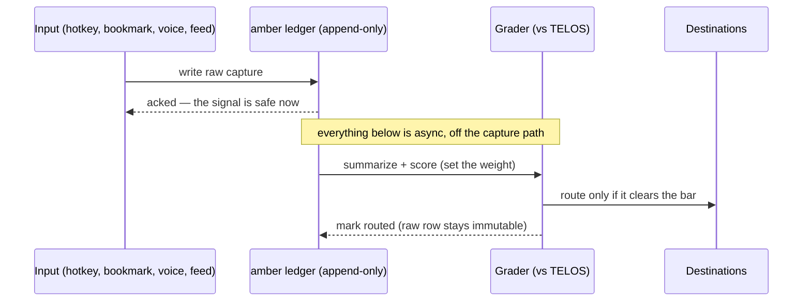

# Synapse — the LifeOS Input Router

> **Synapse is how anything that crosses your attention enters LifeOS.** Every input — a URL, a bookmark, a spoken thought, a feed item, a PDF — plugs into one capture contract, is preserved instantly in the **amber ledger** (Synapse's write-ahead journal), summarized and graded against what you're actually trying to do (TELOS), and routed to the destination it earns. One contract in, weighted transmission through, the right home out.

**Why "Synapse."** A synapse is weighted transmission: a signal crosses only if it's strong enough. That is exactly this system's job — grading sets the weight, routing propagates what clears the bar, and everything is journaled before any of that can fail. The brain analogy runs through the whole stack: **Conduit and Feed are the senses** (internal and external), **Synapse is the relay that grades and routes every signal**, and **Cortex (the memory system) is the store** it promotes into.

> **Renamed from Amber, 2026-07-28.** The old name described only one stage — preservation — while the system's real identity is the router. The metaphor survives at the scope it earned: the append-only journal is still called the **amber ledger**, because an insect in amber is preserved perfectly, permanently, the moment it's caught, and that is precisely the ledger's guarantee. Prior doc: `DOCUMENTATION/Amber/AmberSystem.md` (see git history).

> **Claims live in the ISA.** This doc explains; `LIFEOS/SYNAPSE/ISA.md` carries the subsystem's claims with the probes that would falsify them. The concrete instance map — hostnames, worker URLs, the newsletter sheet — lives in the USER-zone ISA per `LIFEOS/DOCUMENTATION/SystemUserBoundary.md`. Deployed infrastructure keeps its internal names (`arbol-a-amber-ledger` worker, `amber` D1, `com.lifeos.amberroute` launchd job, the `amber` CLI): identity is what changed, not plumbing.

---

## The place in the stack

| Layer | System | Job |
|-------|--------|-----|
| **Senses (internal)** | Conduit | perceives *you* — where attention actually goes (app focus, commits, sessions) |
| **Senses (external)** | Feed | perceives *the world* — polls sources, normalizes items |
| **Router** | **Synapse** | one capture contract in; journal, grade, route |
| — journal | the amber ledger | write-ahead, append-only, permanent; nothing entering Synapse is ever lost |
| **Store** | Cortex | curated KNOWLEDGE promoted from the ledger; hot-layer; retrieval |

Feed and Conduit sense; Synapse decides; Cortex keeps. Before the rename these functions were smeared across three overlapping identities — "Amber" claimed capture, preservation, grading, *and* routing, while Feed ran its own grade/route stages. The carving above is the fix: the pipeline stages Feed runs (summarize, rate, route) are conceptually Synapse's work executed in Feed's plumbing.

---

## The One Loop

**The order is load-bearing: preservation happens at capture, not at the end.** The raw signal is written to the amber ledger the instant it's caught, unconditionally, before any grader can reject it or any router can drop it. Write-ahead-log semantics: nothing entering Synapse is ever lost, even if everything downstream fails.

```
             ┌───────────────────── RESURFACE ─────────────────────┐
             │        search · Pulse /synapse · promote            │
             ▼                                                     │
  CAPTURE ─→ JOURNAL ──────→ GRADE ────→ ROUTE ──┬─→ KNOWLEDGE idea-note (promoted)
  (inputs)   amber ledger    score vs   where    ├─→ work issue Type:queue / Type:project
             D1: append-     TELOS      to?      ├─→ Newsletter (sheet → platform)
             only, dedup,                        ├─→ Blog seed
             never deleted                       └─→ Feed source registry

  inputs: summarize hotkey · bookmarks · voice markers · feed · reader extract · manual · gesture*
```

- **Capture** grabs the raw thing with the least possible friction.
- **Journal** writes it to the amber ledger *immediately and unconditionally*. Everything downstream operates on a record that already exists.
- **Grade** summarizes and scores it — not "is this good?" but "is this good *for what the principal is doing?*" (TELOS). In some components grade and route are fused into one call; the stage split is the conceptual model, not always a separate worker.
- **Route** answers the question that used to be manual: where does this belong? It fans the signal to the destinations it earns.
- **Resurface** is the other half of preservation: a signal journaled and never dug back out is a write-only archive. Recall is part of the contract — search, the Pulse surface, and promotion of the best ledger rows into curated KNOWLEDGE notes.

---

## Inputs (the capture surfaces)

Everything that can drop a signal into Synapse. Each is real unless marked `roadmap`. Component names are LifeOS-internal; exact hosts/URLs are in the instance ISA.

| # | Input | Trigger | LifeOS component | Status |
|---|-------|---------|------------------|--------|
| 1 | **Summarize hotkey** | browser hotkey on any page | Arbol `arbol-a-summarize` | live |
| 2 | **Bookmarks → idea-issues** | bookmark sweep (`tb`) | the X bookmarks skill → `Type:queue` work issues | live |
| 3 | **Bookmarks → summarize (cloud)** | hourly cron | Arbol bookmark-summarize worker → sheet | live |
| 4 | **Harvest → Knowledge** | `/ha` on a URL/video/text | the harvest skill → Arbol harvest + classify workers | live |
| 5 | **Voice markers** | "begin idea … end idea" on the wearable | the lifelog skill → blogging | live (extract loop manual) |
| 6 | **Feed pipeline** | RSS/YouTube/social source polling | the Feed project | live (rules engine designed) |
| 7 | **Reader extraction** | the reader curates + extracts ideas | the reader app | live (extraction sparse) |
| 8 | **Report-only mine** | `/ha` for LifeOS-system usefulness | the harvest skill's Mine workflow | live (feeds decisions, not the store) |
| 9 | Reader upvote → capture | thumbs-up on a reader item | — | **roadmap** |
| 10 | Gesture / wearable ad-hoc trigger | a physical trigger from anywhere | — | **roadmap** |
| 11 | Email → capture (via assistant) | forward to a capture address | partial | **roadmap** |

Adding input #12 means "wire it to the capture contract," never "invent a new pipeline." That is the entire payoff of having a named router.

---

## The Capture Contract (what every input plugs into)

**Every capture, from any input, is one record:**

| Field | Required | Meaning |
|-------|----------|---------|
| `source` | yes | which input produced it (`summarize-hotkey`, `x-bookmark`, `lifelog`, `feed`, …) |
| `external_id` | yes | the input's own id for the item — half the dedup key |
| `url` | url **or** content | normalized source URL |
| `content` | url **or** content | raw text/transcript when there's no URL |
| `captured_at` | yes | when it entered Synapse |
| `content_kind` | yes | `article` \| `video` \| `tweet` \| `paper` \| `note` \| `tool` \| … |
| `title` / `author` | no | when the input knows them |
| `privacy_class` | yes | `public` \| `personal` — gates the local→cloud flow |

**Contract behavior (non-negotiable):**

- **Write-ahead.** The record hits the amber ledger *first*, unconditionally, before grading.
- **Idempotent.** Dedup identity = normalized `url` + content hash (falling back to `source`+`external_id`). The same item arriving via three inputs is one ledger row.
- **Async downstream.** Grade and route run after the write, off the capture path — capture never blocks on a model call.
- **Privacy-gated.** A `personal` record never crosses to cloud storage without an explicit rule.

---

## The amber ledger (the journal)

The append-only D1 ledger is the **source of truth** for everything ever captured — including grade-rejects. It is the one part of the old system name that survives, because the metaphor names exactly its guarantee: caught in amber, preserved perfectly, forever.

- Every capture persists the instant it's caught, before grading, independent of any downstream consumer.
- Raw rows are immutable; grading/routing enrich, never rewrite.
- Grade versions are stored next to scores, so historical grades stay interpretable as TELOS evolves.
- KNOWLEDGE `idea` notes are a **curated promotion layer built FROM the ledger**, never a parallel history. The ledger is authoritative; the notes are a view of its best rows.
- A low-scoring capture earns no destination but lives in the ledger forever — only *routing* is conditional on the score, never preservation.

---

## Grade (setting the weight)

The graders turn raw content into a summary + a score. Synapse's job is to make them speak a common grade shape, not to replace them.

| Grader | What it scores | Home |
|--------|----------------|------|
| **summarize scorer** | category + `SCORE:` + extracted URLs | the Arbol summarize worker |
| **TELOS classifier** | 10-way classification + confidence, grounded in MISSION/GOALS/PROBLEMS/STRATEGIES | the Arbol harvest-classify worker |
| **reader label+rate** | quality tier + main/supporting ideas | the reader app's worker |
| **Feed label+rate** | `quality_score` 1–100 + labels | the Feed project + Arbol |

The TELOS classifier is the important one for routing — it's the only grader that asks *"good for what the principal is trying to do,"* not just *"good."*

---

## Route (propagating what clears the bar)

The routing brain grades every capture into one of ten routes, each carrying `routed_actions`:

```
knowledge | learning | help_understand | project_integration | tech_upgrade |
telos_modification | work_item | reminder | blog_seed | none
```

Routing rules: an item opens a `Type:queue` work issue when its score clears the threshold and the classification is action-shaped; `Type:project` when it's build-sized. Issues dedup on idea identity, and every `routed_action` is logged to the ledger for audit. Below threshold, a signal still lives forever in the ledger — it just hasn't earned a destination yet.

### Destinations

| Destination | What it's for |
|-------------|---------------|
| **KNOWLEDGE `idea` note** | the curated history layer — the best signals, promoted from the ledger, aging `inbox → seedling → budding → evergreen` |
| **work issue `Type:queue`** | captured idea — needs triage |
| **work issue `Type:project`** | an idea big enough to build |
| **Newsletter** | the IDEAS + DISCOVERY sections of the edition |
| **Blog seed** | an idea worth writing up |
| **Feed source registry** | the signal's *source* becomes a monitored feed |

---

## What Synapse Is NOT (the boundary)

| System | Job | Relationship to Synapse |
|--------|-----|-------------------------|
| **Conduit** | senses *you* — attention, commits, sessions | an internal sense; its record feeds Cortex/TELOS, not the ledger |
| **Feed** | polls sources, normalizes the outside world | the external sense; its rate/route stages are Synapse's work in Feed's plumbing |
| **The reader** (Surface) | curates the incoming stream; deletes items after ~5 days | an **input**, and the case-in-chief for the ledger's permanence |
| **Harvest skill** (`/ha` Mine) | report-only — mines content for LifeOS upgrades | a **decision tool**, writes nothing to the store |
| **Cortex** | stores and retrieves what the system knows | the **store** Synapse promotes into; never a second router |

Synapse is the routing and orchestration layer that makes these pieces one system. It doesn't replace any of them.

---

## Surfaces

- **Pulse `/synapse`** — the live surface: a stream-first page (unified reverse-chron feed of captures, promoted notes, and bookmark issues), stats, and system documentation tabs. Backed by the Pulse synapse module (`GET /api/synapse`).
- **CLI** — the `amber` CLI (named for the ledger it drives) captures, lists, routes, and reports stats. A named `/synapse` skill is roadmapped in the ISA (ISC-24).

---

## Roadmap

The roadmap is claims, not prose: `LIFEOS/SYNAPSE/ISA.md` carries every phase with the probe that would falsify it — input breadth (one gesture from every surface), content-type fidelity (transcript for video, body for articles, extracted text for PDFs), the skill, and closing the newsletter loop (ledger as source, sheet as generated view). Phases 1–2 (the ledger, auto-routing) shipped 2026-07-08 and are live-verified.

---

## Examples

### One signal, weighted and routed

A reader skimming an article hits the capture hotkey.

1. **Journal, before anything can judge it.** The raw item is written to the amber ledger immediately. The signal is now safe, even if every step after this crashes.
2. **Grade, off the capture path.** Asynchronously, a grader summarizes and scores it against what the reader is actually working on. Say it clears the bar.
3. **Route to where it belongs.** It scored well and looks build-shaped, so it opens a work issue and seeds a Knowledge note — the decision that used to happen by hand.
4. **Resurface months later.** The reader searches in plain words and the signal is right there, with its score and its links.

### The weak signal still survives

A half-formed thought grades poorly and earns no destination. It is *not* discarded — it lives in the ledger forever, exactly as caught. Preservation is unconditional; only routing is weighted. That's the synapse mechanic and the amber guarantee working together: weak signals don't propagate, but nothing is ever lost.



---

## Cross-References

- Subsystem claims: `LIFEOS/SYNAPSE/ISA.md`
- Capture endpoint: `LIFEOS/USER/CUSTOMIZATIONS/ARBOL/summarize/`
- TELOS-graded routing: the Arbol harvest + harvest-classify workers, writer `LIFEOS/TOOLS/HarvestExecutor.ts`
- Knowledge Archive schema: `LIFEOS/MEMORY/KNOWLEDGE/_schema.md` (kb-v3, `idea` note type)
- Work System: `LIFEOS/DOCUMENTATION/Work/WorkSystem.md`
- Senses: `LIFEOS/DOCUMENTATION/Conduit/ConduitSystem.md` (internal) · `LIFEOS/DOCUMENTATION/Feed/FeedSystem.md` (external)
- Cortex (the store): `LIFEOS/DOCUMENTATION/Memory/MemorySystem.md`
- System/User boundary: `LIFEOS/DOCUMENTATION/SystemUserBoundary.md`
