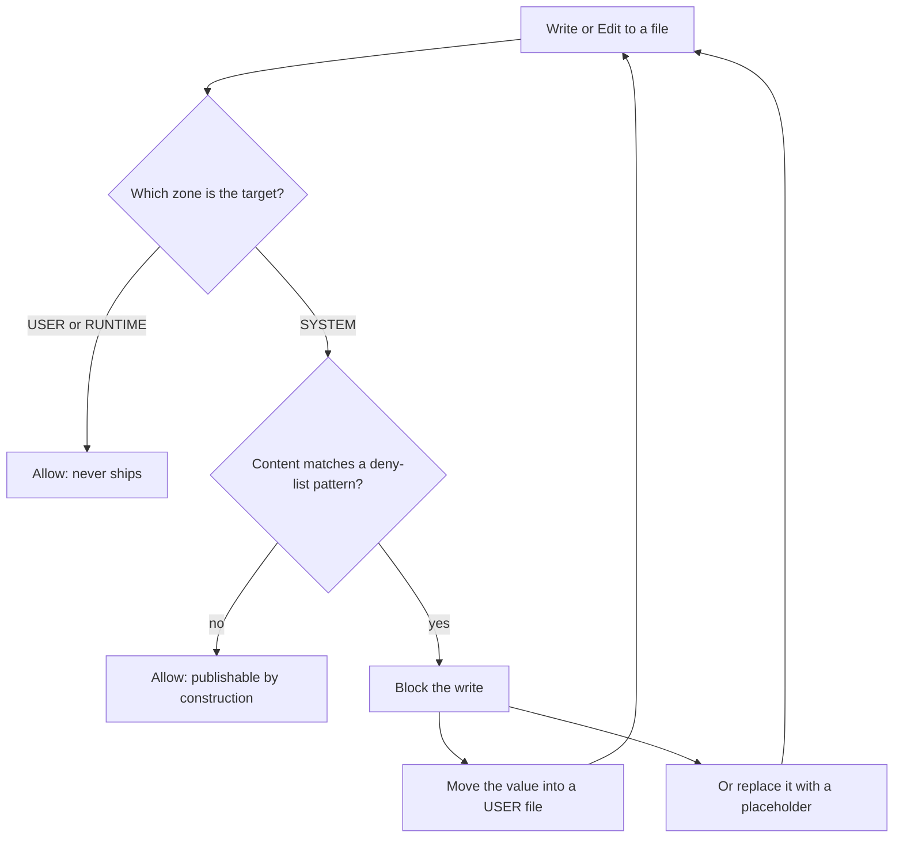

# System / User Boundary

> This boundary is the thesis's deepest structural commitment (`LIFEOS/DOCUMENTATION/LifeOs/LifeOsThesis.md`): LifeOS the OS is universal and public; the life it runs is singular and private. The four zones below are how one repo can be everyone's Life OS without ever containing anyone's life.

> The structural contract that makes the LifeOS live tree publishable by construction rather than by scrub.

## Why this document exists

Through LifeOS v4 and v5, the live LifeOS tree and the public release artifact diverged because there was no enforced architectural separation between system code (intended to ship) and user data (must never ship). Defenses were exclusively build-time: a fourteen-gate scrubber (since grown to eighteen), a deny-list pattern grep, and a containment-zone path inventory. The runtime guard hook was removed in the 2026-05-06 security simplification, leaving no write-time enforcement at all. Drift accumulated between releases; every release required a re-sanitization sweep; the community ran a different artifact than the maintainer.

This document declares the canonical boundary. Every file in `~/.claude/` falls into exactly one of four zones. The boundary is enforced at three layers: at write time by a runtime hook, at PR time by GitHub Actions, at release time by the existing build-time gates as a backstop.

## The four zones

### SYSTEM

Public-by-construction code, documentation, and templates that ship in every LifeOS release. SYSTEM files contain **zero references to any specific user, project, identity, hostname, credential, or personal artifact**. SYSTEM files use only generic placeholders (`{PRINCIPAL.NAME}`, `{DA_IDENTITY.NAME}`, `${LIFEOS_USER_DIR}`, `${HOME}`, "the principal", "your DA").

| Path | Status |
|------|--------|
| `~/.claude/CLAUDE.md` | SYSTEM (after Phase C — split into system router + user @-imports) |
| `~/.claude/settings.json` | SYSTEM (after Phase B — split into system defaults + user overlay merged at startup) |
| `~/.claude/skills/LifeOS/install/install.sh` | SYSTEM (installer bootstrap — ships inside the `LifeOS/` skill; there is no root-level `install.sh` in a release) |
| `~/.claude/LICENSE` | SYSTEM |
| `~/.claude/.gitignore`, `.gitattributes`, `.gitmodules`, `.mcp.json`, `.lsp.json`, `bunfig.toml` | SYSTEM (config) |
| `~/.claude/LIFEOS/LIFEOS_SYSTEM_PROMPT.md` | SYSTEM (after Phase C — operational rules with user-specific content move out) |
| `~/.claude/LIFEOS/VERSION` | SYSTEM |
| `~/.claude/LIFEOS/LIFEOS_StatusLine.sh` | SYSTEM |
| `~/.claude/LIFEOS/ALGORITHM/**` | SYSTEM |
| `~/.claude/LIFEOS/DOCUMENTATION/**` | SYSTEM (after Phase D — categorical placeholders only) |
| `~/.claude/LIFEOS/PULSE/` (source code only — excludes `Assistant/state/`, `state/`, `logs/`, `Plans/`, `Observability/out/`) | SYSTEM (after Phase F — parameterized via LifeosConfig) |
| `~/.claude/LIFEOS/TOOLS/**` (after the few user-path leaks are scrubbed) | SYSTEM |
| `~/.claude/LIFEOS/ScheduledTasks/**` (system-shipped scheduled task templates, NOT user instances) | SYSTEM |
| `~/.claude/hooks/**` | SYSTEM |
| `~/.claude/skills/<name>/**` where `<name>` does NOT start with `_` | SYSTEM |
| `~/.claude/commands/**` | SYSTEM |
| `~/.claude/agents/**` (shipped agent definitions) | SYSTEM |

### USER

Private, user-owned data that ships in the user's own private repo and is mounted into the LifeOS tree via symlink or git submodule. USER files may contain anything — they are never inspected by the public release pipeline because they live outside the system tree.

**Physical mount (post-Phase-G, 2026-05-22):** `~/.claude/LIFEOS/USER/` is a symlink to `~/.config/LIFEOS/USER/` (XDG-style data location). The actual git working tree for the user's private USER-data repo lives at `~/.config/LIFEOS/USER/` — the symlink at `~/.claude/LIFEOS/USER/` exists only so Claude Code's `@`-import resolver (which evaluates paths relative to `~/.claude/`) can reach identity / TELOS / config files at session start. Boundary semantics are unchanged: the "USER zone" still refers to anything under `~/.claude/LIFEOS/USER/**` logically; the only difference is that the bytes live at the XDG path on disk.

| Path | Status |
|------|--------|
| `~/.claude/.env`, `.env.*` | USER (secrets) |
| `~/.claude/LIFEOS/USER/**` (symlink → `~/.config/LIFEOS/USER/**`) | USER (identity, TELOS, projects, integrations, contacts, finances, health, business, customizations) |
| `~/.claude/LIFEOS/MEMORY/**` (symlink → `~/.config/LIFEOS/USER/MEMORY/**`, post-Phase-G.2, 2026-05-23) | USER (work history, knowledge graph, learning signals, observability logs, research, reflections, relationships). Durable subset (KNOWLEDGE, WORK/<slug>/ISA.md, RELATIONSHIP, WISDOM, PLANS, RESEARCH, STATE/work.json, BOOKMARKS, REFERENCE, SKILLS, PROJECT, TEAMS, SYSTEMUPDATES, VERIFICATION) is git-tracked in the user's private USER-data repo; ephemeral subset (OBSERVABILITY JSONLs, _BROWSER_STATE, LEARNING signals, SECURITY artifacts, VOICE event log, STATE caches, per-skill runtime state, PULSE_DATA, SCRATCHPAD, RAW, AUTO, CALLS, INBOX, ARCHIVE, DATA, WORK/<slug>/* intermediates) gitignored from the private repo, local-only. |
| `~/.claude/LIFEOS/ARBOL/**` | USER (private cloud worker code) |
| `~/.claude/LIFEOS/Backups/**` | USER (backup state) |
| `~/.claude/skills/_<name>/**` (underscore-prefixed) | USER (private/proprietary skills) |
| `~/.claude/daemon/`, `daemon.log` | USER (private daemon profile state) |
| `~/.claude/jobs/**` (user-instance scheduled tasks) | USER |
| `~/.claude/downloads/**` | USER (working files) |
| `~/.claude/MEMORY/**` (root-level orphan; should migrate to `LIFEOS/MEMORY/`) | USER (orphan — Phase A cleanup) |

### INTERFACE

The boundary itself — the documented contract by which SYSTEM code reads USER data. The schema ships in SYSTEM; the values ship in USER. New SYSTEM features that need new user data must extend the INTERFACE explicitly with an ISA entry.

| Path | Status |
|------|--------|
| `~/.claude/LIFEOS/TOOLS/LifeosConfig.ts` | INTERFACE — typed loader, ships in SYSTEM (after Phase F) |
| `~/.claude/LIFEOS/USER/CONFIG/LIFEOS_CONFIG.{json\|yaml\|toml}` | INTERFACE — user-supplied implementation (after Phase F; format pending ISC-56.1) |
| `~/.claude/LIFEOS/USER/CONFIG/settings.user.json` | INTERFACE — user settings overlay (after Phase B) |
| `~/.claude/LIFEOS/USER/CONFIG/OPERATIONAL_RULES.md` | INTERFACE — user-specific operational rules (after Phase C); @-imported directly from `~/.claude/CLAUDE.md` since CC does not follow transitive @-imports |
| `~/.claude/LIFEOS/USER/INTEGRATIONS/*.yaml` | INTERFACE — typed config for integrations (homebridge, unifi, airgradient, work-system, etc.) |

### RUNTIME-STATE

Harness-owned or LifeOS-runtime-owned ephemeral files. Never shipped, never user-edited. Already excluded from git via `.gitignore` in most cases.

| Path | Status | Gitignored |
|------|--------|------------|
| `~/.claude/sessions/`, `todos/`, `tasks/`, `teams/` | RUNTIME (Claude Code harness) | yes |
| `~/.claude/history.jsonl` | RUNTIME (Claude Code) | yes (under root anchors) |
| `~/.claude/cache/`, `shell-snapshots/`, `session-env/`, `paste-cache/`, `file-history/` | RUNTIME (harness/LifeOS) | yes |
| `~/.claude/.next/`, `.wrangler/`, `.venv/`, `coverage/`, `test-results/`, `telemetry/` | RUNTIME (build/test) | partial — telemetry/ is NOT gitignored and contains identity-bearing data; add to .gitignore in Phase A |
| `~/.claude/plugins/`, `Plugins/` | RUNTIME (Claude Code plugin install state) | partial |
| `~/.claude/ide/` | RUNTIME (Claude Code IDE state) | implied |
| `~/.claude/.DS_Store`, `.last-cleanup`, `.quote-cache` | RUNTIME (OS / harness) | yes |
| `~/.claude/interceptor-screenshot-*.{png,jpg}` (root) | RUNTIME (debug captures) | yes |
| `~/.claude/LIFEOS/PULSE/{state,logs,Assistant/state,.playwright-cli,Observability/out}/**` | RUNTIME (Pulse runtime) | implied |

## The four allowed access patterns

System code reaches user data via exactly four mechanisms. Any fifth pattern is a boundary violation.

1. **`LifeosConfig.load()` typed loader.** The primary access channel for identity, voice, integrations, paths. Returns a typed object; the schema is the contract.
2. **Path computed from LifeosConfig values.** When system code reads a USER file at a path, that path must be built from `LifeosConfig.paths.userDir + relative` — never from a literal `LIFEOS/USER/` string.
3. **At-startup @-imports declared in CLAUDE.md (system half).** The harness's @-import mechanism loads user identity files at session start. Declared once in the system half of CLAUDE.md, referencing `${LIFEOS_USER_DIR}/PRINCIPAL/PRINCIPAL_IDENTITY.md` etc.
4. **HTTP/IPC via the Pulse server.** When a hook or tool needs runtime state, it queries `http://localhost:31337` — Pulse is the only legal aggregator of cross-zone data.

Anything else — direct `Read('LIFEOS/USER/...')`, hardcoded voice IDs in module source, identity strings in operational rules — is a boundary violation. The runtime `SystemFileGuard.hook.ts` (Phase E) blocks new violations at write time.

## Two-repo sync (post-Phase-G.1, 2026-05-22)

The USER tree is its own private git repo: `~/.config/LIFEOS/USER/` → the user's `<your-username>/<your-user-data-repo>` (PRIVATE GitHub). The SYSTEM tree is `~/.claude/` → the user's `<your-username>/.claude` (PRIVATE GitHub). There is no pre-push auto-sync git hook (a stale claim corrected 2026-07-04): both repos are committed, pushed, and version-tagged together by the UpdateKaiRepo workflow ("push both repos"), which runs four boundary gates: (G1) USER-zone leak check on pending `~/.claude` changes, (G2) `DenyListCheck.ts` must return 0 real-leaks, (G3) both remotes confirmed private via `gh repo view --json isPrivate`, (G4) post-push HEAD verification on both repos via `git ls-remote`. **Pre-flight refuses to proceed if the public LifeOS repo appears in either remote** — this workflow is explicit private-only. Public LifeOS release goes through the shadow-release pipeline (`ShadowRelease.ts`) with the separate 19-gate sanitization; the shipped distribution unit is the single `LifeOS/` skill emitted from that staging tree, not the `.claude/` clone.

## Enforcement layers

The boundary is enforced at three independent layers; each catches different drift modes.

1. **Write-time (`SystemFileGuard.hook.ts`, Phase E).** Invoked by the `hooks/PreToolGuard.hook.ts` PreToolUse dispatcher on Write/Edit; blocks writes to SYSTEM files when the new content matches deny-list patterns. Fail-safe-open on hook errors. Primary defense — catches drift the moment it would land.
2. **PR-time (GitHub Actions, Phase H).** Runs `DenyListCheck.ts` on every PR against the public repo. Blocks merge on any real-leak finding.
3. **Release-time (`ShadowRelease.ts` 19 gates, existing).** Final backstop. Should consistently return zero findings if layers 1 and 2 are healthy.

## Migration phases

This document is the Phase A deliverable. Phases B–H land progressively. Each phase ships standalone-functional state and is rollback-able via the `pre-separation-2026-05-20` git tag or per-phase tags.

| Phase | Lands | Boundary impact |
|------:|---|---|
| A | This doc + classification CSV + violations.md | Boundary becomes legible |
| B | `settings.json` split into system + user overlay | settings.json moves to SYSTEM, leaks → user file |
| C | `CLAUDE.md` + `LIFEOS_SYSTEM_PROMPT.md` split | Constitutional files move to SYSTEM, leaks → user/OPERATIONAL_RULES.md |
| D | Sanitize the 9 leak-source files | DOCUMENTATION + skills become SYSTEM-clean |
| E | `SystemFileGuard.hook.ts` | Runtime enforcement begins |
| F | `LifeosConfig.ts` + migrate Pulse/hooks/skills | One-way dependency direction established |
| G | User-dir extracted to private repo, mounted via symlink | Live tree == public release modulo symlink |
| H | `CONTRIBUTING.md` + CI + PR workflow | The principal and community use same flow |

## The boundary's success criterion

The deny-list precheck (`DenyListCheck.ts ~/.claude`) returns:

```
Real-leak: 0
```

on the live tree, without any scrubbing step having been run. When this passes — and the runtime hook has prevented new leaks from landing for a sustained period — the question "is the system tree publishable?" stops being a question. The answer is structurally yes.

---

## Examples

### The boundary in miniature

Picture a contributor improving a shipped doc. They want a real-looking example, so they paste a line like `host: workstation-7.home.lan` into a file under `LIFEOS/DOCUMENTATION/`. That file is a SYSTEM file — it ships to everyone. The write-time guard sees a SYSTEM path about to receive a deny-list pattern (a hostname) and refuses the write before a single byte lands.

The contributor gets a clear rejection, not a silent leak that surfaces three releases later. The fix isn't to weaken the guard — it's to use a categorical placeholder like `host: <your-workstation>.lan` in the SYSTEM doc, and let the real hostname live in a USER config file where it belongs.

### Same bytes, different zone

The zone is the whole decision — the content is often identical.

- **Blocked:** a real `voiceId: "a1b2c3..."` hardcoded into a module under `hooks/`. That's SYSTEM; a credential can never ship. The guard blocks it.
- **Allowed:** the same `voiceId` written to `LIFEOS/USER/CONFIG/LIFEOS_CONFIG.json`. That's USER; it never enters the release pipeline. The write goes through.

The rule the guard encodes is the rule a careful contributor would follow anyway: real values live in USER, schemas and placeholders live in SYSTEM, and SYSTEM code reaches USER values only through the typed loader. The guard turns "would follow anyway" into "cannot forget."

### A write, decided at the boundary



Every write to the tree passes this one gate. Because the check runs at write time and not at release time, the question "is the system tree publishable?" is answered continuously instead of re-answered by a scrub before every release. A blocked write is the boundary doing its job: catching drift the moment it would land, while the fix is still one line.

---
