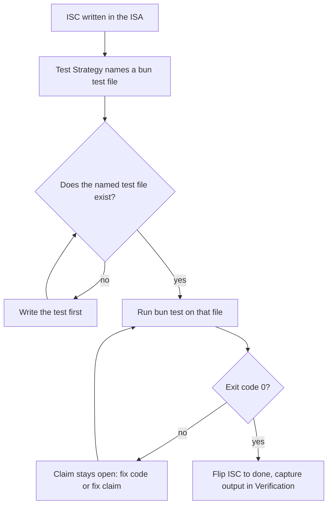

# LifeOS Testing Doctrine

> Testing is how the Life OS knows what it knows (`LIFEOS/DOCUMENTATION/LifeOs/LifeOsThesis.md`): the hill-climb only counts when each step is verified, and `bun test` is the canonical probe behind every ISC claim. An unverified gap-closure is a guess wearing a checkmark.

> **TL;DR.** Tests for LifeOS run on `bun test`. The shared harness lives at `~/.claude/test/harness.ts` and exports zero-external-dep helpers (`paiTestEnv`, `tempDir`, `claudeFixture`, platform predicates, custom matchers). Tests live in a parallel `~/.claude/test/` tree that mirrors the source API surface — *not* co-located. Coverage is corpus-based: every documented hook, skill workflow, and tool surface gets at least one test file. No retries, no hardcoded ports, no time-based waits, no per-test timeouts. The ISA's `## Test Strategy` `tool: bun test path/to/foo.test.ts` is the canonical bridge from criterion to probe.

> **Status (public installs):** the harness and `test/` tree described here are NOT yet included in the public release payload (public issue #1550) — releases through 7.3.6 shipped them; the 7.4+ single-skill `install/` layout dropped them, and re-inclusion is a pending packaging decision. On a public install, treat this doctrine as the specification the system is converging on: `bun test` remains the canonical probe wherever a test exists, and the harness here is the Phase 1 skeleton (243 lines, 18 exports), not the full Bun-scale harness the table below describes as its inspiration.

This document is the result of a deep analysis of how the Bun project itself (`oven-sh/bun`) achieves its reputation for thorough test coverage and harness discipline, mapped onto LifeOS's TypeScript surface. Citations to Bun source are inline; the full research lives at `~/.claude/LIFEOS/MEMORY/WORK/20260507-bun-testing-doctrine-analysis/ISA.md`.

---

## Why this doctrine exists

LifeOS ships a lot of TypeScript across hooks, skills, tools, Pulse, Arbol Workers, and the release pipeline. Verification has been ad-hoc — `curl` checks, manual `bun run` invocations, eyeballing diffs. Several recurring failure modes (silent OAuth/API-key billing, identity-grep gates, ISA parsing, Pulse VoiceServer, the TheRouter classifier, retired 2026-07-11) are exactly the class of bugs a real harness catches.

The ISA already declares the test surface (Algorithm v6.3.0 doctrine: *"the ISA IS the test harness because the ISCs are the tests"*). What's been missing is the *invocable probe* behind each ISC. This doctrine closes that gap by making `bun test path/to/foo.test.ts` the canonical answer to "how does this ISC actually verify?"

---

## What we adopt from Bun

| Pattern | Bun source | LifeOS adoption |
|---------|-----------|--------------|
| **Single shared harness, zero external deps** | `test/harness.ts` (1985 lines, 98 exports, header comment forbids external deps) | `~/.claude/test/harness.ts` |
| **Parallel `test/` tree mirroring API surface, not co-location** | `src/bun.js/api/spawn.zig` → `test/js/bun/spawn/*.test.ts` | `hooks/<Hook>.hook.ts` → `test/hooks/<Hook>.hook.test.ts` |
| **Subprocess testing for CLI behavior** | 591 of 1526 test files spawn `bun` | `Inference.ts`, hook handlers tested via `Bun.spawn` (the former `TheRouter.hook.ts` suite was removed with the hook, 2026-07-11) |
| **`tempDir` with `DisposableString`** | `test/harness.ts:263-294` | `paiTempDir(prefix, fileMap)` returns `using`-disposable |
| **Scrubbed env constant** | `bunEnv` in `test/harness.ts:50-104` | `paiTestEnv` scrubs API keys, OAuth tokens, real `HOME` |
| **`await using proc` + 3-way `Promise.all`** | `test/cli/heap-prof.test.ts` | Standard subprocess capture pattern |
| **Inline snapshots with normalization** | `test/js/web/console/console-log.test.ts:75-150` | Strip absolute paths, ISO timestamps, ANSI codes before snapshot |
| **Platform predicates** | `isMacOS`, `isLinux`, `isCI`, `isFlaky`, `isMusl`, etc. | `isCI`, `isMacOS`, `isFlaky`, `isLifeosDev` |
| **Custom matchers via module augmentation** | `expect.extend({toRun, toThrowWithCode, …})` with `declare module "bun:test"` | `toBeValidISA`, `toBeValidClassifierLine`, `toHavePassedAllISCs` |
| **`test.todoIf` for flake demotion (not retry)** | `isFlaky = isCI; test.todoIf(isFlaky && isMacOS)("…")` | Same — flakes get tagged + tracked, never retried |
| **Regression test convention `test/regression/issue/{N}.test.ts`** | Same path | `test/regression/{slug}.test.ts` keyed by ISA decision IDs |
| **Multiple validation passes (LeakSan, exception-validation, expectations)** | `leaksan.supp`, `no-validate-*.txt`, `expectations.txt` | Phase 2: extend beyond pass/fail correctness |
| **Corpus-based coverage** | Vendor entire upstream Node test corpus (2208 files) | Every hook/skill/tool gets ≥1 test file; no global percentage gate |
| **Anti-flakiness as written-down doctrine** | `test/CLAUDE.md` rules (no hardcoded ports, no time waits, no per-test timeouts) | This document + `test/CLAUDE.md` mirroring Bun's |

---

## What we deliberately don't adopt

- **Vendoring an upstream test corpus.** Bun vendors the Node.js test suite (2,208 files) for compatibility coverage. LifeOS has no upstream corpus to vendor; coverage emerges from the surface inventory (every hook, every skill workflow, every TOOLS/*.ts).
- **Buildkite CI matrix.** Bun runs cross-OS / cross-arch matrices on Buildkite. LifeOS's deployment surface is {{PRINCIPAL_NAME}}'s Mac + cloud Workers. GitHub Actions is sufficient when CI lands; for now tests run locally and on Pulse.
- **`Bun.bench` integration.** Out of scope. Performance regression tests come later if needed.
- **Mocha shim (`runners/mocha.ts`).** Bun aliases `bun:test` globals to Mocha names so upstream Mocha-shaped tests run unchanged. LifeOS has no Mocha-shaped tests to import.
- **`__mocks__` directory and auto-mocking.** Bun explicitly does not support these yet; LifeOS follows.

---

## Doctrine — the rules

These are non-negotiable. Violations get caught at the ISA `## Test Strategy` review or at the VERIFY-phase Forge cross-vendor audit.

### 1. The harness is `~/.claude/test/harness.ts`. Zero external deps.

It must be importable before `bun install` runs. It depends only on Bun built-ins (`Bun`, `bun:test`, `node:fs`, `node:path`, `node:os`). Adding a dependency to `package.json` for the harness is a CRITICAL FAILURE.

### 2. Tests live at `~/.claude/test/<surface>/<name>.test.ts`.

Mirror the source path, not co-locate. Map:

| Source | Test |
|--------|------|
| `hooks/<Hook>.hook.ts` | `test/hooks/<Hook>.hook.test.ts` |
| `skills/<Skill>/Tools/<Tool>.ts` | `test/skills/<Skill>/Tools/<Tool>.test.ts` |
| `skills/ISA/Workflows/Scaffold.md` | `test/skills/ISA/Workflows/Scaffold.test.ts` (workflow contract test) |
| `LIFEOS/PULSE/modules/wiki.ts` | `test/pulse/modules/wiki.test.ts` |
| `LIFEOS/TOOLS/Inference.ts` | `test/tools/Inference.test.ts` |

Snapshot files at `test/<surface>/__snapshots__/<name>.test.ts.snap`.

**Subsystem-package clause.** A directory-tool with its own `package.json` (`LIFEOS/TOOLS/<tool>/`) keeps its suite in-package at `<tool>/test/` with a `package.json` `test` script — the suite travels with the deployable package. The parallel `~/.claude/test/` tree governs the repo-root surface (hooks, skills, single-file tools). The repo-root `bun test` walk still reaches in-package suites, so corpus coverage loses nothing. (Public PR #1603, @anikinsasha.)

### 3. Every test file is independently runnable.

`bun test test/hooks/Foo.hook.test.ts` works in isolation. No file depends on another file's globals or setup. If shared setup is needed, it goes in `test/preload.ts` and is loaded via bunfig.

### 4. Every test uses `paiTestEnv`, never `process.env`.

```ts
import { paiTestEnv, paiBunExe } from "../harness";

await using proc = Bun.spawn({
  cmd: [paiBunExe(), "LIFEOS/TOOLS/Inference.ts", "--level", "low"],
  env: paiTestEnv,  // never process.env
  stdin: "pipe",
  stdout: "pipe",
  stderr: "pipe",
});
```

`paiTestEnv` scrubs `ANTHROPIC_API_KEY`, `ANTHROPIC_AUTH_TOKEN`, `CLAUDE_CODE_OAUTH_TOKEN`, `OPENAI_API_KEY`, `ELEVENLABS_API_KEY`, `STRIPE_SECRET_KEY`, every `BUN_DEBUG_*`, every `BUILDKITE_*`, forces `TZ=Etc/UTC`, `CI=1`, `NO_COLOR=1`, points `HOME` at a fixture dir.

### 5. Subprocess capture uses the 3-way `Promise.all` pattern.

```ts
const [stdout, stderr, exitCode] = await Promise.all([
  proc.stdout.text(),
  proc.stderr.text(),
  proc.exited,
]);
```

Anything else risks deadlock when one pipe fills.

### 6. Disposable scopes for everything mutable.

- `using dir = paiTempDir("test-name", { "fixture.txt": "..." });` — auto-cleanup
- `using restore = paiHomeScope("/tmp/fake-home");` — restore env on dispose
- `using restore = paiCwdScope("/tmp/elsewhere");` — restore cwd on dispose
- `await using proc = Bun.spawn(...);` — auto-kill child on dispose

Never a manual `try/finally` for resource cleanup. Use the language's `using`.

### 7. Snapshots are normalized before comparison.

```ts
const normalized = stdout
  .replaceAll("\r\n", "\n")
  .replaceAll(String(dir), "<tempdir>")
  .replaceAll(/\d{4}-\d{2}-\d{2}T\d{2}:\d{2}:\d{2}(\.\d+)?Z/g, "<iso-timestamp>")
  .replaceAll(/\(\d+:\d+\)/g, "(N:NN)")
  .replaceAll(/\x1b\[\d+m/g, "");

expect(normalized).toMatchInlineSnapshot(`...`);
```

Drift in line numbers, timestamps, temp dirs, or ANSI codes must NOT cause a snapshot diff. Drift in actual content MUST cause a diff.

### 8. Mocking the `claude` subprocess.

Tests of `Inference.ts` and anything that calls `claude` MUST NOT actually invoke OAuth-billed Claude. Two options:

```ts
// Option A — mock Bun.spawn at module level
import { mock } from "bun:test";
mock.module("bun", () => ({
  ...await import("bun"),
  spawn: mockClaudeSpawn,
}));
```

```ts
// Option B — point Inference.ts at a fixture-replay subprocess
const proc = Bun.spawn({
  cmd: [paiBunExe(), "test/fixtures/fake-claude.ts"],
  env: paiTestEnv,
});
```

Use Option B (subprocess-replay) when the test needs the real `Inference.ts` argv-parsing behavior; Option A when only the response shape matters.

### 9. No retries. No hardcoded ports. No time waits. No per-test timeouts.

- Retry: banned. A flaky test is `test.todoIf(isFlaky)` with a tracking entry.
- Hardcoded port: banned. Use `port: 0` and capture the assigned port.
- Time wait: banned. `await Bun.sleep(N)` to wait for state is wrong. Wait on the condition (file exists, port responds, process exited).
- Per-test timeout: banned. The 5,000ms default is the contract. If a test needs more, it's structurally wrong — split it.

### 10. Anti-criteria are first-class ISCs.

Every ISA `## Criteria` section MUST include at least one `Anti:` ISC. The corresponding test asserts the regression does NOT happen:

```ts
test("Anti: ANTHROPIC_API_KEY is not present in spawned env", async () => {
  await using proc = Bun.spawn({ ... });
  // ...
  expect(spawnedEnvSnapshot).not.toContain("ANTHROPIC_API_KEY");
});
```

### 11. A state-machine edge test must PRODUCE the edge, never assert from a hand-written state.

If the behavior under test is a transition — open→closed, stale→fresh, first-time→repeat — the test drives the system across it. Writing the precondition directly into the state file, the registry, or the fixture tests the *consequence* of the transition while leaving the code that causes it unexecuted.

```ts
// WRONG — pins the reset, not the thing that arms it.
st.runWasOpen = true; writeFileSync(stateFile, JSON.stringify(st));
expect(call()).toBeNull();

// RIGHT — the edge happens because the system observed it happen.
writeWork("climbing", "2/7");   // an OPEN run
for (let i = 0; i < 40; i++) call();
writeWork("complete", "7/7");   // now CLOSED — the transition is real
expect(call()).toBeNull();
```

The falsifier is mechanical and worth running once per state machine: **delete the single line that sets the flag and re-run the suite.** If it stays green, the test is decoration.

This rule was bought expensively. In one run (2026-07-30, `20260730-nudge-phase-gate-drift`) the same displacement landed three times, and every instance read as passing coverage:

- tests exercised an extracted predicate while the call site kept the bug — deleting the guard left 50 tests green;
- the fix for that produced a test that hand-wrote `runWasOpen = true` into the state file, so deleting the one line that sets it left 58 tests green and silently restored a misfire incident from three weeks earlier;
- the telemetry channel added to make silence visible was filled entirely with its own test output — 8 lines, zero production entries.

The shared failure: a guard's own test was the thing that didn't guard. Corollary — **any file a test writes to must be path-overridable by env var**, or the test's evidence contaminates the production signal it exists to protect.

### 12. Property tests use `fast-check` as the single approved primitive.

`fast-check` (MIT, zero runtime deps, native `bun:test` integration) is the one approved property-testing primitive. **No `jsverify`, no `quickcheck-js`, no hand-rolled property runners.** Adding any alternative property-testing dependency to `package.json` is a CRITICAL FAILURE.

Integration form:

```ts
import { test, expect } from "bun:test";
import * as fc from "fast-check";

test("reverse is self-inverse", () => {
  fc.assert(
    fc.property(fc.array(fc.integer()), (xs) => {
      expect(reverse(reverse(xs))).toEqual(xs);
    }),
    { numRuns: 1000 },
  );
});
```

Property tests live alongside example tests in the same `test/` tree, with `.property.test.ts` suffix to distinguish. Failing properties emit shrunk counterexamples that auto-promote to permanent regression cases — pin the seed in a comment when you copy the counterexample into an example test (`// fc seed: 0x...`).

**In substantial work**, every pure-function ISC SHOULD have at least one property-form ISC row in `## Test Strategy`. The granularity rule applies: each property is one binary probe (passes when the property holds across all `numRuns` invocations). The new ISC type is `bun-property` — see `LIFEOS/DOCUMENTATION/ISA/ISAFormat.md` § ISC Type Vocabulary for schema, and `skills/Hardening/Workflows/PropertyTest.md` for candidate detection and the ten property categories (round-trip, idempotency, commutativity, associativity, identity, conservation, model-based, metamorphic, state-machine, oracle).

**Worked Anti-ISC universal-form example.** The example-shaped Rule #10 anti-ISC catches one named variable. The universal-form version catches the API-key class:

```ts
test("Anti: no API-key-shaped env var leaks into spawned subprocess", () => {
  fc.assert(
    fc.property(
      fc.dictionary(fc.stringMatching(/^[A-Z_]{4,32}$/), fc.string()),
      (envOverrides) => {
        const spawned = spawnWithEnv({ ...paiTestEnv, ...envOverrides });
        const apiKeyVars = Object.keys(spawned.env).filter((k) =>
          /API_KEY|AUTH_TOKEN|OAUTH/i.test(k),
        );
        expect(apiKeyVars).toEqual([]);
      },
    ),
    { numRuns: 1000 },
  );
});
```

This is strictly stronger than the example form — it catches `ANTHROPIC_API_KEY`, `OPENAI_API_KEY`, and the next vendor's key the author hasn't bought yet. **In substantial work, this is the default Anti-ISC shape.**

---

## bunfig.toml

LifeOS's test config lives at `~/.claude/bunfig.toml` `[test]` section:

```toml
[test]
preload = ["./test/preload.ts"]
pathIgnorePatterns = [
  "**/node_modules/**",
  "**/LIFEOS/LIFEOS_RELEASES/**",  # shadow releases — no tests
  "**/LIFEOS/MEMORY/**",         # ephemeral session data
  "**/.git/**",
]
coverage = false
coverageReporter = ["text", "lcov"]
coverageDir = "coverage"
coveragePathIgnorePatterns = [
  "**/node_modules/**",
  "**/test/**",
  "**/LIFEOS/LIFEOS_RELEASES/**",
  "**/LIFEOS/MEMORY/**",
]
# Per-critical-path thresholds. Set on a tightly-scoped subset, never the whole tree.
# coverageThreshold = { line = 0.8, function = 0.9, statement = 0.85 }
```

`bun test` from `~/.claude/` walks `test/` and runs every `*.test.ts`.

---

## ISA integration

The ISA `## Test Strategy` table's `tool` column gets a new canonical form:

```
| isc | type | check | threshold | tool |
|-----|------|-------|-----------|------|
| ISC-7 | bun-test | ANTHROPIC_API_KEY scrubbed from spawned env | env-snapshot diff | bun test test/tools/Inference.test.ts -t "Anti: API key" |
```

When an ISC's `tool` value starts with `bun test`, the named test file MUST exist before `[ ]` → `[x]`. The Algorithm v6.3.x VERIFY-phase rule table gains a row:

| ISC type | Minimum verification tool call |
|----------|-------------------------------|
| `bun-test` | `bun test <file>:<-t pattern>` exits 0; output captured in `## Verification` |

This is a doctrine update for the next Algorithm minor version. Until then, the rule applies by convention: `bun test` is the probe when the `tool` column says so.

### Multi-context-window state (long-horizon runs)

When a single Algorithm run spans multiple context windows — Ralph Loop, Maestro, `--ephemeral` feature slices, or any task large enough to compact mid-flight — the ISA `## Test Strategy` is the human-readable spec, but the model also needs a machine-readable state file it can re-read after a context reset. Per Anthropic's Opus 4.8 long-horizon guidance (mirrored in `skills/Prompting/Standards.md` § Multi-Context Window Workflows):

- **Mirror the probes into a structured `tests.json`** in the work slug dir (`MEMORY/WORK/{slug}/tests.json`): one row per ISC probe with `{id, name, status: passing|failing|not_started}` plus rollup counts. Opus 4.8 is "extremely effective at discovering state from the local filesystem" — a structured status file beats re-deriving progress from a degraded long context.
- **Write a setup script (`init.sh`)** in the slug dir that starts servers, runs the suite, and restores state, so a fresh window doesn't repeat the standup work.
- **Prefer a fresh window over aggressive compaction** when state lives in files. Start the new window prescriptively: read the ISA, read `tests.json`, run `init.sh`, run one integration probe before resuming feature work.
- **Never edit or delete a test to make a window pass** — that loses functionality across the boundary. The ISA `## Test Strategy` is the contract; `tests.json` is its live status mirror, not a place to relax it.

`tests.json` is optional for single-window runs (the ISA already carries the probes). It earns its place only when the run will cross a context boundary.

### Relationship to the Evals skill

`Skill("Evals")` evaluates *agent transcripts* — multi-turn conversations, tool-call sequences, model-vs-model comparisons. `bun test` evaluates *code correctness* — does this function return the right value, does this hook write the right output, does this CLI exit with the right code.

They're complementary. An Algorithm run on a complex feature might use both: `bun test` for the code-correctness ISCs, `Skill("Evals")` for the "did the agent answer well" ISCs. Neither replaces the other.

### Relationship to Interceptor

`Skill("Interceptor")` is for browser-based UI verification — real Chrome, real screenshots, real DOM. `bun test` is for everything else (CLIs, hooks, library code, ISA workflows, classifier outputs).

If a test needs to render a webpage and inspect the DOM → Interceptor. Otherwise → `bun test`.

---

## Adoption sequence

1. **Phase 1 (this work).** Doctrine doc, `bunfig.toml`, `test/harness.ts` skeleton, one reference test (`test/tools/Inference.test.ts`) proving the path. → THIS DELIVERABLE.
2. **Phase 2.** Cover the load-bearing critical paths: `Inference.ts`, `ISASync.hook.ts`, `RemoveTrailingNewline.hook.ts`, `Pulse VoiceServer`, every release-gate handler, the ISA Append workflow's C/R/L parser. Per-path coverage threshold at 80% line. (`TheRouter.hook.ts` was on this list until it was retired 2026-07-11.)
3. **Phase 3.** Cover every active skill workflow (Scaffold, Append, Reconcile, Seed, CheckCompleteness for ISA; equivalent core paths for other skills).
4. **Phase 4.** Add the validation-pass layers: a `pai-doctrine.test.ts` that asserts `CLAUDE.md` and `LIFEOS_SYSTEM_PROMPT.md` cross-references resolve; a `pai-secrets.test.ts` that asserts no API keys leak into the public release staging dir.
5. **Phase 5.** Wire `bun test` into the VERIFY-phase tool-table rule of the next Algorithm minor version.

Phases 2–5 are tracked separately as PROJECTS.md entries; they're not part of this ISA's deliverable.

---

## Anti-patterns (do not do)

- ❌ Co-locating test files next to source (`hooks/<Hook>.hook.test.ts` next to `hooks/<Hook>.hook.ts`). Bun does not do this and the parallel `test/` tree scales better. (Repo-root surface only; subsystem packages keep in-package suites per Rule 2 — a package-local `test/` dir is the parallel-tree pattern at package scope, not co-location.)
- ❌ Adding Jest, Vitest, Mocha, AVA, ts-node, ts-jest, sinon, jest-mock to LifeOS's `package.json`. CONSTITUTIONAL FAILURE.
- ❌ Setting a global `coverageThreshold = 1.0`. Gamification trap; incentivizes shallow tests.
- ❌ Adding a `--retry 3` flag to any test invocation in CI. Banned.
- ❌ Hardcoding port `31337` in a Pulse test. Use `port: 0` and capture.
- ❌ `await Bun.sleep(2000)` to "let the hook finish." Wait on the actual signal.
- ❌ Reading real `~/.claude/LIFEOS/USER/PRINCIPAL/PRINCIPAL_IDENTITY.md` from a test. Use a fixture.
- ❌ Spawning real `claude` subprocess in a test. Use a fixture-replay subprocess.
- ❌ Inventing an `acceptance.yaml` or `acceptance.ts` parallel to the ISA. The ISA IS the test harness.

---

## Examples

### One claim, closed by one probe

Here's the doctrine at its smallest — a tiny utility, `slugify(title)`, that turns a post title into a URL slug. The ISA states done as a claim and names the probe that closes it:

```
## Criteria
- [ ] ISC-3: slugify lowercases, hyphenates, and is idempotent — slugify(x) equals slugify(slugify(x)).

## Test Strategy
| isc   | type     | check                             | tool                                 |
| ISC-3 | bun-test | idempotent + lowercase-hyphenated | bun test test/tools/slugify.test.ts  |
```

The rule is mechanical: the `tool` column starts with `bun test`, so `[ ]` → `[x]` is not allowed until `test/tools/slugify.test.ts` exists and exits 0. "I ran it in my head" doesn't flip the box. A green run does. That's the whole bridge from a written criterion to a verified one.

### The probe that fits the claim

`bun test` is the default probe, but it isn't the only one — the claim's modality decides which instrument is honest:

- **A pure function** ("slugify is idempotent") → `bun test`. It's code correctness, checked in-process.
- **A rendered page** ("the toggle flips the theme on a phone viewport") → Interceptor. `bun test` can't see a DOM.
- **An agent's answer quality** ("the summary keeps every key fact") → `Skill("Evals")`. That's judging a transcript, not asserting a return value.

Reaching for `bun test` on a DOM claim, or Interceptor on a pure function, is the wrong instrument — the claim would close on evidence that doesn't actually test it.

### A criterion becoming verified



The checkbox is downstream of a real exit code, never upstream of it. A failing probe forces the same question the Algorithm always asks — is the code wrong or is the claim wrong? — and only a passing run, captured in `## Verification`, earns the checkmark.

---

## Cross-references

- Algorithm doctrine on ISA-as-test-harness: `~/.claude/LIFEOS/ALGORITHM/v8.17.3.md` § Doctrine (line 17)
- ISA format spec: `~/.claude/LIFEOS/DOCUMENTATION/ISA/ISAFormat.md`
- Bun test docs: <https://bun.sh/docs/cli/test>, <https://bun.sh/docs/test/writing>, <https://bun.sh/docs/test/lifecycle>, <https://bun.sh/docs/test/snapshots>, <https://bun.sh/docs/test/coverage>, <https://bun.sh/docs/test/mocks>
- Bun's own test doctrine: <https://github.com/oven-sh/bun/blob/main/test/CLAUDE.md>
- Bun harness source: <https://github.com/oven-sh/bun/blob/main/test/harness.ts>
- Working scaffold (this ISA's deliverable): `~/.claude/test/harness.ts`, `~/.claude/test/tools/Inference.test.ts`, `~/.claude/bunfig.toml`
