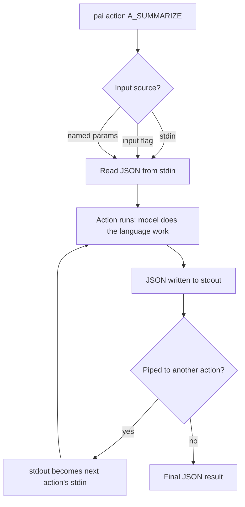

> This system is under active development. APIs, configuration formats, and features may change without notice.

# LifeOS Command-Line Tools

> CLI-first is how the Life OS stays deterministic (`LIFEOS/DOCUMENTATION/LifeOs/LifeOsThesis.md`): the hill-climb's moves are code you can script, test, and trust — prompts orchestrate, code executes.

LifeOS provides the Arbol CLI for running actions and pipelines locally (runtime: `bun`).

> The former Algorithm CLI (LIFEOS/TOOLS/algorithm.ts, now deleted) was RETIRED 2026-07-14 with the phase-machinery deep strip — the Algorithm runs in-session against the ISA; there is no standalone runner.

---

## The Arbol CLI (pai)

> **Not in the public release.** The local Arbol CLI tree (`LIFEOS/ARBOL/` — `Actions/`, `Flows/`, `Pipelines/`) is rsync-excluded from the public release payload, so the `~/.claude/LIFEOS/ARBOL/...` paths and commands below do not exist on a public install. The Arbol *model* (the three primitives, the pipe model, the cloud workers) is public; this local runner tree is not.

**Location:** `~/.claude/LIFEOS/ARBOL/Actions/lifeos.ts`

The Arbol CLI (`pai`) provides a unified interface for running actions and pipelines locally. It supports JSON input via arguments, stdin piping, and UNIX-style action composition.

### Quick Start

```bash
cd ~/.claude/LIFEOS/ARBOL/Actions

# Run an action with inline JSON
bun lifeos.ts action A_EXAMPLE_SUMMARIZE --input '{"content": "Your text here"}'

# Pipe JSON into an action
echo '{"content": "Your text"}' | bun lifeos.ts action A_EXAMPLE_SUMMARIZE

# List all available actions
bun lifeos.ts actions

# List all available pipelines
bun lifeos.ts pipelines

# Show action details
bun lifeos.ts info A_EXAMPLE_SUMMARIZE
```

### Usage

```
pai action <name> [--input '<json>']     Run an action
pai pipeline <name> [--<param> <value>]  Run a pipeline
pai actions                               List all actions
pai pipelines                             List all pipelines
pai info <name>                           Show action/pipeline details
```

### Options

| Option | Short | Description | Default |
|--------|-------|-------------|---------|
| `--mode` | — | Execution mode: `local` or `cloud` | `local` |
| `--input` | — | Input as JSON string | — |
| `--verbose` | `-v` | Show execution details (timing, input/output) | off |

### Input Methods

Actions accept input via three methods (in priority order):

1. **Stdin pipe** — `echo '{"content":"text"}' | bun lifeos.ts action A_EXAMPLE_SUMMARIZE`
2. **`--input` flag** — `bun lifeos.ts action A_EXAMPLE_SUMMARIZE --input '{"content":"text"}'`
3. **Named parameters** — `bun lifeos.ts action A_EXAMPLE_SUMMARIZE --content "text"`

### Action Composition (Pipe Model)

The Arbol CLI outputs JSON to stdout, enabling UNIX-style piping between actions:

```bash
# Summarize, then format the result
bun lifeos.ts action A_EXAMPLE_SUMMARIZE --input '{"content": "Long text..."}' \
  | bun lifeos.ts action A_EXAMPLE_FORMAT
```

This mirrors the pipe model used in pipelines — the output of one action becomes the input of the next. The passthrough pattern (`...upstream` fields) ensures metadata flows through the chain.

### Verbose Mode

Use `-v` to see execution details on stderr (stdout stays clean for piping):

```bash
bun lifeos.ts action A_EXAMPLE_SUMMARIZE --input '{"content": "test"}' -v
# [pai] Running action: A_EXAMPLE_SUMMARIZE
# [pai] Mode: local
# [pai] Input: {"content":"test"}
# [pai] Duration: 1234ms
# {"summary":"...","word_count":42}
```

---

## The Arbol Runner (Low-Level)

**Location:** `~/.claude/LIFEOS/ARBOL/Actions/lib/runner.v2.ts`

The runner is the lower-level engine that the `pai` CLI and pipeline runner both use. You can call it directly:

```bash
cd ~/.claude/LIFEOS/ARBOL/Actions

# Run an action (input as JSON argument)
bun lib/runner.v2.ts run A_EXAMPLE_SUMMARIZE '{"content": "Your text here"}'

# List all registered actions
bun lib/runner.v2.ts list
```

### Response Format

```json
{
  "success": true,
  "output": {
    "summary": "The text discusses...",
    "word_count": 42
  },
  "metadata": {
    "durationMs": 1234,
    "action": "A_EXAMPLE_SUMMARIZE",
    "version": "1.0.0"
  }
}
```

---

## The Pipeline Runner

**Location:** `~/.claude/LIFEOS/ARBOL/Actions/lib/pipeline-runner.ts`

The pipeline runner loads YAML pipeline definitions and chains actions sequentially.

```bash
cd ~/.claude/LIFEOS/ARBOL/Actions

# Run a pipeline with named parameters
bun lib/pipeline-runner.ts run P_EXAMPLE_SUMMARIZE_AND_FORMAT --content "Your text here"

# List all pipelines
bun lib/pipeline-runner.ts list
```

### Pipeline YAML Format

```yaml
name: P_EXAMPLE_SUMMARIZE_AND_FORMAT
description: >
  Summarizes text and formats the result as structured markdown.

actions:
  - A_EXAMPLE_SUMMARIZE
  - A_EXAMPLE_FORMAT
```

The runner pipes data through each action sequentially: the output of action N becomes the input of action N+1.

### Action Resolution

Both the runner and pipeline runner search for actions in two locations (in priority order):

1. **`LIFEOS/USER/CUSTOMIZATIONS/ARBOL/ACTIONS/`** — Personal actions (override system actions)
2. **`LIFEOS/ARBOL/Actions/`** — System/framework actions (includes examples)

Similarly, pipelines are searched in:

1. **`LIFEOS/USER/CUSTOMIZATIONS/ARBOL/PIPELINES/`** — Personal pipelines
2. **`LIFEOS/ARBOL/Pipelines/`** — System/framework pipelines

This two-tier resolution means you can create personal actions and pipelines that extend or override the built-in examples.

---

## Setting Up Shell Aliases

For convenience, add aliases to your shell configuration (`.zshrc`, `.bashrc`):

```bash
# The Arbol CLI
alias pai="bun ~/.claude/LIFEOS/ARBOL/Actions/lifeos.ts"

# Runners (optional — pai CLI wraps these)
alias arbol-run="bun ~/.claude/LIFEOS/ARBOL/Actions/lib/runner.v2.ts"
alias arbol-pipe="bun ~/.claude/LIFEOS/ARBOL/Actions/lib/pipeline-runner.ts"
```

Then use:

```bash
pai action A_EXAMPLE_SUMMARIZE --input '{"content": "text"}'
pai actions
```

---

## Summary

| Tool | Purpose | Command |
|------|---------|---------|
| **Arbol CLI (pai)** | Run actions and pipelines | `bun ACTIONS/lifeos.ts action <name>` |
| **Runner** | Low-level action execution | `bun ACTIONS/lib/runner.v2.ts run <action>` |
| **Pipeline Runner** | Chain actions via YAML | `bun ACTIONS/lib/pipeline-runner.ts run <pipeline>` |

---

## Examples

### One task, run as a command instead of a prompt

Say you want to summarize a block of text and then format the result. You could ask a model to "summarize this and format it" and get a slightly different shape every time. Or you run it as two deterministic actions piped together:

```bash
echo '{"content": "Long text..."}' \
  | bun lifeos.ts action A_EXAMPLE_SUMMARIZE \
  | bun lifeos.ts action A_EXAMPLE_FORMAT
```

The summarize action emits JSON to stdout; that JSON is the format action's stdin. Same input, same command, same output shape — every run. The plumbing between the steps is code, not a prompt, so it can be scripted, tested, and dropped into a pipeline unchanged. The model does the language work inside an action; the CLI owns the wiring.

### The same action, three ways in

An action doesn't care how its input arrives — it resolves one, in priority order, so the same command fits an interactive shell, a script, or a natural-language request:

- **Stdin pipe** — `echo '{"content":"..."}' | bun lifeos.ts action A_EXAMPLE_SUMMARIZE` (for chaining).
- **`--input` flag** — `bun lifeos.ts action A_EXAMPLE_SUMMARIZE --input '{"content":"..."}'` (for a scripted single call).
- **Named params** — `bun lifeos.ts action A_EXAMPLE_SUMMARIZE --content "..."` (readable when typed by hand).

Reach for stdin when composing, the flag when scripting one call, named params when a human is typing it.

### How input resolves and output flows



Because every action reads JSON and writes JSON, actions compose like UNIX tools — the arrow between two of them is just a pipe. That's what makes the CLI the deterministic backbone: prompts decide *which* actions to run, the actions and their plumbing decide *how*, and the how never drifts.

---

## Related Documentation

| Document | Path | Description |
|----------|------|-------------|
| System Architecture | `LIFEOS/DOCUMENTATION/LifeosSystemArchitecture.md` | Master architecture reference |
| Arbol Overview | `LIFEOS/DOCUMENTATION/Arbol/ArbolSystem.md` | Arbol system architecture |
| Tools Reference | `LIFEOS/DOCUMENTATION/Tools/Tools.md` | CLI utility tools |

---

**Last Updated:** 2026-07-14
