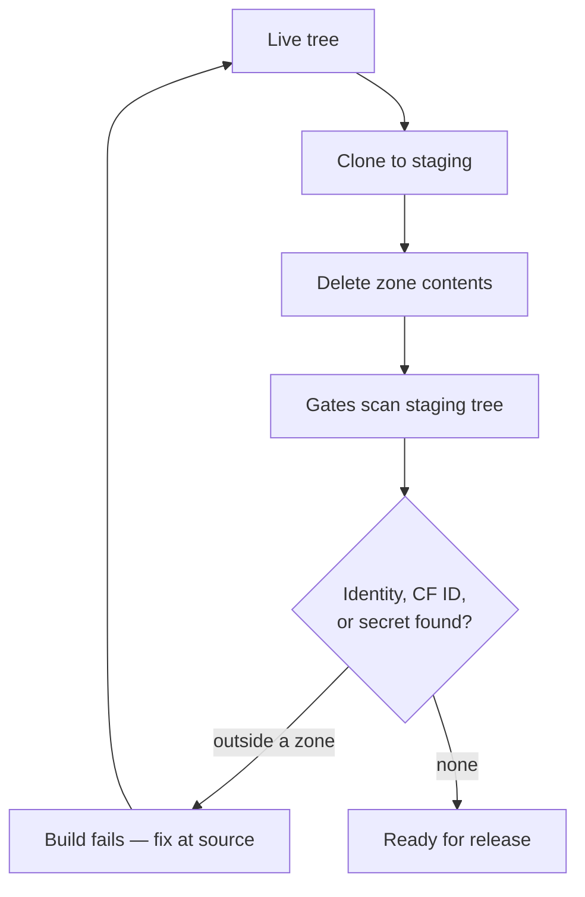

# LifeOS Containment Policy

> Containment zones draw the Life OS boundary at release time (`LIFEOS/DOCUMENTATION/LifeOs/LifeOsThesis.md`): the OS ships; the life never does.

**Status:** Authoritative. Contributors and future DA sessions read this before adding a new file.
**Enforcement:** two points. (1) The release pipeline's containment gates (G1-G14 + G17-G21, release-build time). (2) `hooks/SystemFileGuard.hook.ts` — a runtime PreToolUse Write/Edit gate that reads the same zone inventory (restored 2026-05-21 in Phase E of the system/user separation rebuild; it superseded the 2026-05-06 "release-build only" consolidation, which had removed the prospective `ContainmentGuard.hook.ts`).
**Zone inventory (authoritative):** `hooks/lib/containment-zones.ts` — the source of truth ShadowRelease imports.
**Last updated:** 2026-05-10

---

## The policy in one sentence

**Anything in the LifeOS tree that is not inside one of the currently-configured containment zones must be clean of personal identity, credentials, and infrastructure IDs.**

That is the rule. Everything else on this page is either a definition, a consequence, or a procedure.

---

## Zones are a living inventory, not a fixed set

There is no magic number of zones. LifeOS evolves — new sensitive surfaces appear, old ones get retired or relocated — and the zone list must keep up. The snapshot below reflects what's in `hooks/lib/containment-zones.ts` right now; check that file for the truth of the moment.

Today's zones:

| Name | Pattern(s) | What lives here |
|------|-----------|-----------------|
| `user-data` | `LIFEOS/USER/**` | Principal identity, TELOS, credentials, personal infra, contacts, finances, health, business |
| `config-secrets` | `settings.json`, `settings.local.json`, `.vscode/settings.json`, `.env`, `.env.*`, `LIFEOS/.env`, `LIFEOS/.env.*` | API tokens, allowed command lists, MCP auth |
| `runtime-memory` | `LIFEOS/MEMORY/**` | Work sessions, learnings, observability, research, raw data, bookmarks, relationship notes |
| `private-skills` | `skills/_*/**` (underscore prefix) | Principal-specific and proprietary skills |
| `install-state` | `history.jsonl`, `Plugins/**`, `plugins/installed_plugins.json`, `plugins/known_marketplaces.json` | Claude Code runtime install state written by the harness |
| `private-infra` | `LIFEOS/ARBOL/**`, `LIFEOS/PULSE/Assistant/**`, `LIFEOS/PULSE/Plans/**`, `LIFEOS/PULSE/logs/**`, `LIFEOS/PULSE/state/**`, `LIFEOS/PULSE/Observability/out/**`, `LIFEOS/PULSE/.playwright-cli/**`, `LIFEOS/ScheduledTasks/**` | Top-level private infrastructure: cloud worker source, DA-specific assistant, planning docs, runtime logs/state, rendered HTML, scheduled tasks |

The underscore-prefix rule for `private-skills` is the interface contract. If a skill name does NOT start with `_`, that skill directory must be clean enough to ship to strangers.

---

## Mandatory zone review before every shadow release

Zones drift. Before running `ShadowRelease --create <version>`:

1. Open `hooks/lib/containment-zones.ts`.
2. Walk `~/.claude/` at depth 1-2 (e.g. `ls -la && ls -la LIFEOS/ && ls -la skills/`) and compare against the zone list.
3. Ask, for every new top-level or first-nested dir since the last release:
    - Does it contain anything principal-specific? → **Add a zone or extend an existing one.**
    - Is it runtime state the harness writes? → **Add it to `install-state` or the RSYNC_EXCLUDES in `ShadowRelease.ts`.**
    - Is it clean-by-construction and intended for public? → **Leave it; document via README if its purpose is ambiguous.**
4. Update `CONTAINMENT_ZONES` and/or `PATTERN_ALLOWLIST_FILES` in `hooks/lib/containment-zones.ts` accordingly.
5. Commit the zone change BEFORE the shadow-release commit. The zone file is the contract; the release gates verify against it. Releasing against a stale contract is the failure mode this step exists to prevent.

**Rule of thumb:** if you look at the zone file and you cannot immediately tell that it matches reality, stop and reconcile before building a release.

---

## What "clean" means outside the zones

A file outside every configured zone is a policy violation if it contains any of:

- **Identity** — absolute user paths, personal email, personal domain names, principal-specific hostnames
- **Infrastructure IDs** — Cloudflare account or KV namespace IDs, ElevenLabs voice IDs, launchd bundle IDs, any UUID that identifies a specific account or resource
- **Secrets** — API tokens, private keys (`.pem`, `.key`), session cookies, OAuth refresh tokens

The `ShadowRelease --check` gates enforce all three categories at release-build time; `SystemFileGuard.hook.ts` enforces the zone boundary at write time between releases.

The concrete patterns live in the release pipeline's `ShadowRelease.ts` (`IDENTITY_PATTERNS` + `CF_ID_PATTERNS`). When a new principal-specific string enters the threat model, add it there.

---

## How to handle common situations

### I am writing a new file and it needs to reference the principal

Use `${HOME}`, `${LIFEOS_DIR}`, `${LIFEOS_DIR}`, or a configurable placeholder. Never hard-code absolute paths containing the principal's username in a public file.

### I am writing a new file and it needs secrets

1. Load from `process.env.X` at runtime.
2. Document the var name in the file itself, no default value that contains the secret.
3. Fallback path: read from `~/.claude/.env` directly (file is the canonical env source; on the dev machine `LIFEOS/.env` and `~/.config/LIFEOS/.env` are symlinks to it, but the installer does NOT create those symlinks — never compute the path as `$LIFEOS_CONFIG_DIR/.env`, which resolves to a file public installs don't have; public issue #1490). Use Node `fs.readFileSync` + a small parser, not a shared helper — no central env helper exists by design.
4. If the secret lookup misses, emit a single stderr warning and degrade gracefully — never silently continue with an empty string.

### I am adding personal notes, work sessions, or memory

Put them under `LIFEOS/MEMORY/**` (`runtime-memory`) or `LIFEOS/USER/**` (`user-data`) depending on whether they're system-captured or principal-authored.

### I am adding a new skill

- If the skill is general-purpose and intended for public users, put it at `skills/{Name}/` (no underscore). All content must follow the clean-outside-zones rule.
- If the skill is principal-specific (private email, calendar, personal finances, private data sources), put it at `skills/_{NAME}/` with the underscore prefix. The `_` is the interface contract — the release pipeline deletes all `skills/_*/` wholesale.

### I am adding a new top-level dir that should be private

Add its pattern to `CONTAINMENT_ZONES` in `hooks/lib/containment-zones.ts` (create a new zone or extend an existing one), then commit. The release gates pick up the new zone automatically.

### I am writing documentation that references the principal as author

Two patterns, pick one:

- **Genericize:** no principal name in the prose. Describe the role, not the person.
- **Frame as example:** explicitly mark principal-authored artifacts as examples the reader can adapt.

Do not write docs that assume the reader IS the principal. The LifeOS public release has an unknown future user as the reader.

### The file must contain a pattern in order to detect or block it

Example: the release pipeline's `ShadowRelease.ts` has to embed principal patterns to scan for them at release time. That is a legitimate exception.

Record such files in `PATTERN_ALLOWLIST_FILES` in `hooks/lib/containment-zones.ts`, with a note in the living appendix below explaining why the exception exists.

---

## Release pipeline — how the policy is verified

1. **Zone review** — per the mandatory step above. Happens before anything else.
2. **Source audit** — grep the live tree against the identity plus CF-ID pattern list. Every hit outside the configured zones is a policy violation; fix at source (sanitize, relocate, or allowlist with justification).
3. **Staging build** — the release pipeline's `ShadowRelease.ts --create <version>` clones the live tree with hard rsync exclusions, deletes zone contents (preserving only top-level READMEs as scaffold), overlays the public `settings.json`, `CLAUDE.md`, and `LIFEOS_CONFIG.yaml` templates. This `.claude/` tree is an intermediate: `EmitSkill.ts` then reshapes it into the shippable `LifeOS/` skill, so the published release is that emitted skill, not the tree-clone itself.
4. **The containment gates run against the staging tree (G1-G14 + G17-G21 — see the release pipeline's `GateKey` type for the canonical roster; G1-G14 listed here):**
    - **G1 — Zone deletion:** required public READMEs survive; forbidden personal files and persona dirs do not.
    - **G2 — Identity grep:** no identity patterns in the staging tree (except allowlisted files).
    - **G3 — CF ID grep:** no hardcoded CF account or KV namespace IDs (except allowlisted files).
    - **G4 — trufflehog:** no live secrets detected; gate marked skipped (not failed) when trufflehog isn't installed.
    - **G5 — .env strays:** no `.env*` files survived rsync exclusion.
    - **G6 — Private tokens:** no principal-specific identity-bound tokens (voice IDs, chat/bot IDs) outside allowlist.
    - **G7 — Reference integrity:** `ReferenceCheck.ts` on the live tree reports zero missing refs; a broken ref in source means the release would ship with a 404 link.
    - **G8 — Private skill refs:** no references to `_*` skills in the staged public tree (the `_` prefix is the privacy contract; refs to those skills mean the public release expects something it deleted).
    - **G9 — Username-path leak:** no absolute `/Users/<name>/` or principal hostname paths survived.
    - **G10 — Staging boot:** structural sanity — the staging tree contains the files a fresh-install harness needs to boot.
    - **G11 — Dashboard leak:** the prebuilt Observability dashboard under `LIFEOS/PULSE/Observability/out/` contains no identity patterns; gate skipped if `out/` isn't present.
    - **G12 — Template-only USER/MEMORY:** the staged `LIFEOS/USER/` and `LIFEOS/MEMORY/` trees contain only template scaffolds plus the explicit `LIVE_SOURCED_USER_FILES` allowlist.
    - **G13 — Hidden-file leakage:** deny-by-default scan of the staged tree for hidden entries (basenames starting with `.`) not in the small explicit `HIDDEN_ENTRY_ALLOWLIST`. Catches IDE configs, runtime caches, OS metadata, tool-specific state.
    - **G14 — Critical artifacts:** verifies the install-path-critical files survived build + scrub. If any are missing the install boots broken (dashboard 404, wizard missing, no settings template).
5. **Pass all fourteen → READY FOR RELEASE.** Any fail → fix source or refine exclusions; never hide with allowlist unless the file legitimately needs the pattern.
6. **Public publish is a separate step.** The shippable release artifact is the self-contained `LIFEOS/LIFEOS_RELEASES/{VERSION}/LifeOS/` skill (emitted from the staging tree; the `.claude/` staging clone is dropped after emit). It stays under `LIFEOS/LIFEOS_RELEASES/{VERSION}/` until a deliberate publish action ships it to the public repo.

---

## Shrinking-allowlist discipline

`PATTERN_ALLOWLIST_FILES` in `hooks/lib/containment-zones.ts` lists files the enforcers skip. **Every entry is a TODO**, not a feature. The ideal end state is the minimum set of files that must embed patterns in order to detect or document them.

Every other entry should be removed by sanitizing the source file (preferred) or relocating it into a zone. Before adding a new allowlist entry, add a row to the living appendix below explaining why sanitization is not feasible.

---

## Living appendix — currently-allowlisted files and their disposition

Populated by the audit. Updated as files are sanitized or relocated.

| File | Reason listed | Disposition |
|------|---------------|-------------|
| `hooks/lib/containment-zones.ts` | Zone inventory module ShadowRelease imports from | **KEEP** — legitimate exception |
| the release pipeline's `ShadowRelease.ts` | Release tool must embed patterns for G2/G3 gates | **KEEP** — legitimate exception |
| `LIFEOS/DOCUMENTATION/Tools/Containment.md` | Policy doc describes zones and references patterns categorically | **KEEP** — legitimate exception |
| `skills/Daemon/Docs/SecurityClassification.md` | Documents the exact path patterns the Daemon filter should scrub | **KEEP** — legitimate exception |
| `skills/Daemon/Tools/SecurityFilter.ts` | Pattern inspector test cases embed the patterns they filter | **KEEP** — legitimate exception |
| `skills/CreateSkill/Workflows/ValidateSkill.md` | Lists example patterns a skill author should NOT hardcode | **KEEP** — legitimate exception |
| `LIFEOS/TOOLS/SessionHarvester.ts` | Comment references derivation, not literal path | **KEEP** — uses `CLAUDE_DIR.replace(...)` dynamically |
| `LIFEOS/TOOLS/gmail.ts` | Uses `homedir()` at runtime, not a literal path | **KEEP** — dynamic resolution |
| `LIFEOS/PULSE/checks/health.ts` | Hardcoded site list for health monitoring | **TODO-REFACTOR** — move site list to `LIFEOS_CONFIG.yaml`, read at startup |
| `agents/<agent>.md` | Write-permission path literals in agent definitions | **TODO-REFACTOR** — verify env-expansion support in Claude Code agent spec, then replace with `${HOME}/.claude/...` |

---

## Updating this policy

Edit this file directly. Commit with a message that starts with `policy:` so it's easy to find in git log. After any policy change, re-run `ShadowRelease --create <version>` and verify no gates regress.

---

## Examples

### One string, caught before the world sees it

A contributor adds a troubleshooting doc under `LIFEOS/DOCUMENTATION/` and, to make the fix copy-pasteable, drops in the exact command they ran — which includes an absolute home path and a Cloudflare account ID. The doc sits outside every containment zone, so it must be clean. It isn't.

Nothing happens at write time; there is no runtime guard. The catch comes at release build. `ShadowRelease --create` clones the tree, and the gates scan the staging copy: **G9** flags the `/Users/<name>/…` path, **G3** flags the account ID. The build stops with both hits named. The fix is at the source, never the allowlist — swap the path for `${HOME}` and load the ID from `process.env` at runtime. Re-run, gates green, ship.

### Where a string lives decides whether it's a problem

The same account ID is harmless or fatal depending only on where it sits:

- **Inside a zone** — a file under `LIFEOS/USER/**` or a `skills/_*/**` dir can hold real IDs, paths, and tokens. The release deletes those zones wholesale, so the bytes never reach the public tree. No violation.
- **Outside every zone** — the identical string in a public-tree doc is a policy violation, because that file ships.

Placement is the whole game: put private content in a zone, or genericize it in prose. The one narrow exception is a file that must embed a pattern *in order to detect it* — the scanner itself, this policy doc. Those are listed in the allowlist, and every entry there is a standing TODO, not a blessing.

The diagram shows why placement is everything: zone contents are gone before the scan runs, so the gates only ever see what is meant to be public — and any private string that survives into that tree stops the build.

---
