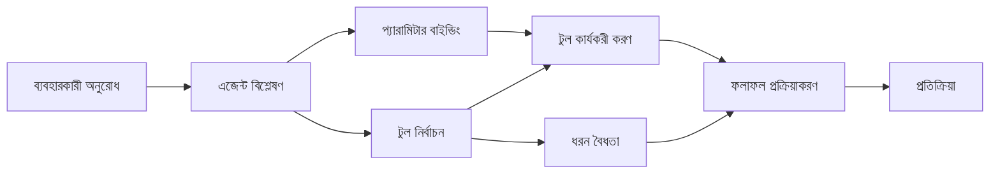

# 🛠️ Azure OpenAI (Responses API) (.NET) সহ উন্নত টুল ব্যবহারের কৌশল

## 📋 শেখার উদ্দেশ্য

এই নোটবুকটি .NET এ Microsoft Agent Framework ব্যবহার করে Azure OpenAI (Responses API) সহ এন্টারপ্রাইজ-গ্রেড টুল ইন্টিগ্রেশন প্যাটার্নগুলি প্রদর্শন করে। আপনি শেখবেন আধুনিক এজেন্ট তৈরি করতে যাদের মধ্যে একাধিক বিশেষায়িত টুল থাকবে, C# এর স্ট্রং টাইপিং এবং .NET এর এন্টারপ্রাইজ ফিচারগুলি কাজে লাগিয়ে।

### আপনি যে উন্নত টুল সক্ষমতা আয়ত্ত করবেন

- 🔧 **মাল্টি-টুল আর্কিটেকচার**: একাধিক বিশেষায়িত ক্ষমতাসম্পন্ন এজেন্ট তৈরি
- 🎯 **টাইপ-সেফ টুল এক্সিকিউশন**: C# এর কম্পাইল-টাইম ভ্যালিডেশন ব্যবহার
- 📊 **এন্টারপ্রাইজ টুল প্যাটার্ন**: প্রোডাকশন-রেডি টুল ডিজাইন এবং এরর হ্যান্ডলিং
- 🔗 **টুল কম্পোজিশন**: জটিল ব্যবসায়িক ওয়ার্কফ্লোর জন্য টুল সংমিশ্রণ

## 🎯 .NET টুল আর্কিটেকচারের সুবিধাসমূহ

### এন্টারপ্রাইজ টুল ফিচারস

- **কম্পাইল-টাইম ভ্যালিডেশন**: স্ট্রং টাইপিং টুল প্যারামিটার সঠিকতা নিশ্চিত করে
- **ডিপেন্ডেন্সি ইনজেকশন**: টুল ব্যবস্থাপনার জন্য IoC কন্টেইনার ইন্টিগ্রেশন
- **অ্যাসিঙ্ক/অ্যাওয়েট প্যাটার্ন**: যথাযথ রিসোর্স ব্যবস্থাপনাসহ নন-ব্লকিং টুল এক্সিকিউশন
- **স্ট্রাকচার্ড লগিং**: টুল এক্সিকিউশন মনিটরিংয়ের জন্য বিল্ট-ইন লগিং ইন্টিগ্রেশন

### প্রোডাকশন-রেডি প্যাটার্ন

- **এক্সসেপশন হ্যান্ডলিং**: টাইপড এক্সসেপশন সহ ব্যাপক ত্রুটি ব্যবস্থাপনা
- **রিসোর্স ব্যবস্থাপনা**: সঠিক ডিসপোজাল প্যাটার্ন এবং মেমরি ব্যবস্থাপনা
- **পারফরম্যান্স মনিটরিং**: বিল্ট-ইন মেট্রিক এবং পারফরম্যান্স কাউন্টারস
- **কনফিগারেশন ব্যবস্থাপনা**: যাচাইকরণের সাথে টাইপ-সেফ কনফিগারেশন

## 🔧 প্রযুক্তিগত আর্কিটেকচার

### মূল .NET টুল কম্পোনেন্টসমূহ

- **Microsoft.Extensions.AI**: সমন্বিত টুল অ্যাবস্ট্রাকশন লেয়ার
- **Microsoft.Agents.AI**: এন্টারপ্রাইজ-গ্রেড টুল অর্কেস্ট্রেশন
- **Azure OpenAI (Responses API)**: সংযোগ পুলিং সহ উচ্চ-পারফরম্যান্স API ক্লায়েন্ট

### টুল এক্সিকিউশন পাইপলাইন



## 🛠️ টুল বিভাগ ও প্যাটার্ন

### ১. **ডেটা প্রসেসিং টুলস**

- **ইনপুট ভ্যালিডেশন**: ডেটা অ্যানোটেশনের মাধ্যমে স্ট্রং টাইপিং
- **ট্রান্সফর্ম অপারেশনস**: টাইপ-সেফ ডেটা রূপান্তর এবং ফরম্যাটিং
- **বিজনেস লজিক**: ডোমেইন-নির্দিষ্ট হিসাব এবং বিশ্লেষণ টুলস
- **আউটপুট ফরম্যাটিং**: কাঠামোগত রেসপন্স জেনারেশন

### ২. **ইন্টিগ্রেশন টুলস**

- **এপিআই কানেক্টরস**: HttpClient সহ RESTful সার্ভিস ইন্টিগ্রেশন
- **ডেটাবেস টুলস**: ডেটা অ্যাক্সেসের জন্য Entity Framework ইন্টিগ্রেশন
- **ফাইল অপারেশনস**: যাচাইকরণের সাথে সুরক্ষিত ফাইল সিস্টেম অপারেশন
- **বাহ্যিক সার্ভিসেস**: তৃতীয় পক্ষের সার্ভিস ইন্টিগ্রেশন প্যাটার্ন

### ৩. **ইউটিলিটি টুলস**

- **টেক্সট প্রসেসিং**: স্ট্রিং ম্যানিপুলেশন এবং ফরম্যাটিং ইউটিলিটি
- **তারিখ/সময় অপারেশনস**: সংস্কৃতি-সচেতন তারিখ/সময় হিসাব
- **গাণিতিক টুলস**: прিসিশন হিসাব এবং স্ট্যাটিস্টিক্যাল অপারেশনস
- **ভ্যালিডেশন টুলস**: ব্যবসায়িক নিয়ম যাচাইকরণ এবং ডেটা যাচাই

শক্তিশালী, টাইপ-সেফ টুল সক্ষমতাসহ এন্টারপ্রাইজ-গ্রেড এজেন্ট তৈরির জন্য প্রস্তুত? চলুন কিছু পেশাদার-গ্রেড সমাধান ডিজাইন করি! 🏢⚡

## 🚀 শুরু করা যাক

### প্রাথমিক শর্তাবলী

- [.NET 10 SDK](https://dotnet.microsoft.com/download/dotnet/10.0) বা তার উপরে
- একটি [Azure সাবস্ক্রিপশন](https://azure.microsoft.com/free/) যার সাথে Azure OpenAI রিসোর্স এবং একটি মডেল ডিপ্লয়মেন্ট আছে
- [Azure CLI](https://learn.microsoft.com/cli/azure/install-azure-cli) — `az login` দিয়ে সাইন ইন করুন

### প্রয়োজনীয় পরিবেশ ভেরিয়েবলসমূহ

```bash
# zsh/bash
export AZURE_OPENAI_ENDPOINT=https://<your-resource>.openai.azure.com
export AZURE_OPENAI_DEPLOYMENT=gpt-5-mini
# তারপর সাইন ইন করুন যাতে AzureCliCredential একটি টোকেন পেতে পারে
az login
```

```powershell
# পাওয়ারশেল
$env:AZURE_OPENAI_ENDPOINT = "https://<your-resource>.openai.azure.com"
$env:AZURE_OPENAI_DEPLOYMENT = "gpt-5-mini"
# তারপর সাইন ইন করুন যাতে AzureCliCredential একটি টোকেন পেতে পারে
az login
```

### উদাহরণ কোড

কোডটি চালাতে,

```bash
# জেডএসএইচ/ব্যাশ
chmod +x ./04-dotnet-agent-framework.cs
./04-dotnet-agent-framework.cs
```

অথবা dotnet CLI ব্যবহার করে:

```bash
dotnet run ./04-dotnet-agent-framework.cs
```

সম্পূর্ণ কোডের জন্য দেখুন [`04-dotnet-agent-framework.cs`](../../../../04-tool-use/code_samples/04-dotnet-agent-framework.cs)।

```csharp
#!/usr/bin/dotnet run

#:package Microsoft.Extensions.AI@10.*
#:package Microsoft.Agents.AI.OpenAI@1.*-*
#:package Azure.AI.OpenAI@2.1.0
#:package Azure.Identity@1.13.1

using System.ComponentModel;

using Microsoft.Agents.AI;
using Microsoft.Extensions.AI;

using Azure.AI.OpenAI;
using Azure.Identity;

// Tool Function: Random Destination Generator
// This static method will be available to the agent as a callable tool
// The [Description] attribute helps the AI understand when to use this function
// This demonstrates how to create custom tools for AI agents
[Description("Provides a random vacation destination.")]
static string GetRandomDestination()
{
    // List of popular vacation destinations around the world
    // The agent will randomly select from these options
    var destinations = new List<string>
    {
        "Paris, France",
        "Tokyo, Japan",
        "New York City, USA",
        "Sydney, Australia",
        "Rome, Italy",
        "Barcelona, Spain",
        "Cape Town, South Africa",
        "Rio de Janeiro, Brazil",
        "Bangkok, Thailand",
        "Vancouver, Canada"
    };

    // Generate random index and return selected destination
    // Uses System.Random for simple random selection
    var random = new Random();
    int index = random.Next(destinations.Count);
    return destinations[index];
}

// Azure OpenAI with the Responses API (stable v1 endpoint). Sign in with `az login`.
var azureEndpoint = Environment.GetEnvironmentVariable("AZURE_OPENAI_ENDPOINT")
    ?? throw new InvalidOperationException("AZURE_OPENAI_ENDPOINT is not set.");
var deployment = Environment.GetEnvironmentVariable("AZURE_OPENAI_DEPLOYMENT") ?? "gpt-5-mini";

var azureClient = new AzureOpenAIClient(new Uri(azureEndpoint), new AzureCliCredential());

// Define Agent Identity and Comprehensive Instructions
// Agent name for identification and logging purposes
var AGENT_NAME = "TravelAgent";

// Detailed instructions that define the agent's personality, capabilities, and behavior
// This system prompt shapes how the agent responds and interacts with users
var AGENT_INSTRUCTIONS = """
You are a helpful AI Agent that can help plan vacations for customers.

Important: When users specify a destination, always plan for that location. Only suggest random destinations when the user hasn't specified a preference.

When the conversation begins, introduce yourself with this message:
"Hello! I'm your TravelAgent assistant. I can help plan vacations and suggest interesting destinations for you. Here are some things you can ask me:
1. Plan a day trip to a specific location
2. Suggest a random vacation destination
3. Find destinations with specific features (beaches, mountains, historical sites, etc.)
4. Plan an alternative trip if you don't like my first suggestion

What kind of trip would you like me to help you plan today?"

Always prioritize user preferences. If they mention a specific destination like "Bali" or "Paris," focus your planning on that location rather than suggesting alternatives.
""";

// Create AI Agent with Advanced Travel Planning Capabilities
// Get the Responses client for the deployment and create the AI agent
// Configure agent with name, detailed instructions, and available tools
// This demonstrates the .NET agent creation pattern with full configuration
AIAgent agent = azureClient
    .GetChatClient(deployment)
    .AsAIAgent(
        name: AGENT_NAME,
        instructions: AGENT_INSTRUCTIONS,
        tools: [AIFunctionFactory.Create(GetRandomDestination)]
    );

// Create New Conversation Session for Context Management
// Initialize a new conversation session to maintain context across multiple interactions
// Sessions enable the agent to remember previous exchanges and maintain conversational state
// This is essential for multi-turn conversations and contextual understanding
await using var session = await agent.CreateSessionAsync();

// Execute Agent: First Travel Planning Request
// Run the agent with an initial request that will likely trigger the random destination tool
// The agent will analyze the request, use the GetRandomDestination tool, and create an itinerary
// Using the session parameter maintains conversation context for subsequent interactions
await foreach (var update in agent.RunStreamingAsync("Plan me a day trip", session))
{
    await Task.Delay(10);
    Console.Write(update);
}

Console.WriteLine();

// Execute Agent: Follow-up Request with Context Awareness
// Demonstrate contextual conversation by referencing the previous response
// The agent remembers the previous destination suggestion and will provide an alternative
// This showcases the power of conversation sessions and contextual understanding in .NET agents
await foreach (var update in agent.RunStreamingAsync("I don't like that destination. Plan me another vacation.", session))
{
    await Task.Delay(10);
    Console.Write(update);
}
```

---

<!-- CO-OP TRANSLATOR DISCLAIMER START -->
**অস্বীকৃতি**:
এই নথিটি AI অনুবাদ পরিষেবা [Co-op Translator](https://github.com/Azure/co-op-translator) ব্যবহার করে অনূদিত হয়েছে। যদিও আমরা শুদ্ধতার জন্য চেষ্টা করি, অনুগ্রহ করে মনে রাখবেন যে স্বয়ংক্রিয় অনুবাদে ত্রুটি বা অসঙ্গতি থাকতে পারে। মূল নথিটি তার স্বভাষায় কর্তৃত্বপূর্ণ উৎস হিসেবে বিবেচিত হওয়া উচিত। গুরুত্বপূর্ণ তথ্যের জন্য পেশাদার মানব অনুবাদ সুপারিশ করা হয়। এই অনুবাদের ব্যবহারে প্রয়োজনীয় ভুল বোঝাবুঝি বা ভুল ব্যাখ্যার জন্য আমরা দায়বদ্ধ নই।
<!-- CO-OP TRANSLATOR DISCLAIMER END -->