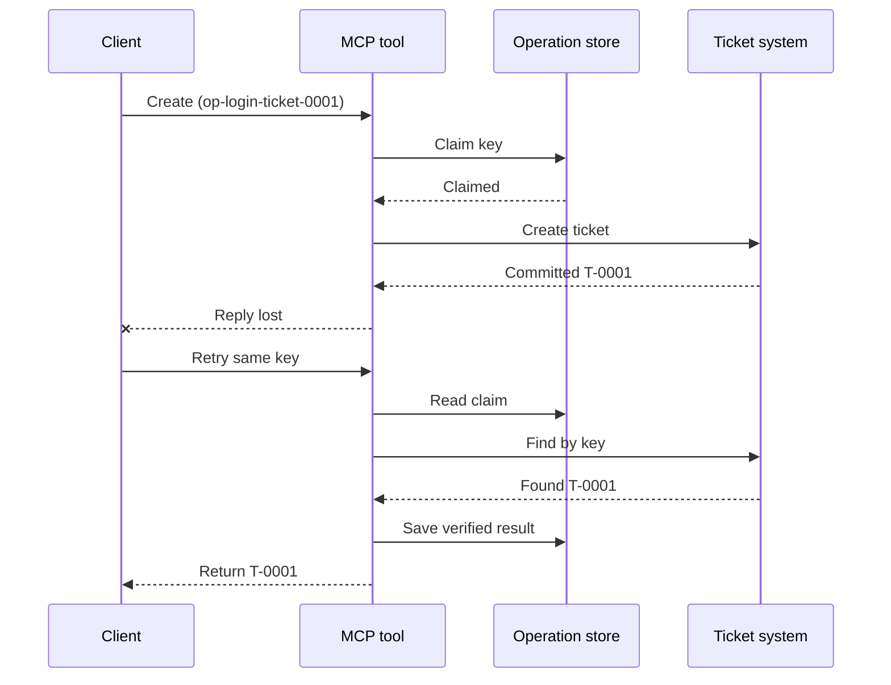
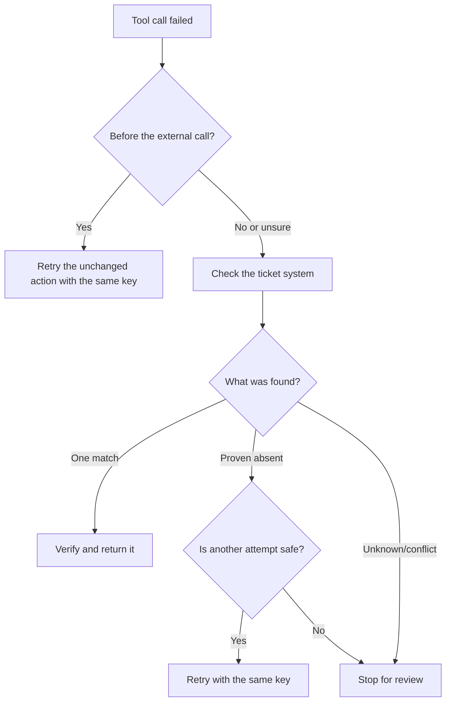

# Safe Retries for MCP Tools: A Reliability Sidecar Pattern

A missing response does not mean the action is missing. A support-ticket tool
may create ticket `T-0001` and then lose its connection before the client sees
the result. If the client retries blindly, it may create `T-0002`.

This lesson shows how to recognize that uncertain outcome, keep one stable
identity for the intended action, and check the ticket system before trying
again. The accompanying Python exercise runs locally with the standard library
and SQLite.

## Why a Timeout Means "Outcome Unknown"

Suppose the client calls `create_support_ticket` with operation key
`op-login-ticket-0001`:



The connection fails after the ticket commits but before the result arrives.
The client knows only that the reply is missing. It does not know whether the
ticket is missing. Reusing the operation key lets the tool find and return
`T-0001` instead of creating `T-0002`.

## What a Reliability Sidecar Does

A reliability sidecar is application code that keeps recovery state around a
tool. It might be a library, middleware, a database-backed service, or simply
part of the tool implementation. It does not have to be a separate process,
and it is not an MCP protocol feature.

The sidecar has four jobs:

1. save the intended action before calling the external system;
2. let only one worker claim that action;
3. remember enough state to recover after a crash; and
4. check the external system when the outcome is uncertain.

This lesson targets the final MCP specification `2026-07-28`. MCP has no
protocol-level session, so the operation key is an ordinary tool argument
backed by durable application state. The same pattern also works with earlier
MCP versions.

## Four IDs That Solve Different Problems

These identifiers are related, but they are not interchangeable:

| Identifier | What it identifies | Survives a retry? |
| --- | --- | --- |
| JSON-RPC ID | One request and response | No; use a new request ID |
| MCP Task ID | One long-running task | Yes; keep it for polling |
| Operation key | One intended action | Yes; reuse it for that action |
| Ticket ID | The stored result | Yes; return it after verification |

Progress notifications and trace context help you observe a request.
Cancellation asks work to stop. None of them prevents a duplicate ticket.

## Build the Guard

Create the operation key before the first tool call and save it with the
workflow. Every attempt to create the same intended ticket uses the same key:

```json
{
  "operation_key": "op-login-ticket-0001",
  "title": "Cannot sign in"
}
```

A different intended ticket gets a new key. In production, generate an opaque,
unguessable value instead of putting customer data into the key.

Here is the complete MCP tool schema used in this lesson:

```json
{
  "name": "create_support_ticket",
  "title": "Create support ticket",
  "description": "Creates or recovers one support ticket for an operation key.",
  "inputSchema": {
    "$schema": "https://json-schema.org/draft/2020-12/schema",
    "type": "object",
    "properties": {
      "operation_key": {
        "type": "string",
        "minLength": 16,
        "maxLength": 128,
        "description": "Stable key reused for the same intended action."
      },
      "title": {
        "type": "string",
        "minLength": 1,
        "maxLength": 200
      }
    },
    "required": ["operation_key", "title"],
    "additionalProperties": false
  },
  "outputSchema": {
    "$schema": "https://json-schema.org/draft/2020-12/schema",
    "type": "object",
    "properties": {
      "ticket_id": {
        "type": "string"
      },
      "operation_key": {
        "type": "string"
      },
      "status": {
        "type": "string",
        "const": "verified"
      }
    },
    "required": ["ticket_id", "operation_key", "status"],
    "additionalProperties": false
  }
}
```

The authenticated caller identity comes from server context, not from
model-supplied tool input. Scope each stored operation to:

- that caller, tenant, or service account;
- the tool name and version; and
- a hash of the normalized inputs that define the external action.

The input hash answers a simple question: "Is this retry asking for the same
ticket?" If the key already belongs to a different title, reject the call.
Returning an earlier result for changed input would hide a contract error.

Save the claim with one atomic database operation. "Atomic" means two workers
cannot both observe an empty record and both become the owner. A process-local
lock is not enough when another server instance can receive the retry.

The workflow creates the key while the action is `planned`. The sample then
persists these states:

- `claimed`: one worker has reserved the operation;
- `completed`: the ticket system returned a result; and
- `verified`: a read from the ticket system confirms the result.

A crash can leave the stored state at `claimed` even after the ticket was
created. Treat every nonterminal claim as uncertain until external evidence
settles it. Do not assume that `claimed` means "nothing happened."

## Recover Before You Retry

When a tool call fails, decide what is known before sending another external
write:



Validation that fails before the ticket API is called is a known failure.
Retry an unchanged action with the same operation key. If correcting the input
changes the intended ticket, create a new key for that new action.

If the request may have reached the ticket system, reconcile it first.
Reconciliation means comparing the saved claim with the authoritative ticket
record. Return the existing ticket when exactly one matching record is found.
Retry only when the ticket is conclusively absent and the downstream contract
makes another attempt safe.

"Not found" is not always conclusive. A provider with eventually consistent
search may need a bounded wait and another check. If the system cannot be
searched, gives conflicting results, or cannot safely deduplicate another
attempt, stop and report `outcome unknown`. Stopping here is sometimes called
"failing closed": the workflow refuses to guess.

## Evidence, Tasks, and Cancellation

A tool response says what the tool reported. A stored checkpoint says what the
workflow recorded. The strongest evidence comes from the system that owns the
result: for this example, a read from the ticket system that finds exactly one
matching ticket.

Match the evidence to the risk. A provider message ID may be enough for a
low-risk notification. Payments, deployments, and destructive actions may
need provider status, ledger, or manual review evidence.

The MCP Tasks extension complements this pattern for long-running work. A Task
ID lets the client resume polling after a disconnect, but it does not identify
or deduplicate the ticket itself. When Tasks is used, the identities connect
like this:

```text
operation key -> Task ID -> ticket ID -> verification evidence
```

Cancellation is cooperative, not a rollback. The ticket may still be created
after cancellation is acknowledged, so an uncertain result still needs
reconciliation.

## Run the Failure-Injection Exercise

The sample uses two SQLite files: one represents the operation store and the
other represents the external ticket system. There is no transaction spanning
both files. The failure is injected after the ticket commits but before the
sidecar records completion.

The direct Python method accepts `caller_id` as a stand-in for authenticated
server context. Do not add `caller_id` to the model-controlled MCP input
schema.

Predict the result before running the tests:

| Path | Result after retry | Ticket count |
| --- | --- | --- |
| Blind retry | Creates `T-0002` after losing the response for `T-0001` | 2 |
| Guarded retry | Finds and returns `T-0001` | 1 |

Run:

```bash
cd 08-BestPractices/reliability-sidecars/python
python -m unittest discover -p "test_*.py" -v
```

The six tests show that:

1. a blind retry creates a duplicate;
2. response loss plus a restart recovers one ticket from a durable claim;
3. a verified retry reuses the saved result;
4. changed input or conflicting external evidence is rejected;
5. an existing claim without external evidence stops safely; and
6. concurrent claims admit one owner without regressing a verified result.

Open the sample:

- [Python implementation](./python/reliability_sidecar.py)
- [Deterministic tests](./python/test_reliability_sidecar.py)

The sample intentionally omits stale-claim leases. A production takeover
policy needs a bounded lease, atomic ownership transfer, and another external
check before executing.

## Optional Community Implementation

Agent Enhancer Utilities is one community implementation of this
application-level pattern. Its planner selects a recovery approach, while its
checkpoint records claim and uncertain-result states. The domain tool or MCP
server still performs and verifies the real action. This service is not part
of the MCP specification and is not required for this lesson.

| Lesson concept | Agent Enhancer piece | Important limit |
| --- | --- | --- |
| Recovery plan | `workflow-guard-planner` | Does not call the domain tool |
| Claim and recovery | `workflow-checkpoint` | `external_proof` stays `false` |
| Exact sidecar replay | `lab.invoke_tool` | Uses a separate idempotency key |
| Verify the real action | Destination search/read-back | Domain MCP owns it |

For an exact retry of one sidecar call, `lab.invoke_tool` accepts an outer
`idempotency_key`. That key identifies the sidecar invocation; it is not the
business `operation_key` used for the ticket.

The tagged public contract and an optional networked example are available
here:

- [Reliability Sidecar Contract v1](https://github.com/artiehinz/Agent-Enhancer-Utilities/blob/v1.6.0/docs/RELIABILITY_SIDECAR_CONTRACT_V1.md)
- [Planner and mock-domain example](https://github.com/artiehinz/Agent-Enhancer-Utilities/tree/v1.6.0/examples/reliability-sidecar)

These links illustrate the application pattern. They do not claim that the
hosted service conforms to MCP `2026-07-28`, and checkpoint state never counts
as external proof of the ticket.

## Production Checklist

- [ ] Create and save the operation key before the first external attempt.
- [ ] Bind the key to caller, tool version, and normalized input hash.
- [ ] Reject changed input under an existing key.
- [ ] Admit one owner with an atomic shared-store operation.
- [ ] Forward the key to the downstream provider when it supports idempotency.
- [ ] Reconcile uncertain outcomes before another write.
- [ ] Keep verified results and evidence for the full retry window.
- [ ] Stop for review when the external outcome cannot be established safely.

## References

- [MCP Specification `2026-07-28`](https://modelcontextprotocol.io/specification/2026-07-28)
- [MCP `2026-07-28` tool guidance](https://modelcontextprotocol.io/specification/2026-07-28/server/tools)
- [MCP Tasks extension](https://modelcontextprotocol.io/extensions/tasks/overview)
- [JSON-RPC 2.0 specification](https://www.jsonrpc.org/specification)
