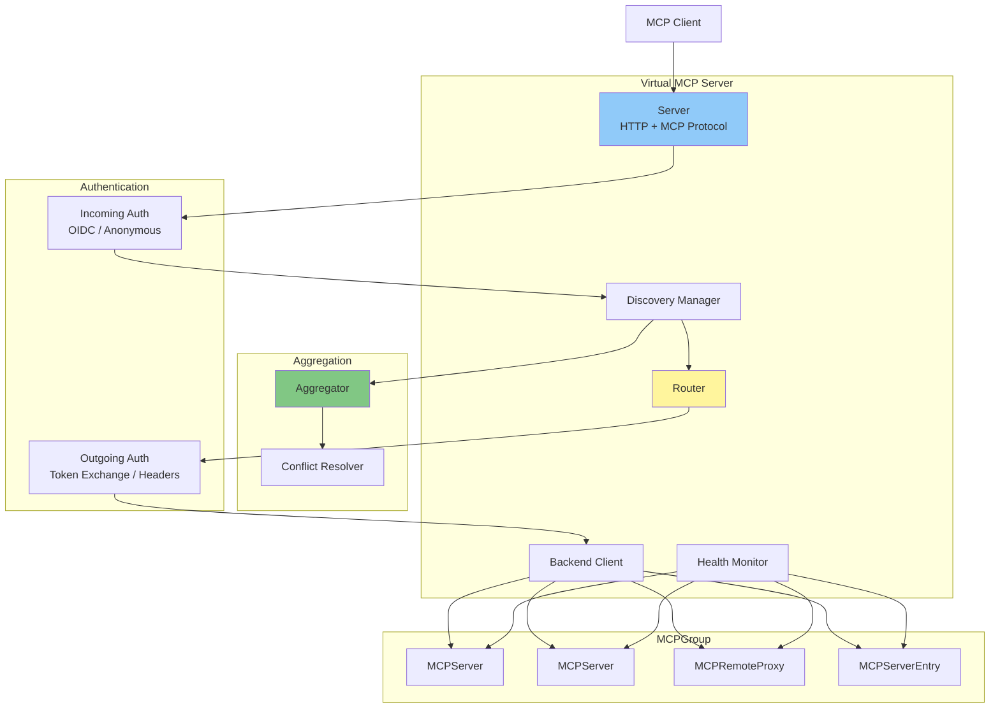
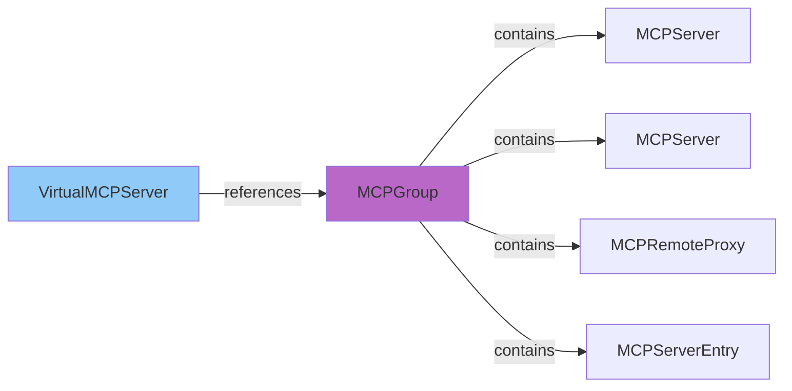
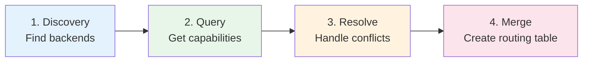
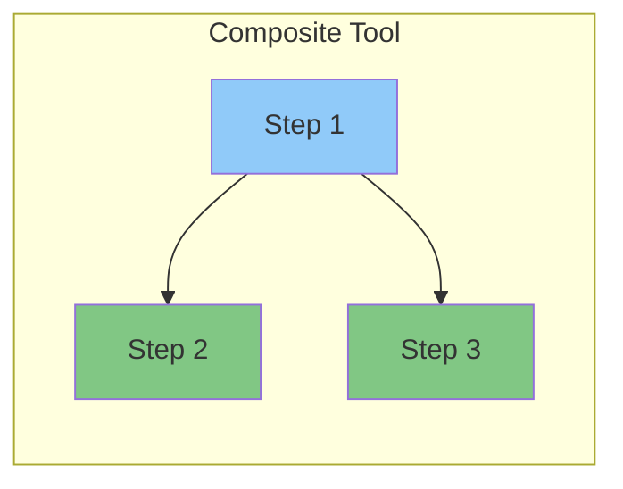
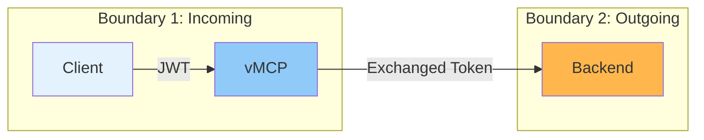
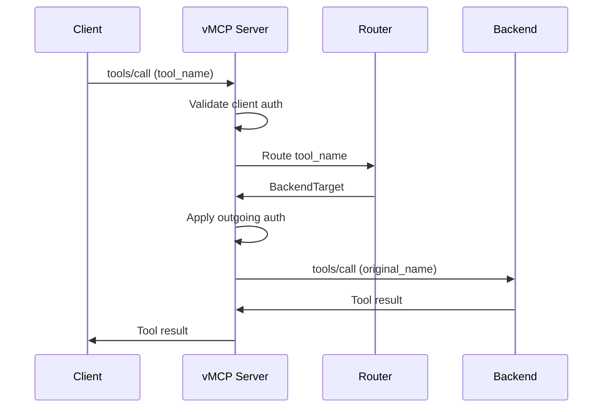

# Virtual MCP Server Architecture

The Virtual MCP Server (vMCP) aggregates multiple MCP servers from a ToolHive group into a single unified interface. This document explains the architecture and design of vMCP.

## Overview

vMCP solves the problem of **MCP server sprawl**. As organizations deploy more specialized MCP servers, clients need to connect to multiple endpoints. vMCP provides:

- **Unified endpoint** - One URL for clients to access many backends
- **Tool aggregation** - Combine tools from multiple servers
- **Conflict resolution** - Handle duplicate tool names automatically
- **Composite workflows** - Create new tools that orchestrate multiple backends
- **Centralized security** - Single authentication and authorization point
- **Token management** - Exchange and cache tokens for backend access
- **Shared telemetry** - Reference an MCPTelemetryConfig via `telemetryConfigRef` for fleet-wide OpenTelemetry settings

## Architecture

The vmcp package follows Domain-Driven Design principles with clear separation into bounded contexts:



### Core Concepts

| Concept | Purpose |
|---------|---------|
| **Routing** | Forward MCP requests (tools, resources, prompts) to appropriate backends |
| **Aggregation** | Discover capabilities, resolve conflicts, merge into unified view |
| **Authentication** | Two-boundary model: incoming (client → vMCP) and outgoing (vMCP → backend) |
| **Composition** | Execute multi-step workflows across multiple backends |
| **Caching** | Reduce auth overhead by caching exchanged tokens |

**Implementation**: `pkg/vmcp/` (discovery: `pkg/vmcp/discovery/`, routing: `pkg/vmcp/router/`)

## Backend Discovery

vMCP discovers backends from an **MCPGroup**. The group acts as a container for related MCP servers that should be exposed together.



**Discovery process:**
1. VirtualMCPServer references an MCPGroup by name
2. All MCPServers, MCPRemoteProxies, and MCPServerEntries in that group are discovered
3. For each backend, URL, transport type, and auth config are extracted
4. vMCP queries each backend for available tools, resources, and prompts

MCPServerEntry backends connect directly to remote MCP servers without deploying a proxy pod. They are zero-infrastructure catalog entries that declare a remote endpoint URL, optional external auth, and an optional CA bundle for TLS verification. CA bundle data is fetched from Kubernetes ConfigMaps at discovery time. In dynamic mode, the BackendReconciler watches ConfigMap changes and uses a field index on `spec.caBundleRef.configMapRef.name` to efficiently re-reconcile only the MCPServerEntry backends affected by a given ConfigMap update.

**Implementation**: `pkg/vmcp/aggregator/`

## Aggregation Pipeline

Aggregation happens in three stages:



1. **Discovery** - Find all backends in the MCPGroup
2. **Query** - Ask each backend for its tools, resources, and prompts (parallel)
3. **Resolve** - Handle naming conflicts using configured strategy
4. **Merge** - Create unified routing table mapping names to backends

### Conflict Resolution

When backends expose tools with the same name, vMCP resolves the conflict using one of three strategies:

| Strategy | Behavior |
|----------|----------|
| **prefix** | Prepend backend name to all tools (e.g., `github_create_issue`) |
| **priority** | First backend in priority order wins, others hidden |
| **manual** | Explicit mapping for each conflict |

The three strategies above cover **tools**. Resources, resource templates, and
prompts are resolved separately (`aggregator/capability_conflicts.go`), with
policies that deliberately differ by what the identity *is*:

- **Prompt names are names**, like tool names: `prompts/get` is translated back
  to the backend's own name via `BackendTarget.GetBackendCapabilityName`, so a
  rename does not break invocation. By **default** every prompt is renamed to
  its backend-prefixed form — `conflictResolutionConfig.prefixFormat` applied
  to the backend ID (default `{workload}_`), the same formatting path the tool
  prefix strategy uses. The **priority** strategy is the escape hatch for
  clients that pin prompt names, exactly as it is for tools: backends listed
  in `priorityOrder` keep their bare prompt names, a bare-name collision among
  listed backends resolves to the highest-priority one, and unlisted backends
  stay always-prefixed — deliberately stricter than tool priority resolution,
  which lets a conflict-free unlisted tool keep its bare name. A `manual`
  configuration changes tool resolution only.

  The invariant both modes preserve, scoped precisely: the advertised name of a
  given (backendID, name) **pair** is a pure function of the aggregation config
  and that pair, so it never shifts because an unrelated backend joined or left
  the group. That stability matters beyond naming: authorization matches on the
  advertised name (Cedar builds `Prompt::"<advertised name>"` entities), so a
  membership-dependent rename would detach `permit` and `forbid` policies from
  the prompt they were written for — names move only on an explicit config
  edit.

  The invariant does **not** promise that an advertised *string* keeps naming
  the same prompt. Under `priority`, two listed backends can claim the same
  bare name and the higher-ranked one takes it, so a
  `permit(... resource == Prompt::"review")` written while `b1` owned `review`
  silently begins authorizing `b2`'s **different** prompt once a higher-ranked
  `b2` advertising that name deploys — no config edit involved. Cedar's
  resource identity is the advertised name and nothing else (it carries no
  backend attribute), so whoever wins a shared name inherits every policy
  written for it. `forbid` still fails closed, because the priority loser is
  **dropped rather than aliased**; it is `permit` that gets redirected. Keep
  `priorityOrder` and name-scoped `permit` policies under review together.

  The loser being dropped instead of re-prefixed is deliberate: prefixing it so
  "nothing is lost" would re-advertise that prompt under a name no policy
  mentions, putting it beyond any `forbid` written on the bare name — the
  fail-open this design exists to avoid.

  When two advertised names compose to the same string and no backend owns it —
  backend `b1` prompt `x_y` vs backend `b1_x` prompt `y`, or a prefixed name
  hitting a listed backend's literal name — the name is **ambiguous**, and
  **every** colliding prompt is dropped with the collision logged at `ERROR`.
  Aggregation does not fail:
  erroring would take the group's entire aggregated view down (tools,
  resources, templates, prompts, backend visibility) over one prompt name that
  needs no conflict-resolution config to reach — just an unlucky combination of
  operator-chosen workload names and backend-chosen prompt names. Keeping one
  claimant is not an option either, since the survivor would inherit whatever
  policy was written for the prompt it collided with. With the name advertised
  by nobody, every `permit` and `forbid` on it is vacuous and the rest of the
  group keeps serving.
- **Resource URIs and template strings are locators, not names.** The client
  passes them back verbatim (`resources/read`, `resources/subscribe`,
  completion refs), backends emit them in notifications and embedded resource
  contents, and template-matched reads forward the client's concrete URI
  untranslated — so vMCP never rewrites them. A URI (or template string)
  advertised by several backends is instead advertised **once**: the backend
  earliest in sorted-backend-ID order wins, later duplicates are dropped with a
  warning. Reads are unchanged — the routing table keys by URI, so only one
  backend was ever served per URI; the fix makes that pick deterministic and
  the advertised list agree with it. Only the winning backend's `name`,
  `description` and `mimeType` are advertised for that URI, so a duplicate that
  differed in those fields loses them along with its entry.

After aggregation, every capability identity (`Tool.Name`, `Resource.URI`,
`ResourceTemplate.URITemplate`, `Prompt.Name`) is unique in the aggregated view.
Resources, resource templates and prompts are processed in sorted-backend-ID
order, so their outcomes are stable across runs; tool resolution
(`prefix_resolver.go`, `manual_resolver.go`) still iterates backends in map
order, so a tool collision *after* prefixing or a manual override picks a
nondeterministic winner.

The Modern list paginator still does **not** rely on that uniqueness: its cursor
names a position within a run of equal keys rather than assuming keys are
distinct, because the paginator is generic and a plain "resume after this key"
scan silently dropped an item whenever a duplicate landed on a page boundary
(see [Client-facing list pagination](#client-facing-list-pagination)).

### Tool Filtering

Beyond conflict resolution, vMCP can filter which tools are exposed through allow/deny lists, renaming, and description overrides.

By default a backend with no per-workload entry has all of its tools advertised, so
adding a workload to the group exposes it. `aggregation.defaultToolVisibility: deny`
inverts that, advertising only backends named in `aggregation.tools` — useful when the
exposed tool set should be enumerated deliberately rather than inherited from group
membership. A listed backend is opted in by its entry; its own `excludeAll`/`filter`
then decide which of its tools are advertised.

All of these settings — `excludeAllTools`, `defaultToolVisibility`, per-workload
`excludeAll`, and `filter` — control **advertising only**. Every backend tool stays in
the routing table so composite tools can call hidden ones, and none of them affect
resources or prompts. Per-identity authorization is Cedar's job (see [Authorization
Enforcement](#authorization-enforcement-core-admission-seam--pre-dispatch-gate)).

**Implementation**: `pkg/vmcp/aggregator/`

## Composite Tools

Composite tools are new tools defined in vMCP that orchestrate calls to multiple backend tools. They enable complex workflows without client awareness of the underlying backends.



Step dependencies form a DAG (Directed Acyclic Graph). Steps without dependencies execute in parallel, while dependent steps wait for prerequisites.

Steps can be of three types:
- **tool**: Execute a backend tool
- **elicitation**: Request user input via MCP elicitation protocol
- **forEach**: Iterate over a collection from a previous step, executing an inner tool step per item with bounded parallelism

**Tool annotations**: Composite tools advertise MCP tool annotations computed at advertise time via a derive-then-merge ordering. First, a safety floor is derived from the annotations of the step tools (including `forEach` inner steps): `readOnlyHint` is the AND across steps, `destructiveHint` and `openWorldHint` are the OR across steps (unknown steps taint conservatively), and `idempotentHint` is never derived. Then any explicit `annotations` declared on the composite tool definition are merged over the floor, with explicitly set fields winning. An explicit hint may be more conservative than the floor, but if it would make the tool look safer than its steps allow (e.g. `readOnlyHint: true` when a step is not read-only), the composite tool is dropped from `tools/list` with a warning rather than advertised misleadingly.

**Implementation**: `pkg/vmcp/composer/` (execution), `pkg/vmcp/internal/compositetools/` (advertised tool conversion and annotation derivation)

## Backend MCP Revision Classification

vMCP speaks both MCP revisions at once. The **client edge** is classified per
request (see [Transport Architecture](03-transport-architecture.md)); each
**backend edge** is classified independently, so a client on either revision can
reach backends on either revision. This section covers the backend edge, in
`pkg/vmcp/client`.

Two names are used throughout the code: **Legacy** is 2025-11-25 (session-based,
`initialize` handshake, `Mcp-Session-Id`) and **Modern** is 2026-07-28
(stateless, no handshake, per-request `_meta`).

### The probe: Modern-first `server/discover`

`probeRevision` decides a backend's revision once, then caches it. It is
Modern-first — it asks, rather than assuming Legacy:

1. **SSE backends short-circuit to Legacy.** A `TransportType` of `sse` is the
   2024-11-05 two-endpoint transport (`GET /sse` + `POST /messages`), which has
   no Modern endpoint at `BaseURL` to discover. This gate is *ToolHive routing*,
   not a protocol rule — HTTP+SSE is Deprecated in the spec, not removed.
2. Otherwise vMCP POSTs `server/discover` (`discoverModernCapabilities`) and
   reads `supportedVersions`.

**`supportedVersions` is the authoritative signal — a clean `server/discover`
response is not, by itself, proof of Modern.** A go-sdk v1.7 shim answers
`server/discover` even when it is negotiating *down* to Legacy, so vMCP requires
`supportedVersions` to actually contain `2026-07-28`; if it does not, the probe
fails with `errModernNegotiatedDown` and the backend is classified Legacy. The
containment check is an **exact match**, deliberately stricter than go-sdk's
reference client (which accepts negotiated `>= 2026-07-28`), because vMCP's shim
speaks exactly one Modern wire shape. That exactness is a tripwire: adding a
newer Modern revision must widen this to a set/range check, or a newer-only
backend is misclassified Legacy.

Probe outcomes:

| Discover result | Classification | Why |
|---|---|---|
| Success, `supportedVersions` contains `2026-07-28` | **Modern** | Backend affirmatively serves the revision |
| A Modern-specific `-3202x` protocol error | **Modern** | The peer validated our Modern `_meta`, so it speaks the revision |
| A valid Modern envelope with `resultType != "complete"` | **Modern** | Only a Modern peer produces that envelope (`errModernInputRequired`) |
| Auth rejection (401/403/407) or transient (408/429/5xx, timeout) | **Inconclusive** | Says nothing about the revision; left unprobed so the next call re-probes |
| Anything else, including negotiated-down | **Legacy** | `errModernNegotiatedDown`, `errWrongEra`, and every other genuine not-Modern signal |

A probe that fails inconclusively falls back to Legacy for that one call
**without caching it**, so a transient outage can never pin a backend to the
wrong revision.

### The cache, and its asymmetric self-healing

`dispatch` wraps every backend verb: it resolves the revision (probing on a
miss), runs the call, and on a revision-shaped failure (`isRevisionMismatch`)
re-probes and retries. The two directions self-heal by different mechanisms,
which is worth knowing when reading the code:

- **Modern cached, backend is really Legacy** — `server/discover` no longer
  advertises `2026-07-28`, producing `errModernNegotiatedDown`, which
  `isRevisionMismatch` recognises on the Modern arm; the cache is reclassified.
- **Legacy cached, backend is really Modern** — corrected **in band** rather
  than by a mismatch: `legacyInit` reads the genuinely-negotiated protocol
  version off every `InitializeResult` and flips the cache when it comes back
  `2026-07-28`. The SDK's Modern-first client negotiates Modern unaided even on
  vMCP's Legacy code path, so the call still succeeds while the label corrects
  itself.

Reclassification never re-runs a request that may already have executed. An
`errLegacyResponseBody` (a lenient Legacy backend that answered a Modern-shaped
request) corrects the cache for *future* calls but returns the error, because the
backend may have performed the side effect.

### vMCP owns the reserved `_meta` namespace on both hops

vMCP is the client's MCP peer and the backends' MCP peer on two different hops,
so the reserved `io.modelcontextprotocol/*` `_meta` keys are vMCP's to own in
both directions. A single helper, `mcp.StripReservedMeta`, removes every key
under that prefix (except the end-to-end passthrough keys — `related-task`,
`model-immediate-response`) wherever a `_meta` map crosses vMCP:

- **Request egress** — before any Legacy backend call (`pkg/vmcp/client`,
  `pkg/vmcp/session/internal/backend`) and on the Modern request path, which
  overlays vMCP's own authoritative values afterwards. This is not cosmetic:
  go-sdk v1.7 rejects **any** `_meta.protocolVersion` on a stateful
  streamable-HTTP server outright (HTTP 400), regardless of its value.
- **Response/request egress to the client** — Legacy strips inside
  `conversion.ToMCPMeta` (the funnel every Legacy egress crosses); Modern strips
  in `newModernResultMeta` and re-stamps its own `serverInfo` last; the
  elicitation adapter (a server→client request) crosses the same chokepoint.
  This stops a backend fabricating the client's own identity (`serverInfo`,
  `protocolVersion`, `clientInfo`).

Non-reserved caller/backend keys (progress tokens, W3C trace context) are
preserved throughout.

### Observability

Each backend's resolved revision is exposed as `mcpRevision` on the backend
status read-model (`vmcp.BackendStatus.MCPRevision`, fed from the health
monitor's `RecordRevision`), and surfaces on
`VirtualMCPServer.status.discoveredBackends[]`. It is empty until the backend has
been probed.

### Limitation: elicitation and sampling are unavailable on Modern backends

vMCP declares **empty** `clientCapabilities` on every Modern backend call
(`mcp.ModernRequestMeta`). That is honest — the Modern shim performs single-shot
dispatch and cannot drive multi-round retrieval — but it has a consequence worth
naming explicitly rather than leaving to be inferred:

**Mid-call elicitation and sampling forwarding, which vMCP *does* implement for
Legacy backends (`forwardingClientOptions`), is structurally unavailable for
Modern backends.** A spec-compliant Modern backend that needs caller input
returns `-32021`, which surfaces as an opaque `errModernProtocolError`. The
2026-07-28 revision replaces server-initiated requests with client-polled
multi-round tool retrieval (MRTR), so the fix is shaped MRTR-first rather than by
extending the SSE standalone-stream model — see the epic (#5743) and the
mid-call forwarding section below for the Legacy behaviour this contrasts with.

### Limitation: elicitation and sampling are unavailable to Modern clients

The client edge mirrors the backend edge. The Modern dispatcher
(`pkg/vmcp/server`'s `dispatchModern`) is single-shot: every result it builds is
`resultType: "complete"`, and it never emits `"input_required"` — MRTR
(SEP-2322) is unimplemented on this edge too. When a backend tool issues a
mid-call server-initiated request during a **Modern** client's `tools/call`,
there is no client session to forward it to, so the call fails with an explicit
error naming the refused request (pinned by
`TestIntegration_Modern_RealBackend_ElicitingToolFailsCleanly`). This is a
deliberate honest-unsupported error, not a gap left by accident:

**The `-32603` is a documented deviation, not the spec's answer — and the
spec's answer is unshippable today.** For a client that did NOT declare the
needed capability in its per-request `clientCapabilities`, SEP-2575 MUSTs a
`-32021` `MissingRequiredClientCapabilityError` at **HTTP 400**, with
explicitly execution-time language ("if processing a request requires a
capability…") — go-sdk's own doc comment on the error type tells handlers to
return it mid-execution, so the mid-call timing is not the problem. The
problem is the transport: go-sdk's streamable client treats any non-transient
4xx (its transient set is only 500/502/503/504/429) as a **connection**
failure — `checkResponse` → `fail()` → a one-shot, permanent session death —
so a conformant 400 would tear down the entire client session to punish one
call. And for a client that DID declare the capability, the 2026-07-28
vocabulary has no conformant code at all: no "operation not supported", MRTR
is not a server-advertised capability, and SEP-2322 has no decline mechanism.
**#6061 (merged) implements exactly that two-path contract** in
`writeModernCallFailure`/`writeModernMissingCapability` (`pkg/vmcp/server`):
`-32021` with `data.requiredCapabilities` and a message naming both the
capability and the gateway limitation, served at **HTTP 200** for the
undeclared case — deviating from the mandated 400 for exactly the reason
above (tracked upstream as go-sdk#1117) — and an explicit `-32603` naming
SEP-2322 for the declared case, as a documented spec gap. The MRTR design
([16-vmcp-mrtr.md](16-vmcp-mrtr.md)) supersedes this contract slice by slice
where the backend is Modern; it is permanent for the Modern-client ↔ Legacy-
backend cell.

**A clean error does not mean nothing happened.** The refusal reaches the
backend mid-call, so a real backend tool may have executed — including side
effects — up to the point it demanded input. A Modern client receiving this
error must not assume the call was side-effect-free. (The integration
fixture's tools elicit as their first action, so the tests cannot exhibit
this; production tools can.)

- The 2026-07-28 revision **removed** server-initiated requests; go-sdk's
  `ServerSession.assertServerInitiatedRequestAllowed` refuses
  elicitation/sampling/roots purely by negotiated protocol version, so no
  capability negotiation can restore the Legacy forwarding model for Modern
  clients.
- A server that never returns `input_required` is fully SEP-2575-conformant:
  the per-request `clientCapabilities` a client declares are an offer the
  server may use, not an obligation.
- SEP-2577 deprecates sampling (and logging and roots) outright as of
  2026-07-28, with direct LLM-provider integration as the sanctioned
  replacement — so elicitation is the only durable consumer a future MRTR
  implementation would serve.

Legacy clients keep the full mid-call forwarding behaviour unchanged; the
forwarding integration tests pin their downstream clients to Legacy explicitly
(`legacyPinningRoundTripper` in `pkg/vmcp/server`'s external test package)
because that surface exists only on a Legacy session.

**Bridging was considered, costed, and rejected.** Serving MRTR to Modern
clients on top of a *Legacy*
backend would require parking the live, mid-flight backend call server-side
(the blocked goroutine and its open session cannot be serialized into the
opaque `requestState` the SEP designed for handler re-invocation) and keying
the resume on an unguessable token — per-round server state with TTL/eviction,
identity binding on a token that becomes a capability to resume someone else's
in-flight call, and replica affinity with no `Mcp-Session-Id` to route on. That
would reintroduce, in different clothes, the per-request server state the
2026-07-28 revision removed. The spec's own sanctioned path for genuinely stateful
`input_required` work is the **Tasks** extension (SEP-2663: `tools/call`
returns `resultType: "task"` with a `taskId`; the client polls `tasks/get` and
answers outstanding `inputRequests` via `inputResponses` on `tasks/update`;
note SEP-2663 supersedes SEP-1686 and removed the blocking `tasks/result`
method for the same reasons argued here) — if Modern-client elicitation over
Legacy backends is ever truly demanded, that is the machinery to reach for,
not parked `tools/call`.

The coherent future MRTR shape for a re-aggregating gateway is
**Modern-client ↔ Modern-backend pass-through** — relay a Modern backend's
`inputRequests`/`requestState` to the client and the client's
`inputResponses` back, genuinely stateless at vMCP. The full design is
[16-vmcp-mrtr.md](16-vmcp-mrtr.md); its slice 1 (the egress half) has landed —
a Modern backend's `input_required` still classifies as
`errModernInputRequired`, but the typed `vmcp.InputRequiredError` now carries
the decoded round for the relay slices to consume. By the time Modern
backends exist to relay from, SEP-2577's deprecations make elicitation its
only durable consumer; see #5743 and #6059.

Progress and log notifications toward Modern clients are a separate concern
from MRTR: they remain spec-legal as request-scoped notifications on the
POST-initiated SSE response stream (SEP-2260 requires messages on that stream
to relate to the originating request; `progressToken` is unchanged), which the
single-shot dispatcher does not produce today — a vMCP streaming-dispatch gap,
not a spec absence.

## Served MCP Capabilities

Beyond tools, vMCP aggregates and serves the full complement of MCP capabilities. Every served capability flows through the domain **core** (`pkg/vmcp/core`), so the same admission decision that filters `tools/list` also gates reads, gets, and completions.

| Capability | Served? | Notes |
|------------|---------|-------|
| Tools (`tools/list`, `tools/call`) | Yes | Aggregated, conflict-resolved, admission-filtered; a backend's asynchronous `notifications/tools/list_changed` is propagated to already-registered sessions — see below |
| Resources (`resources/list`, `resources/read`) | Yes | Admission-filtered per identity; a backend's asynchronous `notifications/resources/list_changed` propagates ADDITIONS (not removals) to already-registered sessions — see below |
| Resource templates (`resources/templates/list`) | Yes | Templated reads route through the same `ReadResource` path; the router matches an expanded URI against the aggregated templates, and an exact template-string key routes to its backend; covered by the same `notifications/resources/list_changed` propagation as resources (MCP 2025-11-25 has no separate wire method for template changes) |
| Prompts (`prompts/list`, `prompts/get`) | Yes | Served per-session; a backend's asynchronous `notifications/prompts/list_changed` propagates ADDITIONS (not removals) to already-registered sessions — see below |
| Completions (`completion/complete`) | Yes | A `ref/prompt` routes via the prompts table; a `ref/resource` carries the URI-template string per the spec and routes via the resource-templates table (exact template-string key, with exact-resource and template-expansion fallbacks). Unroutable refs return an empty result (lenient completion); admission denial returns an error |
| Resource subscriptions (`resources/subscribe`, `resources/unsubscribe`) | Ack-level only | Legacy edge. vMCP accepts and records the subscription (after session-binding and resource-admission checks) but does **not** yet forward backend `notifications/resources/updated` — see the limitation below |
| Subscriptions (`subscriptions/listen`) | Ack-level only | Modern (2026-07-28) edge, the revision's only server→client push channel. Answered with an SSE stream carrying the mandatory `notifications/subscriptions/acknowledged` and then a terminating result, both tagged `io.modelcontextprotocol/subscriptionId` and keyed by the listen request's JSON-RPC id (Modern has no sessions). The honored set is intersected against the advertised capabilities, all of whose push flags are false, so it is always **empty** and the stream closes immediately rather than idling. Serving it is what lets a go-sdk v1.7 client complete `Connect` at all — see below |

The four Modern list verbs (`tools/list`, `resources/list`, `resources/templates/list`, `prompts/list`) **paginate**, emitting `nextCursor` while items remain and capping a page at 1000 items to match the page size the SDK applies on the Legacy path. See [Client-facing list pagination](#client-facing-list-pagination).

The completion handler is a single global handler installed via `WithCompletionHandler`, so it recovers the session from the SDK request context rather than a per-session closure. Setting it makes the shim auto-advertise the `completions` capability at initialize.

### Served MCP revisions: the Modern capability gate

vMCP serves two client-facing MCP revisions: **Legacy** (2025-11-25, the SDK
session path) always, and **Modern** (2026-07-28, `classifyingHandler →
dispatchModern`, stateless) **conditionally** — only when every enabled feature
of the instance is servable by the stateless dispatch path. The condition is
`modernDispatchBlockers` (`pkg/vmcp/server/modern_gate.go`), an explicit
enumeration that replaced the temporary `TOOLHIVE_VMCP_MODERN_STATELESS`
env-var kill-switch (#5959): instead of a global "don't serve Modern", the
instance serves Modern exactly when it can serve it correctly.

Features that currently gate Modern off, and why:

| Feature | Why the stateless path cannot serve it |
|---------|----------------------------------------|
| Optimizer (`find_tool`/`call_tool`) | The meta-tools are Serve-layer and **session-scoped** (`serve_optimizer.go`): each session builds an FTS5 index over its advertised set and swaps the two meta-tools in. The index is deliberately not in the stateless core, and `dispatchModern` serves `tools/*` straight from `core.ListTools`/`core.CallTool` — a Modern client would silently receive the raw aggregated tool set and `tools/call find_tool` would fail. Parity needs an identity- or instance-scoped index |

"Cannot serve" means a Modern client would silently get different behavior than
the feature promises — not merely that the feature is session-flavored.
Redis-backed session sharing, for example, does **not** gate Modern: Legacy
clients keep their shared, reconstructible sessions while Modern clients are
sessionless by design and store nothing, a coexistence asserted end-to-end by
`test/e2e/thv-operator/virtualmcp/virtualmcp_dual_era_redis_test.go`. Rate
limiting does not gate Modern either: the limiter is a core decorator
(`pkg/vmcp/ratelimit`), so both eras meter the same `CallTool` seam, and the
Modern dispatcher preserves the limiter's coded error on the wire — a real
JSON-RPC error object, `429` with `data.retryAfterSeconds`
(`writeModernCodedError`, at HTTP 200 because go-sdk rejects a non-200
response before decoding the body, so on an HTTP 429 the error object — and
its `retryAfterSeconds` — would be discarded unread) — where the Legacy SDK
seam can only smuggle the same code and data into an `IsError` tool result's
`structuredContent` (`conversion.ErrorToToolResult`). The code `429` mirrors
HTTP Too Many Requests (the same pattern as the `403` denial code) and sits
outside the JSON-RPC reserved range (`-32768`..`-32000`), making it
conformant under both MCP 2026-07-28 — which reserves `-32020`..`-32099`
exclusively for spec-defined codes — and 2025-11-25 and earlier, which
inherit plain JSON-RPC 2.0. It replaced `-32029`, which sat inside the
reserved band (#6101).

"Does not gate Modern" is not "costs the same", though. The limiter wraps only
the `CallTool` seam, so the list verbs and `server/discover` are unmetered on
both eras — but Legacy aggregates once per session registration, while Modern
re-runs the full backend fan-out on every request with no cache, by design
(`core_vmcp.go`'s `aggregatedView`). A Modern client can therefore loop
unmetered, uncached fan-outs — reachable unauthenticated when incoming auth is
anonymous. Rate-limiting the list/discover verbs, or a short-TTL per-identity
capability cache, is deferred until profiling shows the per-request fan-out
cost matters (#5761 — the same deferral recorded in `dispatchModernDiscover`'s
doc comment).

Wire behavior when the gate is closed:

- **`server/discover` falls through to the SDK** instead of dispatching. go-sdk's
  `filterSupportedVersions` keeps every version the transport's
  `SupportsProtocolVersion` accepts, and the stateful transport excludes only
  >= 2026-07-28 (those require `Stateless`), so the probe answer is the
  transport-filtered list — everything except Modern: `[2025-11-25,
  2025-06-18, 2025-03-26, 2024-11-05]`. This matters because go-sdk v1.7+
  clients are Modern-first: `Connect` probes `server/discover` **before**
  `initialize` and upgrades to whatever the server advertises. The
  fall-through answer is what lands them on the Legacy handshake — where
  sessions, and every gated feature, work. That answer over-advertises,
  though: the `-32022` refusal below lists only 2025-11-25, and the refusal is
  the accurate one — `mcpcompat`'s `handleInitialize` always responds with
  `LATEST_PROTOCOL_VERSION` regardless of what the client requests, so the
  three older revisions in the discover answer are not actually servable. The
  mismatch is the SDK's discover answer to narrow, not the `-32022` list to
  widen.
- **Every other well-formed Modern request** is refused with a conformant
  400 + `-32022 UnsupportedProtocolVersionError` whose data lists the Legacy
  version, the shape a client negotiates down from. It is answered in
  `classifyingHandler` rather than falling through, because go-sdk's stateful
  rejection for Modern traffic is a plain-text 400 carrying no version list.
- **Legacy traffic is untouched** either way; the gate only ever affects
  requests that classified Modern.

The gate is derived from construction-time configuration, logged once at
startup ("MCP 2026-07-28 (Modern) dispatch disabled…"), and pinned by
`TestModernDispatchBlockers`, `TestClassifyingHandler_ModernCapabilityGate`,
and the full-handler pair in `modern_gate_integration_test.go`. Achieving
Modern parity for a feature means deleting its entry and updating those tests —
nothing else needs to change.

### Subscription limitation (ack-level)

vMCP advertises `resources.subscribe: true` and answers `resources/subscribe` / `resources/unsubscribe` at **ack level**: the request is accepted (enforcing session binding and validating the URI is an advertised, admitted resource), and go-sdk records the subscription. vMCP does **not** currently propagate backend `notifications/resources/updated` to the subscribed client — doing so requires persistent per-session backend connections, which is out of scope. Clients that subscribe will receive a success ack but no update stream yet.

### Client-facing list pagination

On the Legacy edge the SDK's session-scoped feature store splits list results into
pages. `dispatchModern` bypasses the SDK, so the Modern edge paginates itself
(`pkg/vmcp/server/modern_pagination.go`).

Modern has no sessions, so a cursor may not denote server-held iteration state.
The draft pagination page makes cursors **opaque to clients** ("MUST treat cursors
as opaque tokens"), which is precisely what allows the server to encode position
*into* the token instead of remembering it. So the cursor is self-describing:
base64url over a small JSON payload naming the list kind, the last key delivered,
and how many items sharing that key have already been sent.

Three properties worth knowing:

- **Ordering.** Keyset paging needs a deterministic total order, and the
  aggregator's fan-out order is not stable between calls, so Modern list results
  are sorted by the item's key (`Tool.Name`, `Resource.URI`,
  `ResourceTemplate.URITemplate`, `Prompt.Name`). Legacy ordering is unchanged.
- **Duplicate keys are tolerated, not assumed away.** The aggregator makes all
  four keys unique (see [Conflict Resolution](#conflict-resolution)), but the
  paginator is generic and does not depend on that caller invariant. The cursor
  resumes *within* a run of equal keys, because a plain "resume after this key"
  scan skipped every copy and permanently dropped items whose key collided at a
  page boundary.
- **End of results omits `nextCursor` entirely.** The draft states that "an empty
  string is a valid cursor and thus MUST NOT be treated as the end of results", so
  emitting `""` would make a conformant client re-request and loop on page one.

The cursor encodes a position in the **aggregated** ordering and never names a
backend, so adding or removing a backend cannot invalidate one. This is unrelated
to the aggregator's *upstream* cursor-following (#5851), which is vMCP acting as a
client walking a backend's pages.

An invalid cursor — malformed, over-length, or minted for a different list verb —
is rejected with `-32602`, per the draft's error-handling rule.

### Tools/resources/prompts list_changed propagation (#5748, #5969)

Unlike the per-call backend client (`pkg/vmcp/client`), the **persistent**
per-session backend connection (`pkg/vmcp/session/internal/backend`) stays
open for the session's lifetime, so it can observe a backend's asynchronous
(out-of-band) notifications rather than only mid-call traffic. When a
non-nil `ListChangedSink` is supplied at connection time, the connector:

- Enables `WithContinuousListening()` on streamable-HTTP backends (opens a
  standalone GET stream) — gated **strictly** on a non-nil sink, because some
  backends hang when this stream is opened against them. SSE backends need no
  extra option: their whole session is already one continuous stream.
- Registers an `OnNotification` handler that dispatches
  `notifications/tools/list_changed` (`kind=KindTools`),
  `notifications/resources/list_changed` (`kind=KindResources` — also covers
  resource templates, since MCP 2025-11-25 has no separate wire method for
  template changes), and `notifications/prompts/list_changed`
  (`kind=KindPrompts`) to the sink — `ChangeKind` is a typed constant rather
  than a bare string so a typo is a compile error — and logs
  `notifications/message` received out-of-call (log-only; no relay).

This propagation mechanism only applies to a Legacy (2025-11-25) backend: the
per-session factory (`pkg/vmcp/session/factory.go`) skips the persistent
connection — and therefore the handshake, the sink registration, and the
standalone GET stream above — for any backend whose cached revision is known
Modern (2026-07-28); see [Backend MCP Revision Classification](#backend-mcp-revision-classification)
above for how that revision is resolved and cached. This is correct, not a gap in the skip: Modern removed
`initialize` and `Mcp-Session-Id`, so there is no Legacy-shaped persistent
connection to hold and no standalone GET stream a Modern backend could push
on. Modern's own server-push mechanism is `subscriptions/listen` (see
[Transport Architecture](03-transport-architecture.md)). vMCP **serves** that
method on its client edge (`pkg/vmcp/server/modern_subscriptions.go`), but only
at acknowledgement level: it computes the honored subscription set by
intersecting the client's request against the capabilities `server/discover`
advertises, and since every push-related flag there is deliberately false
(`newModernCapabilities`), the honored set is always empty and no notification is
ever pushed. So `list_changed` **delivery** remains Legacy-only, on both edges —
what the Modern client edge gained is a conformant, explicitly-empty answer
instead of a `-32601` that tore the client's connection down. Real Modern
delivery is tracked in #5743 and requires vMCP to start advertising a push
capability first.

The sink is built once per session, at registration (`pkg/vmcp/server`'s
`buildListChangedSink`), closing over the SDK `ClientSession`, the session ID,
and the caller's identity **and per-request forwarded headers** captured **at
registration time** (a deliberate snapshot, not re-resolved per firing — see
the token-staleness note below). It is threaded through
`MultiSessionFactory.MakeSessionWithID` / `SessionManager.CreateSession` (a
single nilable `ListChangedSink` parameter) down to every backend connector
opened for that session.

`buildListChangedSink` builds **one coalescing worker per `ChangeKind`**
(`KindTools`, `KindResources`, `KindPrompts`) rather than a single shared
worker: a tools notification resyncs only the session's tool store, without
forcing a redundant re-apply (and possible spurious downstream
`list_changed`) of its resources or prompts overlay, and vice versa.

**The sink is non-blocking (runs on the backend receive-loop goroutine).** It
must not do real work inline: the mcpcompat client dispatches notifications
synchronously on its receive loop, so a blocking sink would stall that
backend's notification delivery and let a misbehaving backend amplify one
notification into unbounded work. The sink therefore only hands off to the
matching **per-(session, kind) coalescing worker** (`listChangedResyncWorker`):
`trigger()` sets a dirty flag and, at most, starts **one** worker goroutine —
never one goroutine per notification. At most one resync runs at a time per
(session, kind); notifications that arrive while a resync is in flight
collapse into a single follow-up run, so a notification storm is bounded to
O(1) concurrent work per (session, kind) — up to 3 concurrent resyncs per
session in the worst case, one per kind. Each worker goroutine exits when
idle, so an idle session holds no goroutine.

Each worker's resync body (`runListChangedResync`), off the receive loop:

1. **Liveness guard** — looks the session up via `GetMultiSession` and returns
   immediately if it was terminated/expired, so a storm of notifications for a
   dead session drives no work.
2. **Reconstructs the request context** — starts from a server-lifetime base
   context (`Server.resyncBaseCtx`, cancelled on `Stop` so in-flight backend
   sweeps never outlive the server) and layers on the captured identity
   (`auth.WithIdentity`) and forwarded headers
   (`headerforward.WithForwardedHeaders`). This is **security-critical**: the
   capability cache key and the outbound backend authentication are derived
   from the **context** (not from an explicit identity argument), so without
   this the resync would enumerate backends *unauthenticated* — advertising
   metadata the principal's own credentials would not surface, or wrongly
   dropping credential-gated tools/resources/prompts, while replacing the
   correctly-scoped registration-time set.
3. Calls `core.InvalidateCapabilityCache()`, which purges the **entire**
   per-identity capability cache (`aggregator.CacheInvalidator`), covering all
   capability kinds together (tools, resources, resource templates, prompts
   share one cached `AggregatedCapabilities` per identity). This is coarse (not
   scoped to the one backend that changed): the LRU key is a hash of identity +
   forwarded headers + backend-set, so per-backend invalidation would need a
   reverse index that is disproportionate here. The coalescing above already
   bounds the purge to at most once per resync burst per kind, and a purge
   only forces the next call per identity to re-sweep — an accepted de-opt /
   follow-up. An aggregator that does not implement `CacheInvalidator`
   WARN-logs instead of silently no-opping.
4. Re-derives and **replaces** — not merges — the session's advertised set for
   the notification's kind, from the (now cold) cache: `KindTools` re-derives
   via `serveSessionTools` and replaces the tool store
   (`SessionWithTools.SetSessionTools`); `KindResources` re-derives via
   `coreSessionResources`/`coreSessionResourceTemplates` and replaces BOTH the
   resource store (`SessionWithResources.SetSessionResources`) and the
   resource-template store
   (`SessionWithResourceTemplates.SetSessionResourceTemplates`) — one
   notification method covers both, per MCP 2025-11-25; `KindPrompts`
   re-derives via `coreSessionPrompts` and replaces the prompt store
   (`SessionWithPrompts.SetSessionPrompts`). Replacing (rather than merging)
   means a tool the backend removed disappears rather than lingering from the
   registration-time merge — but see the add-only caveat below for resources
   and prompts.

The go-sdk server auto-emits the corresponding `list_changed` notification
(`notifications/tools/list_changed`, `notifications/resources/list_changed`,
or `notifications/prompts/list_changed`) to the downstream client whenever the
matching `SetSession*` call changes something, now that
`WithToolCapabilities(true)`, `WithResourceCapabilities(true, true)`, and
`WithPromptCapabilities(true)` are all set (`pkg/vmcp/server/serve.go`).

**Identity staleness (B1)**: each worker reuses the identity captured at
registration for its re-aggregation and admission view. If that identity's
upstream tokens are refreshed later (see #5323), the resync's
`core.ListTools`/`ListResources`/`ListPrompts` call authorizes/aggregates
against the (potentially stale) captured tokens, not the live per-request
ones. This only affects the *accuracy of the asynchronous resync's own view*
— every live call still authenticates via the fresh per-request identity
through `enforceSessionBinding`, so staleness here cannot grant a call that
would otherwise be denied.

**Registration-time emission (R1)**: go-sdk's own `AddTool`/`RemoveTools` (and
the resource/prompt equivalents) debounce (10ms) and then broadcast the
corresponding `list_changed` notification to **every** session currently
connected to the shared `*gosdk.Server` — not only the session whose overlay
changed — and a session is eligible for that broadcast from the moment its
transport connects (`Server.bind`), before its own
`initialize`/`notifications/initialized` round-trip completes. go-sdk's own
source documents this as a known upstream gap ("potential spec violation...
when the feature list changes before the session ... is initialized"). This
means every session's registration-time per-session `AddTool`/resource/prompt
calls (`setSessionToolsDirect`/`setSessionResourcesDirect`/
`setSessionResourceTemplatesDirect`/`setSessionPromptsDirect`) now cause a
broadcast to every other already-connected session too. There is no supported
hook to scope or suppress this without patching the vendored SDK, so it is
accepted as a benign nuisance for all three capability kinds: MCP
notifications are inherently a "you may want to refetch" hint, so an extra one
only costs an idempotent list round-trip — it never changes what any given
session's own list actually returns.

**Scope**: additions AND removals propagate for tools. For resources
(including resource templates) and prompts, only **additions** propagate
today: toolhive-core's mcpcompat per-session sync for resources/resource
templates/prompts (`syncSessionResources`/`syncSessionResourceTemplates`/
`syncSessionPrompts` in `mcpcompat/server/session.go`) is add-only — unlike
`syncSessionTools`, which also calls `RemoveTools` — so a backend-removed
resource/template/prompt stays registered on the session's go-sdk server
(listed until re-initialize) even though the overlay this PR replaces no
longer contains it. `resyncSessionResources`/`resyncSessionPrompts` still
REPLACE (not merge) their overlay, so once toolhive-core gains removal
reconciliation ([stacklok/toolhive-core#184](https://github.com/stacklok/toolhive-core/issues/184)),
removals start propagating with no change needed on the vMCP side. Advertising
`listChanged: true` stays honest in the meantime — notifications ARE emitted on
change (except that a pure removal which EMPTIES the overlay issues no `Add*`
and therefore triggers no downstream `list_changed`, since go-sdk notifies only
via `Add*`/`RemoveTools`); `listChanged` promises notification, not list
minimization — but until that follow-up lands, a refetch after a pure removal
returns a stale superset for resources/templates/prompts. Cross-pod session
restore (`RestoreSession`) does not thread a sink at all for any kind (no live
`ClientSession` to resync there).

**Implementation**: `pkg/vmcp/session/internal/backend/mcp_session.go`
(`ChangeKind`/`KindTools`/`KindResources`/`KindPrompts`, `ListChangedSink`,
connector wiring), `pkg/vmcp/aggregator/aggregator.go` and
`caching_aggregator.go` (`CacheInvalidator`), `pkg/vmcp/core/core_vmcp.go`
(`InvalidateCapabilityCache`), `pkg/vmcp/server/serve_list_changed.go`
(`listChangedResyncWorker` coalescing, `buildListChangedSink`,
`runListChangedResync`, `resyncSessionTools`, `resyncSessionResources`,
`resyncSessionPrompts`) with `Server.resyncBaseCtx` cancelled on `Stop`.

### Mid-call forwarding (elicitation / sampling / progress / logging)

While a backend `tools/call` (or other request) is in flight, the backend may issue **server-initiated** requests and notifications back toward the client: elicitation, sampling, progress, and logging. vMCP forwards these mid-call in both directions through a per-call forwarder that bridges the backend connection to the originating client session, so a backend that needs user input (elicitation) or model completions (sampling), or that emits progress/log notifications, reaches the real client transparently. This is distinct from composite-tool elicitation (which the composer drives during a workflow); the mid-call forwarder handles the general request-scoped case for a single backend call.

**Implementation**: `pkg/vmcp/forwarding.go`, `pkg/vmcp/client/forwarding.go`, `pkg/vmcp/server/serve_handlers.go`

**Known limitation (Modern clients)**: everything in this section describes a
**Legacy (2025-11-25) client session**. For Modern (2026-07-28) clients there
is no session and no server-initiated request channel, so none of this
forwarding applies — see
[Limitation: elicitation and sampling are unavailable to Modern clients](#limitation-elicitation-and-sampling-are-unavailable-to-modern-clients)
for what a Modern caller gets instead.

**Known limitation (logging level)**: forwarded backend logging is not yet filtered to the downstream client's requested level. On Legacy, vMCP requests debug-level logging from the backend (`logging/setLevel`) so it emits `notifications/message`, and every such notification is forwarded — the downstream client's own `logging/setLevel` preference is not applied to the relayed stream. The same is true on Modern (2026-07-28), where the RPC is removed and the level rides per-request in `_meta["io.modelcontextprotocol/logLevel"]`: vMCP strips that reserved per-hop key from the downstream request and overlays its own (`debug`, when forwarding is bound) on the backend hop, so a Modern client's per-request level preference is likewise not honored — the relay runs at debug either way.

**Known limitation (advertised-but-no-stream elicitation fails fast)**: a client
that advertised the `elicitation` capability but holds **no open standalone SSE
stream** passes go-sdk's capability gate, yet the elicitation cannot be
delivered — under the shim's `JSONResponse` transport the go-sdk routes
server→client requests to the standalone stream, and a missing stream rejects
the write ("rejected by transport: stream not connected or already closed").
The mid-call `tools/call` therefore fails fast with a tool error instead of
hanging to the deadline (pinned by
`TestForwarding_Elicitation_AdvertisedButNoStream_FastFails` in
`pkg/vmcp/server`). A cleaner pre-dispatch refusal awaits an upstream mcpcompat
accessor for stream presence (#5975).

**Known limitation (cross-pod origination needs session affinity)**: a
server→client request can only be delivered by the replica currently holding
the client's standalone SSE stream. If the `tools/call` executes on replica A
but the client's GET stream is pinned to replica B, an elicitation or sampling
request originated from A cannot reach the client — the shim loads the go-sdk
session bound to *its* pod and has no cross-replica delivery channel for
request/response (only notifications rehydrate cross-replica). Multi-replica
deployments that rely on mid-call elicitation/sampling therefore need **session
affinity** at the load balancer pinning the standalone stream and the tool
calls to the same replica. The durable fix is the 2026-07-28 revision itself:
it replaces server-initiated requests with client-polled MRTR, which has no
stream-locality requirement — so this constraint is documented rather than
engineered around (#5975, #5743).

**Known limitation (resource-template authorization)**: a resource template is advertised on the template-string entity (e.g. `file:///logs/{date}.txt`), but a concrete read is admission-checked on the **expanded** URI (e.g. `file:///logs/2025-01-01.txt`). Operators should therefore author resource authorization policies against concrete URI patterns, not the template string.

## Two-Boundary Authentication

vMCP uses separate authentication for incoming clients and outgoing backend calls:



### Incoming Authentication

Validates clients connecting to vMCP using OIDC token validation or anonymous access.

### Outgoing Authentication

Authenticates vMCP to backend MCP servers using:
- **Token exchange** - RFC 8693 exchange of client token for backend-specific token
- **Header injection** - Static API key or header injection
- **Unauthenticated** - For internal/trusted backends

Exchanged tokens are cached to avoid repeated exchange calls.

**Implementation**: `pkg/vmcp/auth/`, `pkg/vmcp/cache/`

## Request Flow



**Key insight**: If a tool was renamed during conflict resolution (e.g., `github_create_issue`), vMCP translates it back to the original name (`create_issue`) when calling the backend.

## Request Processing Pipeline

vMCP uses a middleware chain to process incoming requests. The chain is configured in `pkg/vmcp/server/server.go`.

### Middleware Execution Order

Middleware is applied by wrapping handlers, so execution order is outer-to-inner:

| Order | Middleware | Required | Purpose |
|-------|------------|----------|---------|
| 1 | Recovery | Always | Catches panics, returns HTTP 500 |
| 2 | WriteTimeout | Always | Clears the server `WriteTimeout` for qualifying SSE connections |
| 3 | Header Validation | Always | Rejects GETs without `Accept: text/event-stream` before they reach the MCP handler |
| 4 | Audit | Optional | Logs every request outcome, including 401s from the auth middleware it wraps; identity and parsed MCP data flow back via the `auth.IdentityHolder` / `mcp.ParsedRequestHolder` carriers |
| 5 | Authentication (+ MCP parsing) | Optional | Validates incoming credentials (OIDC/local/anonymous); MCP parsing is composed inside so downstream layers see `ParsedMCPRequest` |
| 6 | Discovery | Always | Aggregates backend capabilities per session |
| 7 | Annotation Enrichment | Optional | Injects tool annotations into context for annotation-aware authz (only when Authorization is configured) |
| 8 | Authorization | Optional | Evaluates Cedar policies after discovery and annotation enrichment |
| 9 | Backend Enrichment | Optional | Adds backend name to audit context (only when Audit is configured) |
| 10 | MCP Parsing | Always | Second application is a no-op when auth already parsed; ensures telemetry can label metrics with `mcp_method` when auth is nil |
| 11 | Telemetry | Optional | OpenTelemetry instrumentation |
| 12 | Pre-dispatch authorization gate | Optional | Innermost: runs inside the Streamable HTTP transport before session validation and SDK dispatch. Rejects a Cedar-denied `tools/call` / `resources/read` / `prompts/get` with HTTP 403 + JSON-RPC code 403, reusing the core admission decision. Installed only when Authorization is configured. See "Authorization Enforcement" below. |

> On the New/Serve path, authorization is enforced by the **core admission seam**, not by rows 6–8 as standalone HTTP middleware; row 12 is the transport-level projection of that decision. See [Authorization Enforcement](#authorization-enforcement-core-admission-seam--pre-dispatch-gate).

### Discovery Middleware

The Discovery middleware (`pkg/vmcp/discovery/middleware.go`) is central to vMCP's multi-tenant design:

- **Initialize requests** (no session ID): Discovers capabilities from all backends in the MCPGroup, stores routing table in session
- **Subsequent requests** (with session ID): Retrieves cached capabilities from session

This lazy per-session discovery ensures:
- Deterministic behavior within a session
- Support for dynamic backends (Kubernetes)
- No notification spam from redundant capability updates

**Timeouts**: Discovery has a 15-second timeout. Timeout returns HTTP 504, discovery failure returns HTTP 503.

### Backend Enrichment Middleware

When Audit is configured, the Backend Enrichment middleware (`pkg/vmcp/server/backend_enrichment.go`) parses the MCP request to determine which backend will handle it:

| MCP Method | Lookup |
|------------|--------|
| `tools/call` | `name` → `RoutingTable.Tools` |
| `resources/read` | `uri` → `RoutingTable.Resources` |
| `prompts/get` | `name` → `RoutingTable.Prompts` |

This enriches audit events with the backend name for better observability.

### Authentication Composition

`pkg/vmcp/auth/factory/incoming.NewIncomingAuthMiddleware()` returns two separate middlewares:

- `authMw`: Authentication composed with MCP Parsing (parsing runs immediately after auth so downstream layers see `ParsedMCPRequest`).
- `authzMw`: Authorization, returned independently so the server can place it after discovery and annotation enrichment in the chain.

The server wires them around discovery/annotation-enrichment so the effective execution order is:

```
Audit → Authentication → MCP Parsing → Discovery → Annotation Enrichment → Authorization → Next Handler
```

**Implementation**: `pkg/vmcp/server/server.go`, `pkg/vmcp/discovery/middleware.go`, `pkg/vmcp/auth/factory/`

### Authorization Enforcement (core admission seam + pre-dispatch gate)

On the New/Serve path, authorization is enforced by the **core admission seam**
(`pkg/vmcp/core`), not by HTTP middleware. The seam applies one Cedar decision to both
the list side (`ListTools`/`ListResources`/`ListPrompts` filter the advertised set) and
the call side (`CallTool`/`ReadResource`/`GetPrompt` deny before dispatch), closing the
"list says yes / call says no" gap.

Because the SDK maps a call-side deny to a tool result, a raw denied `tools/call` would
otherwise return **HTTP 200** (either the SDK's `-32602 "not found"` for a list-filtered
tool, or a `200 + IsError` tool result for an argument-gated deny). To make a denial a
first-class wire rejection, Serve installs a **pre-dispatch authorization gate**
(`pkg/vmcp/server/call_gate.go`) on the Streamable HTTP transport, but only when Cedar
policies are configured:

- The gate re-runs the core admission decision for `tools/call`, `resources/read`, and
  `prompts/get` via `core.CheckToolCall` / `CheckResourceRead` / `CheckPromptGet` — the
  same helpers the call path uses, so a pre-check and the call can never drift. Non-gated
  methods (e.g. `initialize`, `tools/list`) are admitted untouched.
- A denial is rejected as **HTTP 403 + JSON-RPC error code 403** (`pkg/mcp.JSONRPCCodeDenied`)
  with a kind-only message (`"call denied by authorization policy"`,
  `"read denied by authorization policy"`, `"prompt denied by authorization policy"`) —
  identical to the single-server `thv run` authorization response. The message never
  names the capability or reveals advertised-vs-nonexistent, so a denial is not an
  **enumeration oracle**: a filtered tool, an argument-gated deny, and a nonexistent tool
  under a default-deny policy all converge on the same 403.
- The gate runs **before session validation** (403-before-404): a denial is determinable
  from the caller's own identity without session state.
- It sits **inside the audit middleware**, so a denied call is audited with outcome
  `denied` (403 → `OutcomeDenied`) with no audit-layer changes.
- An authorizer error fails **closed** (treated as a denial); a non-authorization
  (infrastructure) error admits, so the call path surfaces it through existing mapping —
  the gate never converts a plumbing fault into a 403.
- **One decode per `tools/call`**: dispatch (`coreToolHandler`) prefers the transport
  parse (`pkg/mcp`) the gate authorized on — via `gateParsedArgs`, keyed on matching
  method + tool — so the gated decision, the enforced call-path decision, and the
  forwarded backend arguments all derive from a single decoded map. Where no matching
  parse exists (batch, embedders bypassing the transport, method/tool mismatch), dispatch
  falls back to the SDK decode and makes a single decision on that single map, so no path
  can produce an allow-then-deny split between gate and call.
- **Code mode carve-out**: `execute_tool_script` is not in the admission seam (the feature
  flag is the grant, and each inner tool call the script makes is re-authorized by its real
  name), so the codemode decorator's `CheckToolCall` admits it while delegating every other
  name to the inner core. A backend that advertised a tool named `execute_tool_script`
  would be silently shadowed by the virtual tool and skip its own Cedar admission, so the
  decorator fails **loud** (`ErrReservedToolName`) on that collision — `ListTools`,
  `LookupTool`, and the `CallTool` script-binding path all refuse to serve rather than mask it.

The `Call*` methods keep their internal admission checks as defense-in-depth for other
embedders and misconfigured gates.

**Implementation**: `pkg/vmcp/core/core_checks.go`, `pkg/vmcp/server/call_gate.go`,
`pkg/vmcp/server/serve_handlers.go`, `pkg/vmcp/codemode/decorator.go`, `pkg/mcp/errors.go`

## Health Monitoring

vMCP monitors backend health with configurable intervals. Health status (healthy, degraded, unhealthy, unauthenticated, unknown) affects routing decisions and is reported in VirtualMCPServer status.

**Implementation**: `pkg/vmcp/health/`

## Deployment

vMCP can be deployed in three ways:

- **Kubernetes** - Via the VirtualMCPServer CRD managed by the operator
- **Local CLI (`thv vmcp`)** - Recommended path for local and non-Kubernetes use; built into the main `thv` binary
- **Standalone `vmcp` binary** - Preserved for backwards compatibility and advanced CLI use

**Implementation**:
- Kubernetes: `cmd/thv-operator/controllers/virtualmcpserver_controller.go`
- Local CLI: `cmd/thv/app/vmcp.go`, `pkg/vmcp/cli/`
- Standalone binary: `cmd/vmcp/`

## Local CLI Mode

`thv vmcp` is the recommended way to run a vMCP server outside of Kubernetes. It provides the same aggregation, tool routing, and optimizer capabilities as the Kubernetes-managed VirtualMCPServer, but runs as a local foreground process driven by Cobra CLI flags.

Key features:

- **Zero-config quick mode**: `thv vmcp serve --group <name>` generates an in-memory config from a running ToolHive group — no YAML file required.
- **Config-file workflow**: `thv vmcp init` → `thv vmcp validate` → `thv vmcp serve --config` for reproducible deployments.
- **Optimizer tiers**: optional FTS5 keyword search (Tier 1) and managed TEI semantic search (Tier 2) reduce tool count for MCP clients.
- **Loopback-only binding**: quick mode enforces a loopback-only host via `ServeConfig.validateQuickModeHost` — `localhost`, `127.0.0.1`, `::1`, or any other loopback IP is accepted; non-loopback addresses are rejected.

See [Local vMCP CLI Mode](vmcp-local.md) for the full architecture, optimizer tier table, and TEI container lifecycle documentation.

## Status Reporting

Status reporting enables vMCP runtime to report operational status directly instead of relying on the operator to infer state. Status reporting is optional and pluggable so different environments can consume status (CLI vs Kubernetes) without duplicating discovery logic.

### Why Status Reporting

- **Avoid duplicate backend discovery**: vMCP already discovers backends for capability aggregation; we reuse that data for status instead of having the operator rediscover.
- **Provide authoritative runtime view**: backend availability, phase, and conditions are produced at runtime by the component that actually talks to backends.
- **Enable multiple sinks**: logging for CLI, Kubernetes CRD status for clusters, future file/metrics reporters.

### Key Concepts

- `Reporter` interface (`pkg/vmcp/status/reporter.go`); set via `Config.StatusReporter` field: `ReportStatus(ctx, *vmcp.Status)` and `Start(ctx)` returning shutdown func.
- Status model (`pkg/vmcp/types.go`):
  - Phase: Pending, Ready, Degraded, Failed
  - Conditions: `metav1.Condition` (ready, backends discovered, auth configured) using shared constants
  - DiscoveredBackends: backend URL/auth type/health with timestamps
- CLI reporter: Logging-only reporter (no persistence) logs status updates at Debug level (visible when `--debug` is set).
- Lifecycle hook: server starts the reporter, collects shutdown funcs, and stops them during graceful shutdown.

### Integration in vMCP Runtime

- Server config (`pkg/vmcp/server/server.go`): optional `StatusReporter`; nil disables status reporting.
- Startup: reporter `Start` is invoked; failure is treated as fatal when configured. Shutdown funcs are collected and run on `Stop`.
- Reporting: runtime components call `ReportStatus` as discovery and health change.

### Extensibility

- Additional reporters can be added under `pkg/vmcp/status/` implementing `Reporter` and using shared `vmcp.Status` types.
- Future sinks: Kubernetes status writer, file-based reporter for CLI (`thv status`), metrics exporter.

**Implementation**: `pkg/vmcp/status/`

## Related Documentation

- [Core Concepts](02-core-concepts.md) - Virtual MCP Server concept
- [Groups](07-groups.md) - MCPGroup for backend organization
- [Operator Architecture](09-operator-architecture.md) - CRD details
- [Transport Architecture](03-transport-architecture.md) - Transport types used by backends
- [Middleware Architecture](../middleware.md) - Shared middleware system (Authentication, Audit, Telemetry, etc.)
- [Local vMCP CLI Mode](vmcp-local.md) - `thv vmcp` CLI surface, optimizer tiers, and TEI lifecycle
- [vMCP Library Embedding](vmcp-library.md) - Embedding `pkg/vmcp/` in downstream Go projects
- [vMCP Scalability Limits and Constraints](13-vmcp-scalability.md) - Per-pod session cap, TTL mechanics, Redis sizing, and pod restart behaviour
- [Deployment Modes](01-deployment-modes.md) - Where vMCP fits among local and Kubernetes deployment patterns
