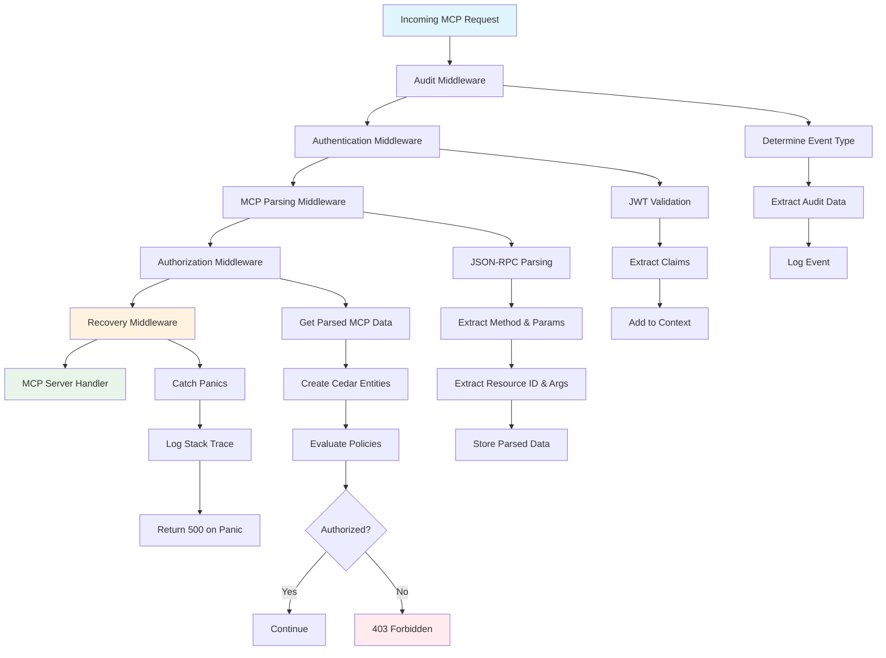
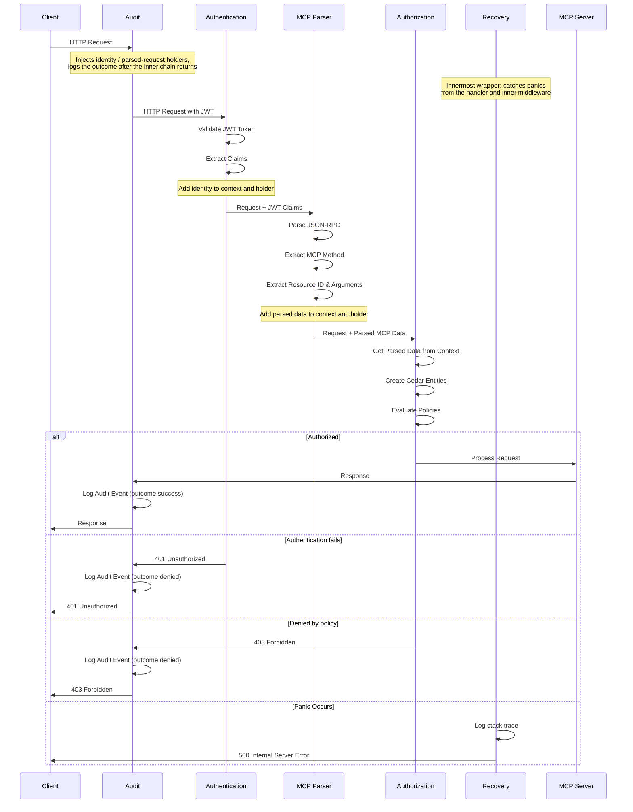
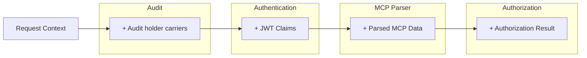
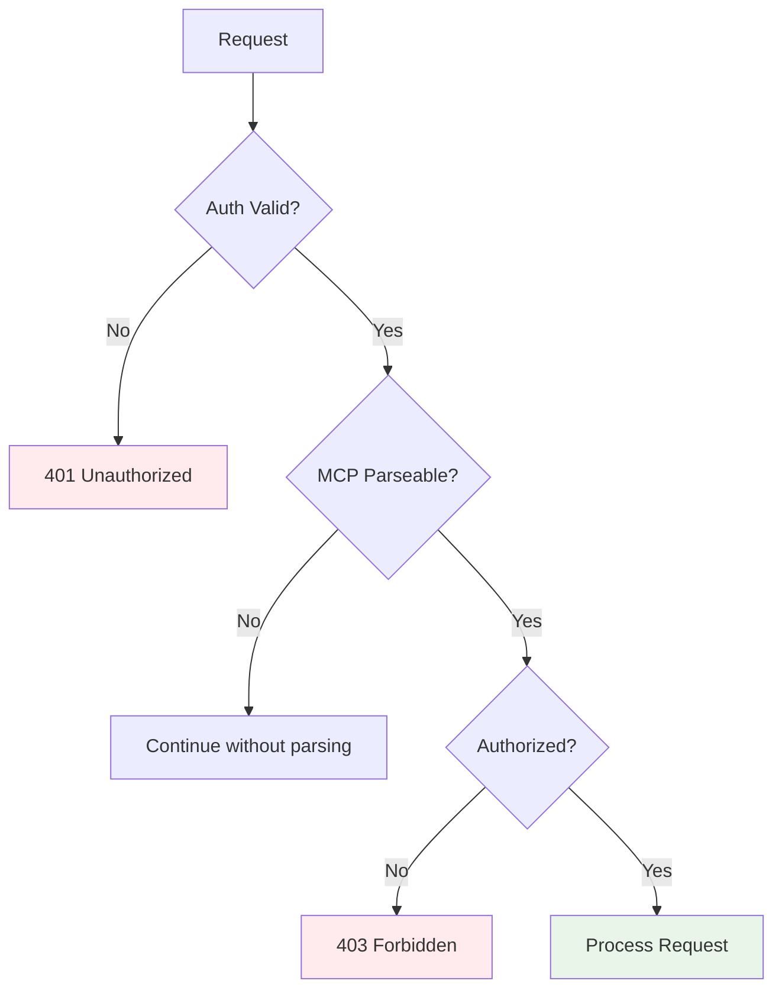

# Middleware Architecture

This document describes the middleware architecture used in ToolHive for processing MCP (Model Context Protocol) requests. The middleware chain provides authentication, parsing, authorization, and auditing capabilities in a modular and extensible way.

## Overview

ToolHive uses a layered middleware architecture to process incoming MCP requests. Each middleware component has a specific responsibility and operates in a well-defined order to ensure proper request handling, security, and observability.

This document primarily covers the middleware system for `thv` and `thv-proxyrunner`. The `vmcp` component has its own request processing pipeline documented in [Virtual MCP Architecture](arch/10-virtual-mcp-architecture.md#request-processing-pipeline).

The middleware chain consists of the following components:

1. **Audit Middleware**: Wraps the rest of the chain and logs every request outcome — including rejections from authentication, webhooks, and authorization (optional)
2. **Authentication Middleware**: Validates JWT tokens and extracts client identity
3. **Upstream Token Swap Middleware**: Exchanges ToolHive JWTs for upstream IdP tokens (automatic with embedded auth server)
4. **Token Exchange Middleware**: Exchanges JWT tokens for external service tokens via OAuth 2.0 Token Exchange (optional)
5. **MCP Parsing Middleware**: Parses JSON-RPC MCP requests and extracts structured data
6. **Tool Mapping Middleware**: Enables tool filtering and override capabilities through two complementary middleware components that process outgoing `tools/list` responses and incoming `tools/call` requests (optional)
7. **Usage Metrics Middleware**: Collects anonymous usage metrics for ToolHive development (optional)
8. **Telemetry Middleware**: Instruments requests with OpenTelemetry (optional)
9. **Authorization Middleware**: Evaluates Cedar policies to authorize requests (optional)
10. **Header Forward Middleware**: Injects custom headers into requests to remote MCP servers (optional)
11. **Recovery Middleware**: Catches panics and returns HTTP 500 errors (always present)

## Dynamic webhook middleware

ToolHive supports dynamic webhook middleware for request mutation and validation. Webhooks are configured externally and loaded at runtime with `thv run --webhook-config <file>`.

Two webhook types are supported:

1. **Mutating webhooks**: Transform the parsed MCP request before later policy evaluation.
2. **Validating webhooks**: Approve or deny the request after mutation has completed.

A mutating webhook therefore steers what authorization (and audit, telemetry, and usage metrics) evaluates, including the feature/operation mapping used to pick a Cedar policy. This is intended: an operator who configures a mutating webhook — including a fail-open one — is deliberately giving it influence over policy input, not introducing an accident.

When configured together, the effective order is:

1. Audit (wraps everything below, so webhook denials are audited)
2. Authentication
3. Token exchange and related auth middleware, when configured
4. MCP parsing
5. Mutating webhooks
6. Validating webhooks
7. Telemetry and authorization middleware

Multiple webhook definitions of the same type run in configuration order. When multiple `--webhook-config` files are provided, later files override earlier webhook definitions with the same `name`.

Configuration files may be written in YAML or JSON. Duration values such as `timeout` accept strings like `5s`, and omitted timeouts default to `10s`.

When the caller authenticated with an RFC 8693 delegated token, the request payload sent to webhook receivers includes a `delegation` field on the principal object, with the same shape as the `delegation` field documented under [Audit Middleware](#9-audit-middleware) below.

Example:

```bash
thv run postgres-mcp --webhook-config docs/examples/webhooks.yaml
```

Example config files:

- [`docs/examples/webhooks.yaml`](examples/webhooks.yaml)
- [`docs/examples/webhooks.json`](examples/webhooks.json)

### Known limitations

- **Stale Modern headers.** A mutating webhook patches only the JSON body, so after it renames a tool the `Mcp-Method`/`Mcp-Name` headers forwarded to the backend still describe the original name. `ValidateHeaderConsistency` (`pkg/mcp/revision.go:512`) requires the header and body to agree and returns a `RequestHeaderMismatchError` (`CodeHeaderMismatch`) if they don't, but today that check is only wired into vMCP (`pkg/vmcp/server/classification.go:72`), which never runs the mutating webhook — so nothing in ToolHive catches this yet. A spec-conformant Modern (2026-07-28) backend will reject the mismatched request itself, so this fails closed rather than silently mis-authorizing. Practical guidance: a mutating webhook must not rename tools on the Modern path.
- **Controls evaluated before mutation see the pre-mutation request.** The tool-call filter (`pkg/mcp/tool_filter.go`) reads the raw request body before parsing, and the rate limiter runs after parsing but before the mutating webhook (see the ordering rules below). Both decide against the request as received, not as mutated. A mutating webhook can therefore rename a call into a tool that `--tools` filtering excluded, and the rate limiter debits the bucket for the requested tool rather than the executed one. This is a known gap, not a regression: filtering must happen before excluded calls proceed, and rate limiting intentionally rejects excess traffic before making webhook round trips.

## Architecture Diagram



## Middleware Flow



## Middleware Components

### 1. Authentication Middleware

**Purpose**: Validates JWT tokens and extracts client identity information.

**Location**: `pkg/auth/middleware.go`

**Responsibilities**:
- Validate JWT token signature and expiration
- Extract JWT claims (sub, name, roles, etc.)
- Add claims to request context for downstream middleware

**Context Data Added**:
- JWT claims with `claim_` prefix (e.g., `claim_sub`, `claim_name`)

### 2. Upstream Token Swap Middleware

**Purpose**: Exchanges ToolHive-issued JWT tokens for the original upstream IdP tokens that were stored during the OAuth flow.

**Location**: `pkg/auth/upstreamswap/middleware.go`

**Availability**: Automatically enabled when using the embedded auth server (`EmbeddedAuthServerConfig`)

**Responsibilities**:
- Read the upstream access token for the configured provider from `Identity.UpstreamTokens`
- Inject the upstream access token into the request (replacing Authorization header or using a custom header)
- Return 401 Unauthorized with WWW-Authenticate header when the provider token is missing or empty

**Configuration**:

| Field | Type | Default | Description |
|-------|------|---------|-------------|
| `header_strategy` | string | `"replace"` | How to inject: `"replace"` (overwrite Authorization) or `"custom"` (add to custom header) |
| `custom_header_name` | string | - | Required when `header_strategy` is `"custom"` |

**Behavior**:
- **Automatic activation**: Enabled whenever the embedded auth server is configured, even without explicit `UpstreamSwapConfig`
- **Provider token found**: Injects the token into the request using the configured header strategy
- **Provider not in UpstreamTokens**: Returns 401 Unauthorized with `WWW-Authenticate` header indicating re-authentication is required
- **Empty token value**: Returns 401 Unauthorized (same as missing provider)
- **No identity in context**: Passes through without modification (auth middleware not in chain)
- **Storage unavailable**: The auth middleware returns 503 before the request reaches this middleware

**Context Data Used**:
- `Identity.UpstreamTokens` map populated by the Authentication middleware during JWT validation

**Note**: This middleware is a simple map reader. All upstream token loading, refresh, and error handling occurs in the Authentication middleware (Step 3), which populates `Identity.UpstreamTokens` from the token session ID (`tsid`) claim during JWT validation.

---

#### Understanding Auth, Upstream Swap, and Token Exchange Middleware

ToolHive provides three middleware components that handle authentication and token transformation. Understanding their differences and interactions is important for proper configuration:

| Middleware | Purpose | When to Use |
|------------|---------|-------------|
| **Authentication** | Validates incoming JWTs and extracts identity | Always required (validates who the client is) |
| **Upstream Token Swap** | Swaps ToolHive JWTs for stored upstream IdP tokens | When using embedded auth server and MCP backend needs upstream IdP token |
| **Token Exchange** | Exchanges tokens via OAuth 2.0 Token Exchange (RFC 8693) | When MCP backend requires tokens from an external STS endpoint |

**Execution Order**: Auth → Upstream Swap → Token Exchange

This order is critical because:
1. **Authentication** must run first to validate the JWT and extract the `tsid` claim
2. **Upstream Swap** must run before Token Exchange so it can read the `tsid` from the original ToolHive JWT before any modification
3. **Token Exchange** can optionally further transform the token if additional exchange is needed

**Common Scenarios**:

| Scenario | Middleware Used | Description |
|----------|----------------|-------------|
| External OIDC provider | Auth only | Client authenticates with external IdP, JWT is forwarded to MCP backend |
| Embedded auth server | Auth + Upstream Swap | Client authenticates with ToolHive, upstream IdP token injected for MCP backend |
| External OIDC + STS | Auth + Token Exchange | Client's JWT is exchanged via external STS for backend-specific token |
| Embedded auth + STS | Auth + Upstream Swap + Token Exchange | Upstream IdP token is retrieved, then further exchanged via STS |

---

### 3. MCP Parsing Middleware

**Purpose**: Parses JSON-RPC MCP requests and extracts structured information.

**Location**: `pkg/mcp/parser.go`

**Responsibilities**:
- Parse JSON-RPC 2.0 messages
- Extract MCP method names (e.g., `tools/call`, `resources/read`)
- Extract resource IDs and arguments based on method type
- Store parsed data in request context

**Context Data Added**:
- `ParsedMCPRequest` containing:
  - Method name
  - Request ID
  - Raw parameters
  - Extracted resource ID
  - Extracted arguments

**Supported MCP Methods**:
- `initialize` - Client initialization
- `tools/call`, `tools/list` - Tool operations
- `prompts/get`, `prompts/list` - Prompt operations
- `resources/read`, `resources/list` - Resource operations
- `notifications/*` - Notification messages
- `ping`, `logging/setLevel` - System operations

### 4. Authorization Middleware

**Purpose**: Evaluates Cedar policies to determine if requests are authorized.

**Location**: `pkg/authz/middleware.go`

**Responsibilities**:
- Retrieve parsed MCP data from context
- Create Cedar entities (Principal, Action, Resource)
- Evaluate Cedar policies against the request
- Allow or deny the request based on policy evaluation
- Filter list responses based on user permissions

**Dependencies**:
- Requires JWT claims from Authentication middleware
- Requires parsed MCP data from MCP Parsing middleware

### 5. Tool Mapping Middleware

**Purpose**: Provides tool filtering and override capabilities for MCP tools.

**Location**: `pkg/mcp/middleware.go` and `pkg/mcp/tool_filter.go`

**Features Provided**:

This middleware enables two key features for controlling tool visibility and presentation:

1. **Tool Filtering**: Restricts which tools are available to clients, allowing administrators to expose only a subset of tools provided by the MCP server
2. **Tool Override**: Allows renaming tools and modifying their descriptions as presented to clients, while maintaining correct routing to the actual underlying tools

**Implementation Notes**:

These features are implemented through two complementary middleware components that process traffic in different directions:
- One component handles outgoing responses containing tool lists
- Another component handles incoming requests to execute tools

Both components must be in place for the features to work correctly, as they ensure consistency between tool discovery and tool execution.

**Configuration**:
- `FilterTools`: List of tool names to expose to clients
- `ToolsOverride`: Map of tool name overrides and description changes

**Note**: When either filtering or override is configured, both middleware components are automatically enabled and configured with the same parameters to ensure consistent behavior, however it is an explicit design choice to avoid sharing any state between the two middleware components.

### 6. Usage Metrics Middleware

**Purpose**: Tracks tool call counts for usage analytics and usage metrics.

**Location**: `pkg/usagemetrics/middleware.go`

**Responsibilities**:
- Count `tools/call` requests by examining parsed MCP data
- Aggregate counts in-memory with atomic operations
- Flush metrics to API endpoint periodically (every 15 minutes)
- Reset counts daily at midnight UTC
- Manage background flush goroutine lifecycle

**Configuration**:
- Enabled by default
- Can be disabled via config: `thv config usage-metrics disable`
- Can be disabled via environment variable: `TOOLHIVE_USAGE_METRICS_ENABLED=false`
- Automatically disabled in CI environments

**Dependencies**:
- Requires parsed MCP data from MCP Parsing middleware

**Opting Out**:

Users can opt out of anonymous usage metrics in two ways:

```bash
# Via config (persistent)
thv config usage-metrics disable

# Via environment variable (session-only)
export TOOLHIVE_USAGE_METRICS_ENABLED=false
```

To re-enable:
```bash
thv config usage-metrics enable
```

**Note**: This middleware collects anonymous usage metrics for ToolHive development. Failures do not break request processing.

### 7. Telemetry Middleware

**Purpose**: Instruments HTTP requests with OpenTelemetry tracing and metrics.

**Location**: `pkg/telemetry/middleware.go`

**Responsibilities**:
- Create trace spans for HTTP requests
- Inject trace context into outgoing requests
- Record request metrics (duration, status codes, etc.)
- Export telemetry data to configured backends

**Configuration**:
- OTLP endpoint
- Service name and version
- Tracing enabled/disabled
- Metrics enabled/disabled
- Sampling rate
- Custom headers

### 8. Token Exchange Middleware

**Purpose**: Exchanges incoming JWT tokens for external service tokens using OAuth 2.0 Token Exchange (RFC 8693).

**Location**: `pkg/oauthproto/tokenexchange/middleware.go`

**Responsibilities**:
- Extract claims from authenticated JWT tokens
- Perform OAuth 2.0 Token Exchange with external identity providers
- Inject exchanged tokens into requests (replace Authorization header or custom header)
- Handle token exchange errors gracefully

**Context Data Used**:
- JWT claims from Authentication middleware

**Configuration**:
- Token exchange endpoint URL
- OAuth client credentials
- Target audience
- Scopes
- Header injection strategy (replace or custom)

**Note**: This middleware is registered in `pkg/runner/middleware.go` and can be configured through the standard middleware configuration system or used directly via the proxy command.

### 9. Audit Middleware

**Purpose**: Logs request events for compliance, monitoring, and debugging.

**Location**: `pkg/audit/middleware.go`

**Responsibilities**:
- Determine event type based on request characteristics
- Extract audit-relevant data from request and response
- Log structured audit events as JSON
- Track request duration and outcome
- Support file-based and stdout log destinations
- Wrap the rest of the chain (authentication, webhooks, authorization) so rejected requests are still recorded (outcome `denied`); the identity and parsed MCP data flow back from the inner middlewares via holder carriers

**Event Types**:
- `mcp_initialize` - Client initialization events
- `mcp_tool_call` - Tool execution events
- `mcp_tools_list` - Tool listing events
- `mcp_resource_read` - Resource access events
- `mcp_resources_list` - Resource listing events
- `mcp_prompt_get` - Prompt retrieval events
- `mcp_prompts_list` - Prompt listing events
- `mcp_notification` - Notification message events
- `mcp_ping` - Ping events
- `mcp_logging` - Logging level change events
- `mcp_completion` - Completion events
- `mcp_roots_list_changed` - Roots list change notifications
- `sse_connection` - SSE connection events (for SSE transport)
- `http_request` - General HTTP request events (fallback)

#### Configuration

The audit middleware is configured via the `audit-config` parameter:

```bash
# CLI usage
thv run --transport sse --name my-server --audit-config audit.json my-image:latest
```

**Configuration File Format** (`audit.json`):

```json
{
  "component": "my-service",
  "logFile": "/var/log/audit/audit.log",
  "eventTypes": ["mcp_tool_call", "mcp_resource_read"],
  "excludeEventTypes": ["mcp_ping"],
  "includeRequestData": true,
  "includeResponseData": true,
  "maxDataSize": 4096
}
```

**Configuration Options**:

| Field | Type | Required | Default | Description |
|-------|------|----------|---------|-------------|
| `component` | string | No | `"toolhive-api"` | Component name to include in audit logs |
| `logFile` | string | No | stdout | Path to audit log file (file created with 0600 permissions; parent directory must exist) |
| `eventTypes` | []string | No | all events | Whitelist of event types to audit (empty = audit all) |
| `excludeEventTypes` | []string | No | none | Blacklist of event types to exclude (takes precedence) |
| `includeRequestData` | bool | No | `false` | Include request body in audit logs |
| `includeResponseData` | bool | No | `false` | Include response body in audit logs |
| `maxDataSize` | int | No | `1024` | Maximum bytes to capture for request/response data |

**Important Notes**:
- `excludeEventTypes` takes precedence over `eventTypes`
- Requests rejected before the MCP parser runs (e.g. authentication failures) are typed `http_request`, not `mcp_*`. An `eventTypes` allowlist containing only `mcp_*` types will drop those rejection events — include `http_request` to keep them.
- When `includeRequestData` or `includeResponseData` is enabled, **`maxDataSize` must be set** (non-zero) for data capture to work
- Log files are created with restrictive permissions (0600) for security
- Logs are written in newline-delimited JSON format for easy parsing

#### Log Output Format

Audit events are logged as structured JSON objects:

```json
{
  "audit_id": "01be8d47-3ab0-4aa9-ad14-bd5bb408005d",
  "type": "mcp_tool_call",
  "logged_at": "2025-12-15T10:38:32.164124Z",
  "outcome": "success",
  "component": "vmcp-server",
  "source": {
    "type": "network",
    "value": "192.168.1.100",
    "extra": {
      "user_agent": "mcp-client/1.0",
      "request_id": "req-12345"
    }
  },
  "subjects": {
    "user_id": "user123",
    "user": "john.doe@example.com",
    "client_name": "my-mcp-client",
    "client_version": "1.0.0"
  },
  "delegation": {
    "chain": [
      {"iss": "https://auth.example.com", "sub": "agent-client-1"},
      {"sub": "agent-client-2"}
    ],
    "truncated": false,
    "omitted": 0,
    "malformed": false
  },
  "target": {
    "endpoint": "/messages",
    "method": "POST",
    "type": "tool",
    "name": "weather_tool"
  },
  "metadata": {
    "extra": {
      "duration_ms": 150,
      "transport": "streamable-http",
      "response_size_bytes": 1024
    }
  },
  "data": {
    "request": {"location": "New York"},
    "response": {"temperature": "22°C", "humidity": "65%"}
  }
}
```

**Field Descriptions**:

- `audit_id`: Unique identifier for the audit event (UUID format)
- `type`: Event type (one of the event types listed above)
- `logged_at`: ISO 8601 timestamp when the event was logged
- `outcome`: Result of the operation (`success`, `failure`, `denied`, `error`)
- `component`: Service/component that generated the event
- `source`: Information about the request source
  - `type`: Source type (`network` for HTTP requests)
  - `value`: Source identifier (client IP address)
  - `extra`: Additional source metadata (user agent, request ID, etc.)
- `subjects`: Information about the authenticated user/client
  - `user_id`: User subject identifier from JWT
  - `user`: User display name (from `name` claim, `preferred_username`, or `email`)
  - `client_name`: MCP client name (from JWT claims)
  - `client_version`: MCP client version (from JWT claims)
- `delegation`: RFC 8693 delegation chain (toolhive-core's canonical schema),
  present only when the caller authenticated with a delegated token (i.e. the
  JWT carries an `act` claim)
  - `chain`: Delegation hops, outermost (most recent) first — `chain[0]` is
    the direct delegate that presented the token. Always an array, never
    null; empty when `malformed` is `true` and no hop could be parsed at all
    - `iss`: The hop's issuer (from the `act` claim's `iss` member), when
      present and a string. Omitted otherwise
    - `sub`: Acting party identifier (from the `act` claim's `sub` member),
      when present and a string. Omitted otherwise. A non-string `iss` or
      `sub` leaves the field out and flags the chain `malformed` instead.
      Any other `act` claim members are deliberately never serialized
      (data minimization per RFC 8693 §6); per OpenID Connect Core §5.7 the
      (`iss`, `sub`) pair is the stable actor identifier
  - `truncated`: `true` when the chain exceeded the configured maximum depth
    (`maxDelegationDepth` in the audit config, default 10) and inner hops
    were dropped; the outermost hops — including `chain[0]`, the current
    actor — are always kept. Always present
  - `omitted`: Number of well-formed hops dropped due to the depth cap.
    Always present; `0` when nothing was dropped
  - `malformed`: `true` when the token's `act` claim violated RFC 8693
    conformance somewhere in the chain (non-object `act`, non-string `iss`
    or `sub`). Always present. Hops already parsed before the violation are
    still reported alongside it. A malformed value sitting immediately past
    the depth cap flags `malformed` but is not a countable hop for `omitted`
  - `malformedReason`: Low-cardinality label for the first conformance
    violation encountered (`act_not_object`, `nested_act_not_object`,
    `iss_not_string`, `sub_not_string`). Present only when `malformed` is
    `true`
- `target`: Information about the operation target
  - `endpoint`: HTTP endpoint path
  - `method`: HTTP method
  - `type`: Target type (`tool`, `resource`, `prompt`, `endpoint`)
  - `name`: MCP resource identifier (tool name, resource URI, etc.)
- `metadata.extra`: Additional operational metadata
  - `duration_ms`: Request duration in milliseconds
  - `transport`: Transport type (`sse`, `streamable-http`, `http`)
  - `response_size_bytes`: Response body size (when capturing response data)
- `data`: Captured request/response data (only present if enabled)
  - `request`: Request body (parsed as JSON if possible, otherwise string)
  - `response`: Response body (parsed as JSON if possible, otherwise string)

#### CLI Usage

**With audit configuration file**:
```bash
thv run --transport sse --name my-server --audit-config audit.json my-image:latest
```

**Minimal audit configuration (stdout)**:
```bash
thv run --transport sse --name my-server --audit-config <(echo '{"component":"my-service"}') my-image:latest
```

**Event filtering example**:
```json
{
  "component": "api-gateway",
  "eventTypes": ["mcp_tool_call", "mcp_resource_read"],
  "excludeEventTypes": ["mcp_ping"],
  "includeRequestData": true,
  "includeResponseData": true,
  "maxDataSize": 2048
}
```

### 10. Recovery Middleware

**Purpose**: Catches panics in HTTP handlers and returns a clean HTTP 500 error response.

**Location**: `pkg/recovery/recovery.go`

**Availability**: All components (`thv`, `thv-proxyrunner`, `vmcp`)

**Responsibilities**:
- Recover from panics in downstream handlers and middleware
- Log the panic message and full stack trace for debugging
- Return HTTP 500 Internal Server Error to the client
- Prevent server crashes from unhandled panics

**Behavior**:
- On the `vmcp` path it is applied explicitly as the outermost wrapper and catches panics from the entire chain. On the `thv`/`thv-proxyrunner` path it is appended last to the config slice, which makes it the innermost wrapper: it catches panics from the proxy handler, but not from middleware that wrap it
- Logs error with stack trace using `logger.Errorf`
- Returns generic "Internal Server Error" message (no sensitive details exposed)

**Configuration**: None required. This middleware is always present and has no configurable parameters.

**Note**: Recovery middleware has no cleanup requirements (`Close()` is a no-op).

### 11. Header Forward Middleware

**Purpose**: Injects custom headers into requests before they are forwarded to remote MCP servers.

**Location**: `pkg/transport/middleware/header_forward.go`

**Availability**: `thv` and `thv-proxyrunner` only (not used by `vmcp`)

**Responsibilities**:
- Inject configured headers into outgoing requests to remote MCP servers
- Validate headers against a security blocklist
- Pre-canonicalize header names at creation time for efficiency

**Configuration**:
- `AddHeaders`: Map of header names to values to inject into requests

**Restricted Headers**:

The following headers cannot be configured for forwarding due to security concerns:

| Category | Headers |
|----------|---------|
| Routing manipulation | `Host` |
| Hop-by-hop (RFC 7230, 7540) | `Connection`, `Keep-Alive`, `Te`, `Trailer`, `Upgrade`, `Http2-Settings` |
| Proxy headers | `Proxy-Authorization`, `Proxy-Authenticate`, `Proxy-Connection` |
| Request smuggling vectors | `Transfer-Encoding`, `Content-Length` |
| Identity spoofing | `Forwarded`, `X-Forwarded-For`, `X-Forwarded-Host`, `X-Forwarded-Proto`, `X-Real-Ip` |

**Behavior**:
- Returns a no-op middleware if no headers are configured
- Logs configured header names at startup (never logs values for security)
- Warns if `Authorization` header is configured (ensure value is appropriate for target)
- Returns error if any restricted header is configured

**CLI Usage**:

```bash
# Add custom headers when proxying to a remote MCP server
thv proxy my-server --target-uri https://mcp.example.com --remote-forward-headers "X-Custom-Header=value" --remote-forward-headers "X-API-Key=secret"
```

## Data Flow Through Context

The middleware chain uses Go's `context.Context` to pass data between components:



## Configuration

### Enabling Middleware

The middleware chain is automatically configured when starting an MCP server with ToolHive:

```bash
# Basic MCP server (Authentication + Parsing + Audit)
thv run --transport sse --name my-server my-image:latest

# With authorization enabled
thv run --transport sse --name my-server --authz-config authz.yaml my-image:latest

# With custom audit configuration
thv run --transport sse --name my-server --audit-config audit.yaml my-image:latest
```

### Middleware Order

The middleware order is critical and enforced by the system:

1. **Audit** - Wraps the rest of the chain so every request outcome is logged, including authentication failures (401) and policy denials (403, outcome `denied`). The identity and parsed MCP data are published back to it by the inner middlewares via holder carriers.
2. **Authentication** - Establishes client identity
3. **MCP Parsing** - Must come after authentication to access JWT context
4. **Authorization** - Must come after parsing to access structured MCP data

## Error Handling

Each middleware component handles errors gracefully:



**Error Responses**:
- `401 Unauthorized` - Invalid or missing JWT token
- `403 Forbidden` - Valid token but insufficient permissions
- `400 Bad Request` - Malformed MCP request (when parsing is required)

## Performance Considerations

### Parsing Optimization

The MCP parsing middleware uses efficient strategies:

- **Map-based method handlers** instead of large switch statements
- **Single-pass parsing** of JSON-RPC messages
- **Lazy evaluation** - only parses MCP-specific endpoints
- **Context reuse** - parsed data shared across middleware

### Authorization Caching

The authorization middleware optimizes policy evaluation:

- **Policy compilation** happens once at startup
- **Entity creation** is optimized for common patterns
- **Result caching** for repeated identical requests (when enabled)

## Monitoring and Observability

### Audit Events

All middleware components contribute to audit events:

```json
{
  "type": "mcp_tool_call",
  "loggedAt": "2025-06-03T13:02:28Z",
  "source": {"type": "network", "value": "192.0.2.1"},
  "outcome": "success",
  "subjects": {"user": "user123"},
  "component": "toolhive-api",
  "target": {
    "endpoint": "/messages",
    "method": "POST",
    "type": "tool",
    "resource_id": "weather"
  },
  "data": {
    "request": {"location": "New York"},
    "response": {"temperature": "22°C"}
  },
  "metadata": {
    "auditId": "uuid",
    "duration_ms": 150,
    "transport": "http"
  }
}
```

### Metrics

Key metrics tracked by the middleware:

- **Request duration** - Time spent in each middleware component
- **Authorization decisions** - Permit/deny rates and reasons
- **Parsing success rates** - MCP message parsing statistics
- **Error rates** - Authentication and authorization failures

## Middleware Interfaces

ToolHive defines two key interfaces that middleware must implement to integrate with the system:

### Core Middleware Interface

All middleware must implement the `types.Middleware` interface defined in `pkg/transport/types/transport.go:24`:

```go
type Middleware interface {
    // Handler returns the middleware function used by the proxy.
    Handler() MiddlewareFunction
    // Close cleans up any resources used by the middleware.
    Close() error
}
```

The `MiddlewareFunction` type is defined as:

```go
type MiddlewareFunction func(http.Handler) http.Handler
```

### Middleware Configuration

Middleware configuration is handled through the `MiddlewareConfig` struct:

```go
type MiddlewareConfig struct {
    // Type is a string representing the middleware type.
    Type string `json:"type"`
    // Parameters is a JSON object containing the middleware parameters.
    Parameters json.RawMessage `json:"parameters"`
}
```

### Middleware Factory Function

Each middleware must provide a factory function that matches the `MiddlewareFactory` signature:

```go
type MiddlewareFactory func(config *MiddlewareConfig, runner MiddlewareRunner) error
```

The factory function is responsible for:
1. Parsing the middleware parameters from JSON
2. Creating the middleware instance
3. Registering the middleware with the runner
4. Setting up any additional handlers (auth info, metrics, etc.)

### Middleware Runner Interface

Middleware can interact with the runner through the `MiddlewareRunner` interface:

```go
type MiddlewareRunner interface {
    // AddMiddleware adds a middleware instance to the runner's middleware chain
    AddMiddleware(name string, middleware Middleware)

    // SetAuthInfoHandler sets the authentication info handler (used by auth middleware)
    SetAuthInfoHandler(handler http.Handler)

    // SetPrometheusHandler sets the Prometheus metrics handler (used by telemetry middleware)
    SetPrometheusHandler(handler http.Handler)

    // GetConfig returns a config interface for middleware to access runner configuration
    GetConfig() RunnerConfig

    // GetUpstreamTokenReader returns an UpstreamTokenReader for identity enrichment.
    // Returns nil if the embedded auth server is not configured.
    GetUpstreamTokenReader() upstreamtoken.UpstreamTokenReader
}
```

## Extending the Middleware

### Adding New Middleware

To add new middleware to the chain:

1. **Implement the Core Interface**: Create a struct that implements `types.Middleware`
2. **Define Parameters Structure**: Create a parameters struct for configuration
3. **Create Factory Function**: Implement a factory function with the correct signature
4. **Register with Runner**: Add your middleware type to the supported middleware map
5. **Update Configuration**: Add middleware to the configuration population logic
6. **Write Tests**: Include comprehensive tests for your middleware

#### Step-by-Step Implementation

**Step 1: Implement the Middleware Interface**

```go
package yourpackage

import (
    "net/http"
    "github.com/stacklok/toolhive/pkg/transport/types"
)

const (
    MiddlewareType = "your-middleware"
)

// MiddlewareParams defines the configuration parameters
type MiddlewareParams struct {
    SomeConfig string `json:"some_config"`
    Enabled    bool   `json:"enabled"`
}

// Middleware implements the types.Middleware interface
type Middleware struct {
    middleware types.MiddlewareFunction
    params     MiddlewareParams
}

// Handler returns the middleware function
func (m *Middleware) Handler() types.MiddlewareFunction {
    return m.middleware
}

// Close cleans up resources
func (m *Middleware) Close() error {
    // Cleanup logic here
    return nil
}
```

**Step 2: Create the Factory Function**

```go
// CreateMiddleware factory function for your middleware
func CreateMiddleware(config *types.MiddlewareConfig, runner types.MiddlewareRunner) error {
    // Parse parameters
    var params MiddlewareParams
    if err := json.Unmarshal(config.Parameters, &params); err != nil {
        return fmt.Errorf("failed to unmarshal middleware parameters: %w", err)
    }

    // Create the actual HTTP middleware function
    middlewareFunc := func(next http.Handler) http.Handler {
        return http.HandlerFunc(func(w http.ResponseWriter, r *http.Request) {
            // Your middleware logic here
            next.ServeHTTP(w, r)
        })
    }

    // Create middleware instance
    middleware := &Middleware{
        middleware: middlewareFunc,
        params:     params,
    }

    // Add to runner
    runner.AddMiddleware(MiddlewareType, middleware)

    // Set up additional handlers if needed
    // runner.SetPrometheusHandler(someHandler)
    // runner.SetAuthInfoHandler(someHandler)

    return nil
}
```

**Step 3: Register with the System**

Add your middleware to `pkg/runner/middleware.go` in the `GetSupportedMiddlewareFactories()` function:

```go
func GetSupportedMiddlewareFactories() map[string]types.MiddlewareFactory {
    return map[string]types.MiddlewareFactory{
        auth.MiddlewareType:                   auth.CreateMiddleware,
        tokenexchange.MiddlewareType:          tokenexchange.CreateMiddleware,
        upstreamswap.MiddlewareType:           upstreamswap.CreateMiddleware,
        mcp.ParserMiddlewareType:              mcp.CreateParserMiddleware,
        mcp.ToolFilterMiddlewareType:          mcp.CreateToolFilterMiddleware,
        mcp.ToolCallFilterMiddlewareType:      mcp.CreateToolCallFilterMiddleware,
        usagemetrics.MiddlewareType:           usagemetrics.CreateMiddleware,
        telemetry.MiddlewareType:              telemetry.CreateMiddleware,
        authz.MiddlewareType:                  authz.CreateMiddleware,
        audit.MiddlewareType:                  audit.CreateMiddleware,
        recovery.MiddlewareType:               recovery.CreateMiddleware,
        headerfwd.HeaderForwardMiddlewareName: headerfwd.CreateMiddleware,
        yourpackage.MiddlewareType:            yourpackage.CreateMiddleware,
    }
}
```

**Step 4: Update Configuration Population**

Add your middleware to `pkg/runner/middleware.go:27` in the `PopulateMiddlewareConfigs()` function:

```go
// Your middleware (if enabled)
if config.YourMiddlewareConfig != nil {
    yourParams := yourpackage.MiddlewareParams{
        SomeConfig: config.YourMiddlewareConfig.SomeConfig,
        Enabled:    config.YourMiddlewareConfig.Enabled,
    }
    yourConfig, err := types.NewMiddlewareConfig(yourpackage.MiddlewareType, yourParams)
    if err != nil {
        return fmt.Errorf("failed to create your middleware config: %w", err)
    }
    middlewareConfigs = append(middlewareConfigs, *yourConfig)
}
```

#### Example: Authentication Middleware Implementation

For reference, here's how the authentication middleware is implemented:

```go
// pkg/auth/middleware.go
func CreateMiddleware(config *types.MiddlewareConfig, runner types.MiddlewareRunner) error {
    var params MiddlewareParams
    if err := json.Unmarshal(config.Parameters, &params); err != nil {
        return fmt.Errorf("failed to unmarshal auth middleware parameters: %w", err)
    }

    // Create token validator
    validator, err := NewTokenValidator(params.OIDCConfig)
    if err != nil {
        return fmt.Errorf("failed to create token validator: %w", err)
    }

    // Create middleware function
    middlewareFunc := createAuthMiddleware(validator)

    // Create middleware instance
    middleware := &Middleware{
        middleware:      middlewareFunc,
        authInfoHandler: createAuthInfoHandler(params.OIDCConfig),
    }

    // Register with runner
    runner.AddMiddleware(auth.MiddlewareType, middleware)
    runner.SetAuthInfoHandler(middleware.AuthInfoHandler())

    return nil
}
```

### Middleware Execution Order

The middleware chain execution order is critical and controlled by the order in `PopulateMiddlewareConfigs()` in `pkg/runner/middleware.go`.

1. **Audit Middleware** (if enabled) - Request logging; wraps everything below so every rejection is audited
2. **Authentication Middleware** (always present) - Validates JWT tokens and extracts claims
3. **Upstream Token Swap Middleware** (if embedded auth server configured) - Swaps ToolHive JWT for upstream IdP token
4. **Token Exchange Middleware** (if enabled) - Exchanges JWT for external service tokens via OAuth 2.0 Token Exchange
5. **Tool Filter Middleware** (if enabled) - Filters available tools in list responses
6. **Tool Call Filter Middleware** (if enabled) - Filters tool call requests
7. **MCP Parser Middleware** (always present) - Parses JSON-RPC MCP requests
8. **Telemetry Middleware** (if enabled) - Starts the request span; finalizes MCP identity after the inner chain returns
9. **Rate Limit Middleware** (if configured) - Enforces per-identity/tool limits using the parsed request
10. **Mutating Webhook Middleware** (if configured) - Patches the parsed MCP request and republishes the parse
11. **Validating Webhook Middleware** (if configured) - Approves or denies the (possibly mutated) request
12. **Usage Metrics Middleware** (if enabled) - Tracks tool call counts
13. **Authorization Middleware** (if enabled) - Cedar policy evaluation
14. **Header Forward Middleware** (if configured for remote servers) - Injects custom headers
15. **Recovery Middleware** (always present) - Catches panics

**Important Ordering Rules**:
- Audit wraps the whole chain (directly inside the body-size limit): every request that passes the size cap produces an audit event no matter which middleware rejects it. It does not need to run inside auth or the parser — those publish the identity and parsed MCP data back to it via `auth.IdentityHolder` and `mcp.ParsedRequestHolder`.
  - Tradeoff: with `includeRequestData` enabled (default off), audit buffers the request body (up to `maxDataSize`, itself capped by the body-size limit) *before* authentication, so unauthenticated requests that will 401 also pay the buffer cost. This is inherent to auditing rejected requests — the body must be read before the outcome is known — and is bounded per-request.
- Authentication must come before the other middlewares to establish client identity
- Upstream Token Swap must come after Authentication (requires `tsid` claim) and before Token Exchange (so it can read the original JWT)
- Token Exchange must come after Upstream Swap if both are used (can further transform the upstream IdP token)
- Tool filters should come before MCP Parser to operate on raw requests
- MCP Parser must come before Authorization (provides structured MCP data)
- Telemetry must come before Rate Limiting so the limiter can annotate the active request span; telemetry finalizes MCP names, attributes, and metrics after downstream processing from the shared parsed-request holder
- Rate Limiting must come before webhooks so rejected traffic does not invoke outbound webhook requests
- Mutating webhooks must come before Validating webhooks and before Authorization, so policy evaluation sees the patched request
- Middleware that rewrites the request body must republish the parsed request via `mcp.RepublishParsedMCPRequest` and refresh `r.ContentLength` — `ParsingMiddleware` deliberately parses only once, so downstream consumers read the refreshed context while outer audit and telemetry wrappers read the refreshed `mcp.ParsedRequestHolder` after the inner chain returns
- Header Forward executes close to the backend handler (innermost position)
- Recovery is always last in config, making it the innermost wrapper (the chain wraps in reverse config order, so the first entry is the outermost and runs first)
- Body-size limit and Origin validation stay OUTSIDE audit: oversized bodies must be rejected before audit buffers request data, and origin validation is a pre-auth DNS-rebind guard. Their rejections (413/403) are the only ones not audited.
- The list above (steps 1-15) describes the operator/proxyrunner path (`PopulateMiddlewareConfigs` in `pkg/runner/middleware.go`). The CLI flag path (`WithMiddlewareFromFlags` in `pkg/runner/config_builder.go`) has no rate limiting at all, and orders Usage Metrics before the webhooks rather than after (see the comment at `pkg/runner/config_builder.go:700`) — both paths still run Mutating before Validating webhooks and both before Authorization.

### Custom Authorization Policies

See the [Authorization Framework](authz.md) documentation for details on writing Cedar policies.

### Custom Audit Events

The audit middleware can be extended to capture additional event types and data fields based on your requirements.

## Troubleshooting

### Common Issues

**Middleware Order Problems**:
- Ensure authentication runs before authorization
- Ensure MCP parsing runs before authorization
- Check that all required middleware is included in tests

**Context Data Missing**:
- Verify middleware order is correct
- Check that upstream middleware completed successfully
- Ensure context keys are correctly defined and used

**Performance Issues**:
- Monitor middleware execution time
- Check for inefficient policy evaluation
- Consider enabling authorization result caching

### Debug Information

Enable debug logging to see middleware execution:

```bash
export LOG_LEVEL=debug
thv run --transport sse --name my-server my-image:latest
```

This will show detailed information about each middleware component's execution and data flow.
