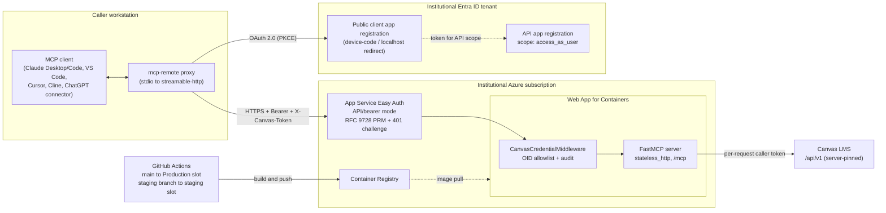

# Canvas MCP — Hosted HTTP Deployment Specification

**Audience:** institutional teams (IT, learning technology, GRC/privacy) evaluating or standing up
their own hosted instance of [canvas-mcp](https://github.com/vishalsachdev/canvas-mcp).

**Status:** describes a pattern that has been running in production at a large public R1 since
mid-2026. All identifiers below are placeholders — substitute your own.

**Scope:** the multi-user **hosted HTTP** deployment. The default open-source product is the
single-user **stdio** server (`canvas-mcp-server`, credentials from a local `.env`); that path needs
none of this document. Read this only if you intend to run one server that many staff share.

**In this folder:**

| File | Purpose |
|---|---|
| `README.md` | This specification |
| `deploy-prod.yml.sample` | GitHub Actions workflow: `main` → Production slot (copy to `.github/workflows/`, fill placeholders) |
| `deploy-staging.yml.sample` | GitHub Actions workflow: `staging` branch → staging slot |
| `appsettings.example.json` | App Service app settings for HTTP mode (`az webapp config appsettings set --settings @appsettings.example.json`) |
| `authsettingsv2.example.json` | Easy Auth `authsettingsV2` config for API/bearer mode (§4.5) |

---

## 1. Executive summary

Canvas MCP is a **tool provider**, not a model host. It exposes ~96 Canvas LMS operations
(courses, assignments, pages, modules, discussions, rubrics, submissions, analytics, messaging) as
MCP tools. The LLM that reasons over returned Canvas data lives in the **client** (Claude Desktop /
Claude Code, ChatGPT connectors, VS Code, Cursor, Cline, Continue, …). Consequently the privacy
boundary is determined by *which model the client uses*, not by this server — see §8.

The hosted deployment's three defining design decisions:

1. **The server holds no Canvas credential.** Every caller sends their own Canvas API token on each
   request (`X-Canvas-Token`). A startup guard refuses to boot if a server-side `CANVAS_API_TOKEN`
   is present in HTTP mode. There is no shared token to leak, and Canvas-side authorization
   (what the caller may see) is enforced by Canvas against that caller's own token.
2. **Identity is enforced by the platform, not the app.** Azure App Service Easy Auth in
   API/bearer mode validates the Entra ID (Azure AD) token before the container is reached, and
   injects a trusted `X-MS-CLIENT-PRINCIPAL-ID`. The app authorizes and audits that identity.
3. **The Canvas API URL is server-pinned.** A client-supplied `X-Canvas-URL` is ignored and logged.
   This removes the SSRF surface entirely: the server can only ever talk to one Canvas host.

---

## 2. Architecture



**Components**

| Component | Azure service | Purpose |
|---|---|---|
| MCP server | App Service — **Web App for Containers** (Linux) | Runs the container; TLS terminated by Azure (`httpsOnly=true`) |
| Identity gate | App Service **Easy Auth** (`authsettingsV2`) | Validates Entra bearer tokens; emits RFC 9728 PRM + `401` challenge |
| Image store | **Azure Container Registry** | Holds the built image |
| Staging | App Service **deployment slot** | Validate a build against real Entra config before prod |
| (optional) Access requests | **Azure Table Storage** + **Azure Communication Services** | Self-service "request access" overlay with emailed admin approval |
| Custom hostname | Your institutional DNS + App Service managed certificate | **Required** — see §4.3 |

---

## 3. Authentication and authorization flow

### 3.1 Why MCP-native OAuth, not a browser redirect

MCP clients are not browsers. Easy Auth's default "Login" mode issues a `302` to a sign-in page,
which an MCP client cannot follow. The hosted pattern configures Easy Auth in **API/bearer mode**:

- `requireAuthentication = true`
- `unauthenticatedClientAction = Return401`
- token store enabled
- the PRM-with-scopes site setting enabled, so an unauthenticated request receives a
  `401` with a `WWW-Authenticate` challenge and RFC 9728 **Protected Resource Metadata**

The MCP client reads the PRM document, discovers the authorization server and scope, runs the OAuth
flow itself, and retries with a bearer token. This is the MCP-native path and works uniformly across
Claude Desktop/Code, Codex, VS Code and Cursor via the `mcp-remote` proxy.

### 3.2 Request lifecycle

1. Client sends `POST /mcp` with `Authorization: Bearer <entra token>` and `X-Canvas-Token: <caller's Canvas token>`.
2. **Easy Auth** validates the token (issuer, audience, `allowedApplications`) *before* the container
   sees the request. Invalid or absent → `401` + PRM challenge; the app never runs.
3. Easy Auth injects `X-MS-CLIENT-PRINCIPAL-ID` (the Entra object ID / OID) and
   `X-MS-CLIENT-PRINCIPAL` (base64 JSON claims).
4. **App middleware** (`CanvasCredentialMiddleware`):
   - `ENTRA_AUTH_ENABLED=true` → require a non-empty OID, else `401 "Missing verified Entra identity"`
     (defense in depth: fail closed if the platform header is somehow absent).
   - If `MCP_ENTRA_ALLOWED_OIDS` is non-empty and the OID is not in it (and not in the optional
     access-overlay table) → `403 "Identity not authorized for this MCP server"`.
   - Audit-log **only opaque identifiers**: the OID, the `scp` scope claim, and the `azp`/`appid`
     client-app id. The UPN/email claim is deliberately **not** logged — logging it would write PII
     to the app log on every request and bypass `LOG_REDACT_PII`.
   - Require a non-empty `X-Canvas-Token`, else `401`.
   - Ignore any `X-Canvas-URL` (warn-log); bind the request to the server-pinned `CANVAS_API_URL`.
   - Set a "HTTP request active" marker so downstream code refuses to fall back to any server
     credential.
5. Tools execute; every Canvas call uses the caller's own token via a per-request `ContextVar`.
6. The request context is cleared in a `finally` block regardless of outcome.

### 3.3 Trust model, stated plainly

`X-MS-CLIENT-PRINCIPAL-ID` is **spoofable by anything that can reach the container directly**. It is
trustworthy *only* because Easy Auth sits in front and strips/replaces it. Therefore:

- `ENTRA_AUTH_ENABLED` must be **false** in local and stdio runs (it is, by default).
- Nothing may be allowed to reach the container bypassing Easy Auth. On App Service this is the
  default; if you front the app differently (Container Apps, AKS, your own ingress), you own
  reproducing that guarantee, including blocking direct access to the container's port.

### 3.4 Two authorization layers, deliberately

| Layer | Enforces | Where |
|---|---|---|
| Entra tenant + `allowedApplications` | *is a valid campus identity using an approved client app* | Platform |
| `MCP_ENTRA_ALLOWED_OIDS` | *is one of the specific people we approved for this tool* | App |
| Canvas API token | *may see this specific course/student* | Canvas |

Leaving `MCP_ENTRA_ALLOWED_OIDS` empty means "any platform-authenticated tenant identity". For
FERPA-relevant data that is usually too broad for an initial rollout; start with an explicit
allowlist and relax deliberately.

### 3.5 Legacy access-key mode (v1)

Before Entra platform auth, the server gated on a shared-per-person `X-MCP-Access-Key`
(`MCP_ACCESS_KEYS`, comma-separated, one value per person so keys are individually revocable). This
code path still exists and is what runs when `ENTRA_AUTH_ENABLED` is unset. **Treat it as a
bootstrap/dev fallback, not a production posture** — static bearer strings give no MFA, no identity
attribution beyond "which key", and no central revocation.

### 3.6 Optional: self-service access approval

`ACCESS_REQUEST_ENABLED=true` (needs the `[hosted]` extra) turns a `403` into a workflow: the denied
identity is recorded in an Azure Table overlay, an admin is emailed via Azure Communication Services
with a signed approval link, and approval grants access without an app restart. Notes for reviewers:

- the `403` is sent **before** the notification is scheduled, so notification failure can never
  degrade the auth decision;
- approval links are HMAC-signed with `ACCESS_TOKEN_SECRET` and TTL-bound (24h);
- re-notification for the same OID is suppressed for `ACCESS_NOTIFY_COOLDOWN_HOURS`;
- with the feature off, the `/admin/access/*` routes return `404`.

---

## 4. Deployment runbook (generic)

Placeholders: `<app-name>`, `<resource-group>`, `<registry-name>`, `<app-service-plan>`,
`<subscription>`, `<hostname>` (e.g. `canvas-mcp.example.edu`), `<api-app-id>`, `<client-app-id>`.

### 4.1 Prerequisites

- An Azure subscription owned by the institution (this is what makes the compute boundary
  institutional — see §8).
- Contributor on a resource group; **note** that Contributor cannot create role assignments, which
  matters in §4.6.
- Ability to create two Entra app registrations in the institutional tenant (or a tenant admin who
  will).
- A DNS name you control under an institutional domain, and the ability to create `CNAME` + `TXT`
  records.
- Each user must be able to obtain a **Canvas API token**. At many institutions this is not
  self-service from Canvas settings but a ticketed request — confirm early, it is a common rollout
  blocker. Tokens also **expire**; see §7.3.

### 4.2 Container image

The repo ships a `Dockerfile` (Python 3.12-slim, non-root `mcp` user). It sets network-facing
defaults inside the image:

```
MCP_SERVER_NAME=canvas-mcp
EXECUTE_TYPESCRIPT_ENABLED=false
ENABLE_DATA_ANONYMIZATION=true
```

and starts:

```
canvas-mcp-server --transport streamable-http --host 0.0.0.0 --port ${PORT:-${WEBSITES_PORT:-8819}}
```

> **Review both defaults against your policy.** `EXECUTE_TYPESCRIPT_ENABLED=false` is the posture
> you want (§5.2). `ENABLE_DATA_ANONYMIZATION=true` means names are pseudonymized by default; an
> authenticated instructor acting on their own courses may find anonymized names break some
> workflows (messaging, grade discussions), in which case set it to `false` as an app setting —
> after your own privacy review. See §8.3.

Build and push:

```bash
az acr build -r <registry-name> -t canvas-mcp:$(git rev-parse --short HEAD) .
```

### 4.3 Web App

```bash
az webapp create \
  --name <app-name> --resource-group <resource-group> --plan <app-service-plan> \
  --deployment-container-image-name <registry-name>.azurecr.io/canvas-mcp:<tag>

az webapp update --name <app-name> --resource-group <resource-group> --https-only true
```

Create a `staging` deployment slot on the same app.

**Bind a custom hostname now, not later.** This is not cosmetic:

- Entra rejects `*.azurewebsites.net` as a token `resource`/App ID URI. Because the MCP SDK derives
  the OAuth `resource` from the PRM document (which reports the app's own URL), a default-hostname
  deployment fails at sign-in with `AADSTS9010010`.
- The fix is to bind `<hostname>`, register `https://<hostname>/mcp` as an **App ID URI** on the API
  app registration, and add it to Easy Auth `allowedAudiences` (RFC 8707 `aud`), so the PRM
  `resource` equals a registered identifier.

DNS: `CNAME <hostname> → <app-name>.azurewebsites.net`, plus the `TXT asuid.<hostname>` domain
verification record Azure gives you. Then bind the hostname and an App Service managed certificate
(SNI).

### 4.4 Entra app registrations

**API app** (`Canvas MCP API` or similar):
- Expose an API; App ID URI `https://<hostname>/mcp`; scope `access_as_user`.
- `api.requestedAccessTokenVersion = 2` — the validator path expects v2.0-shaped tokens
  (`aud` = bare GUID, `iss` ending `/v2.0`). Leaving this at v1 produces confusing audience
  mismatches even though the v2.0 endpoint is advertised.

**Client app** (`Canvas MCP Desktop Client` or similar):
- Public client; redirect URI `http://localhost:3334/oauth/callback` (matches `mcp-remote`).
- `isFallbackPublicClient = true` ("Allow public client flows") — required for the device-code flow
  to issue tokens without a client secret.
- Pre-authorize it on the API app's `access_as_user` scope.

### 4.5 Easy Auth

Configure `authsettingsV2` for API/bearer mode:

- `globalValidation.requireAuthentication = true`
- `globalValidation.unauthenticatedClientAction = Return401`
- `login.tokenStore.enabled = true`
- Entra provider with `allowedAudiences` including `api://<api-app-id>` **and** `https://<hostname>/mcp`
- `allowedApplications` = `<client-app-id>` (only your client app may mint usable tokens)
- Enable the site setting that serves PRM with scopes (`WEBSITE_AUTH_PRM_DEFAULT_WITH_SCOPES`), which
  is what turns the `401` into a spec-compliant RFC 9728 challenge.

### 4.6 App settings

See §6. Minimum for the Entra pattern:

```
CANVAS_API_URL=https://<your-canvas>/api/v1
ENTRA_AUTH_ENABLED=true
MCP_ALLOW_UNAUTHENTICATED=true      # the app-level key gate is off; Entra is the gate
MCP_ENTRA_ALLOWED_OIDS=<oid>,<oid>
EXECUTE_TYPESCRIPT_ENABLED=false
# CANVAS_API_TOKEN must NOT be set — startup guard enforces this
```

Add a user: resolve their OID (`az ad user show --id <netid>@<domain> --query id -o tsv`) and append
it to `MCP_ENTRA_ALLOWED_OIDS`. Changing an app setting recycles the app automatically. Remove by
dropping the OID and restarting. Store OIDs, not usernames — OIDs are stable and opaque.

### 4.7 Registry authentication — a known Azure snag

Managed-identity image pull is the correct end state, but it requires granting the app's managed
identity the `AcrPull` role on the registry — which requires `Microsoft.Authorization/roleAssignments/write`,
i.e. **Owner or User Access Administrator**, not Contributor. Teams with Contributor-only access
cannot grant it themselves and will see `ACRTokenRetrievalFailure` on pull.

Interim workaround: enable the registry admin user and store its credentials as CI secrets. Plan to
retire it — get an Owner to grant `AcrPull`, switch to MI pull, then disable the admin user.

### 4.8 Client configuration

```jsonc
{
  "command": "npx",
  "args": [
    "-y", "mcp-remote", "https://<hostname>/mcp",
    "--header", "X-Canvas-Token:<the user's Canvas token>",
    "--static-oauth-client-info", "{\"client_id\":\"<client-app-id>\"}",
    "--static-oauth-client-metadata",
    "{\"scope\":\"api://<api-app-id>/access_as_user offline_access\"}"
  ]
}
```

Two non-obvious requirements:

- **`offline_access` is mandatory.** Without it Entra mints no refresh token, the session dies about
  hourly, and the forced re-auth then tends to wedge. Entra honours the scope request directly — no
  app-registration change needed.
- Static client info avoids dynamic client registration (which the tenant will likely not permit).
  If the `api://…` scope form trips `AADSTS90009`, use the bare-GUID form
  `<api-app-id>/access_as_user`.

---

## 5. Security model and threat posture

### 5.1 Controls

| Control | Mechanism |
|---|---|
| No shared Canvas credential | Startup guard: `CANVAS_API_TOKEN` set in HTTP mode → refuse to start |
| Fail-closed by omission | HTTP mode with no `MCP_ACCESS_KEYS` refuses to start unless `MCP_ALLOW_UNAUTHENTICATED=true` is set *deliberately*; you cannot fail open by forgetting something |
| Entra requires opt-in pairing | `ENTRA_AUTH_ENABLED=true` without `MCP_ALLOW_UNAUTHENTICATED=true` refuses to start |
| SSRF elimination | `CANVAS_API_URL` server-pinned; `X-Canvas-URL` ignored |
| Per-identity authorization | `MCP_ENTRA_ALLOWED_OIDS` (+ optional approval overlay) |
| PII-safe logging | `LOG_REDACT_PII=true`; UPN/email claim never logged; log sanitizer applied to all log paths |
| Transport | `httpsOnly=true`, TLS terminated at Azure |
| Container | non-root user; no code-execution tool |
| Least data at rest | Server is stateless (`stateless_http=True`); no Canvas data persisted |

### 5.2 Code execution must stay disabled

The repo includes an `execute_typescript` tool. As of v1.6.0 it is **opt-in** (disabled by default
in both code and image). On any multi-tenant, internet-reachable instance, keep it that way — set
`EXECUTE_TYPESCRIPT_ENABLED=false` explicitly on **every slot** so the posture survives upgrades.

Reason: the sandbox's network block is implemented *inside Node* (a `globalThis.fetch` guard).
Sandboxed code can bypass it by spawning non-Node binaries present in the base image (`wget`,
`busybox`). On a hosted instance that is a token-exfiltration path available to every authorized
caller. Do not enable it until the sandbox has **container-level** egress control (`--network=none`
or an egress allowlist), a non-root sandbox user, and a minimal prebuilt image. Tracked upstream as
issue #157.

### 5.3 Residual risks to disclose in an institutional review

1. **Caller's Canvas token in transit and in client config.** It travels as a request header over
   TLS and typically lives in a client config file on the user's workstation. The server never
   stores it (per-request `ContextVar`, cleared in `finally`), but workstation hygiene is a real
   dependency. Prefer short token lifetimes.
2. **Authorization is Canvas's, not ours.** The server does not re-implement Canvas permissions; a
   caller can do through MCP exactly what they can do in Canvas. That is intentional and is the
   right answer, but reviewers sometimes expect a second permission layer.
3. **Egress to the model provider is a client-side property.** See §8.
4. **Bypassing the ingress defeats the identity model.** §3.3.
5. **Registry admin credentials** as CI secrets until `AcrPull` is granted (§4.7).
6. **Bulk-write blast radius.** Tools exist that bulk-delete announcements or bulk-grade. They have
   confirmation/dry-run affordances, but an authorized caller with an LLM driving them can change a
   lot quickly. Institutional answer: allowlist deliberately, keep audit logging on.

### 5.4 Audit logging

Off by default. Enable on hosted instances:

```
LOG_ACCESS_EVENTS=true
LOG_EXECUTION_EVENTS=true
AUDIT_LOG_DIR=/home/LogFiles/audit    # persisted App Service storage
```

Audit records go to a dedicated `canvas_mcp.audit` logger with rotation, separate from app logs.
Forwarding these into an institutional SIEM (Splunk or equivalent) is a common review recommendation
and is worth planning for up front.

---

## 6. Environment variable reference (HTTP-mode relevant)

| Variable | Default | Hosted setting | Notes |
|---|---|---|---|
| `CANVAS_API_URL` | — | `https://<canvas>/api/v1` | **Required.** Server-pinned. Bare host is auto-normalized to `/api/v1` |
| `CANVAS_API_TOKEN` | — | **must be unset** | Startup guard fails closed if set in HTTP mode |
| `ENTRA_AUTH_ENABLED` | `false` | `true` | Trust the platform `X-MS-CLIENT-PRINCIPAL-ID`. Never set outside App Service-style ingress |
| `MCP_ALLOW_UNAUTHENTICATED` | `false` | `true` | Required companion to Entra mode; means "external auth is the gate", not "no auth" |
| `MCP_ENTRA_ALLOWED_OIDS` | empty | explicit list | Empty = any platform-authenticated identity |
| `MCP_ACCESS_KEYS` | empty | empty (v1 only) | Legacy per-person static keys |
| `EXECUTE_TYPESCRIPT_ENABLED` | `false` | `false` | Opt-in since v1.6.0; still set explicitly on **every slot** |
| `ENABLE_DATA_ANONYMIZATION` | `true` | policy choice | See §8.3 |
| `ANONYMIZATION_DEBUG` | `false` | `false` | |
| `LOG_REDACT_PII` | `true` | `true` | Keep on |
| `LOG_LEVEL` | `INFO` | `INFO` | |
| `LOG_API_REQUESTS` | `false` | `false` | |
| `LOG_ACCESS_EVENTS` / `LOG_EXECUTION_EVENTS` | `false` | `true` | Audit trail |
| `AUDIT_LOG_DIR` | empty | persisted path | |
| `CANVAS_ROLE` | `all` | `all` or `educator` | Tool profile: `student`, `educator`, or `all`. Student *write* tools additionally require the `STUDENT_WRITE_TOOLS` allowlist (empty by default — every student write is off unless the operator names it) |
| `API_TIMEOUT` / `CACHE_TTL` / `MAX_CONCURRENT_REQUESTS` | `30` / `300` / `10` | tune | |
| `READ_FILE_MAX_SIZE_MB` | `100` | tune | Course-file read cap |
| `MCP_SERVER_NAME` | `canvas-api` | `canvas-mcp` | |
| `ACCESS_REQUEST_ENABLED` | `false` | optional | Needs `[hosted]` extra (§3.6) |
| `ACCESS_TABLE_ACCOUNT` / `ACCESS_TABLE_NAME` | — / `accessoverlay` | if enabled | Table Storage via managed identity |
| `ACS_ENDPOINT` / `ACS_SENDER` / `ACCESS_ADMIN_EMAILS` | empty | if enabled | Approval email |
| `ACCESS_APPROVE_BASE_URL` / `ACCESS_TOKEN_SECRET` | empty | if enabled | Empty secret disables the feature (fail-closed) |
| `ACCESS_NOTIFY_COOLDOWN_HOURS` | `24` | | |
| `TS_SANDBOX_*` | secure defaults | n/a | Irrelevant while code exec is off |
| `PORT` / `WEBSITES_PORT` | `8819` fallback | platform-injected | |

Stdio-only variables (`MCP_BIND_HOST`, `MCP_BIND_PORT`, `MCP_CLIENT_AUTH_*`) are explicitly rejected
with an explanatory message rather than silently ignored.

---

## 7. CI/CD and operations

### 7.1 Branch-to-slot pattern

Two workflows, identical except for branch and slot:

| Workflow | Trigger | Target |
|---|---|---|
| `deploy-staging.yml` | push to `staging` | `staging` slot |
| `deploy-prod.yml` | push to `main` (i.e. every merged PR) | `Production` slot |

Both: checkout → compute an image tag from the short commit SHA → `docker/login-action` to the
registry → `docker/build-push-action` → `azure/webapps-deploy@v3` with a per-slot publish profile.
Both use `paths-ignore` for `docs/**`, `**.md`, `tools/**` so documentation commits do not trigger a
deploy, and a `concurrency` group per environment (prod `cancel-in-progress: false`, staging `true`).

Secrets required: registry username/password (or a service principal if you have the rights), and
`AZURE_WEBAPP_PUBLISH_PROFILE_PROD` / `_STAGING`.

Promotion: merge `staging` → `main` (fires the prod deploy), or perform an Azure slot swap.

Sample workflow (production; the staging variant swaps `main`→`staging` and `Production`→`staging`):

```yaml
name: Deploy to Azure — production
on:
  push:
    branches: [main]
    paths-ignore: ['docs/**', '**.md', 'tools/**']
  workflow_dispatch: {}

concurrency:
  group: deploy-prod
  cancel-in-progress: false

env:
  REGISTRY: <registry-name>.azurecr.io
  IMAGE: canvas-mcp
  APP_NAME: <app-name>

jobs:
  build-and-deploy:
    runs-on: ubuntu-latest
    steps:
      - uses: actions/checkout@v4
      - id: tag
        run: echo "tag=$(git rev-parse --short HEAD)" >> "$GITHUB_OUTPUT"
      - uses: docker/login-action@v3
        with:
          registry: ${{ env.REGISTRY }}
          username: ${{ secrets.ACR_USERNAME }}
          password: ${{ secrets.ACR_PASSWORD }}
      - uses: docker/build-push-action@v6
        with:
          context: .
          push: true
          tags: ${{ env.REGISTRY }}/${{ env.IMAGE }}:${{ steps.tag.outputs.tag }}
      - uses: azure/webapps-deploy@v3
        with:
          app-name: ${{ env.APP_NAME }}
          slot-name: Production
          publish-profile: ${{ secrets.AZURE_WEBAPP_PUBLISH_PROFILE_PROD }}
          images: ${{ env.REGISTRY }}/${{ env.IMAGE }}:${{ steps.tag.outputs.tag }}
```

### 7.2 CI/CD gotchas

- **Creating the `staging` branch does not fire the path-filtered trigger.** The branch-creation push
  is not matched. Kick the first run manually: `gh workflow run deploy-staging.yml --ref staging`.
- **SCM basic auth must remain enabled** on both the app and the slot, or `azure/webapps-deploy`
  fails with the unhelpful `Failed to get app runtime OS`.
- **Required-status-check names are literal.** If you rename a CI job, a branch ruleset pinned to the
  old name leaves PRs permanently `BLOCKED` with all-green CI and no clear error.

### 7.3 Operational notes

**Always validate on the staging slot first.** It carries real Entra configuration, which is the
part most likely to break. A useful three-step smoke test:

1. Unauthenticated `GET`/`POST` to `/mcp` returns **401** with a `WWW-Authenticate` challenge and a
   resolvable PRM document (proves Easy Auth is in bearer mode, not redirect mode).
2. An authenticated `initialize` handshake returns the expected server name and framework version
   (proves the new image is actually live, not a cached one).
3. One real tool call returns Canvas data (proves the credential path end-to-end).

**Canvas token expiry is the top support ticket.** Tokens expire; when one does, the server
faithfully relays Canvas's `401`, which users read as "the MCP server is broken". Two mitigations:
tell users the failure signature up front, and if your institution issues tokens with a fixed
lifetime, calendar the renewal.

**Session wedging.** Two historical failure modes, both now mitigated but worth knowing:

- *Server-side:* an in-memory session table dropped by an App Service recycle produced a fast `404`
  that `mcp-remote` hung on. Fixed by running the HTTP transport with `stateless_http=True` — there
  is no session table to go stale. Keep it that way.
- *Client-side:* a stale `_lock.json` under `~/.mcp-auth/mcp-remote-*/` can hold the OAuth callback
  port from a prior process and hang the new flow. Reset:
  `pkill -f "mcp-remote.*canvas"; rm -rf ~/.mcp-auth/mcp-remote-*`, then restart the client.
  Verify the fix by confirming `~/.mcp-auth/mcp-remote-*/*_tokens.json` now contains a
  `refresh_token` key.

**Recycles are routine.** App-setting changes recycle the app. Because the server is stateless, this
is safe; clients reconnect. Do not add server-side session state without revisiting this.

---

## 8. FERPA and privacy considerations for institutional review

### 8.1 Where the data boundary actually is

The server is a tool provider; the model lives in the client. Canvas data flows
Canvas → server → MCP client → **whatever model that client uses**. The server's compute boundary
being inside your Azure tenant does **not** by itself keep student data in-boundary. Reviewers
consistently need this stated explicitly, early.

### 8.2 The three-tier model

| Tier | Deployment | Model layer | Boundary type | Risk owner | Suitable for |
|---|---|---|---|---|---|
| **1 — Local / BYO** | Local stdio MCP, user's own client | Whatever the user's client uses (possibly consumer) | None institutional | Individual instructor/TA | Non-identifiable or anonymized work |
| **2 — Hosted + licensed model** | Hosted HTTP behind campus SSO + MFA | Institutionally licensed SaaS model under a DPA/BAA | **Contractual** — data egresses but is contractually use-limited | Institution, via vendor contract | Identifiable student data where contractual coverage is accepted |
| **3 — Hosted + in-tenant model** | Hosted HTTP behind campus SSO + MFA | In-tenant model (e.g. Azure OpenAI in your own subscription) | **Technical** — data never leaves the tenant | Institution, fully in-boundary | Identifiable student data; strongest posture |

Two points that tend to unblock reviews:

- **The highest-volume workload is Tier-1-appropriate as-is.** Course building, modification,
  QA/accessibility checking, and cross-course copying operate on *course content*, not identifiable
  student records. Only grading, analytics, and messaging workflows touch education records. Scoping
  the review to those workflows makes it much smaller.
- **Keep the deployment model-portable.** Nothing in the server ties it to a particular model
  vendor. That is what lets an institution move between Tier 2 and Tier 3 without re-architecting,
  and it is worth preserving as a design constraint.

Clients that work for Tiers 2–3 are those supporting remote MCP connectors, or model-agnostic
desktop agents pointed at the approved model — the latter preserves local automation while keeping
inference on the approved model.

### 8.3 Anonymization as a tier-lowering control

The server can anonymize student names in Canvas responses while preserving real user IDs (so
functionality still works). Two knobs: `ENABLE_DATA_ANONYMIZATION`, and a per-course student
anonymization map tool for analytical outputs. Used well, this lowers the tier a given task requires
— grade-distribution analytics can run at Tier 1 because no identifiable record reaches the model.

Two caveats for reviewers:

- The container image ships with `ENABLE_DATA_ANONYMIZATION=true` (§4.2). If you turn it off for
  instructor workflows, do so consciously and record the decision.
- Anonymization operates per-endpoint. A safe-endpoint short-circuit bug that bypassed
  anonymization was found and fixed in July 2026; treat the endpoint classification list as
  security-relevant code and re-test it after changes. Independent verification of the anonymizer
  against your own Canvas responses is a reasonable review ask.

### 8.4 Points a privacy office will raise

1. **Data classification.** Education records are typically the second-highest institutional tier
   ("Sensitive" or equivalent). Confirm your minimum-tier mapping before rollout, and confirm that
   any regulated High-Risk elements are excluded from AI tooling entirely.
2. **Need-to-know.** FERPA's school-official exception requires a legitimate educational interest.
   The OID allowlist is the mechanism that documents "we verified this person is authorized before
   disclosure".
3. **Identity standard conformance.** Campus SSO + MFA via Entra (rather than a static key) is
   usually a hard requirement; this pattern satisfies it.
4. **Logging.** Confirm that access logs contain opaque identifiers only, and decide on SIEM
   forwarding and retention.
5. **De-identification terminology.** Be precise: this is *pseudonymization* (reversible via the
   map), not irreversible de-identification. Reviewers care about the distinction.
6. **Sub-processors and licensing.** Expect a request for a dependency/license review and possibly a
   source code review of the server itself. It is a small Python codebase with a test suite; budget
   for the review rather than being surprised by it.

### 8.5 Minimum recommended posture for an institutional pilot

- Entra platform auth with an explicit OID allowlist (not empty, not access keys)
- `CANVAS_API_TOKEN` unset; per-user tokens only
- `EXECUTE_TYPESCRIPT_ENABLED=false` on all slots
- `LOG_REDACT_PII=true`; audit logging on and forwarded
- Custom institutional hostname with a managed certificate; `httpsOnly=true`
- Staging slot validated before every production change
- A written tier determination for which workflows may touch identifiable records
- A named owner for allowlist add/remove

---

## 9. What we would do differently starting over

- Bind the custom hostname and register the App ID URI **before** the first client test. Most of the
  early auth pain traced to the default `*.azurewebsites.net` hostname.
- Secure the `AcrPull` role assignment during initial provisioning, while an Owner is already
  engaged, instead of shipping on registry admin credentials.
- Add `offline_access` to the documented client config from day one.
- Treat the staging slot as mandatory, not optional. Every Entra-adjacent change should land there
  first.
- Start the GRC conversation with the tier table (§8.2), not with the architecture diagram.
