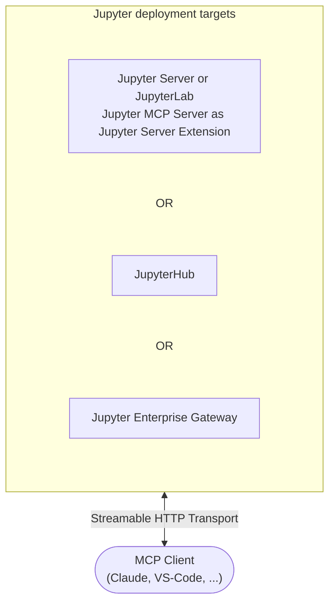

# Streamable HTTP Transport with Jupyter Server Extension

The following diagram illustrates how **Jupyter MCP Server** runs as an extension inside a **Jupyter server** and communicates with an MCP client.
In this configuration, you don't need to run a separate MCP server. It will start automatically when you start your Jupyter server.
Note that only **Streamable HTTP** transport is supported in this configuration.



Legend:

- D: Document aka Notebook
- R: Code Sandbox aka Kernel
- Jupyter Server or JupyterLab or Jupyter Notebook: host containing the Jupyter MCP Server extension

## 1. Start JupyterLab and the MCP Server

### Environment setup

Make sure you have the following packages installed in your environment. The collaboration package is needed as the modifications made on the notebook can be seen thanks to [Jupyter Real Time Collaboration](https://jupyterlab.readthedocs.io/en/stable/user/rtc.html).

```bash
pip install "jupyter-mcp-server" "jupyterlab" "jupyter-collaboration" "ipykernel"
```

:::tip
To confirm your environment is correctly configured:
1. Open a notebook in JupyterLab
2. Type some content in any cell (code or markdown)
3. Observe the tab indicator: you should see an "×" appear next to the notebook name, indicating unsaved changes
4. Wait a few seconds—the "×" should automatically change to a "●" without manually saving

This automatic saving behavior confirms that the real-time collaboration features are working properly, which is essential for MCP server integration.
:::

### Start JupyterLab with MCP Extension

Start JupyterLab with the MCP server extension:

```bash
jupyter lab --port 4040 --IdentityProvider.token MY_TOKEN
```

This starts JupyterLab at [http://127.0.0.1:4040](http://127.0.0.1:4040) with the MCP server integrated.

For complete configuration options, see the [server configuration guide](/features/configuration).

## 2. Configure your MCP Client

MCP clients must authenticate to the MCP server by sending an `Authorization` header with Bearer token
specified with `--IdentityProvider.token` when starting JupyterLab.

### Claude Code

```bash
claude mcp add jupyter --transport http http://127.0.0.1:4040/mcp \
  --header "Authorization: Bearer MY_TOKEN"
```

### Other MCP Clients (using mcp-remote)

```json
{
  "mcpServers": {
    "jupyter": {
      "command": "npx",
      "args": [
        "mcp-remote",
        "http://127.0.0.1:4040/mcp",
        "--header",
        "Authorization:${MCP_AUTH_HEADER}"
      ],
      "env": {
        "MCP_AUTH_HEADER": "Bearer MY_TOKEN"
      }
    }
  }
}
```

:::tip
Some clients (Cursor, Claude Desktop on Windows) have a bug where spaces inside `args` aren't escaped. Use no spaces around `:` in the header arg and put the space-containing value (`Bearer <token>`) in an environment variable as shown above.
:::

## Troubleshooting

### Common Issues

**Extension not loading:**
- Verify `jupyter-mcp-server` is installed: `pip list | grep jupyter-mcp-server`
- Check JupyterLab logs for extension errors

**MCP endpoint not accessible:**
- Verify server is running at: `curl http://localhost:4040/mcp`
- Check that port 4040 is not blocked

**Authentication errors (401/403):**
- Verify authentication token is accepted: `curl -H "Authorization: Bearer MY_TOKEN" http://localhost:4040/mcp/healthz`

For detailed configuration and troubleshooting, see the [configuration guide](/features/configuration).
