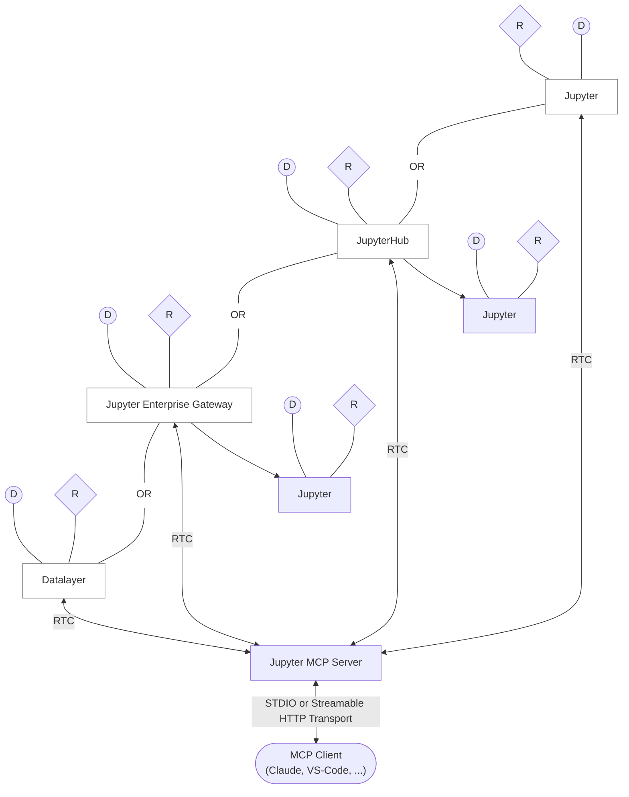

# Streamable HTTP Transport

The following diagram illustrates how **Jupyter MCP Server** connects to a **Jupyter server** or **Datalayer** and communicates with an MCP client.



Legend:

- D: Document (= Notebook)
- R: Code Sandbox (= Kernel)
- Jupyter Server or JupyterLab, Jupyter Notebook: host

## 1. Start JupyterLab

### Environment setup

Make sure you have the following packages installed in your environment. The collaboration package is needed as the modifications made on the notebook can be seen thanks to [Jupyter Real Time Collaboration](https://jupyterlab.readthedocs.io/en/stable/user/rtc.html).

```bash
pip install jupyterlab jupyter-collaboration jupyter-mcp-tools ipykernel
```

:::tip
To confirm your environment is correctly configured:
1. Open a notebook in JupyterLab
2. Type some content in any cell (code or markdown)
3. Observe the tab indicator: you should see an "×" appear next to the notebook name, indicating unsaved changes
4. Wait a few seconds—the "×" should automatically change to a "●" without manually saving

This automatic saving behavior confirms that the real-time collaboration features are working properly, which is essential for MCP server integration.
:::

### JupyterLab start

Then, start JupyterLab with the following command.

```bash
jupyter lab --port 8888 --IdentityProvider.token MY_TOKEN
```

You can also run `make jupyterlab` if you cloned the repository.

:::note

If you wish to start the Jupyter MCP server using docker, add `--ip 0.0.0.0` to the jupyter lab command to allow the MCP Server running in a Docker container to access your local JupyterLab.

:::

## 2. Start Jupyter MCP Server

The server runs on port `4040` and provides a streamable HTTP endpoint at `http://localhost:4040/mcp`.

### Using Python

Install and start the server:

```bash
pip install jupyter-mcp-server
jupyter mcp start \
  --transport streamable-http \
  --jupyter-url http://localhost:8888 \
  --jupyter-token MY_TOKEN \
  --mcp-token MY_MCP_TOKEN \
  --port 4040
```

:::tip Dynamic Connection
The `--jupyter-url` and `--jupyter-token` parameters are optional thanks to the [`connect_to_jupyter`](pathname:///mcp/features/#operation-connect-to-jupyter-tool) tool. This tool allows you to connect to different Jupyter servers dynamically during your conversation without restarting the MCP server.

Example usage: *"Connect to jupyter server http://localhost:8888 with token MY_TOKEN"*

⚠️ **Security Warning**: Using the `connect_to_jupyter` tool means providing the Jupyter token to the LLM, which is not secure in production environments.
:::

### Using Docker

**MacOS/Windows:**
```bash
docker run \
  -e JUPYTER_URL="http://host.docker.internal:8888" \
  -e JUPYTER_TOKEN="MY_TOKEN" \
  -e MCP_TOKEN="MY_MCP_TOKEN" \
  -p 4040:4040 \
  datalayer/jupyter-mcp-server:latest \
  --transport streamable-http
```

**Linux:**
```bash
docker run \
  --network=host \
  -e JUPYTER_URL="http://localhost:8888" \
  -e JUPYTER_TOKEN="MY_TOKEN" \
  -e MCP_TOKEN="MY_MCP_TOKEN" \
  -p 4040:4040 \
  datalayer/jupyter-mcp-server:latest \
  --transport streamable-http
```

For advanced configuration options, see the [server configuration guide](/features/configuration).

<!--

## Run with Smithery

To install Jupyter MCP Server for Claude Desktop automatically via [Smithery](https://smithery.ai/server/@datalayer/jupyter-mcp-server):

```bash
npx -y @smithery/cli install @datalayer/jupyter mcp --client claude
```

-->

## 3. Configure your MCP Client

MCP clients must authenticate to the MCP server by sending an `Authorization` header with the `MCP_TOKEN`.

:::important Management Route Security
In standalone `streamable-http` mode, management routes are restricted to local hostnames.

- `PUT /api/connect` and `DELETE /api/stop` require `Authorization: Bearer <MCP_TOKEN>`
- Non-local `Host` and browser `Origin` values are rejected for `/api/connect`, `/api/stop`, and `/api/healthz`
- `GET /api/healthz` remains available for local readiness checks
:::

### Claude Code

```bash
claude mcp add jupyter --transport http http://127.0.0.1:4040/mcp \
  --header "Authorization: Bearer MY_MCP_TOKEN"
```

### Other MCP Clients (using mcp-remote)

```json
{
  "mcpServers": {
    "jupyter": {
      "command": "npx",
      "args": [
        "mcp-remote",
        "http://127.0.0.1:4040/mcp",
        "--header",
        "Authorization:${MCP_AUTH_HEADER}"
      ],
      "env": {
        "MCP_AUTH_HEADER": "Bearer MY_MCP_TOKEN"
      }
    }
  }
}
```

:::tip
Some clients (Cursor, Claude Desktop on Windows) have a bug where spaces inside `args` aren't escaped. Use no spaces around `:` in the header arg and put the space-containing value (`Bearer <token>`) in an environment variable as shown above.
:::

## Troubleshooting

### Common Issues

**Connection refused:**
- Verify the MCP server is running: `curl http://localhost:4040/mcp`
- Check that port 4040 is not blocked by firewall
- Ensure Docker port mapping is correct (`-p 4040:4040`)

**Authentication (towards Jupyter) errors:**
- Verify `JUPYTER_TOKEN` matches your Jupyter server token
- Check Jupyter server is accessible from MCP server

**Authentication (towards MCP server) errors:**
- MCP clients must send `Authorization: Bearer <token>` header
- Verify authentication token is accepted: `curl -H "Authorization: Bearer MY_MCP_TOKEN" http://localhost:4040/mcp/healthz`
- Management route example (requires MCP token): `curl -X DELETE -H "Authorization: Bearer MY_MCP_TOKEN" http://localhost:4040/api/stop`

For detailed configuration and troubleshooting, see the [configuration guide](/features/configuration).
