# 🔐 Security Policy

**Current Version: 1.0.8**


### Admin UI is Development-Only

**The Admin UI should never be exposed in production environments**. It is designed exclusively for:

- **Local development** on developer workstations
- **Localhost-only access** with trusted MCP servers
- **Single-user administration** without access controls

For production deployments:
- **Disable features not used by your application**: use feature flags to disable unused features (ex: roots, resources, prompts) as per [537](https://github.com/IBM/mcp-context-forge/issues/537)
- **Disable the Admin UI and APIs completely** (`MCPGATEWAY_UI_ENABLED=false` and `MCPGATEWAY_ADMIN_API_ENABLED=false` in `.env`)
- **Use only the REST API** with proper authentication
- **Build your own production-grade UI** with appropriate security controls

### 🚀 Deployment Recommendations


* **Disable unused features** using environment variables and feature flags (`MCPGATEWAY_ENABLE_PROMPTS=false`, etc.) as per [537](https://github.com/IBM/mcp-context-forge/issues/537)
* **Use the REST API only**, with strict input validation and authentication
* **Disable Admin UI and Admin API** in production (`MCPGATEWAY_UI_ENABLED=false`, `MCPGATEWAY_ADMIN_API_ENABLED=false`)
* **Run containers as non-root users**, with read-only filesystems and minimal base images
* **Harden network access** with firewalls, ingress policies, and internal-only endpoints
* **Set resource limits** (CPU, memory) to protect against denial-of-service risks
* **Always deploy the latest version** – there are **no backported security patches or long-term support branches**
* **Perform a security audit of the codebase yourself**, especially if deploying in regulated, multi-tenant, or production environments
* **Integrate as part of a comprehensive solution**:
  ContextForge is **not a standalone product**. It is designed to be one layer in a larger, secure system architecture. You should integrate it with complementary components such as:

  * API gateways or reverse proxies (for auth, rate-limiting, and routing)
  * Secrets and configuration management systems (e.g., Vault, SOPS)
  * Identity and access management (IAM) platforms
  * Logging, monitoring, and alerting tools
  * Runtime security, anomaly detection, and SIEM platforms
  * Additional UI or orchestration layers that provide tenant or team-level access controls

  Always consider your full deployment context and threat model when using ContextForge as part of a broader system.

#### 🔐 Environment Variable Security

* **Avoid storing secrets in environment variables** unless managed via a secure secrets manager
* **Never log environment variables or sensitive configs**
* **Restrict container permissions** so only the application process can read environment variables
* **Use `.env` files cautiously**, and avoid committing them to version control
* **Limit runtime shell access** to containers to prevent environment leaks

---

### Multi-Tenancy Considerations

Please review https://ibm.github.io/mcp-context-forge/architecture/multitenancy/


### General Beta Limitations

- **Expect breaking changes** between minor versions
- **Validate all MCP servers** before connecting them to the gateway
- **Monitor security advisories** closely
- **Test thoroughly** in isolated environments before deployment
- **Review the codebase** to understand current capabilities and limitations

## Multi-layered Defense Strategy

ContextForge project implements a comprehensive, multi-layered security approach designed to protect against vulnerabilities at every stage of the development lifecycle. Our security strategy is built on the principle of "defense in depth," and "secure by design", incorporating Static Application Security Testing (SAST), Dynamic Application Security Testing (DAST), Software Composition Analysis (SCA), Interactive Application Security Testing (IAST), fuzz testing, mutation testing, chaos engineering, mandatory code reviews and continuous monitoring to ensure the highest security standards.

### Security Philosophy

As a gateway service that handles Model Context Protocol (MCP) communications and potentially sensitive data flows, security is paramount to our design philosophy. We recognize that modern software security requires proactive measures rather than reactive responses - an a "secure by design" mindset. Our approach combines industry-standard security practices, and secure "defaults" with automated tooling to create a robust security posture.

Here's an expanded section for that part:

**Tools are not enough**: While our automated security tooling provides comprehensive coverage, we recognize that true security requires human expertise and collaborative oversight. Our security posture extends beyond automated scanning to include:

- **Manual Security Code Reviews**: Expert security engineers conduct thorough code reviews focusing on logic flaws, business logic vulnerabilities, and complex attack vectors that automated tools might miss
- **Threat Modeling & Risk Assessment**: Regular security assessments evaluate our attack surface, identify potential threat vectors, and validate our defense mechanisms against real-world attack scenarios
- **Community-Driven Security**: We actively engage with the security research community, maintain responsible disclosure processes, and leverage collective intelligence to identify and address emerging threats
- **Security Champion Program**: Developers across the project receive security training and act as security advocates within their teams, creating a culture of security awareness
- **Penetration Testing**: Regular security assessments
- **Security Architecture Review**: All major design decisions undergo security architecture review to ensure security considerations are embedded from the earliest stages.

This human-centered approach ensures that security is not just a technical implementation detail, but a fundamental aspect of how we design, build, and maintain ContextForge service.

### Comprehensive Security Pipeline

Our security pipeline operates at multiple levels:

**Pre-commit Security Gates**: Before any code reaches our repository, it must pass through rigorous pre-commit hooks that include multiple security scanners like Bandit for common security issues, Semgrep for semantic pattern matching, Dodgy for hardcoded secrets detection, and detect-private-key for catching committed private keys, along with type checking and code quality enforcement. Pre-commit hooks also enforce **AI content integrity** (preventing AI-generated artifacts such as hallucinated citations, stock phrases, and malformed code fences) and **Unicode safety** (fixing smart quotes, ligatures, and forbidding BiDi control characters to prevent [trojan-source attacks](https://trojansource.codes/)). Developers can run `make security-all` or `make pre-commit bandit semgrep dodgy lint` locally to execute these same security checks before pushing code.

**Continuous Integration Security**: Our GitHub Actions workflows implement automated security scanning on every pull request and commit, with **40+ security scans** triggering automatically on every PR, including Semgrep for semantic analysis, detect-secrets for secret detection with baseline allowlist, comprehensive dependency vulnerability scanning with pip-audit, npm audit, and cargo audit, SBOM generation, and Hadolint-style linting where configured, IaC scanning with Checkov and kube-linter, GitHub Actions security linting with Zizmor, and multi-language static analysis across Python, Go, Rust, Shell, and JavaScript.

**Code Review Security**: All code changes undergo mandatory peer review with security-focused review criteria, ensuring that security considerations are evaluated by human experts in addition to automated tooling.

**Supply Chain Security**: We maintain strict oversight of our software supply chain through automated dependency vulnerability scanning, Software Bill of Materials (SBOM) generation, and license compliance checking to ensure all components meet security standards. Dependency vulnerability findings are surfaced via Dependabot and regularly reviewed and addressed by contributors. Snyk custom rules enforce detection of hardcoded JWT secrets and basic auth credentials (CWE-798). License policies explicitly deny strong-copyleft licenses (GPL-3.0, AGPL-3.0, SSPL) and flag licenses requiring review (MPL-2.0, LGPL-2.0, CC-BY-SA-4.0).

**Container Security Hardening**: Our containerized deployments follow security best practices including multi-stage builds, minimal base images (UBI Micro) with the latest updates, non-root user execution, read-only filesystems, and SBOM-based review with complementary dependency and OS/package analysis where configured.

**Runtime Security Monitoring**: Beyond build-time security, we implement runtime monitoring and security policies to detect and respond to potential threats in production environments.

### Automated Security Toolchain

Our security toolchain includes **40+ different security and quality tools**, each serving a specific purpose in our defense strategy and executed on every pull request:

- **Static Analysis Security Testing (SAST)**: CodeQL, Bandit, Semgrep, DevSkim (Microsoft security anti-patterns), and multiple type checkers
- **Secret Detection**: detect-secrets with baseline allowlist for tracked-file scanning and pre-commit enforcement, Dodgy for hardcoded secrets in code, detect-private-key for committed private keys, and Snyk custom rules for hardcoded JWT secrets and credentials (CWE-798)
- **Dependency Vulnerability Scanning**: OSV-Scanner, pip-audit, npm audit, cargo audit (Rust), govulncheck (Go), and GitHub dependency review with license policy enforcement
- **Container Security**: Dockerfile linting, SBOM generation, and Dockle where used
- **Infrastructure as Code (IaC) Security**: Checkov for IaC security scanning (Dockerfiles, Helm charts, docker-compose), kube-linter for Kubernetes/Helm manifest best practices
- **CI/CD Pipeline Security**: Zizmor for GitHub Actions workflow security linting, actionlint for workflow syntax validation
- **Go Security**: gosec for Go static security analysis, golangci-lint with security rules, govulncheck for Go vulnerability database checking
- **Rust Security**: cargo audit for Rust dependency vulnerability scanning, cargo clippy for Rust linting
- **Shell Security**: shellcheck for shell script security and correctness linting
- **Web & Frontend Security**: ESLint, HTMLHint, Stylelint, retire.js for known-vulnerable JS library detection, nodejsscan for JavaScript/Node.js security vulnerability scanning, npm audit for package vulnerabilities
- **Code Quality & Best Practices**: Interrogate for docstring coverage
- **Code Modernization**: pyupgrade for syntax modernization to latest Python versions
- **AI Content Integrity**: Pre-commit hooks preventing AI-generated artifacts (hallucinated citations, stock phrases, placeholder references, malformed code fences)
- **Unicode & Trojan-Source Prevention**: texthooks for fixing smart quotes and ligatures, forbidding BiDi control characters to prevent [trojan-source attacks](https://trojansource.codes/)
- **Documentation Security**: Spellcheck, markdown validation, and detect-secrets to prevent information disclosure
- **Security Testing**: Playwright browser-driven security end-to-end tests, diff-cover enforcing appropriate coverage on changed lines in PRs

### Developer Experience & Security

We believe that security should enhance rather than hinder the development process. Our comprehensive `make` targets provide developers with easy access to the full security suite, allowing them to run the same checks locally that will be executed in CI/CD:

**Core Security Commands**:
- `make security-all` - Run all security tools in one command
- `make security-report` - Generate comprehensive security report
- `make security-fix` - Auto-fix security issues where possible

**Individual Security Tools**:
- `make pre-commit` - Run all pre-commit hooks locally (includes security scanning)
- `make lint` - Comprehensive linting and security checking (40+ tools)
- `make test` - Full test suite with coverage analysis and security validation
- `make bandit` - Security scanner for Python code vulnerabilities
- `make semgrep` - Advanced semantic code analysis for security patterns
- `make dodgy` - Detect hardcoded passwords, API keys, and secrets
- `make devskim` - DevSkim security anti-pattern detection (Microsoft)
- `make detect-secrets-scan` - Regenerate `.secrets.baseline` by scanning files changed vs `main` (override with `GIT_DIFF_TARGET` or `DETECT_SECRETS_PATH`); a jq merge preserves audited entries for out-of-scope tracked files, and the target exits non-zero if the audit report shows any live, unaudited, or audited-as-real findings
- `make detect-secrets-audit` - Manually attest to detected secrets being or not being actual secrets
- `make detect-secrets-hook` - Locally execute the equivalent command that the pre-commit hook will run
- `make interrogate` - Ensure comprehensive docstring coverage
- `make pyupgrade` - Modernize Python syntax for security improvements
- `make pip-audit` - Python dependency vulnerability scanning
- `make security-scan` - Show current local container review guidance
- `make dockle` - Container security and best practices analysis
- `make hadolint` - Dockerfile linting for security issues
- `make osv-scan` - Open Source Vulnerability database scanning
- `make sbom` - Software Bill of Materials generation and vulnerability assessment
- `make lint-web` - Frontend security validation (HTML, CSS, JS, retire.js, nodejsscan, npm audit)
- `make nodejsscan` - Run nodejsscan for JS security vulnerabilities

**IaC, CI/CD & Multi-Language Security**:
- `make linting-security-checkov` - Checkov IaC security scanning
- `make linting-security-kube-linter` - Kubernetes/Helm manifest best-practice linting
- `make linting-workflow-zizmor` - GitHub Actions workflow security linting
- `make linting-workflow-actionlint` - GitHub Actions workflow syntax validation
- `make linting-go-gosec` - Go security static analysis
- `make linting-go-govulncheck` - Go vulnerability database checking
- `make shell-lint` - Shell script linting with shellcheck

**Local-First Security**: Developers are encouraged to run `make pre-commit` and `make test` before every commit, ensuring that security issues are caught and resolved locally before code reaches the repository. This "shift-left" approach means security problems are identified early in the development process, reducing the time and cost of remediation.

**CI/CD Security Enforcement**: Even with local testing, our CI/CD pipeline runs the complete security suite on every pull request, with 40+ security scans executed automatically across Python, Go, Rust, Shell, JavaScript, IaC, and container targets. This dual-layer approach ensures no security issues slip through, while the local tooling provides rapid feedback to developers.

This approach ensures that security is integrated into daily development workflows rather than being an afterthought, while maintaining the aggressive response timelines our users expect.

### Continuous Improvement

Our security posture is continuously evolving. We regularly update our toolchain, review new security practices, and incorporate feedback from the security community. The comprehensive nature of our pipeline means that security vulnerabilities are caught early and addressed promptly, maintaining the integrity of ContextForge service.

---

## 🛡️ Data Validation and Secure Defaults

### Input Validation Framework

As of version 0.3.1, ContextForge implements comprehensive input validation across all API endpoints using the [`SecurityValidator`](mcpgateway/common/validators.py:287) class with strict validation rules:

- **Character restrictions** for names and identifiers to prevent injection attacks
- **URL scheme validation** blocking potentially dangerous protocols (`javascript:`, `data:`, `vbscript:`)
- **JSON nesting depth limits** to prevent resource exhaustion attacks
- **Field-specific length limits** to ensure predictable resource usage
- **MIME type validation** for content type security

These validation rules help prevent XSS injection when data from untrusted MCP servers is displayed in downstream UIs. However, **the gateway is only one layer of defense** - downstream applications should implement their own validation and sanitization appropriate to their specific use cases.

### Cross-Site Scripting (XSS) Protection

ContextForge implements enterprise-grade XSS protection through the [`SecurityValidator`](mcpgateway/common/validators.py:287) class:

**HTML Sanitization:**
- [`sanitize_display_text()`](mcpgateway/common/validators.py:313) - Strips HTML tags and dangerous patterns
- Blocks `<script>`, `<iframe>`, `<object>`, `<embed>`, and other dangerous tags
- Removes event handlers (`onclick`, `onerror`, etc.)
- Prevents `javascript:`, `vbscript:`, and `data:` URI schemes

**Polyglot Attack Prevention:**
- 6 precompiled regex patterns detect polyglot XSS attempts
- Blocks mixed-context attacks (HTML + JavaScript + CSS)
- Validates against known XSS bypass techniques

**Character Validation:**
- Strict allowlists for names, identifiers, and URIs
- Length limits prevent buffer overflow attacks
- Unicode normalization prevents homograph attacks

**Pydantic Integration:**
- All API schemas use SecurityValidator for automatic input validation
- Type-safe validation at the schema level
- Consistent validation across all endpoints

**Example Usage:**
```python
from mcpgateway.common.validators import SecurityValidator

# Sanitize user-provided text
safe_text = SecurityValidator.sanitize_display_text(user_input)

# Validate tool names
SecurityValidator.validate_tool_name(tool_name)

# Validate identifiers
SecurityValidator.validate_identifier(identifier)
```

### Server-Side Request Forgery (SSRF) Protection

ContextForge implements comprehensive SSRF protection through [`validate_url()`](mcpgateway/common/validators.py:885):

**HTTP Redirect Hardening:**
- As part of ongoing security hardening, HTTP redirect following is disabled on all outbound requests
- See [HTTP Redirect Handling Migration Guide](docs/docs/operations/ssrf-redirect-protection-migration.md) for upgrade guidance

**Scheme Allowlist:**
- Only permits: `http://`, `https://`, `ws://`, `wss://`
- Blocks dangerous protocols: `javascript:`, `data:`, `file:`, `ftp:`, `vbscript:`, `about:`, `chrome:`, `mailto:`

**Network Security:**
- Blocks IPv6 addresses (prevents `[::1]` localhost bypass)
- Prevents line break injection (`\r`, `\n`)
- Validates URL structure and format

**Length & Format Validation:**
- Maximum URL length: 2048 characters
- Prevents malformed URLs with spaces
- Validates against URL parsing vulnerabilities

**Example Usage:**
```python
from mcpgateway.common.validators import SecurityValidator

# Validate external URLs before making requests
try:
    SecurityValidator.validate_url(url, "External API endpoint")
except ValueError as e:
    logger.error(f"Invalid URL rejected: {e}")
    raise
```

### Log Injection Protection (CWE-117)

As of version 1.0.0-RC-2, ContextForge implements log injection protection to prevent attackers from forging log entries:

**Protection Mechanism:**
- [`sanitize_log_message()`](mcpgateway/common/validators.py:884) - Sanitizes user-controlled data in logs
- Removes newline characters (`\n`, `\r`) that enable log forging
- Strips ANSI escape sequences
- Removes control characters
- Truncates excessive length (default: 10,000 characters)

**Attack Prevention:**
- Prevents fake log entry injection
- Protects log parsing and SIEM systems

### Template Injection Protection (CWE-1336)

As of version 1.0.0-RC-2, ContextForge implements comprehensive Jinja2 template injection protection to prevent code execution attacks through malicious prompt templates:

**Protection Mechanism:**
- [`validate_prompt_template()`](mcpgateway/services/content_security.py:411) - Multi-layer template validation
- Three-stage validation pipeline: syntax → patterns → Jinja2 parsing
- Configurable via `CONTENT_VALIDATE_PROMPT_TEMPLATES` (enabled by default)
- Customizable blocked patterns via `CONTENT_BLOCKED_TEMPLATE_PATTERNS`

**Validation Layers:**

1. **Balanced Braces Check:**
   - Stack-based validation of Jinja2 delimiters (`{{`, `}}`, ``, `{#`, `#}`)
   - Prevents malformed templates that could bypass security checks
   - Detects mismatched or incomplete delimiter pairs

2. **Dangerous Pattern Detection:**
   - Case-insensitive regex scanning for injection vectors
   - Default blocked patterns:
     - `__import__` - Prevents module imports
     - `eval\s*\(` - Blocks eval() calls
     - `exec\s*\(` - Blocks exec() calls
     - `__.*__` - Prevents dunder method access (e.g., `__class__`, `__mro__`)
   - First-match early exit for performance

3. **Jinja2 Syntax Validation:**
   - Parses template with Jinja2 Environment
   - Validates template semantics and structure
   - Catches syntax errors before template execution

**Attack Prevention:**
- Prevents arbitrary code execution via `__import__('os').system()`
- Blocks object introspection attacks via `__class__.__bases__`
- Prevents eval/exec injection
- Protects against template syntax manipulation

**Configuration:**
```bash
# Enable validation (default: true)
CONTENT_VALIDATE_PROMPT_TEMPLATES=true

# Customize blocked patterns (JSON array of regex patterns)
CONTENT_BLOCKED_TEMPLATE_PATTERNS='["__import__","eval\\s*\\(","exec\\s*\\(","__.*__"]'
```

**Example Usage:**
```python
from mcpgateway.services.content_security import get_content_security_service, TemplateValidationError

security = get_content_security_service()

try:
    # Validate template before storage
    security.validate_prompt_template(
        template="Hello {{ name }}!",
        name="greeting_prompt",
        user_email="user@example.com",
        ip_address="192.168.1.1"
    )
except TemplateValidationError as e:
    logger.error(f"Template validation failed: {e.reason}")
    # Returns HTTP 400 with detailed error information
```

**Security Audit Trail:**
- All validation failures are logged with sanitized PII
- User emails hashed (8-character prefix)
- IP addresses masked (last octet/segment hidden)
- Template name, failure reason, and matched pattern recorded

**Integration Points:**
- Automatic validation in `register_prompt()` - prompt creation
- Automatic validation in `update_prompt()` - prompt updates
- Automatic validation in `register_prompts_bulk()` - bulk imports
- Global exception handler returns HTTP 400 with structured error details

**Performance:**
- Validation overhead: < 1ms for simple templates, < 5ms for complex templates
- Can be disabled via configuration if needed (not recommended)
- Patterns compiled once at startup for efficiency

- Prevents hiding malicious activity in logs
- Ensures log integrity for security auditing

**Example Usage:**
```python
from mcpgateway.common.validators import SecurityValidator

# Sanitize user-controlled data before logging
logger.info(f"User {SecurityValidator.sanitize_log_message(user_email)} requested resource")
logger.error(f"Failed to process: {SecurityValidator.sanitize_log_message(error_message)}")
logger.debug(f"Session {SecurityValidator.sanitize_log_message(session_id)} established")
```

**Implementation Status:**
- ✅ Phase 1 Complete: Critical authentication paths protected
- 📋 Phase 2-4 In Progress: Gradual rollout to all log statements

**Developer Guidelines:**
- Always sanitize user-controlled data in log statements
- Apply to: user emails, session IDs, error messages, request parameters
- Use for any data that originates from external sources
- Test log output to ensure no injection vectors remain

### Secure by Default Configuration

Starting with v0.3.1, ContextForge follows the principle of "secure by default":

- **Admin UI and API are disabled by default** - must be explicitly enabled via environment variables


To enable admin features for development:
```bash
MCPGATEWAY_UI_ENABLED=true        # Default: false
MCPGATEWAY_ADMIN_API_ENABLED=true # Default: false
```

Starting with 0.1.0:
- **Authentication is required** for all endpoints when enabled
- **Admin UI binds to localhost only** preventing external access
- **Minimal container images** with non-root execution
- **Read-only filesystems** in container deployments

**Important**: The Admin UI is provided for developer convenience only and should **never be enabled in production deployments**.

### Environment Isolation for JWTs (GHSA-vgf8-3685-66j9)

Tokens must not be valid across DEV/STAGING/PROD.

**Required:**
- Distinct `JWT_SECRET_KEY` per environment (never share or copy `.env` between environments).
- Distinct `ENVIRONMENT` value per deployment (`development`, `staging`, or `production`); when
  relying on `DERIVE_KEY_PER_ENVIRONMENT`, each deployment **must** set a distinct `ENVIRONMENT`
  — if all deployments keep the default `ENVIRONMENT=development`, derived keys are identical and
  cross-environment isolation is not achieved.
- Optionally distinct `JWT_AUDIENCE` / `JWT_ISSUER` per environment.
- `EMBED_ENVIRONMENT_IN_TOKENS=true` and `VALIDATE_TOKEN_ENVIRONMENT=true` (both on by default).
- HS\* shared-base-secret setups: `DERIVE_KEY_PER_ENVIRONMENT=true` (counts as a key rotation).
- RS\*/ES\*: distinct key pairs per environment (derivation does not apply).

**The `env` claim alone is not a security boundary.** With `DERIVE_KEY_PER_ENVIRONMENT=false` and a
shared `JWT_SECRET_KEY`, anyone holding that secret can mint a token with `env=production` and pass
validation. The claim is defense-in-depth/diagnostics only; real isolation comes from a distinct or
derived signing key per environment.

**Derived-key strength inherits the base secret.** `DERIVE_KEY_PER_ENVIRONMENT` re-keys per
environment but does not strengthen a weak `JWT_SECRET_KEY` — a weak base secret still yields a weak
derived key. Use a strong, random `JWT_SECRET_KEY` regardless (existing weak-secret checks apply).

**Rollout order:**
1. Set distinct `JWT_SECRET_KEY` per environment.
2. Communicate and perform token rotation for long-lived tokens.
3. Optionally enable `DERIVE_KEY_PER_ENVIRONMENT` (coordinate with same-env federation peers).
4. Confirm the startup log shows derivation active and no "indistinguishable" warning.

**Federation:** Cross-environment UAID federation is unsupported by design. Same-environment
federation peers must share `JWT_SECRET_KEY` and `ENVIRONMENT` so derived keys match.

**Scope:** Applies to gateway-issued tokens. External OAuth/SSO/JWKS tokens are governed by issuer
pinning and are out of scope.

---

## 🔒 Defense in Depth Strategy

### Gateway as One Layer

ContextForge provides important security controls but is designed to be **one component in a comprehensive defense-in-depth strategy**:

1. **Upstream validation**: All MCP servers should be validated and trusted before connection
2. **Gateway validation**: Input/output validation and sanitization at the gateway level
3. **Downstream validation**: Applications consuming gateway data must implement their own security controls
4. **Network isolation**: Use network policies and firewalls to restrict access
5. **Monitoring**: Implement logging and alerting for suspicious activities

### MCP Server Trust Model

Before connecting any MCP server to the gateway:

- **Verify server authenticity** and source code provenance
- **Review server permissions** and data access patterns
- **Test in isolation** before production deployment
- **Monitor server behavior** for anomalies
- **Implement rate limiting** for untrusted servers
- **Use authentication** when available (Basic Auth, Bearer tokens)

### Downstream Application Responsibilities

Applications consuming data from ContextForge should:

- **Never trust data implicitly** - validate all inputs
- **Implement context-appropriate sanitization** for their UI framework
- **Use Content Security Policy (CSP)** headers (automatically provided by ContextForge)
- **Escape data appropriately** for the output context (HTML, JavaScript, SQL, etc.)
- **Implement their own authentication** and authorization
- **Monitor for security anomalies** in rendered content

---

## 📋 Security Checklist for Deployments

When deploying ContextForge in production:

- [ ] Disable features you are not using in production (`FEATURES_ROOTS_ENABLED=false`, `FEATURES_PROMPTS_ENABLED=false`, `FEATURES_RESOURCES_ENABLED=false`)
- [ ] Disable Admin UI and API in production (`MCPGATEWAY_UI_ENABLED=false` and `MCPGATEWAY_ADMIN_API_ENABLED=false`)
- [ ] Enable authentication for all endpoints using strong passwords / keys and a custom username.
- [ ] Configure TLS/HTTPS with valid certificates (never run HTTP in production)
- [ ] Validate and vet all connected MCP servers
- [ ] Implement network-level access controls and firewall rules
- [ ] Configure appropriate rate limits per endpoint and per client
- [ ] Set up comprehensive monitoring, alerting, and anomaly detection
- [ ] Review and customize validation rules for your use case
- [ ] Verify XSS protection is active (SecurityValidator automatically applied via Pydantic schemas)
- [ ] Verify SSRF protection is active (validate_url() used for all external requests)
- [ ] Verify log injection protection is applied to user-controlled data in logs
- [ ] Verify template injection protection is enabled (CONTENT_VALIDATE_PROMPT_TEMPLATES=true)
- [ ] Review and customize blocked template patterns if needed (CONTENT_BLOCKED_TEMPLATE_PATTERNS)
- [ ] Secure database connections (use TLS, strong passwords, restricted access)
- [ ] Secure Redis connections if using Redis (password, TLS, network isolation)
- [ ] Configure resource limits (CPU, memory) to prevent DoS attacks
- [ ] Implement proper secrets management (never hardcode credentials)
- [ ] Set up structured logging without exposing sensitive data
- [ ] Configure CORS policies appropriately for your clients (auto-configured by ENVIRONMENT setting)
- [ ] Verify security headers are working (automatically added by SecurityHeadersMiddleware)
- [ ] Configure iframe embedding policy (X-Frame-Options: DENY by default, set to SAMEORIGIN if embedding needed)
- [ ] Disable debug mode and verbose error messages in production
- [ ] Implement backup and disaster recovery procedures
- [ ] Document incident response procedures
- [ ] Set up log rotation and secure log storage
- [ ] Review container security settings (non-root, read-only filesystem)
- [ ] Ensure downstream applications implement their own security controls
- [ ] Keep the gateway updated to the latest version
- [ ] Regular security audits of connected MCP servers
- [ ] Implement session timeout and token rotation policies
- [ ] Monitor and limit concurrent connections per client
- [ ] Set up security scanning in your CI/CD pipeline
- [ ] Review and restrict environment variable access and use Secrets Management

Remember: Security is a shared responsibility across all components of your system. This checklist should be adapted based on your specific deployment environment and security requirements.
---

## 🔍 Security Scanning Process

The following diagram illustrates our comprehensive security scanning pipeline:

```mermaid
flowchart TD
    A[Code Changes] --> B{Pre-commit Hooks}

    B --> C[Ruff - Python Linter/Formatter]
    B --> D[Black - Code Formatter]
    B --> E[isort - Import Sorter]
    B --> F[mypy - Type Checking]
    B --> G[Bandit - Security Scanner]
    B --> G1[Semgrep - Semantic Security]
    B --> G2[Dodgy - Secret Detection]
    B --> G3[detect-private-key]
    B --> G4[AI Content Integrity Hooks]
    B --> G5[Unicode/BiDi Safety - texthooks]

    C --> H[Pre-commit Success?]
    D --> H
    E --> H
    F --> H
    G --> H
    G1 --> H
    G2 --> H
    G3 --> H
    G4 --> H
    G5 --> H

    H -->|No| I[Fix Issues & Retry]
    I --> B

    H -->|Yes| J[Push to GitHub]

    J --> K[GitHub Actions Triggers]

    K --> L[Python Package Build]
    K --> M[CodeQL Analysis]
    K --> N[Python Security Suite]
    K --> O[Dependency Review]
    K --> P[Tests & Coverage]
    K --> Q[Lint & Static Analysis]
    K --> R[Docker Image Build]
    K --> S[Container Security Scan]
    K --> IA[IaC & CI/CD Security]
    K --> ML[Multi-Language Security]

    L --> L1[Python Build Test]
    L --> L2[Package Installation Test]

    M --> M1[Semantic Code Analysis]
    M --> M2[Security Vulnerability Detection]
    M --> M3[Data Flow Analysis]

    N --> N1[Bandit - Security Issues]
    N --> N2[Semgrep - Semantic Patterns]
    N --> N3[Dodgy - Hardcoded Secrets]
    N --> N4[detect-secrets - Baseline-Audited Secret Scanning]
    N --> N6[Prospector - Comprehensive Analysis]
    N --> N7[Interrogate - Docstring Coverage]
    N --> N8[DevSkim - Security Anti-patterns]

    O --> O1[Dependency Vulnerability Check]
    O --> O2[License Compliance]
    O --> O3[Supply Chain Security]
    O --> O4[pip-audit - Python CVEs]
    O --> O5[Snyk - Custom Security Rules]
    O --> O6[Dependabot - Vulnerability Findings]

    P --> P1[pytest Unit Tests]
    P --> P2[Coverage Analysis]
    P --> P3[Integration Tests]
    P --> P4[Playwright Security E2E]
    P --> P5[diff-cover - PR Coverage Gate]

    IA --> IA1[Checkov - IaC Security]
    IA --> IA2[kube-linter - K8s Best Practices]
    IA --> IA3[Zizmor - Actions Security]
    IA --> IA4[actionlint - Actions Validation]

    ML --> ML1[Go Security]
    ML --> ML2[Rust Security]
    ML --> ML3[Shell Security]

    ML1 --> ML1A[gosec - Static Analysis]
    ML1 --> ML1B[golangci-lint - Linting]
    ML1 --> ML1C[govulncheck - Vuln DB]

    ML2 --> ML2A[cargo audit - Dependency Vulns]
    ML2 --> ML2B[cargo clippy - Linting]

    ML3 --> ML3A[shellcheck - Script Analysis]

    Q --> Q1[Multiple Linters]
    Q --> Q2[Static Analysis Tools]

    Q1 --> Q1A[ruff - PEP8 Compliance]
    Q1 --> Q1B[pylint - Code Quality]
    Q1 --> Q1C[pycodestyle - Style Guide]
    Q1 --> Q1D[pydocstyle - Documentation]
    Q1 --> Q1E[markdownlint - Markdown Files]
    Q1 --> Q1F[yamllint - YAML Files]
    Q1 --> Q1G[jsonlint - JSON Files]
    Q1 --> Q1H[tomllint - TOML Files]

    Q2 --> Q2A[mypy - Type Checking]
    Q2 --> Q2B[pyright - Type Analysis]
    Q2 --> Q2C[pytype - Google Type Checker]
    Q2 --> Q2D[radon - Complexity Analysis]
    Q2 --> Q2E[pyroma - Package Metadata]
    Q2 --> Q2F[importchecker - Import Analysis]
    Q2 --> Q2G[fawltydeps - Dependency Analysis]
    Q2 --> Q2H[check-manifest - Package Completeness]
    Q2 --> Q2I[pyupgrade - Syntax Modernization]

    R --> R1[Docker Build]
    R --> R2[Multi-stage Build Process]
    R --> R3[Security Hardening]

    S --> S1[Hadolint - Dockerfile Linting]
    S --> S2[Dockle - Container Security]
    S --> S3[Container review guidance]
    S --> S4[OSV-Scanner - Open Source Vulns]

    T[Local Development] --> U[Make Targets]

    U --> V[make lint - Full Lint Suite]
    U --> W[Security Make Targets]
    U --> X[make sbom - Software Bill of Materials]
    U --> Y[make lint-web - Frontend Security]

    V --> V1[All Python Linters]
    V --> V2[Code Quality Checks]
    V --> V3[Style Enforcement]

    W --> W1[make security-all - Run All Security Tools]
    W --> W2[make security-report - Generate Report]
    W --> W3[make security-fix - Auto-fix Issues]
    W --> W4[make bandit - Security Scanner]
    W --> W5[make semgrep - Semantic Analysis]
    W --> W6[make dodgy - Secret Detection]
    W --> W7[make detect-secrets-scan - Baseline-Audited Secret Scan]
    W --> W9[make interrogate - Docstring Coverage]
    W --> W10[make pyupgrade - Modernize Syntax]
    W --> W12[make pip-audit - Dependency Scanning]
    W --> W13[make osv-scan - Vulnerability Check]
    W --> W14[make security-scan - Container Review]
    W --> W15[make dockle - Image Analysis]
    W --> W16[make hadolint - Dockerfile Linting]
    W --> W17[make devskim - Security Anti-patterns]
    W --> W20[make linting-security-checkov]
    W --> W21[make linting-security-kube-linter]
    W --> W22[make linting-workflow-zizmor]
    W --> W23[make linting-go-gosec]
    W --> W24[make shell-lint - shellcheck]

    X --> X1[CycloneDX SBOM Generation]
    X --> X2[Dependency Inventory]
    X --> X3[License Compliance Check]
    X --> X4[Vulnerability Assessment]

    Y --> Y1[htmlhint - HTML Validation]
    Y --> Y2[stylelint - CSS Security]
    Y --> Y3[eslint - JavaScript Security]
    Y --> Y4[retire.js - JS Library Vulnerabilities]
    Y --> Y5[npm audit - Package Vulnerabilities]
    Y --> Y6[nodejsscan - JS Security Vulns]

    Z[Additional Security Tools] --> Z1[SonarQube Analysis]
    Z --> Z2[WhiteSource Security Scanning]
    Z --> Z3[Spellcheck - Documentation]
    Z --> Z4[Pre-commit Hook Validation]

    AA[Container Security Pipeline] --> AA1[Multi-stage Build]
    AA --> AA2[Minimal Base Images]
    AA --> AA3[Security Hardening]
    AA --> AA4[Runtime Security]

    AA1 --> AA1A[Build Dependencies]
    AA1 --> AA1B[Runtime Dependencies]
    AA1 --> AA1C[Security Scanning]

    AA2 --> AA2A[UBI Micro Base]
    AA2 --> AA2B[Minimal Attack Surface]
    AA2 --> AA2C[No Shell Access]

    AA3 --> AA3A[Non-root User]
    AA3 --> AA3B[Read-only Filesystem]
    AA3 --> AA3C[Capability Dropping]

    AA4 --> AA4A[Runtime Monitoring]
    AA4 --> AA4B[Security Policies]
    AA4 --> AA4C[Vulnerability Patching]

    classDef security fill:#ff6b6b,stroke:#d63031,stroke-width:2px
    classDef linting fill:#74b9ff,stroke:#0984e3,stroke-width:2px
    classDef container fill:#00b894,stroke:#00a085,stroke-width:2px
    classDef process fill:#fdcb6e,stroke:#e17055,stroke-width:2px
    classDef success fill:#55a3ff,stroke:#2d3436,stroke-width:2px

    class G,G1,G2,G3,G4,G5,M,N,O,W,W1,W2,W3,W4,W5,W6,W7,W8,W12,W13,W18,W19,W20,W21,W22,W23,W24,Z1,Z2,AA,N1,N2,N3,N4,N5,N6,N7,N8,N9,O4,O5,O6,IA,IA1,IA2,IA3,IA4,ML,ML1,ML2,ML3,ML1A,ML1B,ML1C,ML2A,ML2B,ML3A,Y6 security
    class C,D,E,F,Q,Q1,Q1A,Q1B,Q1C,Q1D,Q1E,Q1F,Q1G,Q1H,V,W9,W10,Q2I linting
    class R,S,S1,S2,S3,S4,S5,AA,AA1,AA2,AA3,AA4,W14,W15,W16,W17 container
    class B,H,K,L,P,T,U,V,W,X,Y,Z process
    class L1,L2,M1,M2,M3,P1,P2,P3,P4,P5 success
```

<details open>
<summary><strong>🔍 Click to view the complete security scanning flowchart</strong></summary>



</details>

---

## 📦 Supported Versions and Security Updates

**⚠️ Important**: ContextForge is an **OPEN SOURCE PROJECT** provided "as-is" with **NO OFFICIAL SUPPORT** from IBM or its affiliates. Community contributions and best-effort maintenance are provided by project contributors.

### Version Support Policy

* The **Admin UI** is intended for **localhost-only use** with trusted upstream MCP servers and is **disabled by default** (`MCPGATEWAY_UI_ENABLED=false`)
* Deployments should use **only the REST APIs**, with proper authentication, **strict input validation and sanitization**, and **downstream output sanitization** as appropriate
* The REST API is designed to be **accessed by internal services in a trusted environment**, not directly exposed to untrusted end-users
* Fixes and security improvements are applied **only to the latest `main` branch** - **no backports** are provided
* The Admin UI and Admin API are intended solely as development conveniences and **must be disabled in production**
* Bug fixes and security patches are provided on a **best-effort basis**, without SLAs
* Security hardening efforts prioritize the **REST API**; the Admin UI remains **unsupported**
* Currently, roots, resources and prompts are considered alpha, and require additional security hardening and resource limits. They should be disabled through feature flags as per [537](https://github.com/IBM/mcp-context-forge/issues/537)

### Security Update Process

All Container Images and Python dependencies are updated with every release (major or minor) or on CRITICAL/HIGH security vulnerabilities (triggering a minor release), subject to maintainer availability. However, since ContextForge is provided as-is, you are strongly encouraged to perform your own vulnerability scanning and apply security patches to your deployments, especially if you are customizing or extending base images or dependencies. Relying solely on upstream updates may not be sufficient for your production security posture.

### Community Support

- **GitHub Issues**: Report bugs and security issues via GitHub
- **Pull Requests**: Security fixes from the community are welcome
- **No Commercial Support**: This project has no commercial support options
- **Use at Your Own Risk**: Evaluate thoroughly before production use

### 🚨 Security Patching Policy

> **⚠️ Disclaimer**: All patching and response timelines below are provided on a **best-effort basis** with **no service-level agreements (SLAs), guarantees, or commercial support**. ContextForge is an open-source project maintained by the community without official backing from IBM or its affiliates.

Our security patching strategy prioritizes meaningful updates while maintaining overall system stability:

* **Critical and High-Severity Vulnerabilities**: Best-effort patches are typically released within **1 week** of discovery or disclosure. These updates usually result in a **minor version bump** (e.g., `0.3.1`).

* **Medium-Severity Vulnerabilities**: Addressed in the **next scheduled release**, usually within **2 weeks** of identification.

* **Low-Severity Vulnerabilities**: Included in **regular maintenance updates**, typically resolved across **1–2 upcoming releases** (~**2–4 weeks**), depending on impact and availability.

There are **no formal zero-day patch guarantees**; users are expected to evaluate risks and apply any necessary mitigations on their own infrastructure.

### ✅ Patch Verification Process

All security patches undergo best-effort verification:
- Automated security scanning to verify vulnerability remediation
- Regression testing to ensure no functionality is broken
- Container security scanning for image-based updates
- Integration testing with dependent services

This process ensures that security patches not only address vulnerabilities but maintain the reliability and performance characteristics of ContextForge service.

---

## 🛡️ Reporting a Vulnerability

Report a security issue via e-mail or anonymous form to the IBM Product Security Incident Response Team (PSIRT) following the guidelines under the [IBM Security Vulnerability Management](https://www.ibm.com/support/pages/ibm-security-vulnerability-management) pages.

Thank you for helping to keep the project secure!
