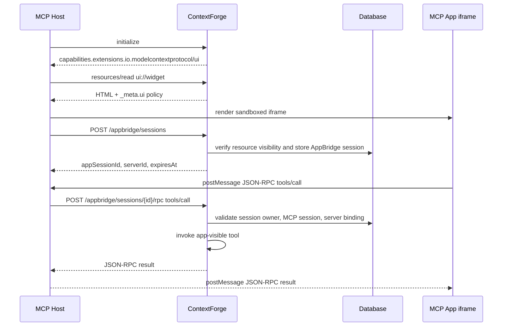

# MCP Apps

MCP Apps support lets ContextForge advertise MCP UI capabilities and enforce UI
metadata while keeping the feature disabled by default for a controlled rollout.
It introduces a narrow AppBridge path that MCP Hosts can use on behalf of
browser-hosted MCP Apps to call app-visible tools without exposing normal
model-facing tool surfaces or gateway-internal routing headers.

## Status and Scope

MCP Apps support is feature flagged:

```bash
MCPGATEWAY_MCP_APPS_ENABLED=false
MCPGATEWAY_MCP_APPS_SESSION_TTL=900
```

When disabled, the gateway does not advertise MCP Apps capabilities and rejects
MCP Apps UI resource registration or AppBridge requests.

When enabled, the gateway can:

- advertise the `io.modelcontextprotocol/ui` capability during MCP
  initialization for authenticated callers;
- store UI metadata on tools and resources through the shared
  `extensionMetadata` field;
- project known MCP Apps metadata into MCP protocol `_meta.ui` fields;
- filter app-only tools out of model-facing tool listings;
- create short-lived AppBridge sessions bound to a user, MCP session, virtual
  server, and UI resource;
- allow AppBridge RPC calls only to tools marked for app use.

The current AppBridge RPC surface supports `tools/call`, `resources/read`,
`notifications/message`, and `ping` — see
[Supported AppBridge Methods](#supported-appbridge-methods). Every other MCP
method is rejected with JSON-RPC `Method not found`.

## MCP Capability

For authenticated MCP initialization requests, the gateway advertises:

```json
{
  "capabilities": {
    "extensions": {
      "io.modelcontextprotocol/ui": {
        "version": "2026-01-26",
        "resources": {
          "schemes": ["ui://"]
        },
        "bridge": {
          "methods": ["tools/call", "resources/read", "notifications/message", "ping"]
        }
      }
    }
  }
}
```

The capability is omitted when MCP Apps are disabled or when the caller is not
authorized.

## Metadata Model

ContextForge stores MCP Apps data in the `extensionMetadata` object on tools
and resources. MCP Apps metadata is keyed by the MCP UI capability identifier:

```json
{
  "extensionMetadata": {
    "io.modelcontextprotocol/ui": {
      "audience": ["model"],
      "resourceUri": "ui://widgets/customer-search"
    }
  }
}
```

The gateway also accepts the internal snake_case form, `extension_metadata`, in
Python service paths. Public API payloads should use `extensionMetadata`.

### Deprecated Flat `ui/resourceUri` Key

Upstream servers advertise Apps metadata on the wire as `_meta`, which the
gateway folds into `extensionMetadata` during ingest. Alongside the nested
`_meta.ui` object, the gateway still honours the deprecated flat
`_meta["ui/resourceUri"]` key so that servers emitting only the older shape keep
their tool/UI association:

```json
{
  "name": "customer_search",
  "_meta": { "ui/resourceUri": "ui://widgets/customer-search" }
}
```

Precedence and handling:

- **The nested object wins.** If `_meta.ui` contains `resourceUri` (or
  `resource_uri`), the flat key is ignored. Precedence is decided by key
  *presence*, not truthiness, so a nested value that is empty or malformed stays
  authoritative and is rejected by validation rather than being silently
  replaced by the deprecated value.
- **Only well-formed `ui://` values are folded in.** An unusable flat value is
  ignored and logged. Folding it in would fail extension metadata validation and
  drop the whole tool from gateway sync, which is worse than ingesting the tool
  without a UI association.
- **Ingest only.** ContextForge always projects the nested shape outbound; it
  does not re-emit the deprecated key.

The flat key is scheduled for removal from the spec before GA, so treat it as a
compatibility path rather than a supported input format.

### Tool Metadata

Tool metadata controls who sees or can invoke the tool:

```json
{
  "name": "open_customer_widget",
  "description": "Open the customer search widget.",
  "inputSchema": {
    "type": "object",
    "properties": {
      "customerId": {
        "type": "string"
      }
    }
  },
  "extensionMetadata": {
    "io.modelcontextprotocol/ui": {
      "audience": ["model"],
      "resourceUri": "ui://widgets/customer-search"
    }
  }
}
```

Audience behavior:

| Audience | Model-facing `tools/list` | AppBridge `tools/call` |
| -------- | ------------------------- | ---------------------- |
| omitted  | visible                   | denied                 |
| `model`  | visible                   | denied                 |
| `app`    | hidden                    | allowed                |
| `model`, `app` | visible             | allowed                |

Use `audience: ["app"]` for helper tools that should only be callable by UI
code running through a validated AppBridge session.

### UI Resource Metadata

MCP Apps UI resources use the `ui://` URI scheme and must be HTML:

```json
{
  "uri": "ui://widgets/customer-search",
  "name": "Customer search widget",
  "mimeType": "text/html;profile=mcp-app",
  "content": "<div id=\"customer-search-root\"></div>",
  "extensionMetadata": {
    "io.modelcontextprotocol/ui": {
      "csp": {
        "connectDomains": ["https://api.example.com"],
        "resourceDomains": ["https://cdn.example.com"],
        "frameDomains": [],
        "baseUriDomains": []
      },
      "sandbox": ["allow-scripts", "allow-forms"],
      "permissions": []
    }
  }
}
```

For `ui://` resources, ContextForge requires all of the following:

- MCP Apps must be enabled.
- Public MCP App resources must use `text/html;profile=mcp-app`. Additional
  parameters, such as `charset=utf-8`, are accepted when the MCP App profile
  parameter is present.
- `extensionMetadata["io.modelcontextprotocol/ui"]` must exist.
- `csp` must be a non-empty object.
- `sandbox` must be a non-empty list.

## CSP and Sandbox Validation

The gateway validates CSP metadata before accepting a UI resource. Public
resource metadata should use the MCP Apps domain-list keys:

- `baseUriDomains`
- `connectDomains`
- `frameDomains`
- `resourceDomains`

Rejected CSP sources:

- `*`
- `javascript:`
- `file:`
- `data:`
- `'unsafe-inline'`
- `'unsafe-eval'`

Allowed sandbox tokens:

- `allow-downloads`
- `allow-forms`
- `allow-modals`
- `allow-popups`
- `allow-scripts`

The gateway deliberately rejects high-risk sandbox tokens such as
`allow-same-origin` and `allow-popups-to-escape-sandbox`.

Permission tokens are optional. When present, each token must be lowercase,
start with a letter, and contain only letters, digits, or hyphens.

## AppBridge Flow

AppBridge is Host-mediated. The sandboxed View exchanges JSON-RPC messages
with the Host through `postMessage`; the Host validates those messages and
uses the gateway AppBridge endpoints on the View's behalf. The View must not
receive or store the user's gateway bearer token.

AppBridge requests use short-lived sessions. A session binds four independent
facts:

- the authenticated gateway user;
- the MCP session ID;
- the virtual server ID;
- the `ui://` resource URI.



### Create an AppBridge Session

This is a Host-to-gateway request. The `Authorization` header belongs to the
Host's authenticated gateway connection and must not be injected into the
sandboxed View.

```http
POST /appbridge/sessions
Authorization: Bearer <token>
Mcp-Session-Id: <mcp-session-id>
Content-Type: application/json

{
  "resourceUri": "ui://widgets/customer-search",
  "serverId": "server-123"
}
```

Successful response:

```json
{
  "appSessionId": "<A very random-looking session id string>"
  "resourceUri": "ui://widgets/customer-search",
  "serverId": "server-123",
  "expiresAt": "2026-06-05T15:30:00+00:00"
}
```

The session endpoint requires `resources.read`. Before creating the session,
the gateway reads the requested UI resource with the caller's normal token
scope and RBAC context.

### Call an App-Visible Tool

This is also a Host-to-gateway request. The View sends the JSON-RPC payload to
the Host through AppBridge/postMessage; the Host forwards approved calls to the
gateway endpoint below.

```http
POST /appbridge/sessions/5a51a7f84aa548d99aa13f4b5f07ed76/rpc
Authorization: Bearer <token>
Mcp-Session-Id: <mcp-session-id>
Content-Type: application/json

{
  "jsonrpc": "2.0",
  "id": "call-1",
  "method": "tools/call",
  "params": {
    "name": "customer_widget_lookup",
    "arguments": {
      "customerId": "C123"
    }
  }
}
```

The RPC endpoint requires `tools.execute`. The tool must resolve within the
stored server binding and must be app-visible through
`audience: ["app"]` or `audience: ["model", "app"]`.

RBAC is enforced per method rather than inherited from the endpoint, so
`resources/read` additionally requires `resources.read`. A caller who keeps
`tools.execute` after `resources.read` is revoked cannot keep reading resources
through an existing AppBridge session.

### Supported AppBridge Methods

The RPC endpoint accepts the standard MCP messages an app may send, and rejects
everything else with `-32601`. Session ownership and the stored server binding
are validated before any method is dispatched.

| Method | Behaviour |
| --- | --- |
| `tools/call` | Invokes an app-visible tool within the bound server. |
| `resources/read` | Reads a resource within the bound server, using the identity and team scoping stored on the session. Requires `resources.read`. |
| `notifications/message` | Recorded by the gateway for observability and never proxied upstream. |
| `ping` | Answered by the gateway without an upstream call. |

`notifications/message` is a JSON-RPC notification: it carries no `id` and must
not receive a JSON-RPC response. The gateway therefore acknowledges it at the
transport level with `202 Accepted` and an empty body, matching the Streamable
HTTP rule for notification-only input. The other three methods are requests and
return a normal JSON-RPC result or error with the request `id` echoed back.

JSON-RPC distinguishes a notification from a request by the *presence* of the
`id` member, not by its value, so `"id": null` still makes the message a request
that requires a response. Because `notifications/message` is defined as
notification-only, an `id`-bearing form is rejected with `-32600 Invalid Request`
rather than acknowledged with an empty `202` that would leave the caller waiting
on a response it will never receive.

Being a core MCP method does not make a method reachable over AppBridge: the
allowlist is explicit, so `tools/list`, `resources/list`, `prompts/list`, and
`resources/subscribe` remain rejected.

## Security Invariants

MCP Apps cross a browser UI boundary, so ContextForge treats AppBridge as a
separate, constrained execution path.

The gateway enforces:

- **Feature flag deny-by-default:** all MCP Apps routes and `ui://` resources
  are unavailable unless `MCPGATEWAY_MCP_APPS_ENABLED=true`.
- **AppBridge rate limiting:** `/appbridge/sessions` and session RPC calls use
  the high-risk rate limit tier when gateway rate limiting is enabled.
- **Session ownership before bridge creation:** AppBridge sessions require an
  existing MCP session owned by the same user, unless the requester has admin
  bypass.
- **Explicit server binding:** AppBridge sessions require `serverId`; RPC calls
  cannot switch to a different server through headers or request parameters.
- **Resource visibility first:** creating an AppBridge session reads the
  `ui://` resource through normal token scoping and RBAC before persisting the
  session.
- **Tool visibility split:** app-only helper tools are hidden from model-facing
  `tools/list`; model-only tools are rejected by AppBridge.
- **Host-mediated View calls:** the sandboxed View talks to the Host through
  AppBridge messages; gateway bearer credentials remain in the Host or gateway
  integration layer.
- **No direct-proxy header trust:** AppBridge strips
  `X-Context-Forge-Gateway-Id` before invoking tools and uses the stored
  server binding instead.
- **Short-lived sessions:** sessions expire after
  `MCPGATEWAY_MCP_APPS_SESSION_TTL` seconds. Expired rows are ignored during
  lookup and cleaned up by the MCP Apps session cleanup service when enabled.
- **Strict UI policy:** `ui://` resources require explicit CSP and sandbox
  metadata before registration.

These checks complement, but do not replace, the normal two-layer ContextForge
security model: token scoping controls what a caller can see, and RBAC controls
what a caller can do.

## Operational Guidance

Enable MCP Apps only for deployments that intentionally serve trusted UI
resources:

```bash
MCPGATEWAY_MCP_APPS_ENABLED=true
MCPGATEWAY_MCP_APPS_SESSION_TTL=900
MCPGATEWAY_MCP_APPS_SESSION_CLEANUP_ENABLED=true
MCPGATEWAY_MCP_APPS_SESSION_CLEANUP_INTERVAL_SECONDS=300
MCPGATEWAY_MCP_APPS_SESSION_CLEANUP_BATCH_SIZE=1000
```

Recommended rollout steps:

1. Keep the feature disabled in production until at least one UI resource and
   its AppBridge helper tools have been reviewed together.
2. Register `ui://` resources with the narrowest CSP and sandbox policies that
   still allow the UI to function.
3. Mark helper tools with `audience: ["app"]` unless the model also needs to
   call them directly.
4. Exercise deny paths during validation: wrong MCP session, wrong server ID,
   missing CSP, missing sandbox, app calling model-only tool, and model listing
   app-only tool.
5. Monitor normal audit, token usage, and structured logs for AppBridge session
   creation and tool invocation failures.

## Related Files

- `mcpgateway/services/mcp_apps.py` - metadata validation, capability payload,
  model/app filtering, and AppBridge session helper.
- `mcpgateway/main.py` - AppBridge session and RPC endpoints.
- `mcpgateway/services/tool_service.py` - app-visible tool invocation guard.
- `mcpgateway/services/resource_service.py` - `ui://` resource validation.
- `mcpgateway/services/mcp_method_registry.py` - MCP method routing helper.
- `mcpgateway/alembic/versions/b6c7d8e9f0a1_add_mcp_app_metadata.py`
  - database migration for MCP Apps metadata and AppBridge sessions.
