# Multi-Tenancy Architecture

ContextForge implements a comprehensive multi-tenant architecture that provides secure isolation, flexible resource sharing, and granular access control. This document describes the complete multi-tenancy design, user lifecycle, team management, and resource scoping mechanisms.

## Overview

The multi-tenancy system is built around **teams as the primary organizational unit**, with users belonging to one or more teams, and all resources scoped to teams with configurable visibility levels.

### Core Principles

1. **Team-Centric**: Teams are the fundamental organizational unit for resource ownership and access control
2. **User Flexibility**: Users can belong to multiple teams with different roles in each team
3. **Resource Isolation**: Resources are scoped to teams with explicit sharing controls
4. **Invitation-Based**: Team membership is controlled through invitation workflows
5. **Role-Based Access**: Users have roles (Owner, Member) within teams that determine their capabilities
6. **Platform Administration**: Separate platform-level administration for system management

### Global Root Configuration

MCP roots are global, process-local platform configuration. They are not team-owned resources in this release: team-scoped identities cannot read or mutate roots, even when a role grants `admin.system_config`. Team-owned roots and `team_id` filtering are intentionally deferred.

Root registration is disabled by default because `ROOT_ALLOWED_SCHEMES` defaults to an empty list. Operators must explicitly allow supported schemes. `file://` roots additionally require `ROOT_ALLOW_FILE_SCHEME=true` and configured allowed file prefixes. Invalid `DEFAULT_ROOTS` fail startup; deployments using defaults must configure matching root policy before upgrade or restart.

---

## User Lifecycle & Authentication

### User Authentication Flow

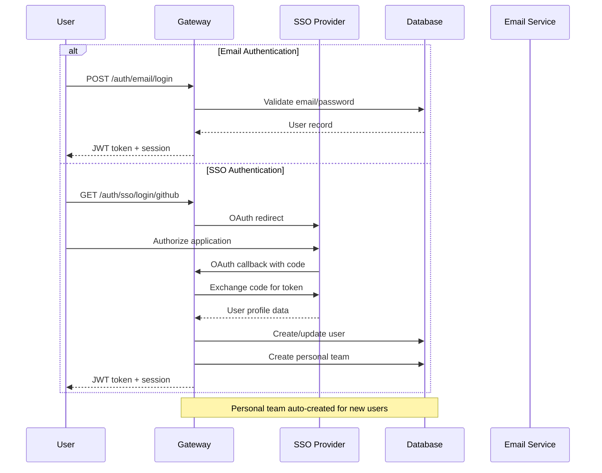

### User Creation & Personal Teams

When personal teams are enabled (default), each user gets an automatically created **Personal Team** upon registration:

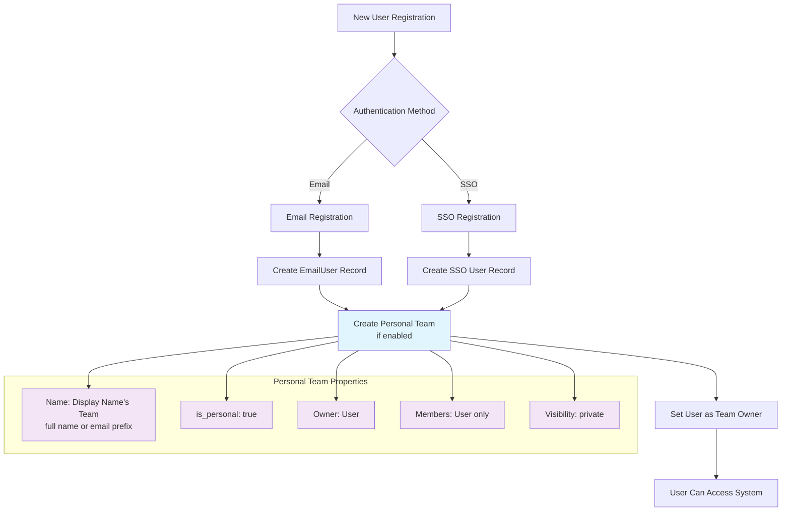

---

## Team Architecture & Management

### Team Structure & Roles

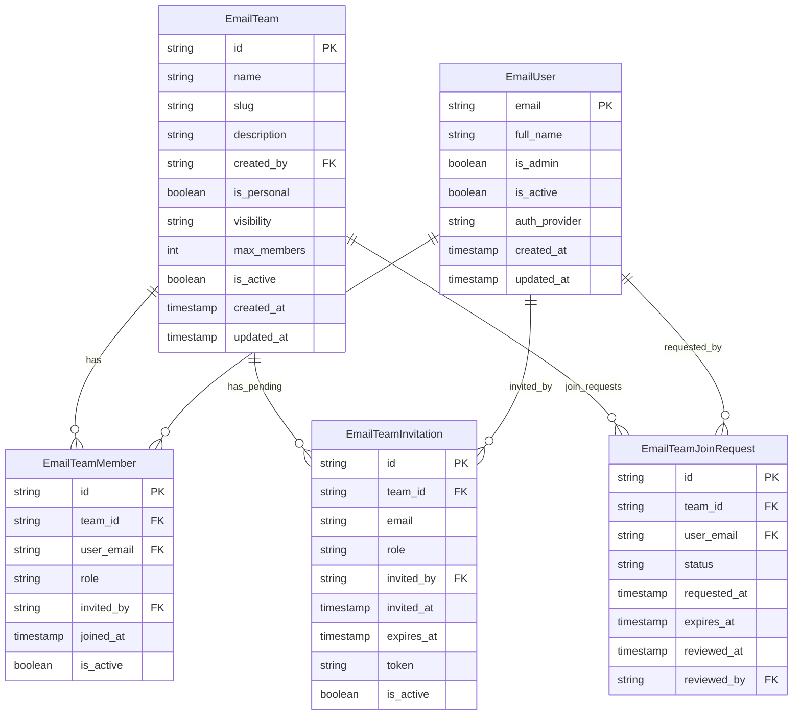

### Team Visibility & Access Model

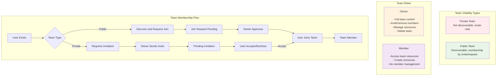

#### Team Membership Levels (Design)

**Note**: These are team membership levels, separate from RBAC roles. A user can have both a membership level and RBAC role assignments within the same team.

- **Owner** (Team Membership Level):

  - Manage team settings (name, description, visibility) and lifecycle (cannot delete personal teams).
  - Manage membership (invite, accept, change roles, remove members).
  - Full control over team resources (create/update/delete), subject to platform policies.

- **Member** (Team Membership Level):

  - Access and use team resources; can create resources by default unless policies restrict it.
  - Cannot manage team membership or team‑level settings.

**Platform Admin** is a global RBAC role (not a team membership level) with system‑wide oversight.

### Team Invitation Workflow

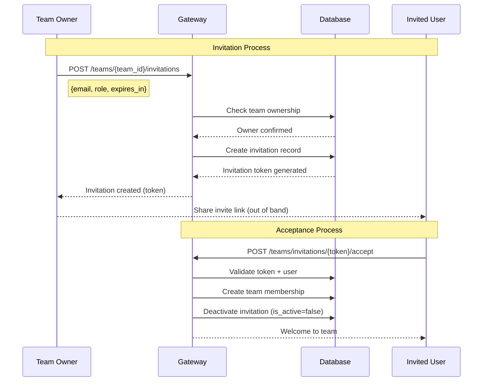

---

## Visibility Semantics

This section clarifies what Private and Public mean for teams, and what Private/Team/Public mean for resources across the system.

### Team Visibility (Design)

- Private:

  - Discoverability: Not listed to non‑members; only visible to members/owner.
  - Membership: By invitation from a team owner (request‑to‑join is not exposed to non‑members).
  - API/UI: Team shows up only in the current user's teams list; direct deep links require membership.

- Public:

  - Discoverability: Listed in public team discovery views for all authenticated users.
  - Membership: Still requires an invitation or explicit approval of a join request.
  - API/UI: Limited metadata may be visible without membership; all management and resource operations still require membership.

Note: Platform Admin is a global role and is not a team role. Admins can view/manage teams for operational purposes irrespective of team visibility.

### Resource Visibility (Design)

Applies to Tools, Servers, Resources, Prompts, and A2A Agents. All resources are owned by a team (team_id) and created by a user (owner_email).

- Private:

  - Who sees it: Only the resource owner (owner_email), and only when their token is not a public-only token (token_teams must be non-empty).
  - Team members cannot see or use it unless they are the owner.
  - Public-only tokens (token_teams=[]) cannot access private resources even as the owner.
  - Platform Admin bypass (token teams=null, is_admin=true) does NOT grant visibility or mutation access to another user's private resources (see [#4341](https://github.com/IBM/mcp-context-forge/pull/4341)). Since direct-ID reads return 404 under bypass, update/delete of another user's private resource also fails because the read-before-write gate hides the resource.
  - Mutations: Only the owner. If cross-user administrative access is required, prefer changing visibility to `team` or using a properly scoped token; admin bypass alone is insufficient.

- Team:

  - Who sees it: All members of the owning team (owners and members).
  - Mutations: Owner can update/delete; team owners can administratively manage; Platform Admin can override.

- Public:

  - Who sees it: All authenticated users across the platform (cross‑team visibility).
  - Mutations: Only the resource owner, team owners, or Platform Admins can modify/delete.

Enforcement summary:

- Listing queries include resources where (a) visibility == public, (b) team_id ∈ token_teams with visibility ∈ {team, public}, or (c) owner_email == user.email with visibility == private.
- Owner-based access applies only to private resources. Owners cannot use ownership to bypass team scoping for team-visibility resources outside their token scope.
- Public-only tokens (token_teams=[]) see only public resources — owner and team access are both suppressed.
- Read follows the same rules as list; write operations require ownership or delegated/team administrative rights.

### Resource URI uniqueness

Applies to the **Resources** entity specifically, not to the other entity types listed above. Per the MCP specification, `uri` is the resource identifier and `name` is a human-readable display label — so URIs are constrained and **names are deliberately not unique** (a name-uniqueness constraint was added in [#5158](https://github.com/IBM/mcp-context-forge/pull/5158) and reverted in [#5664](https://github.com/IBM/mcp-context-forge/pull/5664) because it broke legitimate task-scoped resources sharing a type name).

Uniqueness is enforced at two levels, and they are not identical:

**Database (`mcpgateway/db.py`, `Resource.__table_args__`)** — visibility is *not* part of any key:

| Constraint | Key | Applies when |
|---|---|---|
| `uq_team_owner_gateway_uri_resource` | `(team_id, owner_email, gateway_id, uri)` | Always |
| `uq_team_owner_uri_resource_local` (partial unique index) | `(team_id, owner_email, uri)` | `gateway_id IS NULL` |

**Application pre-check (`mcpgateway/services/resource_service.py`)** — runs before the insert so a collision surfaces as a `409` with a specific message rather than a raw `IntegrityError`. This check *is* visibility-dependent and is narrower or wider than the DB key depending on visibility:

| Visibility | Pre-check key on create |
|---|---|
| `public` | `(uri, visibility, gateway_id)` — collides across teams and owners |
| `team` | `(uri, visibility, team_id, gateway_id)` |
| `private` | `(uri, visibility, owner_email, team_id, gateway_id)` |

On update the `public` and `team` branches match on `(uri, visibility[, team_id])` without `gateway_id`; only the `private` branch includes it. Anything the pre-check misses is still caught by the database constraints above and reported as `409` via `ErrorFormatter.format_database_error`.

---

## Token Scoping Model

### How Token Scoping Works

Token scoping is the mechanism that determines which resources a user can **see** based on the `teams` claim in their JWT token.

**Key functions** in `mcpgateway/auth.py`:

- `normalize_token_teams()` — The **single source of truth** for interpreting JWT team claims into a canonical form. Used directly by API tokens and legacy tokens.
- `resolve_session_teams()` — The **single policy point** for session-token team resolution. Teams are always resolved from the database first so that revoked memberships take effect immediately. If the JWT carries a non-empty `teams` claim, the result is narrowed to the intersection of DB teams and JWT teams — letting callers scope a session to a subset of their memberships without risking stale grants. If the intersection is empty (e.g. all JWT-claimed teams have been revoked), an empty list is returned, which demotes the session to public-only scope — the user can still access public resources and their own private resources, but loses access to all team-scoped resources. An explicit `teams: []` (empty list) in the JWT is treated as "no restriction requested" and returns the full DB membership — this intentionally differs from `normalize_token_teams` where `[] → public-only`. If `email` is `None` or empty, returns `[]` (public-only) — an identity-less session token never receives admin bypass.
- `_narrow_by_jwt_teams()` — Shared intersection logic used by `resolve_session_teams`.
- API tokens and legacy tokens always use `normalize_token_teams()` directly.

### Secure-First Defaults

The token scoping system follows a **secure-first design principle**: when in doubt, access is restricted.

#### API Tokens and Legacy Tokens

These use `normalize_token_teams()` directly — the JWT `teams` claim is the sole authority:

| JWT `teams` State | `is_admin` | Result | Access Level |
|-------------------|------------|--------|--------------|
| Key MISSING | any | `[]` | PUBLIC-ONLY (secure default) |
| Key `null` | `true` | `None` | ADMIN BYPASS (unrestricted) |
| Key `null` | `false` | `[]` | PUBLIC-ONLY (no bypass) |
| Key `[]` (empty) | any | `[]` | PUBLIC-ONLY |
| Key `["t1", "t2"]` | any | `["t1", "t2"]` | TEAM-SCOPED |

#### Session Tokens

Session tokens use `resolve_session_teams()` — the **database** is the authority, and the JWT `teams` claim only narrows (never broadens) the result:

| JWT `teams` State | DB Teams | Result | Access Level |
|-------------------|----------|--------|--------------|
| Key MISSING | `["t1", "t2"]` | `["t1", "t2"]` | Full DB membership |
| Key `null` | `["t1", "t2"]` | `["t1", "t2"]` | Full DB membership |
| Key `[]` (empty) | `["t1", "t2"]` | `["t1", "t2"]` | Full DB membership (no restriction requested) |
| Key `["t1"]` | `["t1", "t2"]` | `["t1"]` | Narrowed to intersection |
| Key `["revoked"]` | `["t1", "t2"]` | `[]` | Empty intersection — public-only (fail-closed) |
| any | `None` (admin) | `None` | ADMIN BYPASS (DB authority) |

!!! warning "Critical Security Behavior"
    A **missing** `teams` key always results in public-only access for API/legacy tokens, even for admin users. Admin bypass requires **explicit** `teams: null` combined with `is_admin: true`.

!!! note "Session Token Membership Staleness"
    Session tokens skip the `_check_team_membership` re-validation in the token scoping middleware because `resolve_session_teams()` already resolved membership from the database. Membership staleness is bounded by the `auth_cache` TTL. The cache stores the full DB membership (not the per-session narrowed intersection) so that multiple sessions for the same user narrow independently.

!!! note "External IdP tokens resolve via the session table"
    Access tokens accepted from trusted external SSO providers (`SSO_API_TOKEN_AUTH_ENABLED`) are JIT-provisioned into a `token_use="session"` identity and follow the **Session Tokens** row above: `is_admin` and `teams` come from the persisted local user record via `resolve_session_teams()`, not from claims in the external token. See [SSO: Machine-to-machine API auth with external IdP tokens](../manage/sso.md#machine-to-machine-api-auth-with-external-idp-tokens).

### Multi-Team Token Behavior

When a token contains multiple teams (`teams: ["team-1", "team-2"]`):

- **Listing queries**: Return resources visible to ANY of the user's teams
- **`request.state.team_id`**: Set to the **first** team in the list
- **Resource creation**: Uses `request.state.team_id` as default if not explicitly specified

This means the first team in the token's teams array has special significance for default resource ownership.

### Return Value Semantics

The `normalize_token_teams()` and `resolve_session_teams()` functions return:

| Return Value | Meaning | Query Behavior |
|--------------|---------|----------------|
| `None` | Admin bypass | Skip ALL team filtering |
| `[]` (empty list) | Public-only | Filter to `visibility='public'` ONLY |
| `["t1", "t2"]` | Team-scoped | Filter to team resources + public |

---

## Two-Layer Security Model

ContextForge implements two distinct security layers that work together:

### Layer 1: Token Scoping (Data Filtering)

**Purpose**: Controls what resources a user CAN SEE

- Enforced by `TokenScopingMiddleware` and service layer queries
- Based on the `teams` claim in the JWT token
- Filters database queries based on visibility rules
- Applied **before** RBAC checks

### Layer 2: RBAC (Action Authorization)

**Purpose**: Controls what actions a user CAN DO

- Enforced by `@require_permission` decorators
- Based on role assignments and permission sets
- Checks if user has permission for the requested action
- Applied **after** token scoping passes

### Request Flow

```
Request: POST /tools/{id}/execute
    │
    ▼
┌─────────────────────────────┐
│ Token Scoping (Layer 1)     │ ← Can user ACCESS this tool?
│ - Check visibility          │   (public/team/private)
│ - Check team membership     │
└─────────────────────────────┘
    │ (allowed)
    ▼
┌─────────────────────────────┐
│ RBAC Permission (Layer 2)   │ ← Can user EXECUTE tools?
│ @require_permission(        │   (tools.execute permission)
│   "tools.execute")          │
└─────────────────────────────┘
    │ (allowed)
    ▼
┌─────────────────────────────┐
│ Execute Operation           │
└─────────────────────────────┘
```

### Enforcement Points Matrix

| Location | Token Scoping | RBAC | Notes |
|----------|--------------|------|-------|
| Token Scoping Middleware | ✅ | N/A | Request-level data filtering |
| REST API Endpoints | ✅ | ✅ | `@require_permission` decorators |
| RPC Handler (`/rpc`) | ✅ | Varies | Method-specific checks |
| Admin UI | ✅ | ✅ | Permission-based rendering |
| Service Layer | ✅ | N/A | Database query filtering |
| WebSocket | ✅ | ✅ | Forwards auth to /rpc |
| MCP Transport | ✅ | N/A | Streamable HTTP filtering + per-server OAuth enforcement |

---

## Resource Scoping & Visibility

### Resource Architecture

All resources in ContextForge are scoped to teams with three visibility levels:

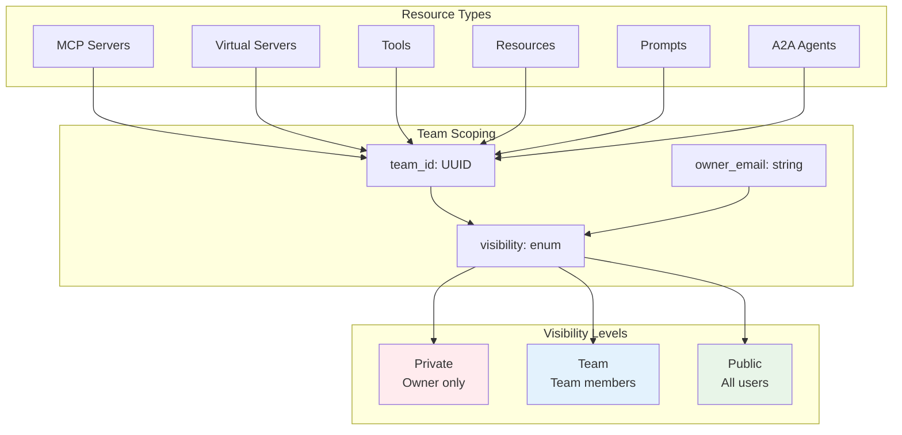

### Resource Visibility Matrix

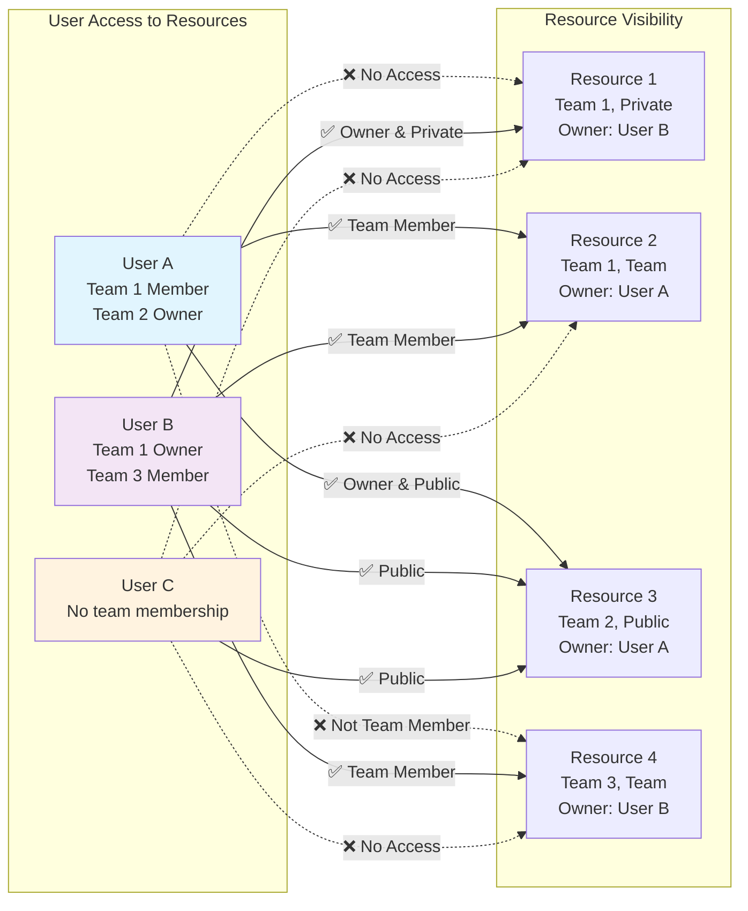

### Resource Access Control Logic

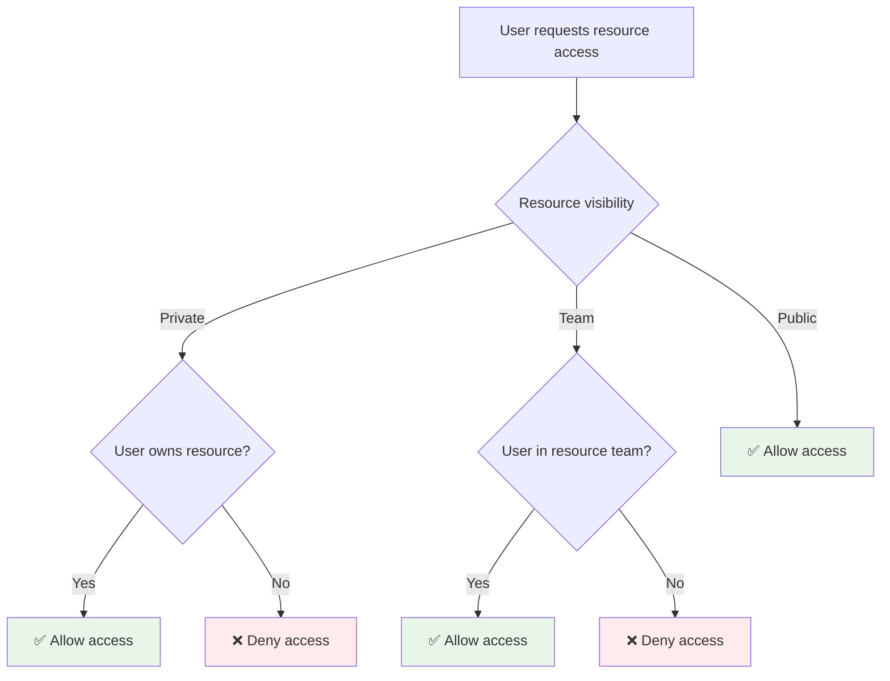

---

## Platform Administration

## Role-Based Access Control (RBAC)

ContextForge implements a comprehensive RBAC system with four built-in roles that are automatically created during system bootstrap. These roles provide granular permission management across different scopes.

### System Roles

The following roles are created automatically when the system starts:

#### 1. Platform Admin (Global Scope)
- **Permissions**: `*` (all permissions)
- **Scope**: Global
- **Description**: Platform administrator with all system-wide permissions
- **Use Case**: System administrators who manage the entire platform

#### 2. Team Admin (Team Scope)
- **Permissions**:

  - `teams.read` - View team information
  - `teams.update` - Modify team settings
  - `teams.join` - Join public teams
  - `teams.manage_members` - Add/remove team members
  - `tools.read` - View tools
  - `tools.execute` - Execute tools
  - `resources.read` - View resources
  - `prompts.read` - View prompts

- **Scope**: Team
- **Description**: Team administrator with team management permissions
- **Use Case**: Team leaders who manage team membership and resources

#### 3. Developer (Team Scope)
- **Permissions**:

  - `teams.join` - Join public teams
  - `tools.read` - View tools
  - `tools.execute` - Execute tools
  - `resources.read` - View resources
  - `prompts.read` - View prompts

- **Scope**: Team
- **Description**: Developer with tool and resource access
- **Use Case**: Team members who need to use tools and access resources

#### 4. Viewer (Team Scope)
- **Permissions**:

  - `teams.join` - Join public teams
  - `tools.read` - View tools
  - `resources.read` - View resources
  - `prompts.read` - View prompts

- **Scope**: Team
- **Description**: Read-only access to resources
- **Use Case**: Team members who only need to view resources without executing them

### Permission Categories

The RBAC system defines permissions across multiple resource categories:

#### User Management
- `users.create`, `users.read`, `users.update`, `users.delete`, `users.invite`

#### Team Management
- `teams.create`, `teams.read`, `teams.update`, `teams.delete`, `teams.manage_members`

#### Tool Management
- `tools.create`, `tools.read`, `tools.update`, `tools.delete`, `tools.execute`

#### Resource Management
- `resources.create`, `resources.read`, `resources.update`, `resources.delete`, `resources.share`

#### Prompt Management
- `prompts.create`, `prompts.read`, `prompts.update`, `prompts.delete`, `prompts.execute`

#### Server Management
- `servers.create`, `servers.read`, `servers.update`, `servers.delete`, `servers.manage`

#### Token Management
- `tokens.create`, `tokens.read`, `tokens.update`, `tokens.revoke`

#### Admin Functions
- `admin.system_config`, `admin.user_management`, `admin.security_audit`

### Role Assignment and Scope

Roles are assigned to users within specific scopes:

- **Global Scope**: Platform-wide permissions (platform_admin only)
- **Team Scope**: Team-specific permissions (team_admin, developer, viewer)
- **Personal Scope**: Individual user permissions (future use)

### Administrator Hierarchy

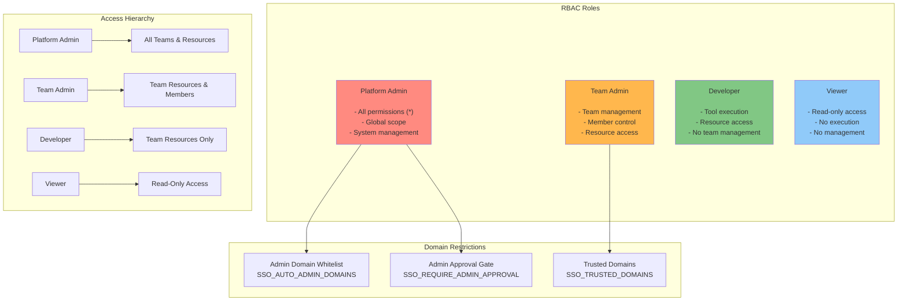

### Administrator Assignment Flow

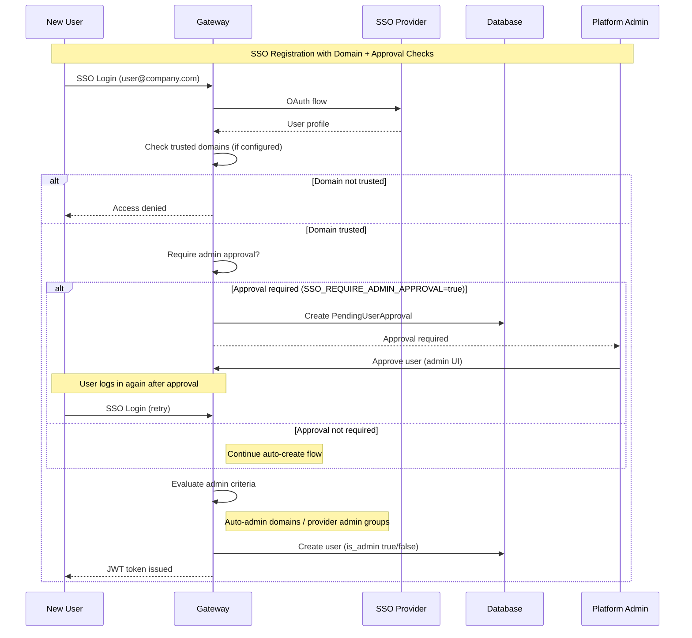

## Password Management

ContextForge now supports:

- Self-service forgot-password/reset flow:
  - `POST /auth/email/forgot-password`
  - `GET /auth/email/reset-password/{token}`
  - `POST /auth/email/reset-password/{token}`
- Admin unlock flow:
  - `POST /auth/email/admin/users/{email}/unlock`
- Admin password reset via UI and API (`PUT /auth/email/admin/users/{email}`)

Operational guidance, Kubernetes recovery commands, emergency SQL procedures, and
SMTP/reset configuration are documented in:

- [Management: Password Management & Recovery](../manage/password-management.md)

### Password Security Requirements

- Argon2id hashing for stored credentials
- One-time reset tokens (hashed in DB, configurable expiry)
- Password reset request rate limiting
- Failed login tracking and account lockout controls
- Audit events for login/reset/lockout/unlock actions

### Role-Based UI Experience

The user interface adapts based on the user's assigned roles:

#### Platform Admin Experience
- **Full System Access**: Can view and manage all teams, users, and resources across the platform
- **Global Configuration**: Access to system-wide settings, SSO configuration, and platform management
- **Cross-Team Management**: Can manage resources in any team regardless of membership
- **User Management**: Can create, modify, and delete user accounts and role assignments

#### Team Admin Experience
- **Team Management**: Can modify team settings, manage team membership (invite/remove members)
- **Resource Control**: Full access to create, modify, and delete team resources
- **Member Oversight**: Can view and manage all team members and their access
- **Limited to Assigned Teams**: Only sees teams where they have the team_admin role

#### Developer Experience
- **Tool Access**: Can view and execute tools within their teams
- **Resource Usage**: Can access and use team resources and prompts
- **No Management Rights**: Cannot manage team membership or team settings
- **Create Resources**: Can create new tools, resources, and prompts within their teams

#### Viewer Experience
- **Read and Execute Access**: Can view tools, resources, and prompts and execute tools within team scope
- **No Creation Rights**: Cannot create new resources or tools
- **No Management Access**: Cannot manage team membership or settings
- **Limited Mutation**: Can execute tools but cannot create, update, or delete resources

### Default Visibility & Sharing

- Default on create: New resources (including MCP Servers, Tools, Resources, Prompts, and A2A Agents) default to `visibility="private"` unless a different value is explicitly provided by an allowed actor. For servers created via the UI, the visibility is enforced to `private` by default.
- Team assignment: When a user creates a server and does not specify `team_id`, the server is automatically assigned to the user's personal team.
- Sharing workflow:

  - Private → Team: Make the resource visible to the owning team by setting `visibility="team"`.
  - Private/Team → Public: Make the resource visible to all authenticated users by setting `visibility="public"`.
  - Cross-team: To have a resource under a different team, create it in that team or move/clone it per policy; cross-team "share" is by visibility, not multi-team ownership.

---

## Complete Multi-Tenancy Flow

### End-to-End Resource Access

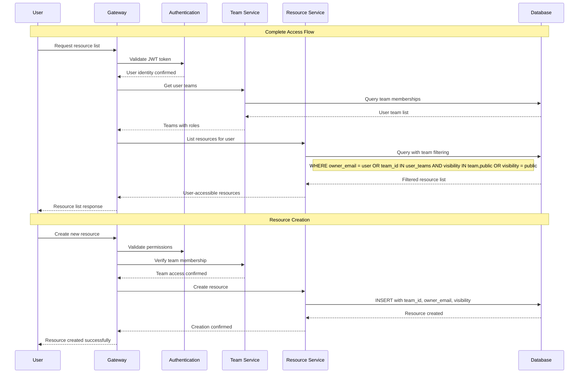

### Team-Based Resource Filtering

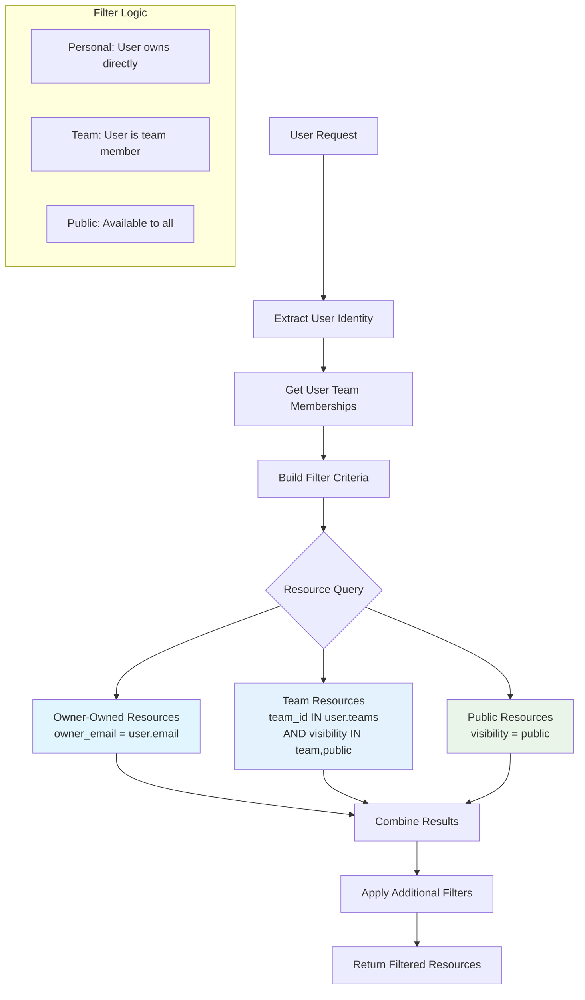

---

## Database Schema Design

### Core Multi-Tenant Schema (Key Fields)

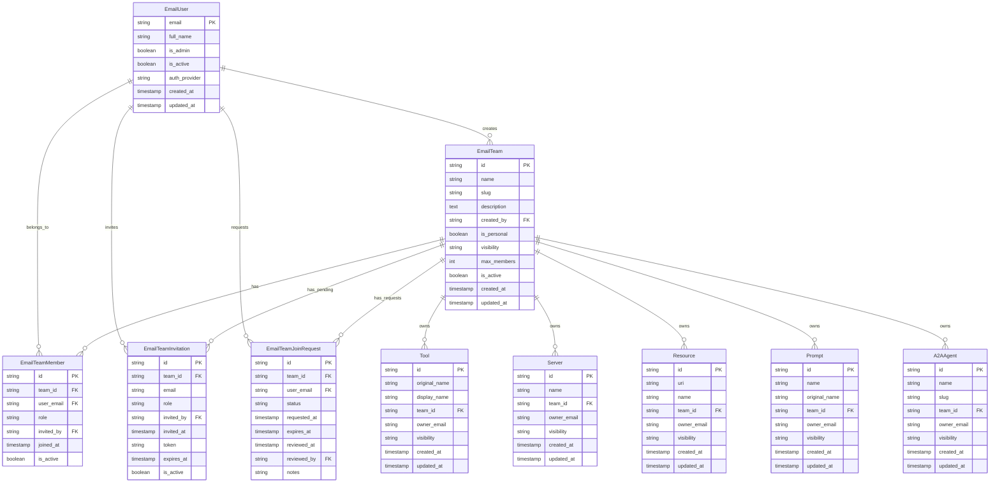

---

## API Design Patterns

### Team-Scoped Endpoints

All resource endpoints follow consistent team-scoping patterns:

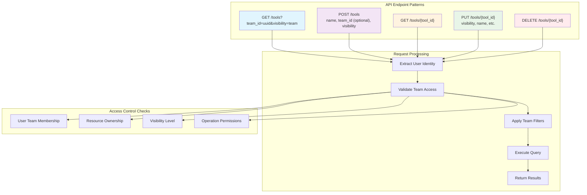

### Resource Creation Flow

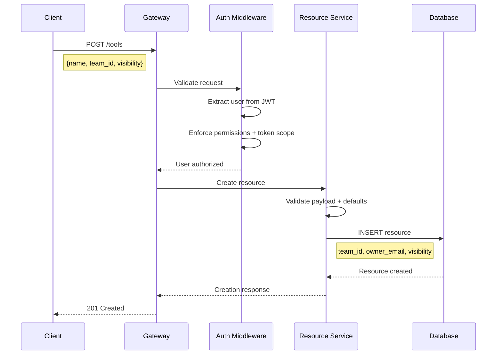

---

## Configuration & Environment

### Multi-Tenancy Configuration

```bash
#####################################
# Multi-Tenancy Configuration
#####################################

# Team Settings
AUTO_CREATE_PERSONAL_TEAMS=true
# PERSONAL_TEAM_PREFIX=personal  # optional: set to get collision-safe email-based slugs
MAX_TEAMS_PER_USER=50
MAX_MEMBERS_PER_TEAM=100        # default limit resolved at check time; platform admins are exempt

# Team Invitation Settings
INVITATION_EXPIRY_DAYS=7
REQUIRE_EMAIL_VERIFICATION_FOR_INVITES=true

# Team Governance
ALLOW_TEAM_CREATION=true
ALLOW_TEAM_JOIN_REQUESTS=true
ALLOW_TEAM_INVITATIONS=true

# Visibility
# NOTE: Resources default to 'private' (not configurable via env today)
# Allowed visibility values: private | team | public

# Platform Administration
PLATFORM_ADMIN_EMAIL=admin@company.com
PLATFORM_ADMIN_PASSWORD=changeme
PLATFORM_ADMIN_FULL_NAME="Platform Administrator"

# SSO (enable + trust and admin mapping)
SSO_ENABLED=true
SSO_TRUSTED_DOMAINS=["company.com","trusted-partner.com"]
SSO_AUTO_ADMIN_DOMAINS=["company.com"]
SSO_GITHUB_ADMIN_ORGS=["your-org"]
SSO_GOOGLE_ADMIN_DOMAINS=["your-google-workspace-domain.com"]
SSO_REQUIRE_ADMIN_APPROVAL=false

# Public team self-join flows are planned; no env toggles yet
```

---

## Security Considerations

### Multi-Tenant Security Model

```mermaid
flowchart TD
    subgraph "Security Layers"
        A["Authentication Layer

- JWT validation
- Session management"]
        B["Authorization Layer

- Team membership
- Resource ownership
- Visibility checks"]
        C["Data Isolation Layer

- Team-scoped queries
- Owner validation
- Access logging"]
    end

    subgraph "Security Controls"
        D["Input Validation

- Team ID validation
- Email format
- Role validation"]
        E["Rate Limiting

- Per-user limits
- Per-team limits
- API quotas"]
        F["Audit Logging

- Access attempts
- Resource changes
- Team modifications"]
    end

    subgraph "Attack Prevention"
        G["Team Enumeration

- UUID team IDs
- Access validation"]
        H["Resource Access

- Ownership checks
- Visibility enforcement"]
        I["Privilege Escalation

- Role validation
- Permission boundaries"]
    end

    A --> B --> C
    D --> E --> F
    G --> H --> I

    style A fill:#ffcdd2
    style B fill:#f8bbd9
    style C fill:#e1bee7
    style D fill:#c8e6c9
    style E fill:#dcedc8
    style F fill:#f0f4c3
```

### RBAC Access Control Matrix

| RBAC Role | Scope | Team Access | Resource Creation | Member Management | Team Settings | Platform Admin |
|-----------|-------|-------------|-------------------|-------------------|---------------|----------------|
| Platform Admin | Global | All teams | All resources | All teams | All settings | Full access |
| Team Admin | Team | Assigned teams | Team resources | Team members | Team settings | No access |
| Developer | Team | Member teams | Team resources | No access | No access | No access |
| Viewer | Team | Member teams | No access | No access | No access | No access |

**Note**: Team Owner/Member roles from the team management system work alongside RBAC roles. A user can have both team membership status (Owner/Member) and RBAC role assignments (Team Admin/Developer/Viewer) within the same team.

### Token Scoping Invariants

These behaviors are enforced consistently across all access paths:

1. `normalize_token_teams()` is the canonical interpreter of JWT team claims; `resolve_session_teams()` is the single policy point for session tokens (always DB-resolved)
2. For API/legacy tokens: missing `teams` key always returns `[]` (public-only, secure default); empty `teams: []` also returns `[]`. For session tokens: missing, null, or empty `teams` returns the full DB membership (no narrowing requested)
3. Admin bypass for API/legacy tokens requires BOTH `teams: null` AND `is_admin: true`; for session tokens, admin bypass is DB-derived (`is_admin` flag). In both cases the service layer requires `token_teams=None` AND `user_email=None` for unrestricted queries
4. All list endpoints pass `token_teams` to the service layer
5. Service layer applies visibility filtering based on `token_teams` via `BaseService._apply_access_control()`
6. Public-only tokens can ONLY access `visibility='public'` resources — owner and team access are both suppressed
7. Owner-based access (`owner_email`) grants visibility only for `visibility='private'` resources — it does not bypass team scoping for team-visibility resources

### Related Documentation

For detailed information on RBAC configuration, token scoping, and permission management, see [RBAC Configuration](../manage/rbac.md).

---

## Implementation Verification

### Key Requirements Checklist

- [x] **User Authentication**: Email and SSO authentication implemented
- [x] **Personal Teams**: Auto-created for every user
- [x] **Team Roles**: Owner and Member roles (platform Admin is global)
- [x] **Team Visibility**: Private and Public team types
- [x] **Resource Scoping**: All resources scoped to teams with visibility controls
- [x] **Invitation System**: Email-based invitations with token management
- [x] **Platform Administration**: Separate admin role with domain restrictions
- [x] **Access Control**: Team-based filtering for all resources
- [x] **Database Design**: Complete multi-tenant schema
- [x] **API Patterns**: Consistent team-scoped endpoints

### Critical Implementation Points

1. **Team ID Validation**: Every resource operation must validate team membership
2. **Visibility Enforcement**: Resource visibility (private/team/public) strictly enforced; team visibility (private/public) per design
3. **Owner Permissions**: Only team owners can manage members and settings
4. **Personal Team Protection**: Personal teams cannot be deleted or transferred
5. **Invitation Security**: Invitation tokens with expiration and single-use
6. **Platform Admin Isolation**: Platform admin access separate from team access
7. **Cross-Team Access**: Public resources accessible across team boundaries
8. **Audit Trail**: Permission checks and auth events audited; extended operation audit planned

---

## Gaps & Issues

- Team roles: Owner and Member only (platform Admin is global) — consistent across ERD, APIs, and UI.
- Team visibility: Private and Public.
- Resource visibility: `private|team|public` — enforced as designed.
- Public team discovery/join: Join‑request/self‑join flows to be implemented.
- Default resource visibility: Defaults to "private"; not configurable via env.
- SSO admin mapping: Domain/org lists supported; provider‑specific org checks may require provider API calls in production.

---

## Enhancements & Roadmap (Part of the Design)

- Public Team Discovery & Join Requests:

  - Add endpoints and UI to request membership on public teams; owner approval workflow; optional auto‑approve policy.
  - Admin toggles/policies to restrict who can create public teams and who can approve joins.

- Unified Operation Audit:

  - System‑wide audit log for create/update/delete across teams, tools, servers, resources, prompts, agents with export/reporting.

- Role Automation:

  - Auto‑assign default RBAC roles on resource creation (e.g., owner gets manager role in team scope; members get viewer).
  - Optional per‑team policies defining who may create public resources.

- ABAC for Virtual Servers:

  - Attribute‑based conditions layered on top of RBAC (tenant tags, data classifications, environment, time windows, client IP).

- Team/Resource Quotas and Policies:

  - Per‑team limits (tools/servers/resources/agents); per‑team defaults for resource visibility and creation rights.

- Public Resource Access Controls:

  - Fine‑grained cross‑tenant rate limits and opt‑in masking for metadata shown to non‑members.

This architecture provides a robust, secure, and scalable multi-tenant system that supports complex organizational structures while maintaining strict data isolation and flexible resource sharing capabilities.
