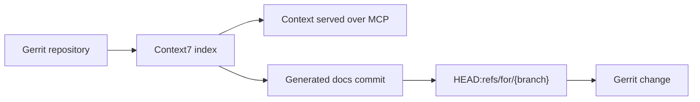

Context7 Enterprise can clone and index Gerrit repositories over HTTPS or SSH. It can also commit generated code documentation and push it to Gerrit's review namespace, so the update appears as a normal Gerrit change.



Indexing and review publishing are separate. You can index source code without sending generated files back to Gerrit.

## Before you start

Create a Gerrit service account that can read the repositories you want to index. If Context7 will submit generated documentation for review, the account also needs permission to push to `refs/for/*`.

Choose one authentication method:

- **HTTPS** with the service account username and a Gerrit HTTP password
- **SSH** with a private key registered to the service account

See [Other Git](/enterprise/integrations/other-git) for HTTPS, SSH, host key, and private CA setup.

## Connect Gerrit

<Steps>
  <Step title="Configure repository access">
    Open **Settings > Integrations > Other Git** and enter the Gerrit hostname without a URL scheme, for example `gerrit.example.com`. Context7 uses this value to match repository URLs to the credentials and review settings.

    Choose **HTTPS** or **SSH**. For HTTPS, enter the service account username and HTTP password. For SSH, enter the private key and, if available, the Gerrit `known_hosts` entry.
  </Step>

  <Step title="Configure review publishing">
    In the **Review publishing** section, set **Review push ref** to:

    ```text
    refs/for/{branch}
    ```

    `{branch}` is replaced with the branch selected when you add the repository. For a repository on `main`, Context7 runs the equivalent of:

    ```bash
    git push origin HEAD:refs/for/main
    ```

    Set **Commit email** to an email address registered to the Gerrit service account. Context7 adds a valid `Change-Id` footer to each generated documentation commit.

    <Frame>
      
    </Frame>
  </Step>

  <Step title="Add the repository">
    Open **Add Repository**, choose **Other Git**, and enter the normal Gerrit clone URL.

    ```text
    https://gerrit.example.com/a/platform/sdk
    ```

    or:

    ```text
    ssh://context7@gerrit.example.com:29418/platform/sdk
    ```
  </Step>

  <Step title="Choose how generated docs are handled">
    Enable **Index source code** to generate documentation from the codebase. Enable **Submit generated docs for review** if you also want Context7 to create a Gerrit change containing the generated files.

    Generated files are committed under `docs/codedocs/`. If review submission is off, Context7 still indexes the generated documentation internally.

    <Frame>
      
    </Frame>
  </Step>
</Steps>

## Keep the index up to date

Context7 does not currently receive Gerrit events automatically. Trigger a refresh from your post-submit CI job, or run a scheduled job that checks for new commits and refreshes changed projects.

```bash
curl -X POST "https://context7.example.com/api/projects/<project-id>/refresh" \
  -H "Authorization: Bearer <admin-api-key>"
```

A refresh pulls the latest repository state, rebuilds the index, and regenerates the code documentation. It also preserves the repository's **Submit generated docs for review** setting, so updated documentation is submitted as a new Gerrit change when publishing is enabled.

If you manage the repository list with a manifest, use [GitOps](/enterprise/gitops) for additions and configuration changes. Use the project refresh endpoint when the source repository itself receives new commits.

## Troubleshooting

### Gerrit rejects the commit identity

Confirm that **Commit email** is registered and verified on the Gerrit account used to push. Gerrit may reject commits whose author email is not associated with that account.

### Push permission is denied

Grant the service account permission to create changes by pushing to `refs/for/*` for the target project and branch. Read-only repository access is enough for indexing, but not for review publishing.

### SSH authentication fails

Confirm that the public key is registered to the service account and that the clone URL includes Gerrit's SSH port, commonly `29418`. If host key verification fails, add the server's `known_hosts` entry under **Settings > Integrations > Other Git**.

### HTTPS authentication fails

Use a Gerrit HTTP password, not the account's interactive login password. Keep the username field populated because Gerrit HTTPS cloning uses HTTP basic authentication.
