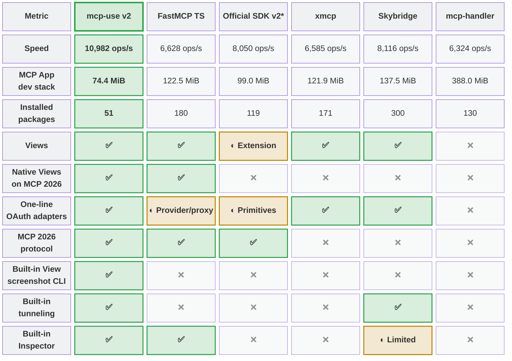

<div align="center">
  <a href="https://mcp-use.com">
    
  </a>
  <br /><br />

<div id="user-content-toc">
  <ul align="center" style="list-style: none;">
    <summary>
      <h1>The TypeScript framework for MCP</h1>
    <h3>Build, test, and ship MCP servers, ChatGPT plugins, Claude connectors</h3>
    </summary>
  </ul>
</div>


  <p>
    Fully Typed, native Views and MCP Apps support, built-in Inspector and first class Agent experience.
  </p>

  <p>
    <a href="https://docs.mcp-use.com/v2/typescript/getting-started/welcome"><strong>Documentation</strong></a>
    · <a href="https://inspector.mcp-use.com/inspector"><strong>Inspector</strong></a>
    · <a href="#examples"><strong>Examples</strong></a>
    · <a href="https://manufact.com"><strong>Deploy</strong></a>
  </p>

  <p>
    <a href="https://www.npmjs.com/package/mcp-use">
      
    </a>
    <a href="https://www.npmjs.com/package/mcp-use">
      
    </a>
    <a href="https://manufact.com">
      
    </a>
    <a href="https://github.com/mcp-use/mcp-use/blob/main/LICENSE">
      
    </a>
    <a href="https://discord.gg/XkNkSkMz3V">
      
    </a>
  </p>
  <br /><br />
</div>

> [!NOTE]
> **Migrating from v1? Give it to your agent:** [Read the migration guide →](https://docs.mcp-use.com/v2/typescript/server/migration)
>
> ```text
> Migrate this mcp-use project to v2 following
> https://docs.mcp-use.com/v2/typescript/server/migration
> ```
>
> [Read the migration guide →](https://docs.mcp-use.com/v2/typescript/server/migration)

## Get started

### Start with your agent

```text
Build an MCP server: https://mcp-use.com/prompt.md
```

[Read the prompt →](https://mcp-use.com/prompt.md)

### Start with code

```bash
npx -y create-mcp-use-app@latest
```

Run `npm run dev` in the generated project · open [`http://localhost:3000/mcp/inspector`](http://localhost:3000/mcp/inspector)

[TS Docs](https://docs.mcp-use.com/v2/typescript/getting-started/welcome)

## Everything you need to ship MCP

<table>
  <tr>
    <td width="50%" valign="top">
      <h3>Fully typed</h3>
      <p>Zod schemas flow from tools to structured results, View props, and tool calls.</p>
    </td>
    <td width="50%" valign="top">
      <h3>Native Views</h3>
      <p>Bind React Views directly to tools and ship interactive apps without custom extension wiring.</p>
    </td>
  </tr>
  <tr>
    <td width="50%" valign="top">
      <h3>Agent-first and headless</h3>
      <p>Scaffold, invoke, inspect, screenshot, and deploy through your agent.</p>
    </td>
    <td width="50%" valign="top">
      <h3>Built-in debugging tools</h3>
      <p>Inspect tools and Views in the browser or headlessly through the CLI.</p>
    </td>
  </tr>
</table>

## Quickstart

The scaffold gives you the server, TypeScript configuration, development scripts, Inspector, and a React view pipeline. Start it once and the MCP endpoint also serves a client-ready landing page with its connection URL and setup instructions.

Replace its `index.ts` with a view-bound tool like this:

<table><tr><td>
<details>
<summary><strong><code>index.ts</code></strong> — Server entry file for tool definition and metadata</summary>

```typescript
import { MCPServer } from "mcp-use";
import { z } from "zod";

const server = new MCPServer({
  name: "weather-app",
  title: "Weather App",
  version: "1.0.0",
});

const weatherInput = z.object({
  city: z.string().describe("City to look up"),
});

const weatherOutput = z.object({
  city: z.string(),
  temperature: z.number(),
  conditions: z.string(),
});

export const getWeather = server.tool(
  {
    name: "get-weather",
    title: "Get weather",
    description: "Get the current weather for a city",
    inputSchema: weatherInput,
    outputSchema: weatherOutput,
    view: { name: "weather-card" },
    annotations: {
      readOnlyHint: true,
      destructiveHint: false,
      openWorldHint: true,
    },
  },
  async ({ city }) => {
    const weather = {
      city,
      temperature: 22,
      conditions: "Sunny",
    };

    return {
      content: [
        {
          type: "text",
          text: `Weather in ${city}: ${weather.conditions}, ${weather.temperature}°C`,
        },
      ],
      structuredContent: weather,
    };
  },
);

export default server;
```

</details>
</td></tr></table>

[Explore MCP server tools →](https://mcp-use.com/docs/typescript/server/tools)

## Add Views to your tools

Create `views/weather-card/view.tsx`. The directory name matches `view.name` on the tool:

<table><tr><td>
<details>
<summary><strong><code>view.tsx</code></strong> — Return a view from your tools: React weather card</summary>

```tsx
import { useCallTool, useToolContext } from "mcp-use/react";

export default function WeatherCard() {
  const { status, toolOutput, toolInput } =
    useToolContext<"get-weather">();
  const refresh = useCallTool("get-weather");

  if (status === "pending") {
    return <p>Checking the weather in {toolInput?.city ?? "your city"}…</p>;
  }
  if (status === "error") return <p>Could not load the weather.</p>;

  const weather = refresh.data?.structuredContent ?? toolOutput;

  return (
    <main style={{ padding: 24 }}>
      <h2>{weather.city}</h2>
      <p>
        {weather.temperature}°C · {weather.conditions}
      </p>
      <button
        disabled={refresh.isPending}
        onClick={() => void refresh.callTool({ city: weather.city })}
      >
        {refresh.isPending ? "Refreshing…" : "Refresh"}
      </button>
      {refresh.error && <p>{refresh.error.message}</p>}
    </main>
  );
}
```

</details>
</td></tr></table>

<p align="center">
  
  <br />
  <sub>Build interactive UI experiences within ChatGPT with mcp-use.</sub>
</p>

[Build your first MCP App →](https://mcp-use.com/docs/typescript/mcp-apps/quickstart)

## Build

Create the production build:

```bash
npm run build
```

## Inspect

Start development mode to serve the MCP endpoint at [`http://localhost:3000/mcp`](http://localhost:3000/mcp). The Inspector is automatically available at [`http://localhost:3000/mcp/inspector`](http://localhost:3000/mcp/inspector):

```bash
npm run dev
```

<p align="center">
  
  <br />
  <sub>Invoke tools, validate inputs, and inspect interactive Views in the same development loop.</sub>
</p>

Start a tunnel from the Inspector UI or run `mcp-use dev --tunnel` to get a public URL for your local MCP server and test it with ChatGPT and Claude before deployment. [Learn more about tunneling →](https://docs.mcp-use.com/tunneling)

Inspect the same server headlessly from the terminal, invoke representative tools, and capture a View screenshot:

```bash
npm install --save-dev @mcp-use/client
npx mcp-use client connect local http://localhost:3000/mcp
npx mcp-use client local tools list
npx mcp-use client local tools call get-weather city=Tokyo
npx mcp-use screenshot \
  --server local \
  --tool get-weather \
  city=Tokyo \
  --output weather-card.png
```

## Deploy

Ship to [Manufact](https://manufact.com) and get observability, analytics, evals, submission readiness, and Git-based preview environments for free.

```bash
npm run deploy
```

Prefer to run it yourself? Follow the [self-hosting guide →](https://mcpuse-codex-v1-v2-docs-split.mintlify.site/v2/typescript/server/deployment/runtime-patterns).

## How mcp-use compares

mcp-use builds on the official TypeScript SDK v2 and adds first-class Views, typed tool-to-UI contracts, an optimized stateless runtime, the Inspector, screenshot verification, agent-first CLI workflows, and deployment.



<sub>* Includes `@modelcontextprotocol/ext-apps`, Vite, and zod for an MCP Apps-capable stack.</sub>

<sub>Install rows compare custom React MCP App development stacks. FastMCP therefore includes the Apps extension, React, Vite React plugin, Vite, TypeScript, and zod rather than only its narrower server-side component workflow. Size is actual `node_modules` disk usage after a normal npm install, including required peer dependencies.</sub>

**[Read the detailed benchmark report →](https://github.com/mcp-use/mcp-use/blob/main/benchmark.md)**

## Examples

Remix a complete MCP App, inspect the source, or deploy it as a starting point:

| Preview | App | What it demonstrates |
| --- | --- | --- |
|  | [Chart Builder](https://github.com/mcp-use/mcp-chart-builder) | Structured data rendered as interactive charts · [Open demo](https://yellow-shadow-21833.run.mcp-use.com/mcp) |
|  | [Diagram Builder](https://github.com/mcp-use/mcp-diagram-builder) | Create and edit diagrams through MCP tools · [Open demo](https://lucky-darkness-402ph.run.mcp-use.com/mcp) |
|  | [Maps Explorer](https://github.com/mcp-use/mcp-maps-explorer) | Search, detail tools, and an interactive map view · [Open demo](https://super-night-ttde2.run.mcp-use.com/mcp) |

[Browse all TypeScript examples →](https://github.com/mcp-use/mcp-use/tree/main/libraries/typescript/packages/server/examples)

## Ecosystem

| Package | Use it for |
| --- | --- |
| [`mcp-use`](https://www.npmjs.com/package/mcp-use) | TypeScript v2 server framework, React views, and CLI |
| [`@mcp-use/client`](https://www.npmjs.com/package/@mcp-use/client) | Connect to MCP servers from Node.js, browsers, React, and sandboxes |
| [`@mcp-use/agent`](https://www.npmjs.com/package/@mcp-use/agent) | Build model-powered agents on top of MCP clients |
| [`@mcp-use/inspector`](https://www.npmjs.com/package/@mcp-use/inspector) | Inspect and debug MCP servers and apps |
| [`@mcp-use/tunnel`](https://www.npmjs.com/package/@mcp-use/tunnel) | Expose local HTTP, WebSocket, and MCP servers through the managed relay |
| [`create-mcp-use-app`](https://www.npmjs.com/package/create-mcp-use-app) | Scaffold servers and interactive apps |
| [`mcp-use` for Python](https://pypi.org/project/mcp-use/) | Build Python MCP servers, clients, and agents |

- [TypeScript documentation](https://mcp-use.com/docs/typescript)
- [Python documentation](https://mcp-use.com/docs/python)
- [Inspector documentation](https://mcp-use.com/docs/inspector/index)
- [Agent documentation](https://mcp-use.com/docs/typescript/agent/index)
- [Client documentation](https://mcp-use.com/docs/typescript/client/index)

## Protocol conformance

<div align="center">
  <a href="https://github.com/mcp-use/mcp-use/actions/workflows/conformance.yml">
    
  </a>
  <a href="https://github.com/mcp-use/mcp-use/actions/workflows/conformance.yml">
    
  </a>
  <a href="https://github.com/mcp-use/mcp-use/actions/workflows/conformance.yml">
    
  </a>
  <a href="https://github.com/mcp-use/mcp-use/actions/workflows/conformance.yml">
    
  </a>
</div>

## Security and community

- [Security policy](https://github.com/mcp-use/mcp-use/blob/main/SECURITY.md)
- [Contribution guide](https://github.com/mcp-use/mcp-use/blob/main/CONTRIBUTING.md)
- [GitHub issues](https://github.com/mcp-use/mcp-use/issues)
- [Discord community](https://discord.gg/XkNkSkMz3V)
- [Manufact](https://manufact.com)
- [MIT license](https://github.com/mcp-use/mcp-use/blob/main/LICENSE)

## Contributors

Built by [Pietro](https://github.com/pietrozullo), [Luigi](https://github.com/pederzh), [Enrico](https://github.com/tonxxd), and the mcp-use community.

<a href="https://github.com/mcp-use/mcp-use/graphs/contributors">
  
</a>
