# mcp-use SDK v2 benchmarks

This report compares `mcp-use` v2 with mcp-use v1, the official TypeScript SDK,
and representative TypeScript MCP frameworks.
The established performance and launch figures use the published
`mcp-use@2.0.0-beta.64` package and were recorded on July 27–28, 2026.
All measurements used Node.js 24.15.0. The npm tarball was measured from the
`2.0.0-beta.64` package candidate after removing the temporary v1 compatibility
layer.

## Results at a glance

Compared with mcp-use v1, v2 measured:

- **27% higher median throughput:** 8,615.0 → 10,982.2 operations per second
- **55% lower cold-launch time:** 151.603 → 68.145 ms
- **82% smaller clean install:** 404.6 → 74.4 MiB
- **84% fewer installed packages:** 365 → 57
- **74% smaller npm tarball:** 1,155 → 302 KiB
- **36% smaller equivalent MCP App build:** 1.289 → 0.828 MB

## Throughput

**Higher is better.** mcp-use v2 is isolated in the first chart series; the
second series contains the other TypeScript fixtures.

```mermaid
xychart
  title "Median operations per second"
  x-axis ["tmcp", "mcp-use v2", "mcp-use v1", "Skybridge", "Official v2", "Official v1", "FastMCP TS", "xmcp", "mcp-handler"]
  y-axis "operations per second" 0 --> 20000
  bar [0, 10982, 0, 0, 0, 0, 0, 0, 0]
  bar [18425, 0, 8615, 8116, 8050, 6914, 6628, 6585, 6324]
```

mcp-use v2 delivered **10,982.2 median operations per second**, 27.5% above
mcp-use v1, 36.4% above the equivalent official TypeScript SDK v2 fixture, and
65.7% above FastMCP TypeScript.

Custom stateless request handling and optimized response paths on top of the
official SDK made mcp-use v2 the fastest TypeScript framework with native MCP
Apps support in this test.

| Framework           | Version           | Protocol       | Median ops/s |      p95 |      p99 | Stability |
| ------------------- | ----------------- | -------------- | -----------: | -------: | -------: | --------: |
| tmcp                | 1.19.4            | 2025-06-18     |     18,424.5 |     2 ms |     3 ms |       100 |
| **mcp-use v2**      | **2.0.0-beta.61** | **2026-07-28** | **10,982.2** | **4 ms** | **6 ms** |   **100** |
| mcp-use v1          | 1.34.5            | 2025-11-25     |      8,615.0 |     4 ms |     6 ms |       100 |
| Skybridge           | 1.2.6             | 2025-11-25     |      8,116.4 |     4 ms |     6 ms |       100 |
| Official SDK v2     | 2.0.0-beta.5      | 2026-07-28     |      8,049.8 |     5 ms |     7 ms |       100 |
| Official SDK v1     | 1.29.0            | 2025-11-25     |      6,914.1 |     5 ms |     7 ms |       100 |
| FastMCP TypeScript  | 1.2.0             | 2026-07-28     |      6,628.2 |     6 ms |     8 ms |       100 |
| xmcp                | 0.6.13            | 2025-11-25     |      6,585.1 |     6 ms |     8 ms |       100 |
| mcp-handler         | 1.1.0             | 2025-11-25     |      6,324.4 |     6 ms |     9 ms |       100 |

## Cold launch

**Lower is better.** Each result is the median of 100 recorded process starts
after 10 warmups, with launch order rotated across all targets.

```mermaid
xychart
  title "Median cold launch in milliseconds"
  x-axis ["Official v2", "mcp-use v2", "xmcp", "tmcp", "Official v1", "FastMCP TS", "mcp-use v1", "mcp-handler", "Skybridge"]
  y-axis "milliseconds" 0 --> 180
  bar [0, 68.145, 0, 0, 0, 0, 0, 0, 0]
  bar [67.839, 0, 68.814, 77.740, 108.039, 139.123, 151.603, 158.498, 168.260]
```

| Framework          |        Median |  Interquartile range |
| ------------------ | ------------: | -------------------: |
| Official SDK v2    |     67.839 ms |     66.881–69.522 ms |
| **mcp-use v2**     | **68.145 ms** | **67.049–69.306 ms** |
| xmcp               |     68.814 ms |     67.894–70.376 ms |
| tmcp               |     77.740 ms |     76.678–79.388 ms |
| Official SDK v1    |    108.039 ms |   106.498–110.417 ms |
| FastMCP TypeScript |    139.123 ms |   136.750–142.884 ms |
| mcp-use v1         |    151.603 ms |   149.258–154.942 ms |
| mcp-handler        |    158.498 ms |   155.539–162.677 ms |
| Skybridge          |    168.260 ms |   166.513–171.449 ms |

The mcp-use v2 and official SDK v2 distributions overlap. Their 0.306 ms
median difference is measurement noise, not a meaningful product advantage.

## Install footprint

**Lower is better.** Every row represents a development stack capable of
authoring and building a custom React MCP App, not merely installing the server
framework. Frameworks that do not include that workflow receive the same Apps,
React, Vite, and TypeScript dependencies required by the equivalent official
SDK stack.

Clean install measures the actual `node_modules` directory after a normal npm
install, including required peer dependencies and filesystem allocation. It
therefore differs from npmx's modeled size, which excludes peer dependencies.

```mermaid
xychart
  title "Custom MCP App development stack in MiB"
  x-axis ["FastMCP TS", "mcp-use v2", "xmcp", "Skybridge", "mcp-use v1"]
  y-axis "MiB on disk" 0 --> 450
  bar [0, 74.4, 0, 0, 0]
  bar [122.5, 0, 121.9, 137.5, 404.6]
```

| Framework           | Direct install set                              |         Disk | Installed packages |
| ------------------- | ----------------------------------------------- | -----------: | -----------------: |
| **mcp-use v2**      | `mcp-use + zod`                                 | **74.4 MiB** |             **57** |
| xmcp                | `xmcp + zod`                                    |    121.9 MiB |                171 |
| FastMCP TypeScript  | FastMCP + Apps extension + React/Vite build set |    122.5 MiB |                180 |
| Skybridge           | `skybridge + zod`                               |    137.5 MiB |                300 |
| mcp-use v1 baseline | `mcp-use + zod`                                 |    404.6 MiB |                365 |

mcp-use v2 had the smallest measured equivalent MCP App development stack and the
fewest installed package entries.

## Package and MCP App build size

The packed `mcp-use@2.0.0-beta.64` candidate measured **302 KiB compressed**
(309,027 bytes), 73.9% smaller than v1's 1,155 KiB tarball. Removing the
temporary v1 facade and legacy widget adapters reduced the candidate from
349 KiB (357,628 bytes) to 302 KiB, a 13.6% reduction. Its unpacked contents
fell from 1,417,415 bytes across 125 files to 1,249,746 bytes across 116 files.

For the application build, both versions used the same React launch card, CSS,
and one echo tool.

```mermaid
xychart
  title "Equivalent MCP App production build"
  x-axis ["mcp-use v2", "mcp-use v1"]
  y-axis "megabytes" 0 --> 1.4
  bar [0.828, 0]
  bar [0, 1.289]
```

| Version        |    Raw build | gzip archive | Files |
| -------------- | -----------: | -----------: | ----: |
| **mcp-use v2** | **0.828 MB** |  **214 KiB** | **4** |
| mcp-use v1     |     1.289 MB |      351 KiB |    12 |

v2 was 35.8% smaller raw and 39.1% smaller after gzip. We do not present a
cross-framework build-size leaderboard because the other projects emit
different server and UI artifact boundaries.

## How this relates to the official SDK

mcp-use builds on the official `@modelcontextprotocol/core`, `server`, and
`client` packages for protocol compatibility. It adds a typed server API,
custom stateless request and response paths, generated tool-to-View contracts,
scaffolding, Inspector integration, verification, and deployment workflows.

The official server package is the low-level protocol baseline in this report.
MCP Apps are available through the separate `@modelcontextprotocol/ext-apps`
extension and application-specific resource, metadata, build, and type wiring.
mcp-use makes Views a native framework feature and carries their contracts from
the tool definition through React and the Inspector.

mcp-use adds framework-level performance improvements on top of the official
SDK, including custom stateless request handling and optimized response paths.
Those improvements delivered **36.4% higher median throughput** than the
equivalent official SDK v2 fixture in this benchmark.

## Methodology

### Load workload

- Published packages were tested instead of local source builds, except for the
  explicitly identified `2.0.0-beta.64` package-candidate tarball measurement.
- The load generator was MCP Drill at source commit
  `284244af63efb109959ccf3cecea0000bad3bfe3`.
- Every server exposed the same `benchmark_echo` tool.
- The operation mix was one `tools/list` call for every nine `tools/call`
  operations.
- Each run used a 3-second preflight, 5 virtual users for 5 seconds, then a
  15-second ramp to 50 virtual users.
- Each target received three rounds with rotated order in its accepted
  measurement window. Every slot used a fresh framework process and fresh MCP
  Drill control and worker containers.
- Reported throughput and latency values are medians across the three accepted
  rounds.
- All nine TypeScript targets received MCP Drill's stability score of 100.

### Launch workload

- Every target received 10 warmup launches and 100 recorded launches.
- Target order rotated on every round.
- Timing started before process creation and stopped when the TCP listener
  accepted a connection.
- Each process was terminated before the next sample.

### Install and build measurements

- Clean install size is the on-disk dependency tree after installing the direct
  package set shown in the table.
- FastMCP's equivalent stack pins `@prefecthq/fastmcp-ts@1.2.0`,
  `@modelcontextprotocol/ext-apps@1.7.5`, `@vitejs/plugin-react@6.0.4`,
  React and React DOM 19.2.8, TypeScript 7.0.2, Vite 8.1.5, and zod 4.4.3.
- Installed-package counts are the physical package entries reported by
  `npm ls --all --parseable`, excluding the fixture root.
- Tarball size is the compressed size of the package produced by `pnpm pack`.
- The v1 and v2 App builds use equivalent source content and production build
  settings.

## Limits and claim boundaries

- Absolute localhost results move with machine load, scheduler behavior, and
  thermal conditions.
- The TypeScript throughput field spans protocol generations and framework
  scopes.
- Install comparisons are meaningful only when the tested package scope is
  equivalent.
- Production builds are compared only between mcp-use v1 and v2 because the
  other frameworks emit different artifact boundaries.
- The established framework results were recorded July 27–28; FastMCP
  TypeScript was recorded July 30 with the same harness and workload.
- Incomplete diagnostic and fixture-reconstruction attempts were rejected
  before aggregation; only complete accepted rotations appear above.
- There is no composite “overall score.”

Use the scoped result: **fastest TypeScript framework with native MCP Apps
support in this unified nine-framework test**.
