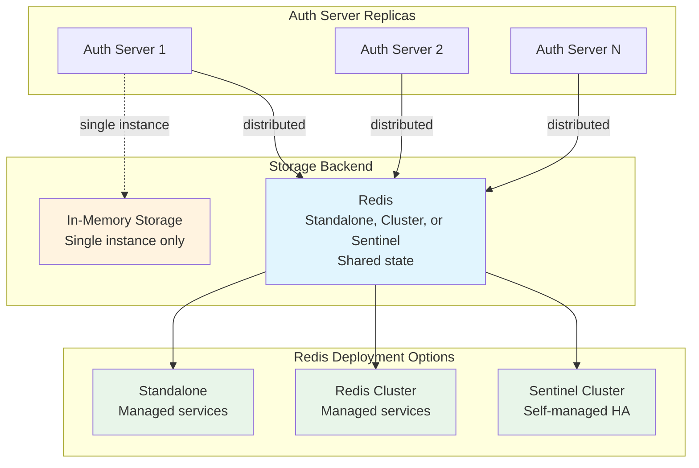

# Auth Server Storage Architecture

The embedded authorization server uses a pluggable storage backend to persist OAuth 2.0 state. This document describes the storage architecture, the available backends, and the Redis Sentinel implementation.

## Overview

The auth server stores OAuth 2.0 protocol state including access tokens, refresh tokens, authorization codes, PKCE challenges, client registrations, user accounts, and upstream IDP tokens. Two storage backends are available:

1. **Memory** (default): In-process storage with mutex-based concurrency. Suitable for single-instance deployments.
2. **Redis**: Shared storage backed by Redis. Supports standalone mode (single endpoint, suitable for managed services like GCP Memorystore Basic and AWS ElastiCache without cluster mode), Cluster mode (Redis Cluster discovery endpoint, e.g. GCP Memorystore Cluster and AWS ElastiCache with cluster mode enabled), and Sentinel mode (high-availability with automatic failover). Required for horizontal scaling across multiple auth server replicas.



## Storage Interface

The storage layer implements multiple interfaces from the [fosite](https://github.com/ory/fosite) OAuth 2.0 framework, plus ToolHive-specific extensions:

**Fosite interfaces:**
- `oauth2.AuthorizeCodeStorage` — Authorization code grant
- `oauth2.AccessTokenStorage` — Access token persistence
- `oauth2.RefreshTokenStorage` — Refresh token with rotation
- `oauth2.TokenRevocationStorage` — Token revocation (RFC 7009)
- `pkce.PKCERequestStorage` — PKCE challenge/verifier (RFC 7636)

**ToolHive extensions:**
- `ClientRegistry` — Dynamic client registration (RFC 7591)
- `UpstreamTokenStorage` — Upstream IDP token caching with user binding
- `PendingAuthorizationStorage` — In-flight authorization tracking
- `UserStorage` — Internal user accounts and provider identity linking
- `DCRCredentialStore` — DCR client secret persistence; intentionally NOT embedded in `Storage` (each backend implements it separately and call sites reach it via an explicit `stor.(DCRCredentialStore)` type assertion)

**Implementation:**
- Interface definitions: `pkg/authserver/storage/types.go`
- Memory backend: `pkg/authserver/storage/memory.go`
- Redis backend: `pkg/authserver/storage/redis.go`

## Identity resolution for pure OAuth2 providers

For pure OAuth 2.0 upstream providers (`OAuth2Config`), OIDC is unavailable and there is no ID token. `BaseOAuth2Provider.ExchangeCodeForIdentity` resolves user identity through a three-way priority chain. Each path has distinct implications for `UserStorage`, `UpstreamTokenStorage`, and the Redis secondary index.

### IdentityFromToken (priority 1)

An operator opt-in path that extracts identity claims directly from the token endpoint response body, skipping the userinfo HTTP call entirely.

**When the path triggers.** `IdentityFromToken` is configured on the upstream provider (`p.config.IdentityFromToken != nil`). The `tokenResponseRewriter` intercepts the token endpoint response and runs extraction against the raw pre-rewrite body; the result is available to `ExchangeCodeForIdentity` without an additional round-trip.

**Subject format.** Real, stable subject string extracted from the token response body via a gjson dot-notation path (e.g. `username`, `authed_user.id`). For token responses that embed a JWT, the `@upstreamjwt` modifier decodes the payload for further drilling (e.g. `access_token|@upstreamjwt|sub`). The `@upstreamjwt` modifier performs no signature verification — it is intended only for JWTs received directly from the upstream token endpoint over a TLS-authenticated channel. The returned `*Identity` carries `Synthetic = false`. Path semantics and trust-model notes are documented on the runtime config struct `IdentityFromTokenConfig` in `pkg/authserver/upstream/identity_from_token.go`. The corresponding CRD type (`cmd/thv-operator/api/v1beta1.IdentityFromTokenConfig`) is defined in a sibling PR; operator-to-runner translation of this config lands separately.

**`UserResolver` interaction.** Because `Identity.Synthetic` is false, `callback.go` takes the normal path: `UserResolver.ResolveUser` runs, a row is created (or looked up) in `UserStorage`, a provider-identities entry is written, and `UpdateLastAuthenticated` is called. `UpstreamTokens.UserID` carries the resolved internal user UUID, not the raw operator-supplied subject string.

**Reverse-index implication (Redis backend).** Stable user IDs mean `KeyTypeUserUpstream` works as designed — one set per user accumulates session IDs across re-authentications. No set churn.

**Operator visibility.** The `IdentitySynthesized` condition does not fire for upstreams using `IdentityFromToken`. `SyntheticIdentityUpstreams()` (the controller-side predicate that drives the condition) skips upstreams where either `userInfo` or `identityFromToken` is configured — only the dual-unconfigured case is reported as synthesis-mode.

**Implementation.**
- `pkg/authserver/upstream/oauth2.go` — `ExchangeCodeForIdentity` priority 1 branch
- `pkg/authserver/upstream/identity_from_token.go` — `IdentityFromTokenConfig`, `extractIdentityFromTokenResponse`, `@upstreamjwt` modifier
- `pkg/authserver/upstream/token_exchange.go` — `tokenResponseRewriter.RoundTrip` extracts identity from the raw pre-rewrite body

### UserInfo endpoint (priority 2)

Existing behavior. When `IdentityFromToken` is unconfigured and `userInfo` is set, `fetchUserInfo` is called with the upstream access token. Subject, name, and email come from the userinfo response. `UserResolver.ResolveUser` runs normally, `Identity.Synthetic` is false.

### Synthesis-mode subjects (priority 3)

Reached when both `IdentityFromToken` is unconfigured AND `userInfo` is absent. The embedded auth server synthesizes a non-PII subject by hashing the upstream access token. The mode changes what `UserStorage` and `UpstreamTokenStorage` see and is observable to operators inspecting stored state.

**When the path triggers.** Pure OAuth 2.0 upstream provider (`OAuth2Config`) where both `IdentityFromToken` and `userInfo` are unconfigured. Reached at `BaseOAuth2Provider.ExchangeCodeForIdentity` as the final fallback. OIDC providers and OAuth2 providers with either `IdentityFromToken` or `userInfo` configured are not affected.

**Subject format.** `tk-` followed by 32 lowercase hex characters (the first 16 bytes of `SHA-256(accessToken)`), e.g. `tk-89abcdef0123456789abcdef01234567`. The output is opaque: assuming the upstream issues opaque (non-JWT) bearer tokens, the digest reveals nothing about the input that an attacker holding a candidate token could not already confirm by re-hashing. The returned `*Identity` carries `Synthetic = true`; the `upstream.IsSynthesizedSubject(string)` predicate lets bare-string consumers recognize the prefix.

**`UserResolver` bypass.** The bypass is gated on `Identity.Synthetic` in `callback.go` — synthesis is the only path that sets this field. Synthetic identities skip `UserResolver.ResolveUser` entirely — no row is created in `UserStorage`, no entry is written to provider-identities, and `UpdateLastAuthenticated` is not called. The synthesized subject rotates per access token, so persisting it would create a fresh `users` row on every re-authentication. `UpstreamTokens.UserID` therefore carries the `tk-…` value directly rather than a stable internal UUID.

**Reverse-index implication (Redis backend).** The `KeyTypeUserUpstream` secondary-index set under `thv:auth:{ns:name}:user:upstream:{userID}` is designed around stable user IDs — one set per user, holding all of that user's session IDs. Under synthesis the userID rotates with every re-authentication, so each session lands in its own one-element set. Reads continue to work, but set churn is much higher than under OIDC. The existing TODO in `pkg/authserver/storage/redis.go` (on `warnOnCleanupErr`) to scan and clean up stale secondary-index entries applies, and synthesis-mode workloads make a periodic scan more important.

**Operator visibility.** When at least one configured OAuth2 upstream has both `userInfo` and `identityFromToken` unconfigured, the controller surfaces the `IdentitySynthesized` condition on the `MCPExternalAuthConfig` and `VirtualMCPServer` status (Reason `IdentitySynthesizedActive`, naming the affected upstreams). The condition flips to `False` (Reason `IdentitySynthesizedInactive`) once every upstream has either `userInfo` or `identityFromToken` configured.

**Implementation.**
- `pkg/authserver/upstream/oauth2.go` — `synthesizeIdentity`, `synthesizeSubjectFromAccessToken`, `IsSynthesizedSubject`
- `pkg/authserver/upstream/types.go` — `Identity.Synthetic`
- `pkg/authserver/server/handlers/callback.go` — `UserResolver` bypass on `Identity.Synthetic`
- `cmd/thv-operator/controllers/mcpexternalauthconfig_controller.go` and `cmd/thv-operator/controllers/virtualmcpserver_controller.go` — `IdentitySynthesized` advisory condition

## Memory Backend

The in-memory backend uses Go maps protected by `sync.RWMutex` for thread safety. A background goroutine runs periodic cleanup of expired entries.

**Characteristics:**
- Zero external dependencies
- State is lost on restart
- Cannot be shared across replicas
- Suitable for development and single-instance deployments

**Implementation:** `pkg/authserver/storage/memory.go`

## Redis Backend

The Redis backend stores all OAuth 2.0 state as JSON-serialized values in Redis.

### Connection Architecture

Three connection modes are supported. Client construction (standalone, cluster, or sentinel), connection-mode validation, TLS plumbing, and connectivity verification are delegated to the shared `github.com/stacklok/toolhive-core/redis` package; `RedisStorage` holds a `redis.UniversalClient` so the same call sites work across all three topologies.

- **Standalone**: A single endpoint for managed Redis services. The caller is responsible for endpoint availability (the managed service handles HA internally).
- **Cluster**: A Redis Cluster discovery endpoint (e.g., GCP Memorystore Cluster, AWS ElastiCache with cluster mode enabled). Enabled by setting `clusterMode: true` alongside `addr` in the CRD.
- **Sentinel**: Connects via Sentinel for self-managed high-availability deployments. Sentinel handles master discovery, automatic failover, and configuration updates.

### Multi-Tenancy

Each auth server instance has a unique key prefix derived from its Kubernetes namespace and name:

```
thv:auth:{namespace:name}:
```

The `{namespace:name}` portion is a Redis hash tag. In standalone and Sentinel modes, hash tags have no functional effect but impose no overhead. The format ensures keys remain co-located in the same hash slot if the deployment were ever migrated to Redis Cluster.

**Implementation:** `pkg/authserver/storage/redis_keys.go`

### Key Design

Keys follow the pattern `{prefix}{type}:{id}`:

```
thv:auth:{default:my-server}:access:abc123
thv:auth:{default:my-server}:refresh:def456
thv:auth:{default:my-server}:user:user-uuid
```

Secondary indexes use Redis Sets to enable reverse lookups:

```
thv:auth:{default:my-server}:reqid:access:{request-id}  → {sig1, sig2}
thv:auth:{default:my-server}:user:upstream:{user-id}     → {session1, session2}
```

### Consistency Model

The implementation uses different strategies based on consistency requirements:

- **Lua scripts** for strict atomicity: upstream token storage with user reverse-index cleanup, last-used timestamp updates
- **Pipelines** (`MULTI`/`EXEC`) for batched operations: authorization code invalidation, token session creation with secondary index updates
- **Individual commands** with best-effort cleanup: token revocation, refresh token rotation — partial failures are safe since orphaned keys expire via TTL

### Refresh Coordination Scope

When an expired upstream access token is refreshed, `UpstreamTokenStorage` derives
an opaque SHA-256 identity from its storage-defined row representation. For
Redis, that representation is its row-key format, so two `(sessionID,
providerName)` pairs that happen to produce the same Redis key resolve to the
same identity — that's safe because they're the same physical row. What's
not allowed is aliasing two pairs that are genuinely different rows: the
auth server uses this identity only as the key for its in-process
`singleflight` group, then its leader re-reads the row before redeeming its
refresh token, and it reads/writes under its own sessionID — aliasing
distinct rows would cross credentials between sessions. This prevents
duplicate redemption from stale concurrent callers served by the same
process; the identity is not persisted, logged, or exposed.

This is deliberately narrower than #4122: it does not provide distributed
coordination across replicas, row-addressed mutation, compare-and-swap, or any
other cross-process consistency guarantee. Redis remains the durable storage
backend, while each replica coordinates only its own in-flight refreshes.

### Serialization

All values are stored as JSON. The implementation uses defensive copies on read and write to prevent caller mutations from affecting stored data.

### TTL Management

Redis TTL is used for all time-bounded data. TTL values are derived from OAuth 2.0 token lifetimes:

| Data Type | Default TTL |
|---|---|
| Access tokens | 1 hour |
| Refresh tokens | 30 days |
| Authorization codes | 10 minutes |
| PKCE requests | 10 minutes |
| Invalidated codes | 30 minutes |
| DCR-issued clients (public and confidential) | 30 days |
| Users / Providers | No expiry |

These TTLs apply to the Redis backend. The in-memory backend holds no
wall-clock TTL; it instead bounds growth with a capacity cap
(`DefaultMaxClients`) and evicts the oldest DCR-issued client on overflow. A
pre-provisioned client (no DCR marker) is never evicted. Both backends renew
on the same proven-use signal (a successful token exchange/refresh): Redis
extends the key's TTL, and the in-memory backend moves the client to the back
of its eviction queue, so an actively-used DCR-issued client survives
overflow the same way in either backend.

**Behaviour change for public clients registered after this feature:** a
public client registered before this change was stored as a bare
`*fosite.DefaultClient` on the Redis backend, which does not carry a
`token_endpoint_auth_method`, so fosite never enforced one at the token
endpoint. A public client registered after this change persists
`token_endpoint_auth_method: "none"` and is rebuilt as a
`*fosite.DefaultOpenIDConnectClient`, so fosite's method pinning now applies.
The practical effect: a public client that presents a **non-empty**
`client_secret` alongside its `client_id` at `/oauth/token` is now rejected
with `invalid_client`, where it previously succeeded. An empty or absent
secret is unaffected — fosite only compares secrets when one is actually
presented. Clients registered before the upgrade keep the old, tolerant
behavior (their stored row has no auth method and reads back as a bare
`*fosite.DefaultClient`). This brings the Redis backend in line with the
in-memory backend, which has always enforced the pinned method.

## Configuration

### CRD Configuration

In Kubernetes, storage is configured via the `MCPExternalAuthConfig` CRD:

```
MCPExternalAuthConfig
  └── spec.embeddedAuthServer.storage
        ├── type: "memory" | "redis"
        └── redis
              ├── addr (standalone or cluster)  ─── mutually exclusive ───  sentinelConfig
              │                                                                   ├── masterName
              │                                                                   ├── sentinelAddrs[] (or sentinelService)
              │                                                                   └── db
              ├── clusterMode (optional; requires addr — Redis Cluster protocol)
              ├── aclUserConfig
              │     ├── usernameSecretRef  (optional; omit for password-only AUTH)
              │     └── passwordSecretRef
              ├── tls (optional, master/cluster connection)
              │     ├── caCertSecretRef
              │     └── insecureSkipVerify
              ├── sentinelTls (optional, sentinel connection only)
              │     ├── caCertSecretRef
              │     └── insecureSkipVerify
              ├── dialTimeout
              ├── readTimeout
              └── writeTimeout
```

**Implementation:** `cmd/thv-operator/api/v1beta1/mcpexternalauthconfig_types.go`

### RunConfig Serialization

When passing configuration across process boundaries (operator → proxy-runner), the CRD configuration is converted to `RunConfig` format where Secret references become environment variable references.

**Implementation:** `pkg/authserver/storage/config.go`

## Security Considerations

- **ACL or legacy authentication**: Redis ACL users (Redis 6+) provide fine-grained access control. When a username is omitted, go-redis sends legacy password-only `AUTH`, which is required for managed Redis tiers that do not expose an ACL subsystem (e.g. GCP Memorystore Basic/Standard HA, Azure Cache for Redis).
- **Key prefix isolation**: Each auth server is restricted to its own key prefix via Redis ACL rules (`~thv:auth:*`).
- **Credential handling**: In Kubernetes, credentials are stored in Secrets and injected as environment variables. They are never written to disk or logged.
- **TLS support**: TLS is supported for both master and Sentinel connections via `tls` and `sentinelTls` in the CRD. For managed services with private CAs (e.g. GCP Memorystore), provide the CA certificate via `caCertSecretRef`.

### Enabling Confidential Client Registration

`AllowConfidentialClientRegistration` is **off by default**. `/oauth/register` is unauthenticated, so turning it on lets any caller who can reach the endpoint obtain a client credential — there is no admission control to gate who receives a `client_secret`. This is the tradeoff an operator accepts by enabling it, not a bug to work around.

Enabling it permits DCR of confidential clients: `/oauth/register` additionally accepts `token_endpoint_auth_method` values `client_secret_basic` and `client_secret_post` (the `"none"` public-client default still applies on omission), and mints a `client_secret` returned exactly once in the registration response — it is never re-displayed or re-issued. Disabling the flag afterward does not revoke or reject secrets already minted; this gate only affects new registrations, not the token endpoint's acceptance of existing credentials.

Two restrictions apply regardless of this flag:

- Confidential registrations are restricted to https non-loopback redirect URIs. A client reachable on loopback or a private scheme is, by construction, a public client that cannot keep a secret (OAuth 2.1 §2.1), so the server declines to mint it one.
- Combining `AllowConfidentialClientRegistration` with `InsecureAllowHTTP` is rejected outright at validation — an unauthenticated secret-minting endpoint served over plaintext HTTP would let the secret be intercepted in transit.

See the [storage consequences](#ttl-management) above for what happens to a confidential registration over time: it is subject to the same DCR-issued TTL/eviction behavior as public DCR clients (Redis TTL, or the in-memory backend's capacity-bounded eviction).

**Loopback issuers need an explicit opt-in when combined with confidential registration.** The issuer validation that underlies `InsecureAllowHTTP` always permits a plain-`http://` issuer when the host is loopback (e.g. `http://localhost:18080`), independent of that flag — this is what lets `thv` run locally without setting up TLS just to test the auth server. Forcing TLS onto every loopback deployment instead would just push operators toward `InsecureAllowHTTP`, which is worse: that flag also disables the non-loopback host check entirely.

But a loopback `http://` issuer combined with `AllowConfidentialClientRegistration: true` means a locally-run auth server would mint client secrets over cleartext at an unauthenticated endpoint — validation rejects that combination by default. Set `InsecureAllowConfidentialOverLoopbackHTTP: true` to opt in when that is genuinely fine, e.g. local development and testing where the traffic never leaves the machine. Do not rely on this shape in a cluster: the server still listens on all interfaces there, "localhost" in the issuer is just a string, and such a deployment is only reachable in practice through something like a port-forward — it does not make the connection loopback-only. Both flags default to off, so nothing changes for an existing deployment unless the operator sets them.

**Rate limiting on `/oauth/register`.** Because the endpoint is unauthenticated, `Handler` also rate-limits it: 1 request/second sustained with a burst of 5 (`pkg/authserver/server/handlers/handler.go`). The limiter is a field on `Handler`, so it is per-process — running N replicas behind a load balancer allows roughly N times the configured rate, not a shared global rate.

### Forcing Confidential Registration for a Known Redirect URI

Some MCP clients declare themselves public in their RFC 7591 registration (`token_endpoint_auth_method: "none"`) and then refuse to proceed because the response carries no `client_secret` — a self-contradictory request no conformant server can satisfy as written (Perplexity is the known case). RFC 7591 §3.2.1 permits the server to substitute client metadata during registration, and `ForceConfidentialRedirectURIs` uses that permission: it lists redirect URIs that are always registered as confidential clients, overriding a requested (or omitted) `"none"`.

A registration whose `redirect_uris` contains an exact match for one of these entries is issued a real `client_secret` and reported back as `token_endpoint_auth_method: "client_secret_post"` — never `client_secret_basic`, because the Python MCP SDK these clients are typically built on constrains the field to `["none", "client_secret_post"]`.

Matching is exact string equality, not a prefix or scheme-relaxed match, and that is deliberate rather than a limitation: an attacker who registers with someone else's callback URI is issued a secret for a client whose authorization codes are delivered to that someone else's redirect endpoint, not to the attacker. The secret is useless without also controlling the callback, so exact matching does not hand out a usable credential for another client.

This requires `AllowConfidentialClientRegistration` to be set, and every entry must be an https non-loopback URI — the same restriction ordinary confidential DCR already enforces, so the override cannot be used to slip a secret to a client that is a public client by construction.

Treat each entry as a targeted, temporary accommodation for one misbehaving client, not a general escape hatch: by setting it, the operator is asserting that the specific client behind that redirect URI can actually hold a secret. Remove the entry once the client is fixed to handle a `"none"` registration correctly.

## Related Documentation

- [Redis Storage Configuration Guide](../redis-storage.md) — User-facing setup guide
- [Operator Architecture](09-operator-architecture.md) — CRD and controller design
- [Core Concepts](02-core-concepts.md) — Platform terminology

## CIMD Storage Decorator

When `authServer.cimd.enabled: true` is set, the embedded authorization server wraps its storage backend in a `CIMDStorageDecorator` before passing it to fosite. This decorator enables MCP clients to present HTTPS URLs as `client_id` values without first calling `/oauth/register`.

### What it does

`CIMDStorageDecorator` embeds the full `storage.Storage` interface and overrides only `GetClient`. When fosite calls `GetClient("https://vscode.dev/oauth/client-metadata.json")` during an authorization request:

1. The decorator detects the HTTPS URL using `oauthproto.IsClientIDMetadataDocumentURL`
2. It fetches the Client ID Metadata Document from that URL via `pkg/oauthproto/cimd.FetchClientMetadataDocument` (with SSRF protection, 10 KB cap, 5-second timeout)
3. It builds a `fosite.Client` from the document fields, caches it with a configurable TTL, and returns it to fosite
4. Concurrent fetches for the same URL are deduplicated via `singleflight`

All other `Storage` methods (`RegisterClient`, token storage, upstream token storage, etc.) delegate to the underlying backend unchanged. DCR clients (opaque string IDs) continue to work exactly as before.

### Unwrap pattern

`CIMDStorageDecorator` implements `Unwrap() Storage` to expose the concrete backend through the decorator layer. Two call sites in `pkg/authserver/server_impl.go` depend on this:

- **`DCRCredentialStore` assertion** (`newServer`): The `DCRCredentialStore` interface is narrower than `Storage` and not embedded in it. The assertion `unwrapStorage(stor).(storage.DCRCredentialStore)` reaches the concrete backend through the decorator.
- **`RedisStorage` migration** (`runLegacyMigration`): A type assertion to `*storage.RedisStorage` is needed to run a one-shot data migration. Same `unwrapStorage` call.

Both call sites use the `unwrapStorage(stor)` helper rather than asserting directly on `stor`.

### Air-gapped environments

When the embedded authorization server is deployed in an environment that cannot reach `https://toolhive.dev/oauth/client-metadata.json` or any public CIMD metadata URL, set `authServer.cimd.enabled: false`. Clients will fall back to DCR (`/oauth/register`) which uses only the local storage backend and requires no outbound connectivity.

**Implementation:** `pkg/authserver/storage/cimd_decorator.go`
